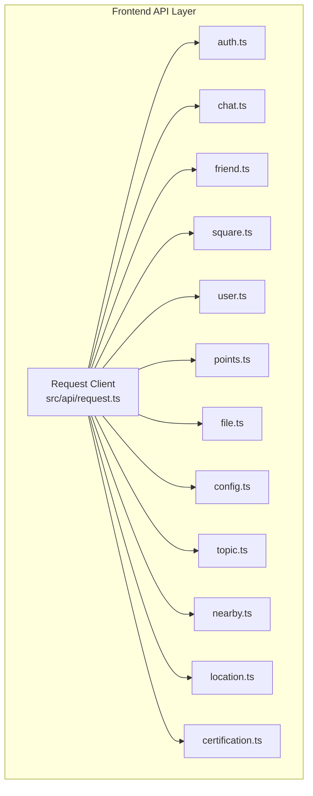
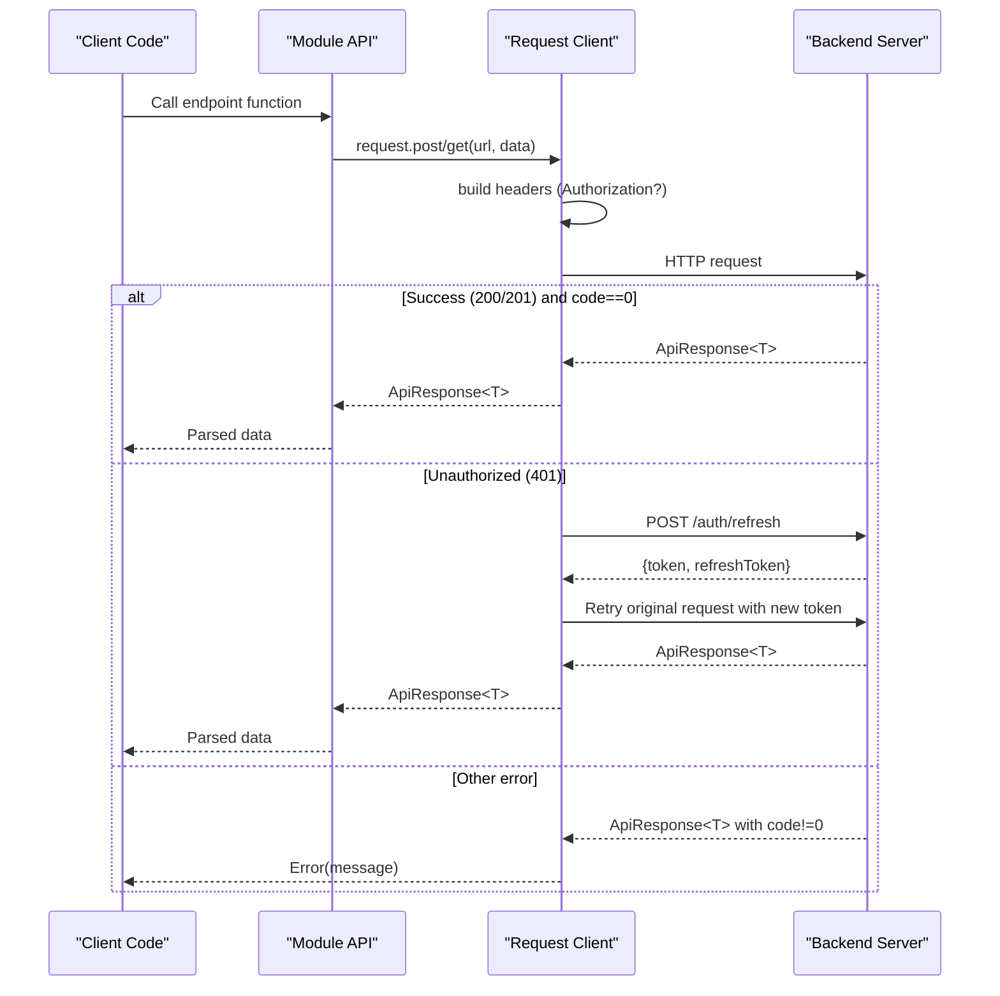
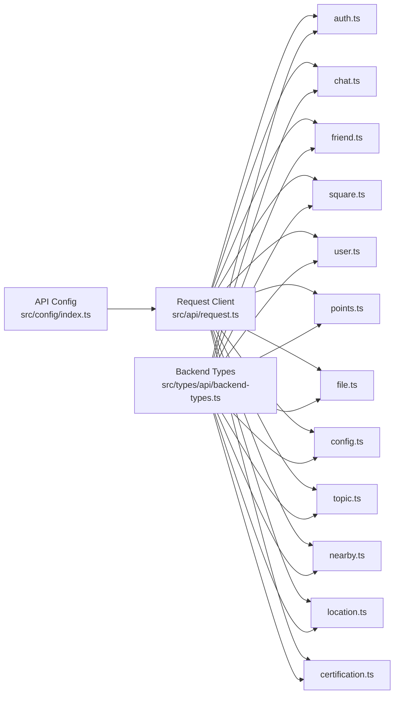

# API Reference

<cite>
**Referenced Files in This Document**
- [auth.ts](file://src/api/modules/auth.ts)
- [chat.ts](file://src/api/modules/chat.ts)
- [friend.ts](file://src/api/modules/friend.ts)
- [square.ts](file://src/api/modules/square.ts)
- [user.ts](file://src/api/modules/user.ts)
- [points.ts](file://src/api/modules/points.ts)
- [file.ts](file://src/api/modules/file.ts)
- [config.ts](file://src/api/modules/config.ts)
- [topic.ts](file://src/api/modules/topic.ts)
- [location.ts](file://src/api/modules/location.ts)
- [nearby.ts](file://src/api/modules/nearby.ts)
- [certification.ts](file://src/api/modules/certification.ts)
- [request.ts](file://src/api/request.ts)
- [backend-types.ts](file://src/types/api/backend-types.ts)
- [backend-api.ts](file://src/types/api/backend-api.ts)
</cite>

## Table of Contents
1. [Introduction](#introduction)
2. [Project Structure](#project-structure)
3. [Core Components](#core-components)
4. [Architecture Overview](#architecture-overview)
5. [Detailed Component Analysis](#detailed-component-analysis)
6. [Dependency Analysis](#dependency-analysis)
7. [Performance Considerations](#performance-considerations)
8. [Troubleshooting Guide](#troubleshooting-guide)
9. [Conclusion](#conclusion)
10. [Appendices](#appendices)

## Introduction
This document provides a comprehensive API reference for the WeTogether platform. It organizes endpoints by functional modules (authentication, chat, friends, square, user, points, file, configuration, topics, location, nearby, and certification), and describes HTTP methods, URL patterns, request/response schemas, authentication requirements, pagination, filtering, and error handling. It also documents the shared request layer, headers, and common usage patterns for client integrations.

## Project Structure
The frontend API layer is organized by feature modules under src/api/modules/*. Each module exposes typed functions that wrap a shared request client. The request client handles base URL, headers, retries, and token refresh logic. Shared backend DTOs and API namespaces live under src/types/api/*.

**Diagram sources**
- [request.ts:1-228](file://src/api/request.ts#L1-L228)
- [auth.ts:1-57](file://src/api/modules/auth.ts#L1-L57)
- [chat.ts:1-42](file://src/api/modules/chat.ts#L1-L42)
- [friend.ts:1-61](file://src/api/modules/friend.ts#L1-L61)
- [square.ts:1-98](file://src/api/modules/square.ts#L1-L98)
- [user.ts:1-97](file://src/api/modules/user.ts#L1-L97)
- [points.ts:1-55](file://src/api/modules/points.ts#L1-L55)
- [file.ts:1-335](file://src/api/modules/file.ts#L1-L335)
- [config.ts:1-33](file://src/api/modules/config.ts#L1-L33)
- [topic.ts:1-167](file://src/api/modules/topic.ts#L1-L167)
- [nearby.ts:1-96](file://src/api/modules/nearby.ts#L1-L96)
- [location.ts:1-46](file://src/api/modules/location.ts#L1-L46)
- [certification.ts:1-55](file://src/api/modules/certification.ts#L1-L55)

**Section sources**
- [request.ts:1-228](file://src/api/request.ts#L1-L228)
- [backend-types.ts:1-764](file://src/types/api/backend-types.ts#L1-L764)
- [backend-api.ts:1-641](file://src/types/api/backend-api.ts#L1-L641)

## Core Components
- Request Client: Centralizes HTTP calls, headers, timeouts, and automatic token refresh on 401 errors. It injects Authorization: Bearer <token> when present in storage.
- Module APIs: Each module exports strongly typed functions for endpoints, returning ApiResponse<T> wrappers.

Key behaviors:
- Authentication: Requires Bearer token for protected endpoints; automatically refreshes tokens via /auth/refresh.
- Pagination: Many endpoints support page and pageSize query parameters.
- Filtering: Some endpoints accept additional filters (e.g., sort, type).
- Error handling: Non-zero code responses surface message and toast feedback; 401 triggers refresh/retry or redirects to login.

**Section sources**
- [request.ts:15-225](file://src/api/request.ts#L15-L225)
- [backend-types.ts:4-9](file://src/types/api/backend-types.ts#L4-L9)

## Architecture Overview
The API follows a RESTful pattern with JSON payloads and a unified response envelope. Clients call module functions which delegate to the request client. The request client manages headers and retries.

**Diagram sources**
- [request.ts:75-208](file://src/api/request.ts#L75-L208)
- [auth.ts:46-49](file://src/api/modules/auth.ts#L46-L49)

## Detailed Component Analysis

### Authentication API
Endpoints for SMS, registration, login, password reset, token refresh, and updating current user profile.

- POST /auth/sms/send
  - Request body: SmsDto
  - Response: ApiResponse<{ message: string }>
  - Auth: none
  - Example: Send verification code for register/login/reset

- POST /auth/register
  - Request body: RegisterDto
  - Response: ApiResponse<{ token: string; user: User }>
  - Auth: none
  - Notes: Includes optional invite code

- POST /auth/login
  - Request body: LoginDto
  - Response: ApiResponse<{ token: string; user: User }>
  - Auth: none

- POST /auth/reset-password
  - Request body: ResetPasswordDto
  - Response: ApiResponse<{ message: string }>
  - Auth: none

- POST /auth/refresh
  - Request body: { refreshToken: string }
  - Response: ApiResponse<{ token: string; refreshToken: string }>
  - Auth: none

- PUT /user/me
  - Request body: Partial update fields
  - Response: ApiResponse<User>
  - Auth: required

Validation and data types:
- SmsDto.type: union of register, login, reset_password
- RegisterDto: mobile, email, code, password, nickname, optional gender, inviteCode
- LoginDto: mobile, password
- ResetPasswordDto: mobile, email, code, newPassword

Common usage:
- After login, store token and refreshToken in secure storage.
- On 401 responses, the request client automatically refreshes tokens and retries.

**Section sources**
- [auth.ts:33-56](file://src/api/modules/auth.ts#L33-L56)
- [backend-types.ts:374-425](file://src/types/api/backend-types.ts#L374-L425)
- [request.ts:35-73](file://src/api/request.ts#L35-L73)

### Chat API
Messaging endpoints for sending messages, retrieving history, conversations, and marking as read.

- POST /chat/send
  - Request body: SendMessageDto
  - Response: ApiResponse<{ id: number }>
  - Auth: required

- GET /chat/history/:userId
  - Query params: page?, pageSize?, beforeId?
  - Response: ApiResponse<{ data: Message[]; total: number }>
  - Auth: required

- GET /chat/conversations
  - Response: ApiResponse<{ data: Conversation[]; unreadCount: number }>
  - Auth: required

- GET /chat/messages
  - Query params: page?, pageSize?
  - Response: ApiResponse<{ data: Message[]; total: number }>
  - Auth: required

- PUT /chat/read/:userId
  - Response: ApiResponse<{ success: boolean }>
  - Auth: required

Validation and data types:
- SendMessageDto.receiverId, content, optional msgType

Pagination and filtering:
- page, pageSize supported in history and messages
- beforeId optional for cursor-style pagination

**Section sources**
- [chat.ts:18-41](file://src/api/modules/chat.ts#L18-L41)
- [backend-types.ts:540-547](file://src/types/api/backend-types.ts#L540-L547)

### Friends API
Friendship management including follow/unfollow, friend requests, add friend, status, blacklist, and lists.

- GET /friend/list
  - Response: ApiResponse<Friendship[]>
  - Auth: required

- GET /friend/following
  - Response: ApiResponse<Friendship[]>
  - Auth: required

- GET /friend/following/:userId
  - Response: ApiResponse<Friendship[]>
  - Auth: required

- GET /friend/followers
  - Response: ApiResponse<Friendship[]>
  - Auth: required

- GET /friend/followers/:userId
  - Response: ApiResponse<Friendship[]>
  - Auth: required

- POST /friend/follow
  - Body: { friendId: number }
  - Response: ApiResponse<Friendship>
  - Auth: required

- POST /friend/unfollow
  - Body: { friendId: number }
  - Response: ApiResponse<{ success: boolean }>
  - Auth: required

- POST /friend/request
  - Body: { friendId: number, message?: string }
  - Response: ApiResponse<Friendship>
  - Auth: required

- POST /friend/accept
  - Body: { friendId: number }
  - Response: ApiResponse<{ success: boolean }>
  - Auth: required

- POST /friend/add-friend
  - Body: { friendId: number }
  - Response: ApiResponse<{ success: boolean; pointsConsumed: number }>
  - Auth: required

- GET /friend/status/:userId
  - Response: ApiResponse<FriendshipStatus>
  - Auth: required

- DELETE /friend/:userId
  - Response: ApiResponse<{ success: boolean }>
  - Auth: required

- POST /friend/block
  - Body: { friendId: blockedUserId, reason?: string }
  - Response: ApiResponse<UserBlacklist>
  - Auth: required

- POST /friend/unblock
  - Body: { friendId: blockedUserId }
  - Response: ApiResponse<{ success: boolean }>
  - Auth: required

- GET /friend/blocklist
  - Response: ApiResponse<UserBlacklist[]>
  - Auth: required

Validation and data types:
- FriendshipStatus includes flags and thresholds
- UserBlacklist includes reason and timestamps

**Section sources**
- [friend.ts:16-61](file://src/api/modules/friend.ts#L16-L61)
- [backend-types.ts:294-339](file://src/types/api/backend-types.ts#L294-L339)

### Square API
Community feed for posts, comments, likes, and reports.

- POST /square/posts
  - Body: CreatePostDto
  - Response: ApiResponse<SquarePost>
  - Auth: required

- GET /square/posts
  - Query params: page?, pageSize?, sort: hot|latest
  - Response: ApiResponse<{ list: Post[]; total: number }>
  - Auth: required

- GET /square/posts/:id
  - Response: ApiResponse<SquarePost>
  - Auth: required

- DELETE /square/posts/:id
  - Response: ApiResponse<{ success: boolean }>
  - Auth: required

- POST /square/comment
  - Body: CreateCommentDto
  - Response: ApiResponse<{ id: number }>
  - Auth: required

- DELETE /square/comments/:commentId
  - Response: ApiResponse<{ success: boolean; message: string }>
  - Auth: required

- GET /square/posts/:postId/comments
  - Query params: page?, pageSize?, sort: time|hot
  - Response: ApiResponse<{ list: Comment[]; total: number }>
  - Auth: required

- GET /square/comments/:commentId/replies
  - Query params: page?, pageSize?
  - Response: ApiResponse<{ list: Comment[]; total: number }>
  - Auth: required

- POST /square/like
  - Body: LikeDto
  - Response: ApiResponse<{ isLiked: boolean }>
  - Auth: required

- POST /square/posts/:postId/like
  - Response: ApiResponse<{ isLiked: boolean }>
  - Auth: required

- DELETE /square/posts/:postId/like
  - Response: ApiResponse<{ isLiked: boolean }>
  - Auth: required

- POST /square/report
  - Body: ReportDto
  - Response: ApiResponse<PostReport>
  - Auth: required

Validation and data types:
- CreatePostDto: content, optional images[]
- CreateCommentDto: postId, optional parentId, replyToId, replyToUserId, content
- LikeDto: targetId, targetType (1=post, 2=comment)
- ReportDto: postId, reason (1-5), optional description

Pagination and filtering:
- Posts: page, pageSize, sort
- Comments: page, pageSize, sort
- Replies: page, pageSize

**Section sources**
- [square.ts:43-97](file://src/api/modules/square.ts#L43-L97)
- [backend-types.ts:464-535](file://src/types/api/backend-types.ts#L464-L535)

### User API
User-centric operations including profile updates, points, avatar upload, mobile change, reporting, and blocking.

- GET /user/me
  - Response: ApiResponse<User>
  - Auth: required

- PUT /user/me
  - Body: UpdateUserDto
  - Response: ApiResponse<User>
  - Auth: required

- PUT /user/profile
  - Body: UpdateProfileDto
  - Response: ApiResponse<User>
  - Auth: required

- GET /user/points
  - Response: ApiResponse<{ points: number }>
  - Auth: required

- GET /user/:id
  - Response: ApiResponse<object>
  - Auth: required

- POST /user/avatar
  - Body: FormData with avatar file
  - Response: ApiResponse<{ url: string }>
  - Auth: required

- PUT /user/mobile
  - Body: { newMobile: string; code: string }
  - Response: ApiResponse<{ message: string; mobile: string }>
  - Auth: required

- POST /user/report
  - Body: { userId: number; reason: number; description: string }
  - Response: ApiResponse<{ message: string }>
  - Auth: required

- POST /user/block/:userId
  - Response: ApiResponse<{ message: string }>
  - Auth: required

Validation and data types:
- UpdateProfileDto supports nickname, mobile, avatarId/url/path, gender, bio, city, birthDate

Notes:
- Avatar upload uses multipart/form-data; server persists and returns URL.

**Section sources**
- [user.ts:23-96](file://src/api/modules/user.ts#L23-L96)
- [backend-types.ts:136-151](file://src/types/api/backend-types.ts#L136-L151)

### Points API
Points balance, sign-in, logs, and configuration.

- GET /points/balance
  - Response: ApiResponse<{ balance: number; totalEarned?: number; totalConsumed?: number }>
  - Auth: required

- POST /points/sign
  - Response: ApiResponse<{ points: number; continuousDays: number; pointsEarned?: number; balance?: number }>
  - Auth: required

- GET /points/sign/status
  - Response: ApiResponse<{ signedToday: boolean; continuousDays: number }>
  - Auth: required

- GET /points/logs
  - Query params: page, pageSize, type?
  - Response: ApiResponse<{ list: PointsLog[]; total: number }>
  - Auth: required

- GET /points/config
  - Response: ApiResponse<PointsConfig[]>
  - Auth: required

- GET /points-configs
  - Response: ApiResponse<PointsConfig[]>
  - Auth: required

Validation and data types:
- PointsLog: id, type (1|2), source, amount, balance, remark, createdAt

**Section sources**
- [points.ts:32-54](file://src/api/modules/points.ts#L32-L54)
- [backend-types.ts:344-369](file://src/types/api/backend-types.ts#L344-L369)

### File API
File management including upload token generation, saving records, fetching URLs, listing, and deletion.

- GET /file/config
  - Response: ApiResponse<FileConfig>
  - Auth: required

- GET /file/:fileId/url
  - Response: ApiResponse<{ url: string }>
  - Auth: required

- GET /file/:fileId
  - Response: ApiResponse<FileInfo>
  - Auth: required

- GET /file/my/list
  - Query params: page, pageSize, type?
  - Response: ApiResponse<{ list: FileInfo[]; total: number }>
  - Auth: required

- DELETE /file/:fileId
  - Response: ApiResponse<void>
  - Auth: required

- POST /file/upload-token
  - Body: { type: string; fileName?: string }
  - Response: ApiResponse<{ token: string; key: string; domain: string; expire: number }>
  - Auth: required

- POST /file/save
  - Body: SaveFileRecordDto
  - Response: ApiResponse<FileInfo>
  - Auth: required

- POST /user/avatar (avatar-specific upload)
  - Body: { filePath: string }
  - Response: ApiResponse<{ id: number; filePath: string; url: string }>
  - Auth: required

Validation and data types:
- FileConfig: baseUrl, bucket, maxSize, allowedTypes, optional keys
- FileInfo: id, fileName, filePath, url, optional metadata
- SaveFileRecordDto: fileName, filePath, originalName, fileSize, mimeType, fileExt, bucketName, width?, height?, type

Notes:
- Uploads integrate with cloud provider; after successful upload, a file record is saved and returned.

**Section sources**
- [file.ts:38-334](file://src/api/modules/file.ts#L38-L334)
- [backend-types.ts:230-289](file://src/types/api/backend-types.ts#L230-L289)

### Configuration API
Public configuration retrieval.

- GET /public/config
  - Response: ApiResponse<PublicConfig>
  - Auth: none

PublicConfig fields include app, signup, square, chat, friend, points, certification toggles and limits.

**Section sources**
- [config.ts:29-32](file://src/api/modules/config.ts#L29-L32)
- [config.ts:3-27](file://src/api/modules/config.ts#L3-L27)

### Topics API
Topics-related endpoints (detail, posts, stats, participants, joins/leaves, publishing, searching, hot lists).

- GET /topics/:topicId
  - Response: ApiResponse<TopicDetail>
  - Auth: required

- GET /topics/:topicId/posts
  - Query params: page, pageSize, sort: hot|latest
  - Response: ApiResponse<{ list: TopicPost[]; total: number; hasMore: boolean }>
  - Auth: required

- POST /topics/:topicId/follow
  - Response: ApiResponse<{ success: boolean }>
  - Auth: required

- DELETE /topics/:topicId/follow
  - Response: ApiResponse<{ success: boolean }>
  - Auth: required

- POST /square/posts (publish topic post)
  - Body: { content: string; images?: string[]; topicId: number }
  - Response: ApiResponse<{ id: number }>
  - Auth: required

- GET /topics/:topicId/stats
  - Response: ApiResponse<TopicStats>
  - Auth: required

- GET /topics/:topicId/participants
  - Query params: page, pageSize
  - Response: ApiResponse<{ list: TopicParticipant[]; total: number }>
  - Auth: required

- POST /square/posts/:postId/like (like topic post)
  - Response: ApiResponse<{ isLiked: boolean }>
  - Auth: required

- DELETE /square/posts/:postId/like (unlike topic post)
  - Response: ApiResponse<{ isLiked: boolean }>
  - Auth: required

- GET /topics/search
  - Query params: keyword, page, pageSize
  - Response: ApiResponse<{ list: TopicDetail[]; total: number }>
  - Auth: required

- GET /topics/hot
  - Query params: page, pageSize
  - Response: ApiResponse<{ list: TopicDetail[]; total: number }>
  - Auth: required

Validation and data types:
- TopicDetail, TopicPost, TopicStats, TopicParticipant structures defined in module.

**Section sources**
- [topic.ts:63-166](file://src/api/modules/topic.ts#L63-L166)
- [backend-types.ts:428-459](file://src/types/api/backend-types.ts#L428-L459)

### Location API
Location services including current position, reverse geocoding, saving user city, and retrieving user city.

- GET /location/current
  - Response: ApiResponse<LocationInfo>
  - Auth: required

- POST /location/geocode
  - Body: { latitude: number; longitude: number }
  - Response: ApiResponse<LocationInfo>
  - Auth: required

- POST /location/save-city
  - Body: { city: string }
  - Response: ApiResponse<void>
  - Auth: required

- GET /location/user-city
  - Response: ApiResponse<{ city: string }>
  - Auth: required

Validation and data types:
- LocationInfo: latitude, longitude, city, optional province/district/address

**Section sources**
- [location.ts:19-45](file://src/api/modules/location.ts#L19-L45)

### Nearby API
Nearby users discovery, location updates, greetings, and statistics.

- GET /nearby/users
  - Query params: latitude, longitude, maxDistance?, gender?, minAge?, maxAge?, page, pageSize, sortBy: distance|active
  - Response: ApiResponse<{ list: NearbyUser[]; total: number; hasMore: boolean }>
  - Auth: required

- POST /nearby/location
  - Body: { latitude: number; longitude: number }
  - Response: ApiResponse<void>
  - Auth: required

- GET /nearby/location
  - Response: ApiResponse<{ latitude: number; longitude: number; city: string; updateTime: number }>
  - Auth: required

- POST /nearby/users/:userId/hello
  - Body: { content?: string }
  - Response: ApiResponse<void>
  - Auth: required

- GET /nearby/stats
  - Response: ApiResponse<{ totalCount: number; onlineCount: number; newCount: number }>
  - Auth: required

Validation and data types:
- NearbyUser: id, nickname, avatar, optional age/gender/city/bio/tags, distance, distanceText, lastActiveTime, isOnline, optional hasSaidHello

**Section sources**
- [nearby.ts:41-95](file://src/api/modules/nearby.ts#L41-L95)

### Certification API
User certification submission, types, and personal list.

- GET /certification-types
  - Response: ApiResponse<{ list: CertificationType[] }>
  - Auth: required

- GET /certification-type
  - Response: ApiResponse<{ list: CertificationType[] }>
  - Auth: required

- POST /certification
  - Body: CreateCertificationDto
  - Response: ApiResponse<Certification>
  - Auth: required

- GET /certification/list
  - Query params: status? (0|1|2)
  - Response: ApiResponse<{ list: Certification[] }>
  - Auth: required

- GET /certification/:id
  - Response: ApiResponse<Certification>
  - Auth: required

Validation and data types:
- CertificationType: code, name, icon, description, requiredFields[]
- Certification: id, userId, type, imageUrl, description, status (0|1|2), optional rejectReason, reviewedAt, createdAt
- CreateCertificationDto: type, imageUrl, description?

**Section sources**
- [certification.ts:34-54](file://src/api/modules/certification.ts#L34-L54)
- [backend-types.ts:564-587](file://src/types/api/backend-types.ts#L564-L587)

## Dependency Analysis
The request client depends on API configuration and storage for tokens. Modules depend on the request client and share backend DTOs.

**Diagram sources**
- [request.ts:1-228](file://src/api/request.ts#L1-L228)
- [backend-types.ts:1-764](file://src/types/api/backend-types.ts#L1-L764)
- [auth.ts:1-57](file://src/api/modules/auth.ts#L1-L57)
- [chat.ts:1-42](file://src/api/modules/chat.ts#L1-L42)
- [friend.ts:1-61](file://src/api/modules/friend.ts#L1-L61)
- [square.ts:1-98](file://src/api/modules/square.ts#L1-L98)
- [user.ts:1-97](file://src/api/modules/user.ts#L1-L97)
- [points.ts:1-55](file://src/api/modules/points.ts#L1-L55)
- [file.ts:1-335](file://src/api/modules/file.ts#L1-L335)
- [config.ts:1-33](file://src/api/modules/config.ts#L1-L33)
- [topic.ts:1-167](file://src/api/modules/topic.ts#L1-L167)
- [nearby.ts:1-96](file://src/api/modules/nearby.ts#L1-L96)
- [location.ts:1-46](file://src/api/modules/location.ts#L1-L46)
- [certification.ts:1-55](file://src/api/modules/certification.ts#L1-L55)

**Section sources**
- [request.ts:1-228](file://src/api/request.ts#L1-L228)
- [backend-types.ts:1-764](file://src/types/api/backend-types.ts#L1-L764)

## Performance Considerations
- Pagination: Prefer page/pageSize on list endpoints to avoid large payloads.
- Filtering: Use supported query parameters (sort, type, status) to reduce server load.
- Caching: Store frequently accessed public configs and user profiles locally to minimize network requests.
- Token refresh: The request client batches concurrent 401-triggered refreshes and retries original requests automatically.

## Troubleshooting Guide
Common issues and resolutions:
- 401 Unauthorized
  - Cause: Expired or missing Bearer token.
  - Resolution: The request client attempts refresh; if unsuccessful, clears stored tokens and navigates to login.
- Non-zero response code
  - Cause: Validation or business rule failure.
  - Resolution: Inspect message field and handle gracefully (e.g., show user-friendly toast).
- Network failures
  - Cause: Connectivity or timeout.
  - Resolution: Retry after network recovery; inspect error details.

Authentication headers:
- Authorization: Bearer <token> is injected automatically when token exists in storage.

Rate limiting and versioning:
- No explicit rate limit headers observed in the request client.
- API versioning is not indicated in the request client or module paths; assume current API version is served at base URL.

**Section sources**
- [request.ts:90-181](file://src/api/request.ts#L90-L181)

## Conclusion
WeTogether’s API is structured around feature modules with a shared request client that enforces consistent headers, pagination, and token refresh. The backend DTOs and API namespaces define strong typing for requests and responses. Clients should leverage pagination, filtering, and the built-in token refresh behavior to deliver robust experiences.

## Appendices

### Request/Response Envelope
All endpoints return a uniform envelope:
- code: numeric status (0 indicates success)
- message: human-readable message
- data: endpoint-specific payload
- timestamp: server timestamp

**Section sources**
- [backend-types.ts:4-9](file://src/types/api/backend-types.ts#L4-L9)

### Pagination Patterns
- Query parameters: page, pageSize
- Responses: include total count and list items
- Some endpoints return hasMore booleans for infinite scroll scenarios

Examples:
- Square posts: GET /square/posts
- Square comments: GET /square/posts/:postId/comments
- File list: GET /file/my/list
- Nearby users: GET /nearby/users
- Topic posts: GET /topics/:topicId/posts

**Section sources**
- [square.ts:47-74](file://src/api/modules/square.ts#L47-L74)
- [file.ts:242-253](file://src/api/modules/file.ts#L242-L253)
- [nearby.ts:41-49](file://src/api/modules/nearby.ts#L41-L49)
- [topic.ts:70-81](file://src/api/modules/topic.ts#L70-L81)

### Error Codes and Handling
- Success: code == 0
- Business/validation errors: code != 0 with message
- Authentication errors: 401 triggers automatic refresh/retry or login redirect

**Section sources**
- [request.ts:90-181](file://src/api/request.ts#L90-L181)
- [backend-types.ts:4-9](file://src/types/api/backend-types.ts#L4-L9)