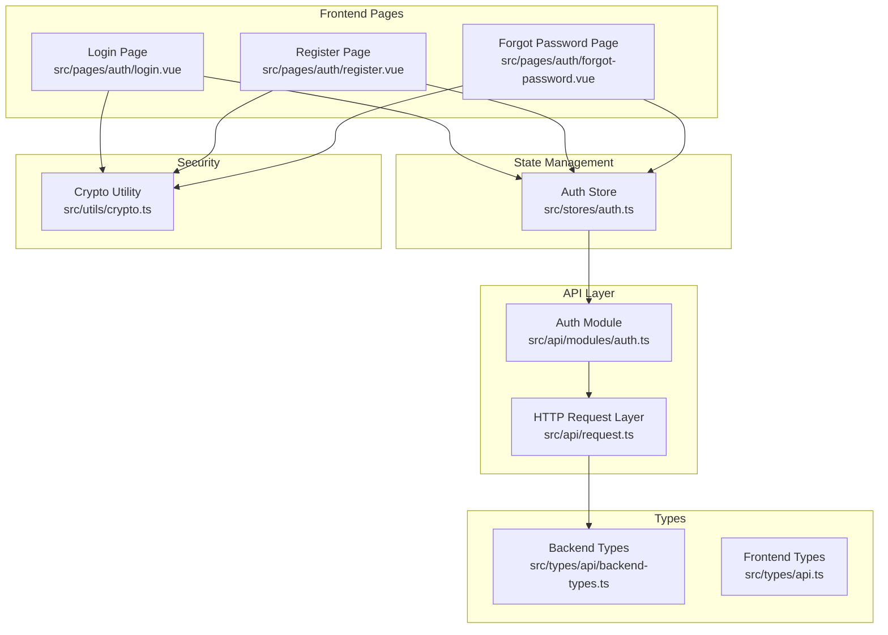
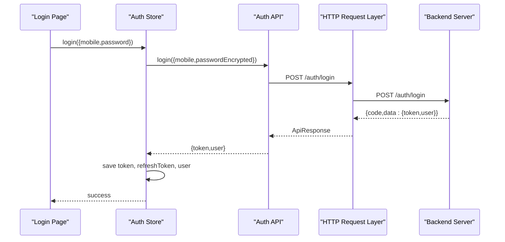
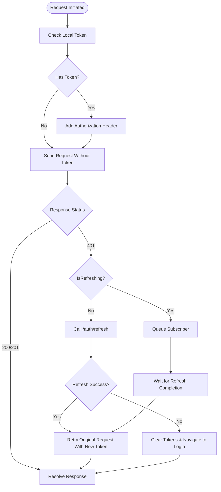
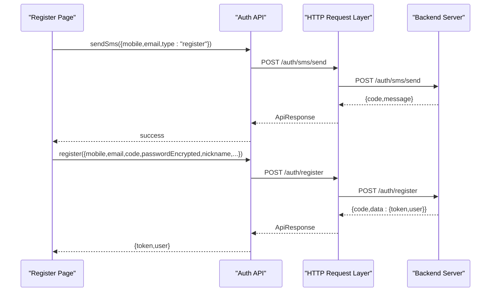
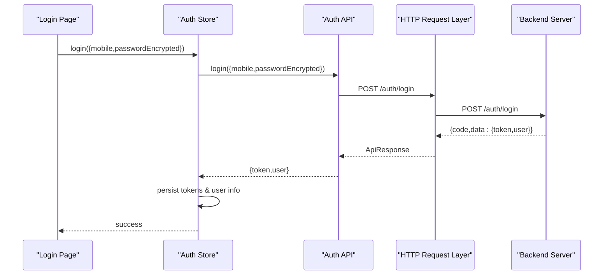
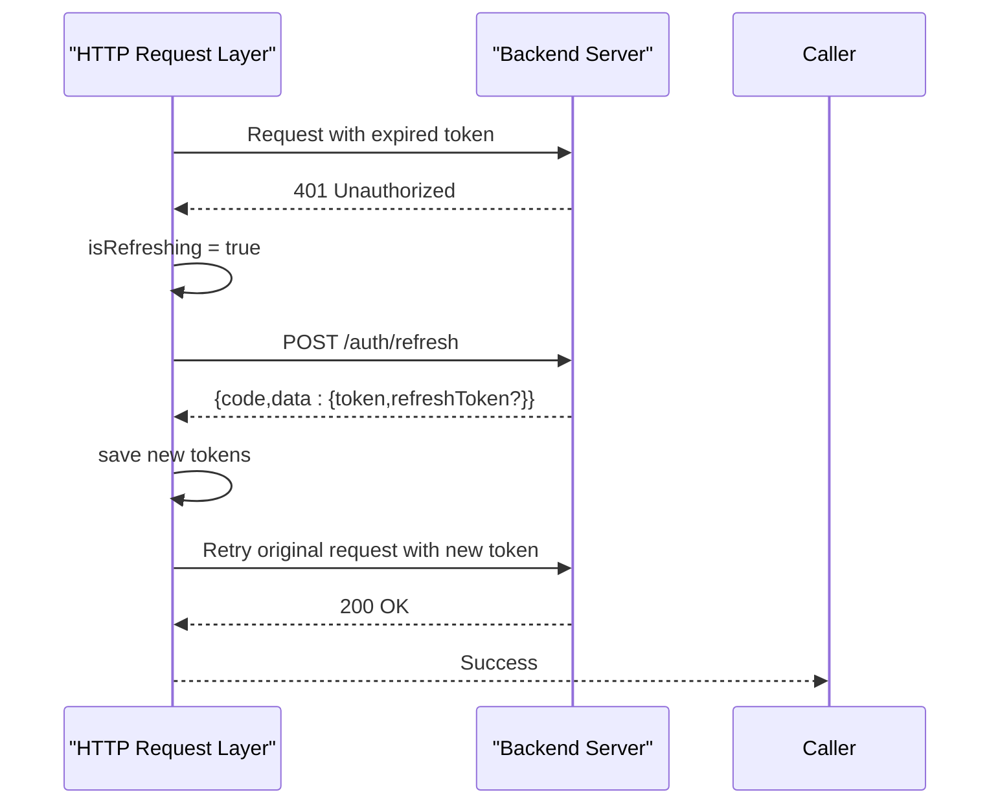
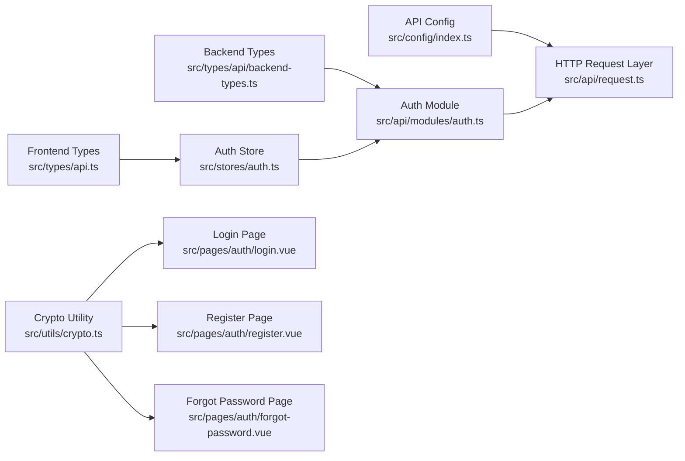

# Authentication API

<cite>
**Referenced Files in This Document**
- [auth.ts](file://src/api/modules/auth.ts)
- [request.ts](file://src/api/request.ts)
- [auth.ts](file://src/stores/auth.ts)
- [login.vue](file://src/pages/auth/login.vue)
- [register.vue](file://src/pages/auth/register.vue)
- [forgot-password.vue](file://src/pages/auth/forgot-password.vue)
- [backend-types.ts](file://src/types/api/backend-types.ts)
- [api.ts](file://src/types/api.ts)
- [index.ts](file://src/config/index.ts)
- [crypto.ts](file://src/utils/crypto.ts)
- [test-frontend-auth.sh](file://test-frontend-auth.sh)
</cite>

## Table of Contents
1. [Introduction](#introduction)
2. [Project Structure](#project-structure)
3. [Core Components](#core-components)
4. [Architecture Overview](#architecture-overview)
5. [Detailed Component Analysis](#detailed-component-analysis)
6. [Dependency Analysis](#dependency-analysis)
7. [Performance Considerations](#performance-considerations)
8. [Troubleshooting Guide](#troubleshooting-guide)
9. [Conclusion](#conclusion)

## Introduction
This document provides comprehensive API documentation for the Authentication module. It covers all authentication-related endpoints including login, registration, password reset, and session/token management. The documentation specifies HTTP methods, URL patterns, request/response schemas, authentication requirements, parameter validation rules, JWT token handling, session expiration behavior, error codes, and security considerations.

## Project Structure
The authentication system is composed of:
- API module that defines typed DTOs and endpoint wrappers
- HTTP request layer with automatic token refresh and retry logic
- Pinia store for managing authentication state and performing actions
- Frontend pages that collect user input and orchestrate authentication flows
- Cryptographic utilities for password encryption

**Diagram sources**
- [auth.ts:1-57](file://src/api/modules/auth.ts#L1-L57)
- [request.ts:1-228](file://src/api/request.ts#L1-L228)
- [auth.ts:1-137](file://src/stores/auth.ts#L1-L137)
- [login.vue:1-227](file://src/pages/auth/login.vue#L1-L227)
- [register.vue:1-501](file://src/pages/auth/register.vue#L1-L501)
- [forgot-password.vue:1-440](file://src/pages/auth/forgot-password.vue#L1-L440)
- [backend-types.ts:1-764](file://src/types/api/backend-types.ts#L1-L764)
- [api.ts:1-83](file://src/types/api.ts#L1-L83)
- [crypto.ts:1-18](file://src/utils/crypto.ts#L1-L18)

**Section sources**
- [auth.ts:1-57](file://src/api/modules/auth.ts#L1-L57)
- [request.ts:1-228](file://src/api/request.ts#L1-L228)
- [auth.ts:1-137](file://src/stores/auth.ts#L1-L137)
- [login.vue:1-227](file://src/pages/auth/login.vue#L1-L227)
- [register.vue:1-501](file://src/pages/auth/register.vue#L1-L501)
- [forgot-password.vue:1-440](file://src/pages/auth/forgot-password.vue#L1-L440)
- [backend-types.ts:1-764](file://src/types/api/backend-types.ts#L1-L764)
- [api.ts:1-83](file://src/types/api.ts#L1-L83)
- [crypto.ts:1-18](file://src/utils/crypto.ts#L1-L18)

## Core Components
- Authentication API module: Defines endpoints and typed DTOs for SMS, registration, login, password reset, and token refresh.
- HTTP request layer: Centralized request handling with automatic token refresh, retry on 401, and unified error handling.
- Authentication store: Manages tokens, user info, and exposes actions for login, register, logout, and token refresh.
- Frontend pages: Collect user input, validate fields, encrypt passwords, and trigger authentication actions.
- Cryptographic utility: Provides SHA256-based password encryption used before transmission.

**Section sources**
- [auth.ts:33-56](file://src/api/modules/auth.ts#L33-L56)
- [request.ts:75-208](file://src/api/request.ts#L75-L208)
- [auth.ts:9-136](file://src/stores/auth.ts#L9-L136)
- [login.vue:68-103](file://src/pages/auth/login.vue#L68-L103)
- [register.vue:235-302](file://src/pages/auth/register.vue#L235-L302)
- [forgot-password.vue:203-299](file://src/pages/auth/forgot-password.vue#L203-L299)
- [crypto.ts:8-17](file://src/utils/crypto.ts#L8-L17)

## Architecture Overview
The authentication flow integrates frontend pages, the API module, the request layer, and the store. Passwords are encrypted client-side before being sent to the server. The request layer automatically handles token refresh on 401 responses and retries failed requests. The store persists tokens and user info locally and coordinates UI navigation.

**Diagram sources**
- [login.vue:68-103](file://src/pages/auth/login.vue#L68-L103)
- [auth.ts:18-29](file://src/stores/auth.ts#L18-L29)
- [auth.ts:40-41](file://src/api/modules/auth.ts#L40-L41)
- [request.ts:100-147](file://src/api/request.ts#L100-L147)

## Detailed Component Analysis

### Authentication Endpoints

#### Send SMS Verification Code
- Method: POST
- URL: `/auth/sms/send`
- Description: Sends a verification code to the provided email for the given operation type.
- Authentication: Not required
- Request body:
  - mobile: string (required)
  - email: string (required)
  - type: "register" | "login" | "reset_password" (required)
- Response:
  - code: number
  - message: string
  - data: { message: string }
- Example request:
  - POST /auth/sms/send
  - Body: {"mobile":"13800001111","email":"user@example.com","type":"register"}
- Example response:
  - 200 OK with code 0 and message indicating success

**Section sources**
- [auth.ts:34-35](file://src/api/modules/auth.ts#L34-L35)
- [backend-types.ts:374-381](file://src/types/api/backend-types.ts#L374-L381)

#### Register
- Method: POST
- URL: `/auth/register`
- Description: Creates a new user account using mobile, email, verification code, and encrypted password.
- Authentication: Not required
- Request body:
  - mobile: string (required)
  - email: string (required)
  - code: string (required)
  - password: string (required; SHA256 hex-encoded)
  - nickname: string (required)
  - gender: number (optional; 0=unknown, 1=male, 2=female)
  - inviteCode: string (optional)
- Response:
  - code: number
  - message: string
  - data: { token: string, user: User }
- Example request:
  - POST /auth/register
  - Body: {"mobile":"13800001111","email":"user@example.com","code":"123456","password":"<sha256_hex>","nickname":"Alice"}
- Example response:
  - 200 OK with code 0 and user info plus JWT token

**Section sources**
- [auth.ts:37-38](file://src/api/modules/auth.ts#L37-L38)
- [backend-types.ts:386-401](file://src/types/api/backend-types.ts#L386-L401)

#### Login
- Method: POST
- URL: `/auth/login`
- Description: Authenticates a user with mobile and encrypted password.
- Authentication: Not required
- Request body:
  - mobile: string (required)
  - password: string (required; SHA256 hex-encoded)
- Response:
  - code: number
  - message: string
  - data: { token: string, user: User }
- Example request:
  - POST /auth/login
  - Body: {"mobile":"13800001111","password":"<sha256_hex>"}
- Example response:
  - 200 OK with code 0 and JWT token

**Section sources**
- [auth.ts:40-41](file://src/api/modules/auth.ts#L40-L41)
- [backend-types.ts:406-411](file://src/types/api/backend-types.ts#L406-L411)

#### Reset Password
- Method: POST
- URL: `/auth/reset-password`
- Description: Resets the user's password using mobile, email, verification code, and new encrypted password.
- Authentication: Not required
- Request body:
  - mobile: string (required)
  - email: string (required)
  - code: string (required)
  - newPassword: string (required; SHA256 hex-encoded)
- Response:
  - code: number
  - message: string
  - data: { message: string }
- Example request:
  - POST /auth/reset-password
  - Body: {"mobile":"13800001111","email":"user@example.com","code":"123456","newPassword":"<sha256_hex>"}
- Example response:
  - 200 OK with code 0 and success message

**Section sources**
- [auth.ts:43-44](file://src/api/modules/auth.ts#L43-L44)
- [backend-types.ts:416-425](file://src/types/api/backend-types.ts#L416-L425)

#### Refresh Access Token
- Method: POST
- URL: `/auth/refresh`
- Description: Refreshes the access token using a valid refresh token.
- Authentication: Not required
- Request body:
  - refreshToken: string (required)
- Response:
  - code: number
  - message: string
  - data: { token: string, refreshToken: string }
- Example request:
  - POST /auth/refresh
  - Body: {"refreshToken":"<refresh_token>"}
- Example response:
  - 200 OK with code 0 and new token

**Section sources**
- [auth.ts:46-49](file://src/api/modules/auth.ts#L46-L49)
- [request.ts:35-73](file://src/api/request.ts#L35-L73)

### Session and Token Management
- Token storage: Tokens are stored in local storage under keys "token" and "refreshToken".
- Authorization header: Requests automatically include Authorization: Bearer <token> when present.
- Automatic refresh: On receiving 401 Unauthorized, the request layer attempts to refresh the token and retries the original request.
- Logout: Clears tokens and user info from local storage.

**Diagram sources**
- [request.ts:15-24](file://src/api/request.ts#L15-L24)
- [request.ts:100-174](file://src/api/request.ts#L100-L174)
- [auth.ts:44-52](file://src/stores/auth.ts#L44-L52)

**Section sources**
- [request.ts:15-24](file://src/api/request.ts#L15-L24)
- [request.ts:100-174](file://src/api/request.ts#L100-L174)
- [auth.ts:44-52](file://src/stores/auth.ts#L44-L52)

### Parameter Validation and Security

#### Email/Password Validation
- Email format validation is performed on registration and password reset pages.
- Mobile number validation is performed on the forgot password page.
- Password length and confirmation checks are enforced during password reset.

**Section sources**
- [register.vue:198-252](file://src/pages/auth/register.vue#L198-L252)
- [forgot-password.vue:141-268](file://src/pages/auth/forgot-password.vue#L141-L268)

#### Password Encryption
- Passwords are hashed using SHA256 client-side before being transmitted.
- Backend applies PBKDF2 for secure password storage.

**Section sources**
- [crypto.ts:8-17](file://src/utils/crypto.ts#L8-L17)
- [test-frontend-auth.sh:14-20](file://test-frontend-auth.sh#L14-L20)

### Error Handling and Codes
Common error scenarios and typical responses:
- Invalid credentials or wrong password: 401 Unauthorized with descriptive message.
- Account verification requirements: Backend may require email verification before login.
- Rate limiting: Backend may throttle SMS sending; UI shows countdown feedback.
- Network errors: Request layer displays network failure messages.

**Section sources**
- [request.ts:94-100](file://src/api/request.ts#L94-L100)
- [request.ts:175-181](file://src/api/request.ts#L175-L181)
- [login.vue:94-102](file://src/pages/auth/login.vue#L94-L102)
- [register.vue:226-232](file://src/pages/auth/register.vue#L226-L232)
- [forgot-password.vue:194-200](file://src/pages/auth/forgot-password.vue#L194-L200)

### Example Workflows

#### Successful Registration Flow

**Diagram sources**
- [register.vue:181-233](file://src/pages/auth/register.vue#L181-L233)
- [auth.ts:34-38](file://src/api/modules/auth.ts#L34-L38)
- [request.ts:75-208](file://src/api/request.ts#L75-L208)

#### Successful Login Flow

**Diagram sources**
- [login.vue:68-103](file://src/pages/auth/login.vue#L68-L103)
- [auth.ts:18-29](file://src/stores/auth.ts#L18-L29)
- [auth.ts:40-41](file://src/api/modules/auth.ts#L40-L41)
- [request.ts:75-208](file://src/api/request.ts#L75-L208)

#### Token Refresh Mechanism

**Diagram sources**
- [request.ts:100-174](file://src/api/request.ts#L100-L174)
- [auth.ts:54-71](file://src/stores/auth.ts#L54-L71)

### Security Considerations
- Password hashing: Client-side SHA256 prevents plaintext transmission; backend applies PBKDF2 for secure storage.
- Token storage: Tokens are persisted in local storage; consider secure storage alternatives for production.
- Authorization: Requests automatically include Authorization header when available.
- CSRF protection: No explicit CSRF tokens are implemented in the frontend; backend should enforce CSRF protection at the server level.
- Rate limiting: UI enforces basic rate limiting feedback via countdown timers; backend should implement robust throttling.

**Section sources**
- [crypto.ts:8-17](file://src/utils/crypto.ts#L8-L17)
- [request.ts:15-24](file://src/api/request.ts#L15-L24)
- [register.vue:181-233](file://src/pages/auth/register.vue#L181-L233)
- [forgot-password.vue:141-201](file://src/pages/auth/forgot-password.vue#L141-L201)

## Dependency Analysis
The authentication module depends on:
- API configuration for base URLs
- Typed DTOs for request/response contracts
- Cryptographic utilities for password encryption
- Pinia store for state management
- Frontend pages for user interaction

**Diagram sources**
- [index.ts:1-11](file://src/config/index.ts#L1-L11)
- [backend-types.ts:1-764](file://src/types/api/backend-types.ts#L1-L764)
- [api.ts:1-83](file://src/types/api.ts#L1-L83)
- [crypto.ts:1-18](file://src/utils/crypto.ts#L1-L18)
- [login.vue:1-227](file://src/pages/auth/login.vue#L1-L227)
- [register.vue:1-501](file://src/pages/auth/register.vue#L1-L501)
- [forgot-password.vue:1-440](file://src/pages/auth/forgot-password.vue#L1-L440)
- [auth.ts:1-57](file://src/api/modules/auth.ts#L1-L57)
- [request.ts:1-228](file://src/api/request.ts#L1-L228)
- [auth.ts:1-137](file://src/stores/auth.ts#L1-L137)

**Section sources**
- [index.ts:1-11](file://src/config/index.ts#L1-L11)
- [backend-types.ts:1-764](file://src/types/api/backend-types.ts#L1-L764)
- [api.ts:1-83](file://src/types/api.ts#L1-L83)
- [crypto.ts:1-18](file://src/utils/crypto.ts#L1-L18)
- [login.vue:1-227](file://src/pages/auth/login.vue#L1-L227)
- [register.vue:1-501](file://src/pages/auth/register.vue#L1-L501)
- [forgot-password.vue:1-440](file://src/pages/auth/forgot-password.vue#L1-L440)
- [auth.ts:1-57](file://src/api/modules/auth.ts#L1-L57)
- [request.ts:1-228](file://src/api/request.ts#L1-L228)
- [auth.ts:1-137](file://src/stores/auth.ts#L1-L137)

## Performance Considerations
- Token refresh batching: The request layer prevents concurrent refresh attempts and queues subscribers to avoid redundant refresh calls.
- Local storage persistence: Reduces repeated login attempts by rehydrating tokens on app initialization.
- Request timeout: Configurable timeout ensures requests do not hang indefinitely.

**Section sources**
- [request.ts:7-33](file://src/api/request.ts#L7-L33)
- [auth.ts:73-77](file://src/stores/auth.ts#L73-L77)
- [index.ts:1-11](file://src/config/index.ts#L1-L11)

## Troubleshooting Guide
- 401 Unauthorized: Indicates token expiration or invalid credentials. The request layer attempts to refresh the token automatically. If refresh fails, tokens are cleared and the user is navigated to the login page.
- Network failures: The request layer displays a network error toast and rejects the promise.
- Validation errors: Frontend pages validate inputs and display user-friendly messages for missing or invalid fields.
- Rate limiting: UI shows countdown feedback for SMS sending; backend may throttle requests.

**Section sources**
- [request.ts:100-174](file://src/api/request.ts#L100-L174)
- [request.ts:175-181](file://src/api/request.ts#L175-L181)
- [login.vue:68-103](file://src/pages/auth/login.vue#L68-L103)
- [register.vue:181-233](file://src/pages/auth/register.vue#L181-L233)
- [forgot-password.vue:141-201](file://src/pages/auth/forgot-password.vue#L141-L201)

## Conclusion
The Authentication module provides a robust, typed, and secure authentication system with automatic token refresh, comprehensive validation, and clear error handling. Passwords are encrypted client-side, tokens are managed centrally, and the UI provides guided flows for registration, login, and password reset. For production deployments, consider enhancing token storage security and implementing CSRF protection at the backend.