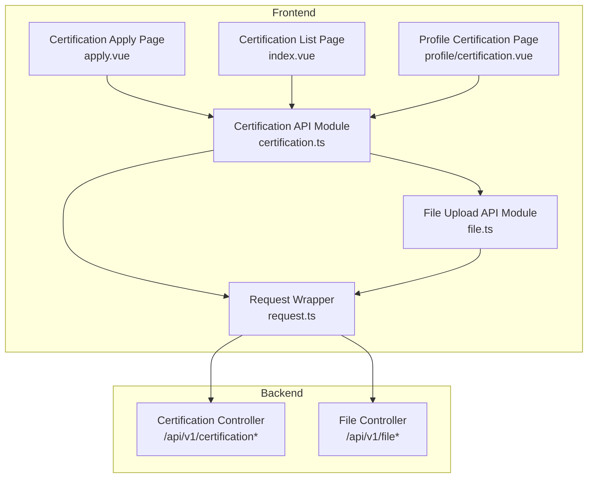
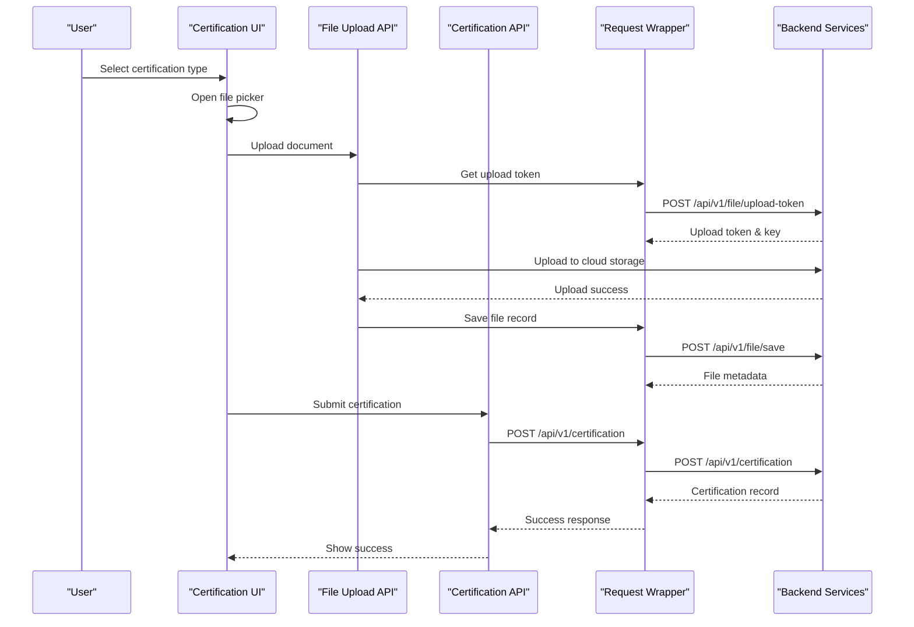
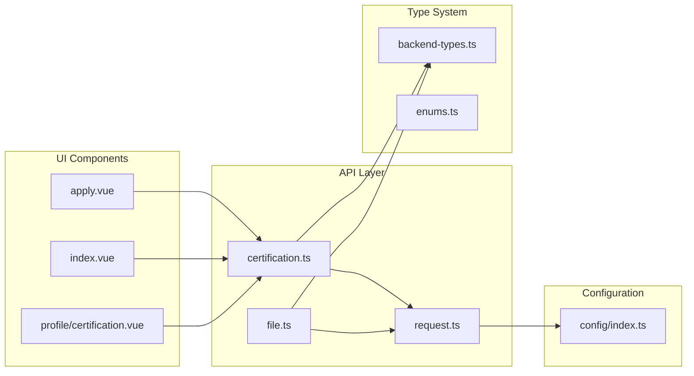

# Certification API

<cite>
**Referenced Files in This Document**
- [certification.ts](file://src/api/modules/certification.ts)
- [file.ts](file://src/api/modules/file.ts)
- [request.ts](file://src/api/request.ts)
- [backend-types.ts](file://src/types/api/backend-types.ts)
- [enums.ts](file://src/types/enums.ts)
- [index.ts](file://src/config/index.ts)
- [apply.vue](file://src/pages/certification/apply.vue)
- [index.vue](file://src/pages/certification/index.vue)
- [profile/certification.vue](file://src/pages/profile/certification.vue)
</cite>

## Table of Contents
1. [Introduction](#introduction)
2. [Project Structure](#project-structure)
3. [Core Components](#core-components)
4. [Architecture Overview](#architecture-overview)
5. [Detailed Component Analysis](#detailed-component-analysis)
6. [Dependency Analysis](#dependency-analysis)
7. [Performance Considerations](#performance-considerations)
8. [Troubleshooting Guide](#troubleshooting-guide)
9. [Conclusion](#conclusion)

## Introduction
This document provides comprehensive API documentation for the Certification module responsible for user identity verification and professional credentials management. The module enables users to submit certification applications, upload supporting documents, track verification status, and manage credential records. It covers endpoint specifications, request/response schemas, verification workflows, validation requirements, and error handling mechanisms.

## Project Structure
The Certification module consists of:
- Frontend API client for certification operations
- File upload service integrated with cloud storage
- Request wrapper with authentication and token refresh
- Type definitions for backend models and enumerations
- UI components for certification application and management



**Diagram sources**
- [certification.ts:1-55](file://src/api/modules/certification.ts#L1-L55)
- [file.ts:1-335](file://src/api/modules/file.ts#L1-L335)
- [request.ts:1-228](file://src/api/request.ts#L1-L228)

**Section sources**
- [certification.ts:1-55](file://src/api/modules/certification.ts#L1-L55)
- [file.ts:1-335](file://src/api/modules/file.ts#L1-L335)
- [request.ts:1-228](file://src/api/request.ts#L1-L228)

## Core Components
The Certification module comprises several key components:

### API Client Module
The certification API module exposes typed interfaces for:
- Retrieving certification types and configurations
- Submitting certification applications
- Managing user's certification records
- Fetching individual certification details

### File Upload Service
Integrated with cloud storage for document uploads:
- Generates upload tokens with expiration
- Handles multiple file formats (JPEG, PNG, GIF, WebP)
- Manages file metadata and URLs
- Supports various runtime environments (H5, Mini Program)

### Request Wrapper
Provides standardized HTTP communication:
- Automatic authentication token injection
- Token refresh mechanism for expired sessions
- Unified error handling and toast notifications
- Configurable timeouts and base URLs

**Section sources**
- [certification.ts:34-54](file://src/api/modules/certification.ts#L34-L54)
- [file.ts:90-230](file://src/api/modules/file.ts#L90-L230)
- [request.ts:75-208](file://src/api/request.ts#L75-L208)

## Architecture Overview
The certification workflow follows a structured process from document upload to verification completion:



**Diagram sources**
- [apply.vue:100-123](file://src/pages/certification/apply.vue#L100-L123)
- [file.ts:259-278](file://src/api/modules/file.ts#L259-L278)
- [certification.ts:41-42](file://src/api/modules/certification.ts#L41-L42)

## Detailed Component Analysis

### API Endpoints

#### Get Certification Types
Retrieves available certification types with their configurations.

**Endpoint:** `GET /api/v1/certification-types`

**Response Schema:**
```typescript
{
  code: number;
  message: string;
  data: {
    list: CertificationType[];
  };
  timestamp: number;
}
```

**CertificationType Interface:**
```typescript
interface CertificationType {
  code: string;           // Unique identifier (e.g., 'id_card', 'education')
  name: string;           // Display name
  icon: string;           // Icon representation
  description: string;    // Purpose description
  requiredFields: string[]; // Required fields for this type
}
```

**Section sources**
- [certification.ts:35-36](file://src/api/modules/certification.ts#L35-L36)
- [backend-types.ts:592-613](file://src/types/api/backend-types.ts#L592-L613)

#### Submit Certification Application
Creates a new certification application with uploaded document.

**Endpoint:** `POST /api/v1/certification`

**Request Body Schema:**
```typescript
interface CreateCertificationDto {
  type: string;           // Certification type code
  imageUrl: string;       // Uploaded document URL
  description?: string;   // Optional description
}
```

**Response Schema:**
```typescript
interface Certification {
  id: number;
  userId: number;
  type: string;
  imageUrl: string;
  description: string;
  status: 0 | 1 | 2;      // 0: Pending, 1: Approved, 2: Rejected
  rejectReason?: string;
  reviewedAt?: string;
  createdAt: string;
}
```

**Section sources**
- [certification.ts:41-42](file://src/api/modules/certification.ts#L41-L42)
- [backend-types.ts:552-559](file://src/types/api/backend-types.ts#L552-L559)
- [backend-types.ts:564-587](file://src/types/api/backend-types.ts#L564-L587)

#### Get User's Certification List
Retrieves all certification records for the current user.

**Endpoint:** `GET /api/v1/certification/list`

**Query Parameters:**
- `status`: Filter by status (optional)

**Response Schema:**
```typescript
{
  code: number;
  message: string;
  data: {
    list: Certification[];
  };
  timestamp: number;
}
```

**Section sources**
- [certification.ts:44-49](file://src/api/modules/certification.ts#L44-L49)
- [backend-types.ts:564-587](file://src/types/api/backend-types.ts#L564-L587)

#### Get Certification Detail
Fetches detailed information about a specific certification.

**Endpoint:** `GET /api/v1/certification/{id}`

**Path Parameter:**
- `id`: Certification record ID

**Response Schema:**
Same as Certification interface above.

**Section sources**
- [certification.ts:52-53](file://src/api/modules/certification.ts#L52-L53)
- [backend-types.ts:564-587](file://src/types/api/backend-types.ts#L564-L587)

### File Upload Workflow

#### Upload Token Generation
Before uploading files, the system generates temporary upload credentials.

**Endpoint:** `POST /api/v1/file/upload-token`

**Request Body:**
```typescript
{
  type: 'certificate';    // Upload type
  fileName?: string;      // Original filename
}
```

**Response Schema:**
```typescript
{
  token: string;          // Upload token
  key: string;            // File key
  domain: string;         // Storage domain
  expire: number;         // Expiration seconds
}
```

**Section sources**
- [file.ts:259-262](file://src/api/modules/file.ts#L259-L262)
- [backend-types.ts:270-289](file://src/types/api/backend-types.ts#L270-L289)

#### Cloud Storage Upload
Documents are uploaded to cloud storage with automatic metadata extraction.

**Supported Formats:** JPEG, PNG, GIF, WebP
**Maximum Size:** Configured via upload configuration
**Storage Provider:** Qiniu Cloud (with regional endpoint)

**Section sources**
- [file.ts:102-230](file://src/api/modules/file.ts#L102-L230)

### Verification Status Tracking

#### Status Definitions
The certification system uses a three-stage status model:

| Status Code | Status Text | Description |
|-------------|-------------|-------------|
| 0 | Pending | Application submitted, under review |
| 1 | Approved | Verification successful |
| 2 | Rejected | Verification failed with reason |

#### Status Management
The frontend displays status with visual indicators:
- Pending: Yellow badge with "审核中"
- Approved: Green badge with "已认证"
- Rejected: Red badge with "已拒绝"

**Section sources**
- [index.vue:127-130](file://src/pages/certification/index.vue#L127-L130)
- [index.vue:192-204](file://src/pages/certification/index.vue#L192-L204)

### Supported Certification Types

#### Core Certification Types
The system supports the following certification categories:

| Type Code | Name | Required Fields | Purpose |
|-----------|------|----------------|---------|
| `id_card` | Identity Card | Full name, ID number | Verify personal identity |
| `education` | Education | Degree certificate | Confirm educational background |
| `business` | Business License | Company registration | Verify business ownership |
| `driver` | Driver's License | Driver license number | Confirm driving privileges |
| `house` | Property Certificate | Property address | Verify residential status |
| `utility` | Utility Bill | Account holder name | Confirm address residency |

**Section sources**
- [backend-types.ts:68](file://src/types/api/backend-types.ts#L68)
- [backend-types.ts:592-613](file://src/types/api/backend-types.ts#L592-L613)

### Document Validation Requirements

#### Upload Validation
- **Format Validation:** Only JPEG, PNG, GIF, WebP images accepted
- **Size Limits:** Configured maximum file size enforced
- **Type Matching:** File extension must match detected MIME type
- **Base64 Handling:** Data URLs automatically processed

#### Content Validation
- **Image Quality:** Minimum resolution requirements
- **Document Clarity:** Clear, readable content required
- **Information Completeness:** All required fields must be visible
- **Security Checks:** Malformed or potentially harmful content blocked

**Section sources**
- [file.ts:51-82](file://src/api/modules/file.ts#L51-L82)
- [file.ts:107-159](file://src/api/modules/file.ts#L107-L159)

### Verification Workflow Stages

#### Stage 1: Application Submission
1. User selects certification type
2. Upload supporting documents
3. Submit application with optional description
4. System validates document format and content

#### Stage 2: Manual Review
1. Admin panel displays pending applications
2. Reviewer examines document authenticity
3. Verify information alignment with user profile
4. Make approval or rejection decision

#### Stage 3: Status Notification
1. Approved applications marked active
2. Rejected applications provide reason
3. User notified via system messages
4. Status updated in user profile

**Section sources**
- [apply.vue:125-153](file://src/pages/certification/apply.vue#L125-L153)
- [index.vue:192-204](file://src/pages/certification/index.vue#L192-L204)

### Credential Management

#### User Interface Features
- **Dashboard View:** Shows available certification types
- **Application Form:** Type-specific form fields
- **Document Preview:** Real-time image preview
- **Status Tracking:** Visual status indicators
- **History Management:** Complete application history

#### Profile Integration
- **Required Certifications:** Identity and photo certifications mandatory
- **Badge System:** Visual certification status display
- **Requirement Tracking:** Progress toward requirements completion
- **Expiration Handling:** Future support for credential expiration

**Section sources**
- [index.vue:3-40](file://src/pages/certification/index.vue#L3-L40)
- [profile/certification.vue:212-269](file://src/pages/profile/certification.vue#L212-L269)

## Dependency Analysis



**Diagram sources**
- [certification.ts:1-6](file://src/api/modules/certification.ts#L1-L6)
- [file.ts:1-2](file://src/api/modules/file.ts#L1-L2)
- [request.ts:1-2](file://src/api/request.ts#L1-L2)
- [backend-types.ts:1-9](file://src/types/api/backend-types.ts#L1-L9)
- [enums.ts:1-41](file://src/types/enums.ts#L1-L41)
- [index.ts:1-5](file://src/config/index.ts#L1-L5)

### Component Relationships
- **Certification API** depends on **Request Wrapper** for HTTP communication
- **File API** provides document upload capabilities to **Certification API**
- **Type Definitions** ensure type safety across all components
- **UI Components** consume API modules for user interactions

**Section sources**
- [certification.ts:1-6](file://src/api/modules/certification.ts#L1-L6)
- [file.ts:1-2](file://src/api/modules/file.ts#L1-L2)
- [request.ts:1-2](file://src/api/request.ts#L1-L2)

## Performance Considerations
- **Upload Optimization:** Chunked uploads for large files
- **Caching Strategy:** Local caching of certification types
- **Error Recovery:** Automatic retry for transient network failures
- **Memory Management:** Efficient image handling and cleanup
- **Connection Pooling:** Reuse connections for multiple requests

## Troubleshooting Guide

### Common Issues and Solutions

#### Authentication Failures
**Symptoms:** Unauthorized access errors, redirect to login
**Causes:** Expired or invalid authentication tokens
**Solutions:** 
- Automatic token refresh mechanism
- Clear cached authentication data
- Force re-login if refresh fails

#### Upload Failures
**Symptoms:** Document upload errors, timeout messages
**Causes:** Network issues, file format problems, size limits exceeded
**Solutions:**
- Verify file format and size requirements
- Retry upload with compressed images
- Check network connectivity
- Use supported file formats (JPEG, PNG, GIF, WebP)

#### Verification Delays
**Symptoms:** Long processing times for certification applications
**Causes:** High volume of applications, manual review backlog
**Solutions:**
- Monitor system status
- Contact support for urgent cases
- Ensure complete and clear documentation submission

#### Status Display Issues
**Symptoms:** Incorrect status showing, outdated information
**Causes:** Caching issues, synchronization delays
**Solutions:**
- Refresh page to reload data
- Clear browser cache
- Wait for system synchronization

**Section sources**
- [request.ts:100-147](file://src/api/request.ts#L100-L147)
- [file.ts:164-229](file://src/api/modules/file.ts#L164-L229)
- [apply.vue:100-123](file://src/pages/certification/apply.vue#L100-L123)

## Conclusion
The Certification module provides a robust framework for identity verification and professional credential management. Its modular architecture ensures maintainability while supporting comprehensive verification workflows. The integration with cloud storage, automated validation, and user-friendly interfaces creates an efficient system for both users and administrators. Future enhancements could include automated verification systems, credential expiration management, and expanded certification types.