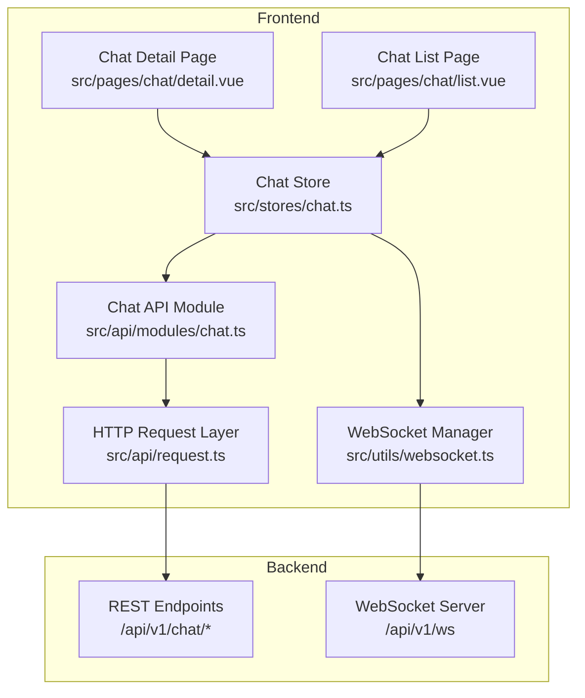
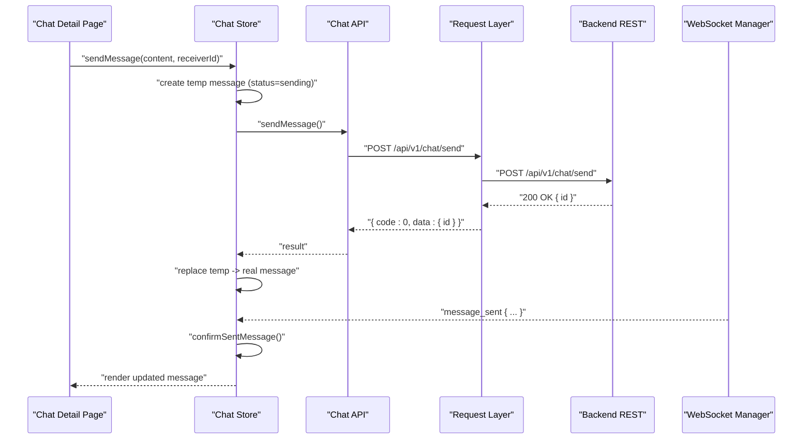
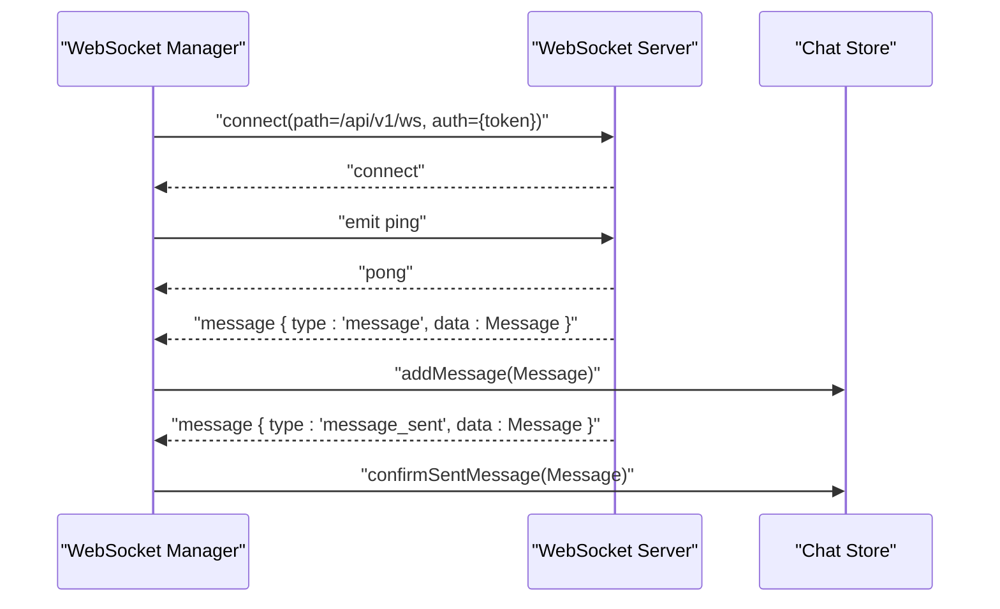
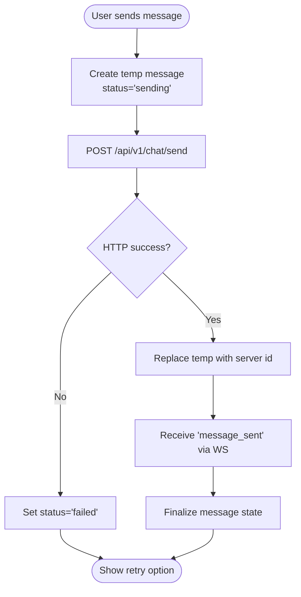
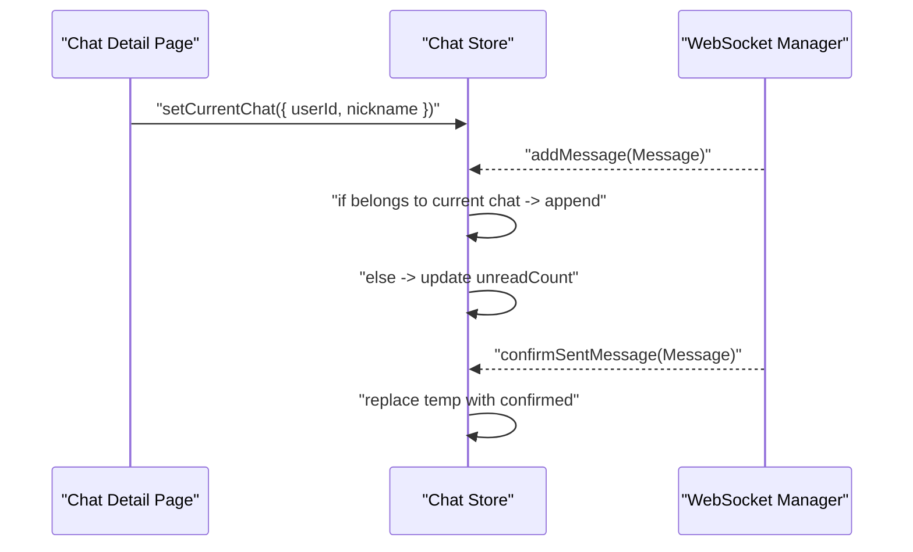
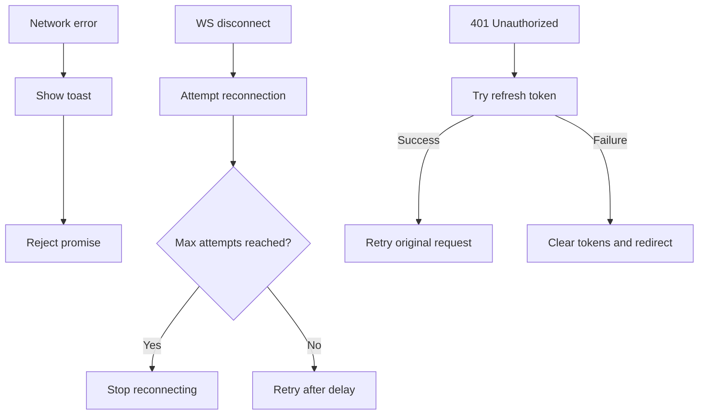
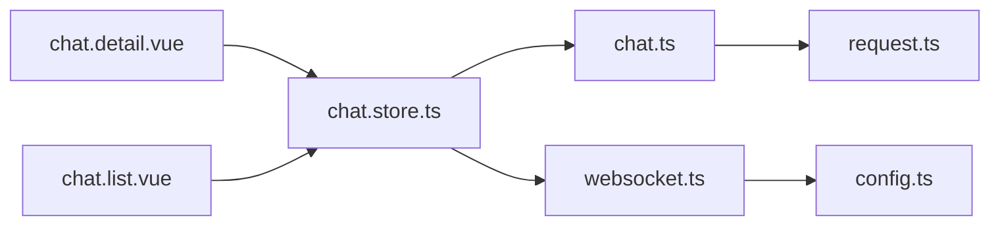

# Chat API

<cite>
**Referenced Files in This Document**
- [chat.ts](file://src/api/modules/chat.ts)
- [chat.store.ts](file://src/stores/chat.ts)
- [websocket.ts](file://src/utils/websocket.ts)
- [request.ts](file://src/api/request.ts)
- [backend-types.ts](file://src/types/api/backend-types.ts)
- [api.types.ts](file://src/types/api.ts)
- [enums.ts](file://src/types/enums.ts)
- [config.ts](file://src/config/index.ts)
- [chat.detail.vue](file://src/pages/chat/detail.vue)
- [chat.list.vue](file://src/pages/chat/list.vue)
</cite>

## Table of Contents
1. [Introduction](#introduction)
2. [Project Structure](#project-structure)
3. [Core Components](#core-components)
4. [Architecture Overview](#architecture-overview)
5. [Detailed Component Analysis](#detailed-component-analysis)
6. [Dependency Analysis](#dependency-analysis)
7. [Performance Considerations](#performance-considerations)
8. [Troubleshooting Guide](#troubleshooting-guide)
9. [Conclusion](#conclusion)
10. [Appendices](#appendices)

## Introduction
This document provides comprehensive API documentation for the Chat module, focusing on real-time messaging functionality. It covers REST endpoints for chat room management, message sending/receiving, conversation history retrieval, and user presence tracking. It also documents WebSocket event handling, message formatting, optimistic updates, read receipts, and error handling for network disconnections and permission validation. Examples are included for direct messaging and conversation threading, with guidance applicable to group chats and attachments.

## Project Structure
The Chat module spans three primary areas:
- REST API client: typed wrappers around HTTP endpoints for chat operations
- Store logic: state management for conversations, messages, and optimistic updates
- Real-time communication: WebSocket manager for live message delivery and heartbeats

**Diagram sources**
- [chat.detail.vue:1-299](file://src/pages/chat/detail.vue#L1-L299)
- [chat.list.vue:1-311](file://src/pages/chat/list.vue#L1-L311)
- [chat.store.ts:1-234](file://src/stores/chat.ts#L1-L234)
- [chat.ts:1-42](file://src/api/modules/chat.ts#L1-L42)
- [websocket.ts:1-171](file://src/utils/websocket.ts#L1-L171)
- [request.ts:1-228](file://src/api/request.ts#L1-L228)

**Section sources**
- [chat.ts:1-42](file://src/api/modules/chat.ts#L1-L42)
- [chat.store.ts:1-234](file://src/stores/chat.ts#L1-L234)
- [websocket.ts:1-171](file://src/utils/websocket.ts#L1-L171)
- [request.ts:1-228](file://src/api/request.ts#L1-L228)
- [config.ts:1-11](file://src/config/index.ts#L1-L11)

## Core Components
- REST API module: exposes endpoints for sending messages, fetching conversation lists, fetching message history, and marking conversations as read.
- Store: manages conversations, current chat context, message list, unread counts, and optimistic updates for message sending and read receipts.
- WebSocket manager: handles connection lifecycle, authentication via token, event routing, heartbeats, and automatic reconnection.
- Request layer: centralizes HTTP requests with token injection, response parsing, and token refresh logic.

Key responsibilities:
- REST endpoints: CRUD-like operations for chat resources and read state synchronization.
- Store: transforms backend payloads, normalizes numeric IDs, applies optimistic UI updates, and maintains per-conversation state.
- WebSocket: receives live events, dispatches to store handlers, and ensures robust connectivity.

**Section sources**
- [chat.ts:18-41](file://src/api/modules/chat.ts#L18-L41)
- [chat.store.ts:14-98](file://src/stores/chat.ts#L14-L98)
- [websocket.ts:15-91](file://src/utils/websocket.ts#L15-L91)
- [request.ts:15-224](file://src/api/request.ts#L15-L224)

## Architecture Overview
The Chat module follows a layered architecture:
- Presentation layer: Vue pages render chat lists and chat detail views.
- Domain layer: Pinia store encapsulates business logic for conversations and messages.
- Integration layer: API module wraps HTTP calls; WebSocket manager handles real-time events.
- Infrastructure layer: Request service manages HTTP transport, headers, and token refresh.

**Diagram sources**
- [chat.detail.vue:131-148](file://src/pages/chat/detail.vue#L131-L148)
- [chat.store.ts:50-90](file://src/stores/chat.ts#L50-L90)
- [chat.ts:19-20](file://src/api/modules/chat.ts#L19-L20)
- [request.ts:75-224](file://src/api/request.ts#L75-L224)
- [websocket.ts:93-111](file://src/utils/websocket.ts#L93-L111)

## Detailed Component Analysis

### REST Endpoints

#### Send Message
- Method: POST
- URL pattern: /api/v1/chat/send
- Request body schema:
  - receiverId: number
  - content: string
  - msgType: number | enum value (TEXT=1, IMAGE=2, EMOJI=3)
- Response schema:
  - { id: number }

Behavior:
- On success, replaces temporary message with server-assigned id and marks as delivered.
- On failure, sets message status to failed and throws error.

**Section sources**
- [chat.ts:19-20](file://src/api/modules/chat.ts#L19-L20)
- [chat.store.ts:50-90](file://src/stores/chat.ts#L50-L90)
- [enums.ts:7-11](file://src/types/enums.ts#L7-L11)
- [backend-types.ts:538-547](file://src/types/api/backend-types.ts#L538-L547)

#### Get Conversation List
- Method: GET
- URL pattern: /api/v1/chat/conversations
- Response schema:
  - data: Array of Conversation
  - unreadCount: number

Conversation model:
- userId: number
- nickname: string
- avatar?: string
- lastMessage?: string
- lastMessageTime?: string
- unreadCount: number

**Section sources**
- [chat.ts:28-31](file://src/api/modules/chat.ts#L28-L31)
- [api.types.ts:36-43](file://src/types/api.ts#L36-L43)

#### Get Message History
- Method: GET
- URL pattern: /api/v1/chat/history/:userId
- Query parameters:
  - page?: number
  - pageSize?: number
  - beforeId?: number
- Response schema:
  - data: Array of Message
  - total: number

Message model:
- id: number
- senderId: number
- receiverId: number
- content: string
- msgType: number | enum value
- createdAt: string
- sender?: UserInfo

**Section sources**
- [chat.ts:22-26](file://src/api/modules/chat.ts#L22-L26)
- [api.types.ts:26-34](file://src/types/api.ts#L26-L34)
- [backend-types.ts:56-57](file://src/types/api/backend-types.ts#L56-L57)

#### Get Messages (Optional)
- Method: GET
- URL pattern: /api/v1/chat/messages
- Query parameters:
  - page?: number
  - pageSize?: number
- Response schema:
  - data: Array of Message
  - total: number

Note: This endpoint appears to be an additional convenience endpoint not used in current pages.

**Section sources**
- [chat.ts:33-37](file://src/api/modules/chat.ts#L33-L37)
- [api.types.ts:26-34](file://src/types/api.ts#L26-L34)

#### Mark Conversation as Read
- Method: PUT
- URL pattern: /api/v1/chat/read/:userId
- Response schema:
  - success: boolean

Behavior:
- Updates unread count for the specified conversation to zero.

**Section sources**
- [chat.ts:39-40](file://src/api/modules/chat.ts#L39-L40)
- [chat.store.ts:92-98](file://src/stores/chat.ts#L92-L98)

### WebSocket Event Handling
Connection establishment:
- URL: wsURL from configuration (replaces /api/v1/ws with base host)
- Path: /api/v1/ws
- Authentication: Bearer token passed via Socket.IO auth
- Transports: websocket and polling
- Heartbeat: periodic ping emission every 25 seconds

Events:
- Server emits "message" payload containing either:
  - { type: "message", data: Message } — new incoming message
  - { type: "message_sent", data: Message } — server acknowledgment of sent message
  - raw Message object (legacy compatibility)
- Client emits "ping" periodically; expects "pong" from server
- Automatic reconnection with capped attempts and delay

**Diagram sources**
- [websocket.ts:15-91](file://src/utils/websocket.ts#L15-L91)
- [websocket.ts:93-111](file://src/utils/websocket.ts#L93-L111)
- [chat.store.ts:100-210](file://src/stores/chat.ts#L100-L210)

**Section sources**
- [websocket.ts:15-171](file://src/utils/websocket.ts#L15-L171)
- [config.ts:1-11](file://src/config/index.ts#L1-L11)

### Message Formatting, Typing Indicators, Read Receipts, Status Tracking
- Message status:
  - Optimistic: "sending" during local send
  - Confirmed: replaced with server-assigned id upon receipt
  - Failed: set when send fails
- Read receipts:
  - After loading history, the UI triggers a read endpoint to reset unread count
  - Store updates conversation unreadCount accordingly
- Typing indicators:
  - Not implemented in current code; can be added via additional WebSocket events (e.g., "typing_start", "typing_stop")

**Diagram sources**
- [chat.store.ts:50-90](file://src/stores/chat.ts#L50-L90)
- [websocket.ts:93-111](file://src/utils/websocket.ts#L93-L111)

**Section sources**
- [chat.store.ts:50-90](file://src/stores/chat.ts#L50-L90)
- [chat.store.ts:161-210](file://src/stores/chat.ts#L161-L210)

### Real-Time Updates and Broadcasting
- Incoming messages:
  - Only messages belonging to the currently selected conversation are appended to the message list
  - Other messages update conversation metadata and increment unread counters
- Outgoing messages:
  - Optimistically inserted immediately
  - Replaced with server-confirmed message upon receipt
- Broadcast scope:
  - Current implementation focuses on 1:1 direct messages
  - Group chat and thread support would require additional server-side routing and client filtering

**Diagram sources**
- [chat.detail.vue:89-98](file://src/pages/chat/detail.vue#L89-L98)
- [chat.store.ts:100-158](file://src/stores/chat.ts#L100-L158)
- [websocket.ts:93-111](file://src/utils/websocket.ts#L93-L111)

**Section sources**
- [chat.detail.vue:89-98](file://src/pages/chat/detail.vue#L89-L98)
- [chat.store.ts:100-158](file://src/stores/chat.ts#L100-L158)

### Examples

#### Direct Messaging
- Steps:
  - Navigate to chat detail for target user
  - Load history and mark as read
  - Send message; observe optimistic insertion and eventual confirmation
- Endpoints involved:
  - GET /api/v1/chat/history/:userId
  - PUT /api/v1/chat/read/:userId
  - POST /api/v1/chat/send

**Section sources**
- [chat.detail.vue:116-129](file://src/pages/chat/detail.vue#L116-L129)
- [chat.detail.vue:131-148](file://src/pages/chat/detail.vue#L131-L148)
- [chat.ts:22-40](file://src/api/modules/chat.ts#L22-L40)

#### Group Chats and Message Threading
- Guidance:
  - Extend backend to route group/thread-specific channels
  - Add channel identifiers to WebSocket events and message payloads
  - Update store to filter messages by channel and maintain separate message lists
- Current limitations:
  - Frontend logic assumes 1:1 conversations and does not include group/thread routing

[No sources needed since this section provides general guidance]

#### Attachment Sharing
- Guidance:
  - Use msgType=IMAGE (or extend enum) and include media URLs in content
  - Backend should validate and store media references
  - Frontend renders media previews based on msgType
- Current capabilities:
  - Message model supports msgType and content; integration depends on backend implementation

**Section sources**
- [enums.ts:7-11](file://src/types/enums.ts#L7-L11)
- [api.types.ts:26-34](file://src/types/api.ts#L26-L34)

### Error Handling
- Network errors:
  - HTTP layer displays toast and rejects promise
  - WebSocket manager logs disconnects and attempts reconnection up to a limit
- Authentication errors:
  - HTTP layer attempts token refresh; on failure, clears stored tokens and redirects to login
- Delivery failures:
  - Store marks message status as failed and allows retry

**Diagram sources**
- [request.ts:176-189](file://src/api/request.ts#L176-L189)
- [request.ts:100-147](file://src/api/request.ts#L100-L147)
- [websocket.ts:128-141](file://src/utils/websocket.ts#L128-L141)

**Section sources**
- [request.ts:176-189](file://src/api/request.ts#L176-L189)
- [request.ts:100-147](file://src/api/request.ts#L100-L147)
- [websocket.ts:128-141](file://src/utils/websocket.ts#L128-L141)

## Dependency Analysis
- Pages depend on the store for state and actions.
- Store depends on the API module for HTTP operations and the WebSocket manager for real-time updates.
- API module depends on the request layer for HTTP transport.
- WebSocket manager depends on configuration for URL and path, and on the store to process events.

**Diagram sources**
- [chat.detail.vue:50-108](file://src/pages/chat/detail.vue#L50-L108)
- [chat.list.vue:59-97](file://src/pages/chat/list.vue#L59-L97)
- [chat.store.ts:1-234](file://src/stores/chat.ts#L1-L234)
- [chat.ts:1-42](file://src/api/modules/chat.ts#L1-L42)
- [request.ts:1-228](file://src/api/request.ts#L1-L228)
- [websocket.ts:1-171](file://src/utils/websocket.ts#L1-L171)
- [config.ts:1-11](file://src/config/index.ts#L1-L11)

**Section sources**
- [chat.detail.vue:50-108](file://src/pages/chat/detail.vue#L50-L108)
- [chat.list.vue:59-97](file://src/pages/chat/list.vue#L59-L97)
- [chat.store.ts:1-234](file://src/stores/chat.ts#L1-L234)
- [chat.ts:1-42](file://src/api/modules/chat.ts#L1-L42)
- [request.ts:1-228](file://src/api/request.ts#L1-L228)
- [websocket.ts:1-171](file://src/utils/websocket.ts#L1-L171)
- [config.ts:1-11](file://src/config/index.ts#L1-L11)

## Performance Considerations
- Optimistic UI updates reduce perceived latency for message sending.
- Heartbeat keeps connections alive and detects disconnections promptly.
- Pagination parameters enable efficient history loading.
- Consider virtualizing long message lists to improve rendering performance.

[No sources needed since this section provides general guidance]

## Troubleshooting Guide
- WebSocket not connecting:
  - Verify token availability and validity
  - Confirm wsURL and path configuration
  - Check server-side WebSocket route and authentication
- Messages not appearing:
  - Ensure current chat selection matches the message recipient
  - Verify message de-duplication logic and event routing
- Read receipts not updating:
  - Confirm read endpoint is called after loading history
  - Check conversation list updates in the store

**Section sources**
- [websocket.ts:23-32](file://src/utils/websocket.ts#L23-L32)
- [config.ts:1-11](file://src/config/index.ts#L1-L11)
- [chat.store.ts:117-158](file://src/stores/chat.ts#L117-L158)
- [chat.store.ts:92-98](file://src/stores/chat.ts#L92-L98)

## Conclusion
The Chat module provides a robust foundation for real-time messaging with REST endpoints for chat operations and WebSocket for live updates. The store implements optimistic updates and read receipts, while the request layer handles authentication and token refresh. Future enhancements can include typing indicators, group chat routing, and attachment handling aligned with backend capabilities.

[No sources needed since this section summarizes without analyzing specific files]

## Appendices

### API Definitions Summary
- POST /api/v1/chat/send
  - Request: receiverId, content, msgType
  - Response: { id }
- GET /api/v1/chat/history/:userId
  - Query: page, pageSize, beforeId
  - Response: { data: Message[], total }
- GET /api/v1/chat/conversations
  - Response: { data: Conversation[], unreadCount }
- GET /api/v1/chat/messages
  - Query: page, pageSize
  - Response: { data: Message[], total }
- PUT /api/v1/chat/read/:userId
  - Response: { success }

**Section sources**
- [chat.ts:19-40](file://src/api/modules/chat.ts#L19-L40)

### WebSocket Events
- Client connects to wsURL with path /api/v1/ws and auth token
- Events:
  - Server -> Client: "message" with { type:'message', data:Message } or { type:'message_sent', data:Message }
  - Client -> Server: "ping"
  - Server -> Client: "pong"

**Section sources**
- [websocket.ts:15-91](file://src/utils/websocket.ts#L15-L91)
- [websocket.ts:93-111](file://src/utils/websocket.ts#L93-L111)