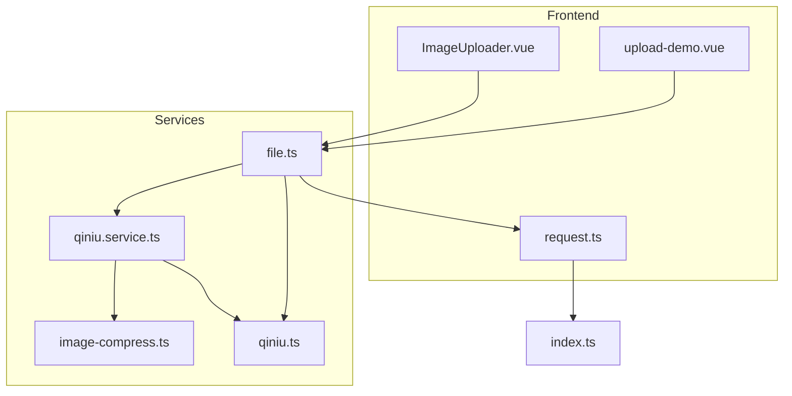
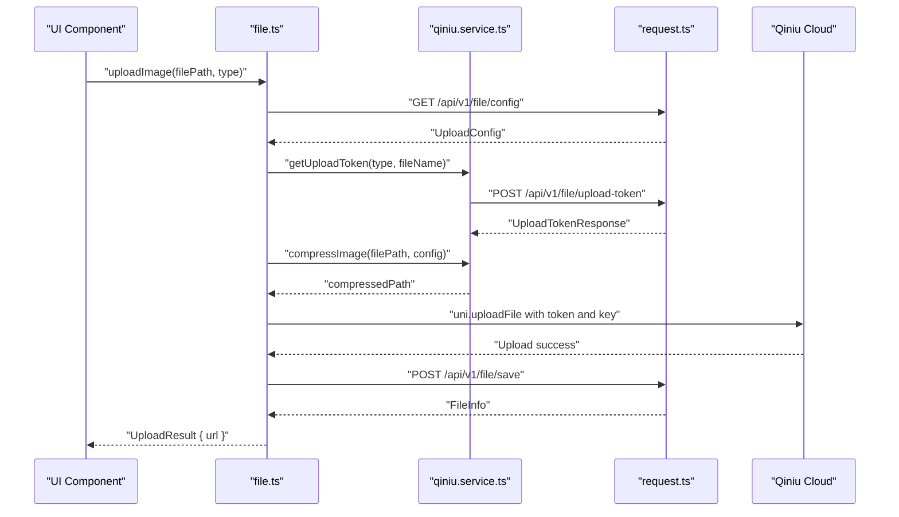
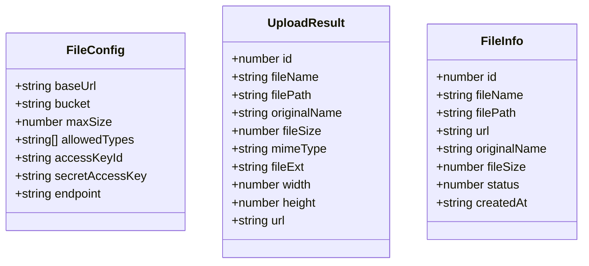
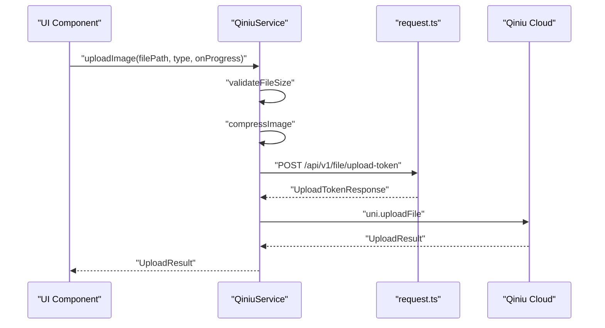
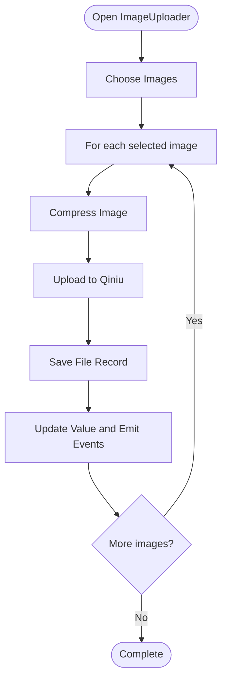
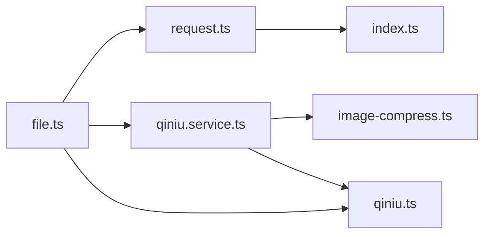

# File API

<cite>
**Referenced Files in This Document**
- [file.ts](file.ts)
- [qiniu.service.ts](qiniu.service.ts)
- [image-compress.ts](image-compress.ts)
- [ImageUploader.vue](ImageUploader.vue)
- [upload-demo.vue](upload-demo.vue)
- [request.ts](request.ts)
- [index.ts](index.ts)
- [qiniu.ts](qiniu.ts)
</cite>

## Table of Contents
1. [Introduction](#introduction)
2. [Project Structure](#project-structure)
3. [Core Components](#core-components)
4. [Architecture Overview](#architecture-overview)
5. [Detailed Component Analysis](#detailed-component-analysis)
6. [Dependency Analysis](#dependency-analysis)
7. [Performance Considerations](#performance-considerations)
8. [Troubleshooting Guide](#troubleshooting-guide)
9. [Conclusion](#conclusion)
10. [Appendices](#appendices)

## Introduction
This document provides comprehensive API documentation for the File module focused on media upload and storage operations integrated with Qiniu Cloud Storage. It covers endpoints for upload initiation, progress tracking, asset management, and the complete workflow for uploading images and other media. It also documents supported file types, size limitations, compression options, and URL generation for assets. The document includes practical examples for image uploads, avatar updates, and asset URL retrieval, along with error handling strategies for upload failures, storage quotas, and security validation.

## Project Structure
The File module is implemented across several frontend components and services:
- API module for file operations and Qiniu integration
- Qiniu service for advanced upload features and compression
- Image uploader component for UI-driven uploads
- Compression utilities for optimizing image sizes
- Request wrapper for centralized API communication and token refresh

**Diagram sources**
- [ImageUploader.vue:1-242](file://src/components/ImageUploader.vue#L1-L242)
- [upload-demo.vue:1-100](file://src/pages/examples/upload-demo.vue#L1-L100)
- [file.ts:1-335](file://src/api/modules/file.ts#L1-L335)
- [qiniu.service.ts:1-126](file://src/services/qiniu.service.ts#L1-L126)
- [image-compress.ts:1-87](file://src/utils/image-compress.ts#L1-L87)
- [request.ts:1-228](file://src/api/request.ts#L1-L228)
- [index.ts:1-11](file://src/config/index.ts#L1-L11)
- [qiniu.ts:1-38](file://src/types/qiniu.ts#L1-L38)

**Section sources**
- [file.ts:1-335](file://src/api/modules/file.ts#L1-L335)
- [qiniu.service.ts:1-126](file://src/services/qiniu.service.ts#L1-L126)
- [image-compress.ts:1-87](file://src/utils/image-compress.ts#L1-L87)
- [ImageUploader.vue:1-242](file://src/components/ImageUploader.vue#L1-L242)
- [upload-demo.vue:1-100](file://src/pages/examples/upload-demo.vue#L1-L100)
- [request.ts:1-228](file://src/api/request.ts#L1-L228)
- [index.ts:1-11](file://src/config/index.ts#L1-L11)
- [qiniu.ts:1-38](file://src/types/qiniu.ts#L1-L38)

## Core Components
- File API module: Provides functions to get upload configuration, initiate uploads, retrieve URLs, manage files, and upload avatars.
- Qiniu service: Encapsulates upload configuration, token acquisition, image compression, and progress tracking.
- Image uploader component: UI component for selecting and uploading images with progress indicators and batch support.
- Compression utilities: Functions to compress images and validate file sizes.
- Request wrapper: Centralized HTTP client with automatic token refresh and error handling.

**Section sources**
- [file.ts:38-334](file://src/api/modules/file.ts#L38-L334)
- [qiniu.service.ts:12-125](file://src/services/qiniu.service.ts#L12-L125)
- [ImageUploader.vue:32-152](file://src/components/ImageUploader.vue#L32-L152)
- [image-compress.ts:10-86](file://src/utils/image-compress.ts#L10-L86)
- [request.ts:75-224](file://src/api/request.ts#L75-L224)

## Architecture Overview
The File module follows a layered architecture:
- UI layer: ImageUploader.vue and upload-demo.vue
- Service layer: qiniu.service.ts orchestrates uploads and compression
- API layer: file.ts exposes high-level functions for upload, URL retrieval, and asset management
- Infrastructure: request.ts handles HTTP requests, token refresh, and error handling
- Configuration: index.ts defines base URLs and timeouts

**Diagram sources**
- [file.ts:38-334](file://src/api/modules/file.ts#L38-L334)
- [qiniu.service.ts:15-87](file://src/services/qiniu.service.ts#L15-L87)
- [request.ts:75-224](file://src/api/request.ts#L75-L224)

## Detailed Component Analysis

### File API Module
The File API module provides:
- Upload configuration retrieval
- Single and batch image uploads
- Avatar upload
- Asset URL and metadata retrieval
- File listing and deletion
- Upload token generation and saving records

Key functions and behaviors:
- getUploadConfig: Retrieves upload configuration including size limits, allowed types, and compression parameters.
- uploadFile: Handles platform detection (H5 vs Mini Program), reads file data, uploads to Qiniu, and saves file metadata.
- uploadAvatar: Specialized avatar upload with dedicated endpoint and URL composition.
- getFileUrl/getFileInfo: Retrieve asset URL and metadata by ID.
- getMyFiles/deleteFile: List and remove user’s assets.
- getUploadToken/saveFileRecord: Obtain upload tokens and persist file records.

Supported upload types:
- square: Square posts
- avatar: User avatars
- certificate: Identity verification documents
- album: Personal photo albums

Validation and compression:
- File extension and MIME type detection
- Size validation against configured limits
- Automatic image compression with configurable dimensions and quality

**Section sources**
- [file.ts:38-334](file://src/api/modules/file.ts#L38-L334)

#### Class Diagram: File API Interfaces

**Diagram sources**
- [file.ts:4-36](file://src/api/modules/file.ts#L4-L36)

### Qiniu Service
The Qiniu service encapsulates:
- Upload configuration caching
- Token acquisition with type and filename
- Image compression with configurable maxWidth, maxHeight, and quality
- Progress tracking callbacks
- Batch upload support
- Saving file records to backend

Compression defaults:
- maxWidth: 200
- maxHeight: 200
- quality: 0.8

Limits:
- Square posts: up to 1 image
- Album: up to 9 images

**Section sources**
- [qiniu.service.ts:12-125](file://src/services/qiniu.service.ts#L12-L125)
- [qiniu.ts:15-25](file://src/types/qiniu.ts#L15-L25)

#### Sequence Diagram: Qiniu Upload Flow

**Diagram sources**
- [qiniu.service.ts:42-87](file://src/services/qiniu.service.ts#L42-L87)
- [request.ts:33-40](file://src/api/request.ts#L33-L40)

### Image Uploader Component
The ImageUploader component:
- Allows choosing images from camera or album
- Tracks upload progress per image
- Supports deletion of selected images
- Emits change events for parent components
- Integrates with Qiniu service for uploads

Behavior:
- Uses uni.chooseImage with compressed option
- Uploads each selected image and updates UI with progress
- Saves file records after successful upload
- Maintains a list of uploaded URLs

**Section sources**
- [ImageUploader.vue:78-131](file://src/components/ImageUploader.vue#L78-L131)
- [ImageUploader.vue:146-152](file://src/components/ImageUploader.vue#L146-L152)

#### Flowchart: Image Selection and Upload

**Diagram sources**
- [ImageUploader.vue:78-131](file://src/components/ImageUploader.vue#L78-L131)

### Compression Utilities
Compression utilities provide:
- compressImage: Resizes and compresses images based on maxWidth, maxHeight, and quality
- compressImages: Batch compression
- getFileSize: Retrieves file size in bytes
- validateFileSize: Validates file size against a limit

Default compression parameters:
- maxWidth: 200
- maxHeight: 200
- quality: 0.8

**Section sources**
- [image-compress.ts:10-86](file://src/utils/image-compress.ts#L10-L86)

## Dependency Analysis
The File module depends on:
- request.ts for HTTP communication and token refresh
- qiniu.ts for type definitions
- qiniu.service.ts for advanced upload features
- image-compress.ts for image optimization
- index.ts for base API configuration

**Diagram sources**
- [file.ts:1-2](file://src/api/modules/file.ts#L1-L2)
- [qiniu.service.ts:1-3](file://src/services/qiniu.service.ts#L1-L3)
- [image-compress.ts:1-3](file://src/utils/image-compress.ts#L1-L3)
- [request.ts:1-2](file://src/api/request.ts#L1-L2)
- [index.ts:1-5](file://src/config/index.ts#L1-L5)

**Section sources**
- [file.ts:1-2](file://src/api/modules/file.ts#L1-L2)
- [qiniu.service.ts:1-3](file://src/services/qiniu.service.ts#L1-L3)
- [image-compress.ts:1-3](file://src/utils/image-compress.ts#L1-L3)
- [request.ts:1-2](file://src/api/request.ts#L1-L2)
- [index.ts:1-5](file://src/config/index.ts#L1-L5)

## Performance Considerations
- Image compression reduces payload size and improves upload speed.
- Batch uploads are supported via qiniu.service.ts for multiple images.
- Progress tracking enables responsive UI feedback during uploads.
- Caching of upload configuration minimizes repeated network calls.
- Token-based uploads bypass server-side buffering, reducing bandwidth usage.

[No sources needed since this section provides general guidance]

## Troubleshooting Guide
Common issues and resolutions:
- Network errors: The request wrapper displays toast notifications and rejects promises on failure.
- Unauthorized access: Automatic token refresh is handled; if refresh fails, users are redirected to login.
- File size exceeded: validateFileSize throws an error when the file exceeds configured limits.
- Unsupported platforms: uploadFile detects H5 and Mini Program environments and throws errors for unsupported configurations.
- Upload failures: Both file.ts and qiniu.service.ts handle upload failures and reject with descriptive errors.

**Section sources**
- [request.ts:176-189](file://src/api/request.ts#L176-L189)
- [request.ts:100-147](file://src/api/request.ts#L100-L147)
- [file.ts:157-159](file://src/api/modules/file.ts#L157-L159)
- [file.ts:219-222](file://src/api/modules/file.ts#L219-L222)
- [qiniu.service.ts:81-83](file://src/services/qiniu.service.ts#L81-L83)

## Conclusion
The File module provides a robust, cross-platform solution for media uploads using Qiniu Cloud Storage. It supports multiple upload types, compression, progress tracking, and secure token-based uploads. The modular design separates concerns between UI, service orchestration, and backend integration, enabling maintainable and scalable file operations.

[No sources needed since this section summarizes without analyzing specific files]

## Appendices

### API Endpoints
- GET /api/v1/file/config
  - Description: Retrieve upload configuration including size limits, allowed types, and compression parameters.
  - Authentication: Required
  - Response: UploadConfig

- POST /api/v1/file/upload-token
  - Description: Obtain an upload token with a generated key and domain for direct upload to Qiniu.
  - Authentication: Required
  - Request body: { type: string, fileName?: string }
  - Response: UploadTokenResponse

- POST /api/v1/file/save
  - Description: Persist file metadata after successful upload.
  - Authentication: Required
  - Request body: { fileName: string, filePath: string, originalName: string, fileSize: number, mimeType: string, fileExt: string, bucketName: string, width?: number, height?: number, type: string }
  - Response: FileInfo

- GET /api/v1/file/{id}/url
  - Description: Retrieve the public URL for a stored asset.
  - Authentication: Required
  - Path parameters: id (number)
  - Response: { url: string }

- GET /api/v1/file/{id}
  - Description: Retrieve file metadata by ID.
  - Authentication: Required
  - Path parameters: id (number)
  - Response: FileInfo

- GET /api/v1/file/my/list
  - Description: List user’s uploaded files with pagination.
  - Authentication: Required
  - Query parameters: page (number), pageSize (number), type (optional)
  - Response: { list: FileInfo[], total: number }

- DELETE /api/v1/file/{id}
  - Description: Delete a file by ID.
  - Authentication: Required
  - Path parameters: id (number)

- POST /api/v1/user/avatar
  - Description: Update user avatar with uploaded file path.
  - Authentication: Required
  - Request body: { filePath: string }
  - Response: { id: number, filePath: string, url: string }

**Section sources**
- [file.ts:232-278](file://src/api/modules/file.ts#L232-L278)
- [file.ts:259-278](file://src/api/modules/file.ts#L259-L278)
- [file.ts:324-334](file://src/api/modules/file.ts#L324-L334)
- [API_FIX_REPORT.md:102-115](file://API_FIX_REPORT.md#L102-L115)

### Request/Response Schemas
- UploadConfig
  - Fields: maxSize (number), maxWidth (number), maxHeight (number), quality (number), allowedTypes (string[]), limits (object with square and album limits)

- UploadTokenResponse
  - Fields: token (string), key (string), domain (string), expire (number)

- UploadResult
  - Fields: key (string), url (string), hash (string, optional)

- FileInfo
  - Fields: id (number), fileName (string), filePath (string), url (string), originalName (string, optional), fileSize (number, optional), status (number), createdAt (string)

- FileConfig (legacy)
  - Fields: baseUrl (string), bucket (string), maxSize (number), allowedTypes (string[]), accessKeyId (string, optional), secretAccessKey (string, optional), endpoint (string, optional)

**Section sources**
- [qiniu.ts:15-37](file://src/types/qiniu.ts#L15-L37)
- [file.ts:4-36](file://src/api/modules/file.ts#L4-L36)

### Upload Validation Requirements
- Supported file types: JPEG, PNG, GIF, WebP
- Size limitations: Configurable via UploadConfig.maxSize; validated before upload
- Compression: Automatic resizing and quality adjustment based on UploadConfig
- Platform support: H5 and Mini Program environments detected; errors thrown for unsupported configurations

**Section sources**
- [file.ts:51-82](file://src/api/modules/file.ts#L51-L82)
- [qiniu.service.ts:49-52](file://src/services/qiniu.service.ts#L49-L52)
- [image-compress.ts:80-86](file://src/utils/image-compress.ts#L80-L86)

### Examples

#### Image Upload Example
- Use ImageUploader.vue with UploadType.SQUARE to upload a single image for a post.
- The component compresses the image, uploads it to Qiniu, saves the record, and emits updated URLs.

**Section sources**
- [ImageUploader.vue:78-131](file://src/components/ImageUploader.vue#L78-L131)
- [upload-demo.vue:4-11](file://src/pages/examples/upload-demo.vue#L4-L11)

#### Avatar Upload Example
- Call uploadAvatar to upload an avatar image and update the user’s avatar URL.
- The function obtains a token, uploads to Qiniu, and persists the record.

**Section sources**
- [file.ts:280-322](file://src/api/modules/file.ts#L280-L322)

#### Asset URL Generation Example
- Use getFileUrl to retrieve the public URL for a stored asset by its ID.
- Use getFileInfo to retrieve metadata such as originalName, fileSize, and createdAt.

**Section sources**
- [file.ts:232-240](file://src/api/modules/file.ts#L232-L240)

#### File Deletion Example
- Call deleteFile with the asset ID to remove it from storage and backend records.

**Section sources**
- [file.ts:255-257](file://src/api/modules/file.ts#L255-L257)

### Error Handling
- Network failures: request.ts displays a toast and rejects with an error.
- Unauthorized access: request.ts attempts token refresh; on failure, clears tokens and navigates to login.
- Upload failures: Both file.ts and qiniu.service.ts reject with descriptive messages.
- Size validation: validateFileSize prevents oversized uploads.

**Section sources**
- [request.ts:176-189](file://src/api/request.ts#L176-L189)
- [request.ts:100-147](file://src/api/request.ts#L100-L147)
- [file.ts:219-222](file://src/api/modules/file.ts#L219-L222)
- [qiniu.service.ts:81-83](file://src/services/qiniu.service.ts#L81-L83)