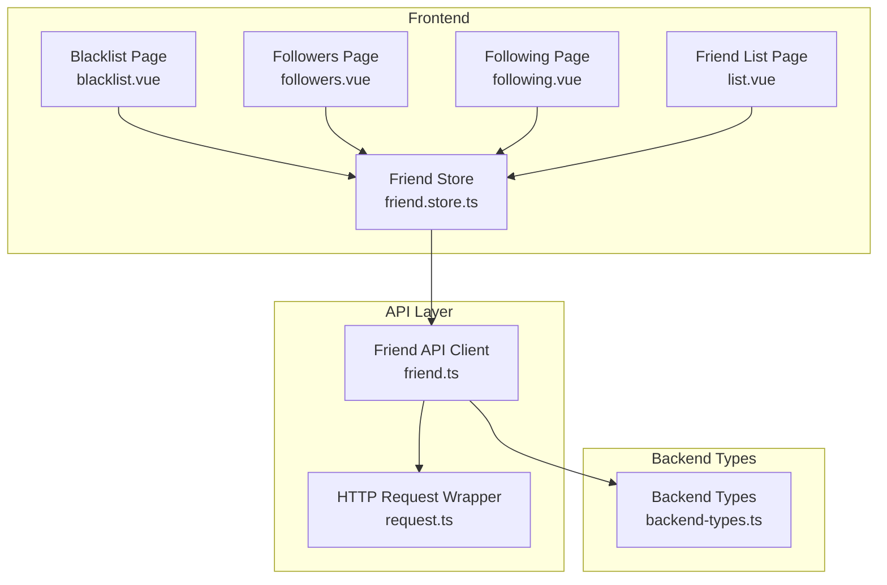
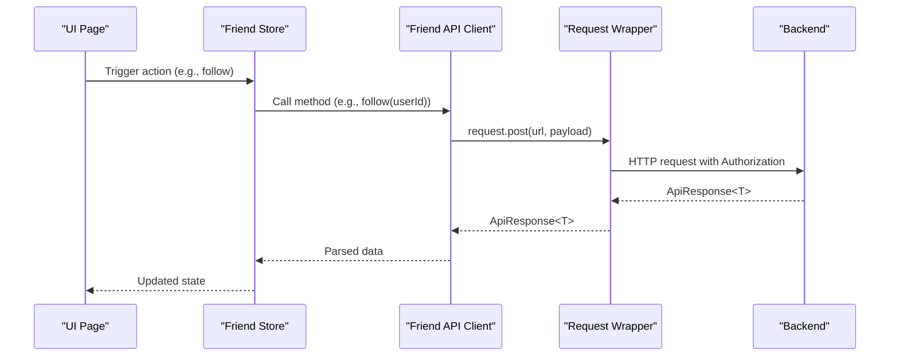
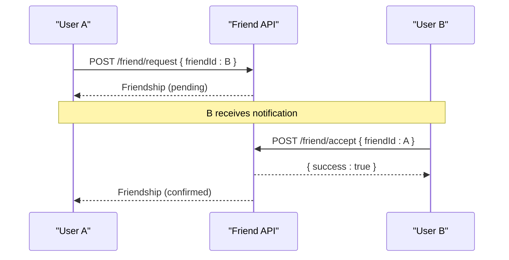
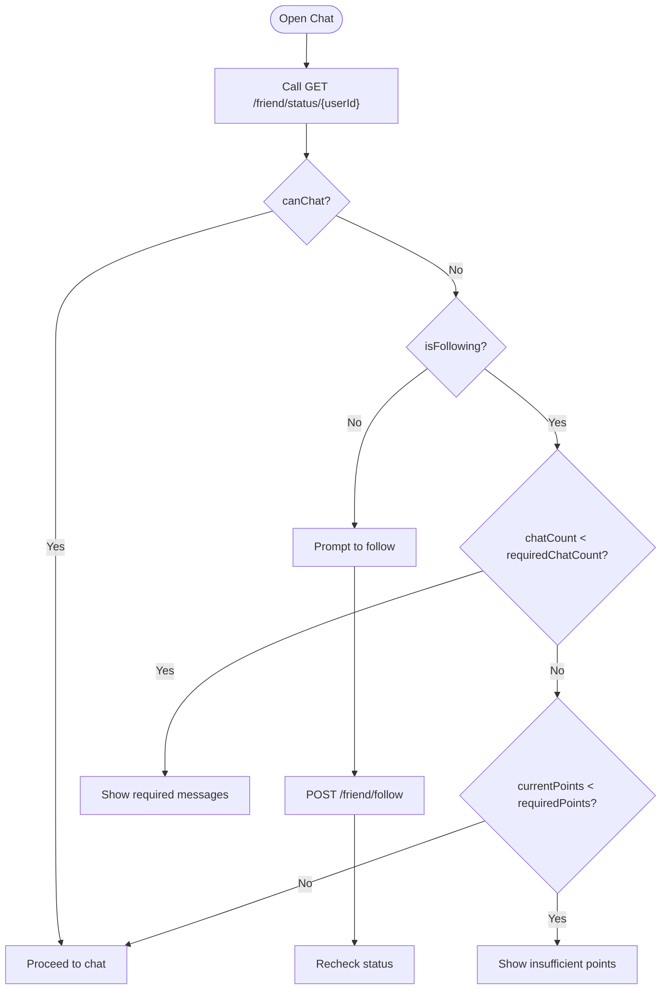
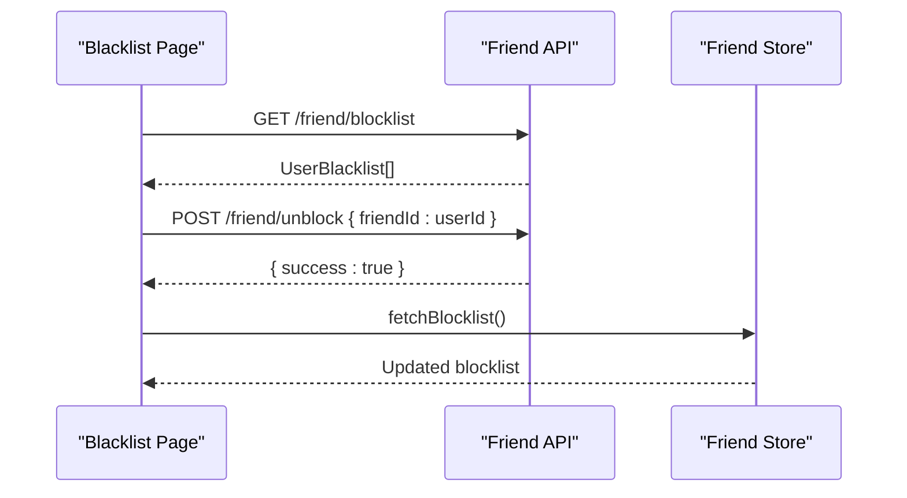
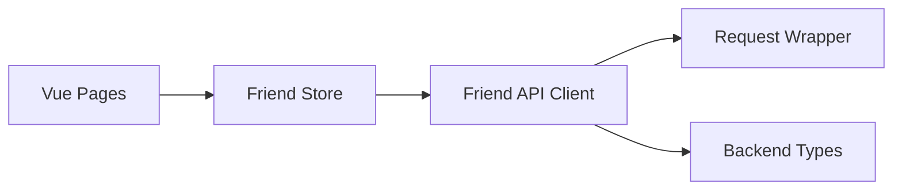

# Friend API

<cite>
**Referenced Files in This Document**
- [friend.ts](file://src/api/modules/friend.ts)
- [backend-types.ts](file://src/types/api/backend-types.ts)
- [request.ts](file://src/api/request.ts)
- [friend.store.ts](file://src/stores/friend.ts)
- [blacklist.vue](file://src/pages/friend/blacklist.vue)
- [followers.vue](file://src/pages/friend/followers.vue)
- [following.vue](file://src/pages/friend/following.vue)
- [list.vue](file://src/pages/friend/list.vue)
- [API_FIX_REPORT.md](file://API_FIX_REPORT.md)
</cite>

## Table of Contents
1. [Introduction](#introduction)
2. [Project Structure](#project-structure)
3. [Core Components](#core-components)
4. [Architecture Overview](#architecture-overview)
5. [Detailed Component Analysis](#detailed-component-analysis)
6. [Dependency Analysis](#dependency-analysis)
7. [Performance Considerations](#performance-considerations)
8. [Troubleshooting Guide](#troubleshooting-guide)
9. [Conclusion](#conclusion)

## Introduction
This document provides comprehensive API documentation for the Friend module responsible for social connections. It covers endpoints for friend requests, friend lists, following/unfollowing, blocking/unblocking users, and friendship status checks. It also documents pagination patterns, filtering options for user discovery, bulk operations, and workflows for friend request acceptance and mutual friend calculations. Examples are included for sending friend requests, managing blocked users, searching potential connections, and retrieving friend suggestions. Error handling for duplicate requests, self-connection attempts, and privacy restrictions is outlined.

## Project Structure
The Friend module is implemented as a typed API client that communicates with a backend service. The client exposes methods for friend and follow operations, while the frontend pages consume these APIs to render lists and manage user interactions. Stores orchestrate data fetching and updates.

**Diagram sources**
- [friend.ts:16-61](file://src/api/modules/friend.ts#L16-L61)
- [request.ts:1-228](file://src/api/request.ts#L1-L228)
- [friend.store.ts:1-70](file://src/stores/friend.ts#L1-L70)
- [blacklist.vue:1-261](file://src/pages/friend/blacklist.vue#L1-L261)
- [followers.vue:1-178](file://src/pages/friend/followers.vue#L1-L178)
- [following.vue:1-160](file://src/pages/friend/following.vue#L1-L160)
- [list.vue:1-184](file://src/pages/friend/list.vue#L1-L184)
- [backend-types.ts:292-339](file://src/types/api/backend-types.ts#L292-L339)

**Section sources**
- [friend.ts:16-61](file://src/api/modules/friend.ts#L16-L61)
- [request.ts:1-228](file://src/api/request.ts#L1-L228)
- [friend.store.ts:1-70](file://src/stores/friend.ts#L1-L70)
- [blacklist.vue:1-261](file://src/pages/friend/blacklist.vue#L1-L261)
- [followers.vue:1-178](file://src/pages/friend/followers.vue#L1-L178)
- [following.vue:1-160](file://src/pages/friend/following.vue#L1-L160)
- [list.vue:1-184](file://src/pages/friend/list.vue#L1-L184)
- [backend-types.ts:292-339](file://src/types/api/backend-types.ts#L292-L339)

## Core Components
- Friend API Client: Provides typed methods for friend and follow operations, friendship status checks, and block management.
- HTTP Request Wrapper: Centralizes request configuration, authentication headers, token refresh, and unified error handling.
- Backend Types: Defines response envelopes and entity schemas used across the API.
- Friend Store: Orchestrates data fetching and updates for friend, following, and block lists.
- Frontend Pages: Consume the API client and store to render lists and manage user actions.

Key responsibilities:
- Authentication: Adds Authorization header automatically; handles token refresh on 401.
- Unified Responses: Expects ApiResponse<T> envelope with code/message/data.
- Error Handling: Displays toast messages and rejects promises on non-zero codes or network errors.

**Section sources**
- [friend.ts:16-61](file://src/api/modules/friend.ts#L16-L61)
- [request.ts:15-228](file://src/api/request.ts#L15-L228)
- [backend-types.ts:4-9](file://src/types/api/backend-types.ts#L4-L9)

## Architecture Overview
The Friend API follows a layered architecture:
- Presentation Layer: Vue pages render lists and capture user actions.
- Domain Layer: Pinia store coordinates data retrieval and updates.
- API Layer: Typed friend API client encapsulates HTTP calls.
- Transport Layer: Request wrapper manages headers, retries, and token refresh.
- Backend Contracts: Strongly typed models define request/response shapes.

**Diagram sources**
- [friend.store.ts:29-35](file://src/stores/friend.ts#L29-L35)
- [friend.ts:32-36](file://src/api/modules/friend.ts#L32-L36)
- [request.ts:75-208](file://src/api/request.ts#L75-L208)

**Section sources**
- [friend.store.ts:1-70](file://src/stores/friend.ts#L1-L70)
- [friend.ts:16-61](file://src/api/modules/friend.ts#L16-L61)
- [request.ts:1-228](file://src/api/request.ts#L1-L228)

## Detailed Component Analysis

### Friend API Endpoints
All endpoints are exposed via the Friend API client. Requests are authenticated using the Authorization header. Responses conform to the ApiResponse<T> envelope.

- Friend Lists
  - GET /friend/list
    - Purpose: Retrieve current user’s friends.
    - Auth: Required.
    - Response: Array of Friendship.
  - GET /friend/following
    - Purpose: Retrieve current user’s followed accounts.
    - Auth: Required.
    - Response: Array of Friendship.
  - GET /friend/following/{userId}
    - Purpose: Retrieve another user’s followed accounts.
    - Auth: Optional (public if allowed).
    - Response: Array of Friendship.
  - GET /friend/followers
    - Purpose: Retrieve current user’s followers.
    - Auth: Required.
    - Response: Array of Friendship.
  - GET /friend/followers/{userId}
    - Purpose: Retrieve another user’s followers.
    - Auth: Optional (public if allowed).
    - Response: Array of Friendship.

- Friend Requests and Management
  - POST /friend/follow
    - Purpose: Start following a user.
    - Auth: Required.
    - Request: { friendId: number }.
    - Response: Friendship.
  - POST /friend/unfollow
    - Purpose: Unfollow a user.
    - Auth: Required.
    - Request: { friendId: number }.
    - Response: { success: boolean }.
  - POST /friend/request
    - Purpose: Send a friend request.
    - Auth: Required.
    - Request: { friendId: number, message?: string }.
    - Response: Friendship.
  - POST /friend/accept
    - Purpose: Accept a received friend request.
    - Auth: Required.
    - Request: { friendId: number }.
    - Response: { success: boolean }.
  - POST /friend/add-friend
    - Purpose: Confirm/accept a friend request with payment if applicable.
    - Auth: Required.
    - Request: { friendId: number }.
    - Response: { success: boolean, pointsConsumed: number }.
  - DELETE /friend/{userId}
    - Purpose: Remove a friend.
    - Auth: Required.
    - Response: { success: boolean }.

- Friendship Status and Unlock Conditions
  - GET /friend/status/{userId}
    - Purpose: Get friendship status and unlock conditions for chatting.
    - Auth: Required.
    - Response: FriendshipStatus with flags and thresholds.

- Blocking and Blacklist
  - POST /friend/block
    - Purpose: Block a user.
    - Auth: Required.
    - Request: { friendId: blockedUserId, reason?: string }.
    - Response: UserBlacklist.
  - POST /friend/unblock
    - Purpose: Unblock a user.
    - Auth: Required.
    - Request: { friendId: blockedUserId }.
    - Response: { success: boolean }.
  - GET /friend/blocklist
    - Purpose: Retrieve current user’s blocklist.
    - Auth: Required.
    - Response: Array of UserBlacklist.

Response Envelope
- ApiResponse<T>
  - code: number
  - message: string
  - data: T
  - timestamp: number

Entity Schemas
- Friendship
  - id: number
  - userId: number
  - friendId: number
  - status: number (enum-like)
  - unlockPoints: number
  - chatCount: number
  - isMutual: boolean
  - lastChatAt: string
  - createdAt: string
  - updatedAt: string
  - user: User
  - friend: User
- UserBlacklist
  - id: number
  - userId: number
  - blockedUserId: number
  - reason: string
  - createdAt: string
  - user: User
  - blockedUser: User
- FriendshipStatus
  - isFriend: boolean
  - isFollowing: boolean
  - canAddFriend: boolean
  - chatCount: number
  - requiredChatCount: number
  - requiredPoints: number
  - currentPoints: number
  - status: number

Permission Requirements
- All endpoints require a valid Authorization token.
- Some endpoints may expose public data for read-only access depending on backend policy.

Pagination and Filtering
- Friend lists are returned as arrays; no built-in pagination is present in the client methods.
- Pagination model types exist in backend types for server-side pagination scenarios.

Bulk Operations
- No explicit bulk endpoints are exposed in the client. Operations are per-user.

Examples
- Sending a friend request
  - Method: POST /friend/request
  - Request: { friendId: number, message?: string }
  - Response: Friendship
- Managing blocked users
  - Block: POST /friend/block with { friendId: blockedUserId, reason?: string }
  - Unblock: POST /friend/unblock with { friendId: blockedUserId }
  - View blocklist: GET /friend/blocklist
- Searching potential connections
  - Use user discovery features (e.g., nearby users) and then follow or send friend requests.
- Retrieving friend suggestions
  - Use user discovery and mutual connection indicators where available.

Error Handling
- Duplicate requests: Expect non-zero code and error message; surface to user.
- Self-connection attempts: Prevent in UI; backend may reject with appropriate error.
- Privacy restrictions: Access denied for protected profiles; handle gracefully.

**Section sources**
- [friend.ts:16-61](file://src/api/modules/friend.ts#L16-L61)
- [backend-types.ts:292-339](file://src/types/api/backend-types.ts#L292-L339)
- [backend-types.ts:4-9](file://src/types/api/backend-types.ts#L4-L9)
- [API_FIX_REPORT.md:437-517](file://API_FIX_REPORT.md#L437-L517)

### Friend Request Workflows

**Diagram sources**
- [friend.ts:38-45](file://src/api/modules/friend.ts#L38-L45)

**Section sources**
- [friend.ts:38-45](file://src/api/modules/friend.ts#L38-L45)

### Mutual Friend Calculations
- Mutual friends are indicated by the isMutual flag in the Friendship entity.
- To compute mutuals programmatically, intersect the current user’s friend list with another user’s friend list and filter by isMutual.

**Section sources**
- [backend-types.ts:292-319](file://src/types/api/backend-types.ts#L292-L319)

### Chat Unlock Conditions

**Diagram sources**
- [list.vue:59-109](file://src/pages/friend/list.vue#L59-L109)
- [friend.ts:47-48](file://src/api/modules/friend.ts#L47-L48)

**Section sources**
- [list.vue:59-109](file://src/pages/friend/list.vue#L59-L109)
- [friend.ts:47-48](file://src/api/modules/friend.ts#L47-L48)

### Block Management UI Flow

**Diagram sources**
- [blacklist.vue:52-103](file://src/pages/friend/blacklist.vue#L52-L103)
- [friend.store.ts:51-54](file://src/stores/friend.ts#L51-L54)

**Section sources**
- [blacklist.vue:52-103](file://src/pages/friend/blacklist.vue#L52-L103)
- [friend.store.ts:51-54](file://src/stores/friend.ts#L51-L54)

## Dependency Analysis
- Friend API client depends on the HTTP request wrapper for transport and authentication.
- Frontend pages depend on the Friend Store for data and on the API client for network calls.
- Backend types define the contract for responses and entities.

**Diagram sources**
- [friend.ts:1-3](file://src/api/modules/friend.ts#L1-L3)
- [request.ts:1-228](file://src/api/request.ts#L1-L228)
- [friend.store.ts:1-70](file://src/stores/friend.ts#L1-L70)
- [backend-types.ts:292-339](file://src/types/api/backend-types.ts#L292-L339)

**Section sources**
- [friend.ts:1-3](file://src/api/modules/friend.ts#L1-L3)
- [request.ts:1-228](file://src/api/request.ts#L1-L228)
- [friend.store.ts:1-70](file://src/stores/friend.ts#L1-L70)
- [backend-types.ts:292-339](file://src/types/api/backend-types.ts#L292-L339)

## Performance Considerations
- Prefer optimistic UI updates for follow/unfollow actions to improve perceived responsiveness.
- Debounce frequent requests and avoid redundant fetches by caching results in the store.
- Use pagination on the backend when retrieving large lists; currently, client methods return arrays without pagination.

## Troubleshooting Guide
Common issues and resolutions:
- Unauthorized Access (401)
  - Cause: Missing or expired token.
  - Resolution: The request wrapper automatically refreshes tokens; if refresh fails, redirect to login.
- Duplicate Requests
  - Cause: Attempting to follow or send a friend request again.
  - Resolution: Check existing status via GET /friend/status/{userId}; prevent duplicate submissions.
- Self-Connection Attempts
  - Cause: Attempting to follow or add yourself as friend.
  - Resolution: Validate against current user ID in UI; show informative message.
- Privacy Restrictions
  - Cause: Profile visibility settings or blocked users.
  - Resolution: Handle gracefully; inform user and suggest alternatives.

**Section sources**
- [request.ts:100-147](file://src/api/request.ts#L100-L147)
- [followers.vue:82-88](file://src/pages/friend/followers.vue#L82-L88)
- [list.vue:59-109](file://src/pages/friend/list.vue#L59-L109)

## Conclusion
The Friend module provides a robust set of endpoints for managing social connections, including friend requests, following, blocking, and status checks. The API client enforces authentication and standardized responses, while the store and pages coordinate data and user interactions. For production readiness, consider adding server-side pagination, bulk operations, and enhanced error messaging aligned with backend responses.