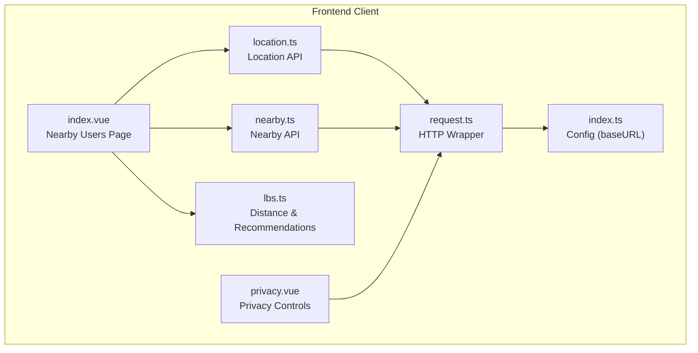
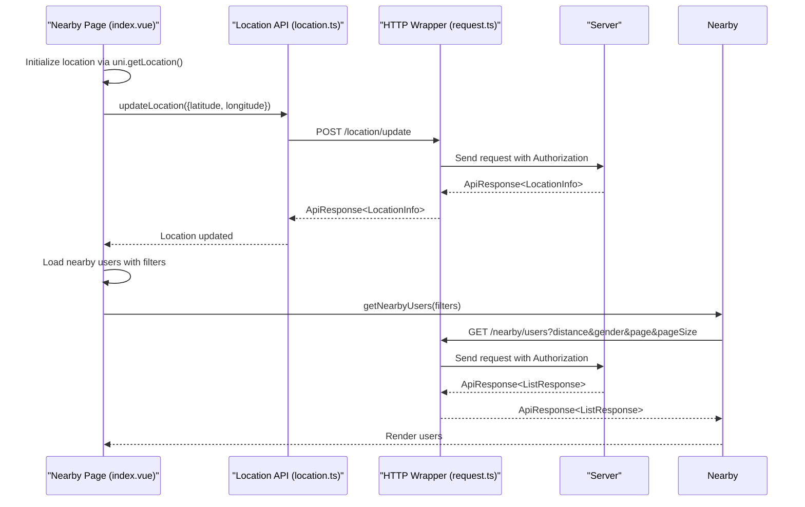
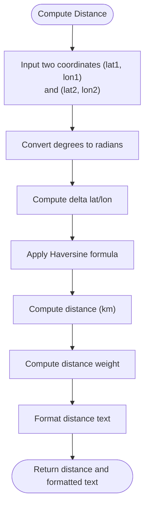
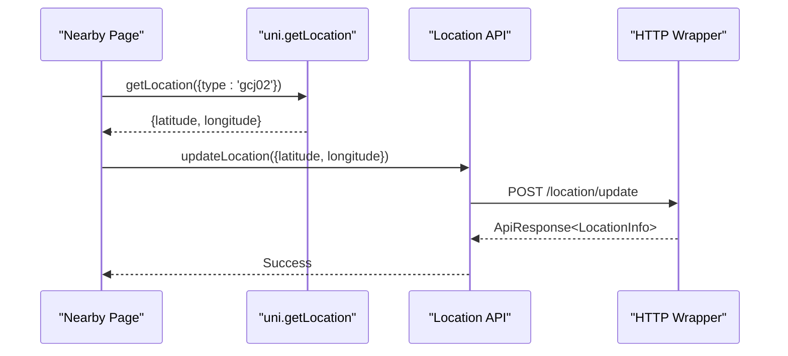
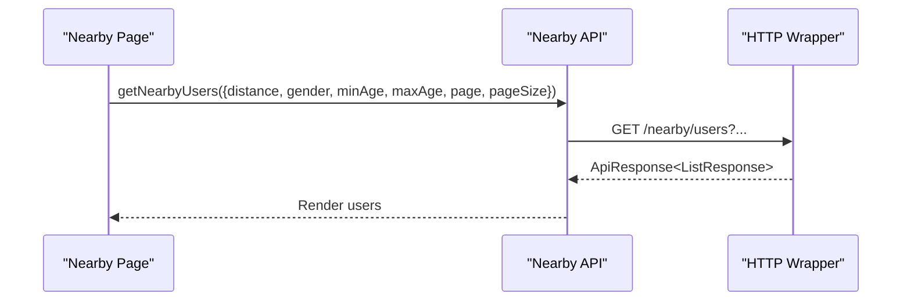
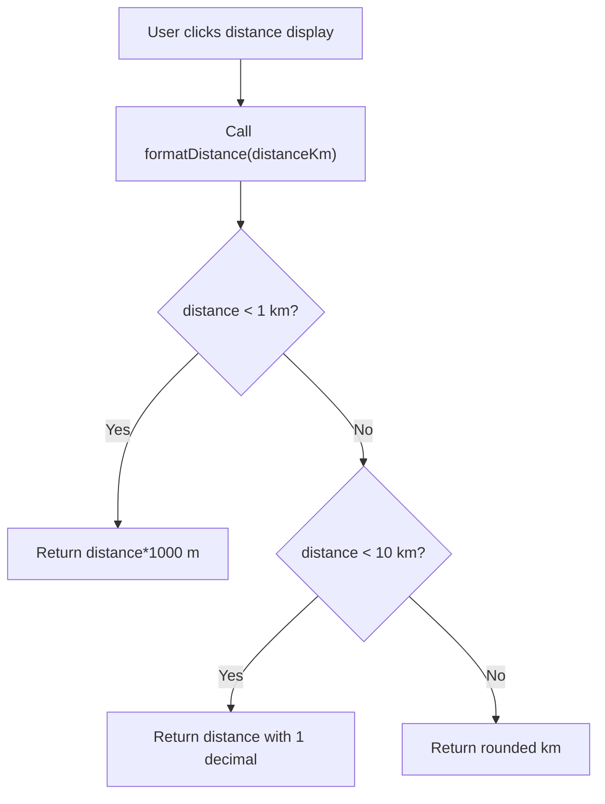
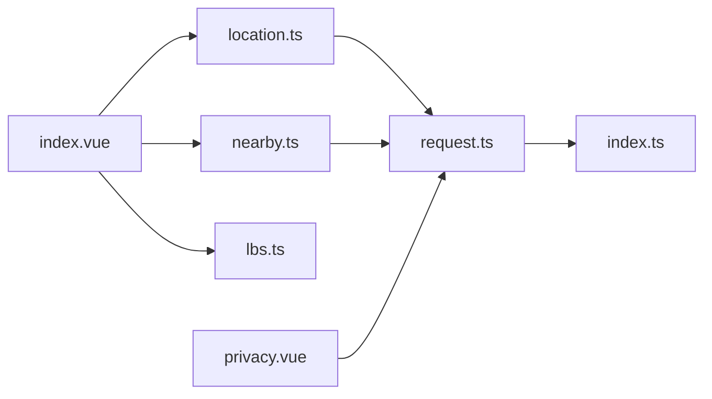

# Location & Nearby API

<cite>
**Referenced Files in This Document**
- [location.ts](file://src/api/modules/location.ts)
- [nearby.ts](file://src/api/modules/nearby.ts)
- [index.vue](file://src/pages/nearby/index.vue)
- [lbs.ts](file://src/pages/tabbar/home/algorithms/lbs.ts)
- [backend-types.ts](file://src/types/api/backend-types.ts)
- [request.ts](file://src/api/request.ts)
- [index.ts](file://src/config/index.ts)
- [privacy.vue](file://src/pages/profile/privacy.vue)
</cite>

## Table of Contents
1. [Introduction](#introduction)
2. [Project Structure](#project-structure)
3. [Core Components](#core-components)
4. [Architecture Overview](#architecture-overview)
5. [Detailed Component Analysis](#detailed-component-analysis)
6. [Dependency Analysis](#dependency-analysis)
7. [Performance Considerations](#performance-considerations)
8. [Troubleshooting Guide](#troubleshooting-guide)
9. [Conclusion](#conclusion)

## Introduction
This document provides comprehensive API documentation for the Location and Nearby module, covering geolocation services and proximity-based features. It documents endpoints for location services, nearby user discovery, distance calculations, and geographic filtering. For each endpoint, it specifies HTTP methods, URL patterns, request/response schemas, and coordinate validation requirements. It also covers GPS data handling, location accuracy thresholds, and privacy controls for location sharing. The document includes nearby user search with radius filters, user density calculations, and location-based recommendations, along with practical examples for setting user locations, finding nearby users, calculating distances, and managing location permissions.

## Project Structure
The Location and Nearby module is implemented in the frontend client with the following key components:
- API modules for location and nearby functionality
- A nearby users page that integrates location updates and user discovery
- A distance calculation and recommendation algorithm
- A privacy page for controlling location visibility
- A shared request wrapper for HTTP communication

**Diagram sources**
- [location.ts:1-79](file://src/api/modules/location.ts#L1-L79)
- [nearby.ts:1-82](file://src/api/modules/nearby.ts#L1-L82)
- [index.vue:1-712](file://src/pages/nearby/index.vue#L1-L712)
- [lbs.ts:1-380](file://src/pages/tabbar/home/algorithms/lbs.ts#L1-L380)
- [privacy.vue:1-494](file://src/pages/profile/privacy.vue#L1-L494)
- [request.ts:1-228](file://src/api/request.ts#L1-L228)
- [index.ts:1-11](file://src/config/index.ts#L1-L11)

**Section sources**
- [location.ts:1-79](file://src/api/modules/location.ts#L1-L79)
- [nearby.ts:1-82](file://src/api/modules/nearby.ts#L1-L82)
- [index.vue:1-712](file://src/pages/nearby/index.vue#L1-L712)
- [lbs.ts:1-380](file://src/pages/tabbar/home/algorithms/lbs.ts#L1-L380)
- [privacy.vue:1-494](file://src/pages/profile/privacy.vue#L1-L494)
- [request.ts:1-228](file://src/api/request.ts#L1-L228)
- [index.ts:1-11](file://src/config/index.ts#L1-L11)

## Core Components
- Location API module: Provides functions to update user location, retrieve current location, reverse geocode coordinates to city information, save user-selected city, retrieve saved city, and set location visibility.
- Nearby API module: Provides functions to fetch nearby users with filters, greet users, record visits, and retrieve nearby statistics.
- Nearby Users Page: Integrates location initialization, nearby user discovery, filtering, pagination, and greeting actions.
- Distance & Recommendations: Implements Haversine distance calculation, nearby user filtering, geofencing, bounding box computation, grid-based indexing, and heat map generation.
- Privacy Controls: Manages visibility settings for location and other personal information.
- HTTP Wrapper: Centralized request handling with token management, retries, and error handling.

**Section sources**
- [location.ts:1-79](file://src/api/modules/location.ts#L1-L79)
- [nearby.ts:1-82](file://src/api/modules/nearby.ts#L1-L82)
- [index.vue:1-712](file://src/pages/nearby/index.vue#L1-L712)
- [lbs.ts:1-380](file://src/pages/tabbar/home/algorithms/lbs.ts#L1-L380)
- [privacy.vue:1-494](file://src/pages/profile/privacy.vue#L1-L494)
- [request.ts:1-228](file://src/api/request.ts#L1-L228)

## Architecture Overview
The Location and Nearby APIs follow a modular architecture:
- API modules encapsulate HTTP requests and response typing.
- The nearby page orchestrates location initialization and user discovery.
- The LBS algorithm provides distance computations and recommendations.
- Privacy controls integrate with the broader profile settings.
- The request wrapper centralizes authentication, token refresh, and error handling.

**Diagram sources**
- [index.vue:202-244](file://src/pages/nearby/index.vue#L202-L244)
- [location.ts:28-42](file://src/api/modules/location.ts#L28-L42)
- [nearby.ts:37-49](file://src/api/modules/nearby.ts#L37-L49)
- [request.ts:75-208](file://src/api/request.ts#L75-L208)

## Detailed Component Analysis

### Location API Endpoints
- Update user location
  - Method: POST
  - URL: /location/update
  - Request body: UpdateLocationParams
    - latitude: number
    - longitude: number
    - city?: string
    - province?: string
    - district?: string
    - address?: string
  - Response: ApiResponse<LocationInfo>
    - code: number
    - message: string
    - data: LocationInfo
      - latitude: number
      - longitude: number
      - city: string
      - province?: string
      - district?: string
      - address?: string
  - Notes: Used by the nearby page to initialize or update user location.

- Get current location
  - Method: GET
  - URL: /location/current
  - Response: ApiResponse<LocationInfo>

- Reverse geocode coordinates to city
  - Method: POST
  - URL: /location/geocode
  - Request body: { latitude: number; longitude: number }
  - Response: ApiResponse<LocationInfo>

- Save user-selected city
  - Method: POST
  - URL: /location/save-city
  - Request body: { cityId: number }
  - Response: ApiResponse<void>

- Get user saved city
  - Method: GET
  - URL: /location/user-city
  - Response: ApiResponse<{ city: string }>

- Set location visibility
  - Method: PUT
  - URL: /location/visibility
  - Request body: { isVisible: number }
  - Response: ApiResponse<void>
  - Notes: The nearby page uses this to control whether location is visible to others.

Coordinate validation requirements:
- Latitude: typically -90 to 90
- Longitude: typically -180 to 180
- Accuracy thresholds: The nearby page initializes location using uni.getLocation with gcj02 and falls back to a default coordinate if location fails. No explicit accuracy threshold is enforced in the frontend code.

GPS data handling:
- The nearby page obtains device location via uni.getLocation and passes it to updateLocation.
- On failure, it displays user-friendly messages and falls back to a default coordinate (Beijing).

Privacy controls:
- The privacy page allows users to set location visibility levels (public, friends, certified, private).
- The location API provides a dedicated endpoint to set visibility.

**Section sources**
- [location.ts:1-79](file://src/api/modules/location.ts#L1-L79)
- [index.vue:214-244](file://src/pages/nearby/index.vue#L214-L244)
- [privacy.vue:121-136](file://src/pages/profile/privacy.vue#L121-L136)

### Nearby API Endpoints
- Get nearby users
  - Method: GET
  - URL: /nearby/users
  - Query parameters:
    - distance?: number (default 5000 meters)
    - gender?: number (0: any, 1: male, 2: female)
    - minAge?: number
    - maxAge?: number
    - page?: number
    - pageSize?: number
  - Response: ApiResponse<{ list: NearbyUser[], total: number, hasMore: boolean }>
    - list: Array of NearbyUser
      - id: number
      - nickname: string
      - avatar: string
      - age?: number
      - gender?: number
      - city?: string
      - bio?: string
      - tags?: string[]
      - distance: number (meters)
      - distanceText: string (e.g., "1.2km")
      - lastActiveTime: number (timestamp)
      - isOnline: boolean
      - hasSaidHello?: boolean
    - total: number
    - hasMore: boolean

- Say hello to a user
  - Method: POST
  - URL: /nearby/users/:id/hello
  - Request body: { content?: string }
  - Response: ApiResponse<void>

- Record visit
  - Method: POST
  - URL: /nearby/visit
  - Request body: { visitedUserId: number; distance: number }
  - Response: ApiResponse<void>

- Get nearby statistics
  - Method: GET
  - URL: /nearby/stats
  - Query parameters:
    - days?: number
  - Response: ApiResponse<{ visitedCount: number; visitorCount: number; days: number }>

Nearby user search with radius filters:
- The nearby page sets default distance to 5km and supports options up to 20km.
- Filters include gender and optional age range.
- Pagination is supported via page/pageSize.

User density calculations:
- The LBS module includes a heat map generator that counts users per grid cell within a bounding box.

Location-based recommendations:
- The LBS module provides functions to compute distances, filter nearby users, and generate recommendations based on distance weights.

**Section sources**
- [nearby.ts:1-82](file://src/api/modules/nearby.ts#L1-L82)
- [index.vue:162-189](file://src/pages/nearby/index.vue#L162-L189)
- [lbs.ts:308-348](file://src/pages/tabbar/home/algorithms/lbs.ts#L308-L348)

### Distance Calculations and Geographic Filtering
- Haversine formula implementation:
  - Calculates distance between two coordinates in kilometers.
  - Returns distance in kilometers.
- Distance weighting:
  - Computes a weight based on distance to prioritize closer users.
- Formatting distance:
  - Converts distance to human-readable strings (meters/kilometers).
- Geofencing:
  - Checks if a user is within a specified radius of a center point.
- Bounding box:
  - Computes latitude/longitude deltas for efficient spatial queries.
- Grid indexing:
  - Maps locations to grid cells for fast neighbor searches.
- Heat map generation:
  - Aggregates user density within a region.

**Diagram sources**
- [lbs.ts:27-92](file://src/pages/tabbar/home/algorithms/lbs.ts#L27-L92)

**Section sources**
- [lbs.ts:1-380](file://src/pages/tabbar/home/algorithms/lbs.ts#L1-L380)

### Example Workflows

#### Setting User Location
- Obtain device location using uni.getLocation with gcj02.
- Call updateLocation with latitude and longitude.
- On failure, display a toast and optionally fall back to a default coordinate.

**Diagram sources**
- [index.vue:214-244](file://src/pages/nearby/index.vue#L214-L244)
- [location.ts:28-42](file://src/api/modules/location.ts#L28-L42)
- [request.ts:75-208](file://src/api/request.ts#L75-L208)

#### Finding Nearby Users
- Apply filters (distance, gender, age).
- Paginate using page and pageSize.
- Display users with distance and online status.

**Diagram sources**
- [index.vue:256-298](file://src/pages/nearby/index.vue#L256-L298)
- [nearby.ts:37-49](file://src/api/modules/nearby.ts#L37-L49)
- [request.ts:75-208](file://src/api/request.ts#L75-L208)

#### Calculating Distances
- Use calculateDistance to compute kilometers between two coordinates.
- Format distance for display using formatDistance.

**Diagram sources**
- [lbs.ts:84-92](file://src/pages/tabbar/home/algorithms/lbs.ts#L84-L92)

#### Managing Location Permissions
- On location failure, show a toast indicating permission denial or other errors.
- Optionally fall back to a default coordinate and notify the server via updateLocation.

**Section sources**
- [index.vue:225-244](file://src/pages/nearby/index.vue#L225-L244)

## Dependency Analysis
- API modules depend on the centralized request wrapper for HTTP communication.
- The nearby page depends on both location and nearby modules.
- The LBS algorithm is independent and can be reused elsewhere.
- Privacy controls integrate with profile settings and influence visibility.

**Diagram sources**
- [index.vue:142-144](file://src/pages/nearby/index.vue#L142-L144)
- [location.ts:1-2](file://src/api/modules/location.ts#L1-L2)
- [nearby.ts:1-2](file://src/api/modules/nearby.ts#L1-L2)
- [lbs.ts:1-4](file://src/pages/tabbar/home/algorithms/lbs.ts#L1-L4)
- [request.ts:1-228](file://src/api/request.ts#L1-L228)
- [privacy.vue:108-118](file://src/pages/profile/privacy.vue#L108-L118)
- [index.ts:1-11](file://src/config/index.ts#L1-L11)

**Section sources**
- [index.vue:140-144](file://src/pages/nearby/index.vue#L140-L144)
- [request.ts:1-228](file://src/api/request.ts#L1-L228)

## Performance Considerations
- Distance calculations use the Haversine formula, which is efficient for small-to-medium distances.
- Grid-based indexing and bounding box computation can optimize database queries for large datasets.
- Pagination reduces payload sizes and improves responsiveness.
- Avoid excessive re-renders by batching UI updates and using computed properties for derived values.

## Troubleshooting Guide
Common issues and resolutions:
- GPS unavailable or permission denied:
  - The nearby page catches location errors and shows user-friendly messages. It falls back to a default coordinate and updates the server accordingly.
- Network errors:
  - The request wrapper handles network failures and displays a toast. It also manages token refresh and retry logic.
- Authentication failures:
  - On 401 responses, the request wrapper attempts to refresh tokens and retries the request. If refresh fails, it clears stored tokens and navigates to the login page.

**Section sources**
- [index.vue:225-244](file://src/pages/nearby/index.vue#L225-L244)
- [request.ts:100-147](file://src/api/request.ts#L100-L147)

## Conclusion
The Location and Nearby module provides a robust foundation for geolocation services and proximity-based features. It offers clear APIs for updating and retrieving location data, discovering nearby users with flexible filters, calculating distances, and managing privacy controls. The integrated LBS algorithms enable efficient distance computations and recommendations. The centralized request wrapper ensures consistent error handling and authentication. Together, these components deliver a scalable and user-friendly location-based experience.