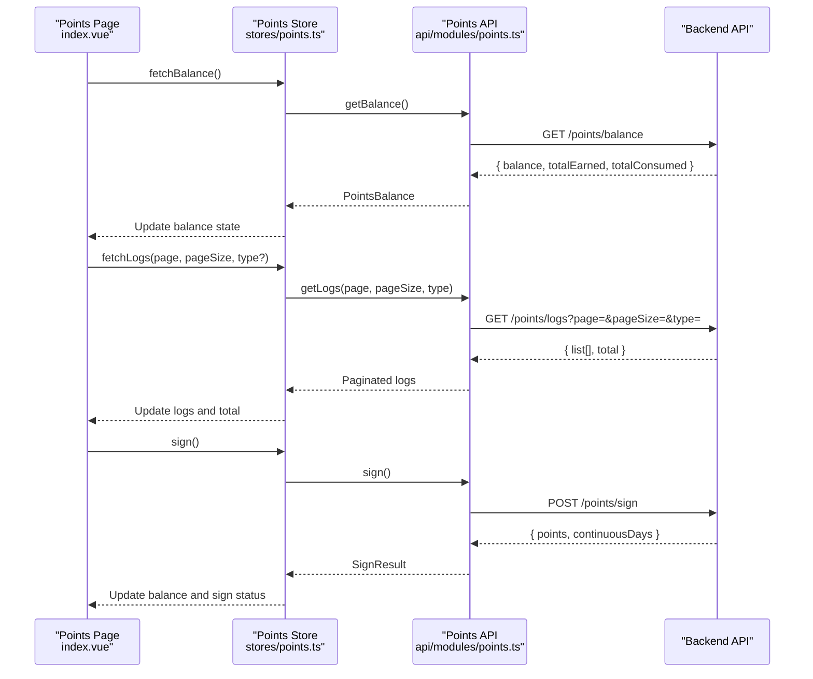
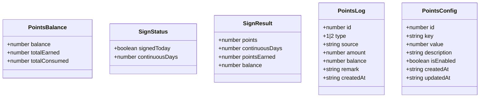
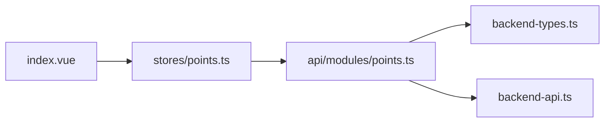

# Points API

<cite>
**Referenced Files in This Document**
- [points.ts](file://src/api/modules/points.ts)
- [points.ts](file://src/stores/points.ts)
- [index.vue](file://src/pages/points/index.vue)
- [backend-types.ts](file://src/types/api/backend-types.ts)
- [backend-api.ts](file://src/types/api/backend-api.ts)
- [points-balance-fix.md](file://docs/points-balance-fix.md)
- [points-list-pagination.md](file://docs/fix-deploy/points-list-pagination.md)
</cite>

## Table of Contents
1. [Introduction](#introduction)
2. [Project Structure](#project-structure)
3. [Core Components](#core-components)
4. [Architecture Overview](#architecture-overview)
5. [Detailed Component Analysis](#detailed-component-analysis)
6. [Dependency Analysis](#dependency-analysis)
7. [Performance Considerations](#performance-considerations)
8. [Troubleshooting Guide](#troubleshooting-guide)
9. [Conclusion](#conclusion)

## Introduction
This document provides comprehensive API documentation for the Points module that manages the reward system and gamification features. It covers endpoints for balance inquiries, transaction history, sign-in streaks, and configuration retrieval. It also documents data models, transaction types, balance computation rules, pagination behavior, and error handling strategies observed in the frontend implementation.

## Project Structure
The Points module spans three primary areas:
- API client module that defines endpoints and response types
- Pinia store that orchestrates data fetching and caching
- Vue page component that renders the points dashboard and handles pagination

```mermaid
graph TB
subgraph "Frontend"
UI["Points Page<br/>index.vue"]
Store["Points Store<br/>stores/points.ts"]
API["Points API Module<br/>api/modules/points.ts"]
end
subgraph "Types"
Types["Backend Types<br/>backend-types.ts"]
APIType["Backend API Types<br/>backend-api.ts"]
end
UI --> Store
Store --> API
API --> Types
API --> APIType
```

**Diagram sources**
- [index.vue:1-347](file://src/pages/points/index.vue#L1-L347)
- [points.ts:1-72](file://src/stores/points.ts#L1-L72)
- [points.ts:1-55](file://src/api/modules/points.ts#L1-L55)
- [backend-types.ts:343-359](file://src/types/api/backend-types.ts#L343-L359)
- [backend-api.ts:300-321](file://src/types/api/backend-api.ts#L300-L321)

**Section sources**
- [points.ts:1-55](file://src/api/modules/points.ts#L1-L55)
- [points.ts:1-72](file://src/stores/points.ts#L1-L72)
- [index.vue:1-347](file://src/pages/points/index.vue#L1-L347)
- [backend-types.ts:343-359](file://src/types/api/backend-types.ts#L343-L359)
- [backend-api.ts:300-321](file://src/types/api/backend-api.ts#L300-L321)

## Core Components
- Points API module: Declares endpoints for balance, sign-in, sign-in status, logs, and configuration retrieval.
- Points Store: Centralizes state and async operations for balance, sign-in status, logs, and pagination.
- Points Page: Renders the points dashboard, tabs, and logs list with infinite scrolling.

Key responsibilities:
- Balance: Fetches current points, total earned, and total consumed.
- Logs: Paginates transaction history with support for filtering by type.
- Sign-in: Triggers daily sign-in and updates local state.
- Config: Retrieves configuration items for points-related settings.

**Section sources**
- [points.ts:32-54](file://src/api/modules/points.ts#L32-L54)
- [points.ts:5-71](file://src/stores/points.ts#L5-L71)
- [index.vue:1-347](file://src/pages/points/index.vue#L1-L347)

## Architecture Overview
The Points module follows a unidirectional data flow:
- UI triggers actions in the store.
- Store calls the API module.
- API module performs HTTP requests to backend endpoints.
- Responses update store state, which re-renders the UI.



**Diagram sources**
- [index.vue:84-136](file://src/pages/points/index.vue#L84-L136)
- [points.ts:13-68](file://src/stores/points.ts#L13-L68)
- [points.ts:32-47](file://src/api/modules/points.ts#L32-L47)

## Detailed Component Analysis

### API Endpoints

#### Balance Inquiry
- Method: GET
- URL: /points/balance
- Request: None
- Response: PointsBalance
  - balance: Current points balance
  - totalEarned: Sum of earned points
  - totalConsumed: Sum of consumed points

Notes:
- The frontend displays cumulative totals alongside the current balance.
- Historical data reconciliation is documented in the balance fix report.

**Section sources**
- [points.ts:32-34](file://src/api/modules/points.ts#L32-L34)
- [points.ts:4-8](file://src/api/modules/points.ts#L4-L8)
- [index.vue:3-16](file://src/pages/points/index.vue#L3-L16)
- [points-balance-fix.md:26-47](file://docs/points-balance-fix.md#L26-L47)

#### Transaction History
- Method: GET
- URL: /points/logs
- Query parameters:
  - page: Page number (default 1)
  - pageSize: Items per page (default 20)
  - type: Filter by type (1 for income, 2 for expense)
- Response: { list: PointsLog[], total: number }

PointsLog fields:
- id: Log identifier
- type: 1 or 2 (income or expense)
- source: Source label
- amount: Numeric amount (positive for income, negative for expense)
- balance: Balance after transaction
- remark: Description
- createdAt: Timestamp

Pagination behavior:
- First page replaces existing logs.
- Subsequent pages append to the list.
- Total count is tracked to determine “more” state.

**Section sources**
- [points.ts:42-47](file://src/api/modules/points.ts#L42-L47)
- [points.ts:22-30](file://src/api/modules/points.ts#L22-L30)
- [points.ts:43-58](file://src/stores/points.ts#L43-L58)
- [index.vue:95-121](file://src/pages/points/index.vue#L95-L121)
- [points-list-pagination.md:144-181](file://docs/fix-deploy/points-list-pagination.md#L144-L181)

#### Sign-in Streak
- Method: POST
- URL: /points/sign
- Request: None
- Response: SignResult
  - points: Points awarded
  - continuousDays: Consecutive days streak
  - pointsEarned: Optional field indicating points earned in this action
  - balance: Optional field indicating updated balance

- Method: GET
- URL: /points/sign/status
- Request: None
- Response: SignStatus
  - signedToday: Boolean indicating if today’s sign-in was completed
  - continuousDays: Consecutive days streak

**Section sources**
- [points.ts:36-40](file://src/api/modules/points.ts#L36-L40)
- [points.ts:15-20](file://src/api/modules/points.ts#L15-L20)
- [points.ts:10-13](file://src/api/modules/points.ts#L10-L13)
- [index.vue:18-27](file://src/pages/points/index.vue#L18-L27)
- [index.vue:127-136](file://src/pages/points/index.vue#L127-L136)

#### Configuration Retrieval
- Method: GET
- URL: /points/config
- Response: PointsConfig[]
- Method: GET
- URL: /points-configs
- Response: PointsConfig[]

PointsConfig fields:
- id: Identifier
- key: Configuration key
- value: Configuration value
- description: Description
- isEnabled: Whether enabled
- createdAt/updatedAt: Timestamps

**Section sources**
- [points.ts:49-53](file://src/api/modules/points.ts#L49-L53)
- [backend-types.ts:344-359](file://src/types/api/backend-types.ts#L344-L359)
- [backend-api.ts:309-321](file://src/types/api/backend-api.ts#L309-L321)

### Data Models and Types



**Diagram sources**
- [points.ts:4-30](file://src/api/modules/points.ts#L4-L30)
- [backend-types.ts:344-359](file://src/types/api/backend-types.ts#L344-L359)

**Section sources**
- [points.ts:4-30](file://src/api/modules/points.ts#L4-L30)
- [backend-types.ts:344-359](file://src/types/api/backend-types.ts#L344-L359)

### Transaction Types and Balance Adjustments
- Income (type 1): Positive amount increases balance.
- Expense (type 2): Negative amount decreases balance.
- Balance computation:
  - balance = totalEarned - totalConsumed
  - totalEarned = sum of income amounts
  - totalConsumed = sum of absolute values of expense amounts

Audit trail:
- Each transaction records source, amount, balance after transaction, remark, and timestamp.
- Logs are paginated and filtered by type.

**Section sources**
- [points.ts:22-30](file://src/api/modules/points.ts#L22-L30)
- [points-list-pagination.md:287-295](file://docs/fix-deploy/points-list-pagination.md#L287-L295)
- [points-balance-fix.md:190-241](file://docs/points-balance-fix.md#L190-L241)

### Points Calculation Algorithms and Spending Limits
Observed behavior:
- Income and expense amounts are stored as numeric values with sign.
- Balance is computed as the sum of all log entries.
- There is no explicit spending cap enforced in the frontend; limits would be configured via PointsConfig.

Recommendations:
- Enforce spending limits at the server level using PointsConfig values.
- Validate redemption requests against available balance and limits before processing.

**Section sources**
- [points.ts:22-30](file://src/api/modules/points.ts#L22-L30)
- [points.ts:49-53](file://src/api/modules/points.ts#L49-L53)
- [backend-types.ts:344-359](file://src/types/api/backend-types.ts#L344-L359)

### Reward Tier Structures
- The frontend does not expose a dedicated endpoint for reward tiers.
- Configuration retrieval endpoints return PointsConfig arrays that could store tier definitions and thresholds.
- Implement server-side logic to map PointsConfig keys to tier rules and enforce tier-based redemptions.

**Section sources**
- [points.ts:49-53](file://src/api/modules/points.ts#L49-L53)
- [backend-types.ts:344-359](file://src/types/api/backend-types.ts#L344-L359)

### Examples

#### Example: Earn Points Through Activities
- Trigger sign-in to receive daily points.
- UI flow:
  - User taps “Sign in”
  - Store calls sign()
  - Backend returns points and continuousDays
  - Store updates balance and sign status

**Section sources**
- [index.vue:127-136](file://src/pages/points/index.vue#L127-L136)
- [points.ts:31-41](file://src/stores/points.ts#L31-L41)

#### Example: Check Transaction History
- UI flow:
  - Load first page of logs
  - Scroll to bottom to trigger loadMore()
  - Append subsequent pages to the list
  - Track total to determine “no more”

**Section sources**
- [index.vue:95-121](file://src/pages/points/index.vue#L95-L121)
- [points.ts:43-58](file://src/stores/points.ts#L43-L58)
- [points-list-pagination.md:144-181](file://docs/fix-deploy/points-list-pagination.md#L144-L181)

#### Example: Manage Point Transfers
- Use logs to verify transfer records.
- Ensure type filtering works correctly (1 for income, 2 for expense).
- Confirm balance reconciliation using totalEarned and totalConsumed.

**Section sources**
- [points.ts:42-47](file://src/api/modules/points.ts#L42-L47)
- [points.ts:22-30](file://src/api/modules/points.ts#L22-L30)
- [points-balance-fix.md:190-241](file://docs/points-balance-fix.md#L190-L241)

### Error Handling
Observed patterns in the frontend:
- Network errors during balance, logs, and sign-in fetches are caught and logged.
- UI shows toast messages for user feedback (e.g., “请先登录”, “今日已签到”).
- Pagination guards prevent concurrent loads and redundant requests.

Recommended backend error handling:
- Return structured ApiResponse with code/message for each endpoint.
- Use distinct error codes for insufficient balance, timeout, and reward unavailability.
- Include rate-limiting and retry policies for high-frequency operations.

**Section sources**
- [points.ts:17-19](file://src/stores/points.ts#L17-L19)
- [points.ts:26-28](file://src/stores/points.ts#L26-L28)
- [points.ts:37-40](file://src/stores/points.ts#L37-L40)
- [index.vue:84-93](file://src/pages/points/index.vue#L84-L93)

## Dependency Analysis
- The Points Page depends on the Points Store.
- The Points Store depends on the Points API module.
- The Points API module depends on shared types for backend communication.



**Diagram sources**
- [index.vue:1-347](file://src/pages/points/index.vue#L1-L347)
- [points.ts:1-72](file://src/stores/points.ts#L1-L72)
- [points.ts:1-55](file://src/api/modules/points.ts#L1-L55)
- [backend-types.ts:343-359](file://src/types/api/backend-types.ts#L343-L359)
- [backend-api.ts:300-321](file://src/types/api/backend-api.ts#L300-L321)

**Section sources**
- [index.vue:1-347](file://src/pages/points/index.vue#L1-L347)
- [points.ts:1-72](file://src/stores/points.ts#L1-L72)
- [points.ts:1-55](file://src/api/modules/points.ts#L1-L55)
- [backend-types.ts:343-359](file://src/types/api/backend-types.ts#L343-L359)
- [backend-api.ts:300-321](file://src/types/api/backend-api.ts#L300-L321)

## Performance Considerations
- Pagination: The frontend supports incremental loading to avoid loading all logs at once.
- Caching: Consider caching balance and recent logs to reduce network requests.
- Virtualization: For very large logs lists, implement virtualized rendering to improve scroll performance.
- Debouncing: Debounce rapid tab switches to avoid unnecessary reloads.

[No sources needed since this section provides general guidance]

## Troubleshooting Guide
Common issues and resolutions:
- Balance mismatch: Verify that totalEarned minus totalConsumed equals the current balance. See the balance fix report for reconciliation logic.
- Missing historical logs: Ensure pagination is implemented and “load more” is triggered on scroll.
- Sign-in not updating: Confirm that sign() updates both balance and sign status, and that the UI reflects the new state.

**Section sources**
- [points-balance-fix.md:1-264](file://docs/points-balance-fix.md#L1-L264)
- [points-list-pagination.md:1-346](file://docs/fix-deploy/points-list-pagination.md#L1-L346)
- [index.vue:127-136](file://src/pages/points/index.vue#L127-L136)

## Conclusion
The Points module provides a clean separation of concerns with a straightforward API surface for balance, logs, sign-in, and configuration retrieval. The frontend implements robust pagination and state management, while the backend types define the expected data contracts. Future enhancements should focus on enforcing spending limits and reward tiers via PointsConfig, adding structured error responses, and optimizing performance for large logs lists.