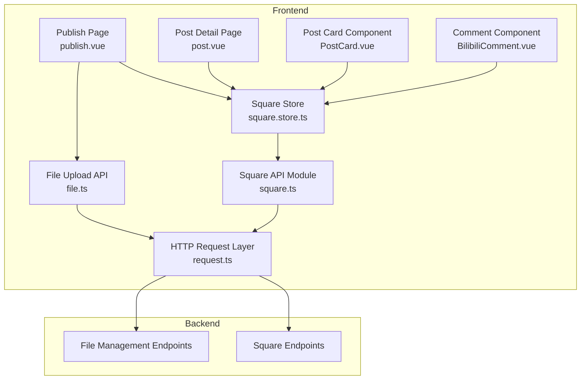
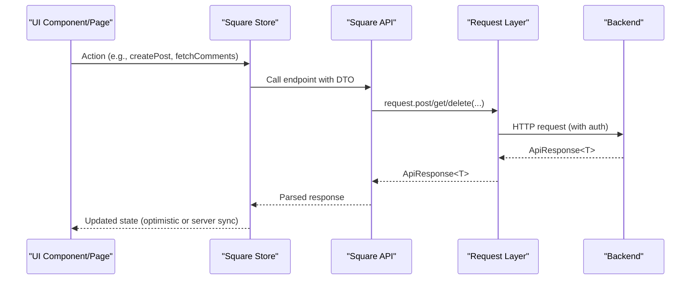
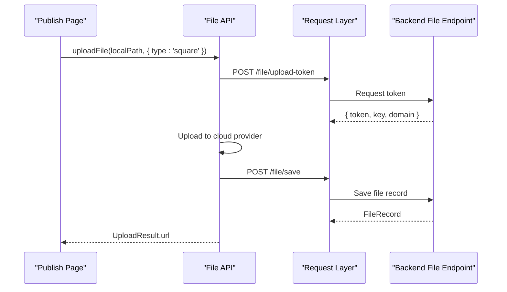
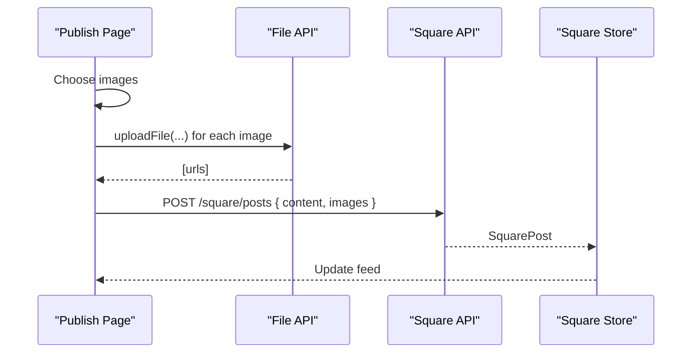
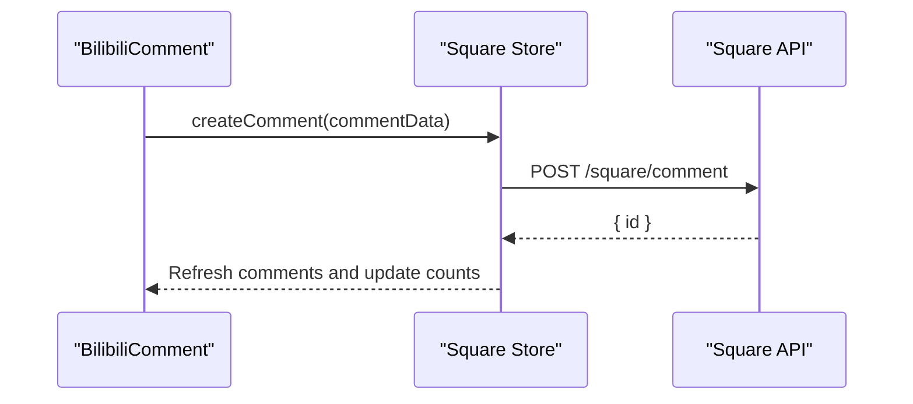
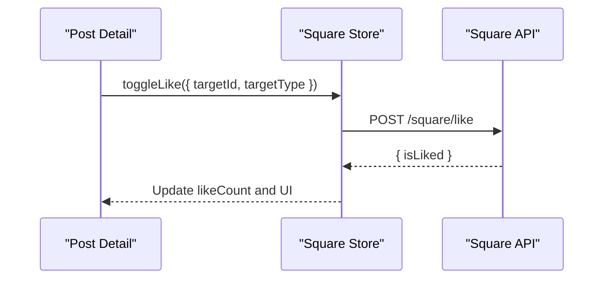
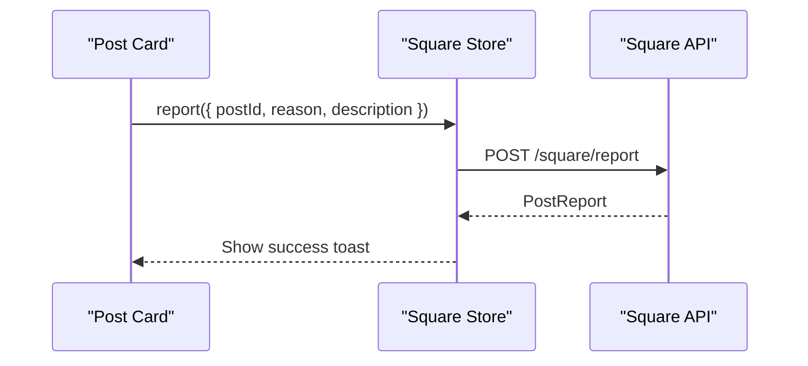
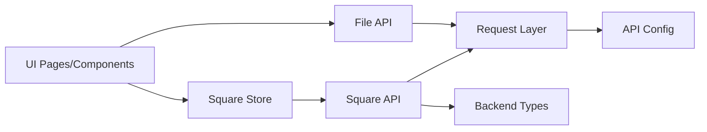

# Square API

<cite>
**Referenced Files in This Document**
- [square.ts](file://src/api/modules/square.ts)
- [square.store.ts](file://src/stores/square.ts)
- [backend-types.ts](file://src/types/api/backend-types.ts)
- [backend-api.ts](file://src/types/api/backend-api.ts)
- [request.ts](file://src/api/request.ts)
- [file.ts](file://src/api/modules/file.ts)
- [publish.vue](file://src/pages/square/publish.vue)
- [post.vue](file://src/pages/square/post.vue)
- [PostCard.vue](file://src/components/business/PostCard.vue)
- [BilibiliComment.vue](file://src/components/business/BilibiliComment.vue)
- [index.ts](file://src/config/index.ts)
</cite>

## Table of Contents
1. [Introduction](#introduction)
2. [Project Structure](#project-structure)
3. [Core Components](#core-components)
4. [Architecture Overview](#architecture-overview)
5. [Detailed Component Analysis](#detailed-component-analysis)
6. [Dependency Analysis](#dependency-analysis)
7. [Performance Considerations](#performance-considerations)
8. [Troubleshooting Guide](#troubleshooting-guide)
9. [Conclusion](#conclusion)

## Introduction
This document provides comprehensive API documentation for the Square module, which manages community content. It covers endpoints for post creation, content feed retrieval, comment management, like/dislike operations, and content moderation. It also documents pagination, sorting, media attachment handling, rich content formatting, and content discovery mechanisms. Examples demonstrate publishing posts, commenting, managing likes, and reporting inappropriate material, along with error handling for content size limits, inappropriate content detection, and spam prevention measures.

## Project Structure
The Square module is implemented as a frontend API client and store integration layered over a backend service. The primary components are:
- API client for Square endpoints
- Store for state management and optimistic updates
- Types for backend DTOs and API responses
- File upload utilities for media attachments
- UI components for publishing and viewing content

**Diagram sources**
- [square.ts:43-97](file://src/api/modules/square.ts#L43-L97)
- [square.store.ts:13-151](file://src/stores/square.ts#L13-L151)
- [file.ts:90-230](file://src/api/modules/file.ts#L90-L230)
- [request.ts:75-225](file://src/api/request.ts#L75-L225)
- [publish.vue:84-134](file://src/pages/square/publish.vue#L84-L134)
- [post.vue:61-175](file://src/pages/square/post.vue#L61-L175)
- [PostCard.vue:128-224](file://src/components/business/PostCard.vue#L128-L224)
- [BilibiliComment.vue:212-423](file://src/components/business/BilibiliComment.vue#L212-L423)

**Section sources**
- [square.ts:1-98](file://src/api/modules/square.ts#L1-L98)
- [square.store.ts:1-152](file://src/stores/square.ts#L1-L152)
- [backend-types.ts:427-535](file://src/types/api/backend-types.ts#L427-L535)
- [backend-api.ts:395-451](file://src/types/api/backend-api.ts#L395-L451)
- [request.ts:1-228](file://src/api/request.ts#L1-L228)
- [file.ts:1-335](file://src/api/modules/file.ts#L1-L335)
- [publish.vue:1-239](file://src/pages/square/publish.vue#L1-L239)
- [post.vue:1-318](file://src/pages/square/post.vue#L1-L318)
- [PostCard.vue:1-628](file://src/components/business/PostCard.vue#L1-L628)
- [BilibiliComment.vue:1-741](file://src/components/business/BilibiliComment.vue#L1-L741)
- [index.ts:1-11](file://src/config/index.ts#L1-L11)

## Core Components
- Square API module: Exposes typed methods for posts, comments, likes, and reports.
- Square Store: Manages local state, pagination, optimistic updates, and emits events for UI synchronization.
- Backend Types and API: Define DTOs, enums, and response wrappers used by the Square module.
- File Upload API: Handles media uploads via third-party providers and returns URLs for embedding.
- UI Pages and Components: Provide user flows for publishing, viewing, commenting, and interacting with content.

Key responsibilities:
- API module: Encapsulates HTTP requests and maps to backend DTOs.
- Store: Coordinates data fetching, pagination, and optimistic UI updates.
- Types: Standardize request/response shapes and enums for targets and reasons.
- File API: Provides upload tokens, uploads media, and saves records.

**Section sources**
- [square.ts:43-97](file://src/api/modules/square.ts#L43-L97)
- [square.store.ts:13-151](file://src/stores/square.ts#L13-L151)
- [backend-types.ts:427-535](file://src/types/api/backend-types.ts#L427-L535)
- [backend-api.ts:395-451](file://src/types/api/backend-api.ts#L395-L451)
- [file.ts:90-230](file://src/api/modules/file.ts#L90-L230)

## Architecture Overview
The Square module follows a layered architecture:
- UI pages and components trigger actions.
- Store orchestrates data fetching and updates.
- API module performs HTTP requests via a shared request layer.
- Backend exposes Square and File endpoints.

**Diagram sources**
- [square.store.ts:20-35](file://src/stores/square.ts#L20-L35)
- [square.ts:43-97](file://src/api/modules/square.ts#L43-L97)
- [request.ts:75-225](file://src/api/request.ts#L75-L225)

## Detailed Component Analysis

### Square API Endpoints

#### Posts
- Create Post
  - Method: POST
  - URL: /square/posts
  - Request DTO: CreatePostDto
  - Response: SquarePost
  - Validation rules:
    - content: required, max length enforced by UI (500 chars)
    - images: optional array of URLs
  - Example usage: [publish.vue:109-112](file://src/pages/square/publish.vue#L109-L112)

- Get Posts Feed
  - Method: GET
  - URL: /square/posts
  - Query params:
    - page: number (default 1)
    - pageSize: number (default 20)
    - sort: 'hot' | 'latest'
  - Response: ApiResponse<{ list: Post[], total: number }>
  - Pagination: Implemented by the store; merges lists for infinite scroll.
  - Sorting: Supported via sort parameter.

- Get Post Detail
  - Method: GET
  - URL: /square/posts/{id}
  - Response: SquarePost

- Delete Post
  - Method: DELETE
  - URL: /square/posts/{id}
  - Response: ApiResponse<{ success: boolean }>
  - Example usage: [post.vue:156-175](file://src/pages/square/post.vue#L156-L175)

#### Comments
- Create Comment
  - Method: POST
  - URL: /square/comment
  - Request DTO: CreateCommentDto
  - Response: ApiResponse<{ id: number }>
  - Validation rules:
    - content: required, max length 500
    - postId: required
    - replyToId/replyToUserId: optional for threaded replies
  - Example usage: [BilibiliComment.vue:245-282](file://src/components/business/BilibiliComment.vue#L245-L282)

- Get Comments for Post
  - Method: GET
  - URL: /square/posts/{postId}/comments
  - Query params:
    - page: number
    - pageSize: number
    - sort: 'time' | 'hot'
  - Response: ApiResponse<{ list: Comment[], total: number }>
  - Example usage: [square.store.ts:52-59](file://src/stores/square.ts#L52-L59)

- Get Replies to Comment
  - Method: GET
  - URL: /square/comments/{commentId}/replies
  - Query params:
    - page: number
    - pageSize: number
  - Response: ApiResponse<{ list: Comment[], total: number }>
  - Example usage: [BilibiliComment.vue:320-337](file://src/components/business/BilibiliComment.vue#L320-L337)

- Delete Comment
  - Method: DELETE
  - URL: /square/comments/{commentId}
  - Response: ApiResponse<{ success: boolean, message: string }>
  - Example usage: [BilibiliComment.vue:388-423](file://src/components/business/BilibiliComment.vue#L388-L423)

#### Likes
- Toggle Like
  - Method: POST
  - URL: /square/like
  - Request DTO: LikeDto
  - Response: ApiResponse<{ isLiked: boolean }>
  - Example usage: [square.store.ts:95-128](file://src/stores/square.ts#L95-L128)

- Like/Unlike Post
  - Methods: POST/DELETE
  - URLs: /square/posts/{postId}/like
  - Response: ApiResponse<{ isLiked: boolean }>
  - Example usage: [post.vue:72-99](file://src/pages/square/post.vue#L72-L99)

#### Reports
- Report Post
  - Method: POST
  - URL: /square/report
  - Request DTO: ReportDto
  - Response: ApiResponse<PostReport>
  - Validation rules:
    - reason: enum (see backend enums)
    - description: optional up to 100 chars
  - Example usage: [post.vue:134-154](file://src/pages/square/post.vue#L134-L154)

**Section sources**
- [square.ts:43-97](file://src/api/modules/square.ts#L43-L97)
- [backend-api.ts:395-451](file://src/types/api/backend-api.ts#L395-L451)
- [backend-types.ts:427-535](file://src/types/api/backend-types.ts#L427-L535)
- [square.store.ts:20-128](file://src/stores/square.ts#L20-L128)
- [BilibiliComment.vue:212-423](file://src/components/business/BilibiliComment.vue#L212-L423)
- [post.vue:72-154](file://src/pages/square/post.vue#L72-L154)

### Media Attachment Handling
- Upload flow:
  - Obtain upload token via /file/upload-token
  - Upload file to cloud provider
  - Save file record via /file/save
  - Receive URL for embedding in posts
- Supported types: images (jpg, png, gif, webp)
- Size limits: enforced by backend configuration (refer to FileConfig)
- UI integration:
  - Publish page collects images, uploads, and embeds URLs
  - Post card displays images in a grid

**Diagram sources**
- [file.ts:90-230](file://src/api/modules/file.ts#L90-L230)
- [request.ts:75-225](file://src/api/request.ts#L75-L225)

**Section sources**
- [file.ts:38-230](file://src/api/modules/file.ts#L38-L230)
- [publish.vue:95-113](file://src/pages/square/publish.vue#L95-L113)
- [PostCard.vue:25-45](file://src/components/business/PostCard.vue#L25-L45)

### Content Discovery and Moderation
- Discovery:
  - Feed retrieval supports sorting by 'hot' and 'latest'
  - Pagination via page/pageSize
- Moderation:
  - Report reasons and descriptions are validated
  - UI enforces character limits for reports
  - Deletion controls for posts and comments

**Section sources**
- [square.ts:47-48](file://src/api/modules/square.ts#L47-L48)
- [backend-types.ts:48-51](file://src/types/api/backend-types.ts#L48-L51)
- [post.vue:134-154](file://src/pages/square/post.vue#L134-L154)

### UI Workflows

#### Publishing a Post
- Collect content and optional images
- Upload images to cloud storage
- Submit CreatePostDto to /square/posts
- Refresh feed

**Diagram sources**
- [publish.vue:84-134](file://src/pages/square/publish.vue#L84-L134)
- [file.ts:90-230](file://src/api/modules/file.ts#L90-L230)
- [square.ts:44-45](file://src/api/modules/square.ts#L44-L45)
- [square.store.ts:42-45](file://src/stores/square.ts#L42-L45)

**Section sources**
- [publish.vue:84-134](file://src/pages/square/publish.vue#L84-L134)

#### Commenting on Content
- Compose comment with optional reply metadata
- Submit CreateCommentDto to /square/comment
- Refresh comment list and update counters

**Diagram sources**
- [BilibiliComment.vue:241-282](file://src/components/business/BilibiliComment.vue#L241-L282)
- [square.store.ts:61-74](file://src/stores/square.ts#L61-L74)
- [square.ts:56-57](file://src/api/modules/square.ts#L56-L57)

**Section sources**
- [BilibiliComment.vue:241-282](file://src/components/business/BilibiliComment.vue#L241-L282)
- [square.store.ts:61-74](file://src/stores/square.ts#L61-L74)

#### Managing Likes
- Toggle like via LikeDto
- Optimistically update UI; rollback on failure

**Diagram sources**
- [post.vue:72-99](file://src/pages/square/post.vue#L72-L99)
- [square.store.ts:95-128](file://src/stores/square.ts#L95-L128)
- [square.ts:86-87](file://src/api/modules/square.ts#L86-L87)

**Section sources**
- [post.vue:72-99](file://src/pages/square/post.vue#L72-L99)
- [square.store.ts:95-128](file://src/stores/square.ts#L95-L128)

#### Reporting Inappropriate Material
- Select reason and optionally describe
- Submit ReportDto to /square/report

**Diagram sources**
- [PostCard.vue:226-289](file://src/components/business/PostCard.vue#L226-L289)
- [post.vue:134-154](file://src/pages/square/post.vue#L134-L154)
- [square.ts:95-96](file://src/api/modules/square.ts#L95-L96)

**Section sources**
- [PostCard.vue:226-289](file://src/components/business/PostCard.vue#L226-L289)
- [post.vue:134-154](file://src/pages/square/post.vue#L134-L154)

## Dependency Analysis
- API module depends on:
  - Request layer for HTTP transport and auth
  - Backend types for DTOs and enums
- Store depends on:
  - API module for network calls
  - Event bus for cross-component updates
- UI components depend on:
  - Store for state and actions
  - File API for media uploads

**Diagram sources**
- [square.ts:1-11](file://src/api/modules/square.ts#L1-L11)
- [square.store.ts:1-11](file://src/stores/square.ts#L1-L11)
- [request.ts:1-24](file://src/api/request.ts#L1-L24)
- [index.ts:1-11](file://src/config/index.ts#L1-L11)
- [file.ts:1-3](file://src/api/modules/file.ts#L1-L3)

**Section sources**
- [square.ts:1-11](file://src/api/modules/square.ts#L1-L11)
- [square.store.ts:1-11](file://src/stores/square.ts#L1-L11)
- [request.ts:1-24](file://src/api/request.ts#L1-L24)
- [index.ts:1-11](file://src/config/index.ts#L1-L11)
- [file.ts:1-3](file://src/api/modules/file.ts#L1-L3)

## Performance Considerations
- Pagination: Use page/pageSize to limit payload sizes; the store merges lists for infinite scroll.
- Sorting: Prefer 'hot' or 'latest' to reduce heavy computations on the client.
- Media: Compress images before upload; leverage CDN URLs returned by the file API.
- Optimistic updates: Apply immediately and rollback on failure to improve perceived performance.

## Troubleshooting Guide
Common issues and resolutions:
- Authentication failures:
  - Symptom: Unauthorized errors or re-login prompts
  - Cause: Expired or missing tokens
  - Resolution: The request layer automatically refreshes tokens; ensure tokens are stored and valid

- Upload failures:
  - Symptom: Images not appearing after publish
  - Cause: Network issues or invalid file paths
  - Resolution: Verify platform support (H5 vs Mini Program), check file extensions, and retry upload

- Comment submission errors:
  - Symptom: Cannot send comment or empty content
  - Cause: Content length limits or network errors
  - Resolution: Ensure content length ≤ 500; verify network connectivity

- Like toggling errors:
  - Symptom: Like count does not update
  - Cause: Network failure or race conditions
  - Resolution: UI performs optimistic updates; on failure, revert UI and show a toast

**Section sources**
- [request.ts:100-174](file://src/api/request.ts#L100-L174)
- [publish.vue:95-133](file://src/pages/square/publish.vue#L95-L133)
- [BilibiliComment.vue:200-282](file://src/components/business/BilibiliComment.vue#L200-L282)
- [post.vue:72-99](file://src/pages/square/post.vue#L72-L99)

## Conclusion
The Square module provides a robust, layered API for community content management. It supports publishing, discovery, interaction, and moderation with clear DTOs, pagination, and optimistic UI updates. Integrations with the file upload service enable rich media posts. The documented endpoints, validation rules, and workflows facilitate reliable development and maintenance of community features.