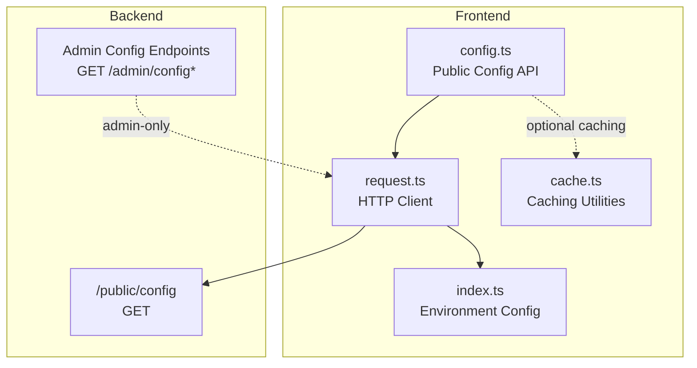
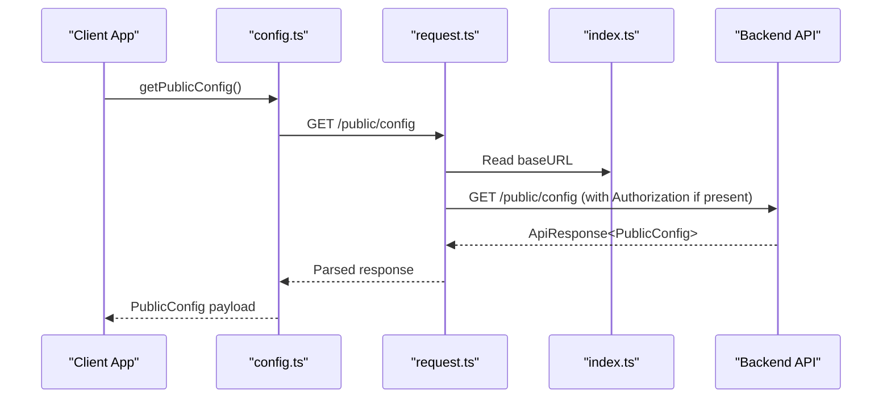
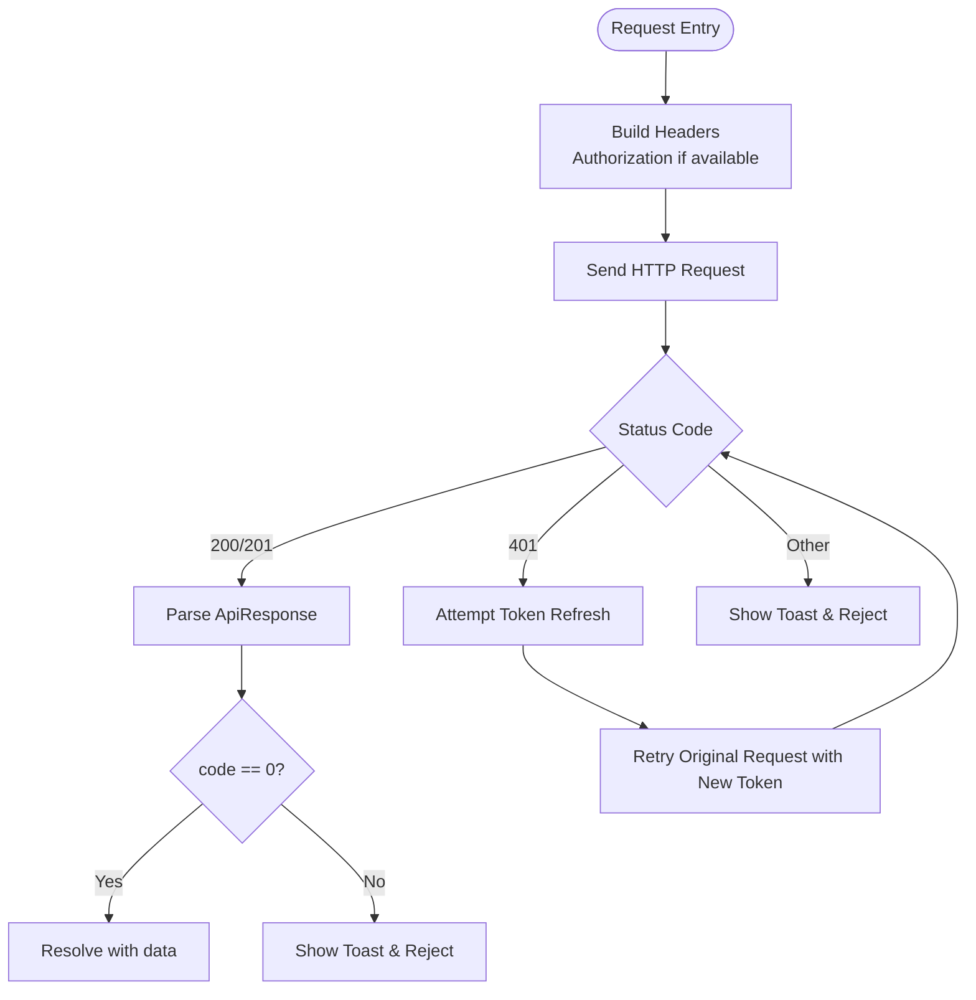
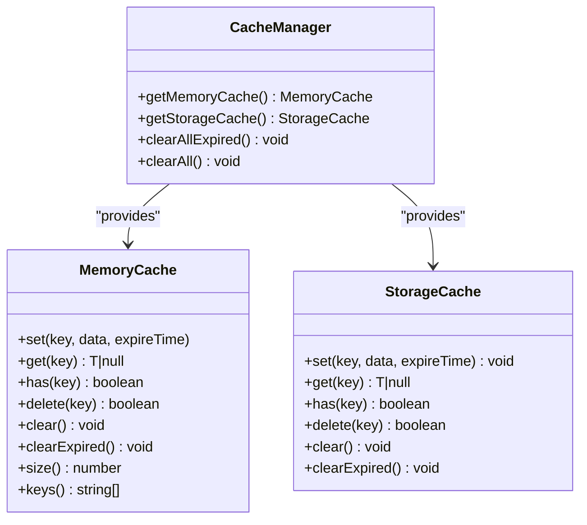
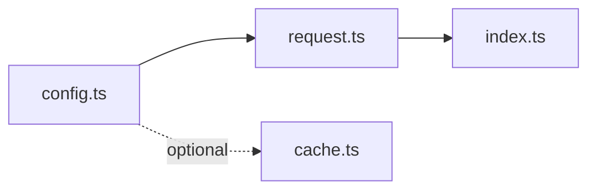

# System Configuration API

<cite>
**Referenced Files in This Document**
- [config.ts](file://src/api/modules/config.ts)
- [request.ts](file://src/api/request.ts)
- [index.ts](file://src/config/index.ts)
- [backend-types.ts](file://src/types/api/backend-types.ts)
- [cache.ts](file://src/utils/cache.ts)
- [vite.config.ts](file://vite.config.ts)
- [04-health-check.sh](file://linux-190-deploy/04-health-check.sh)
- [admin-web-consistency-review-2026-04-24.md](file://docs/refactry/admin-web-consistency-review-2026-04-24.md)
</cite>

## Table of Contents
1. [Introduction](#introduction)
2. [Project Structure](#project-structure)
3. [Core Components](#core-components)
4. [Architecture Overview](#architecture-overview)
5. [Detailed Component Analysis](#detailed-component-analysis)
6. [Dependency Analysis](#dependency-analysis)
7. [Performance Considerations](#performance-considerations)
8. [Troubleshooting Guide](#troubleshooting-guide)
9. [Conclusion](#conclusion)

## Introduction
This document describes the System Configuration API for platform-wide settings and dynamic configuration management. It covers:
- Endpoints for retrieving public system parameters, feature flags, and client configuration data
- Request/response schemas and HTTP semantics
- Caching strategies and fallback mechanisms
- Configuration categories such as feature toggles, rate limits, content policies, and platform settings
- Versioning, change notifications, and error handling patterns

The frontend module exposes a single public configuration endpoint used to initialize client-side feature flags and platform capabilities. Additional administrative configuration endpoints exist in the backend and are documented for completeness.

## Project Structure
The System Configuration API is primarily accessed via a dedicated module that encapsulates HTTP requests and integrates with the global request client. Environment configuration and caching utilities support runtime behavior.

**Diagram sources**
- [config.ts:29-32](file://src/api/modules/config.ts#L29-L32)
- [request.ts:10-13](file://src/api/request.ts#L10-L13)
- [index.ts:1-5](file://src/config/index.ts#L1-L5)
- [cache.ts:273-318](file://src/utils/cache.ts#L273-L318)

**Section sources**
- [config.ts:1-33](file://src/api/modules/config.ts#L1-L33)
- [request.ts:1-228](file://src/api/request.ts#L1-L228)
- [index.ts:1-11](file://src/config/index.ts#L1-L11)
- [cache.ts:1-358](file://src/utils/cache.ts#L1-L358)

## Core Components
- Public configuration module: Provides a typed interface for client-side configuration and a single endpoint to fetch platform-wide settings.
- HTTP client: Centralized request handling with token injection, retry logic, and unified response parsing.
- Environment configuration: Base URLs and timeouts configured via Vite environment variables.
- Caching utilities: Optional in-memory and persistent caches for performance and offline resilience.

Key responsibilities:
- Expose a minimal, stable contract for client initialization
- Provide robust error handling and user feedback
- Support optional caching for frequently accessed configuration

**Section sources**
- [config.ts:3-27](file://src/api/modules/config.ts#L3-L27)
- [config.ts:29-32](file://src/api/modules/config.ts#L29-L32)
- [request.ts:15-24](file://src/api/request.ts#L15-L24)
- [request.ts:87-100](file://src/api/request.ts#L87-L100)
- [index.ts:1-5](file://src/config/index.ts#L1-L5)
- [cache.ts:20-139](file://src/utils/cache.ts#L20-L139)

## Architecture Overview
The client retrieves public configuration from the backend and uses it to enable/disable features and adjust platform behavior. The request client handles authentication headers, token refresh, and error reporting.

**Diagram sources**
- [config.ts:29-32](file://src/api/modules/config.ts#L29-L32)
- [request.ts:75-108](file://src/api/request.ts#L75-L108)
- [index.ts:1-5](file://src/config/index.ts#L1-L5)

## Detailed Component Analysis

### Public Configuration Endpoint
- Purpose: Provide client-side configuration for platform features and capabilities
- Endpoint: GET /public/config
- Authentication: Optional (no Authorization header required)
- Request parameters: None
- Response schema: PublicConfig (see below)
- Caching: Not enforced by the client; recommended to cache locally with expiration

PublicConfig fields:
- app.name: Platform application name
- signup.invite_required: Boolean flag indicating if invitations are required for registration
- square.enabled: Boolean enabling/disabling the square feature
- square.max_images: Maximum number of images allowed per post in square
- chat.enabled: Boolean enabling/disabling the chat feature
- friend.max_count: Maximum number of friends allowed
- friend.unlock_points: Points required to unlock friend feature
- points.enabled: Boolean enabling/disabling the points feature
- certification.enabled: Boolean enabling/disabling the certification feature

Example usage:
- Retrieve client configuration during app startup
- Check feature availability before rendering UI
- Monitor platform health via the public endpoint

**Section sources**
- [config.ts:3-27](file://src/api/modules/config.ts#L3-L27)
- [config.ts:29-32](file://src/api/modules/config.ts#L29-L32)

### HTTP Client and Request Flow
- Base URL resolution: Uses environment variable VITE_APP_API_BASE_URL with fallback
- Headers: Automatically injects Authorization Bearer token if present
- Status handling: Returns parsed ApiResponse on 200/201; shows toast and rejects on errors
- Token refresh: On 401, attempts to refresh tokens and retries original request
- Timeout: Configured globally

**Diagram sources**
- [request.ts:75-108](file://src/api/request.ts#L75-L108)
- [request.ts:100-147](file://src/api/request.ts#L100-L147)
- [request.ts:176-181](file://src/api/request.ts#L176-L181)

**Section sources**
- [request.ts:15-24](file://src/api/request.ts#L15-L24)
- [request.ts:87-100](file://src/api/request.ts#L87-L100)
- [request.ts:100-147](file://src/api/request.ts#L100-L147)
- [request.ts:176-181](file://src/api/request.ts#L176-L181)

### Environment Configuration
- API base URL: Resolved from VITE_APP_API_BASE_URL with fallback
- WebSocket URL: Resolved from VITE_APP_WS_BASE_URL with fallback
- Application base URL: Resolved from VITE_APP_BASE_URL with fallback
- Timeout: 30 seconds

Proxy configuration supports development routing to backend services.

**Section sources**
- [index.ts:1-5](file://src/config/index.ts#L1-L5)
- [vite.config.ts:27-46](file://vite.config.ts#L27-L46)

### Caching Strategies
- Memory cache: In-memory cache with TTL and LRU-like eviction
- Storage cache: Persistent cache backed by uni storage with TTL
- Recommended usage: Cache PublicConfig with a moderate TTL (e.g., minutes) to reduce network calls and improve startup performance

**Diagram sources**
- [cache.ts:20-139](file://src/utils/cache.ts#L20-L139)
- [cache.ts:144-268](file://src/utils/cache.ts#L144-L268)
- [cache.ts:273-318](file://src/utils/cache.ts#L273-L318)

**Section sources**
- [cache.ts:20-139](file://src/utils/cache.ts#L20-L139)
- [cache.ts:144-268](file://src/utils/cache.ts#L144-L268)
- [cache.ts:273-318](file://src/utils/cache.ts#L273-L318)

### Administrative Configuration Endpoints (Backend)
These endpoints are used by administrators to manage system configuration and are referenced here for completeness. They are not consumed by the frontend module shown above.

- GET /admin/config: List system configurations
- GET /admin/config/groups: Get configuration groups
- GET /admin/config/{key}: Get configuration by key
- POST /admin/config: Create configuration
- PUT /admin/config/{key}: Update configuration
- DELETE /admin/config/{key}: Delete configuration
- POST /admin/config/init: Initialize configuration

Validation and DTOs for system configuration are defined in backend types.

**Section sources**
- [admin-web-consistency-review-2026-04-24.md:84-96](file://docs/refactry/admin-web-consistency-review-2026-04-24.md#L84-L96)
- [backend-types.ts:656-677](file://src/types/api/backend-types.ts#L656-L677)
- [backend-types.ts:682-697](file://src/types/api/backend-types.ts#L682-L697)
- [backend-types.ts:702-715](file://src/types/api/backend-types.ts#L702-L715)

## Dependency Analysis
- config.ts depends on request.ts for HTTP transport
- request.ts depends on index.ts for environment configuration
- cache.ts is independent and can be used by any module for caching

**Diagram sources**
- [config.ts:1](file://src/api/modules/config.ts#L1)
- [request.ts:1](file://src/api/request.ts#L1)
- [index.ts:1](file://src/config/index.ts#L1)
- [cache.ts:1](file://src/utils/cache.ts#L1)

**Section sources**
- [config.ts:1](file://src/api/modules/config.ts#L1)
- [request.ts:1](file://src/api/request.ts#L1)
- [index.ts:1](file://src/config/index.ts#L1)
- [cache.ts:1](file://src/utils/cache.ts#L1)

## Performance Considerations
- Cache PublicConfig with a short-to-moderate TTL to minimize network overhead
- Use StorageCache for persistence across sessions
- Avoid frequent polling; rely on cache and manual refresh triggers
- Leverage environment proxy settings for efficient development routing

[No sources needed since this section provides general guidance]

## Troubleshooting Guide
Common scenarios and handling:
- Network failure: The client shows a toast and rejects the promise; retry logic is not built-in for generic failures
- Unauthorized (401): The client attempts token refresh; on failure, clears stored tokens and navigates to login
- Non-zero response code: Shows toast with message and rejects
- Health checks: Use the deployment health script to verify backend availability

Health check references:
- Backend API accessibility test against /api/v1/public/config

**Section sources**
- [request.ts:176-181](file://src/api/request.ts#L176-L181)
- [request.ts:100-147](file://src/api/request.ts#L100-L147)
- [04-health-check.sh:63-67](file://linux-190-deploy/04-health-check.sh#L63-L67)

## Conclusion
The System Configuration API provides a focused, stable contract for client-side configuration retrieval. Combined with the centralized HTTP client and caching utilities, it enables resilient and performant configuration-driven behavior. Administrators can manage system settings via backend endpoints, while the frontend consumes a single public endpoint to bootstrap client features.

[No sources needed since this section summarizes without analyzing specific files]