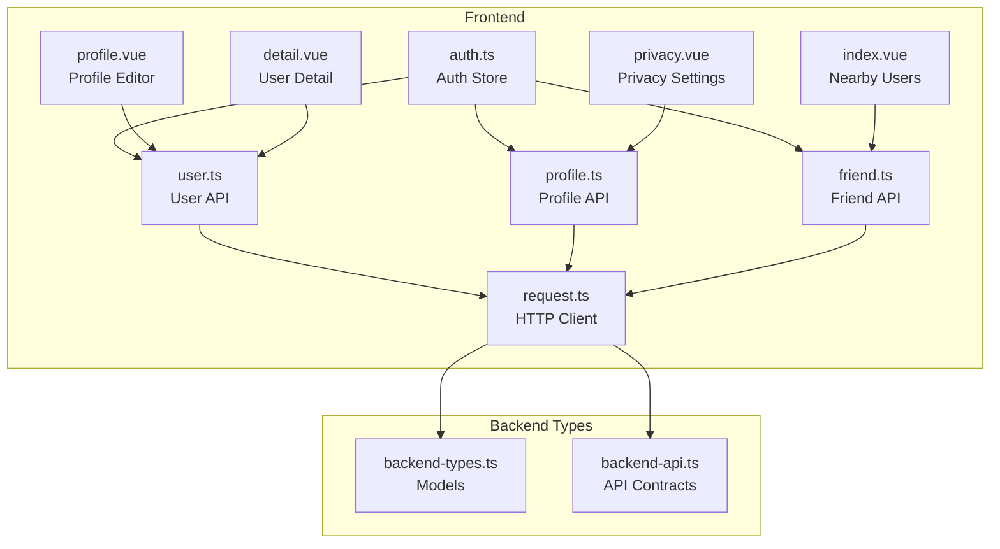
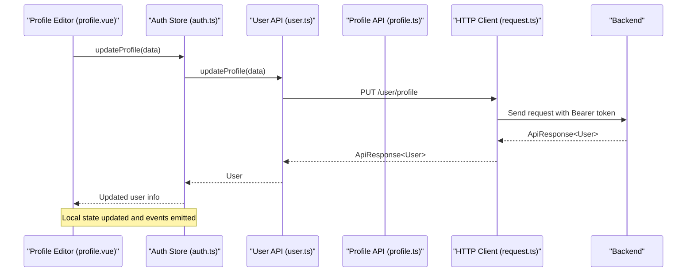
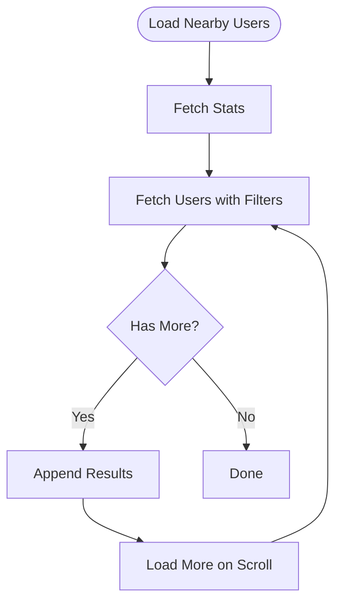
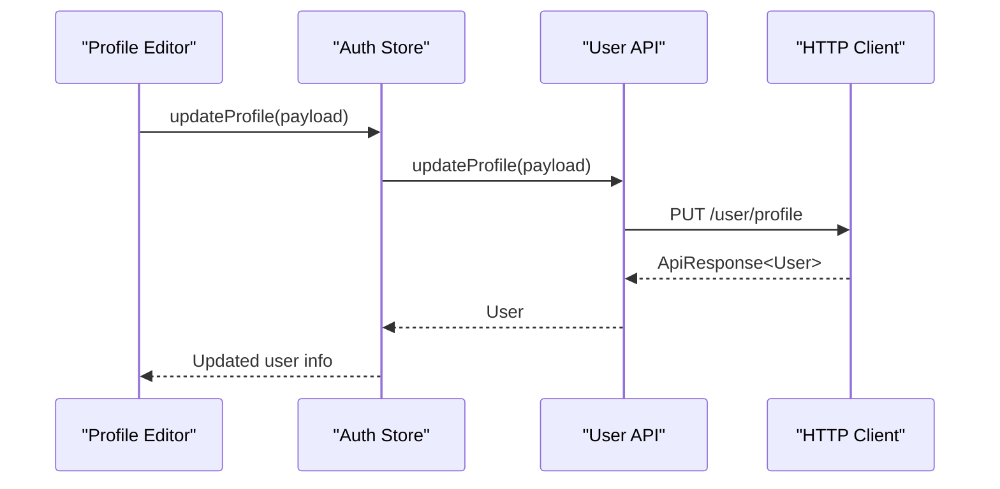
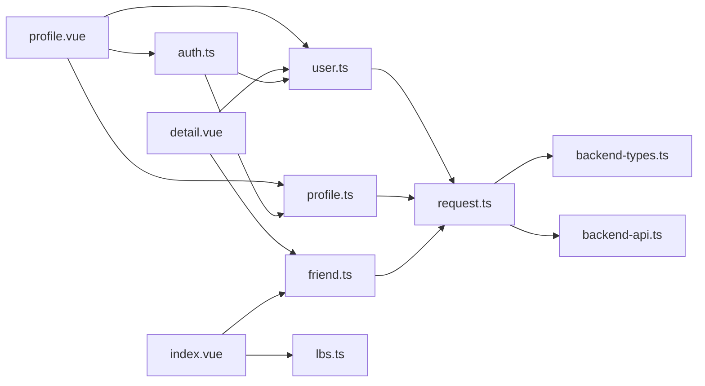

# User API

<cite>
**Referenced Files in This Document**
- [user.ts](file://src/api/modules/user.ts)
- [backend-types.ts](file://src/types/api/backend-types.ts)
- [backend-api.ts](file://src/types/api/backend-api.ts)
- [request.ts](file://src/api/request.ts)
- [profile.ts](file://src/api/profile.ts)
- [privacy.vue](file://src/pages/profile/privacy.vue)
- [profile.vue](file://src/pages/user/profile.vue)
- [detail.vue](file://src/pages/user/detail.vue)
- [auth.ts](file://src/stores/auth.ts)
- [friend.ts](file://src/api/modules/friend.ts)
- [lbs.ts](file://src/pages/tabbar/home/algorithms/lbs.ts)
- [index.vue](file://src/pages/nearby/index.vue)
</cite>

## Table of Contents
1. [Introduction](#introduction)
2. [Project Structure](#project-structure)
3. [Core Components](#core-components)
4. [Architecture Overview](#architecture-overview)
5. [Detailed Component Analysis](#detailed-component-analysis)
6. [Dependency Analysis](#dependency-analysis)
7. [Performance Considerations](#performance-considerations)
8. [Troubleshooting Guide](#troubleshooting-guide)
9. [Conclusion](#conclusion)

## Introduction
This document provides comprehensive API documentation for the User module, focusing on user profile management and personal data operations. It covers endpoints for profile retrieval and editing, preference management, privacy settings, and user search functionality. For each endpoint, we specify HTTP methods, URL patterns, request/response schemas, and validation requirements. We also document profile field validation, image upload handling, preference serialization, and user search with filtering, sorting, and pagination. Examples demonstrate updating profile information, managing privacy controls, searching users by criteria, and retrieving user statistics. Error handling for data conflicts, validation failures, and permission restrictions is included.

## Project Structure
The User module spans several frontend modules:
- API modules: user, profile, friend, auth
- Type definitions: backend-types, backend-api
- Store: auth store for token and user state
- Pages: user profile editor, user detail view, privacy settings, nearby users

**Diagram sources**
- [auth.ts:1-137](file://src/stores/auth.ts#L1-L137)
- [user.ts:1-101](file://src/api/modules/user.ts#L1-L101)
- [profile.ts:1-311](file://src/api/profile.ts#L1-L311)
- [friend.ts:1-61](file://src/api/modules/friend.ts#L1-L61)
- [request.ts:1-228](file://src/api/request.ts#L1-L228)
- [profile.vue:1-717](file://src/pages/user/profile.vue#L1-L717)
- [privacy.vue:1-186](file://src/pages/profile/privacy.vue#L1-L186)
- [detail.vue:1-569](file://src/pages/user/detail.vue#L1-L569)
- [index.vue:1-488](file://src/pages/nearby/index.vue#L1-L488)
- [backend-types.ts:1-764](file://src/types/api/backend-types.ts#L1-L764)
- [backend-api.ts:1-641](file://src/types/api/backend-api.ts#L1-L641)

**Section sources**
- [user.ts:1-101](file://src/api/modules/user.ts#L1-L101)
- [profile.ts:1-311](file://src/api/profile.ts#L1-L311)
- [backend-types.ts:1-764](file://src/types/api/backend-types.ts#L1-L764)
- [backend-api.ts:1-641](file://src/types/api/backend-api.ts#L1-L641)
- [request.ts:1-228](file://src/api/request.ts#L1-L228)
- [auth.ts:1-137](file://src/stores/auth.ts#L1-L137)
- [profile.vue:1-717](file://src/pages/user/profile.vue#L1-L717)
- [privacy.vue:1-186](file://src/pages/profile/privacy.vue#L1-L186)
- [detail.vue:1-569](file://src/pages/user/detail.vue#L1-L569)
- [index.vue:1-488](file://src/pages/nearby/index.vue#L1-L488)

## Core Components
- User API module: Provides endpoints for current user info, profile updates, avatar upload, mobile change, user reporting, and viewing profiles.
- Profile API module: Manages user profile data, preferences, privacy settings, photos, interests, values, and certifications.
- Auth store: Centralizes authentication state and exposes updateProfile for profile changes.
- HTTP client: Handles token injection, retries, and error toast feedback.
- Frontend pages: Provide user-facing flows for editing profile, managing privacy, viewing user details, and discovering nearby users.

**Section sources**
- [user.ts:23-101](file://src/api/modules/user.ts#L23-L101)
- [profile.ts:137-311](file://src/api/profile.ts#L137-L311)
- [auth.ts:95-117](file://src/stores/auth.ts#L95-L117)
- [request.ts:15-228](file://src/api/request.ts#L15-L228)

## Architecture Overview
The User module follows a layered architecture:
- Presentation layer: Vue pages render UI and orchestrate user actions.
- Service layer: API modules encapsulate HTTP requests and DTOs.
- Domain layer: Type definitions model backend entities and API contracts.
- Infrastructure layer: HTTP client manages authentication and network concerns.

**Diagram sources**
- [profile.vue:299-348](file://src/pages/user/profile.vue#L299-L348)
- [auth.ts:95-117](file://src/stores/auth.ts#L95-L117)
- [user.ts:45-46](file://src/api/modules/user.ts#L45-L46)
- [request.ts:75-228](file://src/api/request.ts#L75-L228)

## Detailed Component Analysis

### User Profile Management Endpoints

#### Get Current User
- Method: GET
- URL: /user/me
- Request: none
- Response: ApiResponse<User>
- Validation: Requires valid Authorization token

**Section sources**
- [user.ts:28-29](file://src/api/modules/user.ts#L28-L29)
- [backend-api.ts:42-47](file://src/types/api/backend-api.ts#L42-L47)
- [backend-types.ts:94-131](file://src/types/api/backend-types.ts#L94-L131)

#### Update User Info
- Method: PUT
- URL: /user/me
- Request: UpdateUserDto
- Response: ApiResponse<User>
- Validation: Fields include nickname, avatarUrl, avatarPath, gender, bio, city, birthDate

**Section sources**
- [user.ts:36-37](file://src/api/modules/user.ts#L36-L37)
- [backend-api.ts:50-53](file://src/types/api/backend-api.ts#L50-L53)
- [backend-types.ts:136-151](file://src/types/api/backend-types.ts#L136-L151)

#### Update Profile
- Method: PUT
- URL: /user/profile
- Request: UpdateProfileDto
- Response: ApiResponse<User>
- Validation: Supports realName, birthDate, hometown, residence, height, weight, occupation, income, education, bio, showLocation, latitude, longitude

**Section sources**
- [user.ts:45-46](file://src/api/modules/user.ts#L45-L46)
- [backend-api.ts:55-59](file://src/types/api/backend-api.ts#L55-L59)
- [backend-types.ts:198-225](file://src/types/api/backend-types.ts#L198-L225)

#### Get User Points
- Method: GET
- URL: /user/points
- Request: none
- Response: ApiResponse<{ points: number }>
- Validation: Requires valid Authorization token

**Section sources**
- [user.ts:52-53](file://src/api/modules/user.ts#L52-L53)
- [backend-api.ts:61-65](file://src/types/api/backend-api.ts#L61-L65)

#### View User Profile
- Method: GET
- URL: /user/{id}
- Path param: id (number)
- Response: ApiResponse<object>
- Validation: Publicly accessible; permissions depend on privacy settings

**Section sources**
- [user.ts:60-61](file://src/api/modules/user.ts#L60-L61)
- [backend-api.ts:67-73](file://src/types/api/backend-api.ts#L67-L73)

#### Upload Avatar
- Method: POST
- URL: /user/avatar
- Request: multipart/form-data with field "avatar": File
- Response: ApiResponse<{ url: string }>
- Validation: File upload via FormData; backend handles storage and returns URL

**Section sources**
- [user.ts:68-72](file://src/api/modules/user.ts#L68-L72)
- [backend-api.ts:76-81](file://src/types/api/backend-api.ts#L76-L81)

#### Change Mobile
- Method: PUT
- URL: /user/mobile
- Request: { newMobile: string; code: string }
- Response: ApiResponse<{ message: string; mobile: string }>
- Validation: Requires SMS verification code

**Section sources**
- [user.ts:80-81](file://src/api/modules/user.ts#L80-L81)
- [backend-api.ts:75-75](file://src/types/api/backend-api.ts#L75-L75)

#### Report User
- Method: POST
- URL: /user/report
- Request: { userId: number; reason: number; description: string }
- Response: ApiResponse<{ message: string }>
- Validation: Reason enum values defined in backend types

**Section sources**
- [user.ts:88-89](file://src/api/modules/user.ts#L88-L89)
- [backend-types.ts:48-51](file://src/types/api/backend-types.ts#L48-L51)

#### Block User
- Method: POST
- URL: /friend/block
- Request: { friendId: number; reason?: string }
- Response: ApiResponse<UserBlacklist>
- Validation: Requires valid Authorization token

**Section sources**
- [user.ts:98-99](file://src/api/modules/user.ts#L98-L99)
- [friend.ts:53-54](file://src/api/modules/friend.ts#L53-L54)

### Profile Management Endpoints

#### Get Profile
- Method: GET
- URL: /profile/{userId}
- Path param: userId (number)
- Response: ApiResponse<UserProfile>
- Validation: Requires valid Authorization token

**Section sources**
- [profile.ts:140-142](file://src/api/profile.ts#L140-L142)
- [backend-api.ts:378-383](file://src/types/api/backend-api.ts#L378-L383)

#### Update Profile
- Method: PUT
- URL: /profile
- Request: Partial<UserProfile>
- Response: ApiResponse<UserProfile>
- Validation: Supports partial updates across all profile fields

**Section sources**
- [profile.ts:144-146](file://src/api/profile.ts#L144-L146)
- [backend-api.ts:386-389](file://src/types/api/backend-api.ts#L386-L389)

#### Get Completeness Details
- Method: GET
- URL: /profile/completeness/details
- Response: ApiResponse<CompletenessDetails>
- Validation: Requires valid Authorization token

**Section sources**
- [profile.ts:148-150](file://src/api/profile.ts#L148-L150)

#### Interests Management
- List: GET /profile/interests/list
- Add: POST /profile/interests
- Remove: DELETE /profile/interests/{id}
- Update Sort: PUT /profile/interests/sort
- Validation: Requires valid Authorization token

**Section sources**
- [profile.ts:153-167](file://src/api/profile.ts#L153-L167)

#### Photos Management
- List: GET /profile/photos/list
- Add: POST /profile/photos
- Delete: DELETE /profile/photos/{id}
- Set Avatar: PUT /profile/photos/{id}/avatar
- Update Sort: PUT /profile/photos/sort
- Validation: Requires valid Authorization token

**Section sources**
- [profile.ts:170-193](file://src/api/profile.ts#L170-L193)

#### Mate Preferences
- Get: GET /profile/mate-preferences
- Update: PUT /profile/mate-preferences
- Validation: Requires valid Authorization token

**Section sources**
- [profile.ts:196-202](file://src/api/profile.ts#L196-L202)

#### Privacy Settings
- Get: GET /profile/privacy
- Update: PUT /profile/privacy
- Validation: Requires valid Authorization token

**Section sources**
- [profile.ts:241-247](file://src/api/profile.ts#L241-L247)
- [privacy.vue:121-136](file://src/pages/profile/privacy.vue#L121-L136)

#### Values Management
- List: GET /profile/values/list
- Save: POST /profile/values
- Delete: DELETE /profile/values/{id}
- Validation: Requires valid Authorization token

**Section sources**
- [profile.ts:262-277](file://src/api/profile.ts#L262-L277)

#### Certifications
- List Types: GET /certification-types
- Submit: POST /certification
- List My: GET /certification/list
- Detail: GET /certification/{id}
- Validation: Requires valid Authorization token

**Section sources**
- [profile.ts:296-310](file://src/api/profile.ts#L296-L310)

### Privacy Settings Schema
- Visibility levels: public, friends, certified, private
- Fields:
  - basicInfoVisibility
  - contactVisibility
  - incomeVisibility
  - familyVisibility
  - photoVisibility
  - locationVisibility
  - allowSearch
  - allowRecommend
  - allowStrangerMessage
  - onlyCertifiedUser

**Section sources**
- [profile.ts:207-224](file://src/api/profile.ts#L207-L224)
- [privacy.vue:150-173](file://src/pages/profile/privacy.vue#L150-L173)

### User Search and Discovery

#### Nearby Users
- Endpoint: GET /nearby/users (via nearby API)
- Query params: distance, gender, page, pageSize
- Response: ApiResponse<PaginationResponse<NearbyUser>>
- Filtering: Distance threshold, gender filter
- Sorting: Not supported by backend
- Pagination: Supported

**Diagram sources**
- [index.vue:140-320](file://src/pages/nearby/index.vue#L140-L320)
- [lbs.ts:101-158](file://src/pages/tabbar/home/algorithms/lbs.ts#L101-L158)

**Section sources**
- [index.vue:140-320](file://src/pages/nearby/index.vue#L140-L320)
- [lbs.ts:101-158](file://src/pages/tabbar/home/algorithms/lbs.ts#L101-L158)

### Image Upload Handling
- Custom avatar upload uses FormData with field "avatar".
- After upload, the returned URL is stored in user profile.
- Preview support during selection.

**Section sources**
- [user.ts:68-72](file://src/api/modules/user.ts#L68-L72)
- [profile.vue:283-294](file://src/pages/user/profile.vue#L283-L294)

### Preference Serialization
- Preferences are serialized as structured JSON objects.
- Examples include mate preferences and values.

**Section sources**
- [profile.ts:97-118](file://src/api/profile.ts#L97-L118)
- [profile.ts:120-129](file://src/api/profile.ts#L120-L129)

### Example Workflows

#### Update Profile Information
- Steps:
  - Build update payload (nickname, gender, avatarId/avatarUrl)
  - Call auth store updateProfile
  - Update local state and emit avatar update event

**Diagram sources**
- [profile.vue:299-348](file://src/pages/user/profile.vue#L299-L348)
- [auth.ts:95-117](file://src/stores/auth.ts#L95-L117)
- [user.ts:45-46](file://src/api/modules/user.ts#L45-L46)
- [request.ts:75-228](file://src/api/request.ts#L75-L228)

**Section sources**
- [profile.vue:299-348](file://src/pages/user/profile.vue#L299-L348)
- [auth.ts:95-117](file://src/stores/auth.ts#L95-L117)

#### Manage Privacy Controls
- Steps:
  - Load privacy settings
  - Update visibility levels and permissions
  - Persist changes via PUT /profile/privacy

**Section sources**
- [privacy.vue:121-136](file://src/pages/profile/privacy.vue#L121-L136)
- [profile.ts:241-247](file://src/api/profile.ts#L241-L247)

#### Search Users by Criteria
- Steps:
  - Apply distance and gender filters
  - Paginate results
  - Display user cards with avatar and online status

**Section sources**
- [index.vue:140-320](file://src/pages/nearby/index.vue#L140-L320)
- [lbs.ts:101-158](file://src/pages/tabbar/home/algorithms/lbs.ts#L101-L158)

#### Retrieve User Statistics
- Steps:
  - Load stats (visited visitors)
  - Load user list with pagination
  - Display counts and user cards

**Section sources**
- [index.vue:155-320](file://src/pages/nearby/index.vue#L155-L320)

## Dependency Analysis

**Diagram sources**
- [profile.vue:134-348](file://src/pages/user/profile.vue#L134-L348)
- [detail.vue:93-195](file://src/pages/user/detail.vue#L93-L195)
- [index.vue:140-320](file://src/pages/nearby/index.vue#L140-L320)
- [auth.ts:95-117](file://src/stores/auth.ts#L95-L117)
- [user.ts:23-101](file://src/api/modules/user.ts#L23-L101)
- [profile.ts:137-311](file://src/api/profile.ts#L137-L311)
- [friend.ts:16-61](file://src/api/modules/friend.ts#L16-L61)
- [lbs.ts:101-158](file://src/pages/tabbar/home/algorithms/lbs.ts#L101-L158)
- [request.ts:15-228](file://src/api/request.ts#L15-L228)
- [backend-types.ts:1-764](file://src/types/api/backend-types.ts#L1-L764)
- [backend-api.ts:1-641](file://src/types/api/backend-api.ts#L1-L641)

**Section sources**
- [profile.vue:134-348](file://src/pages/user/profile.vue#L134-L348)
- [detail.vue:93-195](file://src/pages/user/detail.vue#L93-L195)
- [index.vue:140-320](file://src/pages/nearby/index.vue#L140-L320)
- [auth.ts:95-117](file://src/stores/auth.ts#L95-L117)
- [user.ts:23-101](file://src/api/modules/user.ts#L23-L101)
- [profile.ts:137-311](file://src/api/profile.ts#L137-L311)
- [friend.ts:16-61](file://src/api/modules/friend.ts#L16-L61)
- [lbs.ts:101-158](file://src/pages/tabbar/home/algorithms/lbs.ts#L101-L158)
- [request.ts:15-228](file://src/api/request.ts#L15-L228)
- [backend-types.ts:1-764](file://src/types/api/backend-types.ts#L1-L764)
- [backend-api.ts:1-641](file://src/types/api/backend-api.ts#L1-L641)

## Performance Considerations
- Token refresh: The HTTP client automatically refreshes tokens on 401 responses and retries the original request.
- Pagination: Use page/pageSize for efficient loading of lists (e.g., nearby users).
- Optimistic updates: Frontend pages update UI immediately and roll back on errors to improve perceived performance.
- Image handling: Prefer compressed images and preview before upload to reduce bandwidth.

[No sources needed since this section provides general guidance]

## Troubleshooting Guide
- Authentication failures:
  - Symptom: Requests return 401 Unauthorized.
  - Resolution: The HTTP client attempts token refresh; if unsuccessful, clears stored tokens and redirects to login.
- Network errors:
  - Symptom: Network failure toast appears.
  - Resolution: Verify connectivity and retry; check backend availability.
- Validation errors:
  - Symptom: Backend returns non-zero code with message.
  - Resolution: Inspect request payload against DTO definitions and ensure required fields are present.
- Permission restrictions:
  - Symptom: Access denied to profile or privacy endpoints.
  - Resolution: Ensure proper Authorization token and that user has appropriate permissions.

**Section sources**
- [request.ts:100-147](file://src/api/request.ts#L100-L147)
- [request.ts:175-181](file://src/api/request.ts#L175-L181)

## Conclusion
The User module provides a comprehensive set of APIs for profile management, personal data operations, privacy controls, and user discovery. The frontend integrates these APIs through dedicated modules and pages, ensuring a smooth user experience with optimistic updates and robust error handling. Adhering to the documented schemas and validation rules ensures reliable operation across all endpoints.