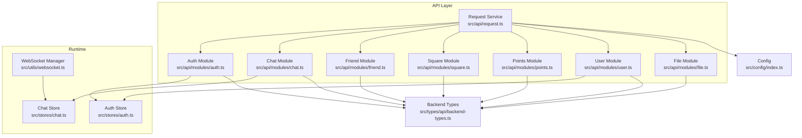
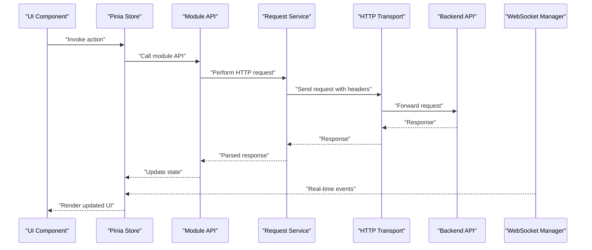
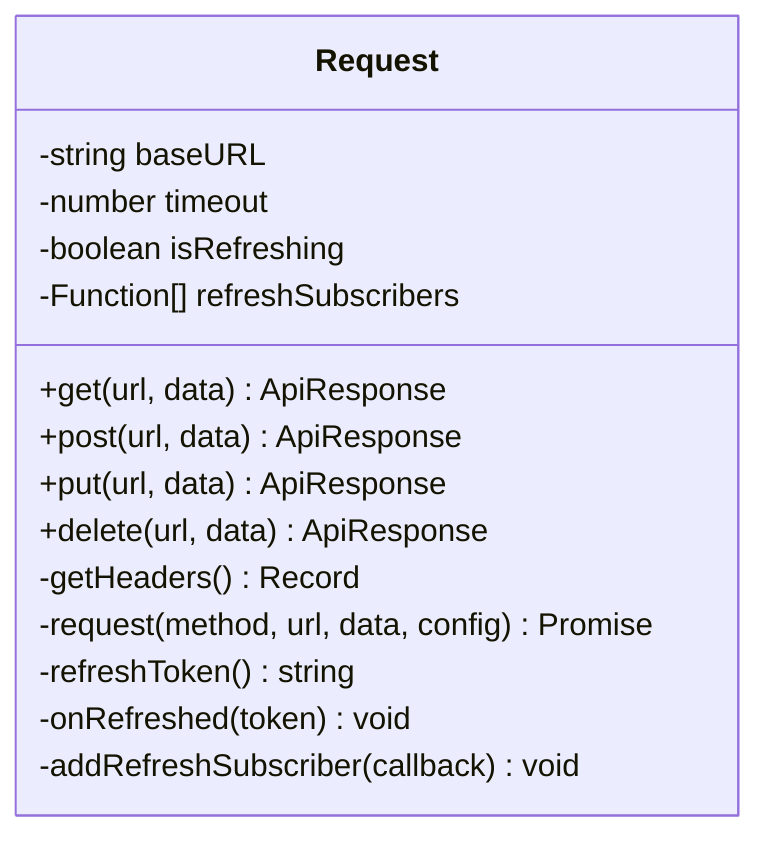
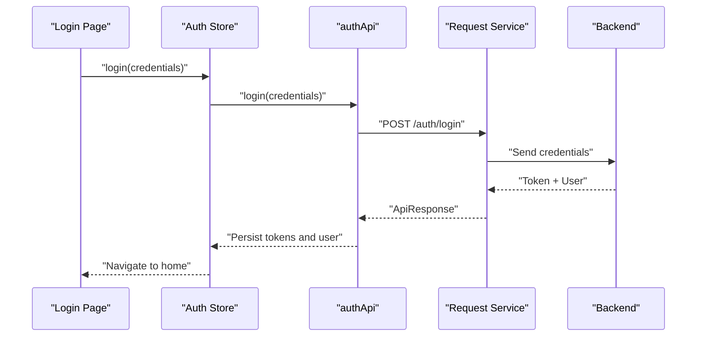
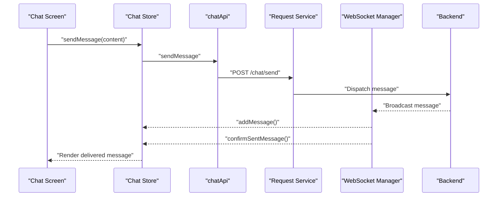
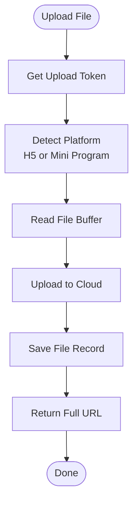
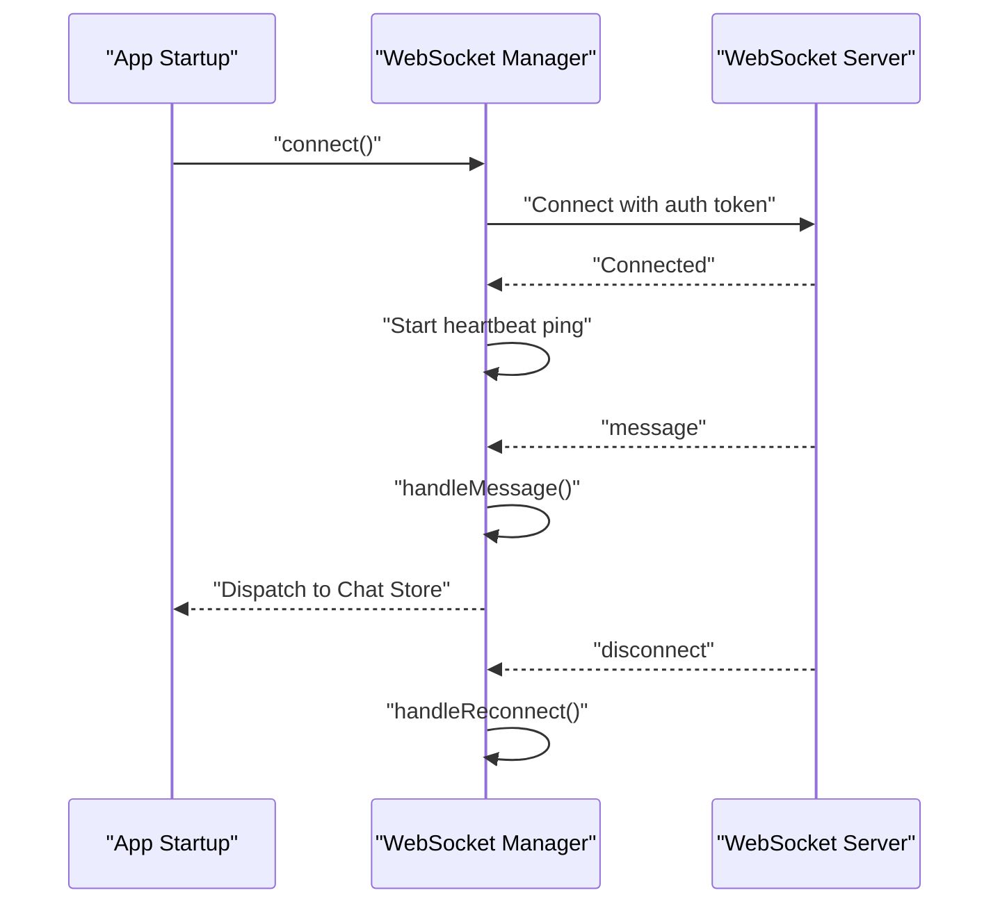
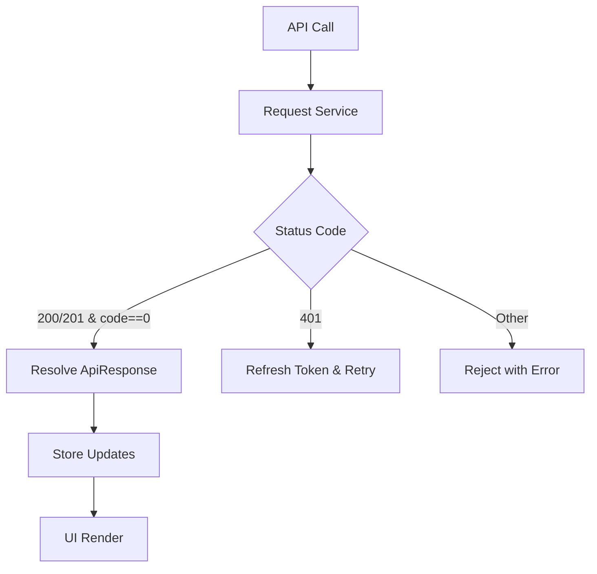
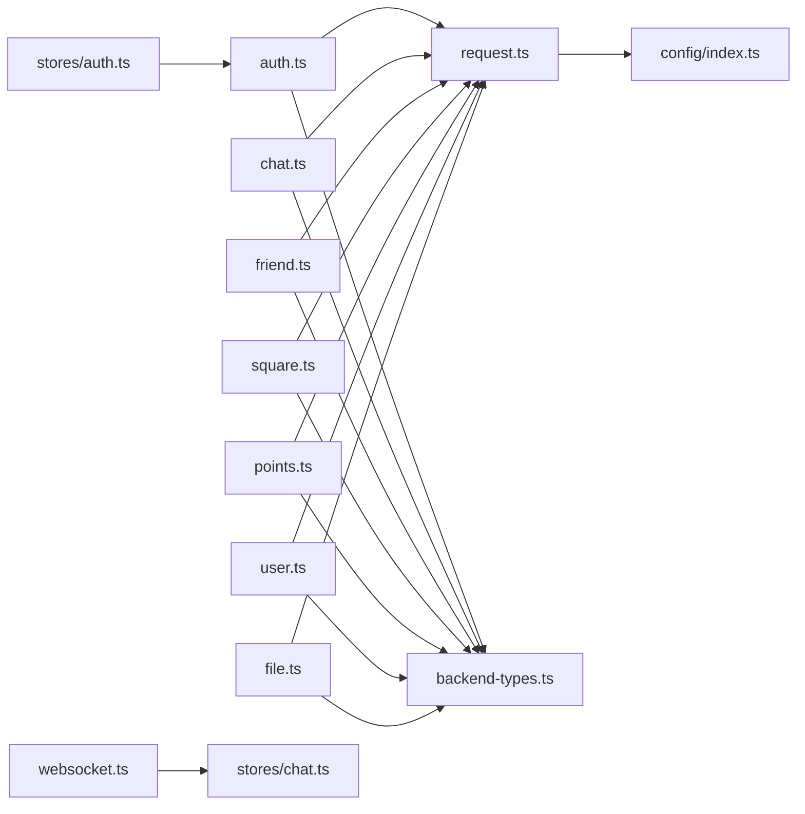

# API Integration Layer

<cite>
**Referenced Files in This Document**
- [src/api/request.ts](file://src/api/request.ts)
- [src/api/index.ts](file://src/api/index.ts)
- [src/api/modules/auth.ts](file://src/api/modules/auth.ts)
- [src/api/modules/chat.ts](file://src/api/modules/chat.ts)
- [src/api/modules/friend.ts](file://src/api/modules/friend.ts)
- [src/api/modules/square.ts](file://src/api/modules/square.ts)
- [src/api/modules/points.ts](file://src/api/modules/points.ts)
- [src/api/modules/user.ts](file://src/api/modules/user.ts)
- [src/api/modules/file.ts](file://src/api/modules/file.ts)
- [src/utils/websocket.ts](file://src/utils/websocket.ts)
- [src/config/index.ts](file://src/config/index.ts)
- [src/types/api/backend-types.ts](file://src/types/api/backend-types.ts)
- [src/stores/auth.ts](file://src/stores/auth.ts)
- [src/stores/chat.ts](file://src/stores/chat.ts)
- [src/utils/cache.ts](file://src/utils/cache.ts)
</cite>

## Table of Contents
1. [Introduction](#introduction)
2. [Project Structure](#project-structure)
3. [Core Components](#core-components)
4. [Architecture Overview](#architecture-overview)
5. [Detailed Component Analysis](#detailed-component-analysis)
6. [Dependency Analysis](#dependency-analysis)
7. [Performance Considerations](#performance-considerations)
8. [Troubleshooting Guide](#troubleshooting-guide)
9. [Conclusion](#conclusion)
10. [Appendices](#appendices)

## Introduction
This document describes the API integration layer of the WeTogether platform. It explains the modular API architecture covering authentication, chat, friends, square content, user profiles, points system, and file uploads. It also documents the request service abstraction, HTTP interceptors, error handling, token lifecycle, WebSocket integration for real-time features, response transformation, caching strategies, offline handling, API versioning, rate limiting, and security considerations.

## Project Structure
The API integration layer is organized around a central request service and module-specific APIs grouped under src/api/modules. Configuration is centralized in src/config, shared types in src/types/api/backend-types, and runtime state in Pinia stores. Real-time features are integrated via a WebSocket manager.

**Diagram sources**
- [src/api/request.ts:1-228](file://src/api/request.ts#L1-L228)
- [src/api/modules/auth.ts:1-57](file://src/api/modules/auth.ts#L1-L57)
- [src/api/modules/chat.ts:1-42](file://src/api/modules/chat.ts#L1-L42)
- [src/api/modules/friend.ts:1-61](file://src/api/modules/friend.ts#L1-L61)
- [src/api/modules/square.ts:1-98](file://src/api/modules/square.ts#L1-L98)
- [src/api/modules/points.ts:1-55](file://src/api/modules/points.ts#L1-L55)
- [src/api/modules/user.ts:1-97](file://src/api/modules/user.ts#L1-L97)
- [src/api/modules/file.ts:1-335](file://src/api/modules/file.ts#L1-L335)
- [src/stores/auth.ts:1-137](file://src/stores/auth.ts#L1-L137)
- [src/stores/chat.ts:1-234](file://src/stores/chat.ts#L1-L234)
- [src/utils/websocket.ts:1-171](file://src/utils/websocket.ts#L1-L171)
- [src/config/index.ts:1-11](file://src/config/index.ts#L1-L11)
- [src/types/api/backend-types.ts:1-764](file://src/types/api/backend-types.ts#L1-L764)

**Section sources**
- [src/api/index.ts:1-10](file://src/api/index.ts#L1-L10)
- [src/config/index.ts:1-11](file://src/config/index.ts#L1-L11)

## Core Components
- Request Service: Centralized HTTP client with automatic token injection, 401 refresh handling, and unified response parsing.
- Module APIs: Feature-scoped modules for auth, chat, friends, square, points, user, and file operations.
- WebSocket Manager: Real-time messaging with connection lifecycle, heartbeat, and message routing.
- Stores: Pinia stores for auth and chat state synchronization with API responses.
- Caching Utilities: In-memory and persistent caches for offline-friendly experiences.
- Configuration: Environment-driven base URLs and timeouts.

**Section sources**
- [src/api/request.ts:1-228](file://src/api/request.ts#L1-L228)
- [src/api/modules/auth.ts:1-57](file://src/api/modules/auth.ts#L1-L57)
- [src/api/modules/chat.ts:1-42](file://src/api/modules/chat.ts#L1-L42)
- [src/api/modules/friend.ts:1-61](file://src/api/modules/friend.ts#L1-L61)
- [src/api/modules/square.ts:1-98](file://src/api/modules/square.ts#L1-L98)
- [src/api/modules/points.ts:1-55](file://src/api/modules/points.ts#L1-L55)
- [src/api/modules/user.ts:1-97](file://src/api/modules/user.ts#L1-L97)
- [src/api/modules/file.ts:1-335](file://src/api/modules/file.ts#L1-L335)
- [src/utils/websocket.ts:1-171](file://src/utils/websocket.ts#L1-L171)
- [src/stores/auth.ts:1-137](file://src/stores/auth.ts#L1-L137)
- [src/stores/chat.ts:1-234](file://src/stores/chat.ts#L1-L234)
- [src/utils/cache.ts:1-359](file://src/utils/cache.ts#L1-L359)
- [src/config/index.ts:1-11](file://src/config/index.ts#L1-L11)

## Architecture Overview
The integration layer follows a layered pattern:
- Presentation layer uses module APIs to call the Request Service.
- Request Service encapsulates HTTP transport, headers, retries, and token refresh.
- Backend Types define API contracts and enums.
- Stores orchestrate state updates and integrate with WebSocket events.
- WebSocket Manager handles real-time events and reconnect logic.
- Caching utilities support offline resilience and performance.

**Diagram sources**
- [src/api/request.ts:75-208](file://src/api/request.ts#L75-L208)
- [src/api/modules/chat.ts:18-41](file://src/api/modules/chat.ts#L18-L41)
- [src/stores/chat.ts:14-48](file://src/stores/chat.ts#L14-L48)
- [src/utils/websocket.ts:55-111](file://src/utils/websocket.ts#L55-L111)

## Detailed Component Analysis

### Request Service Abstraction
The Request Service provides a thin wrapper around the platform’s HTTP transport with:
- Automatic Authorization header injection using stored tokens.
- Unified response parsing and error handling.
- 401 Unauthorized handling with token refresh and queued retry.
- Support for GET vs POST data normalization.

**Diagram sources**
- [src/api/request.ts:4-228](file://src/api/request.ts#L4-L228)

**Section sources**
- [src/api/request.ts:15-24](file://src/api/request.ts#L15-L24)
- [src/api/request.ts:75-208](file://src/api/request.ts#L75-L208)
- [src/api/request.ts:35-73](file://src/api/request.ts#L35-L73)

### Authentication Module
Provides endpoints for SMS, registration, login, password reset, token refresh, and updating user info. Returns typed responses aligned with backend DTOs.

**Diagram sources**
- [src/api/modules/auth.ts:33-49](file://src/api/modules/auth.ts#L33-L49)
- [src/stores/auth.ts:18-29](file://src/stores/auth.ts#L18-L29)

**Section sources**
- [src/api/modules/auth.ts:12-56](file://src/api/modules/auth.ts#L12-L56)
- [src/stores/auth.ts:18-77](file://src/stores/auth.ts#L18-L77)

### Chat Module
Implements message sending, history retrieval, conversation listing, pagination, and read marking. Integrates with WebSocket for real-time delivery and optimistic UI updates.

**Diagram sources**
- [src/api/modules/chat.ts:18-41](file://src/api/modules/chat.ts#L18-L41)
- [src/stores/chat.ts:50-90](file://src/stores/chat.ts#L50-L90)
- [src/utils/websocket.ts:93-111](file://src/utils/websocket.ts#L93-L111)

**Section sources**
- [src/api/modules/chat.ts:6-41](file://src/api/modules/chat.ts#L6-L41)
- [src/stores/chat.ts:14-98](file://src/stores/chat.ts#L14-L98)

### Friends Module
Handles friend lists, follow/unfollow, friend requests, acceptance, deletion, blocking, and status checks. Uses typed backend DTOs for request/response contracts.

**Section sources**
- [src/api/modules/friend.ts:5-61](file://src/api/modules/friend.ts#L5-L61)
- [src/types/api/backend-types.ts:292-339](file://src/types/api/backend-types.ts#L292-L339)

### Square Content Module
Supports post creation, listing, retrieval, deletion, comments, replies, likes, and reporting. Provides pagination and sorting parameters.

**Section sources**
- [src/api/modules/square.ts:13-97](file://src/api/modules/square.ts#L13-L97)
- [src/types/api/backend-types.ts:428-535](file://src/types/api/backend-types.ts#L428-L535)

### Points Module
Exposes balance, sign-in, sign status, logs, and configuration queries. Supports pagination and filtering.

**Section sources**
- [src/api/modules/points.ts:4-54](file://src/api/modules/points.ts#L4-L54)
- [src/types/api/backend-types.ts:342-369](file://src/types/api/backend-types.ts#L342-L369)

### User Profile Module
Provides current user info, profile updates, points lookup, public profile viewing, avatar upload, mobile change, user reports, and blocking.

**Section sources**
- [src/api/modules/user.ts:8-96](file://src/api/modules/user.ts#L8-L96)
- [src/types/api/backend-types.ts:92-151](file://src/types/api/backend-types.ts#L92-L151)

### File Upload Module
Encapsulates file upload to cloud storage with token acquisition, platform detection (H5 vs Mini Program), buffer preparation, and saving records to backend.

**Diagram sources**
- [src/api/modules/file.ts:84-230](file://src/api/modules/file.ts#L84-L230)
- [src/api/modules/file.ts:259-278](file://src/api/modules/file.ts#L259-L278)

**Section sources**
- [src/api/modules/file.ts:38-41](file://src/api/modules/file.ts#L38-L41)
- [src/api/modules/file.ts:84-334](file://src/api/modules/file.ts#L84-L334)

### WebSocket Integration
The WebSocket Manager connects with token-based auth, supports reconnection with exponential backoff, maintains a heartbeat, and routes incoming messages to the Chat Store.

**Diagram sources**
- [src/utils/websocket.ts:15-91](file://src/utils/websocket.ts#L15-L91)
- [src/utils/websocket.ts:128-141](file://src/utils/websocket.ts#L128-L141)

**Section sources**
- [src/utils/websocket.ts:6-171](file://src/utils/websocket.ts#L6-L171)
- [src/stores/chat.ts:100-158](file://src/stores/chat.ts#L100-L158)

### API Response Transformation and Caching
- Response Transformation: The Request Service normalizes backend responses into a generic ApiResponse envelope and converts string IDs to numbers for compatibility.
- Caching Strategies: MemoryCache and StorageCache provide LRU-like eviction and TTL-based expiration for offline-friendly experiences.

**Diagram sources**
- [src/api/request.ts:87-182](file://src/api/request.ts#L87-L182)
- [src/stores/chat.ts:34-48](file://src/stores/chat.ts#L34-L48)
- [src/utils/cache.ts:20-139](file://src/utils/cache.ts#L20-L139)

**Section sources**
- [src/api/request.ts:87-182](file://src/api/request.ts#L87-L182)
- [src/stores/chat.ts:34-48](file://src/stores/chat.ts#L34-L48)
- [src/utils/cache.ts:144-268](file://src/utils/cache.ts#L144-L268)

### Offline Handling Capabilities
- Local persistence of tokens and user info enables session continuity.
- MemoryCache and StorageCache reduce network dependency for frequently accessed data.
- Optimistic UI updates in chat mitigate perceived latency.

**Section sources**
- [src/stores/auth.ts:44-52](file://src/stores/auth.ts#L44-L52)
- [src/utils/cache.ts:273-318](file://src/utils/cache.ts#L273-L318)

### API Versioning, Rate Limiting, and Security
- Versioning: Base URL includes /api/v1; WebSocket path is /api/v1/ws.
- Rate Limiting: Not explicitly implemented in the frontend; backend enforcement applies.
- Security: Token-based auth with bearer headers; refresh flow prevents unauthorized access; sensitive operations require authenticated sessions.

**Section sources**
- [src/config/index.ts:1-5](file://src/config/index.ts#L1-L5)
- [src/api/request.ts:15-24](file://src/api/request.ts#L15-L24)
- [src/api/request.ts:100-147](file://src/api/request.ts#L100-L147)

## Dependency Analysis
The module APIs depend on the Request Service, which depends on configuration and environment variables. Stores depend on module APIs and WebSocket events. Backend types unify DTO contracts across modules.

**Diagram sources**
- [src/api/modules/auth.ts:1-10](file://src/api/modules/auth.ts#L1-L10)
- [src/api/modules/chat.ts:1-4](file://src/api/modules/chat.ts#L1-L4)
- [src/api/modules/friend.ts:1-3](file://src/api/modules/friend.ts#L1-L3)
- [src/api/modules/square.ts:1-11](file://src/api/modules/square.ts#L1-L11)
- [src/api/modules/points.ts:1-2](file://src/api/modules/points.ts#L1-L2)
- [src/api/modules/user.ts:1-3](file://src/api/modules/user.ts#L1-L3)
- [src/api/modules/file.ts:1-2](file://src/api/modules/file.ts#L1-L2)
- [src/api/request.ts:1-2](file://src/api/request.ts#L1-L2)
- [src/config/index.ts:1-5](file://src/config/index.ts#L1-L5)
- [src/types/api/backend-types.ts:1-9](file://src/types/api/backend-types.ts#L1-L9)
- [src/stores/chat.ts:1-6](file://src/stores/chat.ts#L1-L6)
- [src/stores/auth.ts:1-7](file://src/stores/auth.ts#L1-L7)

**Section sources**
- [src/api/index.ts:1-10](file://src/api/index.ts#L1-L10)

## Performance Considerations
- Prefer GET with query parameters for list endpoints to leverage caching.
- Use pagination to limit payload sizes.
- Apply MemoryCache for short-lived data and StorageCache for persisted items to reduce redundant network calls.
- Debounce or throttle frequent UI actions (e.g., search, infinite scroll) to minimize API churn.

## Troubleshooting Guide
Common issues and remedies:
- Unauthorized errors: Trigger token refresh; if refresh fails, clear stored tokens and redirect to login.
- Network failures: Show user-friendly toast and suggest retry; consider local queueing for offline scenarios.
- WebSocket disconnections: Reconnect with capped attempts and heartbeat to maintain liveness.
- Type mismatches: Convert string IDs to numbers for comparisons; normalize backend field names to frontend conventions.

**Section sources**
- [src/api/request.ts:100-147](file://src/api/request.ts#L100-L147)
- [src/stores/chat.ts:100-158](file://src/stores/chat.ts#L100-L158)
- [src/utils/websocket.ts:128-141](file://src/utils/websocket.ts#L128-L141)

## Conclusion
The API integration layer provides a robust, modular foundation for the WeTogether platform. It centralizes HTTP concerns, enforces typed contracts, manages tokens securely, and integrates real-time features with resilient caching and offline handling. The architecture supports scalability, maintainability, and a smooth user experience across platforms.

## Appendices

### API Endpoints by Module
- Authentication: /auth/sms/send, /auth/register, /auth/login, /auth/reset-password, /auth/refresh, /user/me
- Chat: /chat/send, /chat/history/:userId, /chat/conversations, /chat/messages, /chat/read/:userId
- Friends: /friend/list, /friend/following, /friend/followers, /friend/follow, /friend/unfollow, /friend/request, /friend/accept, /friend/add-friend, /friend/status/:userId, /friend/:userId, /friend/block, /friend/unblock, /friend/blocklist
- Square: /square/posts, /square/posts/:id, /square/comment, /square/comments/:id/replies, /square/like, /square/posts/:id/like, /square/report
- Points: /points/balance, /points/sign, /points/sign/status, /points/logs, /points/config, /points-configs
- User: /user/me, /user/profile, /user/points, /user/:id, /user/avatar, /user/mobile, /user/report, /user/block/:userId
- File: /file/config, /file/upload-token, /file/save, /file/:id/url, /file/:id, /file/my/list, /user/avatar

**Section sources**
- [src/api/modules/auth.ts:33-56](file://src/api/modules/auth.ts#L33-L56)
- [src/api/modules/chat.ts:18-41](file://src/api/modules/chat.ts#L18-L41)
- [src/api/modules/friend.ts:16-61](file://src/api/modules/friend.ts#L16-L61)
- [src/api/modules/square.ts:43-97](file://src/api/modules/square.ts#L43-L97)
- [src/api/modules/points.ts:32-54](file://src/api/modules/points.ts#L32-L54)
- [src/api/modules/user.ts:23-96](file://src/api/modules/user.ts#L23-L96)
- [src/api/modules/file.ts:38-278](file://src/api/modules/file.ts#L38-L278)