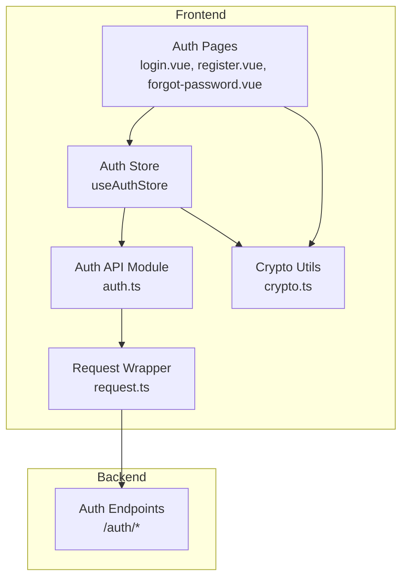
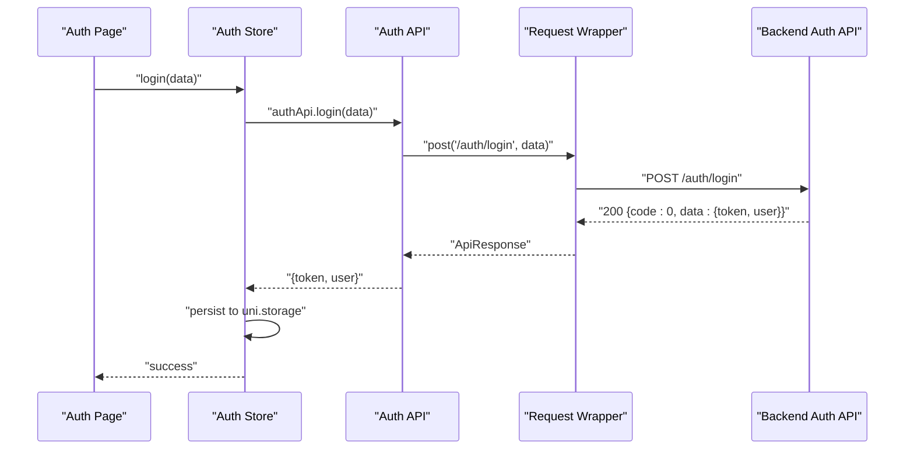
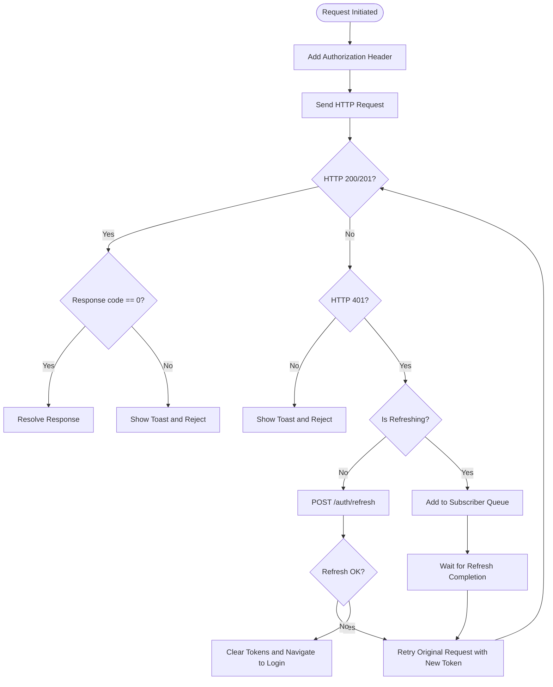
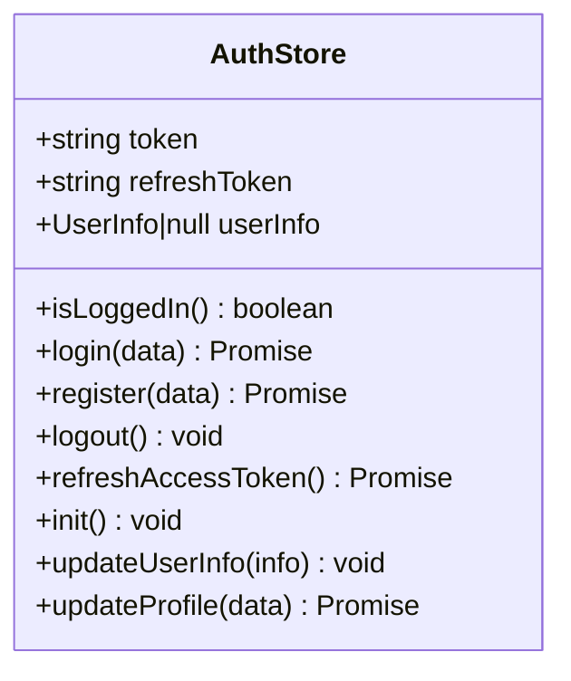
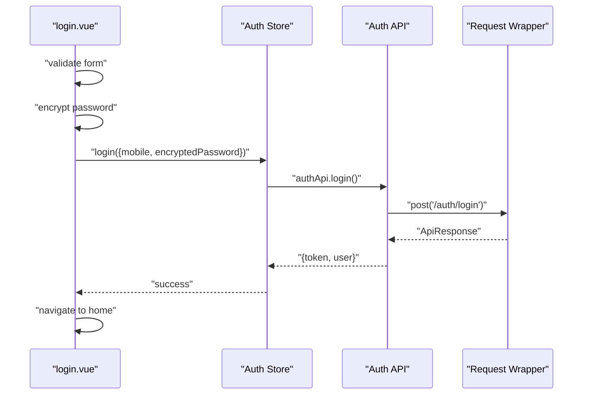
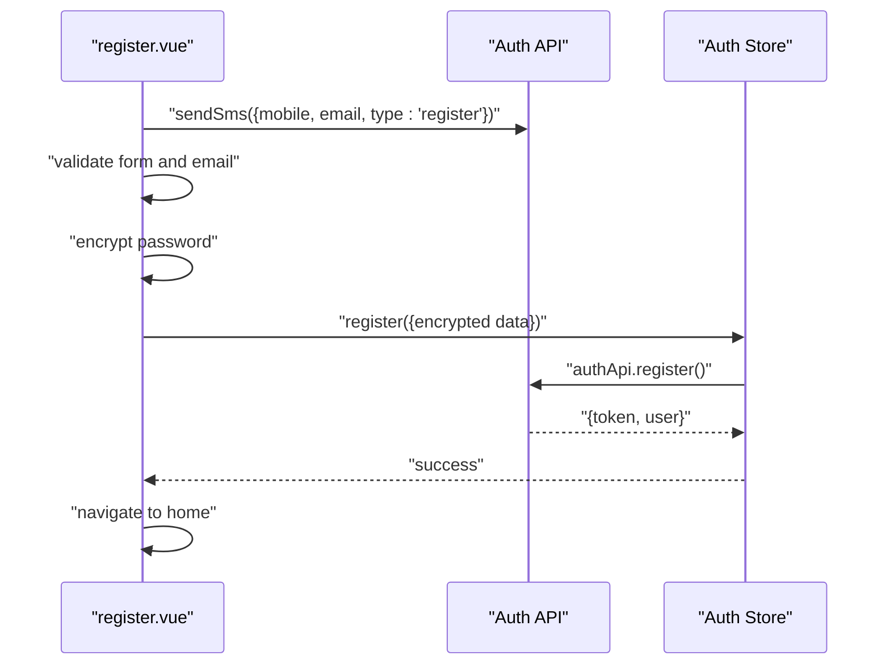
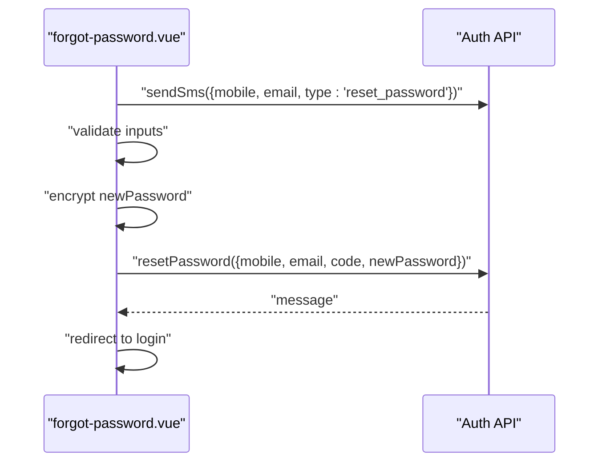
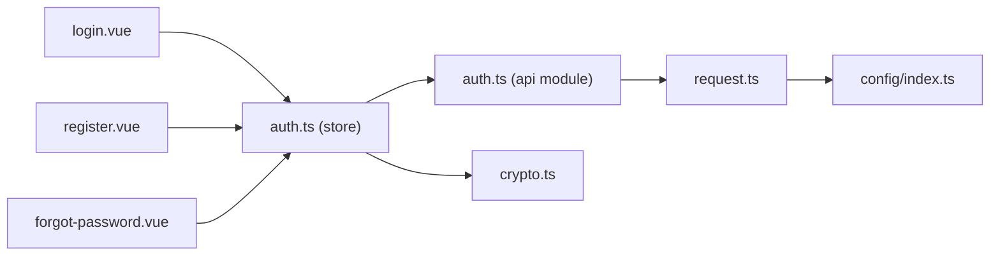

# Authentication Module

<cite>
**Referenced Files in This Document**
- [auth.ts](file://src/api/modules/auth.ts)
- [request.ts](file://src/api/request.ts)
- [auth.ts](file://src/stores/auth.ts)
- [login.vue](file://src/pages/auth/login.vue)
- [register.vue](file://src/pages/auth/register.vue)
- [forgot-password.vue](file://src/pages/auth/forgot-password.vue)
- [backend-types.ts](file://src/types/api/backend-types.ts)
- [backend-api.ts](file://src/types/api/backend-api.ts)
- [crypto.ts](file://src/utils/crypto.ts)
- [main.ts](file://src/main.ts)
- [index.ts](file://src/config/index.ts)
</cite>

## Table of Contents
1. [Introduction](#introduction)
2. [Project Structure](#project-structure)
3. [Core Components](#core-components)
4. [Architecture Overview](#architecture-overview)
5. [Detailed Component Analysis](#detailed-component-analysis)
6. [Dependency Analysis](#dependency-analysis)
7. [Performance Considerations](#performance-considerations)
8. [Troubleshooting Guide](#troubleshooting-guide)
9. [Conclusion](#conclusion)

## Introduction
This document provides comprehensive documentation for the authentication API module. It covers all authentication endpoints (login, registration, logout, password reset, and session refresh), JWT token management, token expiration handling, automatic refresh mechanisms, and authentication state management in the Pinia store. It also documents API response schemas, error handling, and security considerations including token storage strategies and logout cleanup procedures.

## Project Structure
The authentication module is composed of:
- API client module for authentication endpoints
- Request wrapper with automatic token refresh
- Pinia store for authentication state and user profile caching
- Vue pages for login, registration, and password reset flows
- Types for backend DTOs and API responses
- Cryptographic utilities for password encryption

**Diagram sources**
- [auth.ts:33-56](file://src/api/modules/auth.ts#L33-L56)
- [request.ts:75-208](file://src/api/request.ts#L75-L208)
- [auth.ts:9-136](file://src/stores/auth.ts#L9-L136)
- [login.vue:53-116](file://src/pages/auth/login.vue#L53-L116)
- [register.vue:146-309](file://src/pages/auth/register.vue#L146-L309)
- [forgot-password.vue:123-304](file://src/pages/auth/forgot-password.vue#L123-L304)
- [crypto.ts:8-17](file://src/utils/crypto.ts#L8-L17)

**Section sources**
- [auth.ts:1-57](file://src/api/modules/auth.ts#L1-L57)
- [request.ts:1-228](file://src/api/request.ts#L1-L228)
- [auth.ts:1-137](file://src/stores/auth.ts#L1-L137)
- [login.vue:1-227](file://src/pages/auth/login.vue#L1-L227)
- [register.vue:1-501](file://src/pages/auth/register.vue#L1-L501)
- [forgot-password.vue:1-440](file://src/pages/auth/forgot-password.vue#L1-L440)
- [backend-types.ts:374-425](file://src/types/api/backend-types.ts#L374-L425)
- [backend-api.ts:326-373](file://src/types/api/backend-api.ts#L326-L373)
- [crypto.ts:1-18](file://src/utils/crypto.ts#L1-L18)
- [main.ts:1-18](file://src/main.ts#L1-L18)
- [index.ts:1-11](file://src/config/index.ts#L1-L11)

## Core Components
- Authentication API module: Provides typed wrappers for authentication endpoints including SMS sending, registration, login, password reset, and token refresh.
- Request wrapper: Centralized HTTP client with automatic token refresh on 401 Unauthorized responses.
- Auth store: Pinia store managing tokens, user info, and session persistence with local storage.
- Auth pages: Vue pages implementing login, registration, and password reset flows with form validation and error handling.
- Types: Strongly typed DTOs and API response schemas for authentication operations.
- Crypto utilities: Password encryption using SHA256 before transmission.

**Section sources**
- [auth.ts:33-56](file://src/api/modules/auth.ts#L33-L56)
- [request.ts:75-208](file://src/api/request.ts#L75-L208)
- [auth.ts:9-136](file://src/stores/auth.ts#L9-L136)
- [backend-types.ts:374-425](file://src/types/api/backend-types.ts#L374-L425)
- [backend-api.ts:326-373](file://src/types/api/backend-api.ts#L326-L373)
- [crypto.ts:8-17](file://src/utils/crypto.ts#L8-L17)

## Architecture Overview
The authentication flow integrates UI pages, the Pinia store, API module, request wrapper, and backend endpoints. The request wrapper intercepts 401 responses and triggers automatic token refresh, ensuring seamless user experience during token expiration.

**Diagram sources**
- [login.vue:68-103](file://src/pages/auth/login.vue#L68-L103)
- [auth.ts:18-29](file://src/stores/auth.ts#L18-L29)
- [auth.ts:40-41](file://src/api/modules/auth.ts#L40-L41)
- [request.ts:100-147](file://src/api/request.ts#L100-L147)

**Section sources**
- [login.vue:68-103](file://src/pages/auth/login.vue#L68-L103)
- [auth.ts:18-29](file://src/stores/auth.ts#L18-L29)
- [auth.ts:40-41](file://src/api/modules/auth.ts#L40-L41)
- [request.ts:100-147](file://src/api/request.ts#L100-L147)

## Detailed Component Analysis

### Authentication Endpoints
- Send SMS verification code: POST /auth/sms/send with SmsDto payload.
- Register: POST /auth/register with RegisterDto payload; returns token and user.
- Login: POST /auth/login with LoginDto payload; returns token and user.
- Reset password: POST /auth/reset-password with ResetPasswordDto payload; returns message.
- Refresh token: POST /auth/refresh with refreshToken; returns new token and optional new refreshToken.

Response schemas:
- ApiResponse with code, message, data, timestamp.
- Login/Register response includes token and user.
- Refresh response includes token and optional refreshToken.
- Reset password response includes message.

Error handling:
- Non-200/201 responses show toast and reject with error.
- 401 Unauthorized triggers automatic token refresh; if refresh fails, clears storage and navigates to login.

**Section sources**
- [auth.ts:33-56](file://src/api/modules/auth.ts#L33-L56)
- [backend-api.ts:326-373](file://src/types/api/backend-api.ts#L326-L373)
- [backend-types.ts:374-425](file://src/types/api/backend-types.ts#L374-L425)
- [request.ts:87-181](file://src/api/request.ts#L87-L181)

### JWT Token Management and Automatic Refresh
- Token and refresh token are stored in uni.storage and kept in Pinia store reactive state.
- Request wrapper adds Authorization header with Bearer token if present.
- On 401 Unauthorized:
  - If not refreshing, trigger refresh via POST /auth/refresh.
  - If refresh succeeds, update tokens in storage and retry original request.
  - If refresh fails, clear tokens and navigate to login.
- Concurrent requests during refresh are queued and retried with new token.

**Diagram sources**
- [request.ts:75-208](file://src/api/request.ts#L75-L208)

**Section sources**
- [request.ts:35-73](file://src/api/request.ts#L35-L73)
- [request.ts:100-147](file://src/api/request.ts#L100-L147)
- [request.ts:148-174](file://src/api/request.ts#L148-L174)

### Authentication State Management in Pinia Store
- Reactive state: token, refreshToken, userInfo.
- Computed: isLoggedIn derived from token presence.
- Actions:
  - login: calls authApi.login, updates state and storage, returns data.
  - register: similar to login.
  - logout: clears state and storage.
  - refreshAccessToken: calls authApi.refreshToken, updates token and optional refreshToken, persists changes.
  - init: loads persisted tokens and user info from storage on app startup.
  - updateUserInfo: updates local userInfo and emits avatar update event.
  - updateProfile: calls userApi.updateProfile, merges changes into local state, persists, and emits avatar update event.
- Persistence: Pinia plugin persistedstate enabled globally.

**Diagram sources**
- [auth.ts:9-136](file://src/stores/auth.ts#L9-L136)

**Section sources**
- [auth.ts:12-77](file://src/stores/auth.ts#L12-L77)
- [auth.ts:79-117](file://src/stores/auth.ts#L79-L117)
- [main.ts:1-18](file://src/main.ts#L1-L18)

### Login Flow
- Validates form fields.
- Encrypts password using CryptoUtil.encryptPassword.
- Calls authStore.login with encrypted credentials.
- On success, shows toast and navigates to home tab.
- On error, shows toast with error message.

**Diagram sources**
- [login.vue:68-103](file://src/pages/auth/login.vue#L68-L103)
- [auth.ts:18-29](file://src/stores/auth.ts#L18-L29)
- [auth.ts:40-41](file://src/api/modules/auth.ts#L40-L41)
- [request.ts:100-147](file://src/api/request.ts#L100-L147)

**Section sources**
- [login.vue:68-103](file://src/pages/auth/login.vue#L68-L103)
- [crypto.ts:14-16](file://src/utils/crypto.ts#L14-L16)

### Registration Flow
- Sends SMS verification code via authApi.sendSms.
- Validates form fields and email format.
- Encrypts password and calls authStore.register.
- On success, shows toast and navigates to home tab.

**Diagram sources**
- [register.vue:181-233](file://src/pages/auth/register.vue#L181-L233)
- [register.vue:235-302](file://src/pages/auth/register.vue#L235-L302)
- [auth.ts:34-38](file://src/api/modules/auth.ts#L34-L38)
- [auth.ts:31-42](file://src/stores/auth.ts#L31-L42)

**Section sources**
- [register.vue:181-233](file://src/pages/auth/register.vue#L181-L233)
- [register.vue:235-302](file://src/pages/auth/register.vue#L235-L302)
- [auth.ts:34-38](file://src/api/modules/auth.ts#L34-L38)
- [auth.ts:31-42](file://src/stores/auth.ts#L31-L42)

### Password Reset Flow
- Sends SMS verification code via authApi.sendSms with type 'reset_password'.
- Validates phone/email/format/password confirmation.
- Encrypts new password and calls authApi.resetPassword.
- On success, shows toast and redirects to login.

**Diagram sources**
- [forgot-password.vue:141-201](file://src/pages/auth/forgot-password.vue#L141-L201)
- [forgot-password.vue:203-299](file://src/pages/auth/forgot-password.vue#L203-L299)
- [auth.ts:43-44](file://src/api/modules/auth.ts#L43-L44)

**Section sources**
- [forgot-password.vue:141-201](file://src/pages/auth/forgot-password.vue#L141-L201)
- [forgot-password.vue:203-299](file://src/pages/auth/forgot-password.vue#L203-L299)
- [auth.ts:43-44](file://src/api/modules/auth.ts#L43-L44)

### Session Refresh Mechanism
- Called by store.refreshAccessToken using stored refreshToken.
- Updates token and optional refreshToken in state and storage.
- On failure, calls logout to clear state and storage.

**Section sources**
- [auth.ts:54-71](file://src/stores/auth.ts#L54-L71)
- [auth.ts:46-49](file://src/api/modules/auth.ts#L46-L49)

### User Profile Caching and Session Persistence
- userInfo is cached in Pinia store and persisted to uni.storage.
- Avatar updates emit events to keep UI synchronized.
- App initialization loads persisted tokens and user info.

**Section sources**
- [auth.ts:73-77](file://src/stores/auth.ts#L73-L77)
- [auth.ts:79-88](file://src/stores/auth.ts#L79-L88)
- [auth.ts:119-131](file://src/stores/auth.ts#L119-L131)

## Dependency Analysis
- Pages depend on Auth Store and Crypto utilities.
- Auth Store depends on Auth API module and Request wrapper.
- Auth API module depends on Request wrapper and backend types.
- Request wrapper depends on API configuration and handles token refresh.
- Crypto utilities provide password encryption.

**Diagram sources**
- [login.vue:53-58](file://src/pages/auth/login.vue#L53-L58)
- [register.vue:147-151](file://src/pages/auth/register.vue#L147-L151)
- [forgot-password.vue:124-126](file://src/pages/auth/forgot-password.vue#L124-L126)
- [auth.ts:1-7](file://src/stores/auth.ts#L1-L7)
- [auth.ts:1-10](file://src/api/modules/auth.ts#L1-L10)
- [request.ts:1-4](file://src/api/request.ts#L1-L4)
- [crypto.ts:1-1](file://src/utils/crypto.ts#L1-L1)
- [index.ts:1-5](file://src/config/index.ts#L1-L5)

**Section sources**
- [login.vue:53-58](file://src/pages/auth/login.vue#L53-L58)
- [register.vue:147-151](file://src/pages/auth/register.vue#L147-L151)
- [forgot-password.vue:124-126](file://src/pages/auth/forgot-password.vue#L124-L126)
- [auth.ts:1-7](file://src/stores/auth.ts#L1-L7)
- [auth.ts:1-10](file://src/api/modules/auth.ts#L1-L10)
- [request.ts:1-4](file://src/api/request.ts#L1-L4)
- [crypto.ts:1-1](file://src/utils/crypto.ts#L1-L1)
- [index.ts:1-5](file://src/config/index.ts#L1-L5)

## Performance Considerations
- Token refresh is debounced using an internal flag to prevent concurrent refresh attempts.
- Queuing ensures pending requests are retried once the new token is available.
- Local storage operations are minimal and batched during login/register to reduce overhead.
- Password encryption occurs only once per sensitive operation.

[No sources needed since this section provides general guidance]

## Troubleshooting Guide
Common issues and resolutions:
- 401 Unauthorized errors:
  - Trigger automatic refresh; if refresh fails, logout clears tokens and navigates to login.
- Network failures:
  - Request wrapper shows network error toast and rejects promise.
- Validation errors:
  - Pages validate inputs and show appropriate toasts; ensure form fields meet requirements.
- Token not persisting:
  - Verify Pinia persistedstate plugin is enabled and uni.storage keys exist.

**Section sources**
- [request.ts:100-147](file://src/api/request.ts#L100-L147)
- [request.ts:175-181](file://src/api/request.ts#L175-L181)
- [login.vue:69-75](file://src/pages/auth/login.vue#L69-L75)
- [register.vue:236-252](file://src/pages/auth/register.vue#L236-L252)
- [forgot-password.vue:204-268](file://src/pages/auth/forgot-password.vue#L204-L268)
- [main.ts:10-10](file://src/main.ts#L10-L10)

## Conclusion
The authentication module provides a robust, secure, and user-friendly authentication experience. It integrates strongly typed APIs, centralized token management with automatic refresh, persistent state via Pinia, and comprehensive error handling. The modular design ensures maintainability and scalability while adhering to security best practices.