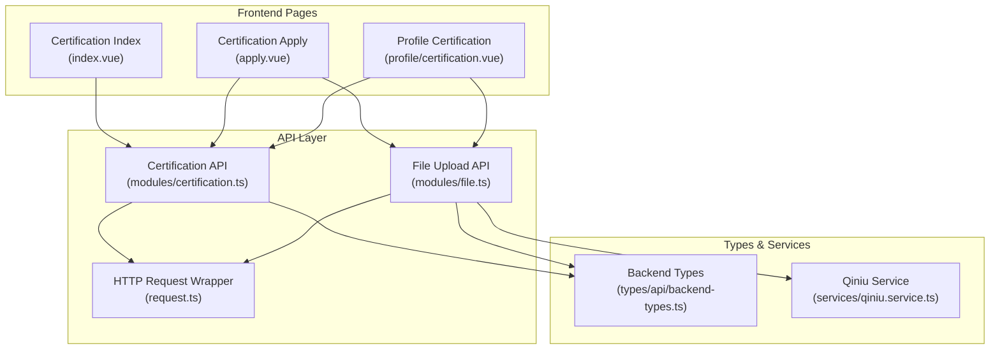
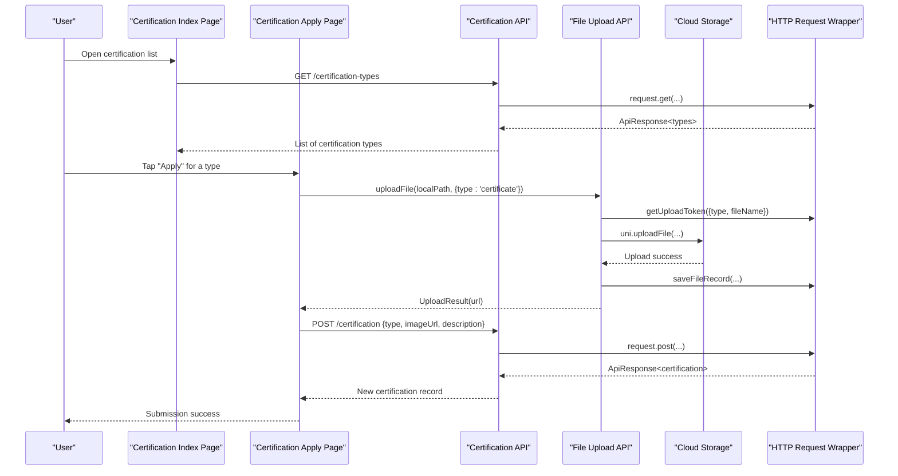
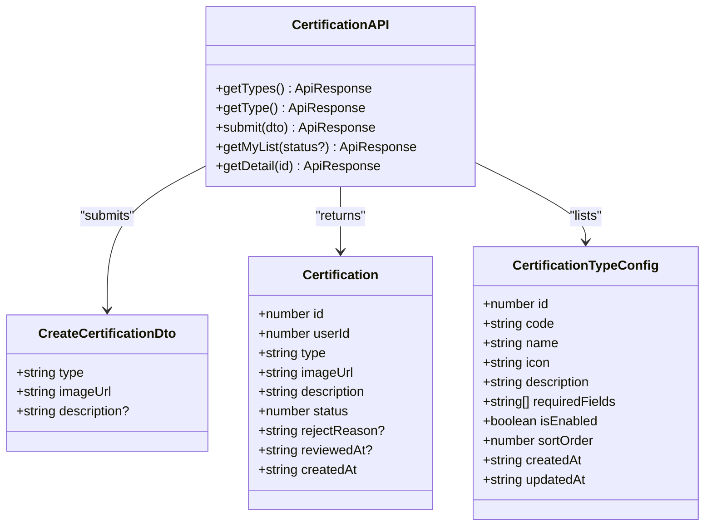
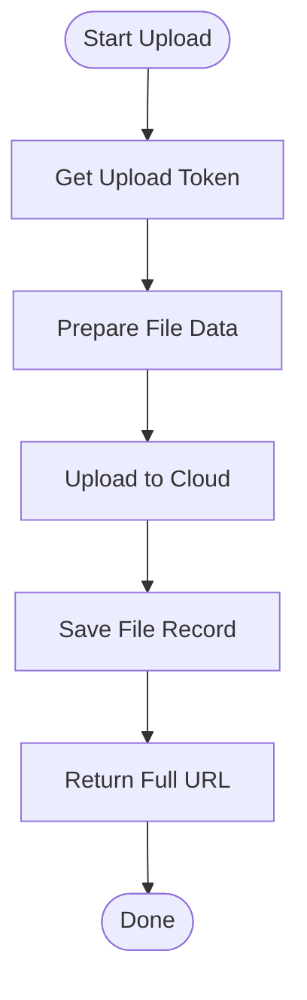
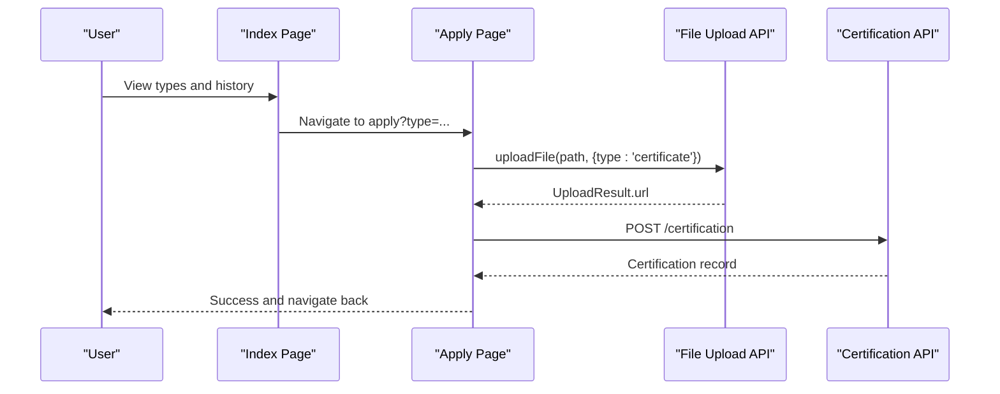
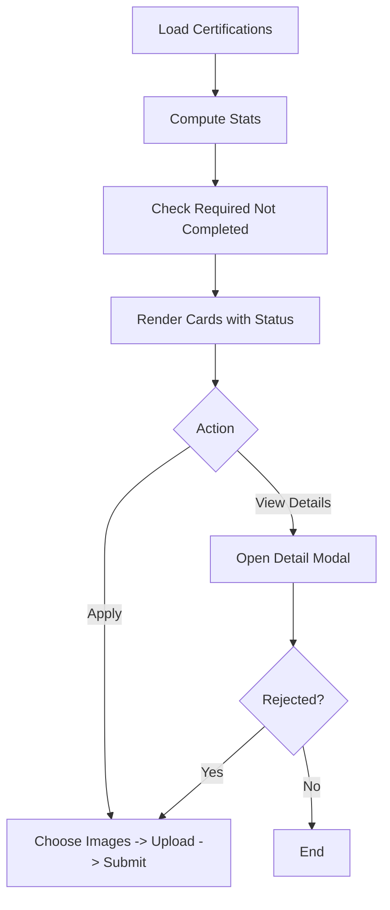
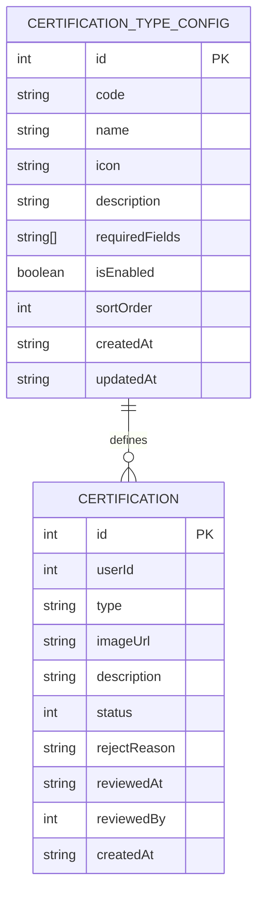
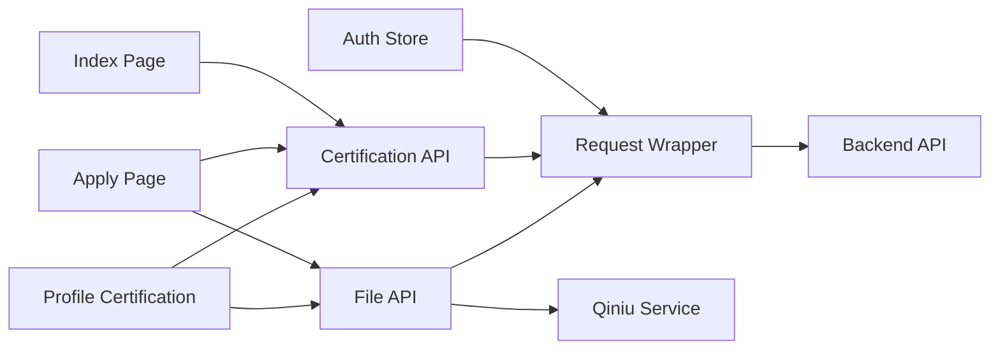

# Certification & Verification Module

<cite>
**Referenced Files in This Document**
- [certification.ts](file://src/api/modules/certification.ts)
- [backend-types.ts](file://src/types/api/backend-types.ts)
- [file.ts](file://src/api/modules/file.ts)
- [request.ts](file://src/api/request.ts)
- [index.vue](file://src/pages/certification/index.vue)
- [apply.vue](file://src/pages/certification/apply.vue)
- [certification.vue](file://src/pages/profile/certification.vue)
- [qiniu.service.ts](file://src/services/qiniu.service.ts)
- [auth.ts](file://src/stores/auth.ts)
</cite>

## Table of Contents
1. [Introduction](#introduction)
2. [Project Structure](#project-structure)
3. [Core Components](#core-components)
4. [Architecture Overview](#architecture-overview)
5. [Detailed Component Analysis](#detailed-component-analysis)
6. [Dependency Analysis](#dependency-analysis)
7. [Performance Considerations](#performance-considerations)
8. [Troubleshooting Guide](#troubleshooting-guide)
9. [Conclusion](#conclusion)

## Introduction
This document describes the Certification & Verification Module, covering identity verification, document upload, status tracking, and approval workflows. It explains the verification process management, document validation, automated checking systems, state tracking, appeal processes, analytics, compliance requirements, audit trails, security measures, multi-factor verification, biometric authentication, and third-party verification integrations. The module supports multiple certification types (identity, education, employment, income, housing, vehicle, photo) with standardized workflows and robust frontend-backend integration.

## Project Structure
The certification module spans three primary areas:
- API layer: centralized certification endpoints and file upload utilities
- Frontend pages: user-facing flows for browsing types, applying, and tracking status
- Types and services: shared type definitions and optional cloud upload service

**Diagram sources**
- [index.vue:1-358](file://src/pages/certification/index.vue#L1-L358)
- [apply.vue:1-276](file://src/pages/certification/apply.vue#L1-L276)
- [certification.vue:1-968](file://src/pages/profile/certification.vue#L1-L968)
- [certification.ts:1-55](file://src/api/modules/certification.ts#L1-L55)
- [file.ts:1-335](file://src/api/modules/file.ts#L1-L335)
- [request.ts:1-228](file://src/api/request.ts#L1-L228)
- [backend-types.ts:549-613](file://src/types/api/backend-types.ts#L549-L613)
- [qiniu.service.ts:1-126](file://src/services/qiniu.service.ts#L1-L126)

**Section sources**
- [certification.ts:1-55](file://src/api/modules/certification.ts#L1-L55)
- [file.ts:1-335](file://src/api/modules/file.ts#L1-L335)
- [index.vue:1-358](file://src/pages/certification/index.vue#L1-L358)
- [apply.vue:1-276](file://src/pages/certification/apply.vue#L1-L276)
- [certification.vue:1-968](file://src/pages/profile/certification.vue#L1-L968)
- [backend-types.ts:549-613](file://src/types/api/backend-types.ts#L549-L613)
- [qiniu.service.ts:1-126](file://src/services/qiniu.service.ts#L1-L126)
- [request.ts:1-228](file://src/api/request.ts#L1-L228)

## Core Components
- Certification API: Provides endpoints to list certification types, submit applications, and fetch user lists and details.
- File Upload API: Handles secure token acquisition, client-side file preparation, and upload to cloud storage, followed by backend file record creation.
- Frontend Pages:
  - Certification Index: Lists available certification types and user's certification history with status badges.
  - Certification Apply: Guides users through image selection, immediate upload, and submission.
  - Profile Certification: Advanced grid view with statistics, required certification enforcement, multi-image uploads, and detailed status tracking.
- Types: Strongly typed definitions for certification records, types, statuses, and upload configurations.
- Authentication Store: Manages session tokens and refresh logic used across certification flows.

**Section sources**
- [certification.ts:34-54](file://src/api/modules/certification.ts#L34-L54)
- [file.ts:90-230](file://src/api/modules/file.ts#L90-L230)
- [index.vue:90-120](file://src/pages/certification/index.vue#L90-L120)
- [apply.vue:100-153](file://src/pages/certification/apply.vue#L100-L153)
- [certification.vue:314-329](file://src/pages/profile/certification.vue#L314-L329)
- [backend-types.ts:564-587](file://src/types/api/backend-types.ts#L564-L587)
- [auth.ts:16-71](file://src/stores/auth.ts#L16-L71)

## Architecture Overview
The certification workflow integrates frontend UI, API clients, and cloud storage with backend validation and state transitions.

**Diagram sources**
- [index.vue:94-120](file://src/pages/certification/index.vue#L94-L120)
- [apply.vue:58-68](file://src/pages/certification/apply.vue#L58-L68)
- [certification.ts:35-42](file://src/api/modules/certification.ts#L35-L42)
- [file.ts:102-230](file://src/api/modules/file.ts#L102-L230)
- [request.ts:75-208](file://src/api/request.ts#L75-L208)

## Detailed Component Analysis

### Certification API Module
- Purpose: Centralized client-side API for certification operations.
- Endpoints:
  - GET /certification-types: Retrieve available certification types with metadata.
  - POST /certification: Submit a new certification application.
  - GET /certification/list: Fetch current user's certifications, optionally filtered by status.
  - GET /certification/:id: Retrieve a specific certification detail.
- Data Contracts:
  - CreateCertificationDto: type, imageUrl, description.
  - Certification: id, userId, type, imageUrl, description, status, rejectReason, reviewedAt, createdAt.
  - CertificationTypeConfig: code, name, icon, description, requiredFields, enabled flag, sort order.

**Diagram sources**
- [certification.ts:34-54](file://src/api/modules/certification.ts#L34-L54)
- [backend-types.ts:552-587](file://src/types/api/backend-types.ts#L552-L587)

**Section sources**
- [certification.ts:34-54](file://src/api/modules/certification.ts#L34-L54)
- [backend-types.ts:552-587](file://src/types/api/backend-types.ts#L552-L587)

### File Upload Pipeline
- Purpose: Securely upload documents to cloud storage and persist records.
- Steps:
  1) Acquire upload token via POST /file/upload-token with type and filename.
  2) Prepare file data (handling base64/blob/H5 paths) and upload via uni.uploadFile.
  3) Save file record via POST /file/save and return full URL.
- Supported types: certificate, avatar, album, square (mapped internally).
- Optional Qiniu service wrapper provides compression and progress callbacks.

**Diagram sources**
- [file.ts:90-230](file://src/api/modules/file.ts#L90-L230)
- [qiniu.service.ts:29-87](file://src/services/qiniu.service.ts#L29-L87)

**Section sources**
- [file.ts:90-230](file://src/api/modules/file.ts#L90-L230)
- [qiniu.service.ts:29-87](file://src/services/qiniu.service.ts#L29-L87)

### Frontend Pages: Index and Apply Workflows
- Certification Index:
  - Loads certification types and user certifications.
  - Displays status badges per type with prioritized image selection.
  - Routes to apply page for selected type.
- Certification Apply:
  - Chooses images from album/camera, previews immediately, and uploads to cloud.
  - Submits certification application with type, uploaded image URL, and optional description.
  - Shows loading states and toast notifications for success/failure.

**Diagram sources**
- [index.vue:206-210](file://src/pages/certification/index.vue#L206-L210)
- [apply.vue:70-153](file://src/pages/certification/apply.vue#L70-L153)
- [file.ts:102-230](file://src/api/modules/file.ts#L102-L230)
- [certification.ts:41-42](file://src/api/modules/certification.ts#L41-L42)

**Section sources**
- [index.vue:90-120](file://src/pages/certification/index.vue#L90-L120)
- [apply.vue:70-153](file://src/pages/certification/apply.vue#L70-L153)

### Advanced Profile Certification Page
- Grid layout with certification cards, status badges, and action buttons.
- Statistics: approved, pending, and total counts.
- Required certification enforcement: highlights missing mandatory certifications.
- Multi-image support per type with upload area and preview.
- Detail modal shows materials, status, rejection reason, timestamps, and reapply option when rejected.

**Diagram sources**
- [certification.vue:314-329](file://src/pages/profile/certification.vue#L314-L329)
- [certification.vue:331-370](file://src/pages/profile/certification.vue#L331-L370)
- [certification.vue:421-491](file://src/pages/profile/certification.vue#L421-L491)

**Section sources**
- [certification.vue:288-306](file://src/pages/profile/certification.vue#L288-L306)
- [certification.vue:421-491](file://src/pages/profile/certification.vue#L421-L491)

### Data Models and Status Management
- CertificationStatus: pending (0), approved (1), rejected (2).
- CertificationType: id_card, education, occupation, income, housing, car, photo.
- Required fields per type are configurable via CertificationTypeConfig.
- Reject reasons and reviewer metadata are stored with certification records.

**Diagram sources**
- [backend-types.ts:564-613](file://src/types/api/backend-types.ts#L564-L613)

**Section sources**
- [backend-types.ts:70-74](file://src/types/api/backend-types.ts#L70-L74)
- [backend-types.ts:592-613](file://src/types/api/backend-types.ts#L592-L613)

## Dependency Analysis
- Frontend pages depend on certification API and file API.
- File API depends on request wrapper and optional Qiniu service.
- Authentication store manages tokens used by request wrapper for protected endpoints.
- Type definitions unify frontend and backend contracts.

**Diagram sources**
- [auth.ts:16-71](file://src/stores/auth.ts#L16-L71)
- [request.ts:15-24](file://src/api/request.ts#L15-L24)
- [index.vue:62-67](file://src/pages/certification/index.vue#L62-L67)
- [apply.vue:38-39](file://src/pages/certification/apply.vue#L38-L39)
- [certification.vue:202-209](file://src/pages/profile/certification.vue#L202-L209)
- [certification.ts:1-6](file://src/api/modules/certification.ts#L1-L6)
- [file.ts:1-2](file://src/api/modules/file.ts#L1-L2)
- [qiniu.service.ts:1-10](file://src/services/qiniu.service.ts#L1-L10)

**Section sources**
- [auth.ts:16-71](file://src/stores/auth.ts#L16-L71)
- [request.ts:15-24](file://src/api/request.ts#L15-L24)
- [index.vue:62-67](file://src/pages/certification/index.vue#L62-L67)
- [apply.vue:38-39](file://src/pages/certification/apply.vue#L38-L39)
- [certification.vue:202-209](file://src/pages/profile/certification.vue#L202-L209)

## Performance Considerations
- Image handling: Prefer compressed images and avoid oversized uploads to reduce latency and bandwidth.
- Token reuse: Acquire upload tokens per file to minimize server round trips.
- Batch uploads: For multi-image types, upload sequentially with user feedback to prevent overwhelming the UI.
- Caching: Cache certification types locally to reduce repeated network requests.
- Retry and backoff: Implement exponential backoff for transient failures during upload or API calls.

## Troubleshooting Guide
Common issues and resolutions:
- Authentication errors:
  - Symptom: Requests return unauthorized after token expiration.
  - Resolution: The request wrapper automatically refreshes tokens and retries; ensure refresh tokens are present and valid.
- Upload failures:
  - Symptom: File upload fails or returns invalid URLs.
  - Resolution: Verify upload token validity, supported file extensions, and network connectivity; check cloud storage region and credentials.
- UI freezes during submission:
  - Symptom: Buttons disabled but no feedback.
  - Resolution: Ensure loading states are shown while uploads and submissions are in progress; avoid concurrent submissions.
- Missing required certifications:
  - Symptom: Required certification enforcement prevents further actions.
  - Resolution: Guide users to complete identity and photo certifications first.

**Section sources**
- [request.ts:100-147](file://src/api/request.ts#L100-L147)
- [file.ts:164-229](file://src/api/modules/file.ts#L164-L229)
- [certification.vue:299-306](file://src/pages/profile/certification.vue#L299-L306)

## Conclusion
The Certification & Verification Module provides a robust, scalable solution for identity and document verification. It integrates secure file uploads, flexible certification types, clear status tracking, and user-friendly interfaces. The modular design enables future enhancements such as automated checks, compliance analytics, multi-factor verification, biometric authentication, and third-party verification integrations.