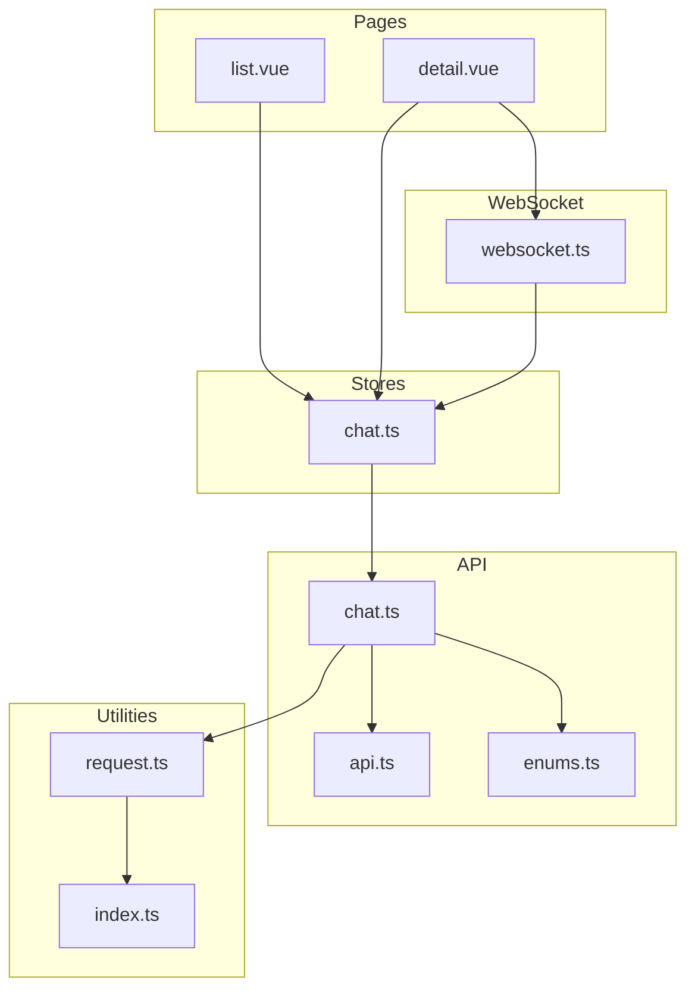
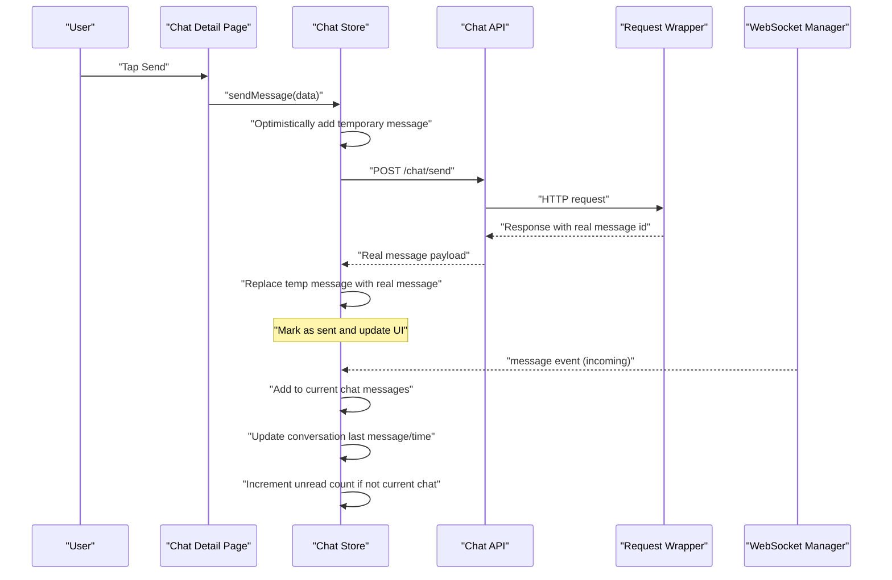
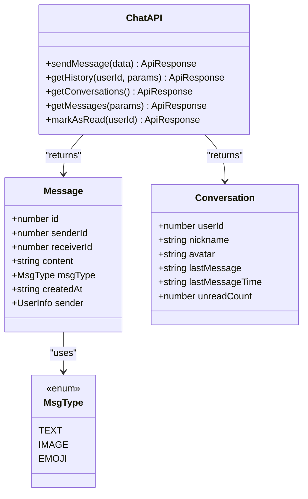
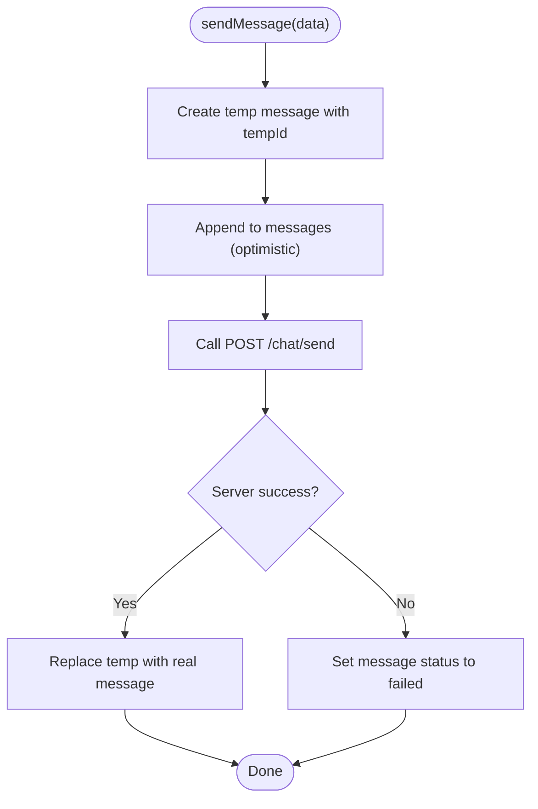
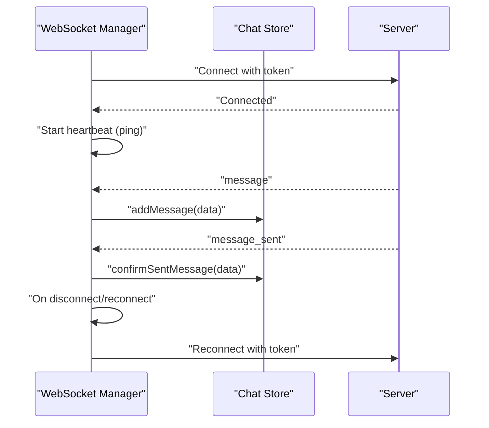
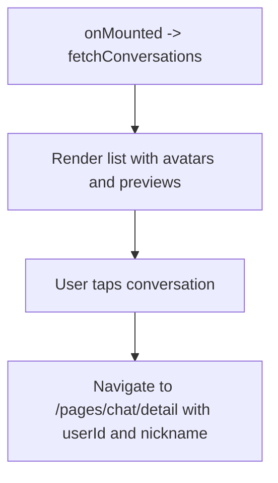
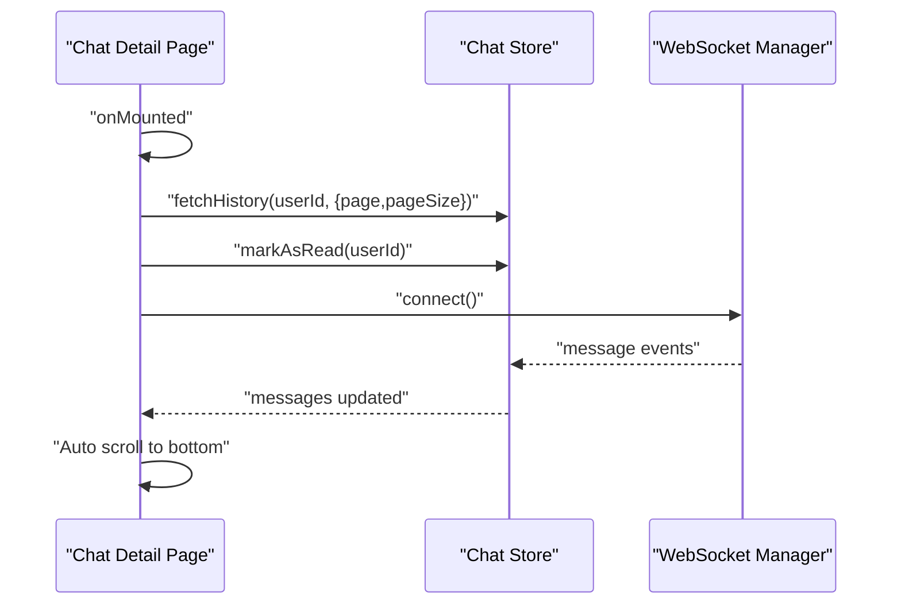
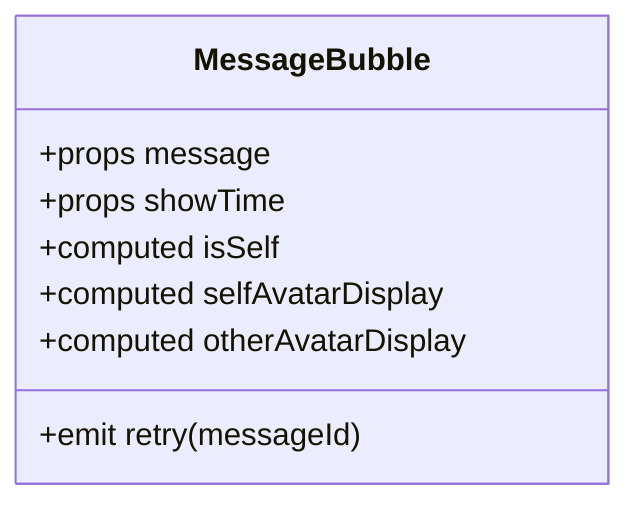
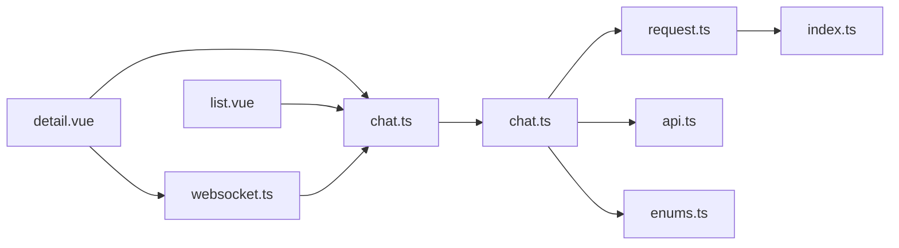

# Chat & Messaging Module

<cite>
**Referenced Files in This Document**
- [chat.ts](file://src/api/modules/chat.ts)
- [chat.ts](file://src/stores/chat.ts)
- [websocket.ts](file://src/utils/websocket.ts)
- [detail.vue](file://src/pages/chat/detail.vue)
- [list.vue](file://src/pages/chat/list.vue)
- [backend-types.ts](file://src/types/api/backend-types.ts)
- [api.ts](file://src/types/api.ts)
- [enums.ts](file://src/types/enums.ts)
- [request.ts](file://src/api/request.ts)
- [index.ts](file://src/config/index.ts)
- [MessageBubble.vue](file://src/components/business/MessageBubble.vue)
- [chat-detail-input-fix.md](file://docs/chat-detail-input-fix.md)
</cite>

## Table of Contents
1. [Introduction](#introduction)
2. [Project Structure](#project-structure)
3. [Core Components](#core-components)
4. [Architecture Overview](#architecture-overview)
5. [Detailed Component Analysis](#detailed-component-analysis)
6. [Dependency Analysis](#dependency-analysis)
7. [Performance Considerations](#performance-considerations)
8. [Troubleshooting Guide](#troubleshooting-guide)
9. [Conclusion](#conclusion)

## Introduction
This document describes the chat and messaging module of the frontend application. It covers the chat API endpoints for sending messages, retrieving conversations, fetching message history, and marking messages as read. It also documents the WebSocket integration for real-time messaging, including message delivery, optimistic updates, and connection resilience. The document explains chat state management, message queuing during connection drops, offline message synchronization, message formatting, attachment handling, and chat room management. Finally, it addresses message encryption, delivery receipts, and chat moderation APIs.

## Project Structure
The chat module is composed of:
- API layer: chat endpoints and DTOs
- Store layer: chat state management and optimistic updates
- WebSocket layer: connection management and event handling
- Pages: chat list and chat detail views
- Types: shared data structures and enums
- Utilities: request wrapper and configuration

**Diagram sources**
- [list.vue:1-311](file://src/pages/chat/list.vue#L1-L311)
- [detail.vue:1-299](file://src/pages/chat/detail.vue#L1-L299)
- [chat.ts:1-234](file://src/stores/chat.ts#L1-L234)
- [chat.ts:1-46](file://src/api/modules/chat.ts#L1-L46)
- [api.ts:26-43](file://src/types/api.ts#L26-L43)
- [enums.ts:7-11](file://src/types/enums.ts#L7-L11)
- [websocket.ts:1-171](file://src/utils/websocket.ts#L1-L171)
- [request.ts:1-228](file://src/api/request.ts#L1-L228)
- [index.ts:1-11](file://src/config/index.ts#L1-L11)

**Section sources**
- [list.vue:1-311](file://src/pages/chat/list.vue#L1-L311)
- [detail.vue:1-299](file://src/pages/chat/detail.vue#L1-L299)
- [chat.ts:1-234](file://src/stores/chat.ts#L1-L234)
- [chat.ts:1-46](file://src/api/modules/chat.ts#L1-L46)
- [api.ts:26-43](file://src/types/api.ts#L26-L43)
- [enums.ts:7-11](file://src/types/enums.ts#L7-L11)
- [websocket.ts:1-171](file://src/utils/websocket.ts#L1-L171)
- [request.ts:1-228](file://src/api/request.ts#L1-L228)
- [index.ts:1-11](file://src/config/index.ts#L1-L11)

## Core Components
- Chat API module: defines endpoints for sending messages, fetching conversations, retrieving message history, and marking messages as read. It also exposes DTOs for message and conversation types and message type enums.
- Chat store: manages chat state (conversations, current chat, messages, unread counts), performs optimistic updates for outgoing messages, handles incoming WebSocket messages, and synchronizes UI state.
- WebSocket manager: connects to the WebSocket server, authenticates via token, handles connection lifecycle events, heartbeats, and dispatches received messages to the store.
- Pages:
  - Chat list page: renders conversation list, displays last message preview and unread counts, and navigates to chat detail.
  - Chat detail page: loads message history, displays messages with status indicators, supports sending new messages, retries failed sends, and scrolls to bottom automatically.
- Message bubble component: renders individual messages with sender avatar, content, timestamps, and status indicators (sending, failed).
- Request wrapper: centralizes HTTP requests, token handling, and automatic token refresh logic.
- Configuration: exposes base URLs for REST API and WebSocket.

**Section sources**
- [chat.ts:1-46](file://src/api/modules/chat.ts#L1-L46)
- [chat.ts:1-234](file://src/stores/chat.ts#L1-L234)
- [websocket.ts:1-171](file://src/utils/websocket.ts#L1-L171)
- [list.vue:1-311](file://src/pages/chat/list.vue#L1-L311)
- [detail.vue:1-299](file://src/pages/chat/detail.vue#L1-L299)
- [MessageBubble.vue:1-309](file://src/components/business/MessageBubble.vue#L1-L309)
- [request.ts:1-228](file://src/api/request.ts#L1-L228)
- [index.ts:1-11](file://src/config/index.ts#L1-L11)

## Architecture Overview
The chat module follows a layered architecture:
- Presentation layer: Vue pages render UI and orchestrate user actions.
- Domain layer: Pinia store encapsulates chat business logic and state.
- API layer: REST endpoints for CRUD operations on chats and messages.
- Transport layer: WebSocket client for real-time messaging and server events.
- Infrastructure layer: request wrapper handles HTTP transport, headers, and token refresh.

**Diagram sources**
- [detail.vue:131-148](file://src/pages/chat/detail.vue#L131-L148)
- [chat.ts:50-90](file://src/stores/chat.ts#L50-L90)
- [chat.ts:18-21](file://src/api/modules/chat.ts#L18-L21)
- [request.ts:75-208](file://src/api/request.ts#L75-L208)
- [websocket.ts:93-111](file://src/utils/websocket.ts#L93-L111)

## Detailed Component Analysis

### Chat API Endpoints
The chat API module defines the following endpoints:
- POST /chat/send: Sends a message to a receiver. Accepts receiverId, content, and optional msgType. Returns the created message with id.
- GET /chat/history/:userId: Retrieves paginated message history for a given user. Supports page and pageSize parameters.
- GET /chat/conversations: Retrieves the list of conversations with unread counts.
- GET /chat/messages: Retrieves messages exchanged with a specific friend, with pagination.
- PUT /chat/read/:userId: Marks messages from a user as read.

Data transfer objects and types:
- SendMessageDto: receiverId, content, msgType (optional).
- Message: id, senderId, receiverId, content, msgType, createdAt, optional sender info.
- Conversation: userId, nickname, avatar, lastMessage, lastMessageTime, unreadCount.
- MsgType enum: TEXT=1, IMAGE=2, EMOJI=3.

**Diagram sources**
- [chat.ts:6-45](file://src/api/modules/chat.ts#L6-L45)
- [api.ts:26-43](file://src/types/api.ts#L26-L43)
- [enums.ts:7-11](file://src/types/enums.ts#L7-L11)

**Section sources**
- [chat.ts:1-46](file://src/api/modules/chat.ts#L1-L46)
- [api.ts:26-43](file://src/types/api.ts#L26-L43)
- [enums.ts:7-11](file://src/types/enums.ts#L7-L11)

### Chat Store: State Management and Optimistic Updates
The chat store manages:
- Conversations: list of conversations with last message preview and unread counts.
- Current chat: the active conversation being viewed.
- Messages: array of messages for the current chat.
- Unread count: total unread messages across conversations.

Key behaviors:
- fetchConversations: normalizes avatar and last message time fields, sets unreadCount.
- fetchHistory: maps backend bigint-like ids to numbers, adds isSelf flag, and populates messages.
- sendMessage: generates a temporary message with a timestamp-based id, optimistically appends it, then replaces with the server-provided message upon success or marks as failed.
- markAsRead: updates the unread count for a conversation after marking as read.
- addMessage: handles incoming WebSocket messages, deduplicates, sets isSelf, appends to current chat if applicable, updates conversation last message/time, increments unread count if not current chat.
- confirmSentMessage: replaces temporary messages with real ones, handles multi-device synchronization, and updates conversation metadata.

**Diagram sources**
- [chat.ts:50-90](file://src/stores/chat.ts#L50-L90)

**Section sources**
- [chat.ts:1-234](file://src/stores/chat.ts#L1-L234)

### WebSocket Integration for Real-Time Messaging
The WebSocket manager:
- Connects to the configured wsURL with path /api/v1/ws and passes the token via auth.
- Emits periodic ping heartbeats and listens for pong responses.
- Handles connection lifecycle: connect, connected, message, pong, disconnect, connect_error.
- Dispatches incoming messages to the store:
  - type=message: forwards to addMessage.
  - type=message_sent: forwards to confirmSentMessage.
  - raw message object: forwards to addMessage (compatibility).
- Implements exponential backoff reconnection with a maximum number of attempts.
- Provides a send method to emit events to the server.

**Diagram sources**
- [websocket.ts:15-91](file://src/utils/websocket.ts#L15-L91)
- [websocket.ts:93-111](file://src/utils/websocket.ts#L93-L111)
- [websocket.ts:128-141](file://src/utils/websocket.ts#L128-L141)

**Section sources**
- [websocket.ts:1-171](file://src/utils/websocket.ts#L1-L171)

### Chat List Page
The chat list page:
- Renders skeletons while loading conversations.
- Displays each conversation’s avatar, nickname, last message preview, last message time, and unread count badge.
- Uses avatar sync composable to keep avatars up-to-date.
- Navigates to the chat detail page with target user id and nickname.

**Diagram sources**
- [list.vue:78-97](file://src/pages/chat/list.vue#L78-L97)

**Section sources**
- [list.vue:1-311](file://src/pages/chat/list.vue#L1-L311)

### Chat Detail Page
The chat detail page:
- Loads message history for the selected user and marks as read.
- Initializes current chat context and connects to WebSocket.
- Displays messages using the MessageBubble component, with status indicators for sending and failures.
- Supports retrying failed messages by resending via the store.
- Automatically scrolls to the bottom after new messages arrive.

**Diagram sources**
- [detail.vue:77-102](file://src/pages/chat/detail.vue#L77-L102)
- [detail.vue:116-129](file://src/pages/chat/detail.vue#L116-L129)
- [websocket.ts:15-53](file://src/utils/websocket.ts#L15-L53)

**Section sources**
- [detail.vue:1-299](file://src/pages/chat/detail.vue#L1-L299)

### Message Bubble Component
The message bubble component:
- Renders message content with sender avatar (left for others, right for self).
- Shows sending status dots for outgoing messages still in progress.
- Shows a retry indicator for failed messages and emits retry events to parent.
- Computes avatar display using avatar utilities and respects nested sender info.

**Diagram sources**
- [MessageBubble.vue:74-114](file://src/components/business/MessageBubble.vue#L74-L114)

**Section sources**
- [MessageBubble.vue:1-309](file://src/components/business/MessageBubble.vue#L1-L309)

### Message Formatting, Attachments, and Chat Room Management
- Message formatting: messages are rendered as plain text with word wrapping and pre-wrap support. Timestamps can be shown centered above messages.
- Attachments: the MsgType enum includes IMAGE and EMOJI, indicating support for non-text content. The UI renders text content; attachment rendering would be implemented in the message bubble component by extending the bubble-content area.
- Chat room management: conversations are represented as one-on-one rooms keyed by userId. The store maintains lastMessage, lastMessageTime, and unreadCount per conversation.

**Section sources**
- [enums.ts:7-11](file://src/types/enums.ts#L7-L11)
- [api.ts:26-43](file://src/types/api.ts#L26-L43)
- [MessageBubble.vue:42-44](file://src/components/business/MessageBubble.vue#L42-L44)

### Message Encryption, Delivery Receipts, and Moderation APIs
- Message encryption: not implemented in the frontend code. If end-to-end encryption is required, it should be handled by the backend and/or a cryptographic library integrated at the store or API layer.
- Delivery receipts: not implemented in the frontend code. Receipts would require server-side acknowledgment events and UI updates in the store.
- Moderation APIs: not present in the frontend code. Moderation features (e.g., reports, bans) would require additional backend endpoints and corresponding UI/API integrations.

[No sources needed since this section provides general guidance]

## Dependency Analysis
The chat module exhibits clear separation of concerns:
- Pages depend on the store for state and actions.
- The store depends on the API module and request wrapper for network operations.
- The WebSocket manager depends on the store to process incoming events.
- Types and enums are shared across modules to maintain consistency.

**Diagram sources**
- [detail.vue:50-57](file://src/pages/chat/detail.vue#L50-L57)
- [list.vue:59-64](file://src/pages/chat/list.vue#L59-L64)
- [chat.ts:1-8](file://src/stores/chat.ts#L1-L8)
- [chat.ts:1-5](file://src/api/modules/chat.ts#L1-L5)
- [request.ts:1-4](file://src/api/request.ts#L1-L4)
- [websocket.ts:1-4](file://src/utils/websocket.ts#L1-L4)
- [api.ts:26-43](file://src/types/api.ts#L26-L43)
- [enums.ts:7-11](file://src/types/enums.ts#L7-L11)
- [index.ts:1-5](file://src/config/index.ts#L1-L5)

**Section sources**
- [detail.vue:50-57](file://src/pages/chat/detail.vue#L50-L57)
- [list.vue:59-64](file://src/pages/chat/list.vue#L59-L64)
- [chat.ts:1-8](file://src/stores/chat.ts#L1-L8)
- [chat.ts:1-5](file://src/api/modules/chat.ts#L1-L5)
- [request.ts:1-4](file://src/api/request.ts#L1-L4)
- [websocket.ts:1-4](file://src/utils/websocket.ts#L1-L4)
- [api.ts:26-43](file://src/types/api.ts#L26-L43)
- [enums.ts:7-11](file://src/types/enums.ts#L7-L11)
- [index.ts:1-5](file://src/config/index.ts#L1-L5)

## Performance Considerations
- Optimistic UI: immediate insertion of outgoing messages improves perceived latency; ensure deduplication and replacement logic prevents visual glitches.
- Infinite scrolling and pagination: use page and pageSize parameters to avoid loading large histories at once.
- Debouncing and throttling: consider debouncing message input to reduce unnecessary reflows.
- Heartbeat intervals: adjust ping interval to balance responsiveness and bandwidth usage.
- Virtualized lists: for very long histories, consider virtual scrolling to improve rendering performance.

[No sources needed since this section provides general guidance]

## Troubleshooting Guide
Common issues and resolutions:
- WebSocket not connecting:
  - Verify token availability and expiration.
  - Check wsURL configuration and CORS settings on the server.
  - Inspect connection lifecycle logs for disconnect/connect_error events.
- Messages not appearing:
  - Confirm that addMessage filters messages based on currentChat context.
  - Ensure message deduplication logic does not suppress legitimate messages.
- Sending fails:
  - Check request wrapper token refresh logic and 401 handling.
  - Validate that confirmSentMessage replaces temporary messages correctly.
- Layout issues in chat detail:
  - Review dynamic height calculations and keyboard handling; prefer flex layout for reliable bottom anchoring.

**Section sources**
- [websocket.ts:15-91](file://src/utils/websocket.ts#L15-L91)
- [chat.ts:100-158](file://src/stores/chat.ts#L100-L158)
- [request.ts:35-174](file://src/api/request.ts#L35-L174)
- [chat-detail-input-fix.md:1-66](file://docs/chat-detail-input-fix.md#L1-L66)

## Conclusion
The chat and messaging module provides a robust foundation for real-time communication with optimistic UI updates, resilient WebSocket connectivity, and clean separation of concerns. The current implementation supports text messaging, conversation management, and basic attachment types. Future enhancements should focus on end-to-end encryption, delivery receipts, and moderation capabilities, along with performance optimizations for large histories and improved accessibility.