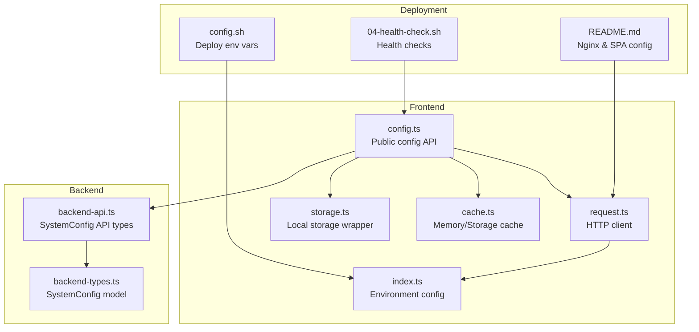
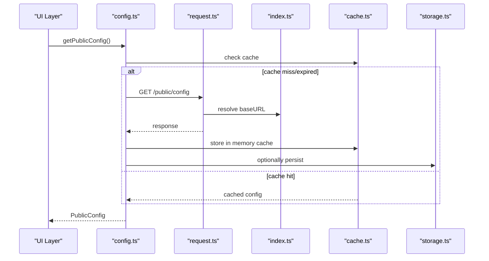
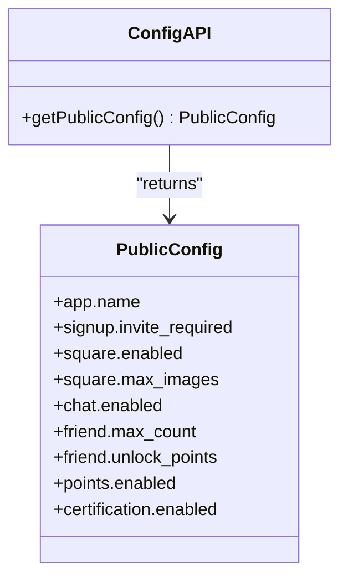
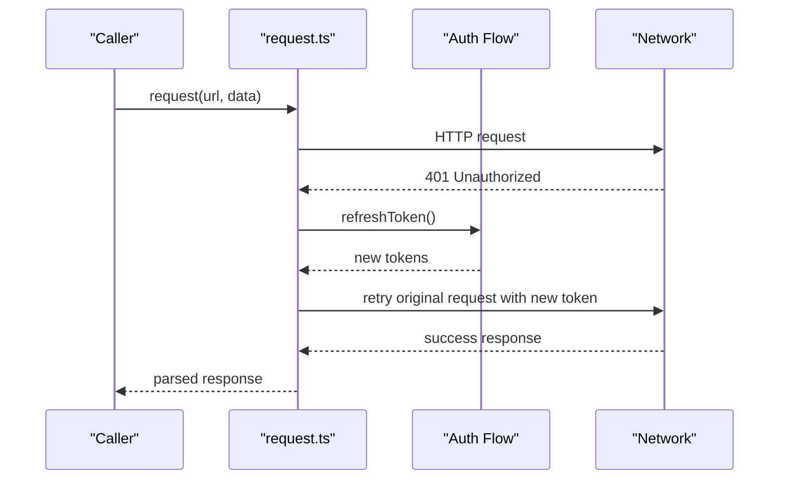
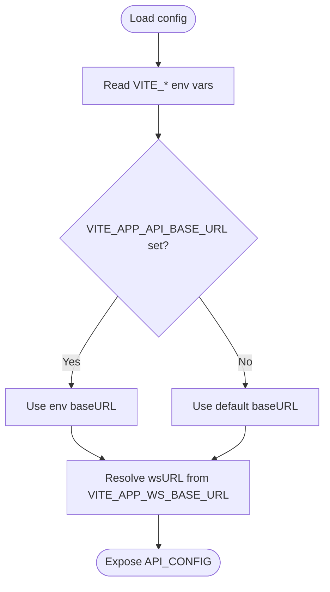
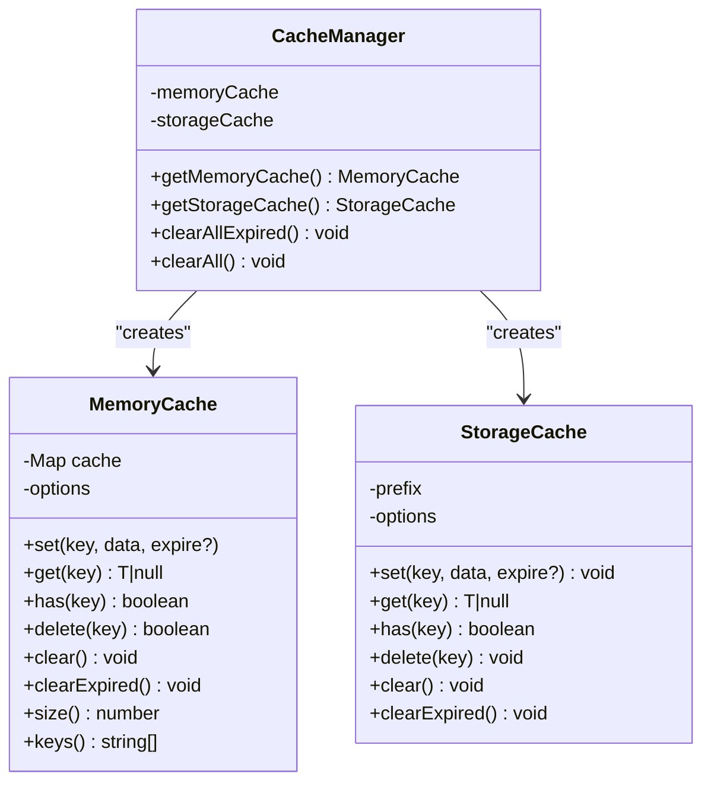
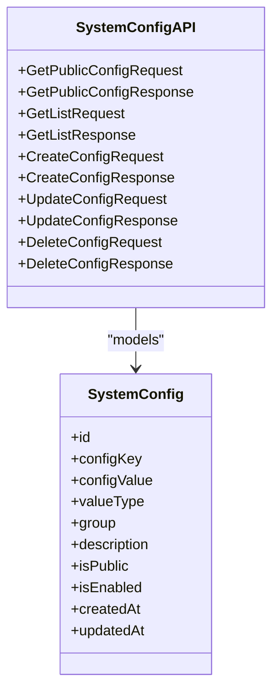
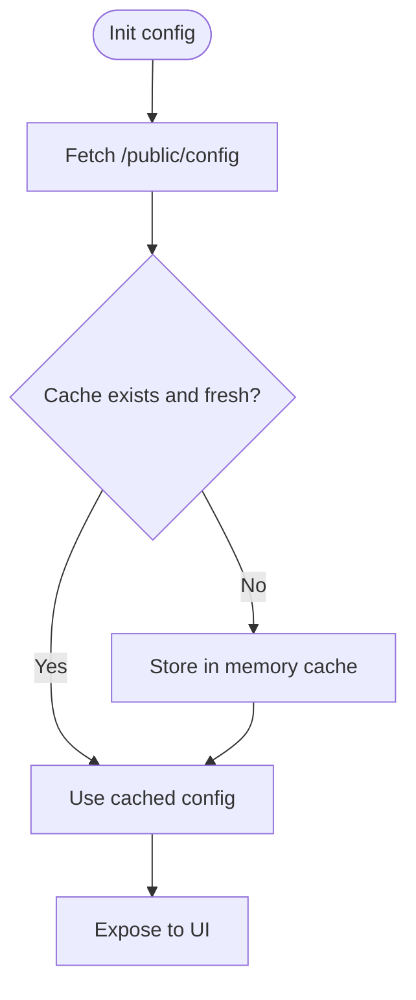
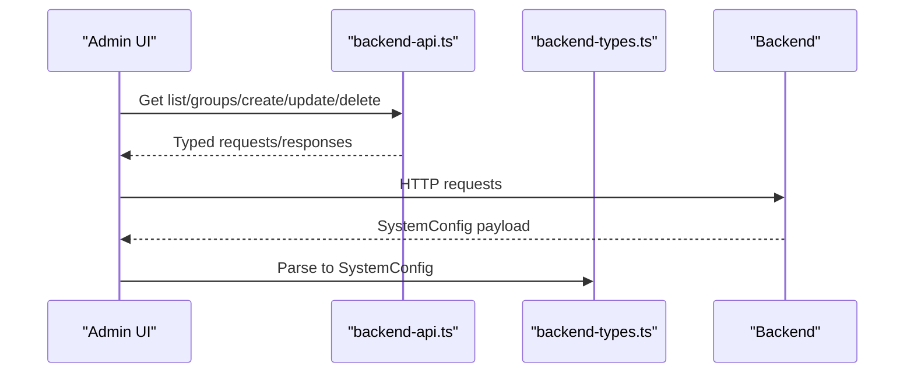
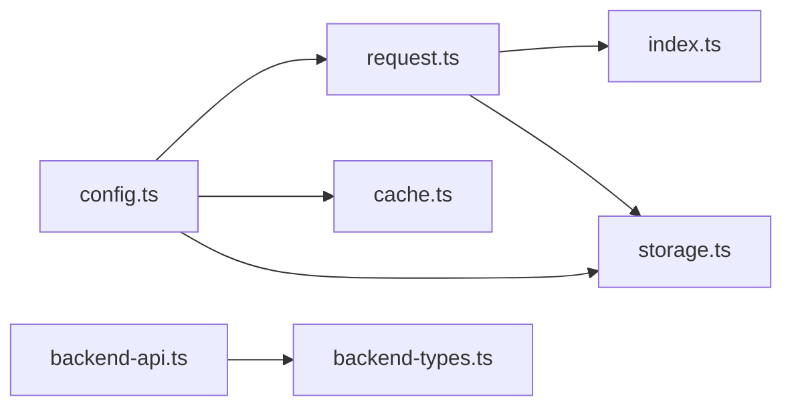

# Configuration & Settings Module

<cite>
**Referenced Files in This Document**
- [config.ts](file://src/api/modules/config.ts)
- [request.ts](file://src/api/request.ts)
- [index.ts](file://src/config/index.ts)
- [cache.ts](file://src/utils/cache.ts)
- [storage.ts](file://src/utils/storage.ts)
- [backend-api.ts](file://src/types/api/backend-api.ts)
- [backend-types.ts](file://src/types/api/backend-types.ts)
- [config.sh](file://linux-190-deploy/config.sh)
- [04-health-check.sh](file://linux-190-deploy/04-health-check.sh)
- [README.md](file://linux-190-deploy/README.md)
</cite>

## Table of Contents
1. [Introduction](#introduction)
2. [Project Structure](#project-structure)
3. [Core Components](#core-components)
4. [Architecture Overview](#architecture-overview)
5. [Detailed Component Analysis](#detailed-component-analysis)
6. [Dependency Analysis](#dependency-analysis)
7. [Performance Considerations](#performance-considerations)
8. [Troubleshooting Guide](#troubleshooting-guide)
9. [Conclusion](#conclusion)
10. [Appendices](#appendices)

## Introduction
This document describes the configuration and settings API module for the frontend application. It covers:
- Public configuration retrieval and client-side caching
- Environment variable-driven base URLs
- Backend configuration APIs for administrators
- Deployment and health-check integration for configuration endpoints
- Security, validation, and rollback considerations

The module focuses on:
- Public app settings exposed via a public endpoint
- Client-side caching strategies for configuration
- Admin-managed system configuration via typed backend APIs
- Environment-driven configuration and deployment integration

## Project Structure
The configuration module spans three primary areas:
- Frontend configuration API and client-side caching
- Environment configuration for base URLs
- Backend configuration APIs and types for admin operations

**Diagram sources**
- [config.ts:1-33](file://src/api/modules/config.ts#L1-L33)
- [request.ts:1-228](file://src/api/request.ts#L1-L228)
- [index.ts:1-11](file://src/config/index.ts#L1-L11)
- [cache.ts:1-359](file://src/utils/cache.ts#L1-L359)
- [storage.ts:1-26](file://src/utils/storage.ts#L1-L26)
- [backend-api.ts:567-603](file://src/types/api/backend-api.ts#L567-L603)
- [backend-types.ts:654-677](file://src/types/api/backend-types.ts#L654-L677)
- [config.sh:1-29](file://linux-190-deploy/config.sh#L1-L29)
- [04-health-check.sh:52-83](file://linux-190-deploy/04-health-check.sh#L52-L83)
- [README.md:353-391](file://linux-190-deploy/README.md#L353-L391)

**Section sources**
- [config.ts:1-33](file://src/api/modules/config.ts#L1-L33)
- [request.ts:1-228](file://src/api/request.ts#L1-L228)
- [index.ts:1-11](file://src/config/index.ts#L1-L11)
- [cache.ts:1-359](file://src/utils/cache.ts#L1-L359)
- [storage.ts:1-26](file://src/utils/storage.ts#L1-L26)
- [backend-api.ts:567-603](file://src/types/api/backend-api.ts#L567-L603)
- [backend-types.ts:654-677](file://src/types/api/backend-types.ts#L654-L677)
- [config.sh:1-29](file://linux-190-deploy/config.sh#L1-L29)
- [04-health-check.sh:52-83](file://linux-190-deploy/04-health-check.sh#L52-L83)
- [README.md:353-391](file://linux-190-deploy/README.md#L353-L391)

## Core Components
- Public configuration API: Provides a strongly-typed interface to fetch public app settings.
- HTTP client: Centralized request handling with token injection and automatic token refresh.
- Environment configuration: Base URLs and timeouts driven by environment variables.
- Caching utilities: Memory and persistent storage caches for configuration data.
- Local storage wrapper: Simplified JSON storage abstraction.
- Backend configuration types: Strongly-typed DTOs and API contracts for admin-managed configuration.

Key responsibilities:
- Fetch and cache public configuration
- Manage environment-specific base URLs
- Provide admin APIs for configuration CRUD and initialization
- Support deployment-time configuration via environment variables

**Section sources**
- [config.ts:1-33](file://src/api/modules/config.ts#L1-L33)
- [request.ts:15-228](file://src/api/request.ts#L15-L228)
- [index.ts:1-11](file://src/config/index.ts#L1-L11)
- [cache.ts:20-318](file://src/utils/cache.ts#L20-L318)
- [storage.ts:1-26](file://src/utils/storage.ts#L1-L26)
- [backend-api.ts:567-603](file://src/types/api/backend-api.ts#L567-L603)
- [backend-types.ts:654-677](file://src/types/api/backend-types.ts#L654-L677)

## Architecture Overview
The configuration module follows a layered architecture:
- Presentation layer: Public configuration API
- Service layer: HTTP client with token refresh
- Persistence layer: Memory and storage caches plus local storage
- Types layer: Backend API and model contracts
- Infrastructure layer: Environment variables and deployment configuration

**Diagram sources**
- [config.ts:29-32](file://src/api/modules/config.ts#L29-L32)
- [request.ts:75-208](file://src/api/request.ts#L75-L208)
- [index.ts:1-11](file://src/config/index.ts#L1-L11)
- [cache.ts:20-139](file://src/utils/cache.ts#L20-L139)
- [storage.ts:1-26](file://src/utils/storage.ts#L1-L26)

## Detailed Component Analysis

### Public Configuration API
- Purpose: Expose a strongly-typed interface to fetch public app settings.
- Endpoint: GET /public/config
- Response type: PublicConfig interface
- Integration: Uses centralized HTTP client and supports caching

**Diagram sources**
- [config.ts:3-27](file://src/api/modules/config.ts#L3-L27)
- [config.ts:29-32](file://src/api/modules/config.ts#L29-L32)

**Section sources**
- [config.ts:1-33](file://src/api/modules/config.ts#L1-L33)

### HTTP Client and Token Refresh
- Centralized request handling with Authorization header injection
- Automatic token refresh on 401 responses
- Retry mechanism for original request after refresh
- Timeout and baseURL resolution from environment configuration

**Diagram sources**
- [request.ts:35-175](file://src/api/request.ts#L35-L175)

**Section sources**
- [request.ts:15-228](file://src/api/request.ts#L15-L228)

### Environment Configuration
- Base URLs for API and WebSocket are resolved from environment variables
- Fallback defaults ensure local development works out-of-the-box
- Version and app base URL also environment-driven

**Diagram sources**
- [index.ts:1-11](file://src/config/index.ts#L1-L11)

**Section sources**
- [index.ts:1-11](file://src/config/index.ts#L1-L11)

### Caching Strategies
- Memory cache: Fast in-memory cache with TTL and LRU-like eviction
- Storage cache: Persistent cache using uni storage with TTL
- Cache manager: Singleton factory for memory and storage caches
- Cache keys and expiration constants: Centralized cache key generation and TTL values

**Diagram sources**
- [cache.ts:20-318](file://src/utils/cache.ts#L20-L318)

**Section sources**
- [cache.ts:1-359](file://src/utils/cache.ts#L1-L359)

### Local Storage Wrapper
- Simplified JSON storage abstraction around uni storage
- Handles parse/serialize errors gracefully
- Provides get, set, remove, and clear operations

**Section sources**
- [storage.ts:1-26](file://src/utils/storage.ts#L1-L26)

### Backend Configuration APIs (Admin)
- Public configuration retrieval for clients
- Admin configuration CRUD and initialization
- Strongly-typed DTOs and response contracts

**Diagram sources**
- [backend-api.ts:567-603](file://src/types/api/backend-api.ts#L567-L603)
- [backend-types.ts:654-677](file://src/types/api/backend-types.ts#L654-L677)

**Section sources**
- [backend-api.ts:567-603](file://src/types/api/backend-api.ts#L567-L603)
- [backend-types.ts:654-677](file://src/types/api/backend-types.ts#L654-L677)

### Client-Side Configuration Management
- Fetch public configuration via config API
- Store in memory cache with TTL
- Optionally persist to storage cache for offline resilience
- Invalidate or refresh cache on demand

**Diagram sources**
- [config.ts:29-32](file://src/api/modules/config.ts#L29-L32)
- [cache.ts:20-139](file://src/utils/cache.ts#L20-L139)

**Section sources**
- [config.ts:1-33](file://src/api/modules/config.ts#L1-L33)
- [cache.ts:1-359](file://src/utils/cache.ts#L1-L359)

### Admin Configuration Management
- Retrieve configuration list and groups
- Create, update, and delete configurations
- Initialize configuration sets
- Strong typing ensures validation at compile time

**Diagram sources**
- [backend-api.ts:567-603](file://src/types/api/backend-api.ts#L567-L603)
- [backend-types.ts:654-677](file://src/types/api/backend-types.ts#L654-L677)

**Section sources**
- [backend-api.ts:567-603](file://src/types/api/backend-api.ts#L567-L603)
- [backend-types.ts:654-677](file://src/types/api/backend-types.ts#L654-L677)

### Configuration Validation and Rollback
- Validation: Strong typing in backend API types ensures correct shapes for create/update operations.
- Rollback: No explicit rollback endpoints are present in the referenced backend types; consider adding versioned configuration with change history and revert capability in future iterations.

**Section sources**
- [backend-api.ts:567-603](file://src/types/api/backend-api.ts#L567-L603)
- [backend-types.ts:654-677](file://src/types/api/backend-types.ts#L654-L677)

### Feature Flags and A/B Testing
- Current code exposes feature flags via the public configuration (e.g., feature enable/disable flags).
- A/B testing framework is not present in the referenced code; consider extending the configuration model with variant assignments and rollout percentages.

**Section sources**
- [config.ts:3-27](file://src/api/modules/config.ts#L3-L27)

### Security Considerations
- Token-based authentication with automatic refresh
- Authorization header injection for protected endpoints
- Environment-driven base URLs to prevent accidental exposure of staging endpoints
- Health checks verify both frontend and backend reachability

**Section sources**
- [request.ts:15-228](file://src/api/request.ts#L15-L228)
- [index.ts:1-11](file://src/config/index.ts#L1-L11)
- [04-health-check.sh:52-83](file://linux-190-deploy/04-health-check.sh#L52-L83)

### Deployment and Versioning
- Environment variables drive base URLs and ports for staging deployments
- Health checks validate frontend and backend connectivity
- Nginx configuration supports SPA routing and proxying to backend APIs

**Section sources**
- [config.sh:1-29](file://linux-190-deploy/config.sh#L1-L29)
- [04-health-check.sh:52-83](file://linux-190-deploy/04-health-check.sh#L52-L83)
- [README.md:353-391](file://linux-190-deploy/README.md#L353-L391)

## Dependency Analysis
The configuration module exhibits low coupling and high cohesion:
- config.ts depends on request.ts and cache utilities
- request.ts depends on environment configuration and local storage
- cache.ts and storage.ts are standalone utilities
- backend-api.ts and backend-types.ts define admin configuration contracts

**Diagram sources**
- [config.ts:1-33](file://src/api/modules/config.ts#L1-L33)
- [request.ts:1-228](file://src/api/request.ts#L1-L228)
- [index.ts:1-11](file://src/config/index.ts#L1-L11)
- [cache.ts:1-359](file://src/utils/cache.ts#L1-L359)
- [storage.ts:1-26](file://src/utils/storage.ts#L1-L26)
- [backend-api.ts:567-603](file://src/types/api/backend-api.ts#L567-L603)
- [backend-types.ts:654-677](file://src/types/api/backend-types.ts#L654-L677)

**Section sources**
- [config.ts:1-33](file://src/api/modules/config.ts#L1-L33)
- [request.ts:1-228](file://src/api/request.ts#L1-L228)
- [index.ts:1-11](file://src/config/index.ts#L1-L11)
- [cache.ts:1-359](file://src/utils/cache.ts#L1-L359)
- [storage.ts:1-26](file://src/utils/storage.ts#L1-L26)
- [backend-api.ts:567-603](file://src/types/api/backend-api.ts#L567-L603)
- [backend-types.ts:654-677](file://src/types/api/backend-types.ts#L654-L677)

## Performance Considerations
- Prefer memory cache for frequently accessed configuration data
- Use storage cache for persistence across sessions
- Tune cache TTLs based on configuration volatility
- Minimize network calls by leveraging cached data

[No sources needed since this section provides general guidance]

## Troubleshooting Guide
Common issues and resolutions:
- 401 Unauthorized: The HTTP client automatically refreshes tokens; if failures persist, clear stored tokens and re-authenticate
- Network failures: Verify baseURL and timeout settings; check environment variables
- Cache inconsistencies: Clear expired caches and re-fetch configuration
- Health check failures: Confirm backend API availability and frontend routing configuration

**Section sources**
- [request.ts:100-175](file://src/api/request.ts#L100-L175)
- [index.ts:1-11](file://src/config/index.ts#L1-L11)
- [cache.ts:306-318](file://src/utils/cache.ts#L306-L318)
- [04-health-check.sh:52-83](file://linux-190-deploy/04-health-check.sh#L52-L83)

## Conclusion
The configuration and settings module provides a robust foundation for:
- Public configuration retrieval with strong typing
- Client-side caching for performance and resilience
- Admin-managed configuration via typed backend APIs
- Environment-driven deployment and health verification

Future enhancements could include:
- A/B testing framework integration
- Configuration versioning and rollback
- Feature flag gating and experimentation support

[No sources needed since this section summarizes without analyzing specific files]

## Appendices

### API Definitions: Public Configuration
- Endpoint: GET /public/config
- Response: PublicConfig interface
- Notes: Used by clients to bootstrap feature flags and app settings

**Section sources**
- [config.ts:29-32](file://src/api/modules/config.ts#L29-L32)
- [config.ts:3-27](file://src/api/modules/config.ts#L3-L27)

### API Definitions: Admin Configuration
- List/get/create/update/delete configurations
- Strongly-typed DTOs and responses
- Supports grouping and initialization

**Section sources**
- [backend-api.ts:567-603](file://src/types/api/backend-api.ts#L567-L603)
- [backend-types.ts:654-677](file://src/types/api/backend-types.ts#L654-L677)

### Environment Variables
- VITE_APP_API_BASE_URL: API base URL
- VITE_APP_WS_BASE_URL: WebSocket base URL
- VITE_APP_BASE_URL: App base URL

**Section sources**
- [index.ts:1-11](file://src/config/index.ts#L1-L11)

### Deployment Configuration
- Environment variables for staging deployment
- Health checks for frontend and backend
- Nginx SPA routing and proxy configuration

**Section sources**
- [config.sh:1-29](file://linux-190-deploy/config.sh#L1-L29)
- [04-health-check.sh:52-83](file://linux-190-deploy/04-health-check.sh#L52-L83)
- [README.md:353-391](file://linux-190-deploy/README.md#L353-L391)