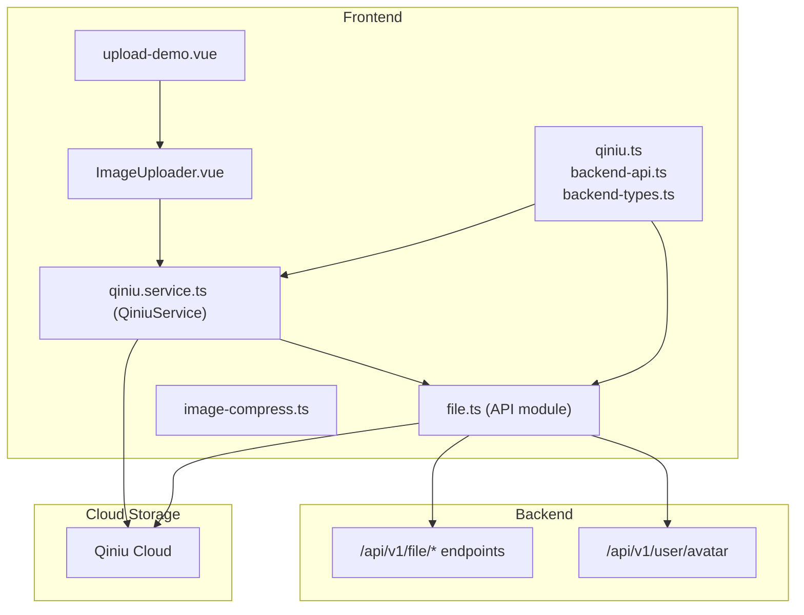
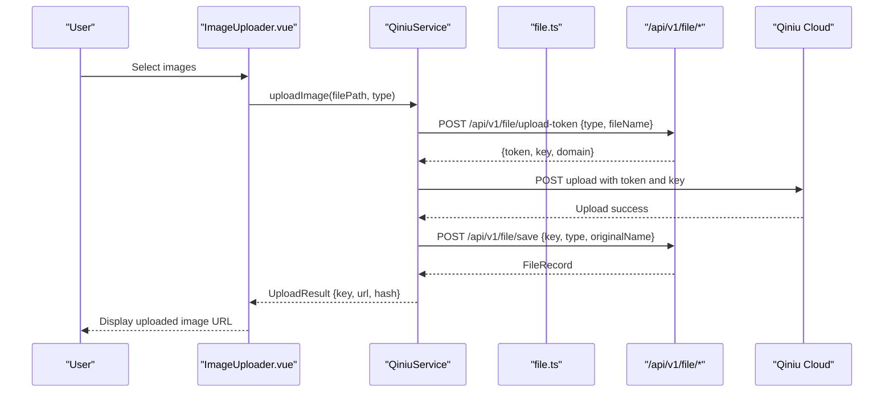
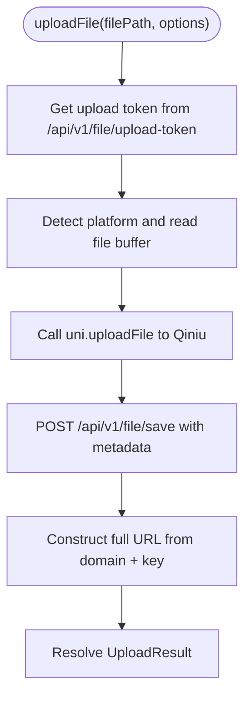
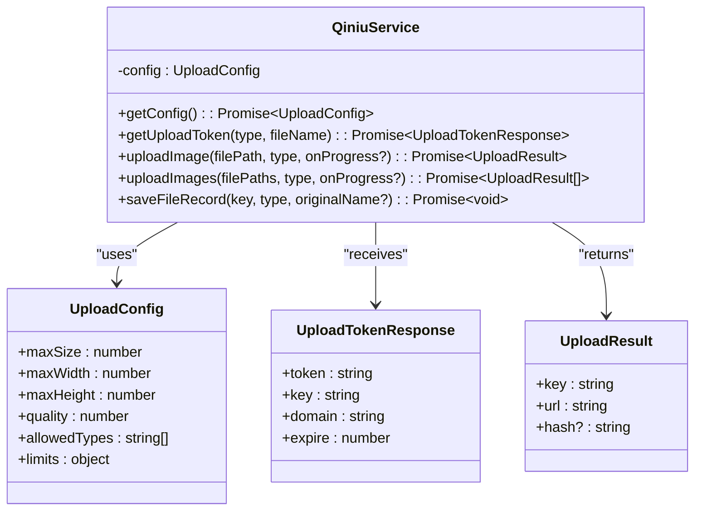
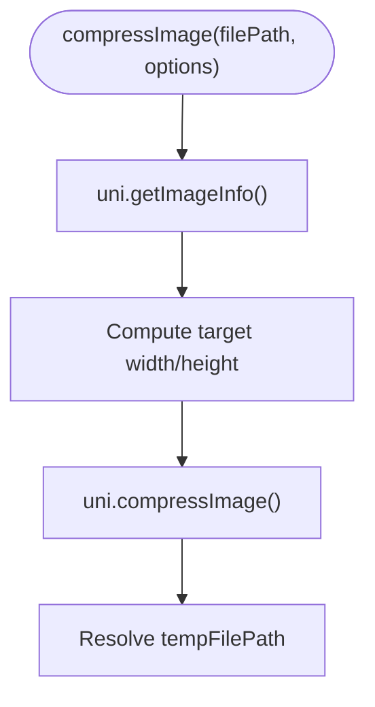
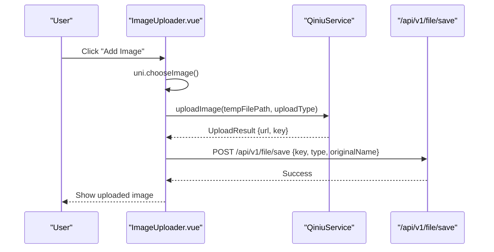
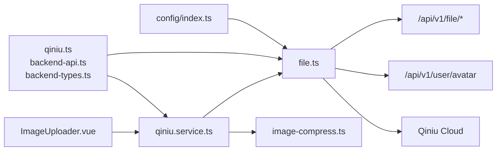

# File Upload & Media Module

<cite>
**Referenced Files in This Document**
- [file.ts](file://src/api/modules/file.ts)
- [qiniu.service.ts](file://src/services/qiniu.service.ts)
- [image-compress.ts](file://src/utils/image-compress.ts)
- [ImageUploader.vue](file://src/components/ImageUploader.vue)
- [upload-demo.vue](file://src/pages/examples/upload-demo.vue)
- [qiniu.ts](file://src/types/qiniu.ts)
- [backend-api.ts](file://src/types/api/backend-api.ts)
- [backend-types.ts](file://src/types/api/backend-types.ts)
- [API_FIX_REPORT.md](file://API_FIX_REPORT.md)
- [config/index.ts](file://src/config/index.ts)
</cite>

## Table of Contents
1. [Introduction](#introduction)
2. [Project Structure](#project-structure)
3. [Core Components](#core-components)
4. [Architecture Overview](#architecture-overview)
5. [Detailed Component Analysis](#detailed-component-analysis)
6. [Dependency Analysis](#dependency-analysis)
7. [Performance Considerations](#performance-considerations)
8. [Security Considerations](#security-considerations)
9. [Troubleshooting Guide](#troubleshooting-guide)
10. [Conclusion](#conclusion)

## Introduction
This document describes the file upload and media API module, focusing on how the frontend integrates with Qiniu Cloud for storage, manages upload tokens, optimizes images, and exposes endpoints for retrieving and managing uploaded media. It also outlines the current capabilities and highlights areas where advanced features (such as video/audio processing, thumbnails, and moderation) are not present in the current codebase.

## Project Structure
The file upload module spans several layers:
- API client module for file operations
- Qiniu service abstraction for upload orchestration
- Utility functions for image compression and validation
- Vue component for image selection and upload
- Example page demonstrating usage
- Type definitions for upload configuration, tokens, and backend contracts

**Diagram sources**
- [file.ts:1-335](file://src/api/modules/file.ts#L1-L335)
- [qiniu.service.ts:1-126](file://src/services/qiniu.service.ts#L1-L126)
- [image-compress.ts:1-87](file://src/utils/image-compress.ts#L1-L87)
- [ImageUploader.vue:1-242](file://src/components/ImageUploader.vue#L1-L242)
- [upload-demo.vue:1-100](file://src/pages/examples/upload-demo.vue#L1-L100)
- [qiniu.ts:1-38](file://src/types/qiniu.ts#L1-L38)
- [backend-api.ts:84-165](file://src/types/api/backend-api.ts#L84-L165)

**Section sources**
- [file.ts:1-335](file://src/api/modules/file.ts#L1-L335)
- [qiniu.service.ts:1-126](file://src/services/qiniu.service.ts#L1-L126)
- [image-compress.ts:1-87](file://src/utils/image-compress.ts#L1-L87)
- [ImageUploader.vue:1-242](file://src/components/ImageUploader.vue#L1-L242)
- [upload-demo.vue:1-100](file://src/pages/examples/upload-demo.vue#L1-L100)
- [qiniu.ts:1-38](file://src/types/qiniu.ts#L1-L38)
- [backend-api.ts:84-165](file://src/types/api/backend-api.ts#L84-L165)

## Core Components
- File API module: Provides functions to obtain upload configuration, request upload tokens, upload files, save records, and manage files.
- Qiniu service: Encapsulates upload configuration retrieval, token acquisition, image compression, and upload execution.
- Image compression utilities: Validates file size and compresses images before upload.
- ImageUploader component: UI for selecting images, uploading via Qiniu, tracking progress, and saving records.
- Backend type contracts: Define DTOs and response shapes for upload token, file record, and related endpoints.

Key capabilities currently implemented:
- Multipart uploads to Qiniu Cloud
- Image compression and resizing
- Upload token management via backend endpoints
- Saving file metadata to backend after successful upload
- Retrieving file URLs and lists

Not implemented in the current codebase:
- Video/audio processing
- Thumbnail generation
- CDN-specific transformations
- Metadata extraction beyond basic MIME/type
- Virus scanning or content moderation

**Section sources**
- [file.ts:38-334](file://src/api/modules/file.ts#L38-L334)
- [qiniu.service.ts:12-123](file://src/services/qiniu.service.ts#L12-L123)
- [image-compress.ts:10-86](file://src/utils/image-compress.ts#L10-L86)
- [ImageUploader.vue:32-152](file://src/components/ImageUploader.vue#L32-L152)
- [backend-types.ts:230-289](file://src/types/api/backend-types.ts#L230-L289)
- [backend-api.ts:87-165](file://src/types/api/backend-api.ts#L87-L165)

## Architecture Overview
The upload flow combines frontend orchestration with backend-managed Qiniu credentials and subsequent metadata persistence.

**Diagram sources**
- [qiniu.service.ts:29-87](file://src/services/qiniu.service.ts#L29-L87)
- [file.ts:259-278](file://src/api/modules/file.ts#L259-L278)
- [backend-api.ts:87-109](file://src/types/api/backend-api.ts#L87-L109)

## Detailed Component Analysis

### File API Module
Responsibilities:
- Retrieve upload configuration from backend
- Obtain upload tokens with type and filename hints
- Perform multipart uploads to Qiniu
- Save file records with metadata and return unified results
- Fetch file URLs and lists, and delete files

Implementation highlights:
- Environment-aware file reading for H5 and Mini Program contexts
- MIME type inference from file extensions and data URLs
- Unified URL construction using domain and key returned by backend
- Dedicated avatar upload flow with separate endpoint

**Diagram sources**
- [file.ts:90-230](file://src/api/modules/file.ts#L90-L230)

**Section sources**
- [file.ts:38-334](file://src/api/modules/file.ts#L38-L334)

### Qiniu Service
Responsibilities:
- Centralized upload configuration caching
- Token retrieval per upload type
- Image compression prior to upload
- Progress reporting and batch upload support
- Saving file records to backend

**Diagram sources**
- [qiniu.service.ts:12-123](file://src/services/qiniu.service.ts#L12-L123)
- [qiniu.ts:15-37](file://src/types/qiniu.ts#L15-L37)

**Section sources**
- [qiniu.service.ts:12-123](file://src/services/qiniu.service.ts#L12-L123)
- [qiniu.ts:1-38](file://src/types/qiniu.ts#L1-L38)

### Image Compression Utilities
Capabilities:
- Resize images while preserving aspect ratio
- Compress images with configurable quality
- Validate file size against configured limits
- Batch compression support

**Diagram sources**
- [image-compress.ts:10-49](file://src/utils/image-compress.ts#L10-L49)

**Section sources**
- [image-compress.ts:10-86](file://src/utils/image-compress.ts#L10-L86)

### ImageUploader Component
Responsibilities:
- Allow users to choose images from album or camera
- Upload images via QiniuService with progress tracking
- Save file records to backend
- Manage local state and emit updates

**Diagram sources**
- [ImageUploader.vue:78-131](file://src/components/ImageUploader.vue#L78-L131)
- [qiniu.service.ts:112-122](file://src/services/qiniu.service.ts#L112-L122)

**Section sources**
- [ImageUploader.vue:32-152](file://src/components/ImageUploader.vue#L32-L152)

### Backend Contracts and Endpoints
- Upload token endpoint: POST /api/v1/file/upload-token
- Save file record endpoint: POST /api/v1/file/save
- Get file URL endpoint: GET /api/v1/file/{id}/url
- Get file info endpoint: GET /api/v1/file/{id}
- List my files endpoint: GET /api/v1/file/my/list
- Delete file endpoint: DELETE /api/v1/file/{id}
- Avatar upload endpoint: POST /api/v1/user/avatar

These endpoints are consumed by the frontend APIs and types.

**Section sources**
- [backend-api.ts:87-165](file://src/types/api/backend-api.ts#L87-L165)
- [backend-types.ts:230-289](file://src/types/api/backend-types.ts#L230-L289)
- [API_FIX_REPORT.md:102-115](file://API_FIX_REPORT.md#L102-L115)

## Dependency Analysis
- ImageUploader depends on QiniuService for upload orchestration and on backend endpoints for saving records.
- QiniuService depends on:
  - API module for upload token and save operations
  - Image compression utilities for pre-processing
  - Backend types for type safety
- API module depends on:
  - Backend endpoints for configuration, tokens, and records
  - Qiniu Cloud for storage
- Configuration is centralized via API_CONFIG for base URLs.

**Diagram sources**
- [config/index.ts:1-11](file://src/config/index.ts#L1-L11)
- [file.ts:1-335](file://src/api/modules/file.ts#L1-L335)
- [qiniu.service.ts:1-126](file://src/services/qiniu.service.ts#L1-L126)
- [image-compress.ts:1-87](file://src/utils/image-compress.ts#L1-L87)
- [qiniu.ts:1-38](file://src/types/qiniu.ts#L1-L38)
- [backend-api.ts:84-165](file://src/types/api/backend-api.ts#L84-L165)

**Section sources**
- [config/index.ts:1-11](file://src/config/index.ts#L1-L11)
- [file.ts:1-335](file://src/api/modules/file.ts#L1-L335)
- [qiniu.service.ts:1-126](file://src/services/qiniu.service.ts#L1-L126)
- [image-compress.ts:1-87](file://src/utils/image-compress.ts#L1-L87)
- [qiniu.ts:1-38](file://src/types/qiniu.ts#L1-L38)
- [backend-api.ts:84-165](file://src/types/api/backend-api.ts#L84-L165)

## Performance Considerations
- Image compression reduces payload size and speeds up uploads, especially on mobile networks.
- Batch uploads are supported via sequential calls; parallelization could improve throughput for multiple images.
- Caching upload configuration locally avoids redundant requests.
- Progress callbacks enable responsive UI feedback during uploads.

[No sources needed since this section provides general guidance]

## Security Considerations
- Upload tokens are generated server-side and bound to a specific key and domain, limiting exposure windows.
- File size validation prevents oversized uploads.
- Backend endpoints enforce authentication and authorization; the request wrapper adds Authorization headers automatically.
- The project includes security headers in deployment configurations (e.g., HSTS, X-Content-Type-Options), which help secure the application boundary.

[No sources needed since this section provides general guidance]

## Troubleshooting Guide
Common issues and resolutions:
- Platform detection failures: Ensure the correct file path format is passed (blob:, data:, or local path). The API module logs platform detection for debugging.
- Upload failures: Verify network connectivity and that the upload token is still valid. The service throws descriptive errors on failure.
- File size exceeded: Validate against the configured maxSize before attempting upload.
- Avatar upload errors: Confirm the dedicated endpoint is used and that the backend responds with a URL.

**Section sources**
- [file.ts:112-159](file://src/api/modules/file.ts#L112-L159)
- [qiniu.service.ts:49-52](file://src/services/qiniu.service.ts#L49-L52)
- [image-compress.ts:80-86](file://src/utils/image-compress.ts#L80-L86)

## Conclusion
The file upload and media module provides a robust foundation for image uploads to Qiniu Cloud with token-based security, client-side compression, and backend-backed metadata persistence. While advanced features such as video/audio processing, thumbnail generation, CDN transformations, and integrated content moderation are not present in the current codebase, the modular design allows for incremental enhancements to support these capabilities.