# Friend Management Module

<cite>
**Referenced Files in This Document**
- [friend.ts](file://src/api/modules/friend.ts)
- [friend.ts](file://src/stores/friend.ts)
- [list.vue](file://src/pages/friend/list.vue)
- [blacklist.vue](file://src/pages/friend/blacklist.vue)
- [followers.vue](file://src/pages/friend/followers.vue)
- [following.vue](file://src/pages/friend/following.vue)
- [backend-types.ts](file://src/types/api/backend-types.ts)
- [privacy.vue](file://src/pages/profile/privacy.vue)
- [user.ts](file://src/api/modules/user.ts)
- [useNPS.ts](file://src/composables/useNPS.ts)
- [config.ts](file://src/api/modules/config.ts)
</cite>

## Table of Contents
1. [Introduction](#introduction)
2. [Project Structure](#project-structure)
3. [Core Components](#core-components)
4. [Architecture Overview](#architecture-overview)
5. [Detailed Component Analysis](#detailed-component-analysis)
6. [Dependency Analysis](#dependency-analysis)
7. [Performance Considerations](#performance-considerations)
8. [Troubleshooting Guide](#troubleshooting-guide)
9. [Conclusion](#conclusion)
10. [Appendices](#appendices)

## Introduction
This document describes the Friend Management Module, covering friend-related endpoints, social graph operations, privacy controls, and client-side state management. It explains friend list retrieval, following/unfollowing, friend requests and acceptance, blocking/unblocking, friendship status checks, and how the frontend synchronizes friend state. It also documents privacy settings for friend visibility, search, and blacklist management, along with real-time-like behaviors via optimistic updates and local state synchronization.

## Project Structure
The module spans three layers:
- API layer: typed HTTP clients for friend operations
- Store layer: Pinia store for caching lists and orchestrating operations
- Page layer: Vue pages implementing UI flows for friend lists, followers, following, blacklist, and privacy

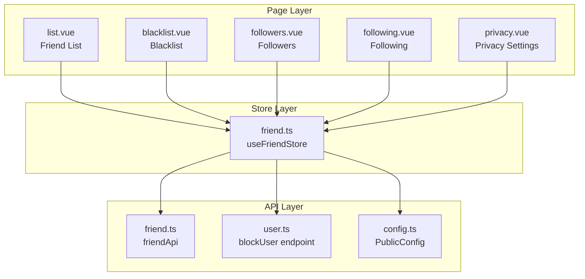

**Diagram sources**
- [friend.ts:16-61](file://src/api/modules/friend.ts#L16-L61)
- [friend.ts:7-69](file://src/stores/friend.ts#L7-L69)
- [list.vue:26-129](file://src/pages/friend/list.vue#L26-L129)
- [blacklist.vue:37-103](file://src/pages/friend/blacklist.vue#L37-L103)
- [followers.vue:25-117](file://src/pages/friend/followers.vue#L25-L117)
- [following.vue:25-99](file://src/pages/friend/following.vue#L25-L99)
- [privacy.vue:108-312](file://src/pages/profile/privacy.vue#L108-L312)
- [user.ts:92-100](file://src/api/modules/user.ts#L92-L100)
- [config.ts:1-32](file://src/api/modules/config.ts#L1-L32)

**Section sources**
- [friend.ts:16-61](file://src/api/modules/friend.ts#L16-L61)
- [friend.ts:7-69](file://src/stores/friend.ts#L7-L69)
- [list.vue:26-129](file://src/pages/friend/list.vue#L26-L129)
- [blacklist.vue:37-103](file://src/pages/friend/blacklist.vue#L37-L103)
- [followers.vue:25-117](file://src/pages/friend/followers.vue#L25-L117)
- [following.vue:25-99](file://src/pages/friend/following.vue#L25-L99)
- [privacy.vue:108-312](file://src/pages/profile/privacy.vue#L108-L312)
- [user.ts:92-100](file://src/api/modules/user.ts#L92-L100)
- [config.ts:1-32](file://src/api/modules/config.ts#L1-L32)

## Core Components
- API client for friend operations: exposes endpoints for friend list, following/followers, friend requests, acceptance, adding friends, friendship status, deletion, blocking, unblocking, and blocklist retrieval.
- Pinia store: caches friend lists, following/followers, and blocklist; orchestrates optimistic UI updates and re-fetches after mutations.
- Pages: implement user flows for friend list, followers, following, blacklist, and privacy settings.

Key capabilities:
- Retrieve friend list and following/followers for self or others
- Follow/unfollow with optimistic UI updates
- Request/accept friend connections
- Add friend with points consumption
- Check friendship status (including chat unlock conditions)
- Block/unblock users and manage blacklist
- Privacy controls for visibility and permissions

**Section sources**
- [friend.ts:16-61](file://src/api/modules/friend.ts#L16-L61)
- [friend.ts:7-69](file://src/stores/friend.ts#L7-L69)
- [backend-types.ts:294-339](file://src/types/api/backend-types.ts#L294-L339)

## Architecture Overview
The module follows a layered architecture:
- API layer defines strongly typed endpoints and response shapes
- Store layer centralizes state and side effects
- Page layer renders UI and triggers actions

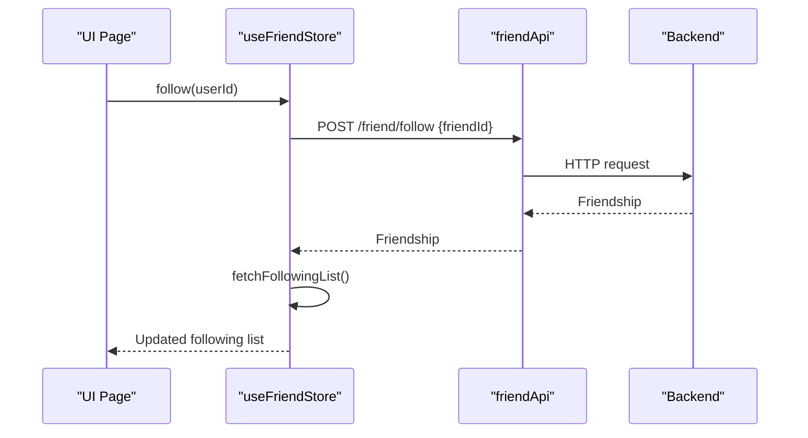

**Diagram sources**
- [friend.ts:29-35](file://src/stores/friend.ts#L29-L35)
- [friend.ts:32-36](file://src/api/modules/friend.ts#L32-L36)

**Section sources**
- [friend.ts:29-35](file://src/stores/friend.ts#L29-L35)
- [friend.ts:32-36](file://src/api/modules/friend.ts#L32-L36)

## Detailed Component Analysis

### API Layer: Friend Endpoints
The API module exports a typed client for friend operations:
- List retrieval: own friend list, following, followers, and per-user variants
- Social actions: follow, unfollow, friend request, accept, add friend
- Status and moderation: friendship status, delete friend, block, unblock, blocklist
- Data models: Friendship, UserBlacklist, and FriendshipStatus

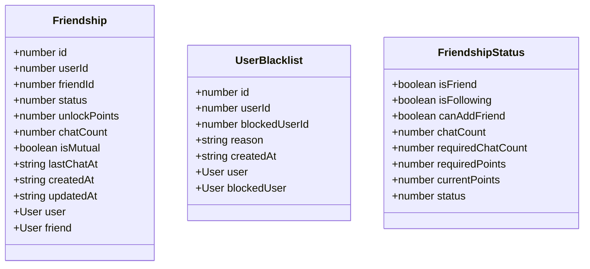

**Diagram sources**
- [backend-types.ts:294-339](file://src/types/api/backend-types.ts#L294-L339)

**Section sources**
- [friend.ts:16-61](file://src/api/modules/friend.ts#L16-L61)
- [backend-types.ts:294-339](file://src/types/api/backend-types.ts#L294-L339)

### Store Layer: State and Side Effects
The Pinia store manages:
- Reactive lists: friendList, followingList, blocklist
- Fetchers: retrieve lists from API
- Actions: follow/unfollow, delete friend, block/unblock, unlock chat
- Optimistic updates: UI reflects immediate state while syncing with server

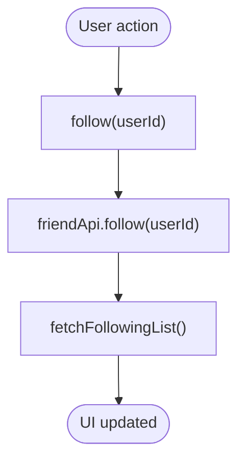

**Diagram sources**
- [friend.ts:29-35](file://src/stores/friend.ts#L29-L35)

**Section sources**
- [friend.ts:7-69](file://src/stores/friend.ts#L7-L69)

### Friend List Page
Implements:
- Loading and empty states
- Navigation to chat with unlock checks
- Delete friend flow with confirmation

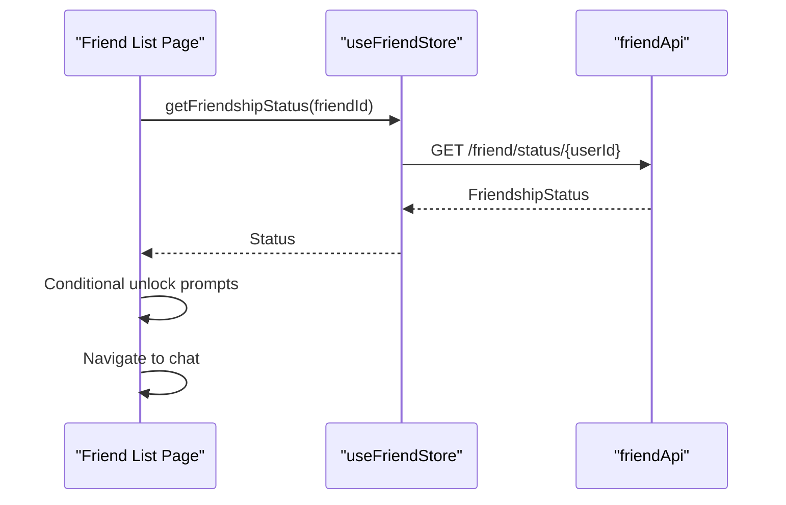

**Diagram sources**
- [list.vue:59-109](file://src/pages/friend/list.vue#L59-L109)
- [friend.ts:47-48](file://src/api/modules/friend.ts#L47-L48)

**Section sources**
- [list.vue:26-129](file://src/pages/friend/list.vue#L26-L129)

### Followers/Following Pages
Implements:
- Self vs. public views
- Optimistic follow/unfollow toggles
- Navigation to user detail

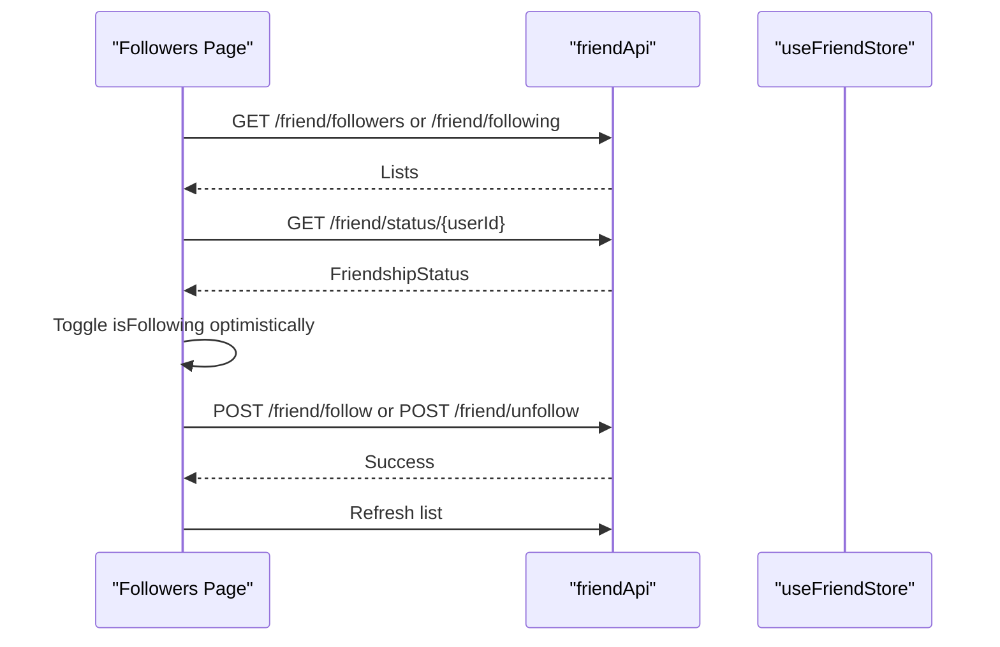

**Diagram sources**
- [followers.vue:47-79](file://src/pages/friend/followers.vue#L47-L79)
- [friend.ts:26-30](file://src/api/modules/friend.ts#L26-L30)
- [friend.ts:47-48](file://src/api/modules/friend.ts#L47-L48)
- [friend.ts:32-36](file://src/api/modules/friend.ts#L32-L36)

**Section sources**
- [followers.vue:25-117](file://src/pages/friend/followers.vue#L25-L117)
- [following.vue:25-99](file://src/pages/friend/following.vue#L25-L99)

### Blacklist Page
Implements:
- Load blocklist
- Unblocking with confirmation and refresh

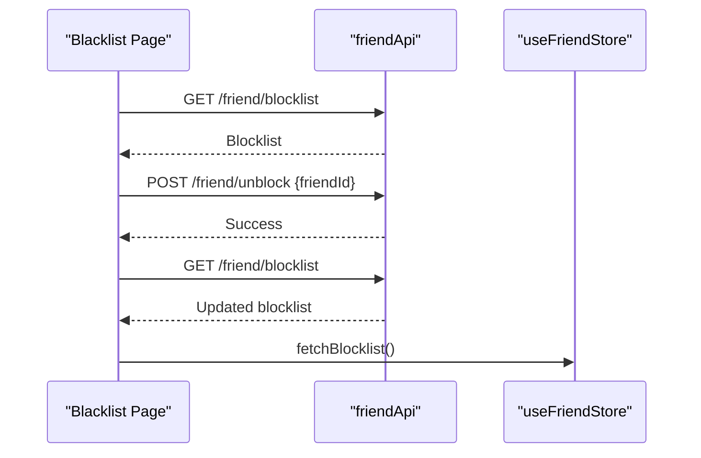

**Diagram sources**
- [blacklist.vue:52-67](file://src/pages/friend/blacklist.vue#L52-L67)
- [blacklist.vue:79-91](file://src/pages/friend/blacklist.vue#L79-L91)
- [friend.ts:59-60](file://src/api/modules/friend.ts#L59-L60)
- [friend.ts:56-57](file://src/api/modules/friend.ts#L56-L57)

**Section sources**
- [blacklist.vue:37-103](file://src/pages/friend/blacklist.vue#L37-L103)
- [friend.ts:53-60](file://src/api/modules/friend.ts#L53-L60)

### Privacy Settings and Search Controls
Privacy settings include:
- Visibility levels for personal info, contacts, photos, location
- Permissions for searchability, recommendation, stranger messages, certified-only interactions
- Blacklist management within privacy settings

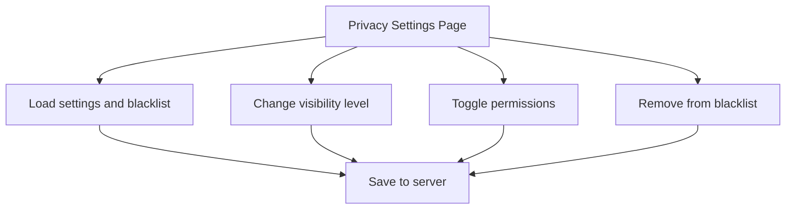

**Diagram sources**
- [privacy.vue:280-305](file://src/pages/profile/privacy.vue#L280-L305)
- [privacy.vue:198-228](file://src/pages/profile/privacy.vue#L198-L228)
- [privacy.vue:250-277](file://src/pages/profile/privacy.vue#L250-L277)

**Section sources**
- [privacy.vue:108-312](file://src/pages/profile/privacy.vue#L108-L312)

### Real-time Friend Status Updates and Notifications
- Optimistic UI updates for follow/unfollow and add-friend actions
- After-add-friend NPS trigger to encourage feedback
- Chat unlock gating via friendship status checks before navigation

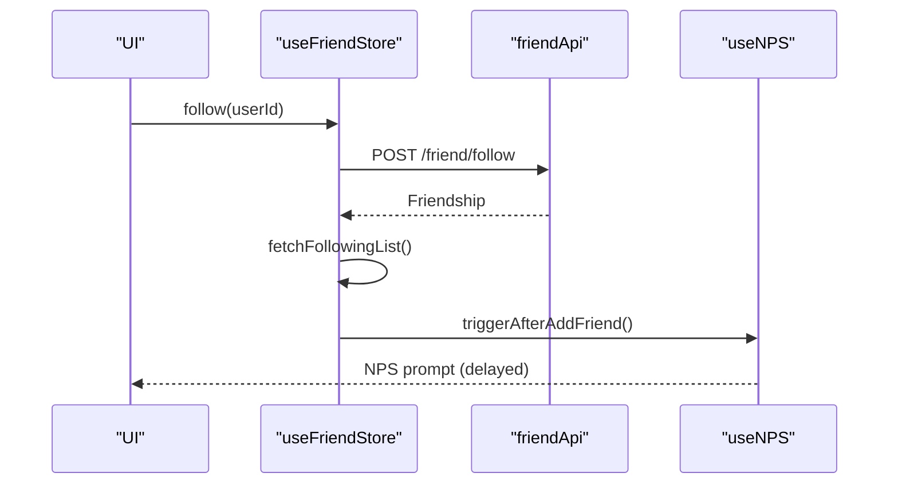

**Diagram sources**
- [friend.ts:29-35](file://src/stores/friend.ts#L29-L35)
- [useNPS.ts:127-133](file://src/composables/useNPS.ts#L127-L133)

**Section sources**
- [friend.ts:29-35](file://src/stores/friend.ts#L29-L35)
- [useNPS.ts:127-133](file://src/composables/useNPS.ts#L127-L133)
- [list.vue:59-109](file://src/pages/friend/list.vue#L59-L109)

### Social Graph Management and Mutual Friend Calculations
- Friendship model includes mutual flag and timestamps
- Followers/Following lists support self vs. public views
- Mutual friend computations are not implemented in the frontend; backend likely computes mutuals server-side

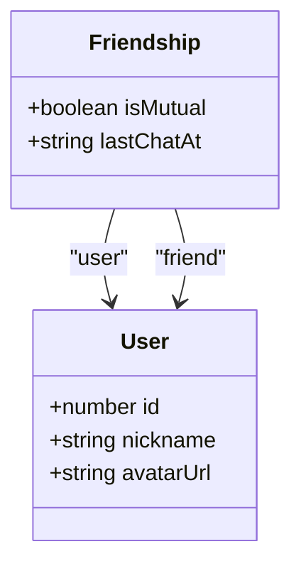

**Diagram sources**
- [backend-types.ts:294-319](file://src/types/api/backend-types.ts#L294-L319)

**Section sources**
- [backend-types.ts:294-319](file://src/types/api/backend-types.ts#L294-L319)
- [followers.vue:62-69](file://src/pages/friend/followers.vue#L62-L69)
- [following.vue:54-63](file://src/pages/friend/following.vue#L54-L63)

### Friend Request, Acceptance, and Blocking Workflows
- Request/accept: friend request and accept endpoints
- Add friend: consumes points and returns consumed amount
- Block/unblock: maintains blacklist and refreshes local state

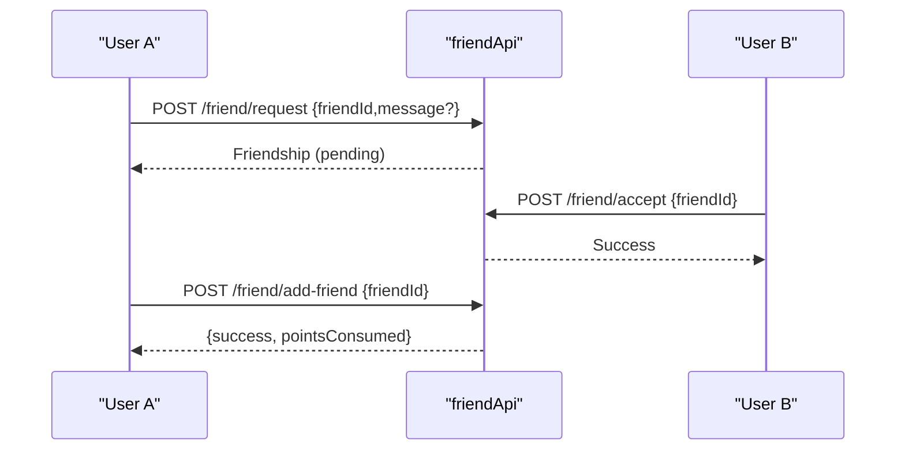

**Diagram sources**
- [friend.ts:38-45](file://src/api/modules/friend.ts#L38-L45)

**Section sources**
- [friend.ts:38-45](file://src/api/modules/friend.ts#L38-L45)

### Search Functionality and Privacy Controls
- Allow/Disallow being searched and recommended
- Stranger messaging and certified-user-only modes
- Blacklist management integrated into privacy settings

**Section sources**
- [privacy.vue:168-173](file://src/pages/profile/privacy.vue#L168-L173)
- [privacy.vue:60-91](file://src/pages/profile/privacy.vue#L60-L91)

### Bulk Operations
- No explicit bulk endpoints observed in the API module
- UI supports single-item actions (follow, unfollow, delete, unblock)

**Section sources**
- [friend.ts:16-61](file://src/api/modules/friend.ts#L16-L61)
- [followers.vue:81-117](file://src/pages/friend/followers.vue#L81-L117)
- [following.vue:75-99](file://src/pages/friend/following.vue#L75-L99)
- [blacklist.vue:69-103](file://src/pages/friend/blacklist.vue#L69-L103)

### Analytics, Activity Tracking, and Spam Prevention
- No dedicated analytics or activity tracking endpoints found in the friend module
- NPS integration exists for engagement timing after add-friend
- Privacy settings mitigate spam via stranger messaging controls and blacklist

**Section sources**
- [useNPS.ts:127-133](file://src/composables/useNPS.ts#L127-L133)
- [privacy.vue:168-173](file://src/pages/profile/privacy.vue#L168-L173)

## Dependency Analysis
- Pages depend on the store for state and actions
- Store depends on the friend API client
- Privacy settings integrate with friend blocklist and user privacy endpoints
- Config module exposes public configurations (e.g., friend limits, unlock points)

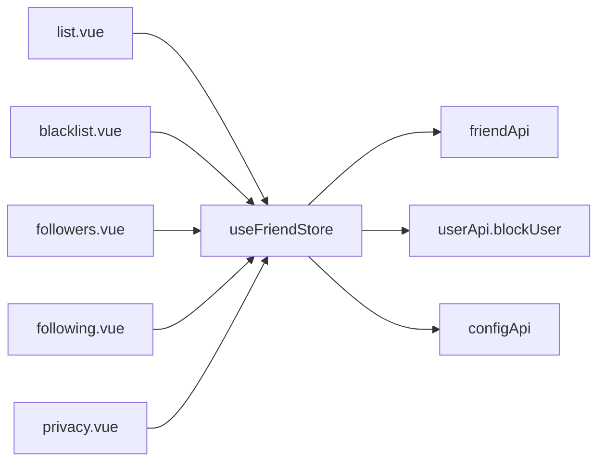

**Diagram sources**
- [list.vue:33-57](file://src/pages/friend/list.vue#L33-L57)
- [blacklist.vue:44-67](file://src/pages/friend/blacklist.vue#L44-L67)
- [followers.vue:32-79](file://src/pages/friend/followers.vue#L32-L79)
- [following.vue:32-73](file://src/pages/friend/following.vue#L32-L73)
- [privacy.vue:108-305](file://src/pages/profile/privacy.vue#L108-L305)
- [friend.ts:3-5](file://src/stores/friend.ts#L3-L5)
- [user.ts:92-100](file://src/api/modules/user.ts#L92-L100)
- [config.ts:29-32](file://src/api/modules/config.ts#L29-L32)

**Section sources**
- [friend.ts:3-5](file://src/stores/friend.ts#L3-L5)
- [user.ts:92-100](file://src/api/modules/user.ts#L92-L100)
- [config.ts:29-32](file://src/api/modules/config.ts#L29-L32)

## Performance Considerations
- Prefer optimistic updates for immediate feedback during follow/unfollow/add-friend
- Batch refreshes: fetch lists after mutations to keep UI consistent
- Use pagination-friendly endpoints if lists grow large (not shown in current API)
- Cache frequently accessed friendship status to reduce network calls

## Troubleshooting Guide
Common issues and resolutions:
- Follow fails: verify network connectivity and retry; ensure user is not blocked
- Cannot chat: check friendship status for chat count and points thresholds
- Unfollow stuck: confirm server response and refresh following list
- Unblock not reflected: reload blocklist and ensure store sync

**Section sources**
- [list.vue:59-109](file://src/pages/friend/list.vue#L59-L109)
- [followers.vue:95-116](file://src/pages/friend/followers.vue#L95-L116)
- [blacklist.vue:79-103](file://src/pages/friend/blacklist.vue#L79-L103)

## Conclusion
The Friend Management Module provides a cohesive set of APIs and UI flows for managing social connections, privacy, and moderation. It leverages optimistic updates, local state caching, and privacy controls to deliver responsive interactions. While advanced features like mutual friend computation and analytics are not present in the current code, the foundation is extensible for future enhancements.

## Appendices
- Endpoint summary and data models are defined in the API and type files
- Privacy settings and blacklist management are integrated into the profile privacy page

**Section sources**
- [backend-types.ts:294-339](file://src/types/api/backend-types.ts#L294-L339)
- [privacy.vue:108-312](file://src/pages/profile/privacy.vue#L108-L312)