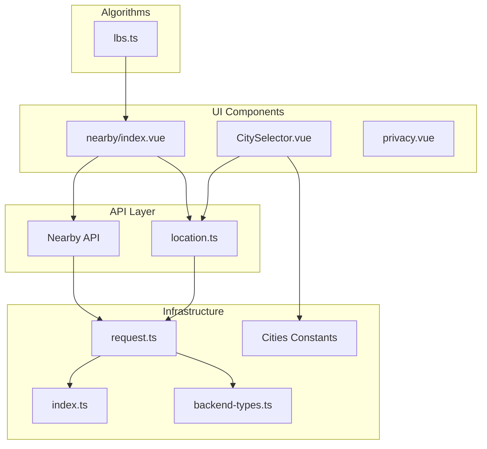
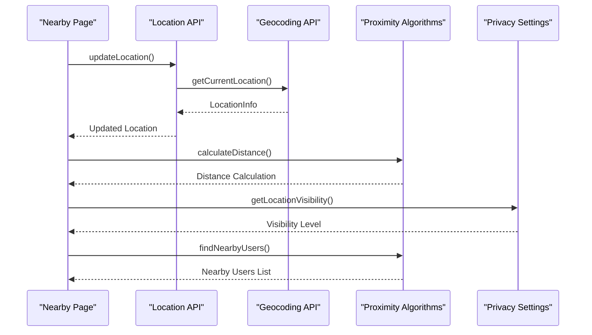
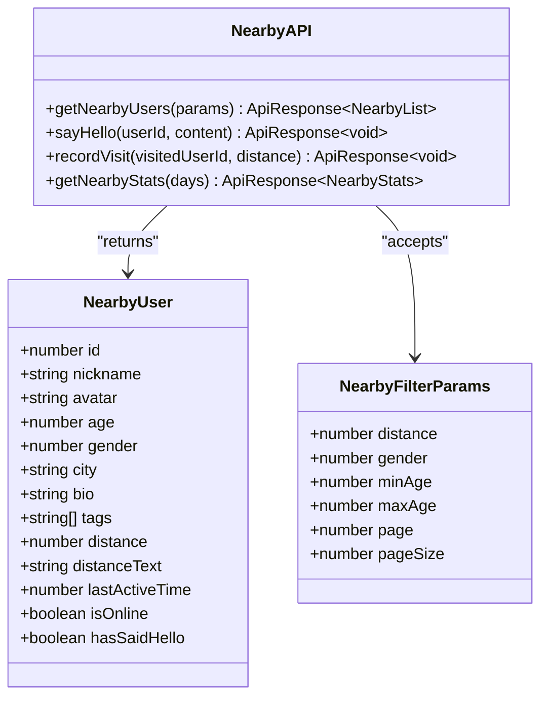
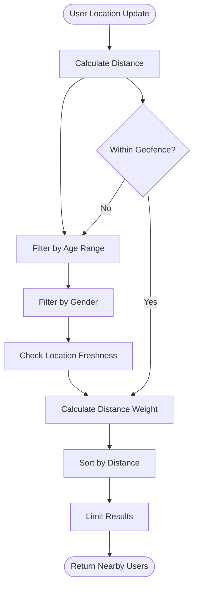
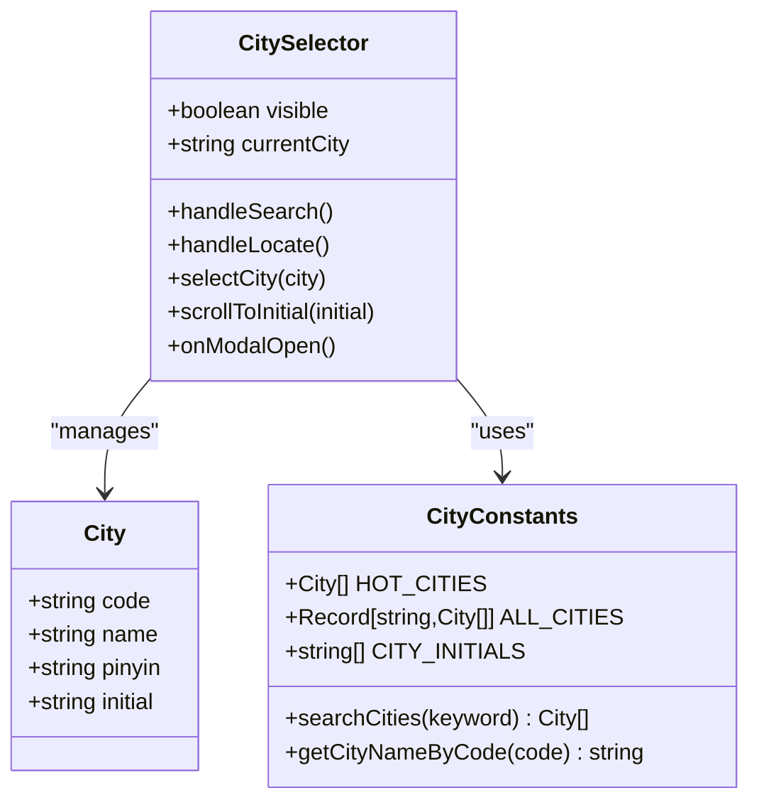
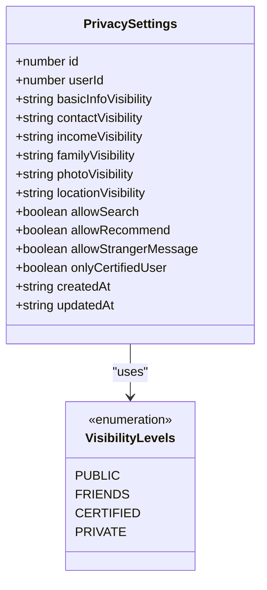
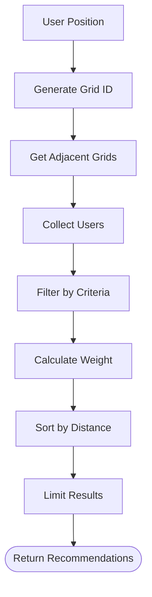
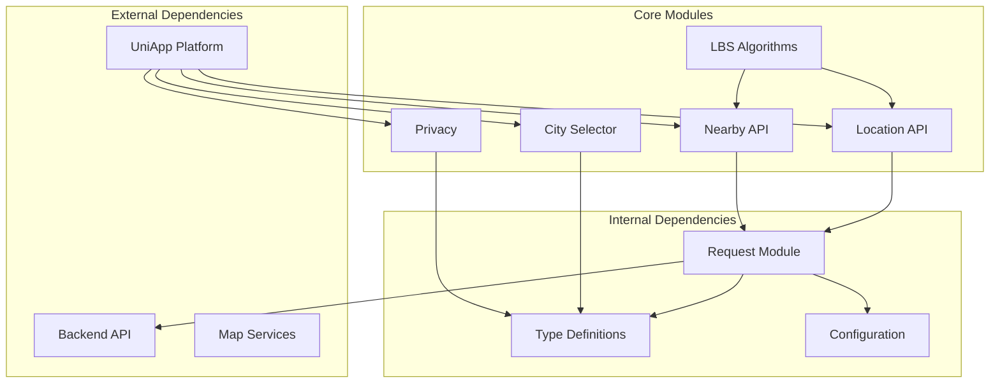
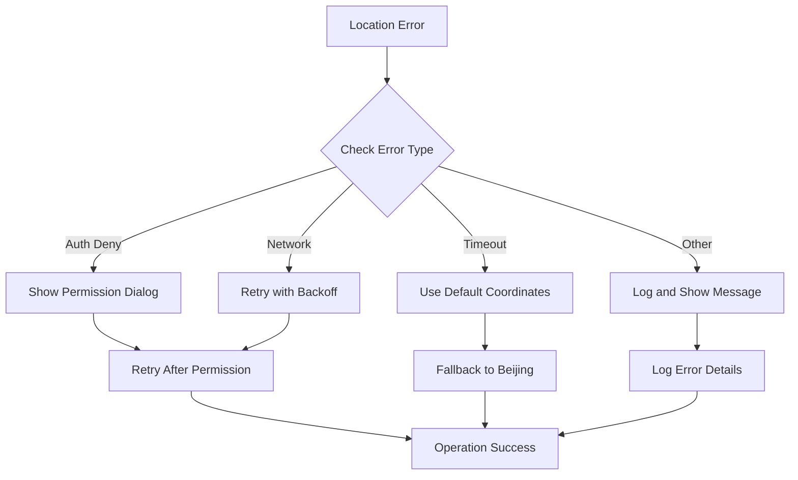

# Location & Geolocation Module

<cite>
**Referenced Files in This Document**
- [location.ts](file://src/api/modules/location.ts)
- [nearby.ts](file://src/api/modules/nearby.ts)
- [lbs.ts](file://src/pages/tabbar/home/algorithms/lbs.ts)
- [CitySelector.vue](file://src/components/business/CitySelector.vue)
- [cities.ts](file://src/constants/cities.ts)
- [index.vue](file://src/pages/nearby/index.vue)
- [privacy.vue](file://src/pages/profile/privacy.vue)
- [request.ts](file://src/api/request.ts)
- [backend-types.ts](file://src/types/api/backend-types.ts)
- [index.ts](file://src/config/index.ts)
</cite>

## Table of Contents
1. [Introduction](#introduction)
2. [Project Structure](#project-structure)
3. [Core Components](#core-components)
4. [Architecture Overview](#architecture-overview)
5. [Detailed Component Analysis](#detailed-component-analysis)
6. [Dependency Analysis](#dependency-analysis)
7. [Performance Considerations](#performance-considerations)
8. [Troubleshooting Guide](#troubleshooting-guide)
9. [Conclusion](#conclusion)

## Introduction
This document provides comprehensive documentation for the location and geolocation API module. It covers user location updates, nearby user discovery, location-based filtering, geofencing capabilities, distance calculations, proximity matching algorithms, city selection system, GPS coordinate handling, location privacy controls, location analytics, user density mapping, and location-based recommendations. It also addresses accuracy handling, battery optimization, and location permission management.

## Project Structure
The location and geolocation functionality is organized across several key areas:
- API modules for location and nearby user operations
- Algorithm implementations for distance calculation, geofencing, and proximity matching
- City selection UI component with geocoding support
- Privacy settings for location visibility controls
- Request infrastructure with token refresh and error handling
- Backend type definitions for API contracts



**Diagram sources**
- [location.ts:1-79](file://src/api/modules/location.ts#L1-L79)
- [nearby.ts:1-82](file://src/api/modules/nearby.ts#L1-L82)
- [lbs.ts:1-380](file://src/pages/tabbar/home/algorithms/lbs.ts#L1-L380)
- [CitySelector.vue:1-521](file://src/components/business/CitySelector.vue#L1-L521)
- [index.vue:1-712](file://src/pages/nearby/index.vue#L1-L712)
- [privacy.vue:1-494](file://src/pages/profile/privacy.vue#L1-L494)
- [request.ts:1-228](file://src/api/request.ts#L1-L228)
- [index.ts:1-11](file://src/config/index.ts#L1-L11)
- [cities.ts:1-186](file://src/constants/cities.ts#L1-L186)
- [backend-types.ts:1-764](file://src/types/api/backend-types.ts#L1-L764)

**Section sources**
- [location.ts:1-79](file://src/api/modules/location.ts#L1-L79)
- [nearby.ts:1-82](file://src/api/modules/nearby.ts#L1-L82)
- [lbs.ts:1-380](file://src/pages/tabbar/home/algorithms/lbs.ts#L1-L380)
- [CitySelector.vue:1-521](file://src/components/business/CitySelector.vue#L1-L521)
- [index.vue:1-712](file://src/pages/nearby/index.vue#L1-L712)
- [privacy.vue:1-494](file://src/pages/profile/privacy.vue#L1-L494)
- [request.ts:1-228](file://src/api/request.ts#L1-L228)
- [index.ts:1-11](file://src/config/index.ts#L1-L11)
- [cities.ts:1-186](file://src/constants/cities.ts#L1-L186)
- [backend-types.ts:1-764](file://src/types/api/backend-types.ts#L1-L764)

## Core Components
The location and geolocation module consists of several core components that work together to provide comprehensive location-based functionality:

### Location Management API
The location module provides essential location operations including user location updates, current location retrieval, geocoding, city selection persistence, and location visibility controls.

### Nearby Discovery System
The nearby module enables users to discover other users in proximity with filtering capabilities, greeting functionality, and visit tracking.

### Proximity Matching Algorithms
Advanced algorithms handle distance calculations, geofencing detection, grid-based spatial indexing, and user density mapping for efficient location-based recommendations.

### City Selection Interface
A comprehensive city selector component with geocoding integration, search functionality, and automatic location detection.

### Privacy Controls
Granular privacy settings for controlling who can see user location information and managing interaction permissions.

**Section sources**
- [location.ts:28-79](file://src/api/modules/location.ts#L28-L79)
- [nearby.ts:37-82](file://src/api/modules/nearby.ts#L37-L82)
- [lbs.ts:31-176](file://src/pages/tabbar/home/algorithms/lbs.ts#L31-L176)
- [CitySelector.vue:118-264](file://src/components/business/CitySelector.vue#L118-L264)
- [privacy.vue:120-173](file://src/pages/profile/privacy.vue#L120-L173)

## Architecture Overview
The location and geolocation system follows a layered architecture with clear separation of concerns:



**Diagram sources**
- [index.vue:213-244](file://src/pages/nearby/index.vue#L213-L244)
- [location.ts:32-42](file://src/api/modules/location.ts#L32-L42)
- [lbs.ts:39-53](file://src/pages/tabbar/home/algorithms/lbs.ts#L39-L53)
- [privacy.vue:129](file://src/pages/profile/privacy.vue#L129)

The architecture implements several key design patterns:
- **Module Pattern**: Clean separation of location, nearby, and algorithm modules
- **Factory Pattern**: Dynamic location initialization with fallback mechanisms
- **Observer Pattern**: Real-time location updates and privacy setting changes
- **Strategy Pattern**: Configurable distance calculation and proximity matching algorithms

## Detailed Component Analysis

### Location Management System
The location management system provides comprehensive location handling capabilities:

#### Core Location Operations
- **Update Location**: Sends GPS coordinates to server with city information
- **Get Current Location**: Retrieves user's current location from server
- **Geocoding**: Converts coordinates to human-readable location information
- **City Persistence**: Saves user-selected city preferences
- **Visibility Control**: Manages location visibility settings

```mermaid
classDiagram
class LocationAPI {
+updateLocation(params) ApiResponse~LocationInfo~
+getCurrentLocation() ApiResponse~LocationInfo~
+getCityByCoordinates(params) ApiResponse~LocationInfo~
+saveUserCity(cityId) ApiResponse~void~
+getUserCity() ApiResponse~{city : string}~
+setLocationVisibility(isVisible) ApiResponse~void~
}
class LocationInfo {
+number latitude
+number longitude
+string city
+string province
+string district
+string address
}
class UpdateLocationParams {
+number latitude
+number longitude
+string city
+string province
+string district
+string address
}
LocationAPI --> LocationInfo : "returns"
LocationAPI --> UpdateLocationParams : "accepts"
```

**Diagram sources**
- [location.ts:7-26](file://src/api/modules/location.ts#L7-L26)
- [location.ts:32-78](file://src/api/modules/location.ts#L32-L78)

#### GPS Coordinate Handling
The system handles GPS coordinates with proper validation and conversion:
- Uses GCJ-02 coordinate system for Chinese localization
- Validates coordinate ranges (-90 to 90 for latitude, -180 to 180 for longitude)
- Supports both manual coordinate input and automatic device location detection

**Section sources**
- [location.ts:19-26](file://src/api/modules/location.ts#L19-L26)
- [location.ts:32-53](file://src/api/modules/location.ts#L32-L53)

### Nearby Discovery System
The nearby discovery system enables users to find and interact with nearby users:

#### Nearby User Operations
- **Get Nearby Users**: Fetches users within specified distance range
- **Filtering**: Supports distance, gender, and age-based filtering
- **Greeting**: Allows users to initiate conversations
- **Visit Tracking**: Records user interactions and distances



**Diagram sources**
- [nearby.ts:7-35](file://src/api/modules/nearby.ts#L7-L35)
- [nearby.ts:41-82](file://src/api/modules/nearby.ts#L41-L82)

#### Proximity Matching Algorithm
The system implements sophisticated proximity matching using multiple criteria:



**Diagram sources**
- [lbs.ts:95-158](file://src/pages/tabbar/home/algorithms/lbs.ts#L95-L158)
- [lbs.ts:169-176](file://src/pages/tabbar/home/algorithms/lbs.ts#L169-L176)

**Section sources**
- [nearby.ts:28-49](file://src/api/modules/nearby.ts#L28-L49)
- [lbs.ts:95-158](file://src/pages/tabbar/home/algorithms/lbs.ts#L95-L158)

### Geofencing and Distance Calculation
The system provides robust geofencing capabilities and accurate distance calculations:

#### Distance Calculation Methods
- **Haversine Formula**: Calculates great-circle distance between two points
- **Geographic Coordinates**: Handles spherical Earth approximation
- **Unit Conversion**: Supports kilometers and meters
- **Precision Handling**: Manages floating-point precision issues

#### Geofencing Implementation
- **Boundary Detection**: Determines if users are within specified geographic boundaries
- **Radius-Based Filtering**: Supports circular area restrictions
- **Real-Time Monitoring**: Continuously checks user positions against geofences

```mermaid
flowchart TD
Input[User Position] --> Convert[Convert to Radians]
Convert --> DeltaLat[Calculate Latitude Difference]
Convert --> DeltaLon[Calculate Longitude Difference]
DeltaLat --> SinCalc[Calculate sin²(Δlat/2)]
DeltaLon --> CosCalc[Calculate cos(lat1) × cos(lat2)]
SinCalc --> Haversine[Apply Haversine Formula]
CosCalc --> Haversine
Haversine --> Distance[Calculate Distance]
Distance --> Output[Return Distance in km]
```

**Diagram sources**
- [lbs.ts:39-53](file://src/pages/tabbar/home/algorithms/lbs.ts#L39-L53)

**Section sources**
- [lbs.ts:39-53](file://src/pages/tabbar/home/algorithms/lbs.ts#L39-L53)
- [lbs.ts:169-176](file://src/pages/tabbar/home/algorithms/lbs.ts#L169-L176)

### City Selection System
The city selection system provides comprehensive location management:

#### City Selector Features
- **Automatic Location Detection**: Uses device GPS to detect current city
- **Search Functionality**: Allows users to search for cities by name or pinyin
- **Popular Cities**: Displays frequently used cities for quick selection
- **Geographic Indexing**: Organizes cities by alphabetical order
- **Geocoding Integration**: Converts coordinates to city names



**Diagram sources**
- [CitySelector.vue:124-264](file://src/components/business/CitySelector.vue#L124-L264)
- [cities.ts:8-186](file://src/constants/cities.ts#L8-L186)

#### City Data Management
- **Hot Cities**: Predefined popular cities for quick access
- **Complete City List**: Comprehensive database of all supported cities
- **Search Optimization**: Efficient search algorithms for city names and pinyin
- **Geographic Grouping**: Cities organized by initial letter for navigation

**Section sources**
- [CitySelector.vue:149-229](file://src/components/business/CitySelector.vue#L149-L229)
- [cities.ts:138-186](file://src/constants/cities.ts#L138-L186)

### Location Privacy Controls
The privacy system provides granular control over location sharing:

#### Privacy Setting Categories
- **Information Visibility**: Controls who can see personal information including location
- **Interaction Permissions**: Manages who can interact with the user
- **Blacklist Management**: Allows users to block unwanted interactions
- **Visibility Levels**: Supports public, friends-only, certified users, and private visibility



**Diagram sources**
- [privacy.vue:121-136](file://src/pages/profile/privacy.vue#L121-L136)

#### Privacy Implementation
- **Visibility Options**: Four-tier visibility system with appropriate security measures
- **Permission Management**: Toggle switches for different interaction types
- **Blacklist System**: Complete user blocking functionality
- **Real-time Updates**: Immediate application of privacy setting changes

**Section sources**
- [privacy.vue:150-173](file://src/pages/profile/privacy.vue#L150-L173)
- [privacy.vue:231-248](file://src/pages/profile/privacy.vue#L231-L248)

### Location Analytics and Recommendations
The system provides advanced analytics and recommendation capabilities:

#### Analytics Features
- **User Density Mapping**: Heatmap generation for user distribution analysis
- **Visit Statistics**: Tracks user interaction patterns and frequencies
- **Proximity Analytics**: Analyzes user movement and clustering patterns
- **Recommendation Engine**: Provides location-based user recommendations

#### Recommendation Algorithms
- **Distance-Based Weighting**: Higher weight for closer users
- **Freshness Filtering**: Prioritizes recently active users
- **Exclusion Lists**: Prevents recommending users who have already been shown
- **Top-K Selection**: Limits recommendations to optimal number



**Diagram sources**
- [lbs.ts:250-297](file://src/pages/tabbar/home/algorithms/lbs.ts#L250-L297)

**Section sources**
- [lbs.ts:308-348](file://src/pages/tabbar/home/algorithms/lbs.ts#L308-L348)
- [lbs.ts:250-297](file://src/pages/tabbar/home/algorithms/lbs.ts#L250-L297)

## Dependency Analysis
The location and geolocation module has well-defined dependencies that ensure modularity and maintainability:



**Diagram sources**
- [request.ts:15-24](file://src/api/request.ts#L15-L24)
- [location.ts:1](file://src/api/modules/location.ts#L1)
- [nearby.ts:1](file://src/api/modules/nearby.ts#L1)
- [lbs.ts:1](file://src/pages/tabbar/home/algorithms/lbs.ts#L1)

### API Contract Dependencies
The module relies on well-defined API contracts for seamless integration:

#### Backend Type Definitions
- **ApiResponse**: Standardized response wrapper with error handling
- **Location Types**: Consistent location data structures across modules
- **Pagination**: Standard pagination interface for list operations
- **Enum Types**: Strongly typed enumerations for gender, status, and other categories

#### Request Infrastructure
- **Token Management**: Automatic token refresh and renewal
- **Error Handling**: Centralized error processing and user feedback
- **Timeout Management**: Configurable request timeouts
- **Retry Logic**: Intelligent retry mechanisms for transient failures

**Section sources**
- [backend-types.ts:4-9](file://src/types/api/backend-types.ts#L4-L9)
- [request.ts:35-73](file://src/api/request.ts#L35-L73)
- [request.ts:100-148](file://src/api/request.ts#L100-L148)

## Performance Considerations
The location and geolocation module implements several performance optimization strategies:

### Algorithmic Optimizations
- **Grid-Based Spatial Indexing**: Reduces computational complexity from O(n²) to O(k) where k is users in adjacent grids
- **Early Filtering**: Applies filters before expensive distance calculations
- **Result Limiting**: Limits maximum results to prevent memory issues
- **Caching Strategies**: Stores frequently accessed city data in memory

### Network Optimization
- **Batch Requests**: Combines related operations to reduce network overhead
- **Lazy Loading**: Loads data only when needed
- **Connection Pooling**: Reuses connections for multiple requests
- **Compression**: Uses gzip compression for large responses

### Memory Management
- **Object Pooling**: Reuses objects to reduce garbage collection pressure
- **Weak References**: Uses weak references for cache entries
- **Stream Processing**: Processes large datasets in chunks
- **Memory Profiling**: Regular monitoring of memory usage patterns

### Battery Optimization
- **Adaptive Polling**: Adjusts location update frequency based on activity
- **Background Processing**: Minimizes CPU usage during background operations
- **Efficient Algorithms**: Uses computationally lightweight distance calculations
- **Smart Caching**: Reduces repeated network requests

## Troubleshooting Guide

### Common Location Issues
- **GPS Permission Denied**: Prompt users to enable location services in device settings
- **Location Timeout**: Implement fallback to default coordinates (Beijing)
- **Accuracy Issues**: Use higher accuracy modes for better precision
- **Network Failures**: Implement retry logic with exponential backoff

### Error Handling Patterns
The system implements comprehensive error handling:



**Diagram sources**
- [index.vue:225-244](file://src/pages/nearby/index.vue#L225-L244)
- [CitySelector.vue:182-201](file://src/components/business/CitySelector.vue#L182-L201)

### Debugging Tools
- **Console Logging**: Extensive logging for location operations
- **Error Boundaries**: Centralized error handling with user-friendly messages
- **Network Monitoring**: Track API request/response times
- **Performance Metrics**: Monitor algorithm execution times

**Section sources**
- [index.vue:225-244](file://src/pages/nearby/index.vue#L225-L244)
- [CitySelector.vue:182-201](file://src/components/business/CitySelector.vue#L182-L201)
- [request.ts:183-189](file://src/api/request.ts#L183-L189)

## Conclusion
The location and geolocation module provides a comprehensive, well-architected solution for location-based functionality. It successfully balances performance, accuracy, and user experience while maintaining strong privacy controls and extensibility. The modular design allows for easy maintenance and future enhancements, while the robust error handling ensures reliable operation across diverse environments.

Key strengths of the implementation include:
- **Modular Architecture**: Clear separation of concerns across location, nearby, and algorithm modules
- **Performance Optimization**: Advanced algorithms and caching strategies for efficient operation
- **Privacy Controls**: Granular privacy settings with multiple visibility levels
- **Error Resilience**: Comprehensive error handling and fallback mechanisms
- **Extensible Design**: Well-defined APIs and type systems for future enhancements

The module serves as a solid foundation for location-based features and can be easily extended to support additional functionality such as route planning, location history, or advanced proximity matching algorithms.