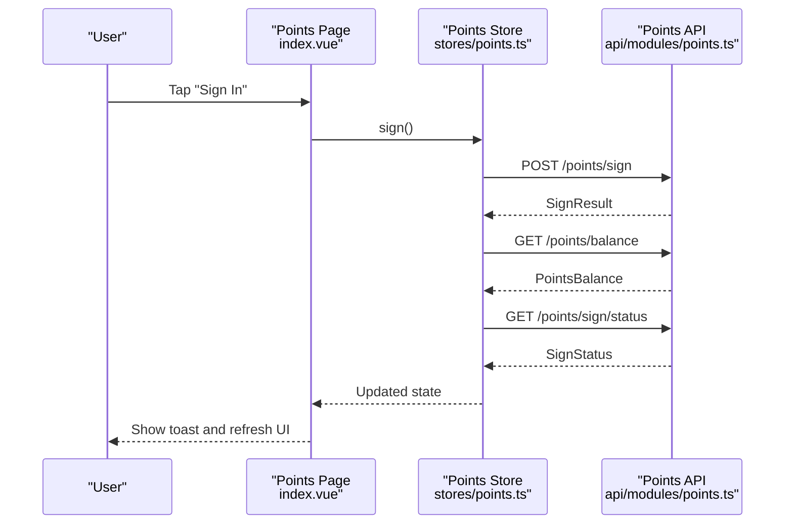
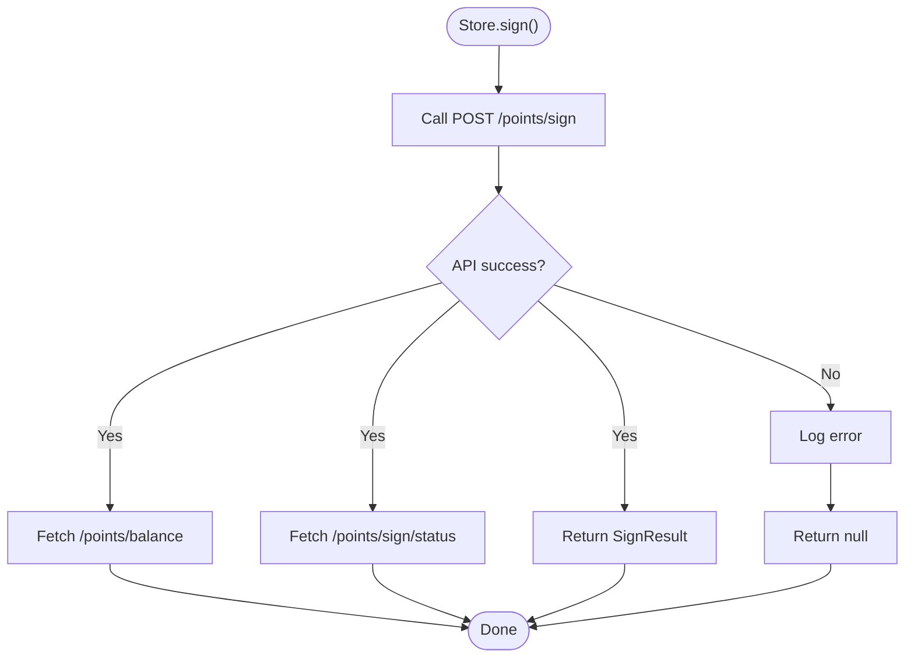
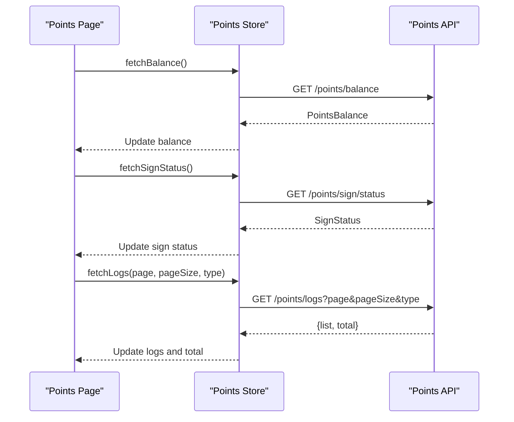
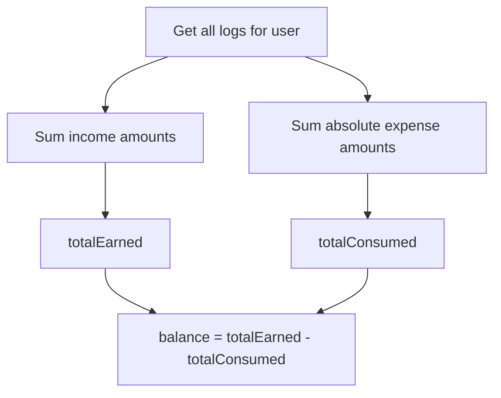
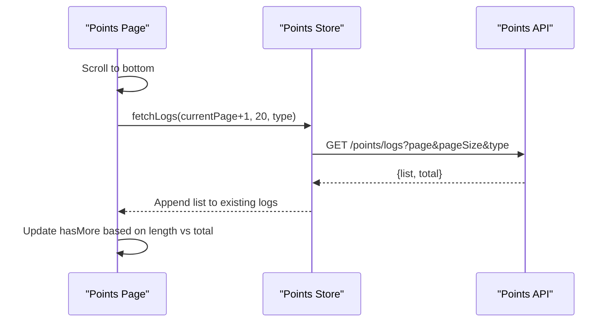
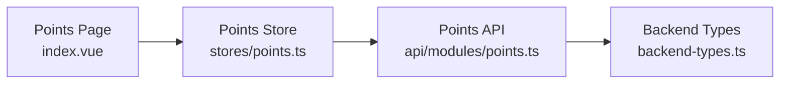

# Points & Rewards Module

<cite>
**Referenced Files in This Document**
- [points.ts](file://src/api/modules/points.ts)
- [points.ts](file://src/stores/points.ts)
- [index.vue](file://src/pages/points/index.vue)
- [backend-types.ts](file://src/types/api/backend-types.ts)
- [points-balance-fix.md](file://docs/points-balance-fix.md)
- [points-list-pagination.md](file://docs/fix-deploy/points-list-pagination.md)
</cite>

## Table of Contents
1. [Introduction](#introduction)
2. [Project Structure](#project-structure)
3. [Core Components](#core-components)
4. [Architecture Overview](#architecture-overview)
5. [Detailed Component Analysis](#detailed-component-analysis)
6. [Dependency Analysis](#dependency-analysis)
7. [Performance Considerations](#performance-considerations)
8. [Troubleshooting Guide](#troubleshooting-guide)
9. [Conclusion](#conclusion)

## Introduction
This document describes the Points & Rewards module, covering the frontend API surface, state management, UI presentation, and backend considerations derived from the repository. It focuses on:
- Points balance retrieval and calculation
- Transaction history pagination and display
- Sign-in streak and daily bonus flow
- Points configuration endpoints
- Auditability via transaction logs
- Operational improvements validated by project documentation

Where the repository does not expose reward redemption, spending limits, or campaign-specific endpoints, this document highlights those gaps and provides recommended patterns for future extension.

## Project Structure
The Points & Rewards module spans three layers:
- API module: Defines typed endpoints for points operations
- Store: Centralizes state and orchestrates API calls
- Page: Renders UI, handles pagination, and user interactions

```mermaid
graph TB
subgraph "Frontend"
UI["Points Page<br/>index.vue"]
Store["Points Store<br/>stores/points.ts"]
API["Points API<br/>api/modules/points.ts"]
end
subgraph "Types"
Types["Backend Types<br/>types/api/backend-types.ts"]
end
subgraph "Docs"
Docs1["Balance Fix<br/>points-balance-fix.md"]
Docs2["Pagination Fix<br/>points-list-pagination.md"]
end
UI --> Store
Store --> API
API --> Types
Store -. internal docs .-> Docs1
Store -. internal docs .-> Docs2
```

**Diagram sources**
- [index.vue:1-347](file://src/pages/points/index.vue#L1-L347)
- [points.ts:1-72](file://src/stores/points.ts#L1-L72)
- [points.ts:1-55](file://src/api/modules/points.ts#L1-L55)
- [backend-types.ts:344-359](file://src/types/api/backend-types.ts#L344-L359)
- [points-balance-fix.md:1-264](file://docs/points-balance-fix.md#L1-L264)
- [points-list-pagination.md:1-346](file://docs/fix-deploy/points-list-pagination.md#L1-L346)

**Section sources**
- [points.ts:1-55](file://src/api/modules/points.ts#L1-L55)
- [points.ts:1-72](file://src/stores/points.ts#L1-L72)
- [index.vue:1-347](file://src/pages/points/index.vue#L1-L347)
- [backend-types.ts:344-359](file://src/types/api/backend-types.ts#L344-L359)
- [points-balance-fix.md:1-264](file://docs/points-balance-fix.md#L1-L264)
- [points-list-pagination.md:1-346](file://docs/fix-deploy/points-list-pagination.md#L1-L346)

## Core Components
- Points API module exposes typed endpoints for:
  - Balance retrieval
  - Sign-in and sign-in status
  - Transaction logs with pagination and filtering
  - Points configuration endpoints
- Points Store manages reactive state and orchestrates API calls
- Points Page renders the UI, handles pagination, and triggers actions

Key data models:
- PointsBalance: balance, totalEarned, totalConsumed
- SignStatus: signedToday, continuousDays
- SignResult: points awarded, continuousDays, optional balance
- PointsLog: log entry with type, source, amount, balance, remark, createdAt
- PointsConfig: configuration entries for points-related settings

**Section sources**
- [points.ts:4-30](file://src/api/modules/points.ts#L4-L30)
- [points.ts:8-11](file://src/stores/points.ts#L8-L11)
- [backend-types.ts:344-359](file://src/types/api/backend-types.ts#L344-L359)

## Architecture Overview
The module follows a unidirectional data flow:
- UI triggers actions (e.g., sign-in)
- Store calls API
- API requests backend endpoints
- Store updates local state
- UI re-renders with new state



**Diagram sources**
- [index.vue:127-136](file://src/pages/points/index.vue#L127-L136)
- [points.ts:31-41](file://src/stores/points.ts#L31-L41)
- [points.ts:33-40](file://src/api/modules/points.ts#L33-L40)

## Detailed Component Analysis

### Points API Module
Responsibilities:
- Define typed endpoints for points operations
- Expose configuration endpoints for points-related settings

Endpoints:
- GET /points/balance → PointsBalance
- POST /points/sign → SignResult
- GET /points/sign/status → SignStatus
- GET /points/logs?page&pageSize&type → Paginated PointsLog list
- GET /points/config → PointsConfig[]
- GET /points-configs → PointsConfig[]

Notes:
- The presence of two configuration endpoints suggests separate concerns for runtime configuration versus stored configurations
- The repository does not expose reward redemption or spending limit endpoints; those would require backend additions

**Section sources**
- [points.ts:32-54](file://src/api/modules/points.ts#L32-L54)

### Points Store
Responsibilities:
- Manage reactive state: balance, signStatus, logs, totalLogs
- Fetch balance, sign status, and logs
- Execute sign-in action and refresh state

Behavior:
- On sign-in, fetches updated balance and sign status
- Logs pagination supports reset and append modes
- Error handling is logged to console



**Diagram sources**
- [points.ts:31-41](file://src/stores/points.ts#L31-L41)

**Section sources**
- [points.ts:13-69](file://src/stores/points.ts#L13-L69)

### Points Page (UI)
Responsibilities:
- Render current balance and statistics
- Display sign-in status and trigger sign-in
- Filter logs by type (all/income/expenses)
- Implement infinite scroll with pagination
- Format timestamps and display log items

Key interactions:
- Tab switching resets pagination
- Scroll-to-bottom loads next page
- Toast notifications for user feedback



**Diagram sources**
- [index.vue:84-125](file://src/pages/points/index.vue#L84-L125)
- [points.ts:43-58](file://src/stores/points.ts#L43-L58)
- [points.ts:42-47](file://src/api/modules/points.ts#L42-L47)

**Section sources**
- [index.vue:1-347](file://src/pages/points/index.vue#L1-L347)
- [points.ts:43-58](file://src/stores/points.ts#L43-L58)

### Points Calculation and Auditability
From the repository documentation:
- Balance calculation derives from transaction logs, not a single authoritative field
- Income records are positive amounts; expense records are represented with negative amounts
- The audit trail ensures consistency between totalEarned, totalConsumed, and balance

Recommended calculation:
- totalEarned = SUM(income log amounts)
- totalConsumed = SUM(absolute value of expense log amounts)
- balance = totalEarned - totalConsumed



**Diagram sources**
- [points-balance-fix.md:190-256](file://docs/points-balance-fix.md#L190-L256)

**Section sources**
- [points-balance-fix.md:26-47](file://docs/points-balance-fix.md#L26-L47)
- [points-balance-fix.md:190-256](file://docs/points-balance-fix.md#L190-L256)

### Transaction History Pagination
The UI now supports:
- Infinite scroll with configurable page size
- Tab-based filtering (all/income/expenses)
- Proper pagination state management



**Diagram sources**
- [index.vue:117-121](file://src/pages/points/index.vue#L117-L121)
- [points.ts:47-52](file://src/stores/points.ts#L47-L52)
- [points-list-pagination.md:172-181](file://docs/fix-deploy/points-list-pagination.md#L172-L181)

**Section sources**
- [index.vue:95-121](file://src/pages/points/index.vue#L95-L121)
- [points.ts:43-58](file://src/stores/points.ts#L43-L58)
- [points-list-pagination.md:1-346](file://docs/fix-deploy/points-list-pagination.md#L1-L346)

### Reward Catalog Management and Spending Limits
- The repository exposes configuration endpoints but does not define reward redemption or spending limit enforcement in the frontend
- These capabilities would require backend support and additional frontend flows

**Section sources**
- [points.ts:49-54](file://src/api/modules/points.ts#L49-L54)

### Real-time Balance Updates and Synchronization
- After sign-in, the store fetches updated balance and sign status
- The UI reflects immediate changes after successful operations

**Section sources**
- [points.ts:31-41](file://src/stores/points.ts#L31-L41)
- [index.vue:127-136](file://src/pages/points/index.vue#L127-L136)

### Fraud Prevention, Auditing, and Fulfillment Tracking
- The audit trail is built on transaction logs, enabling reconciliation of totals and balance
- The repository documentation emphasizes consistent calculation from logs for auditability

**Section sources**
- [points-balance-fix.md:26-47](file://docs/points-balance-fix.md#L26-L47)
- [points-balance-fix.md:190-256](file://docs/points-balance-fix.md#L190-L256)

## Dependency Analysis
- The Points Page depends on the Points Store
- The Points Store depends on the Points API module
- The Points API module depends on shared request infrastructure and backend types
- Backend types define PointsConfig, which informs configuration-driven behavior



**Diagram sources**
- [index.vue:74-77](file://src/pages/points/index.vue#L74-L77)
- [points.ts:3-3](file://src/stores/points.ts#L3-L3)
- [points.ts:1-2](file://src/api/modules/points.ts#L1-L2)
- [backend-types.ts:344-359](file://src/types/api/backend-types.ts#L344-L359)

**Section sources**
- [points.ts:1-2](file://src/api/modules/points.ts#L1-L2)
- [points.ts:3-3](file://src/stores/points.ts#L3-L3)
- [backend-types.ts:344-359](file://src/types/api/backend-types.ts#L344-L359)

## Performance Considerations
- Balance calculation from logs is straightforward but may require aggregation over many rows
- Recommendations supported by repository docs:
  - Virtual lists for very large histories
  - Optional caching of computed totals
  - Persistence of store state to reduce repeated network calls

**Section sources**
- [points-list-pagination.md:303-342](file://docs/fix-deploy/points-list-pagination.md#L303-L342)

## Troubleshooting Guide
Common issues and resolutions:
- Balance mismatch: Ensure calculations derive from logs consistently
  - Verify income vs expense sign convention
  - Confirm SUM of logs equals balance
- Pagination gaps: Ensure the store appends logs for pages > 1
  - Validate hasMore logic against total count
- Sign-in state not updating: Confirm post-sign fetches balance and sign status

**Section sources**
- [points-balance-fix.md:130-264](file://docs/points-balance-fix.md#L130-L264)
- [points-list-pagination.md:1-346](file://docs/fix-deploy/points-list-pagination.md#L1-L346)
- [points.ts:31-41](file://src/stores/points.ts#L31-L41)

## Conclusion
The Points & Rewards module provides a robust foundation for balance retrieval, sign-in tracking, and transaction logging with strong auditability. The UI supports pagination and filtering, while the store coordinates state transitions. Future enhancements could include reward redemption, spending limits, and campaign management, which would require backend endpoint additions and corresponding frontend flows.