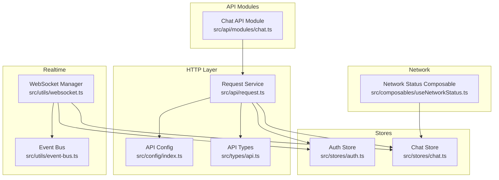
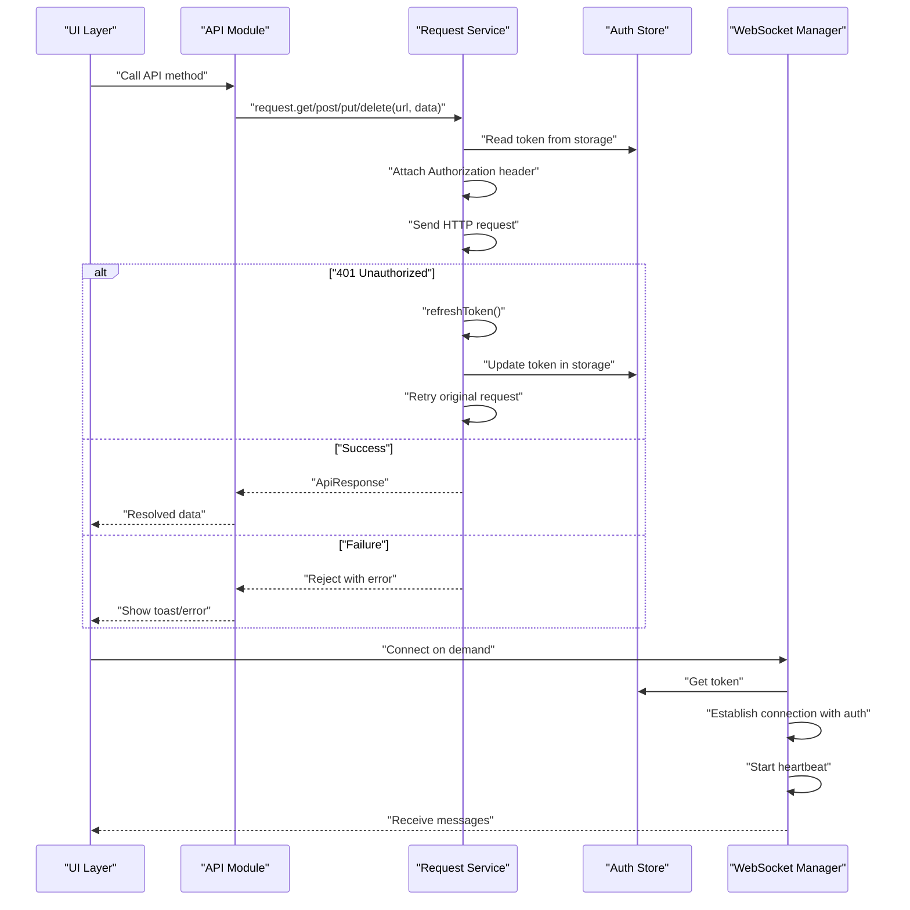
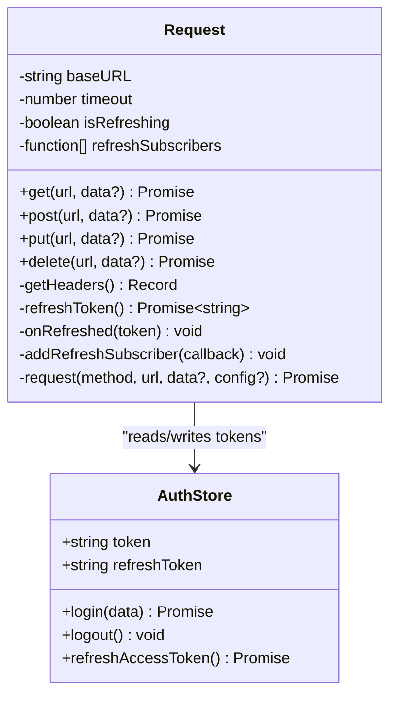
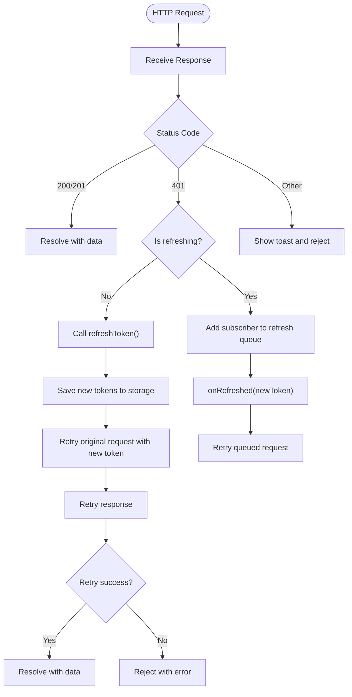
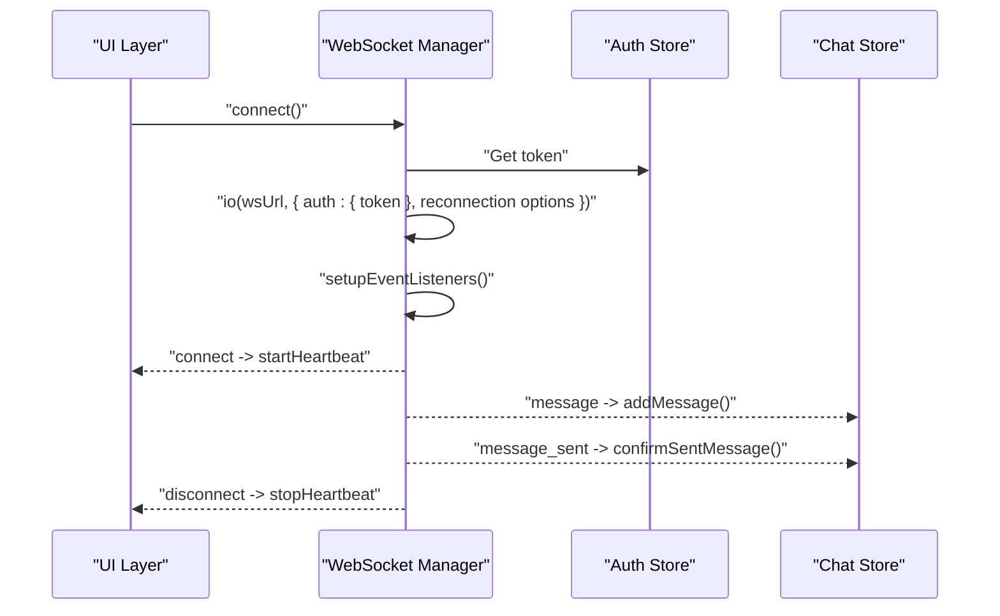
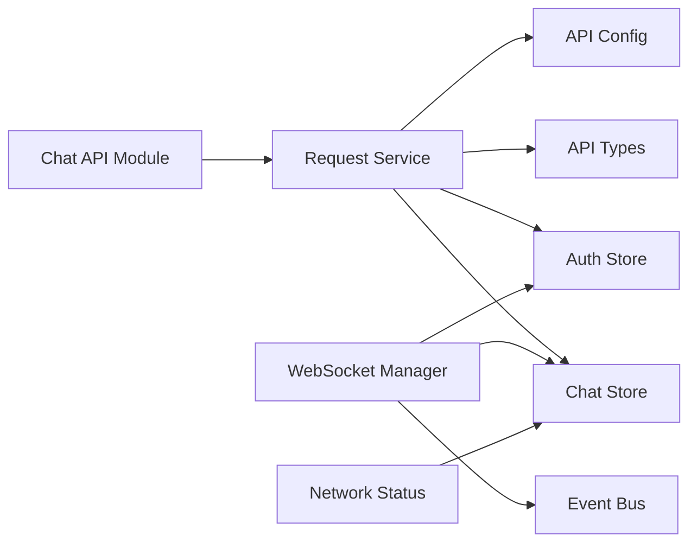

# Request Service & HTTP Client

<cite>
**Referenced Files in This Document**
- [src/api/request.ts](file://src/api/request.ts)
- [src/config/index.ts](file://src/config/index.ts)
- [src/types/api.ts](file://src/types/api.ts)
- [src/utils/websocket.ts](file://src/utils/websocket.ts)
- [src/stores/auth.ts](file://src/stores/auth.ts)
- [src/stores/chat.ts](file://src/stores/chat.ts)
- [src/composables/useNetworkStatus.ts](file://src/composables/useNetworkStatus.ts)
- [src/api/modules/chat.ts](file://src/api/modules/chat.ts)
- [src/utils/event-bus.ts](file://src/utils/event-bus.ts)
- [src/main.ts](file://src/main.ts)
- [package.json](file://package.json)
</cite>

## Table of Contents
1. [Introduction](#introduction)
2. [Project Structure](#project-structure)
3. [Core Components](#core-components)
4. [Architecture Overview](#architecture-overview)
5. [Detailed Component Analysis](#detailed-component-analysis)
6. [Dependency Analysis](#dependency-analysis)
7. [Performance Considerations](#performance-considerations)
8. [Troubleshooting Guide](#troubleshooting-guide)
9. [Conclusion](#conclusion)

## Introduction
This document provides comprehensive documentation for the request service and HTTP client implementation, along with WebSocket integration for real-time messaging. It covers Axios-based HTTP client configuration, base URL management, request/response interceptors, authentication token handling, automatic token refresh mechanisms, error response processing, retry logic, timeout configurations, network error handling strategies, CORS handling, request queuing during offline periods, and connection status monitoring. The goal is to help developers understand how the system manages network requests, maintains authentication state, and delivers real-time features through WebSockets.

## Project Structure
The request service and HTTP client are implemented as a singleton class that encapsulates HTTP communication and authentication logic. Supporting infrastructure includes configuration management, type definitions, WebSocket manager, Pinia stores for authentication and chat, a network status composable, and API module bindings.

**Diagram sources**
- [src/api/request.ts:1-228](file://src/api/request.ts#L1-L228)
- [src/config/index.ts:1-11](file://src/config/index.ts#L1-L11)
- [src/types/api.ts:1-83](file://src/types/api.ts#L1-L83)
- [src/stores/auth.ts:1-137](file://src/stores/auth.ts#L1-L137)
- [src/stores/chat.ts:1-234](file://src/stores/chat.ts#L1-L234)
- [src/utils/websocket.ts:1-171](file://src/utils/websocket.ts#L1-L171)
- [src/utils/event-bus.ts:1-49](file://src/utils/event-bus.ts#L1-L49)
- [src/composables/useNetworkStatus.ts:1-62](file://src/composables/useNetworkStatus.ts#L1-L62)
- [src/api/modules/chat.ts:1-46](file://src/api/modules/chat.ts#L1-L46)

**Section sources**
- [src/api/request.ts:1-228](file://src/api/request.ts#L1-L228)
- [src/config/index.ts:1-11](file://src/config/index.ts#L1-L11)
- [src/types/api.ts:1-83](file://src/types/api.ts#L1-L83)
- [src/stores/auth.ts:1-137](file://src/stores/auth.ts#L1-L137)
- [src/stores/chat.ts:1-234](file://src/stores/chat.ts#L1-L234)
- [src/utils/websocket.ts:1-171](file://src/utils/websocket.ts#L1-L171)
- [src/utils/event-bus.ts:1-49](file://src/utils/event-bus.ts#L1-L49)
- [src/composables/useNetworkStatus.ts:1-62](file://src/composables/useNetworkStatus.ts#L1-L62)
- [src/api/modules/chat.ts:1-46](file://src/api/modules/chat.ts#L1-L46)

## Core Components
- Request Service: Centralized HTTP client with token injection, automatic token refresh, retry logic, and error handling.
- Configuration: Environment-driven base URLs and timeouts.
- Type System: Unified API response shape and domain models.
- WebSocket Manager: Real-time messaging with connection lifecycle, heartbeat, and reconnection.
- Stores: Authentication and chat state management integrated with the request service and WebSocket.
- Network Status: Offline detection and action gating.
- API Modules: Typed wrappers around the request service for specific domains.

**Section sources**
- [src/api/request.ts:1-228](file://src/api/request.ts#L1-L228)
- [src/config/index.ts:1-11](file://src/config/index.ts#L1-L11)
- [src/types/api.ts:1-83](file://src/types/api.ts#L1-L83)
- [src/utils/websocket.ts:1-171](file://src/utils/websocket.ts#L1-L171)
- [src/stores/auth.ts:1-137](file://src/stores/auth.ts#L1-L137)
- [src/stores/chat.ts:1-234](file://src/stores/chat.ts#L1-L234)
- [src/composables/useNetworkStatus.ts:1-62](file://src/composables/useNetworkStatus.ts#L1-L62)
- [src/api/modules/chat.ts:1-46](file://src/api/modules/chat.ts#L1-L46)

## Architecture Overview
The system integrates HTTP requests and WebSocket messaging around a shared authentication state managed by Pinia. Requests are configured via environment variables, include Authorization headers, and automatically handle token refresh on 401 responses. WebSocket connections are established with authentication tokens and include heartbeat and reconnection logic. Network status is monitored to prevent actions while offline.

**Diagram sources**
- [src/api/request.ts:75-208](file://src/api/request.ts#L75-L208)
- [src/stores/auth.ts:54-71](file://src/stores/auth.ts#L54-L71)
- [src/utils/websocket.ts:15-53](file://src/utils/websocket.ts#L15-L53)

## Detailed Component Analysis

### Request Service
The Request class encapsulates HTTP communication with the backend. It manages base URL, timeout, headers, and authentication. It supports GET/POST/PUT/DELETE methods and centralizes error handling and token refresh logic.

Key capabilities:
- Base URL and timeout from configuration.
- Authorization header injection using stored tokens.
- Automatic token refresh on 401 responses with request queuing to avoid concurrent refreshes.
- Retry logic after successful refresh.
- Error toast notifications and rejection propagation.
- GET parameter encoding and non-GET body handling.

**Diagram sources**
- [src/api/request.ts:4-225](file://src/api/request.ts#L4-L225)
- [src/stores/auth.ts:12-71](file://src/stores/auth.ts#L12-L71)

**Section sources**
- [src/api/request.ts:10-225](file://src/api/request.ts#L10-L225)
- [src/config/index.ts:1-5](file://src/config/index.ts#L1-L5)
- [src/types/api.ts:3-8](file://src/types/api.ts#L3-L8)

#### Token Refresh Flow

**Diagram sources**
- [src/api/request.ts:100-174](file://src/api/request.ts#L100-L174)
- [src/stores/auth.ts:54-71](file://src/stores/auth.ts#L54-L71)

### Configuration Management
- API base URL and WebSocket URL are loaded from environment variables.
- Timeout is configurable and applied to all requests.
- WebSocket path is derived from wsURL for Socket.IO configuration.

**Section sources**
- [src/config/index.ts:1-11](file://src/config/index.ts#L1-L11)

### Type System
- ApiResponse defines the standardized response envelope with code, message, and data.
- Domain types include UserInfo, Message, Conversation, Post, Comment, and Friend.
- These types are used across stores and API modules to ensure type safety.

**Section sources**
- [src/types/api.ts:3-83](file://src/types/api.ts#L3-L83)

### WebSocket Integration
The WebSocketManager handles connection lifecycle, authentication, heartbeats, and reconnection. It listens for messages and dispatches them to the chat store for processing.

Capabilities:
- Connect with authentication token from store or storage.
- Heartbeat via ping/pong every 25 seconds.
- Automatic reconnection with capped attempts and delay.
- Message routing to chat store based on message type or legacy format.
- Graceful disconnect and cleanup.

**Diagram sources**
- [src/utils/websocket.ts:15-171](file://src/utils/websocket.ts#L15-L171)
- [src/stores/chat.ts:100-210](file://src/stores/chat.ts#L100-L210)
- [src/stores/auth.ts:12-26](file://src/stores/auth.ts#L12-L26)

**Section sources**
- [src/utils/websocket.ts:6-171](file://src/utils/websocket.ts#L6-L171)
- [src/stores/chat.ts:100-210](file://src/stores/chat.ts#L100-L210)
- [src/stores/auth.ts:12-26](file://src/stores/auth.ts#L12-L26)

### Authentication Store
The Auth Store manages tokens and user info, persists state, and exposes methods to refresh access tokens. It also emits global events for avatar updates.

Highlights:
- login/register set tokens and user info in storage and state.
- refreshAccessToken updates token from refreshToken.
- logout clears tokens and user info.
- updateUserInfo triggers avatar-related events.

**Section sources**
- [src/stores/auth.ts:12-131](file://src/stores/auth.ts#L12-L131)

### Chat Store and Real-Time Messaging
The Chat Store orchestrates conversation and message state, integrates with WebSocket messages, and performs optimistic updates for sending messages.

Key behaviors:
- fetchConversations and fetchHistory populate lists with normalized data.
- sendMessage adds a temporary message immediately, sends to backend, and replaces with server response.
- addMessage and confirmSentMessage handle incoming WebSocket messages and deduplicate.
- markAsRead updates unread counts.

**Section sources**
- [src/stores/chat.ts:14-234](file://src/stores/chat.ts#L14-L234)

### Network Status Monitoring
The useNetworkStatus composable monitors connectivity and prevents actions when offline. It displays toast notifications on network changes and provides a checkBeforeAction helper.

**Section sources**
- [src/composables/useNetworkStatus.ts:3-61](file://src/composables/useNetworkStatus.ts#L3-L61)

### API Modules
The API modules wrap the Request service with typed endpoints. For example, chatApi exposes sendMessage, getHistory, getConversations, getMessages, and markAsRead.

**Section sources**
- [src/api/modules/chat.ts:18-45](file://src/api/modules/chat.ts#L18-L45)

## Dependency Analysis
The request service depends on configuration and types, and interacts with stores for authentication and chat. The WebSocket manager depends on the auth store and chat store for message handling. The network status composable is used by UI components to gate actions.

**Diagram sources**
- [src/api/request.ts:1-228](file://src/api/request.ts#L1-L228)
- [src/config/index.ts:1-11](file://src/config/index.ts#L1-L11)
- [src/types/api.ts:1-83](file://src/types/api.ts#L1-L83)
- [src/stores/auth.ts:1-137](file://src/stores/auth.ts#L1-L137)
- [src/stores/chat.ts:1-234](file://src/stores/chat.ts#L1-L234)
- [src/utils/websocket.ts:1-171](file://src/utils/websocket.ts#L1-L171)
- [src/utils/event-bus.ts:1-49](file://src/utils/event-bus.ts#L1-L49)
- [src/api/modules/chat.ts:1-46](file://src/api/modules/chat.ts#L1-L46)
- [src/composables/useNetworkStatus.ts:1-62](file://src/composables/useNetworkStatus.ts#L1-L62)

**Section sources**
- [src/api/request.ts:1-228](file://src/api/request.ts#L1-L228)
- [src/utils/websocket.ts:1-171](file://src/utils/websocket.ts#L1-L171)
- [src/stores/auth.ts:1-137](file://src/stores/auth.ts#L1-L137)
- [src/stores/chat.ts:1-234](file://src/stores/chat.ts#L1-L234)
- [src/api/modules/chat.ts:1-46](file://src/api/modules/chat.ts#L1-L46)
- [src/composables/useNetworkStatus.ts:1-62](file://src/composables/useNetworkStatus.ts#L1-L62)

## Performance Considerations
- Timeout configuration: Tune API_CONFIG.timeout to balance responsiveness and long-running operations.
- Request queuing during refresh: The request service queues concurrent requests while refreshing tokens to avoid redundant refresh calls.
- WebSocket heartbeat: Ping/pong keeps connections alive and detects dead peers efficiently.
- Optimistic UI updates: Chat store updates UI immediately on send and reconciles with server confirmation to reduce perceived latency.
- Storage operations: Token and user info are persisted to minimize repeated login flows.

[No sources needed since this section provides general guidance]

## Troubleshooting Guide
Common issues and resolutions:
- 401 Unauthorized:
  - The request service triggers token refresh automatically. If refresh fails, the user is logged out and redirected to login.
  - Verify refreshToken storage and backend refresh endpoint availability.
- Network failures:
  - The request service shows a toast and rejects the promise. Ensure network connectivity and retry logic is handled by the caller.
- WebSocket connection errors:
  - The WebSocket manager logs connection errors, stops heartbeat, and attempts reconnection up to a maximum number of attempts.
  - Confirm wsURL configuration and that the server supports the specified path.
- Offline actions:
  - Use useNetworkStatus.checkBeforeAction to prevent actions when offline and show appropriate toasts.
- CORS and base URL:
  - Ensure API_CONFIG.baseURL matches the backend origin and that preflight requests are allowed by the server.

**Section sources**
- [src/api/request.ts:100-174](file://src/api/request.ts#L100-L174)
- [src/utils/websocket.ts:78-91](file://src/utils/websocket.ts#L78-L91)
- [src/composables/useNetworkStatus.ts:35-45](file://src/composables/useNetworkStatus.ts#L35-L45)
- [src/config/index.ts:1-5](file://src/config/index.ts#L1-L5)

## Conclusion
The request service and WebSocket integration form a robust foundation for HTTP and real-time communication. The centralized request service handles authentication, retries, and error reporting, while the WebSocket manager ensures reliable real-time messaging with heartbeat and reconnection. Together with network status monitoring and typed APIs, the system provides a maintainable and scalable architecture for frontend-backend interactions.

[No sources needed since this section summarizes without analyzing specific files]