# Square Content Module

<cite>
**Referenced Files in This Document**
- [square.ts](file://src/api/modules/square.ts)
- [square.ts](file://src/stores/square.ts)
- [backend-types.ts](file://src/types/api/backend-types.ts)
- [backend-api.ts](file://src/types/api/backend-api.ts)
- [enums.ts](file://src/types/enums.ts)
- [post.vue](file://src/pages/square/post.vue)
- [publish.vue](file://src/pages/square/publish.vue)
- [index.vue](file://src/pages/square/index.vue)
- [home.vue](file://src/pages/tabbar/home.vue)
- [useRecommendation.ts](file://src/pages/tabbar/home/composables/useRecommendation.ts)
- [hotRanking.ts](file://src/pages/tabbar/home/algorithms/hotRanking.ts)
- [mixStrategy.ts](file://src/pages/tabbar/home/algorithms/mixStrategy.ts)
- [qiniu.service.ts](file://src/services/qiniu.service.ts)
</cite>

## Table of Contents
1. [Introduction](#introduction)
2. [Project Structure](#project-structure)
3. [Core Components](#core-components)
4. [Architecture Overview](#architecture-overview)
5. [Detailed Component Analysis](#detailed-component-analysis)
6. [Dependency Analysis](#dependency-analysis)
7. [Performance Considerations](#performance-considerations)
8. [Troubleshooting Guide](#troubleshooting-guide)
9. [Conclusion](#conclusion)
10. [Appendices](#appendices)

## Introduction
This document describes the Square content module, which powers user-generated content (UGC) on the platform. It covers post and comment lifecycle, likes/dislikes, reporting/moderation, media attachments, content feed management, pagination, trending ranking, and recommendation integration. The module is implemented as a frontend API client and Pinia store, with backend type definitions and recommendation algorithms included in the repository.

## Project Structure
The Square content module spans several areas:
- API client for Square endpoints
- Pinia store for state and optimistic updates
- Type definitions for backend contracts and enums
- Pages for publishing and viewing posts
- Recommendation pipeline and trending algorithms
- Media upload service for Square images

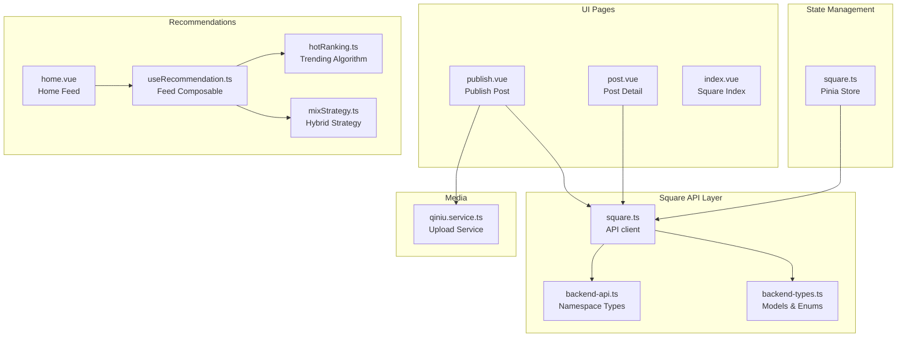

**Diagram sources**
- [square.ts:1-98](file://src/api/modules/square.ts#L1-L98)
- [backend-types.ts:427-535](file://src/types/api/backend-types.ts#L427-L535)
- [backend-api.ts:392-451](file://src/types/api/backend-api.ts#L392-L451)
- [square.ts:1-152](file://src/stores/square.ts#L1-L152)
- [publish.vue:1-239](file://src/pages/square/publish.vue#L1-L239)
- [post.vue:1-318](file://src/pages/square/post.vue#L1-L318)
- [index.vue:1-6](file://src/pages/square/index.vue#L1-L6)
- [home.vue:1-489](file://src/pages/tabbar/home.vue#L1-L489)
- [useRecommendation.ts:1-202](file://src/pages/tabbar/home/composables/useRecommendation.ts#L1-L202)
- [hotRanking.ts:1-329](file://src/pages/tabbar/home/algorithms/hotRanking.ts#L1-L329)
- [mixStrategy.ts:1-482](file://src/pages/tabbar/home/algorithms/mixStrategy.ts#L1-L482)
- [qiniu.service.ts:1-126](file://src/services/qiniu.service.ts#L1-L126)

**Section sources**
- [square.ts:1-98](file://src/api/modules/square.ts#L1-L98)
- [square.ts:1-152](file://src/stores/square.ts#L1-L152)
- [backend-types.ts:427-535](file://src/types/api/backend-types.ts#L427-L535)
- [backend-api.ts:392-451](file://src/types/api/backend-api.ts#L392-L451)
- [publish.vue:1-239](file://src/pages/square/publish.vue#L1-L239)
- [post.vue:1-318](file://src/pages/square/post.vue#L1-L318)
- [index.vue:1-6](file://src/pages/square/index.vue#L1-L6)
- [home.vue:1-489](file://src/pages/tabbar/home.vue#L1-L489)
- [useRecommendation.ts:1-202](file://src/pages/tabbar/home/composables/useRecommendation.ts#L1-L202)
- [hotRanking.ts:1-329](file://src/pages/tabbar/home/algorithms/hotRanking.ts#L1-L329)
- [mixStrategy.ts:1-482](file://src/pages/tabbar/home/algorithms/mixStrategy.ts#L1-L482)
- [qiniu.service.ts:1-126](file://src/services/qiniu.service.ts#L1-L126)

## Core Components
- Square API client: Provides typed endpoints for posts, comments, likes, and reports.
- Square Pinia store: Manages lists, current post, comments, pagination flags, and optimistic UI updates.
- Backend types: Defines SquarePost, CreatePostDto, CreateCommentDto, LikeDto, ReportDto, PostReport, and enums.
- Pages: Publish and post detail pages integrate with the store and API.
- Recommendations: Home feed composable and hybrid strategy combine multiple signals.
- Media service: Uploads images to cloud storage and returns URLs for posts.

**Section sources**
- [square.ts:43-97](file://src/api/modules/square.ts#L43-L97)
- [square.ts:13-151](file://src/stores/square.ts#L13-L151)
- [backend-types.ts:427-535](file://src/types/api/backend-types.ts#L427-L535)
- [enums.ts:13-24](file://src/types/enums.ts#L13-L24)
- [publish.vue:84-134](file://src/pages/square/publish.vue#L84-L134)
- [post.vue:61-175](file://src/pages/square/post.vue#L61-L175)
- [useRecommendation.ts:32-94](file://src/pages/tabbar/home/composables/useRecommendation.ts#L32-L94)
- [mixStrategy.ts:363-416](file://src/pages/tabbar/home/algorithms/mixStrategy.ts#L363-L416)
- [qiniu.service.ts:42-87](file://src/services/qiniu.service.ts#L42-L87)

## Architecture Overview
The Square module follows a layered architecture:
- UI pages trigger actions via the store.
- The store calls the Square API client.
- The API client encapsulates HTTP requests and returns typed responses.
- The store updates local state optimistically and synchronizes with server responses.
- Media uploads are handled by a dedicated service that integrates with the file API.

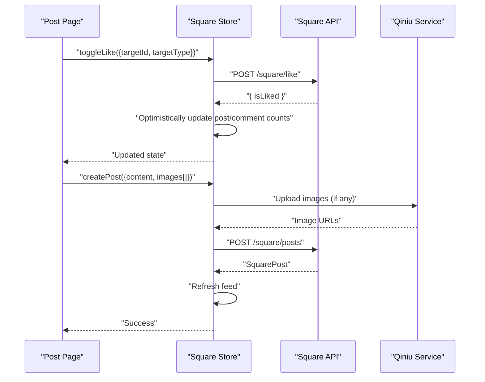

**Diagram sources**
- [post.vue:72-99](file://src/pages/square/post.vue#L72-L99)
- [square.ts:95-128](file://src/stores/square.ts#L95-L128)
- [square.ts:86-96](file://src/api/modules/square.ts#L86-L96)
- [publish.vue:95-113](file://src/pages/square/publish.vue#L95-L113)
- [qiniu.service.ts:42-87](file://src/services/qiniu.service.ts#L42-L87)

## Detailed Component Analysis

### Square API Client
Endpoints covered:
- Posts: create, list, detail, delete
- Comments: create, list, replies, delete
- Likes: toggle, per-post like/unlike
- Reports: submit post reports

```mermaid
classDiagram
class SquareAPI {
+createPost(data) SquarePost
+getPosts(params) ListWithTotal
+getPost(id) SquarePost
+deletePost(id) { success }
+createComment(data) { id }
+getComments(postId, params) ListWithTotal
+getReplies(commentId, params) ListWithTotal
+deleteComment(commentId) { success, message }
+toggleLike(data) { isLiked }
+likePost(postId) { isLiked }
+unlikePost(postId) { isLiked }
+report(data) PostReport
}
```

**Diagram sources**
- [square.ts:43-97](file://src/api/modules/square.ts#L43-L97)

**Section sources**
- [square.ts:43-97](file://src/api/modules/square.ts#L43-L97)
- [backend-api.ts:392-451](file://src/types/api/backend-api.ts#L392-L451)

### Square Store
Responsibilities:
- Fetch and paginate posts
- Load post detail and comments
- Create/delete posts and comments
- Toggle likes with optimistic updates and event emission
- Report posts

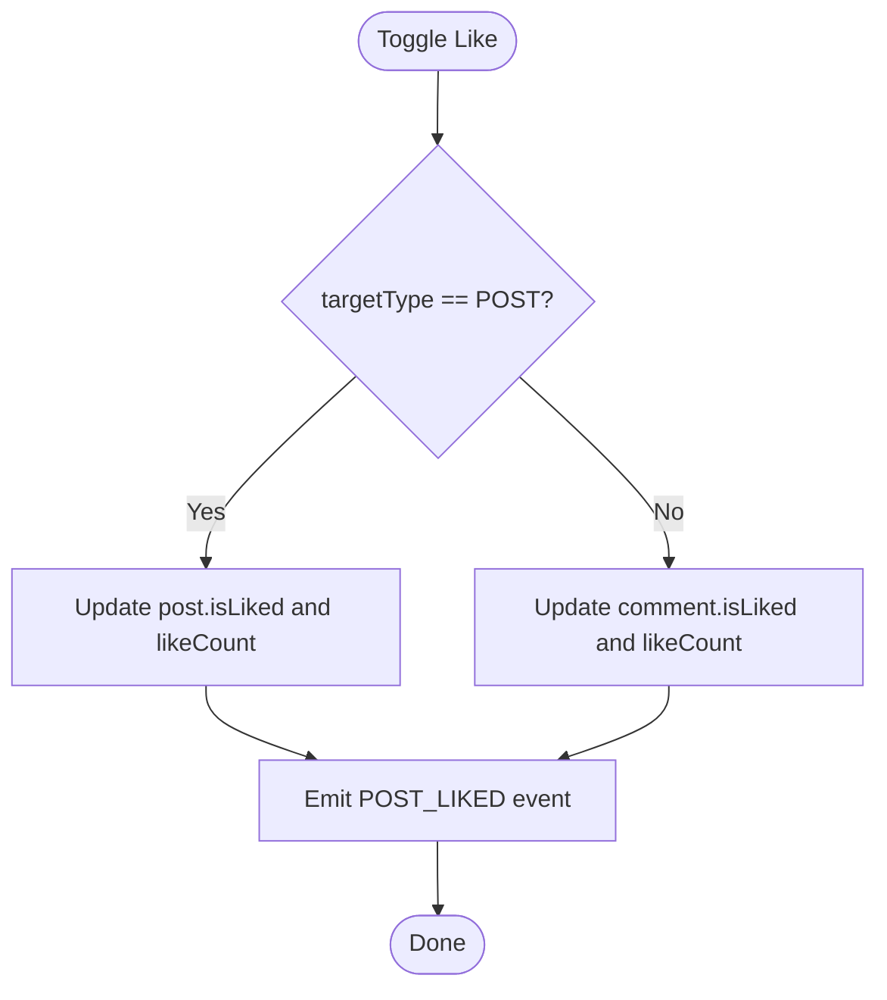

**Diagram sources**
- [square.ts:95-128](file://src/stores/square.ts#L95-L128)

**Section sources**
- [square.ts:20-93](file://src/stores/square.ts#L20-L93)
- [square.ts:95-128](file://src/stores/square.ts#L95-L128)

### Backend Types and Enums
- SquarePost: includes counters (likeCount, commentCount, viewCount, shareCount), hotScore, status, and user relationship.
- DTOs: CreatePostDto, CreateCommentDto, LikeDto, ReportDto.
- Enums: TargetType (POST, COMMENT), ReportReason, PostStatus.

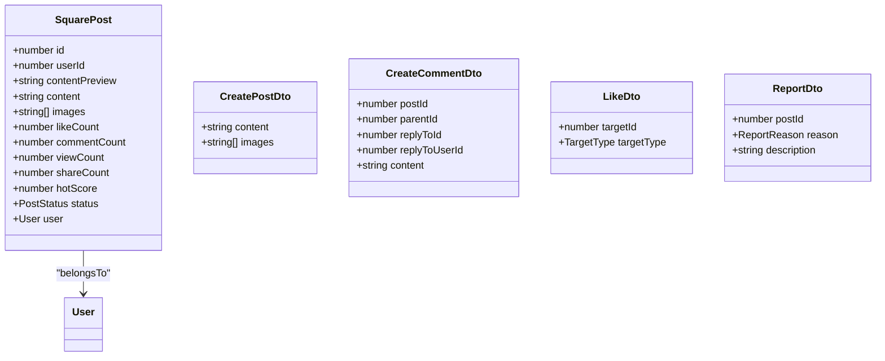

**Diagram sources**
- [backend-types.ts:427-459](file://src/types/api/backend-types.ts#L427-L459)
- [backend-types.ts:464-485](file://src/types/api/backend-types.ts#L464-L485)
- [backend-types.ts:488-495](file://src/types/api/backend-types.ts#L488-L495)
- [backend-types.ts:498-507](file://src/types/api/backend-types.ts#L498-L507)
- [enums.ts:13-24](file://src/types/enums.ts#L13-L24)

**Section sources**
- [backend-types.ts:427-535](file://src/types/api/backend-types.ts#L427-L535)
- [enums.ts:13-24](file://src/types/enums.ts#L13-L24)

### Post and Comment System
- Post detail page loads post and comments concurrently, supports liking, reporting, sharing, and deleting.
- Comments support nested replies; replies are fetched separately.
- Optimistic updates adjust counts and revert on failure.

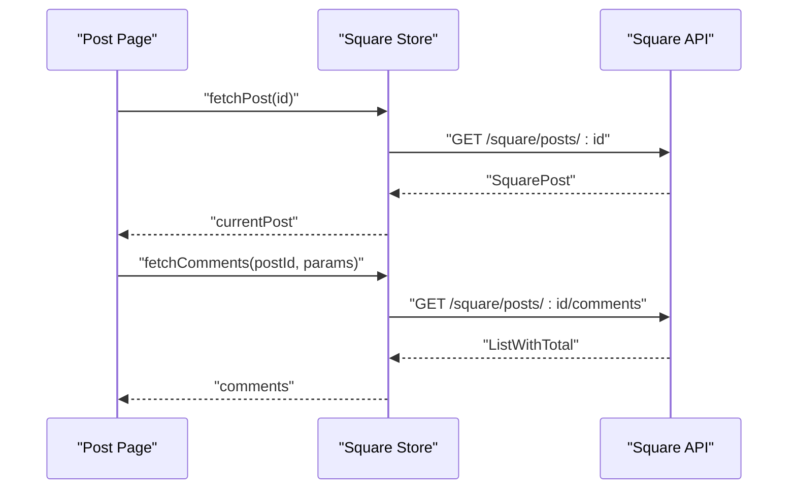

**Diagram sources**
- [post.vue:61-70](file://src/pages/square/post.vue#L61-L70)
- [square.ts:37-59](file://src/stores/square.ts#L37-L59)
- [square.ts:50-74](file://src/api/modules/square.ts#L50-L74)

**Section sources**
- [post.vue:1-318](file://src/pages/square/post.vue#L1-L318)
- [square.ts:37-88](file://src/stores/square.ts#L37-L88)
- [square.ts:56-96](file://src/api/modules/square.ts#L56-L96)

### Like/Dislike Functionality
- Two approaches: generic toggle and post-specific like/unlike.
- Store updates are optimistic and emit events for cross-component synchronization.

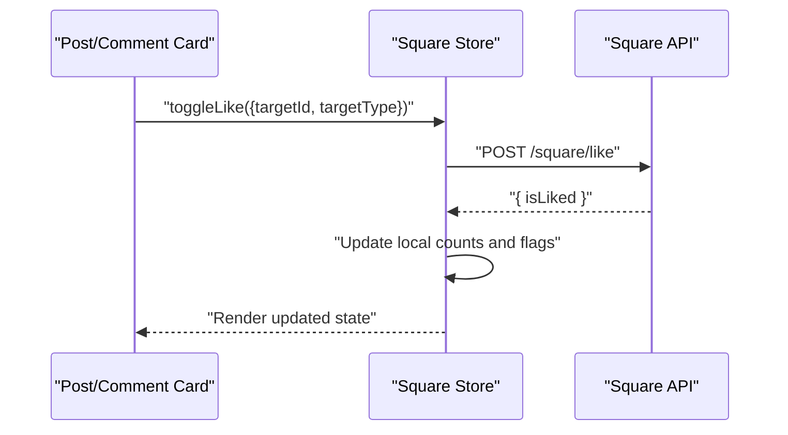

**Diagram sources**
- [post.vue:72-99](file://src/pages/square/post.vue#L72-L99)
- [square.ts:95-128](file://src/stores/square.ts#L95-L128)
- [square.ts:86-90](file://src/api/modules/square.ts#L86-L90)

**Section sources**
- [square.ts:95-128](file://src/stores/square.ts#L95-L128)
- [square.ts:86-96](file://src/api/modules/square.ts#L86-L96)

### Content Moderation and Reporting
- Users can report posts with a reason and optional description.
- Backend types define PostReport and ReportStatus.

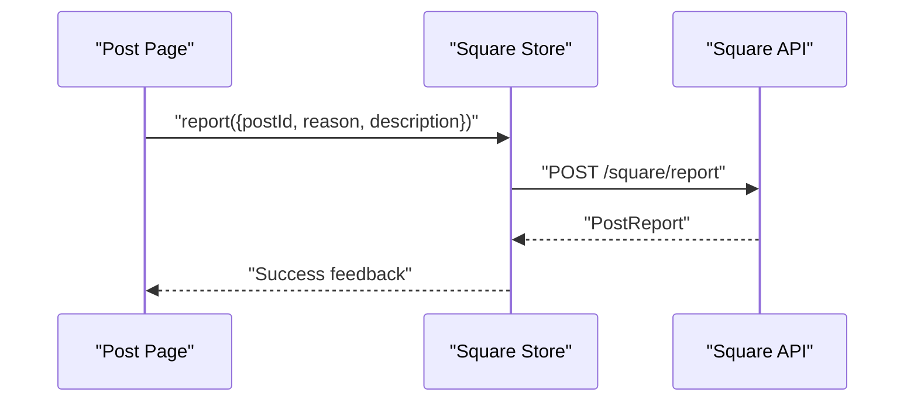

**Diagram sources**
- [post.vue:134-154](file://src/pages/square/post.vue#L134-L154)
- [square.ts:130-132](file://src/stores/square.ts#L130-L132)
- [square.ts:95-96](file://src/api/modules/square.ts#L95-L96)
- [backend-types.ts:510-535](file://src/types/api/backend-types.ts#L510-L535)

**Section sources**
- [post.vue:134-154](file://src/pages/square/post.vue#L134-L154)
- [square.ts:130-132](file://src/stores/square.ts#L130-L132)
- [backend-types.ts:510-535](file://src/types/api/backend-types.ts#L510-L535)

### Content Feed Management and Pagination
- Square posts list supports pagination and sorting (hot/latest).
- Infinite scrolling is handled by the store; hasMore flag drives continuation.

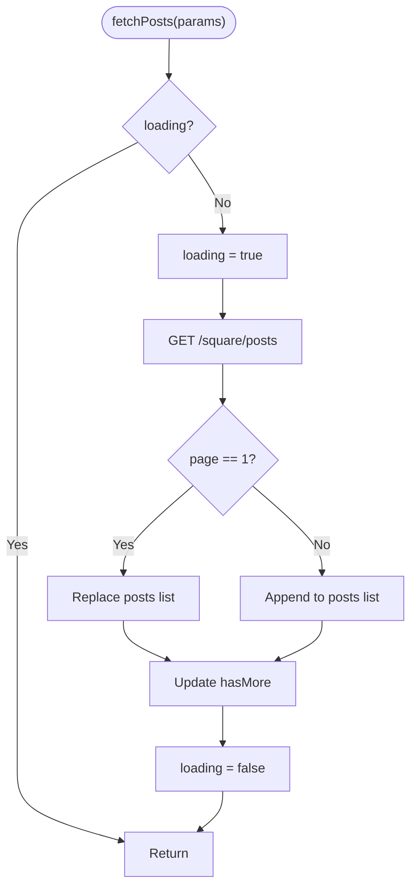

**Diagram sources**
- [square.ts:20-35](file://src/stores/square.ts#L20-L35)
- [square.ts:47-48](file://src/api/modules/square.ts#L47-L48)

**Section sources**
- [square.ts:20-35](file://src/stores/square.ts#L20-L35)
- [square.ts:37-48](file://src/api/modules/square.ts#L37-L48)

### Trending Content Algorithms
- Hot ranking combines Wilson score, time decay, and interaction bonus.
- Algorithms include Reddit-style, Hacker News-style, trend analysis, and stratification.

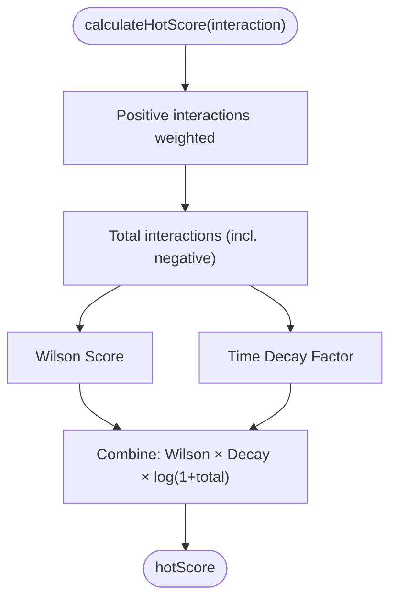

**Diagram sources**
- [hotRanking.ts:80-135](file://src/pages/tabbar/home/algorithms/hotRanking.ts#L80-L135)

**Section sources**
- [hotRanking.ts:1-329](file://src/pages/tabbar/home/algorithms/hotRanking.ts#L1-L329)

### Hybrid Recommendation Strategy
- Mixes collaborative filtering, content-based filtering, hot ranking, LBS, and new user signals.
- Distributes types by configured ratios and deduplicates results.

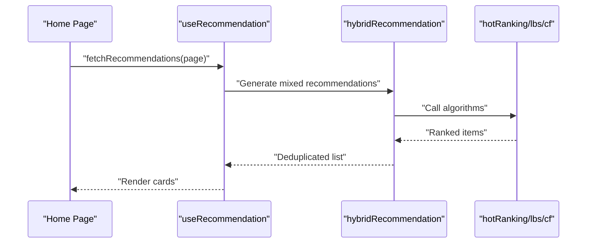

**Diagram sources**
- [home.vue:164-172](file://src/pages/tabbar/home.vue#L164-L172)
- [useRecommendation.ts:32-94](file://src/pages/tabbar/home/composables/useRecommendation.ts#L32-L94)
- [mixStrategy.ts:363-416](file://src/pages/tabbar/home/algorithms/mixStrategy.ts#L363-L416)

**Section sources**
- [useRecommendation.ts:1-202](file://src/pages/tabbar/home/composables/useRecommendation.ts#L1-L202)
- [mixStrategy.ts:1-482](file://src/pages/tabbar/home/algorithms/mixStrategy.ts#L1-L482)

### Media Attachment Handling
- Publish page uploads images via Qiniu service before posting.
- Service validates size, compresses, obtains upload token, and records file metadata.

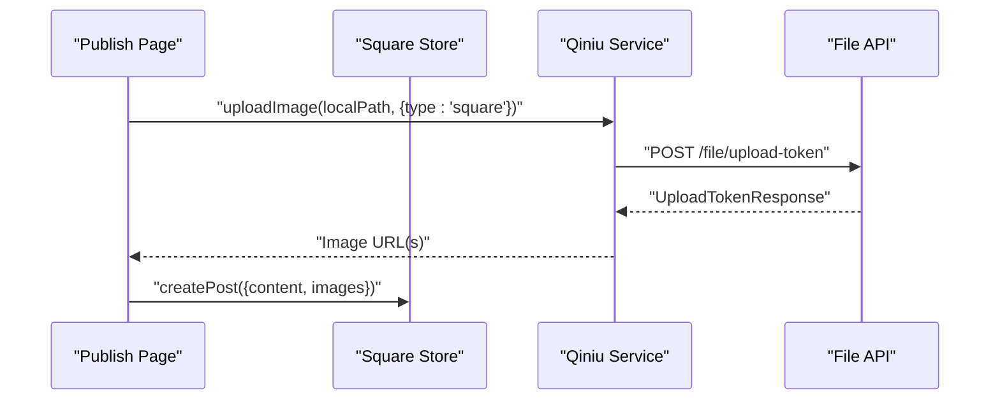

**Diagram sources**
- [publish.vue:95-113](file://src/pages/square/publish.vue#L95-L113)
- [qiniu.service.ts:29-40](file://src/services/qiniu.service.ts#L29-L40)
- [qiniu.service.ts:42-87](file://src/services/qiniu.service.ts#L42-L87)

**Section sources**
- [publish.vue:55-113](file://src/pages/square/publish.vue#L55-L113)
- [qiniu.service.ts:1-126](file://src/services/qiniu.service.ts#L1-L126)

### Content Filtering and Spam Detection APIs
- Backend types define PostStatus and ReportStatus, enabling moderation workflows.
- ReportReason enum supports multiple categories for spam/abuse classification.

**Section sources**
- [backend-types.ts:35-45](file://src/types/api/backend-types.ts#L35-L45)
- [backend-types.ts:42-49](file://src/types/api/backend-types.ts#L42-L49)
- [enums.ts:18-24](file://src/types/enums.ts#L18-L24)

### Content Analytics
- SquarePost exposes counters (likeCount, commentCount, viewCount, shareCount) suitable for analytics dashboards.
- Trending algorithm computes hotScore for performance insights.

**Section sources**
- [backend-types.ts:440-458](file://src/types/api/backend-types.ts#L440-L458)
- [hotRanking.ts:80-135](file://src/pages/tabbar/home/algorithms/hotRanking.ts#L80-L135)

### User-Generated Content Moderation
- Report endpoint enables user-driven moderation; backend types model PostReport and status transitions.

**Section sources**
- [square.ts:95-96](file://src/api/modules/square.ts#L95-L96)
- [backend-types.ts:510-535](file://src/types/api/backend-types.ts#L510-L535)

### Content Recommendation Integration
- Home feed composable integrates recommendation algorithms and renders diverse card types.
- Hybrid strategy balances personalization, hot content, nearby users, topics, and new users.

**Section sources**
- [home.vue:33-107](file://src/pages/tabbar/home.vue#L33-L107)
- [useRecommendation.ts:1-202](file://src/pages/tabbar/home/composables/useRecommendation.ts#L1-L202)
- [mixStrategy.ts:1-482](file://src/pages/tabbar/home/algorithms/mixStrategy.ts#L1-L482)

## Dependency Analysis
- UI pages depend on the Square store and API client.
- Store depends on API client and event bus for cross-component updates.
- Recommendation pipeline depends on algorithm modules and backend data sources.
- Media service depends on file API and cloud provider SDK.

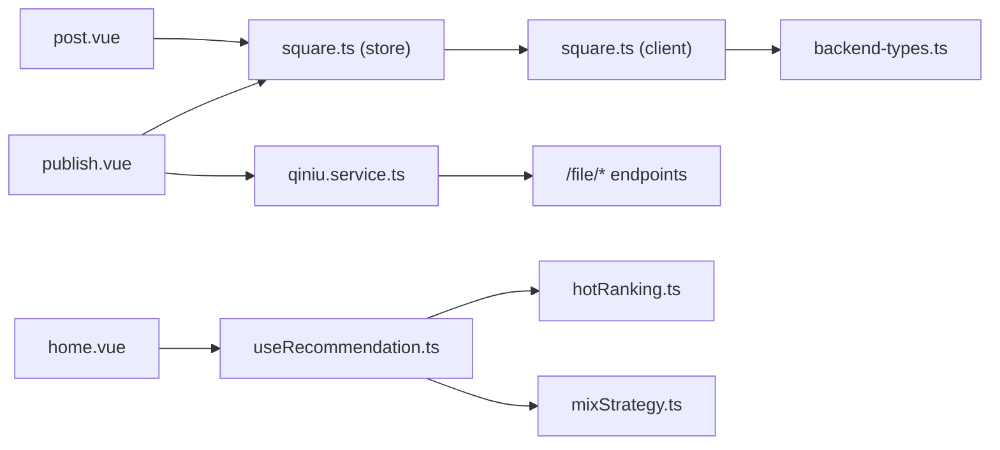

**Diagram sources**
- [publish.vue:1-239](file://src/pages/square/publish.vue#L1-L239)
- [post.vue:1-318](file://src/pages/square/post.vue#L1-L318)
- [square.ts:1-152](file://src/stores/square.ts#L1-L152)
- [square.ts:1-98](file://src/api/modules/square.ts#L1-L98)
- [backend-types.ts:1-764](file://src/types/api/backend-types.ts#L1-L764)
- [home.vue:1-489](file://src/pages/tabbar/home.vue#L1-L489)
- [useRecommendation.ts:1-202](file://src/pages/tabbar/home/composables/useRecommendation.ts#L1-L202)
- [hotRanking.ts:1-329](file://src/pages/tabbar/home/algorithms/hotRanking.ts#L1-L329)
- [mixStrategy.ts:1-482](file://src/pages/tabbar/home/algorithms/mixStrategy.ts#L1-L482)
- [qiniu.service.ts:1-126](file://src/services/qiniu.service.ts#L1-L126)

**Section sources**
- [square.ts:1-98](file://src/api/modules/square.ts#L1-L98)
- [square.ts:1-152](file://src/stores/square.ts#L1-L152)
- [backend-types.ts:1-764](file://src/types/api/backend-types.ts#L1-L764)
- [home.vue:1-489](file://src/pages/tabbar/home.vue#L1-L489)
- [useRecommendation.ts:1-202](file://src/pages/tabbar/home/composables/useRecommendation.ts#L1-L202)
- [hotRanking.ts:1-329](file://src/pages/tabbar/home/algorithms/hotRanking.ts#L1-L329)
- [mixStrategy.ts:1-482](file://src/pages/tabbar/home/algorithms/mixStrategy.ts#L1-L482)
- [qiniu.service.ts:1-126](file://src/services/qiniu.service.ts#L1-L126)

## Performance Considerations
- Optimistic UI updates reduce perceived latency; rollback on failure ensures consistency.
- Infinite scrolling with hasMore prevents unnecessary requests.
- Recommendation pipeline uses parallel generation and sharding to improve throughput.
- Media compression and size validation reduce payload sizes and upload failures.

## Troubleshooting Guide
Common issues and resolutions:
- Like toggling fails: Verify network connectivity and retry; UI reverts optimistic change on error.
- Comment count discrepancies: Ensure createComment/deleteComment updates are triggered after API calls.
- Upload errors: Confirm file size limits and compression settings; check upload token validity.
- Trending scores unexpected: Adjust decay rate and interaction weights in hot ranking configuration.

**Section sources**
- [post.vue:84-98](file://src/pages/square/post.vue#L84-L98)
- [square.ts:61-74](file://src/stores/square.ts#L61-L74)
- [qiniu.service.ts:49-52](file://src/services/qiniu.service.ts#L49-L52)
- [hotRanking.ts:83-103](file://src/pages/tabbar/home/algorithms/hotRanking.ts#L83-L103)

## Conclusion
The Square content module provides a robust foundation for UGC, including posts, comments, likes, reporting, media handling, and recommendation integration. Its layered design promotes maintainability, while optimistic updates and pagination strategies deliver responsive user experiences.

## Appendices
- Enumerations and models are defined centrally to ensure type safety across the API and UI layers.
- Recommendation algorithms are modular and configurable, supporting future enhancements.