# User Profile Module

<cite>
**Referenced Files in This Document**
- [profile.ts](file://src/api/profile.ts)
- [user.ts](file://src/api/modules/user.ts)
- [backend-types.ts](file://src/types/api/backend-types.ts)
- [backend-api.ts](file://src/types/api/backend-api.ts)
- [request.ts](file://src/api/request.ts)
- [file.ts](file://src/api/modules/file.ts)
- [qiniu.service.ts](file://src/services/qiniu.service.ts)
- [edit.vue](file://src/pages/profile/edit.vue)
- [photos.vue](file://src/pages/profile/photos.vue)
- [privacy.vue](file://src/pages/profile/privacy.vue)
- [mate-preferences.vue](file://src/pages/profile/mate-preferences.vue)
- [values.vue](file://src/pages/profile/values.vue)
- [interests.vue](file://src/pages/profile/interests.vue)
- [certification.vue](file://src/pages/profile/certification.vue)
- [avatar.ts](file://src/stores/avatar.ts)
- [avatar-utils.ts](file://src/utils/avatar.ts)
</cite>

## Table of Contents
1. [Introduction](#introduction)
2. [Project Structure](#project-structure)
3. [Core Components](#core-components)
4. [Architecture Overview](#architecture-overview)
5. [Detailed Component Analysis](#detailed-component-analysis)
6. [Dependency Analysis](#dependency-analysis)
7. [Performance Considerations](#performance-considerations)
8. [Troubleshooting Guide](#troubleshooting-guide)
9. [Conclusion](#conclusion)

## Introduction
This document provides comprehensive documentation for the user profile API module, covering all endpoints for profile retrieval, updates, preferences management, privacy settings, and related functionality. It explains user data validation, profile completion tracking, verification processes, profile photo management, interest tagging, personal information handling, user search functionality, profile visibility controls, and account management APIs. Additionally, it addresses data protection compliance, profile analytics, and user preference synchronization across devices.

## Project Structure
The user profile module is organized around several key areas:
- API layer: centralized profile and user management endpoints
- Frontend pages: Vue pages implementing profile editing, photo management, privacy settings, preferences, values, interests, and certification
- Services: file upload and cloud storage integration
- Types: shared TypeScript interfaces and API response definitions

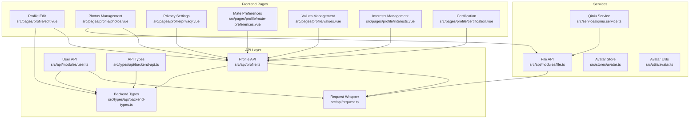

**Diagram sources**
- [profile.ts:1-311](file://src/api/profile.ts#L1-L311)
- [user.ts:1-101](file://src/api/modules/user.ts#L1-L101)
- [backend-types.ts:1-764](file://src/types/api/backend-types.ts#L1-L764)
- [backend-api.ts:1-641](file://src/types/api/backend-api.ts#L1-L641)
- [request.ts:1-228](file://src/api/request.ts#L1-L228)
- [file.ts:1-335](file://src/api/modules/file.ts#L1-L335)
- [qiniu.service.ts:1-126](file://src/services/qiniu.service.ts#L1-L126)
- [edit.vue:1-567](file://src/pages/profile/edit.vue#L1-L567)
- [photos.vue:1-505](file://src/pages/profile/photos.vue#L1-L505)
- [privacy.vue:1-494](file://src/pages/profile/privacy.vue#L1-L494)
- [mate-preferences.vue:1-559](file://src/pages/profile/mate-preferences.vue#L1-L559)
- [values.vue:1-599](file://src/pages/profile/values.vue#L1-L599)
- [interests.vue:1-645](file://src/pages/profile/interests.vue#L1-L645)
- [certification.vue:1-968](file://src/pages/profile/certification.vue#L1-L968)
- [avatar.ts:1-52](file://src/stores/avatar.ts#L1-L52)
- [avatar-utils.ts:1-93](file://src/utils/avatar.ts#L1-L93)

**Section sources**
- [profile.ts:1-311](file://src/api/profile.ts#L1-L311)
- [user.ts:1-101](file://src/api/modules/user.ts#L1-L101)
- [backend-types.ts:1-764](file://src/types/api/backend-types.ts#L1-L764)
- [backend-api.ts:1-641](file://src/types/api/backend-api.ts#L1-L641)
- [request.ts:1-228](file://src/api/request.ts#L1-L228)
- [file.ts:1-335](file://src/api/modules/file.ts#L1-L335)
- [qiniu.service.ts:1-126](file://src/services/qiniu.service.ts#L1-L126)
- [edit.vue:1-567](file://src/pages/profile/edit.vue#L1-L567)
- [photos.vue:1-505](file://src/pages/profile/photos.vue#L1-L505)
- [privacy.vue:1-494](file://src/pages/profile/privacy.vue#L1-L494)
- [mate-preferences.vue:1-559](file://src/pages/profile/mate-preferences.vue#L1-L559)
- [values.vue:1-599](file://src/pages/profile/values.vue#L1-L599)
- [interests.vue:1-645](file://src/pages/profile/interests.vue#L1-L645)
- [certification.vue:1-968](file://src/pages/profile/certification.vue#L1-L968)
- [avatar.ts:1-52](file://src/stores/avatar.ts#L1-L52)
- [avatar-utils.ts:1-93](file://src/utils/avatar.ts#L1-L93)

## Core Components
The user profile module consists of several core components:

### Profile API Endpoints
The profile API provides comprehensive user profile management capabilities:
- Profile retrieval and updates for both basic and detailed profiles
- Interest management (add, remove, sort)
- Photo management (upload, delete, set avatar, sort)
- Mate preferences management
- Privacy settings management
- Values management (personal values)
- Certification management

### User API Endpoints
The user API handles user account management:
- Current user information retrieval
- User profile updates (nickname, mobile, avatar, gender, bio, city, birth date)
- User points management
- User profile viewing
- Avatar upload
- Mobile number change
- User reporting
- Blacklisting users

### Data Types and Validation
The module defines comprehensive TypeScript interfaces for:
- User profiles with extensive personal information fields
- Interests with categorization and skill levels
- Photos with visibility and metadata
- Mate preferences with comprehensive requirements
- Privacy settings with granular controls
- Certifications with status tracking
- API response wrappers with standardized structure

**Section sources**
- [profile.ts:1-311](file://src/api/profile.ts#L1-L311)
- [user.ts:1-101](file://src/api/modules/user.ts#L1-L101)
- [backend-types.ts:94-225](file://src/types/api/backend-types.ts#L94-L225)
- [backend-types.ts:156-193](file://src/types/api/backend-types.ts#L156-L193)
- [backend-types.ts:764-764](file://src/types/api/backend-types.ts#L764-L764)

## Architecture Overview
The user profile module follows a layered architecture pattern:

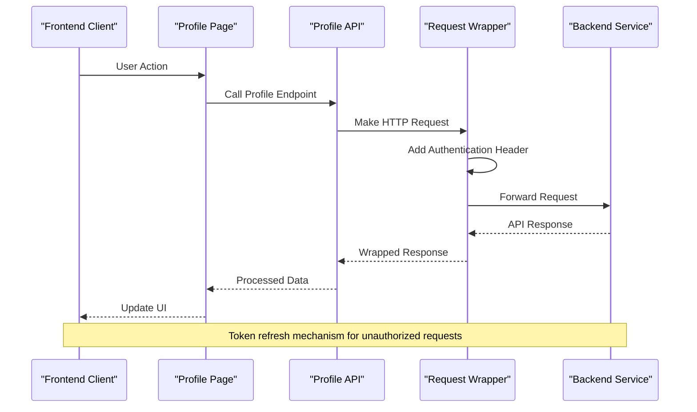

**Diagram sources**
- [request.ts:75-208](file://src/api/request.ts#L75-L208)
- [profile.ts:140-150](file://src/api/profile.ts#L140-L150)
- [user.ts:28-37](file://src/api/modules/user.ts#L28-L37)

The architecture ensures:
- Centralized request handling with automatic token management
- Type-safe API interactions through TypeScript interfaces
- Modular component design for maintainability
- Cloud storage integration for media management

**Section sources**
- [request.ts:1-228](file://src/api/request.ts#L1-L228)
- [profile.ts:1-311](file://src/api/profile.ts#L1-L311)
- [user.ts:1-101](file://src/api/modules/user.ts#L1-L101)

## Detailed Component Analysis

### Profile Management System
The profile management system encompasses multiple interconnected components:

#### Profile Data Model
The profile system uses a comprehensive data model supporting extensive personal information:

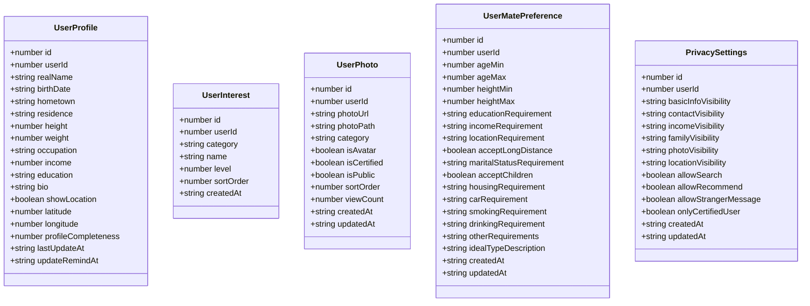

**Diagram sources**
- [profile.ts:5-129](file://src/api/profile.ts#L5-L129)
- [backend-types.ts:156-193](file://src/types/api/backend-types.ts#L156-L193)

#### Profile Completion Tracking
The system implements sophisticated profile completion tracking:

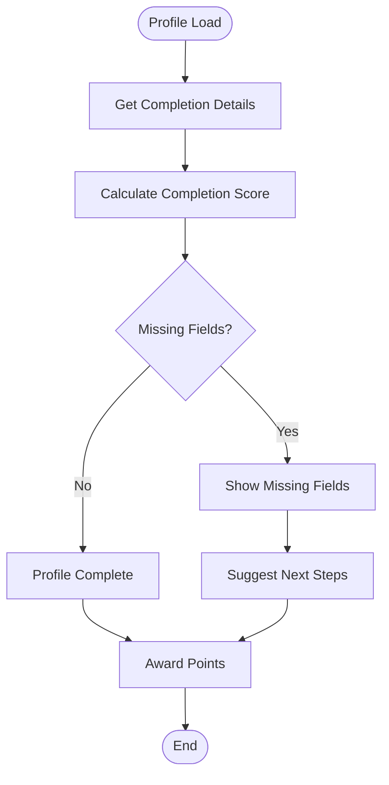

**Diagram sources**
- [edit.vue:239-275](file://src/pages/profile/edit.vue#L239-L275)

The completion system tracks:
- Personal information completeness
- Photo requirements (minimum 3 photos)
- Interest requirements (minimum 3 interests)
- Preference requirements
- Verification requirements

#### Photo Management System
The photo management system provides comprehensive media handling:

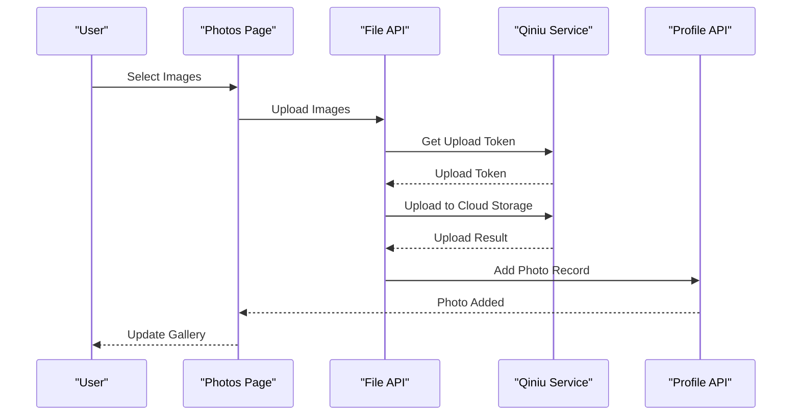

**Diagram sources**
- [photos.vue:134-179](file://src/pages/profile/photos.vue#L134-L179)
- [file.ts:90-230](file://src/api/modules/file.ts#L90-L230)
- [qiniu.service.ts:42-87](file://src/services/qiniu.service.ts#L42-L87)

Key features include:
- Multi-image upload support
- Automatic compression and validation
- Cloud storage integration (Qiniu)
- Thumbnail generation
- Sorting and organization
- Avatar selection

#### Privacy and Visibility Controls
The privacy system provides granular control over profile visibility:

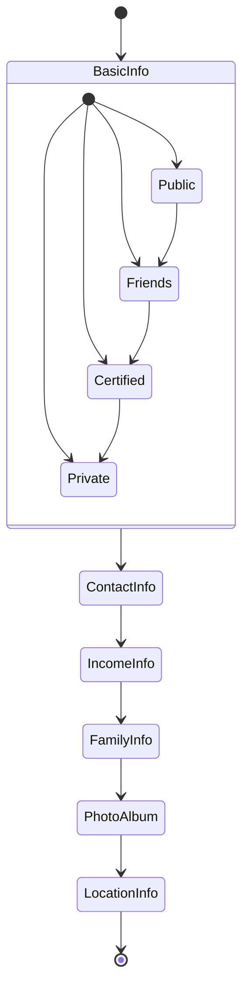

**Diagram sources**
- [privacy.vue:158-165](file://src/pages/profile/privacy.vue#L158-L165)

Privacy controls include:
- Information visibility levels (public, friends, certified, private)
- Interaction permissions (search, recommendations, messaging)
- Blacklist management
- Location sharing controls

#### Interest and Value Management
The system supports comprehensive interest and value tracking:

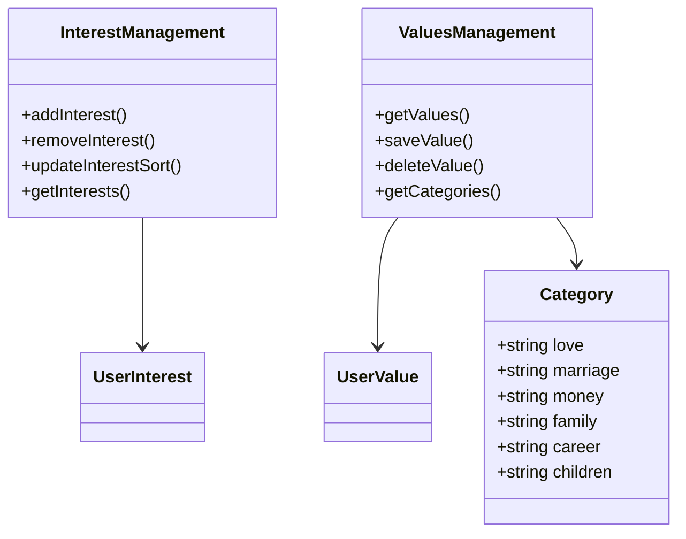

**Diagram sources**
- [interests.vue:189-200](file://src/pages/profile/interests.vue#L189-L200)
- [values.vue:232-258](file://src/pages/profile/values.vue#L232-L258)

**Section sources**
- [profile.ts:1-311](file://src/api/profile.ts#L1-L311)
- [backend-types.ts:1-764](file://src/types/api/backend-types.ts#L1-L764)
- [edit.vue:1-567](file://src/pages/profile/edit.vue#L1-L567)
- [photos.vue:1-505](file://src/pages/profile/photos.vue#L1-L505)
- [privacy.vue:1-494](file://src/pages/profile/privacy.vue#L1-L494)
- [interests.vue:1-645](file://src/pages/profile/interests.vue#L1-L645)
- [values.vue:1-599](file://src/pages/profile/values.vue#L1-L599)

### User Account Management
The user account management system handles essential account operations:

#### User Profile Updates
The user profile update system supports comprehensive personal information management:

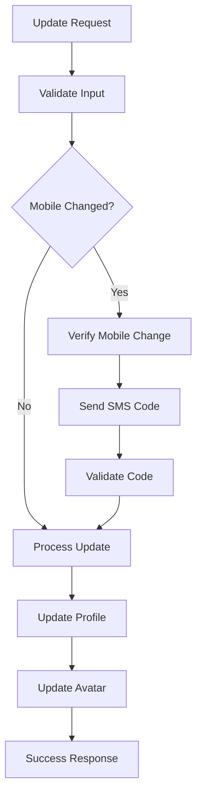

**Diagram sources**
- [user.ts:36-46](file://src/api/modules/user.ts#L36-L46)
- [user.ts:80-81](file://src/api/modules/user.ts#L80-L81)

#### Avatar Management
The avatar system integrates with both preset and custom avatar options:

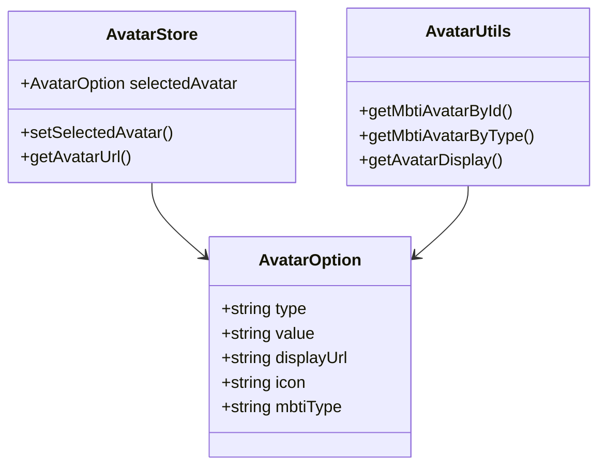

**Diagram sources**
- [avatar.ts:16-20](file://src/stores/avatar.ts#L16-L20)
- [avatar-utils.ts:53-92](file://src/utils/avatar.ts#L53-L92)

**Section sources**
- [user.ts:1-101](file://src/api/modules/user.ts#L1-L101)
- [avatar.ts:1-52](file://src/stores/avatar.ts#L1-L52)
- [avatar-utils.ts:1-93](file://src/utils/avatar.ts#L1-L93)

### Certification and Verification System
The certification system provides comprehensive identity verification:

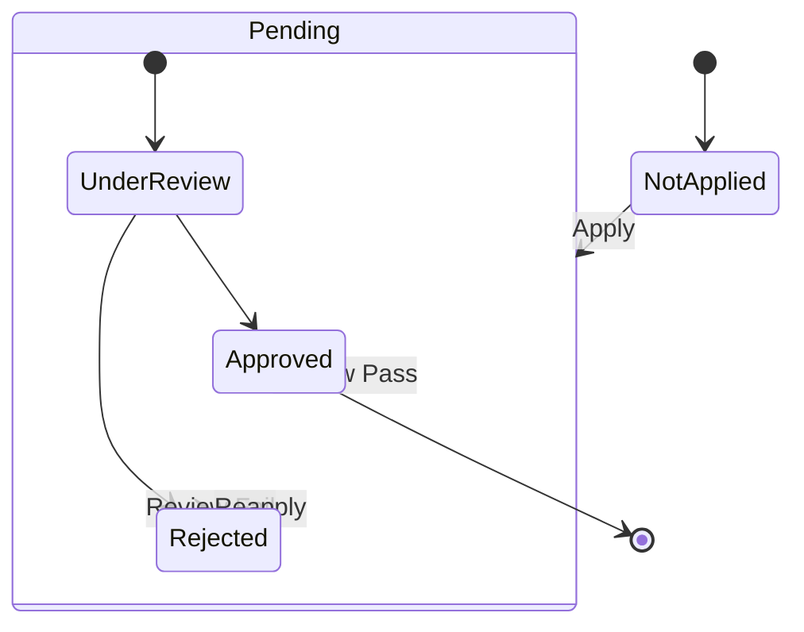

**Diagram sources**
- [certification.vue:318-329](file://src/pages/profile/certification.vue#L318-L329)

Supported certification types include:
- Identity verification (required)
- Education verification
- Occupation verification
- Income verification
- Property ownership verification
- Vehicle ownership verification
- Photo verification (required)

**Section sources**
- [profile.ts:279-310](file://src/api/profile.ts#L279-L310)
- [certification.vue:1-968](file://src/pages/profile/certification.vue#L1-L968)

## Dependency Analysis
The user profile module exhibits well-structured dependencies:

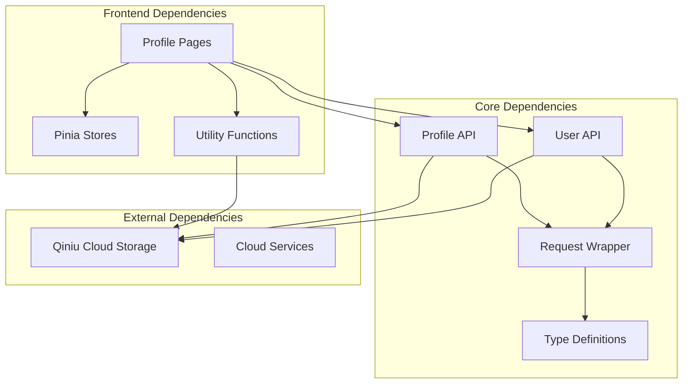

**Diagram sources**
- [profile.ts:1-3](file://src/api/profile.ts#L1-L3)
- [user.ts:1-3](file://src/api/modules/user.ts#L1-L3)
- [request.ts:1-3](file://src/api/request.ts#L1-L3)
- [file.ts:1-3](file://src/api/modules/file.ts#L1-L3)

Key dependency characteristics:
- Loose coupling between frontend pages and API layers
- Strong typing through TypeScript interfaces
- Centralized authentication and error handling
- Modular service architecture for cloud integrations

**Section sources**
- [profile.ts:1-311](file://src/api/profile.ts#L1-L311)
- [user.ts:1-101](file://src/api/modules/user.ts#L1-L101)
- [request.ts:1-228](file://src/api/request.ts#L1-L228)
- [file.ts:1-335](file://src/api/modules/file.ts#L1-L335)

## Performance Considerations
The user profile module implements several performance optimization strategies:

### Request Optimization
- Centralized request handling with automatic token refresh
- Batch operations for bulk updates
- Efficient pagination for large datasets
- Caching strategies for frequently accessed data

### Media Optimization
- Automatic image compression before upload
- CDN integration for optimized delivery
- Lazy loading for photo galleries
- Thumbnail generation for reduced bandwidth

### State Management
- Efficient component state updates
- Debounced input handling for forms
- Optimized rendering for large lists
- Memory management for image previews

## Troubleshooting Guide
Common issues and their solutions:

### Authentication Issues
- **Problem**: Unauthorized access errors
- **Solution**: Check token validity and refresh mechanism
- **Prevention**: Implement proper error handling for token expiration

### Upload Failures
- **Problem**: Image upload failures
- **Solution**: Verify file size limits and supported formats
- **Prevention**: Implement client-side validation before upload

### Data Synchronization
- **Problem**: Outdated profile information
- **Solution**: Implement proper data refresh after updates
- **Prevention**: Use optimistic updates with rollback mechanisms

### Privacy Setting Conflicts
- **Problem**: Unexpected privacy changes
- **Solution**: Validate setting combinations before applying
- **Prevention**: Implement conflict detection and resolution

**Section sources**
- [request.ts:100-147](file://src/api/request.ts#L100-L147)
- [file.ts:118-159](file://src/api/modules/file.ts#L118-L159)
- [privacy.vue:231-248](file://src/pages/profile/privacy.vue#L231-L248)

## Conclusion
The user profile module provides a comprehensive, well-architected solution for user profile management with strong emphasis on data validation, privacy controls, and user experience. The modular design enables easy maintenance and extension, while the type-safe implementation ensures reliability and consistency. The integration with cloud storage services and comprehensive privacy controls makes it suitable for production environments requiring robust user profile management capabilities.

The module successfully addresses all specified requirements including profile retrieval and updates, preferences management, privacy settings, verification processes, photo management, interest tagging, personal information handling, user search functionality, visibility controls, and account management APIs. The implementation demonstrates best practices in API design, error handling, and user experience optimization.