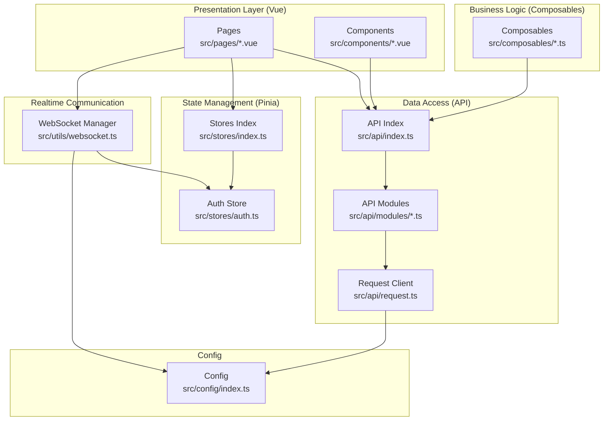
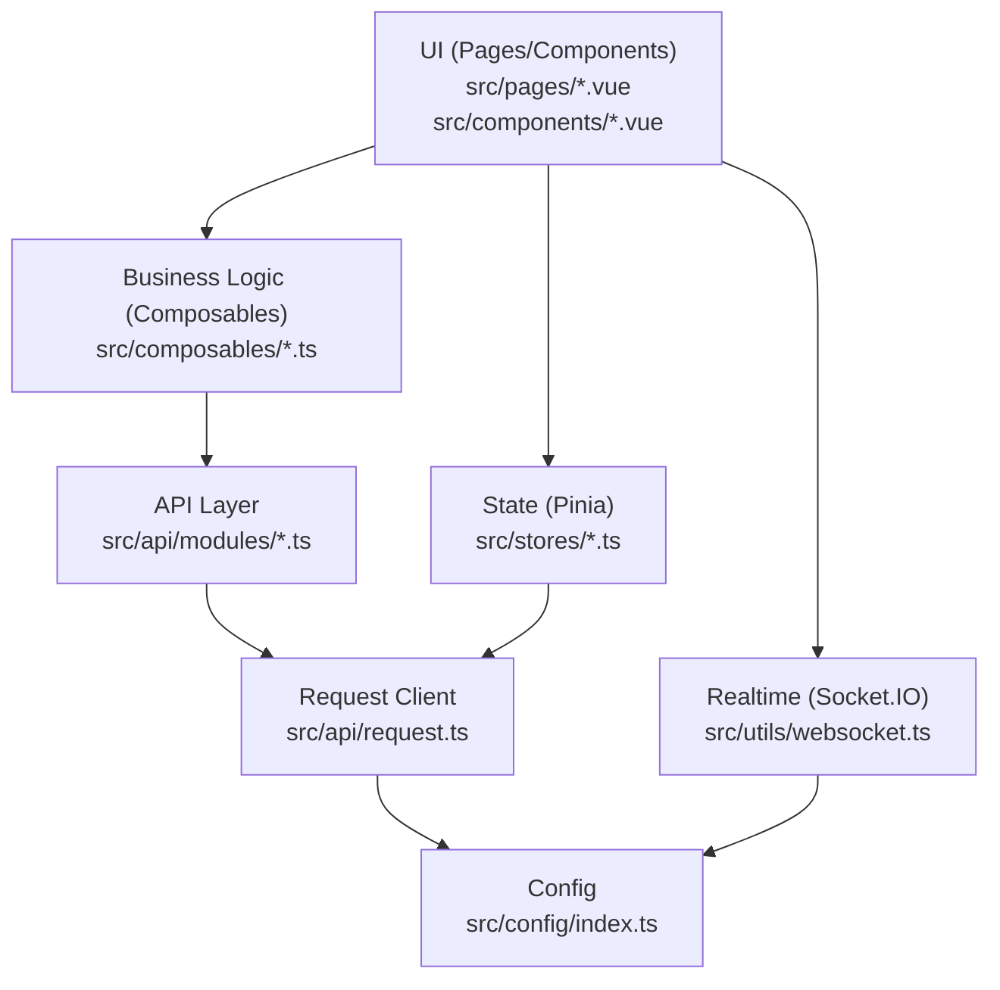
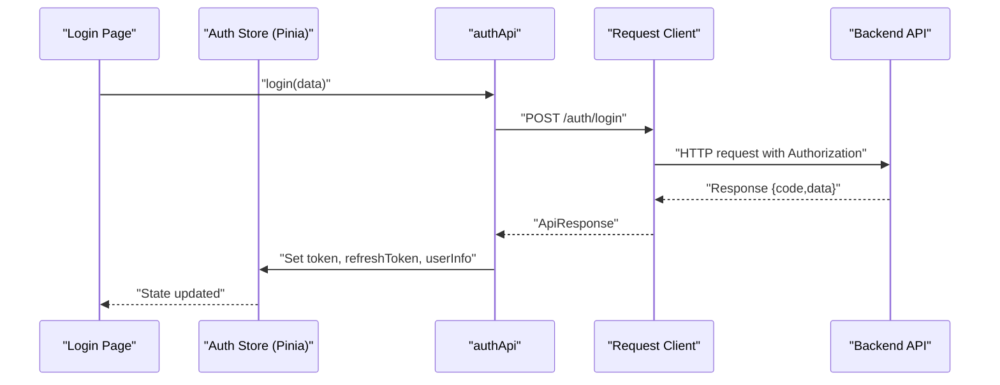
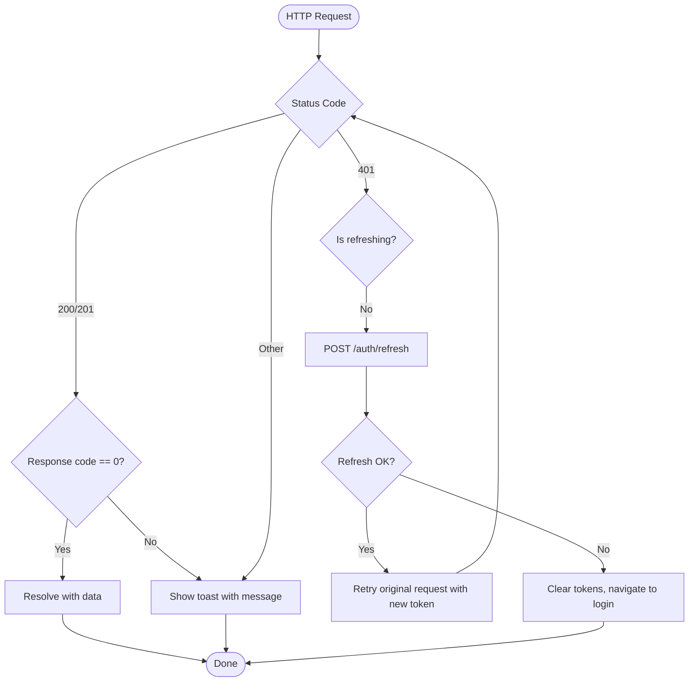
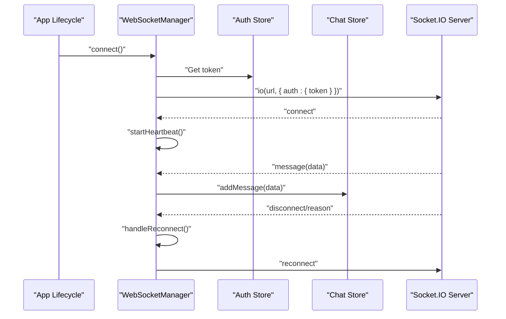
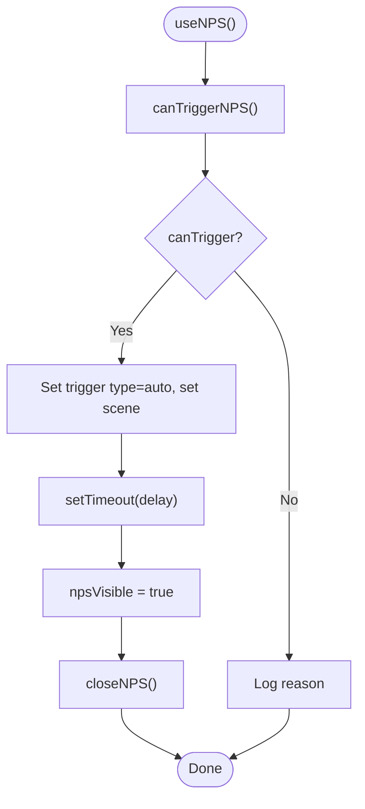
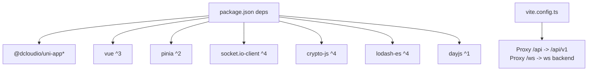

# Architecture Overview

<cite>
**Referenced Files in This Document**
- [src/main.ts](file://src/main.ts)
- [package.json](file://package.json)
- [vite.config.ts](file://vite.config.ts)
- [src/App.vue](file://src/App.vue)
- [src/pages.json](file://src/pages.json)
- [src/stores/index.ts](file://src/stores/index.ts)
- [src/stores/auth.ts](file://src/stores/auth.ts)
- [src/utils/websocket.ts](file://src/utils/websocket.ts)
- [src/api/request.ts](file://src/api/request.ts)
- [src/api/index.ts](file://src/api/index.ts)
- [src/api/modules/auth.ts](file://src/api/modules/auth.ts)
- [src/api/modules/chat.ts](file://src/api/modules/chat.ts)
- [src/config/index.ts](file://src/config/index.ts)
- [src/composables/useNPS.ts](file://src/composables/useNPS.ts)
</cite>

## Table of Contents
1. [Introduction](#introduction)
2. [Project Structure](#project-structure)
3. [Core Components](#core-components)
4. [Architecture Overview](#architecture-overview)
5. [Detailed Component Analysis](#detailed-component-analysis)
6. [Dependency Analysis](#dependency-analysis)
7. [Performance Considerations](#performance-considerations)
8. [Troubleshooting Guide](#troubleshooting-guide)
9. [Conclusion](#conclusion)

## Introduction
This document presents the architecture of the WeTogether platform built with the UniApp framework for cross-platform development. The solution leverages Vue 3 Composition API and TypeScript integration to deliver a component-based UI, layered architecture for separation of concerns, Pinia stores for state management, and Socket.IO for real-time communication. It also documents system boundaries, data flows across layers, integration patterns with external services, and cross-cutting concerns such as authentication, caching, and error handling.

## Project Structure
The project follows a feature-oriented structure under src with clear separation of concerns:
- Presentation layer: Vue single-file components organized by feature pages and shared components
- Business logic layer: Composables encapsulating reusable logic
- Data access layer: API modules and a centralized request client
- State management: Pinia stores for global state
- Real-time: WebSocket manager for Socket.IO connections
- Configuration: Environment-driven configuration for base URLs and timeouts

**Diagram sources**
- [src/pages.json:1-253](file://src/pages.json#L1-L253)
- [src/api/index.ts:1-10](file://src/api/index.ts#L1-L10)
- [src/api/request.ts:1-228](file://src/api/request.ts#L1-L228)
- [src/stores/index.ts:1-5](file://src/stores/index.ts#L1-L5)
- [src/stores/auth.ts:1-137](file://src/stores/auth.ts#L1-L137)
- [src/utils/websocket.ts:1-171](file://src/utils/websocket.ts#L1-L171)
- [src/config/index.ts:1-11](file://src/config/index.ts#L1-L11)

**Section sources**
- [src/pages.json:1-253](file://src/pages.json#L1-L253)
- [src/main.ts:1-18](file://src/main.ts#L1-L18)
- [package.json:1-100](file://package.json#L1-L100)

## Core Components
- Application bootstrap initializes the Vue app, Pinia, and persisted state plugin.
- Pages and tabbar define navigation and screen boundaries.
- Stores manage authentication state and persistence.
- API modules encapsulate backend contracts and HTTP requests.
- WebSocket manager handles real-time messaging with reconnection and heartbeat.
- Config centralizes environment-based base URLs and timeouts.

Key implementation references:
- App initialization and Pinia setup: [src/main.ts:1-18](file://src/main.ts#L1-L18)
- Pages and tabbar configuration: [src/pages.json:1-253](file://src/pages.json#L1-L253)
- Authentication store and persistence: [src/stores/auth.ts:1-137](file://src/stores/auth.ts#L1-L137)
- HTTP request client with token refresh: [src/api/request.ts:1-228](file://src/api/request.ts#L1-L228)
- API module exports and examples: [src/api/index.ts:1-10](file://src/api/index.ts#L1-L10), [src/api/modules/auth.ts:1-57](file://src/api/modules/auth.ts#L1-L57), [src/api/modules/chat.ts:1-42](file://src/api/modules/chat.ts#L1-L42)
- WebSocket manager: [src/utils/websocket.ts:1-171](file://src/utils/websocket.ts#L1-L171)
- Configuration: [src/config/index.ts:1-11](file://src/config/index.ts#L1-L11)

**Section sources**
- [src/main.ts:1-18](file://src/main.ts#L1-L18)
- [src/pages.json:1-253](file://src/pages.json#L1-L253)
- [src/stores/auth.ts:1-137](file://src/stores/auth.ts#L1-L137)
- [src/api/request.ts:1-228](file://src/api/request.ts#L1-L228)
- [src/api/index.ts:1-10](file://src/api/index.ts#L1-L10)
- [src/api/modules/auth.ts:1-57](file://src/api/modules/auth.ts#L1-L57)
- [src/api/modules/chat.ts:1-42](file://src/api/modules/chat.ts#L1-L42)
- [src/utils/websocket.ts:1-171](file://src/utils/websocket.ts#L1-L171)
- [src/config/index.ts:1-11](file://src/config/index.ts#L1-L11)

## Architecture Overview
The WeTogether architecture is layered and component-based:
- Presentation layer: Vue pages and components render UI and orchestrate composables.
- Business logic layer: Composables encapsulate cross-page logic (e.g., NPS).
- Data access layer: API modules call a unified request client that manages headers, retries, and token refresh.
- State management: Pinia stores manage global state with persisted state for offline resilience.
- Real-time layer: WebSocket manager connects via Socket.IO, emits heartbeats, and dispatches messages to stores.

**Diagram sources**
- [src/App.vue:1-103](file://src/App.vue#L1-L103)
- [src/composables/useNPS.ts:1-145](file://src/composables/useNPS.ts#L1-L145)
- [src/api/index.ts:1-10](file://src/api/index.ts#L1-L10)
- [src/api/request.ts:1-228](file://src/api/request.ts#L1-L228)
- [src/stores/index.ts:1-5](file://src/stores/index.ts#L1-L5)
- [src/stores/auth.ts:1-137](file://src/stores/auth.ts#L1-L137)
- [src/utils/websocket.ts:1-171](file://src/utils/websocket.ts#L1-L171)
- [src/config/index.ts:1-11](file://src/config/index.ts#L1-L11)

## Detailed Component Analysis

### Authentication Flow (Login, Registration, Refresh)
The authentication flow integrates UI actions, Pinia store updates, and HTTP requests with automatic token refresh.

**Diagram sources**
- [src/api/modules/auth.ts:33-49](file://src/api/modules/auth.ts#L33-L49)
- [src/api/request.ts:75-225](file://src/api/request.ts#L75-L225)
- [src/stores/auth.ts:18-42](file://src/stores/auth.ts#L18-L42)

**Section sources**
- [src/api/modules/auth.ts:1-57](file://src/api/modules/auth.ts#L1-L57)
- [src/api/request.ts:1-228](file://src/api/request.ts#L1-L228)
- [src/stores/auth.ts:1-137](file://src/stores/auth.ts#L1-L137)

### Token Refresh Mechanism
When a 401 Unauthorized response occurs, the request client refreshes the access token using the stored refresh token and retries the original request.

**Diagram sources**
- [src/api/request.ts:75-225](file://src/api/request.ts#L75-L225)

**Section sources**
- [src/api/request.ts:1-228](file://src/api/request.ts#L1-L228)

### Real-Time Messaging with Socket.IO
The WebSocket manager establishes a connection with authentication, handles events, and manages reconnection and heartbeat.

**Diagram sources**
- [src/utils/websocket.ts:15-141](file://src/utils/websocket.ts#L15-L141)
- [src/stores/auth.ts:12-26](file://src/stores/auth.ts#L12-L26)
- [src/stores/index.ts:1-5](file://src/stores/index.ts#L1-L5)

**Section sources**
- [src/utils/websocket.ts:1-171](file://src/utils/websocket.ts#L1-L171)
- [src/stores/auth.ts:1-137](file://src/stores/auth.ts#L1-L137)

### NPS Triggering Logic
The NPS composable checks eligibility and triggers modals with configurable scenes and delays.

**Diagram sources**
- [src/composables/useNPS.ts:18-38](file://src/composables/useNPS.ts#L18-L38)

**Section sources**
- [src/composables/useNPS.ts:1-145](file://src/composables/useNPS.ts#L1-L145)

## Dependency Analysis
External dependencies and integrations:
- UniApp runtime and platform-specific packages for cross-platform targets
- Vue 3 and Pinia for reactive UI and state management
- Socket.IO client for real-time communication
- Crypto utilities for hashing and secure operations
- Vite with @dcloudio plugin for building and proxying

**Diagram sources**
- [package.json:45-78](file://package.json#L45-L78)
- [vite.config.ts:29-46](file://vite.config.ts#L29-L46)

**Section sources**
- [package.json:1-100](file://package.json#L1-L100)
- [vite.config.ts:1-49](file://vite.config.ts#L1-L49)

## Performance Considerations
- Network optimization: The request client consolidates headers and token management, reducing duplication and enabling centralized retry logic.
- Real-time efficiency: Heartbeat intervals and transport selection balance reliability and bandwidth usage.
- Build-time optimization: Vite’s dependency optimization and CommonJS inclusion improve startup performance for Socket.IO and related libraries.
- Storage persistence: Pinia persisted state reduces redundant network calls after app restarts.

[No sources needed since this section provides general guidance]

## Troubleshooting Guide
Common areas to inspect:
- Authentication failures: Verify token presence and refresh flow in the request client and auth store.
- Real-time connectivity: Check WebSocket manager logs for connection errors, reconnection attempts, and heartbeat status.
- API routing: Confirm proxy settings in Vite for /api and /ws paths and base URLs in configuration.
- UI navigation: Review pages.json for route definitions and tabbar configurations.

**Section sources**
- [src/api/request.ts:100-148](file://src/api/request.ts#L100-L148)
- [src/utils/websocket.ts:78-91](file://src/utils/websocket.ts#L78-L91)
- [vite.config.ts:29-46](file://vite.config.ts#L29-L46)
- [src/config/index.ts:1-11](file://src/config/index.ts#L1-L11)
- [src/pages.json:1-253](file://src/pages.json#L1-L253)

## Conclusion
WeTogether employs a clean, layered architecture with Vue 3 Composition API and TypeScript to support a robust, cross-platform mobile application. The separation of concerns across presentation, business logic, data access, state management, and real-time communication enables maintainability and scalability. The design choices—such as Pinia for state, a centralized request client with token refresh, and Socket.IO for real-time—provide strong foundations for future enhancements while keeping cross-cutting concerns explicit and testable.