# Business Components

<cite>
**Referenced Files in This Document**
- [AvatarDisplay.vue](file://src/components/business/AvatarDisplay.vue)
- [AvatarSelector.vue](file://src/components/business/AvatarSelector.vue)
- [BilibiliComment.vue](file://src/components/business/BilibiliComment.vue)
- [CitySelector.vue](file://src/components/business/CitySelector.vue)
- [CommentInput.vue](file://src/components/business/CommentInput.vue)
- [CommentItem.vue](file://src/components/business/CommentItem.vue)
- [MessageBubble.vue](file://src/components/business/MessageBubble.vue)
- [NPSModal.vue](file://src/components/business/NPSModal.vue)
- [PostCard.vue](file://src/components/business/PostCard.vue)
- [avatar.ts](file://src/stores/avatar.ts)
- [avatar.ts](file://src/types/avatar.ts)
- [cities.ts](file://src/constants/cities.ts)
- [avatar.ts](file://src/utils/avatar.ts)
- [useNPS.ts](file://src/composables/useNPS.ts)
- [square.ts](file://src/api/modules/square.ts)
- [detail.vue](file://src/pages/chat/detail.vue)
</cite>

## Table of Contents
1. [Introduction](#introduction)
2. [Project Structure](#project-structure)
3. [Core Components](#core-components)
4. [Architecture Overview](#architecture-overview)
5. [Detailed Component Analysis](#detailed-component-analysis)
6. [Dependency Analysis](#dependency-analysis)
7. [Performance Considerations](#performance-considerations)
8. [Troubleshooting Guide](#troubleshooting-guide)
9. [Conclusion](#conclusion)

## Introduction
This document provides comprehensive documentation for the business components that implement core social networking functionality. It covers component purpose, props interface, emitted events, styling approaches, and integration patterns. The components documented here include AvatarDisplay and AvatarSelector for user avatar management, BilibiliComment for embedded video comments, CitySelector for location-based features, CommentInput and CommentItem for social interactions, MessageBubble for chat UI, NPSModal for customer satisfaction surveys, and PostCard for content display. Guidance is also provided on component composition, styling, and integration with the recommendation system and real-time messaging features.

## Project Structure
The business components reside under the business folder and integrate with shared utilities, stores, and APIs:
- Stores manage global state (e.g., avatar selection).
- Utilities provide helper functions (e.g., avatar display resolution).
- Constants define city data and searchable indices.
- Composables encapsulate cross-cutting concerns (e.g., NPS triggering logic).
- Pages demonstrate integration with real-time messaging and recommendation systems.

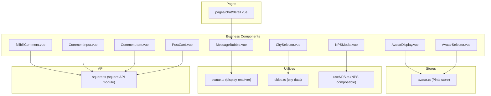

**Diagram sources**
- [AvatarDisplay.vue:1-87](file://src/components/business/AvatarDisplay.vue#L1-L87)
- [AvatarSelector.vue:1-286](file://src/components/business/AvatarSelector.vue#L1-L286)
- [BilibiliComment.vue:1-741](file://src/components/business/BilibiliComment.vue#L1-L741)
- [CitySelector.vue:1-521](file://src/components/business/CitySelector.vue#L1-L521)
- [CommentInput.vue:1-123](file://src/components/business/CommentInput.vue#L1-L123)
- [CommentItem.vue:1-187](file://src/components/business/CommentItem.vue#L1-L187)
- [MessageBubble.vue:1-309](file://src/components/business/MessageBubble.vue#L1-L309)
- [NPSModal.vue:1-550](file://src/components/business/NPSModal.vue#L1-L550)
- [PostCard.vue:1-628](file://src/components/business/PostCard.vue#L1-L628)
- [avatar.ts:1-52](file://src/stores/avatar.ts#L1-L52)
- [avatar.ts:1-93](file://src/utils/avatar.ts#L1-L93)
- [cities.ts:1-186](file://src/constants/cities.ts#L1-L186)
- [useNPS.ts:1-145](file://src/composables/useNPS.ts#L1-L145)
- [square.ts:1-98](file://src/api/modules/square.ts#L1-L98)
- [detail.vue:1-200](file://src/pages/chat/detail.vue#L1-L200)

**Section sources**
- [AvatarDisplay.vue:1-87](file://src/components/business/AvatarDisplay.vue#L1-L87)
- [AvatarSelector.vue:1-286](file://src/components/business/AvatarSelector.vue#L1-L286)
- [BilibiliComment.vue:1-741](file://src/components/business/BilibiliComment.vue#L1-L741)
- [CitySelector.vue:1-521](file://src/components/business/CitySelector.vue#L1-L521)
- [CommentInput.vue:1-123](file://src/components/business/CommentInput.vue#L1-L123)
- [CommentItem.vue:1-187](file://src/components/business/CommentItem.vue#L1-L187)
- [MessageBubble.vue:1-309](file://src/components/business/MessageBubble.vue#L1-L309)
- [NPSModal.vue:1-550](file://src/components/business/NPSModal.vue#L1-L550)
- [PostCard.vue:1-628](file://src/components/business/PostCard.vue#L1-L628)
- [avatar.ts:1-52](file://src/stores/avatar.ts#L1-L52)
- [avatar.ts:1-93](file://src/utils/avatar.ts#L1-L93)
- [cities.ts:1-186](file://src/constants/cities.ts#L1-L186)
- [useNPS.ts:1-145](file://src/composables/useNPS.ts#L1-L145)
- [square.ts:1-98](file://src/api/modules/square.ts#L1-L98)
- [detail.vue:1-200](file://src/pages/chat/detail.vue#L1-L200)

## Core Components
This section summarizes the purpose, props, events, and integration patterns for each component.

- AvatarDisplay
  - Purpose: Renders the currently selected avatar and emits a select event to open the selector.
  - Props: None.
  - Events: select.
  - Integration: Uses avatar store to resolve display type and triggers AvatarSelector.

- AvatarSelector
  - Purpose: Allows users to pick a preset or custom avatar and confirms selection.
  - Props: None.
  - Events: confirm(AvatarOption), cancel.
  - Integration: Persists selection via avatar store and emits confirm with chosen option.

- BilibiliComment
  - Purpose: Implements a comment thread with nested replies, likes, deletion, and pagination.
  - Props: postId, postAuthorId?.
  - Events: success, delete.
  - Integration: Uses square API module for fetching comments/replies, toggling likes, and creating/deleting comments.

- CitySelector
  - Purpose: Provides a modal for selecting a city with search, geolocation, and alphabetical indexing.
  - Props: visible, currentCity?.
  - Events: close, select(cityName).
  - Integration: Uses city constants for hot/all cities and searchable initials; persists city via API.

- CommentInput
  - Purpose: Lightweight input for posting comments with debounced submission.
  - Props: postId, replyToComment?.
  - Events: success.
  - Integration: Uses square API module to create comments.

- CommentItem
  - Purpose: Renders a single comment with nested replies and action buttons.
  - Props: comment.
  - Events: reply(comment).
  - Integration: Loads replies via square API and supports pagination.

- MessageBubble
  - Purpose: Renders individual chat messages with sender/receiver avatar display and retry actions.
  - Props: message, showTime?.
  - Events: retry(messageId).
  - Integration: Resolves avatar display using avatar utility; integrates with chat store and WebSocket.

- NPSModal
  - Purpose: Collects Net Promoter Score feedback with dynamic steps and tags.
  - Props: visible, triggerType?, triggerScene?.
  - Events: close, success(feedback).
  - Integration: Uses NPS composable for triggering and submits via API.

- PostCard
  - Purpose: Displays user posts with images, likes, comments, shares, and reporting actions.
  - Props: post.
  - Events: click, like, comment, share, report(reason), delete.
  - Integration: Uses square API for likes, comments, and reports; handles image previews and animations.

**Section sources**
- [AvatarDisplay.vue:1-87](file://src/components/business/AvatarDisplay.vue#L1-L87)
- [AvatarSelector.vue:1-286](file://src/components/business/AvatarSelector.vue#L1-L286)
- [BilibiliComment.vue:1-741](file://src/components/business/BilibiliComment.vue#L1-L741)
- [CitySelector.vue:1-521](file://src/components/business/CitySelector.vue#L1-L521)
- [CommentInput.vue:1-123](file://src/components/business/CommentInput.vue#L1-L123)
- [CommentItem.vue:1-187](file://src/components/business/CommentItem.vue#L1-L187)
- [MessageBubble.vue:1-309](file://src/components/business/MessageBubble.vue#L1-L309)
- [NPSModal.vue:1-550](file://src/components/business/NPSModal.vue#L1-L550)
- [PostCard.vue:1-628](file://src/components/business/PostCard.vue#L1-L628)
- [avatar.ts:1-52](file://src/stores/avatar.ts#L1-L52)
- [avatar.ts:1-93](file://src/utils/avatar.ts#L1-L93)
- [cities.ts:1-186](file://src/constants/cities.ts#L1-L186)
- [useNPS.ts:1-145](file://src/composables/useNPS.ts#L1-L145)
- [square.ts:1-98](file://src/api/modules/square.ts#L1-L98)

## Architecture Overview
The business components integrate with stores, utilities, and APIs to deliver cohesive social experiences. Real-time messaging is integrated in the chat detail page, while recommendation-related UI is present in the home tabs. The NPS modal is triggered via a composable and emits success events for downstream actions.

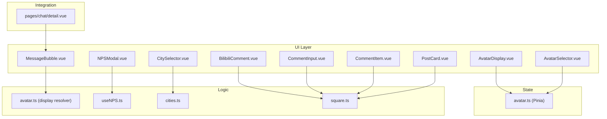

**Diagram sources**
- [MessageBubble.vue:1-309](file://src/components/business/MessageBubble.vue#L1-L309)
- [BilibiliComment.vue:1-741](file://src/components/business/BilibiliComment.vue#L1-L741)
- [PostCard.vue:1-628](file://src/components/business/PostCard.vue#L1-L628)
- [CitySelector.vue:1-521](file://src/components/business/CitySelector.vue#L1-L521)
- [NPSModal.vue:1-550](file://src/components/business/NPSModal.vue#L1-L550)
- [AvatarDisplay.vue:1-87](file://src/components/business/AvatarDisplay.vue#L1-L87)
- [AvatarSelector.vue:1-286](file://src/components/business/AvatarSelector.vue#L1-L286)
- [CommentInput.vue:1-123](file://src/components/business/CommentInput.vue#L1-L123)
- [CommentItem.vue:1-187](file://src/components/business/CommentItem.vue#L1-L187)
- [avatar.ts:1-52](file://src/stores/avatar.ts#L1-L52)
- [avatar.ts:1-93](file://src/utils/avatar.ts#L1-L93)
- [cities.ts:1-186](file://src/constants/cities.ts#L1-L186)
- [useNPS.ts:1-145](file://src/composables/useNPS.ts#L1-L145)
- [square.ts:1-98](file://src/api/modules/square.ts#L1-L98)
- [detail.vue:1-200](file://src/pages/chat/detail.vue#L1-L200)

## Detailed Component Analysis

### AvatarDisplay
- Purpose: Render the current avatar and notify parent to open the selector.
- Props: None.
- Events: select.
- Implementation highlights:
  - Reads selected avatar from avatar store.
  - Emits select on click to trigger parent behavior.
- Styling: Uses SCSS with avatar-specific styles and overlay editing indicator.

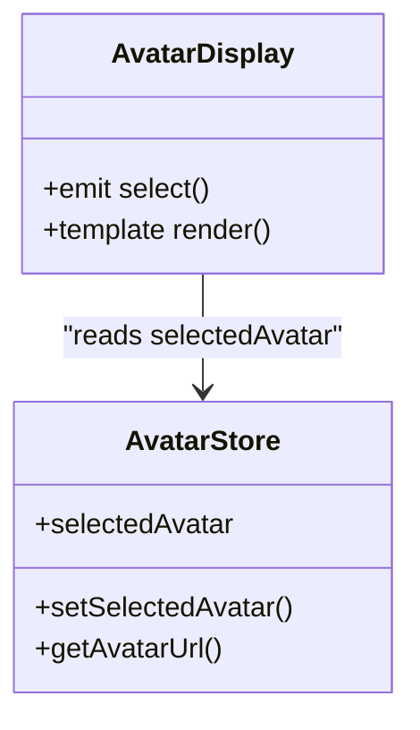

**Diagram sources**
- [AvatarDisplay.vue:1-87](file://src/components/business/AvatarDisplay.vue#L1-L87)
- [avatar.ts:1-52](file://src/stores/avatar.ts#L1-L52)

**Section sources**
- [AvatarDisplay.vue:1-87](file://src/components/business/AvatarDisplay.vue#L1-L87)
- [avatar.ts:1-52](file://src/stores/avatar.ts#L1-L52)

### AvatarSelector
- Purpose: Modal for choosing preset or custom avatar.
- Props: None.
- Events: confirm(AvatarOption), cancel.
- Implementation highlights:
  - Tabs switch between preset grid and custom upload area.
  - Preview and confirm flow updates avatar store.
- Styling: Modal overlay, tabs, upload area, and action buttons styled with SCSS.

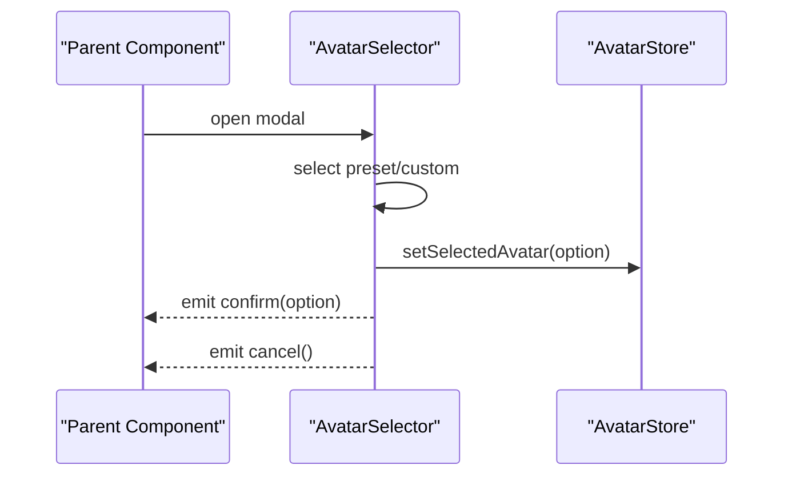

**Diagram sources**
- [AvatarSelector.vue:1-286](file://src/components/business/AvatarSelector.vue#L1-L286)
- [avatar.ts:1-52](file://src/stores/avatar.ts#L1-L52)

**Section sources**
- [AvatarSelector.vue:1-286](file://src/components/business/AvatarSelector.vue#L1-L286)
- [avatar.ts:1-52](file://src/stores/avatar.ts#L1-L52)

### BilibiliComment
- Purpose: Full-featured comment thread with nested replies, likes, deletion, and pagination.
- Props: postId, postAuthorId?.
- Events: success, delete.
- Implementation highlights:
  - Fetches comments and replies via square API.
  - Optimistic UI updates for likes with rollback on failure.
  - Supports reply-to-comment and root-reply logic.
- Styling: Comprehensive SCSS for input area, comment items, replies, and actions.

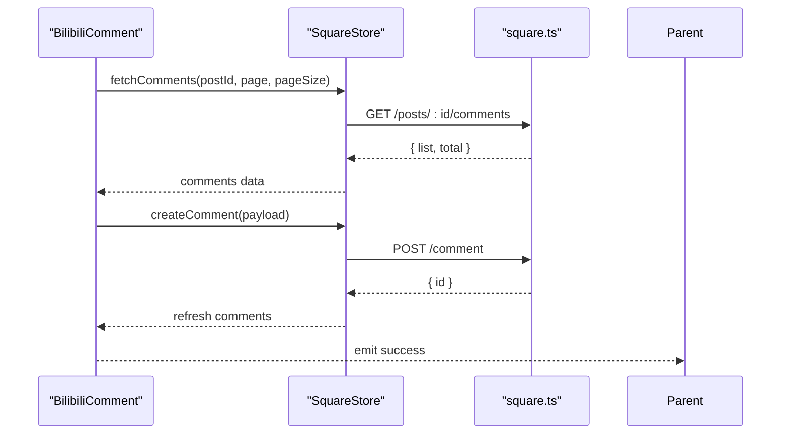

**Diagram sources**
- [BilibiliComment.vue:1-741](file://src/components/business/BilibiliComment.vue#L1-L741)
- [square.ts:1-98](file://src/api/modules/square.ts#L1-L98)

**Section sources**
- [BilibiliComment.vue:1-741](file://src/components/business/BilibiliComment.vue#L1-L741)
- [square.ts:1-98](file://src/api/modules/square.ts#L1-L98)

### CitySelector
- Purpose: City selection modal with search, geolocation, and alphabetical index.
- Props: visible, currentCity?.
- Events: close, select(cityName).
- Implementation highlights:
  - Search cities using constant helpers.
  - Geolocation via UniApp API and reverse-geocoding via backend.
  - Saves city preference via API.
- Styling: Modal with header, search box, location section, results list, and index bar.

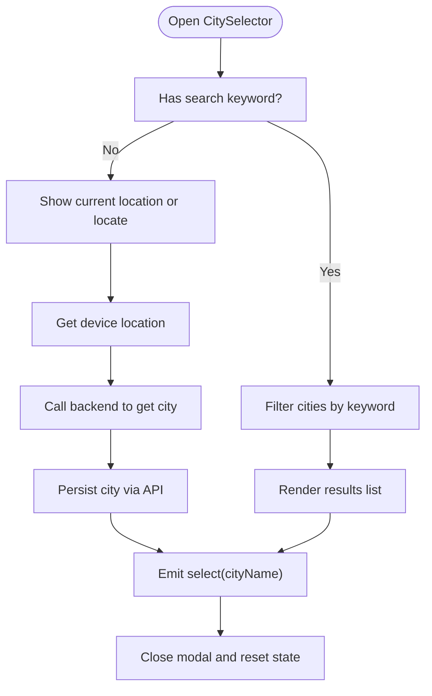

**Diagram sources**
- [CitySelector.vue:1-521](file://src/components/business/CitySelector.vue#L1-L521)
- [cities.ts:1-186](file://src/constants/cities.ts#L1-L186)

**Section sources**
- [CitySelector.vue:1-521](file://src/components/business/CitySelector.vue#L1-L521)
- [cities.ts:1-186](file://src/constants/cities.ts#L1-L186)

### CommentInput
- Purpose: Lightweight comment input with debounced submission.
- Props: postId, replyToComment?.
- Events: success.
- Implementation highlights:
  - Debounces send button state and text.
  - Builds payload with parentId/replyTo fields based on reply context.
- Styling: Minimal rounded input and gradient send button.

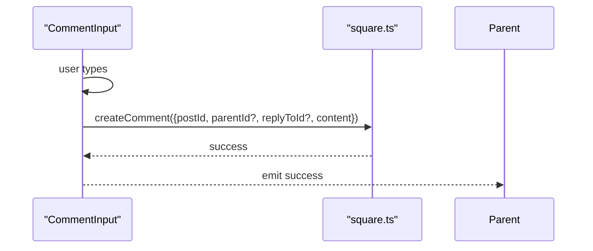

**Diagram sources**
- [CommentInput.vue:1-123](file://src/components/business/CommentInput.vue#L1-L123)
- [square.ts:1-98](file://src/api/modules/square.ts#L1-L98)

**Section sources**
- [CommentInput.vue:1-123](file://src/components/business/CommentInput.vue#L1-L123)
- [square.ts:1-98](file://src/api/modules/square.ts#L1-L98)

### CommentItem
- Purpose: Renders a single comment with nested replies and actions.
- Props: comment.
- Events: reply(comment).
- Implementation highlights:
  - Toggles reply expansion and loads replies on demand.
  - Supports pagination for replies.
- Styling: Avatar, header, text, and action buttons with SCSS.

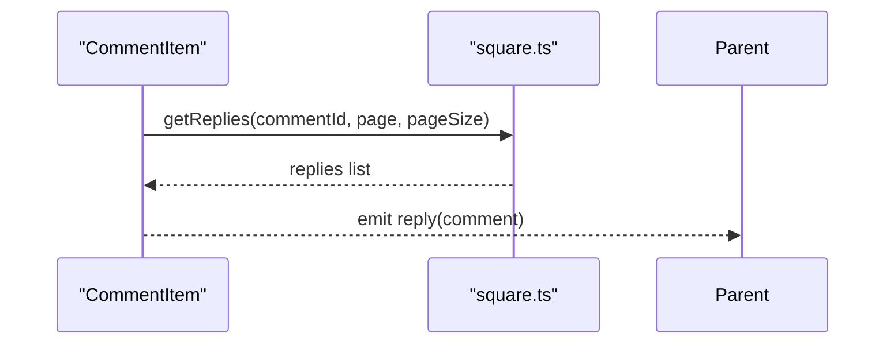

**Diagram sources**
- [CommentItem.vue:1-187](file://src/components/business/CommentItem.vue#L1-L187)
- [square.ts:1-98](file://src/api/modules/square.ts#L1-L98)

**Section sources**
- [CommentItem.vue:1-187](file://src/components/business/CommentItem.vue#L1-L187)
- [square.ts:1-98](file://src/api/modules/square.ts#L1-L98)

### MessageBubble
- Purpose: Chat message bubble with sender/receiver avatar display and retry actions.
- Props: message, showTime?.
- Events: retry(messageId).
- Implementation highlights:
  - Determines self vs other message and resolves avatar display.
  - Animates entry and shows send status indicators.
- Styling: Flex layout with avatar, content wrapper, and status indicators.

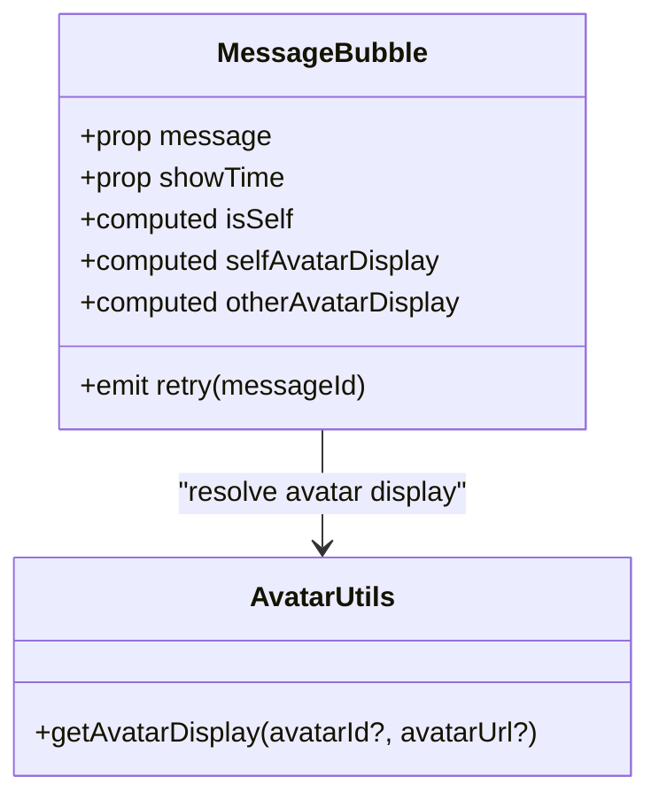

**Diagram sources**
- [MessageBubble.vue:1-309](file://src/components/business/MessageBubble.vue#L1-L309)
- [avatar.ts:1-93](file://src/utils/avatar.ts#L1-L93)

**Section sources**
- [MessageBubble.vue:1-309](file://src/components/business/MessageBubble.vue#L1-L309)
- [avatar.ts:1-93](file://src/utils/avatar.ts#L1-L93)

### NPSModal
- Purpose: Multi-step NPS feedback collection with dynamic tags and reward calculation.
- Props: visible, triggerType?, triggerScene?.
- Events: close, success(feedback).
- Implementation highlights:
  - Step 1: Score selection with active state.
  - Step 2: Feedback text with character count and optional tags.
  - Step 3: Success screen with points reward.
  - Triggered via useNPS composable with configurable scenes.
- Styling: Modal overlay, step containers, score grid, textarea, tags, and action buttons.

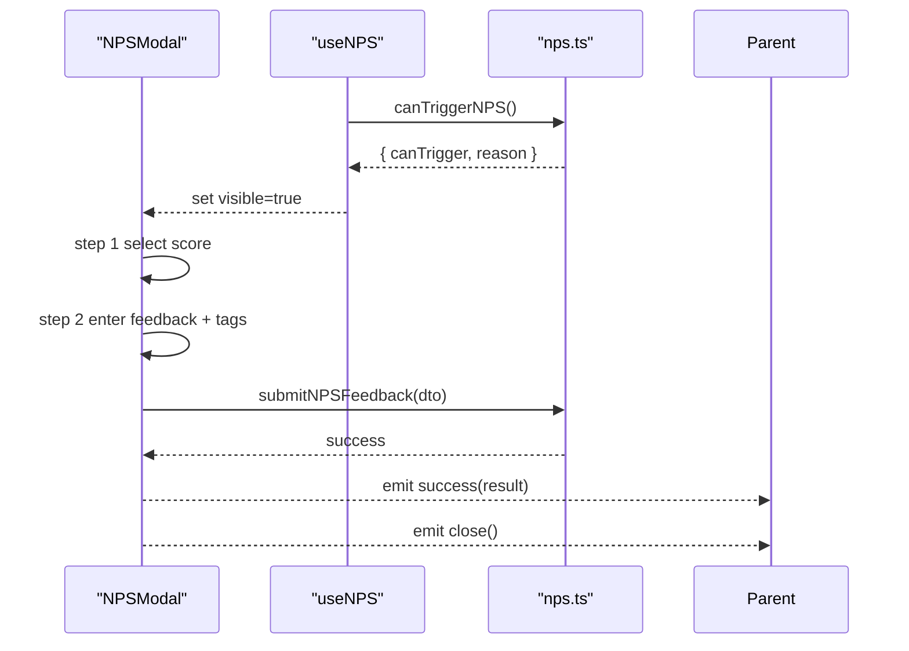

**Diagram sources**
- [NPSModal.vue:1-550](file://src/components/business/NPSModal.vue#L1-L550)
- [useNPS.ts:1-145](file://src/composables/useNPS.ts#L1-L145)

**Section sources**
- [NPSModal.vue:1-550](file://src/components/business/NPSModal.vue#L1-L550)
- [useNPS.ts:1-145](file://src/composables/useNPS.ts#L1-L145)

### PostCard
- Purpose: Displays user posts with images, actions, and reporting.
- Props: post.
- Events: click, like, comment, share, report(reason), delete.
- Implementation highlights:
  - Handles image preview and lazy-loading placeholders.
  - Animations for like actions and particle effects.
  - Action sheet for delete/report with modal for detailed report.
- Styling: Grid of images, action bar, animations, and modal overlay.

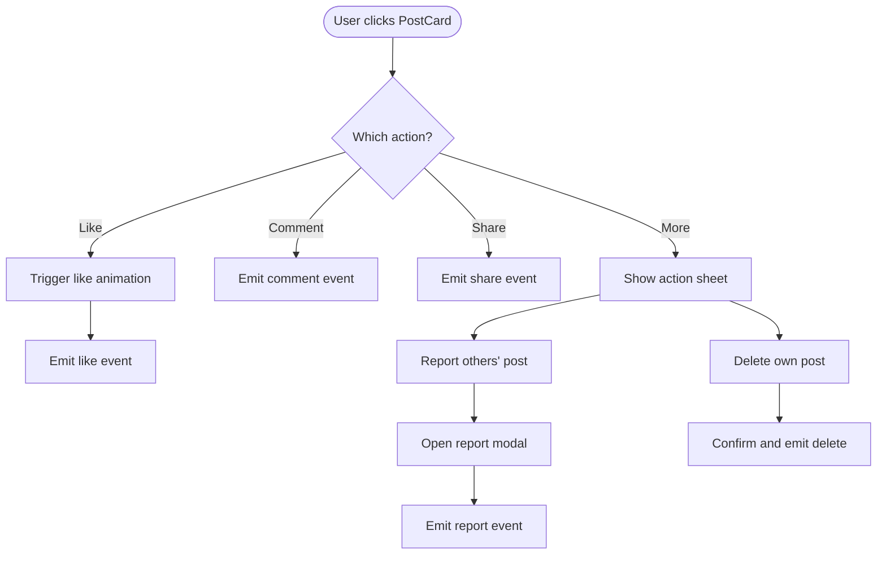

**Diagram sources**
- [PostCard.vue:1-628](file://src/components/business/PostCard.vue#L1-L628)

**Section sources**
- [PostCard.vue:1-628](file://src/components/business/PostCard.vue#L1-L628)

## Dependency Analysis
This section maps dependencies among components and external modules.

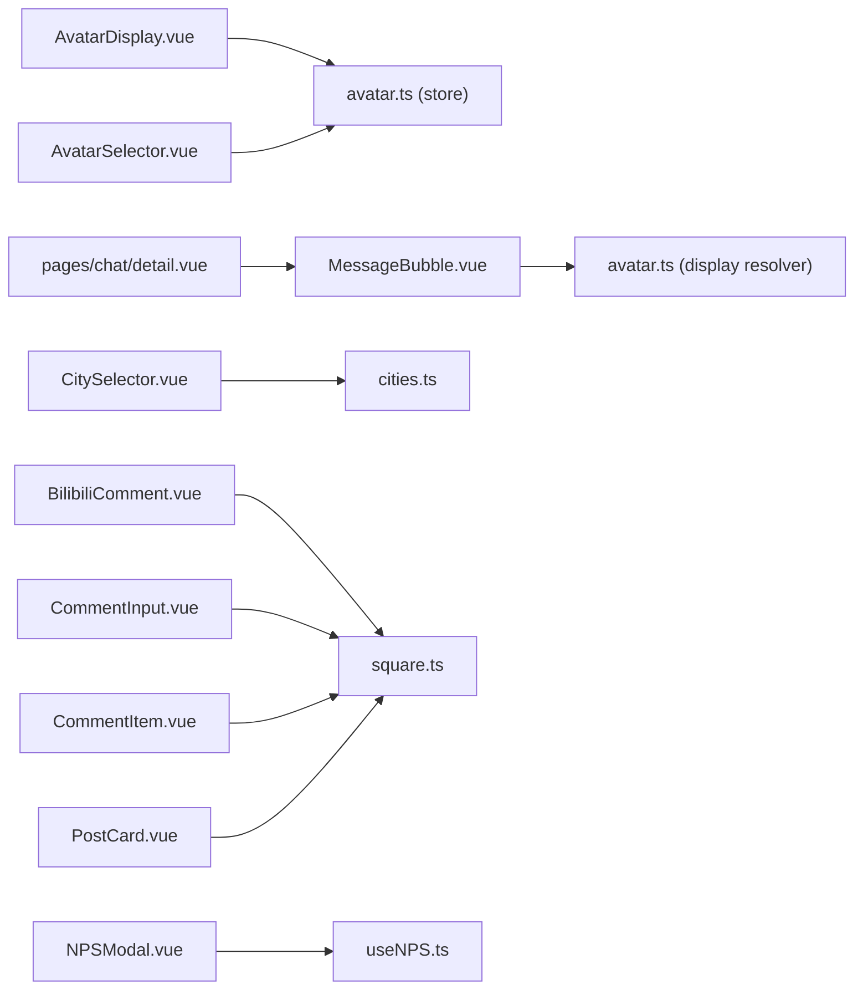

**Diagram sources**
- [AvatarDisplay.vue:1-87](file://src/components/business/AvatarDisplay.vue#L1-L87)
- [AvatarSelector.vue:1-286](file://src/components/business/AvatarSelector.vue#L1-L286)
- [MessageBubble.vue:1-309](file://src/components/business/MessageBubble.vue#L1-L309)
- [CitySelector.vue:1-521](file://src/components/business/CitySelector.vue#L1-L521)
- [BilibiliComment.vue:1-741](file://src/components/business/BilibiliComment.vue#L1-L741)
- [CommentInput.vue:1-123](file://src/components/business/CommentInput.vue#L1-L123)
- [CommentItem.vue:1-187](file://src/components/business/CommentItem.vue#L1-L187)
- [PostCard.vue:1-628](file://src/components/business/PostCard.vue#L1-L628)
- [NPSModal.vue:1-550](file://src/components/business/NPSModal.vue#L1-L550)
- [avatar.ts:1-52](file://src/stores/avatar.ts#L1-L52)
- [avatar.ts:1-93](file://src/utils/avatar.ts#L1-L93)
- [cities.ts:1-186](file://src/constants/cities.ts#L1-L186)
- [square.ts:1-98](file://src/api/modules/square.ts#L1-L98)
- [useNPS.ts:1-145](file://src/composables/useNPS.ts#L1-L145)
- [detail.vue:1-200](file://src/pages/chat/detail.vue#L1-L200)

**Section sources**
- [avatar.ts:1-52](file://src/stores/avatar.ts#L1-L52)
- [avatar.ts:1-93](file://src/utils/avatar.ts#L1-L93)
- [cities.ts:1-186](file://src/constants/cities.ts#L1-L186)
- [square.ts:1-98](file://src/api/modules/square.ts#L1-L98)
- [useNPS.ts:1-145](file://src/composables/useNPS.ts#L1-L145)
- [detail.vue:1-200](file://src/pages/chat/detail.vue#L1-L200)

## Performance Considerations
- Virtualization and lazy loading:
  - Post images use lazy-load and shimmer placeholders to reduce initial load.
  - Infinite scrolling for comments and replies reduces memory footprint.
- Debouncing:
  - Comment submission and message sending use debounced button states to prevent rapid repeated actions.
- Optimistic UI:
  - Likes update immediately and roll back on failure to improve perceived responsiveness.
- Rendering:
  - MessageBubble uses minimal reflows and CSS animations for smooth transitions.
- Network checks:
  - Network status composable prevents actions when offline or network conditions are poor.

[No sources needed since this section provides general guidance]

## Troubleshooting Guide
- Avatar selection not persisting:
  - Verify avatar store persistence is enabled and setSelectedAvatar is called after selection.
- City selection fails:
  - Check geolocation permissions and error handling for location API failures.
- Comment submission errors:
  - Ensure network connectivity and validate payload fields (postId, replyToId, parentId).
- Message retry:
  - Confirm retry handler dispatches send action with original content.
- NPS submission blocked:
  - Validate minimum character count and score selection before submission.

**Section sources**
- [avatar.ts:1-52](file://src/stores/avatar.ts#L1-L52)
- [CitySelector.vue:1-521](file://src/components/business/CitySelector.vue#L1-L521)
- [BilibiliComment.vue:1-741](file://src/components/business/BilibiliComment.vue#L1-L741)
- [MessageBubble.vue:1-309](file://src/components/business/MessageBubble.vue#L1-L309)
- [NPSModal.vue:1-550](file://src/components/business/NPSModal.vue#L1-L550)

## Conclusion
These business components form the backbone of social interactions, identity management, location features, real-time messaging, and feedback collection. They are designed with clear separation of concerns, robust integration patterns, and thoughtful UX enhancements. By leveraging stores, utilities, and APIs, they support scalable and maintainable social networking features across the platform.