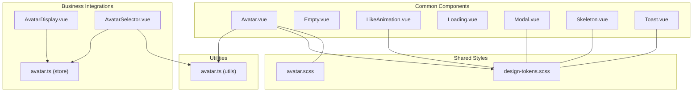
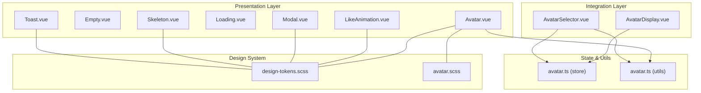
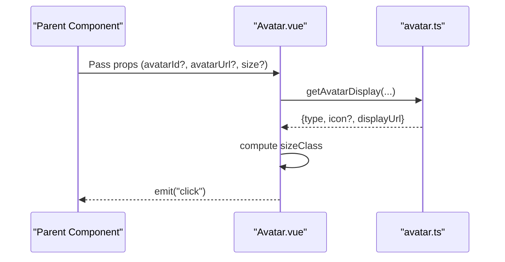
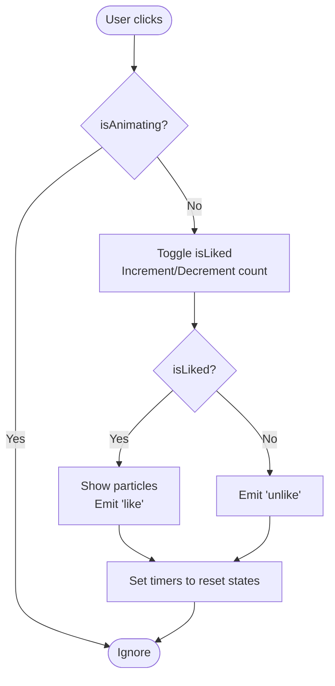
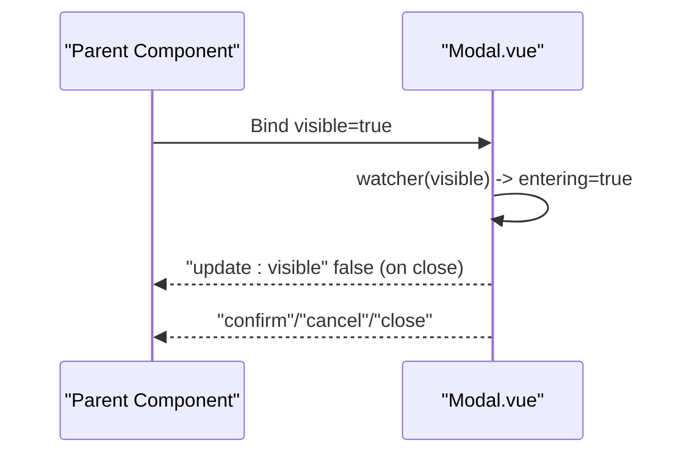
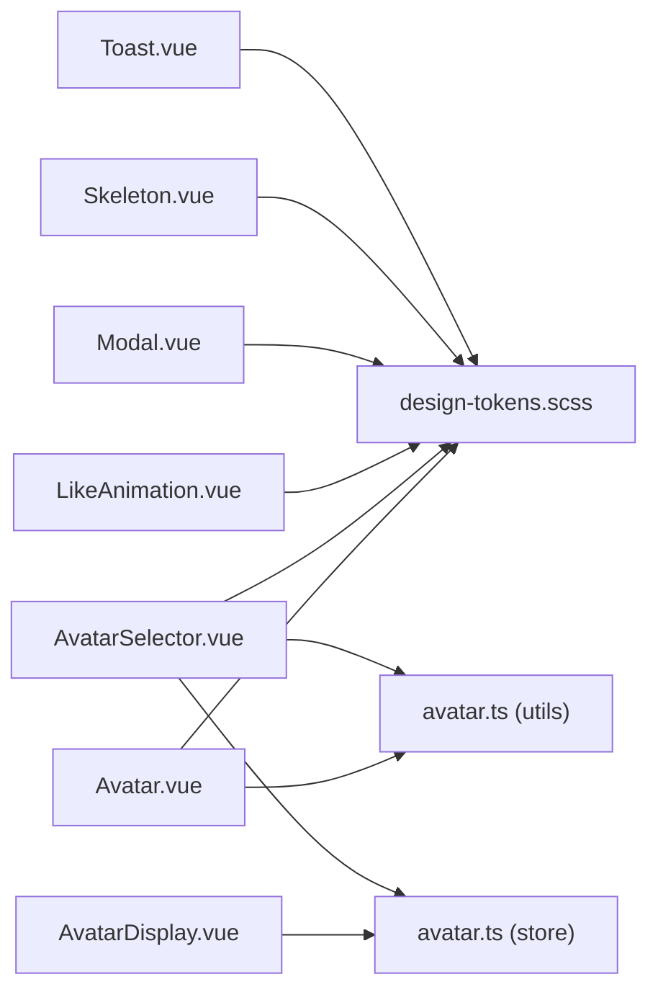

# Common Components

<cite>
**Referenced Files in This Document**
- [Avatar.vue](file://src/components/common/Avatar.vue)
- [Empty.vue](file://src/components/common/Empty.vue)
- [LikeAnimation.vue](file://src/components/common/LikeAnimation.vue)
- [Loading.vue](file://src/components/common/Loading.vue)
- [Modal.vue](file://src/components/common/Modal.vue)
- [Skeleton.vue](file://src/components/common/Skeleton.vue)
- [Toast.vue](file://src/components/common/Toast.vue)
- [avatar.ts](file://src/utils/avatar.ts)
- [design-tokens.scss](file://src/assets/styles/design-tokens.scss)
- [avatar.scss](file://src/assets/styles/avatar.scss)
- [AvatarDisplay.vue](file://src/components/business/AvatarDisplay.vue)
- [AvatarSelector.vue](file://src/components/business/AvatarSelector.vue)
- [avatar.ts (store)](file://src/stores/avatar.ts)
</cite>

## Table of Contents
1. [Introduction](#introduction)
2. [Project Structure](#project-structure)
3. [Core Components](#core-components)
4. [Architecture Overview](#architecture-overview)
5. [Detailed Component Analysis](#detailed-component-analysis)
6. [Dependency Analysis](#dependency-analysis)
7. [Performance Considerations](#performance-considerations)
8. [Troubleshooting Guide](#troubleshooting-guide)
9. [Conclusion](#conclusion)

## Introduction
This document describes the common UI components that act as reusable building blocks across the application. It covers the Avatar, Empty, LikeAnimation, Loading, Modal, Skeleton, and Toast components. For each component, we explain props, emitted events, styling patterns, accessibility considerations, responsive design patterns, and performance optimizations. We also show how these components integrate with shared utilities and design tokens.

## Project Structure
The common components live under the common folder and are designed to be framework-agnostic within the app’s architecture. They rely on shared SCSS design tokens and utility functions for consistent visuals and behavior.

**Diagram sources**
- [Avatar.vue:1-95](file://src/components/common/Avatar.vue#L1-L95)
- [Empty.vue:1-34](file://src/components/common/Empty.vue#L1-L34)
- [LikeAnimation.vue:1-236](file://src/components/common/LikeAnimation.vue#L1-L236)
- [Loading.vue:1-46](file://src/components/common/Loading.vue#L1-L46)
- [Modal.vue:1-236](file://src/components/common/Modal.vue#L1-L236)
- [Skeleton.vue:1-169](file://src/components/common/Skeleton.vue#L1-L169)
- [Toast.vue:1-139](file://src/components/common/Toast.vue#L1-L139)
- [avatar.ts:1-93](file://src/utils/avatar.ts#L1-L93)
- [design-tokens.scss:1-240](file://src/assets/styles/design-tokens.scss#L1-L240)
- [avatar.scss:1-753](file://src/assets/styles/avatar.scss#L1-L753)
- [AvatarDisplay.vue:1-87](file://src/components/business/AvatarDisplay.vue#L1-L87)
- [AvatarSelector.vue:1-286](file://src/components/business/AvatarSelector.vue#L1-L286)
- [avatar.ts (store):1-52](file://src/stores/avatar.ts#L1-L52)

**Section sources**
- [Avatar.vue:1-95](file://src/components/common/Avatar.vue#L1-L95)
- [design-tokens.scss:1-240](file://src/assets/styles/design-tokens.scss#L1-L240)

## Core Components
Below is a concise overview of each component’s purpose, props, events, and styling patterns.

- Avatar
  - Purpose: Render user avatar with support for preset and custom images.
  - Props: avatarId, avatarUrl, size.
  - Events: click.
  - Styling: Uses design tokens and SCSS for sizing and responsive units.
  - Accessibility: Click handler present; consider adding role and aria attributes if used as interactive targets.
  - Integration: Delegates display logic to avatar utilities.

- Empty
  - Purpose: Show empty state with icon, text, and optional slot.
  - Props: text.
  - Events: None.
  - Styling: Centered layout with large icon and muted text.

- LikeAnimation
  - Purpose: Animated heart-like interaction with particle effects and numeric counter.
  - Props: liked, count, showCount.
  - Events: like, unlike.
  - Styling: Animations for bounce, scaling, particle fly, and count pop.

- Loading
  - Purpose: Spinner with optional label for async operations.
  - Props: text.
  - Events: None.
  - Styling: Circular spinner with rotation animation.

- Modal
  - Purpose: Overlay dialog with header, body, footer, and actions.
  - Props: visible, title, content, showClose, showFooter, showCancel, confirmText, cancelText, closeOnClickOverlay.
  - Events: update:visible, confirm, cancel, close.
  - Styling: Fade-in overlay and slide-up container with bounce entrance.

- Skeleton
  - Purpose: Provide loading placeholders for avatars, images, text, and cards.
  - Props: type, width, height, animated, showImage.
  - Events: None.
  - Styling: Shimmer effect via gradient animation; card composition with avatar and text blocks.

- Toast
  - Purpose: Notification banners with configurable type, position, and duration.
  - Props: message, type, duration, position, showIcon.
  - Events: close.
  - Styling: Fixed-position containers with backdrop blur and typed backgrounds.

**Section sources**
- [Avatar.vue:17-42](file://src/components/common/Avatar.vue#L17-L42)
- [Empty.vue:9-13](file://src/components/common/Empty.vue#L9-L13)
- [LikeAnimation.vue:27-114](file://src/components/common/LikeAnimation.vue#L27-L114)
- [Loading.vue:8-12](file://src/components/common/Loading.vue#L8-L12)
- [Modal.vue:29-94](file://src/components/common/Modal.vue#L29-L94)
- [Skeleton.vue:49-82](file://src/components/common/Skeleton.vue#L49-L82)
- [Toast.vue:15-52](file://src/components/common/Toast.vue#L15-L52)

## Architecture Overview
The common components share a cohesive design system built on SCSS design tokens. Business integrations (AvatarDisplay and AvatarSelector) demonstrate how common components are composed into higher-level features. Utility functions centralize avatar resolution logic.

**Diagram sources**
- [Avatar.vue:1-95](file://src/components/common/Avatar.vue#L1-L95)
- [AvatarDisplay.vue:1-87](file://src/components/business/AvatarDisplay.vue#L1-L87)
- [AvatarSelector.vue:1-286](file://src/components/business/AvatarSelector.vue#L1-L286)
- [avatar.ts (store):1-52](file://src/stores/avatar.ts#L1-L52)
- [avatar.ts:1-93](file://src/utils/avatar.ts#L1-L93)
- [design-tokens.scss:1-240](file://src/assets/styles/design-tokens.scss#L1-L240)
- [avatar.scss:1-753](file://src/assets/styles/avatar.scss#L1-L753)

## Detailed Component Analysis

### Avatar
- Purpose: Render a user avatar with either a preset emoji/icon or a custom image URL.
- Props
  - avatarId: Optional numeric identifier for preset MBTI avatar.
  - avatarUrl: Optional URL for custom avatar.
  - size: 'small' | 'medium' | 'large'.
- Events
  - click: Emitted when the container is clicked.
- Implementation highlights
  - Computed avatar display resolves either preset or custom avatar via utility.
  - Size classes switch dimensions and icon sizes.
  - Click emits event for parent to handle navigation or selection.
- Accessibility
  - Add role="button" and tabindex if used as actionable element.
  - Provide aria-label for meaningful context.
- Responsive design
  - Uses rpx units for scalable sizing across devices.
- Performance
  - Minimal reactivity; computed caching avoids repeated resolution.

**Diagram sources**
- [Avatar.vue:17-42](file://src/components/common/Avatar.vue#L17-L42)
- [avatar.ts:53-92](file://src/utils/avatar.ts#L53-L92)

**Section sources**
- [Avatar.vue:17-42](file://src/components/common/Avatar.vue#L17-L42)
- [avatar.ts:53-92](file://src/utils/avatar.ts#L53-L92)
- [design-tokens.scss:153-159](file://src/assets/styles/design-tokens.scss#L153-L159)

### Empty
- Purpose: Present a neutral empty state with icon, text, and optional child content.
- Props
  - text: Optional message to display below the icon.
- Slots
  - Default slot for custom action buttons or extra content.
- Styling
  - Centered flex layout with large icon and muted text color.

**Section sources**
- [Empty.vue:9-34](file://src/components/common/Empty.vue#L9-L34)

### LikeAnimation
- Purpose: Interactive heart-like button with animations, particle burst, and numeric increment/decrement.
- Props
  - liked: Initial liked state.
  - count: Initial numeric count.
  - showCount: Toggle visibility of the count.
- Events
  - like: Emitted when toggled to liked.
  - unlike: Emitted when toggled to unliked.
- Implementation highlights
  - Watchers synchronize external props to internal refs.
  - Animation guard prevents overlapping interactions.
  - Particle positions computed via polar coordinates; staggered delays.
  - Count formatting supports thousands with suffix.
- Accessibility
  - Consider role="button", aria-pressed, and keyboard activation.
- Performance
  - Short-lived timeouts and minimal DOM churn; avoid frequent prop updates.

**Diagram sources**
- [LikeAnimation.vue:68-100](file://src/components/common/LikeAnimation.vue#L68-L100)
- [LikeAnimation.vue:102-114](file://src/components/common/LikeAnimation.vue#L102-L114)

**Section sources**
- [LikeAnimation.vue:27-114](file://src/components/common/LikeAnimation.vue#L27-L114)
- [design-tokens.scss:106-118](file://src/assets/styles/design-tokens.scss#L106-L118)

### Loading
- Purpose: Provide a centered spinner with optional label during async operations.
- Props
  - text: Optional message beneath spinner.
- Styling
  - Circular border spinner with continuous rotation animation.

**Section sources**
- [Loading.vue:8-46](file://src/components/common/Loading.vue#L8-L46)

### Modal
- Purpose: Overlay dialog with optional header, content, and action buttons.
- Props
  - visible: Controls visibility and entrance animation.
  - title, content: Header text and body fallback.
  - showClose, showFooter, showCancel: Feature flags.
  - confirmText, cancelText: Button labels.
  - closeOnClickOverlay: Whether clicking overlay closes.
- Events
  - update:visible: Two-way binding for visibility.
  - confirm, cancel, close: Action callbacks.
- Implementation highlights
  - Entrance animation triggered on visibility change.
  - Overlay click behavior controlled by flag.
  - Footer buttons with active-state scaling.
- Accessibility
  - Manage focus trapping and ARIA attributes externally if needed.
  - Ensure sufficient contrast for text and controls.

**Diagram sources**
- [Modal.vue:62-94](file://src/components/common/Modal.vue#L62-L94)

**Section sources**
- [Modal.vue:29-94](file://src/components/common/Modal.vue#L29-L94)
- [design-tokens.scss:119-129](file://src/assets/styles/design-tokens.scss#L119-L129)

### Skeleton
- Purpose: Provide loading placeholders for avatars, images, text, and composite cards.
- Props
  - type: 'avatar' | 'image' | 'text' | 'card'.
  - width, height: Dimensions for generic shapes.
  - animated: Enable shimmer animation.
  - showImage: Toggle image placeholder inside card.
- Implementation highlights
  - Computed styles for avatar/image/text dimensions.
  - Card layout composes avatar + info + multiple text lines and optional image.
- Styling
  - Shimmer via moving gradient; card with rounded corners and spacing tokens.

**Section sources**
- [Skeleton.vue:49-82](file://src/components/common/Skeleton.vue#L49-L82)
- [design-tokens.scss:87-97](file://src/assets/styles/design-tokens.scss#L87-L97)

### Toast
- Purpose: Display transient notifications with icons and typed backgrounds.
- Props
  - message: Text content.
  - type: 'success' | 'error' | 'warning' | 'info' | 'default'.
  - duration: Auto-hide delay; 0 disables auto-hide.
  - position: 'top' | 'center' | 'bottom'.
  - showIcon: Toggle icon rendering.
- Events
  - close: Fired after auto-hide completes.
- Implementation highlights
  - Reactive visibility resets on message change; optional timeout triggers close.
  - Position classes adjust vertical placement.
- Accessibility
  - Prefer shorter messages and avoid relying solely on color.
  - Consider ARIA live regions for critical notifications.

**Section sources**
- [Toast.vue:15-52](file://src/components/common/Toast.vue#L15-L52)
- [design-tokens.scss:119-129](file://src/assets/styles/design-tokens.scss#L119-L129)

## Dependency Analysis
- Avatar depends on avatar utility for display resolution and SCSS for sizing.
- Business components AvatarDisplay and AvatarSelector depend on the avatar store and avatar utility to manage and render selections.
- All common components consume design tokens for consistent spacing, typography, colors, and z-index.

**Diagram sources**
- [Avatar.vue:17-42](file://src/components/common/Avatar.vue#L17-L42)
- [AvatarDisplay.vue:24-42](file://src/components/business/AvatarDisplay.vue#L24-L42)
- [AvatarSelector.vue:59-153](file://src/components/business/AvatarSelector.vue#L59-L153)
- [avatar.ts:53-92](file://src/utils/avatar.ts#L53-L92)
- [avatar.ts (store):9-52](file://src/stores/avatar.ts#L9-L52)
- [design-tokens.scss:1-240](file://src/assets/styles/design-tokens.scss#L1-L240)

**Section sources**
- [Avatar.vue:17-42](file://src/components/common/Avatar.vue#L17-L42)
- [AvatarDisplay.vue:24-42](file://src/components/business/AvatarDisplay.vue#L24-L42)
- [AvatarSelector.vue:59-153](file://src/components/business/AvatarSelector.vue#L59-L153)
- [avatar.ts:53-92](file://src/utils/avatar.ts#L53-L92)
- [avatar.ts (store):9-52](file://src/stores/avatar.ts#L9-L52)
- [design-tokens.scss:1-240](file://src/assets/styles/design-tokens.scss#L1-L240)

## Performance Considerations
- Prefer computed properties for derived values (e.g., avatar display, size classes) to minimize recomputation.
- Limit heavy animations to small surfaces; keep particle counts and animation durations short.
- Use watchers sparingly; batch prop synchronization when possible.
- Avoid unnecessary reflows by using transform-based animations and rpx units for scalable layouts.
- Reuse design tokens to reduce CSS duplication and improve maintainability.

## Troubleshooting Guide
- Avatar not displaying
  - Verify avatarId range and avatarUrl validity; check utility resolution path.
  - Confirm size class matches intended viewport.
- LikeAnimation stuck or jittery
  - Ensure isAnimating guard prevents rapid toggles; avoid frequent prop updates.
  - Check particle animation timing and timeouts.
- Modal not closing
  - Confirm two-way binding on visible and that overlay click behavior is enabled.
- Toast not hiding
  - Adjust duration or disable auto-hide; ensure message change triggers visibility reset.
- Skeleton shimmer not visible
  - Ensure animated flag is true and gradient animation is applied.

**Section sources**
- [Avatar.vue:31-42](file://src/components/common/Avatar.vue#L31-L42)
- [LikeAnimation.vue:68-100](file://src/components/common/LikeAnimation.vue#L68-L100)
- [Modal.vue:89-94](file://src/components/common/Modal.vue#L89-L94)
- [Toast.vue:39-52](file://src/components/common/Toast.vue#L39-L52)
- [Skeleton.vue:87-112](file://src/components/common/Skeleton.vue#L87-L112)

## Conclusion
These common components form a cohesive, accessible, and performant foundation for the application. By leveraging shared design tokens, utility functions, and consistent patterns, they enable rapid development of consistent UI while maintaining responsiveness and usability across devices.