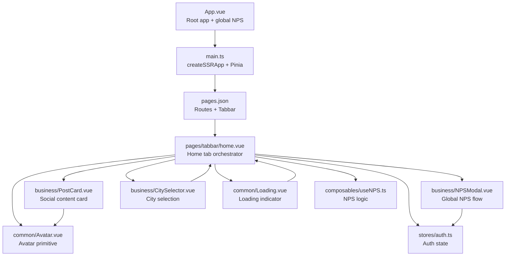
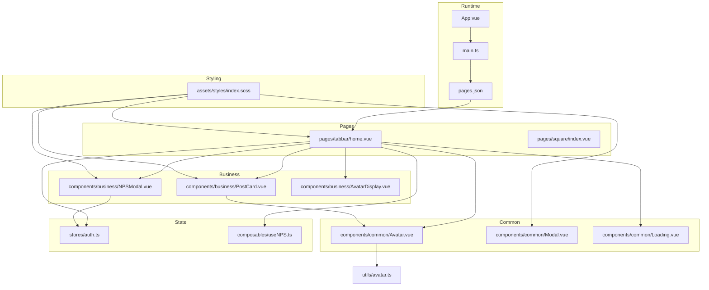
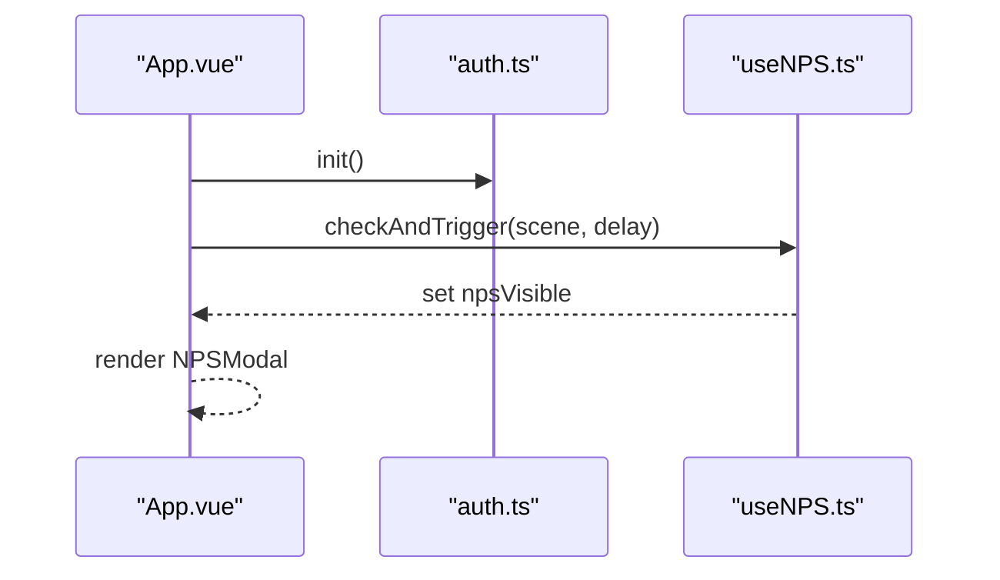
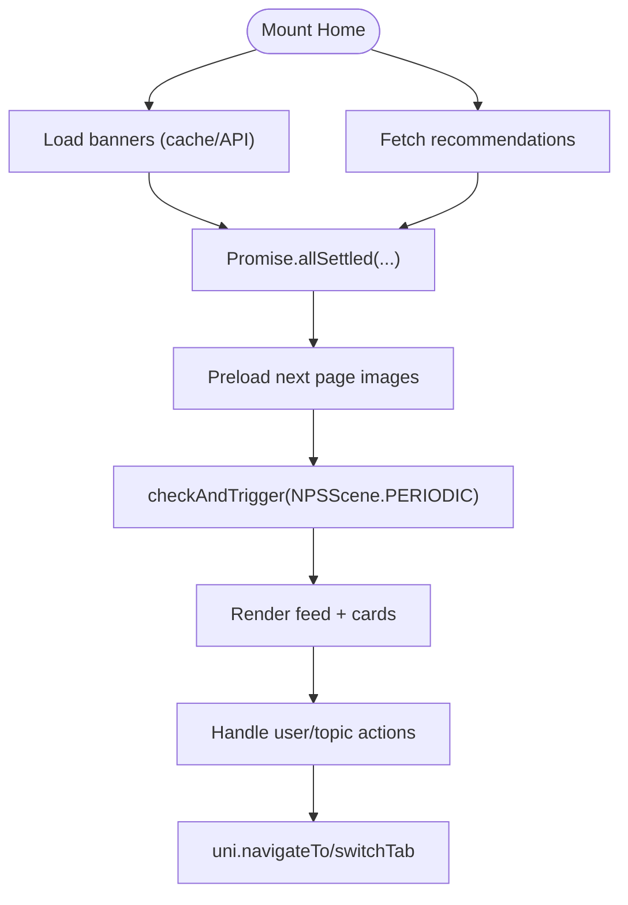
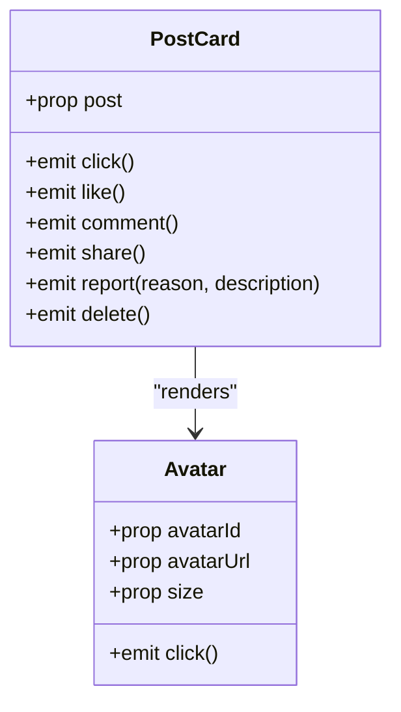
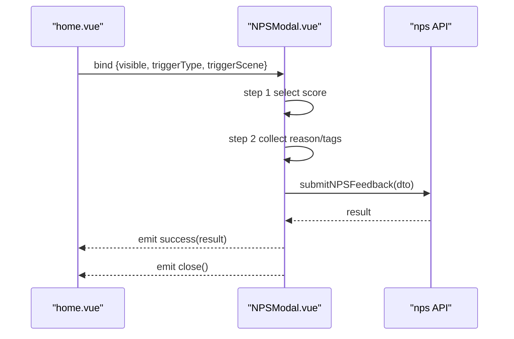
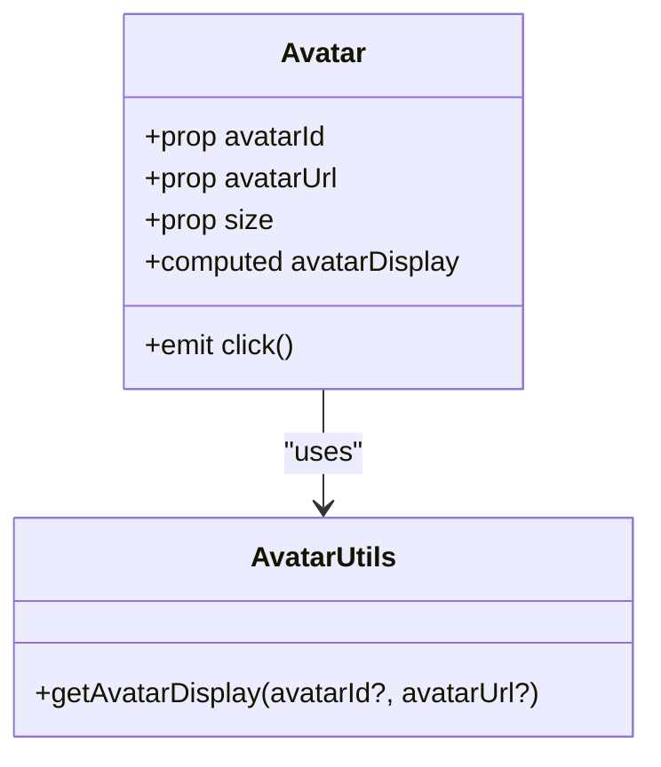
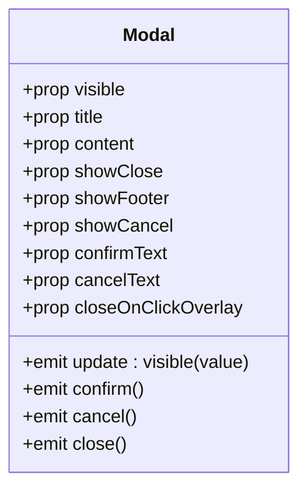
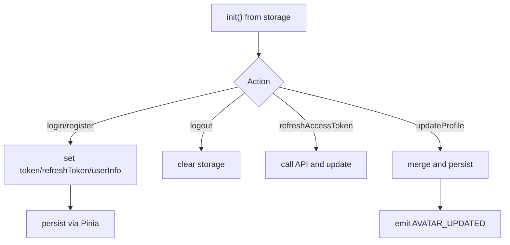
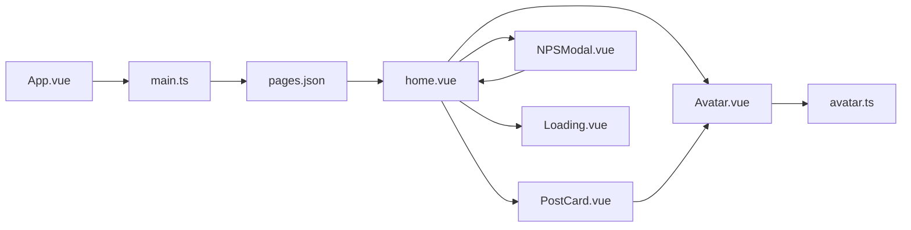

# Component Architecture

<cite>
**Referenced Files in This Document**
- [App.vue](file://src/App.vue)
- [main.ts](file://src/main.ts)
- [pages.json](file://src/pages.json)
- [home.vue](file://src/pages/tabbar/home.vue)
- [PostCard.vue](file://src/components/business/PostCard.vue)
- [Avatar.vue](file://src/components/common/Avatar.vue)
- [NPSModal.vue](file://src/components/business/NPSModal.vue)
- [Modal.vue](file://src/components/common/Modal.vue)
- [AvatarDisplay.vue](file://src/components/business/AvatarDisplay.vue)
- [Loading.vue](file://src/components/common/Loading.vue)
- [auth.ts](file://src/stores/auth.ts)
- [useNPS.ts](file://src/composables/useNPS.ts)
- [avatar.ts](file://src/utils/avatar.ts)
- [index.scss](file://src/assets/styles/index.scss)
</cite>

## Table of Contents
1. [Introduction](#introduction)
2. [Project Structure](#project-structure)
3. [Core Components](#core-components)
4. [Architecture Overview](#architecture-overview)
5. [Detailed Component Analysis](#detailed-component-analysis)
6. [Dependency Analysis](#dependency-analysis)
7. [Performance Considerations](#performance-considerations)
8. [Troubleshooting Guide](#troubleshooting-guide)
9. [Conclusion](#conclusion)

## Introduction
This document describes the component architecture of the WeTogether platform built with Vue 3 + TypeScript and UniApp. It explains the hierarchical structure from the root application component down to tabbar navigation and feature-specific pages, distinguishes business components (social features, content management) from common components (UI primitives), and documents composition patterns, prop interfaces, events, slots, routing, lifecycle management, and styling via SCSS modules and the design system.

## Project Structure
The project follows a feature-layered organization:
- Root application bootstrap initializes Pinia and global stores.
- Pages define routes and tabbar entries.
- Tabbar pages orchestrate feature-specific subcomponents and composables.
- Business components encapsulate social/content features.
- Common components provide reusable UI primitives.
- Stores manage cross-cutting state (auth, avatar, etc.).
- Composables encapsulate cross-page logic (e.g., NPS).
- Utilities centralize shared logic (e.g., avatar display).
- Styles integrate design tokens and global resets.

**Diagram sources**
- [App.vue:1-103](file://src/App.vue#L1-L103)
- [main.ts:1-18](file://src/main.ts#L1-L18)
- [pages.json:1-253](file://src/pages.json#L1-L253)
- [home.vue:1-489](file://src/pages/tabbar/home.vue#L1-L489)
- [PostCard.vue:1-628](file://src/components/business/PostCard.vue#L1-L628)
- [Avatar.vue:1-95](file://src/components/common/Avatar.vue#L1-L95)
- [NPSModal.vue:1-550](file://src/components/business/NPSModal.vue#L1-L550)
- [Loading.vue:1-46](file://src/components/common/Loading.vue#L1-L46)
- [auth.ts:1-137](file://src/stores/auth.ts#L1-L137)
- [useNPS.ts:1-145](file://src/composables/useNPS.ts#L1-L145)

**Section sources**
- [App.vue:1-103](file://src/App.vue#L1-L103)
- [main.ts:1-18](file://src/main.ts#L1-L18)
- [pages.json:1-253](file://src/pages.json#L1-L253)

## Core Components
- Root App: Initializes auth store on launch and renders a global NPS modal.
- Home Tab Page: Orchestrates top navigation, carousels, quick actions, skeleton/loading states, infinite scroll, and recommendation cards.
- Business Components:
  - PostCard: Renders a post with images, likes, comments, share, and reporting.
  - NPSModal: Multi-step feedback collection with dynamic tags and rewards.
  - AvatarDisplay: Unified avatar display with edit overlay.
- Common Components:
  - Avatar: Resolves and renders MBTI preset or custom avatar.
  - Modal: Reusable modal with header/body/footer and slot support.
  - Loading: Spinner with optional text.
- Stores and Composables:
  - Auth store: Token, refresh, user info persistence and updates.
  - useNPS: NPS visibility, triggers, and success handling.

**Section sources**
- [App.vue:1-103](file://src/App.vue#L1-L103)
- [home.vue:1-489](file://src/pages/tabbar/home.vue#L1-L489)
- [PostCard.vue:1-628](file://src/components/business/PostCard.vue#L1-L628)
- [NPSModal.vue:1-550](file://src/components/business/NPSModal.vue#L1-L550)
- [AvatarDisplay.vue:1-87](file://src/components/business/AvatarDisplay.vue#L1-L87)
- [Avatar.vue:1-95](file://src/components/common/Avatar.vue#L1-L95)
- [Modal.vue:1-236](file://src/components/common/Modal.vue#L1-L236)
- [Loading.vue:1-46](file://src/components/common/Loading.vue#L1-L46)
- [auth.ts:1-137](file://src/stores/auth.ts#L1-L137)
- [useNPS.ts:1-145](file://src/composables/useNPS.ts#L1-L145)

## Architecture Overview
The architecture centers around a root App component that bootstraps the app and initializes auth state. The tabbar organizes primary navigation, with the Home tab serving as the content hub. Business components encapsulate social features, while common components provide reusable primitives. State is managed via Pinia stores and composables, and styling leverages SCSS modules and design tokens.

**Diagram sources**
- [App.vue:1-103](file://src/App.vue#L1-L103)
- [main.ts:1-18](file://src/main.ts#L1-L18)
- [pages.json:1-253](file://src/pages.json#L1-L253)
- [home.vue:1-489](file://src/pages/tabbar/home.vue#L1-L489)
- [PostCard.vue:1-628](file://src/components/business/PostCard.vue#L1-L628)
- [NPSModal.vue:1-550](file://src/components/business/NPSModal.vue#L1-L550)
- [AvatarDisplay.vue:1-87](file://src/components/business/AvatarDisplay.vue#L1-L87)
- [Avatar.vue:1-95](file://src/components/common/Avatar.vue#L1-L95)
- [Modal.vue:1-236](file://src/components/common/Modal.vue#L1-L236)
- [Loading.vue:1-46](file://src/components/common/Loading.vue#L1-L46)
- [auth.ts:1-137](file://src/stores/auth.ts#L1-L137)
- [useNPS.ts:1-145](file://src/composables/useNPS.ts#L1-L145)
- [avatar.ts:1-93](file://src/utils/avatar.ts#L1-L93)
- [index.scss:1-39](file://src/assets/styles/index.scss#L1-L39)

## Detailed Component Analysis

### Root App Component
- Purpose: Initialize auth store on app launch, render global NPS modal.
- Lifecycle hooks: onLaunch, onShow, onHide.
- Global NPS integration: Uses composable to control visibility and events.

**Diagram sources**
- [App.vue:1-103](file://src/App.vue#L1-L103)
- [auth.ts:73-77](file://src/stores/auth.ts#L73-L77)
- [useNPS.ts:18-38](file://src/composables/useNPS.ts#L18-L38)

**Section sources**
- [App.vue:1-103](file://src/App.vue#L1-L103)
- [auth.ts:73-77](file://src/stores/auth.ts#L73-L77)
- [useNPS.ts:18-38](file://src/composables/useNPS.ts#L18-L38)

### Home Tab Page Composition
- Responsibilities:
  - Top navigation (location, search, messages).
  - Banner carousel and quick actions.
  - Infinite scroll feed with skeleton/loading states.
  - Recommendation cards (personalized, hot, nearby, topics, new users).
  - City selector and NPS modal.
- Orchestration:
  - Composables for recommendation and infinite scroll.
  - Utility for image lazy loading and preloading.
  - Cache manager for banners.
  - Event handlers for navigation and actions.

**Diagram sources**
- [home.vue:239-284](file://src/pages/tabbar/home.vue#L239-L284)
- [home.vue:400-430](file://src/pages/tabbar/home.vue#L400-L430)
- [useNPS.ts:94-100](file://src/composables/useNPS.ts#L94-L100)

**Section sources**
- [home.vue:1-489](file://src/pages/tabbar/home.vue#L1-L489)
- [useNPS.ts:94-100](file://src/composables/useNPS.ts#L94-L100)

### Business Component: PostCard
- Props: post object.
- Emits: click, like, comment, share, report, delete.
- Interactions:
  - User detail navigation.
  - Like animation and particles.
  - Image preview.
  - Action sheet for delete/report with modal fallback.
- Dependencies: Avatar component, auth store for ownership checks.

**Diagram sources**
- [PostCard.vue:102-113](file://src/components/business/PostCard.vue#L102-L113)
- [Avatar.vue:21-29](file://src/components/common/Avatar.vue#L21-L29)

**Section sources**
- [PostCard.vue:1-628](file://src/components/business/PostCard.vue#L1-L628)
- [Avatar.vue:1-95](file://src/components/common/Avatar.vue#L1-L95)

### Business Component: NPSModal
- Props: visible, triggerType, triggerScene.
- Emits: close, success(feedback).
- Steps:
  - Step 1: Score selection (0–10) with dynamic labels.
  - Step 2: Feedback textarea with character count and up to 3 tags.
  - Step 3: Success screen with reward points.
- Validation and submission handled with async API call.

**Diagram sources**
- [home.vue:111-117](file://src/pages/tabbar/home.vue#L111-L117)
- [NPSModal.vue:244-294](file://src/components/business/NPSModal.vue#L244-L294)
- [useNPS.ts:59-76](file://src/composables/useNPS.ts#L59-L76)

**Section sources**
- [NPSModal.vue:1-550](file://src/components/business/NPSModal.vue#L1-L550)
- [useNPS.ts:59-76](file://src/composables/useNPS.ts#L59-L76)

### Common Component: Avatar
- Props: avatarId, avatarUrl, size.
- Emits: click.
- Behavior: Computes display based on avatar utilities; supports small/medium/large sizes.

**Diagram sources**
- [Avatar.vue:21-33](file://src/components/common/Avatar.vue#L21-L33)
- [avatar.ts:53-92](file://src/utils/avatar.ts#L53-L92)

**Section sources**
- [Avatar.vue:1-95](file://src/components/common/Avatar.vue#L1-L95)
- [avatar.ts:53-92](file://src/utils/avatar.ts#L53-L92)

### Common Component: Modal
- Props: visible, title, content, showClose, showFooter, showCancel, confirmText, cancelText, closeOnClickOverlay.
- Emits: update:visible, confirm, cancel, close.
- Slot usage: default slot for body content.
- Animation: enter bounce on open.

**Diagram sources**
- [Modal.vue:32-58](file://src/components/common/Modal.vue#L32-L58)

**Section sources**
- [Modal.vue:1-236](file://src/components/common/Modal.vue#L1-L236)

### State Management: Auth Store
- Responsibilities: login, register, logout, refresh access token, persist state, update user info and broadcast avatar updates.
- Persistence: enabled via Pinia plugin.

**Diagram sources**
- [auth.ts:73-77](file://src/stores/auth.ts#L73-L77)
- [auth.ts:18-42](file://src/stores/auth.ts#L18-L42)
- [auth.ts:44-52](file://src/stores/auth.ts#L44-L52)
- [auth.ts:54-71](file://src/stores/auth.ts#L54-L71)
- [auth.ts:95-117](file://src/stores/auth.ts#L95-L117)

**Section sources**
- [auth.ts:1-137](file://src/stores/auth.ts#L1-L137)

### Styling Approach and Design System Integration
- Global reset and base styles in index.scss.
- Scoped SCSS in components with design tokens imported where applicable.
- Consistent typography, spacing, and color tokens applied across components.

**Section sources**
- [index.scss:1-39](file://src/assets/styles/index.scss#L1-L39)
- [home.vue:441-488](file://src/pages/tabbar/home.vue#L441-L488)
- [PostCard.vue:292-627](file://src/components/business/PostCard.vue#L292-L627)
- [NPSModal.vue:316-549](file://src/components/business/NPSModal.vue#L316-L549)
- [Modal.vue:96-235](file://src/components/common/Modal.vue#L96-L235)

## Dependency Analysis
- App depends on main.ts for app creation and Pinia initialization.
- Home page depends on business and common components, stores, composables, and utilities.
- PostCard depends on Avatar and auth store for ownership checks.
- NPSModal depends on auth store indirectly via parent orchestration and NPS composable.
- Modal is a leaf component used widely across pages.

**Diagram sources**
- [App.vue:1-103](file://src/App.vue#L1-L103)
- [main.ts:1-18](file://src/main.ts#L1-L18)
- [pages.json:1-253](file://src/pages.json#L1-L253)
- [home.vue:1-489](file://src/pages/tabbar/home.vue#L1-L489)
- [PostCard.vue:1-628](file://src/components/business/PostCard.vue#L1-L628)
- [Avatar.vue:1-95](file://src/components/common/Avatar.vue#L1-L95)
- [NPSModal.vue:1-550](file://src/components/business/NPSModal.vue#L1-L550)
- [Loading.vue:1-46](file://src/components/common/Loading.vue#L1-L46)
- [avatar.ts:1-93](file://src/utils/avatar.ts#L1-L93)

**Section sources**
- [App.vue:1-103](file://src/App.vue#L1-L103)
- [main.ts:1-18](file://src/main.ts#L1-L18)
- [pages.json:1-253](file://src/pages.json#L1-L253)
- [home.vue:1-489](file://src/pages/tabbar/home.vue#L1-L489)
- [PostCard.vue:1-628](file://src/components/business/PostCard.vue#L1-L628)
- [Avatar.vue:1-95](file://src/components/common/Avatar.vue#L1-L95)
- [NPSModal.vue:1-550](file://src/components/business/NPSModal.vue#L1-L550)
- [Loading.vue:1-46](file://src/components/common/Loading.vue#L1-L46)
- [avatar.ts:1-93](file://src/utils/avatar.ts#L1-L93)

## Performance Considerations
- Lazy loading and skeleton screens reduce initial payload and improve perceived performance.
- Infinite scroll and pagination prevent heavy lists from rendering all items at once.
- Image preloading and caching minimize network overhead and improve UX.
- Debouncing and throttling can be applied to scroll and resize events where appropriate.
- Avoid unnecessary re-renders by passing minimal props and using computed values.

## Troubleshooting Guide
- Authentication state not persisting:
  - Verify Pinia persisted state is enabled and keys exist in storage.
  - Confirm init() reads from storage and refreshAccessToken handles errors gracefully.
- NPS modal not appearing:
  - Ensure canTriggerNPS returns true and checkAndTrigger is called with a valid scene.
  - Validate that visible state transitions correctly after submission.
- Avatar not updating:
  - Confirm updateProfile emits AVATAR_UPDATED with correct payload.
  - Ensure consumers listen to event bus and refresh avatar display.

**Section sources**
- [auth.ts:73-77](file://src/stores/auth.ts#L73-L77)
- [auth.ts:54-71](file://src/stores/auth.ts#L54-L71)
- [auth.ts:95-117](file://src/stores/auth.ts#L95-L117)
- [useNPS.ts:18-38](file://src/composables/useNPS.ts#L18-L38)
- [useNPS.ts:59-76](file://src/composables/useNPS.ts#L59-L76)

## Conclusion
The WeTogether platform employs a clean separation between business and common components, orchestrated by tabbar pages and supported by Pinia stores and composables. Routing is centralized in pages.json, enabling straightforward navigation and tabbar integration. Styling uses SCSS modules and design tokens for consistency. The architecture emphasizes modularity, reusability, and maintainability, with clear patterns for props, events, slots, and lifecycle management.