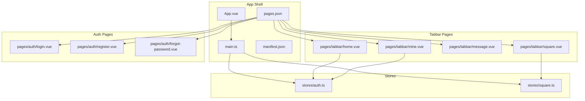
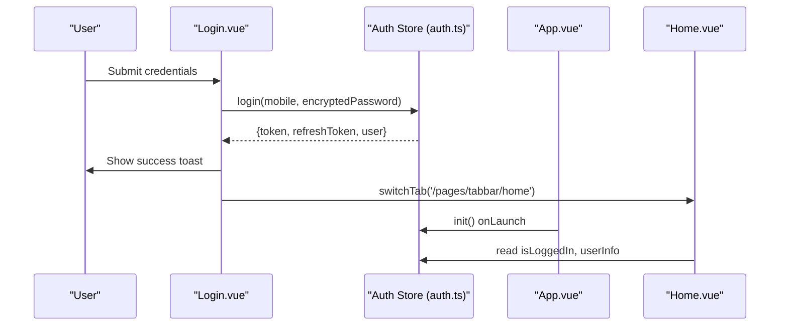
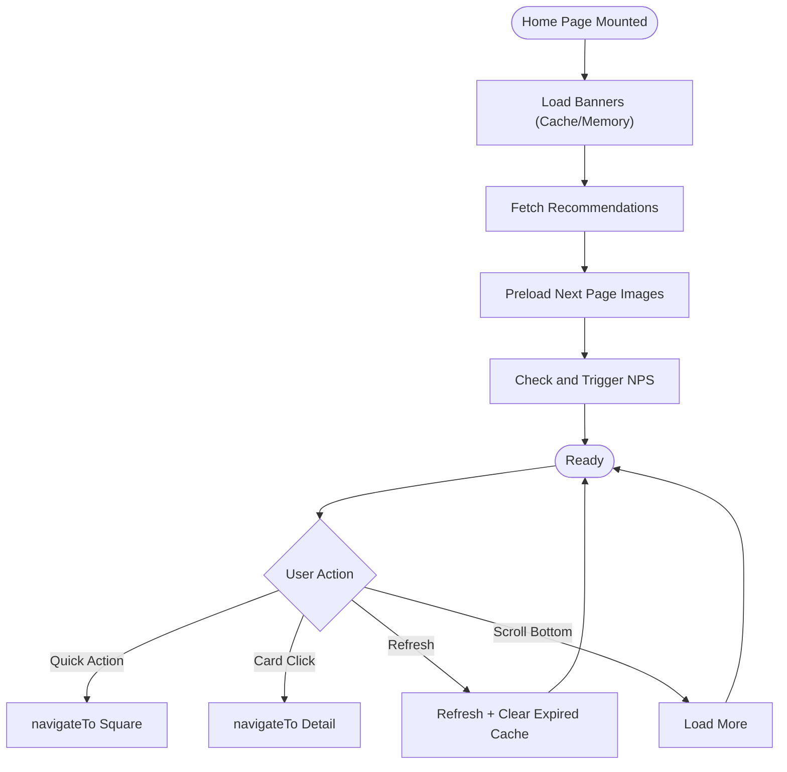
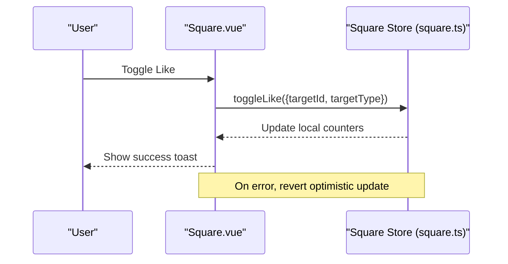
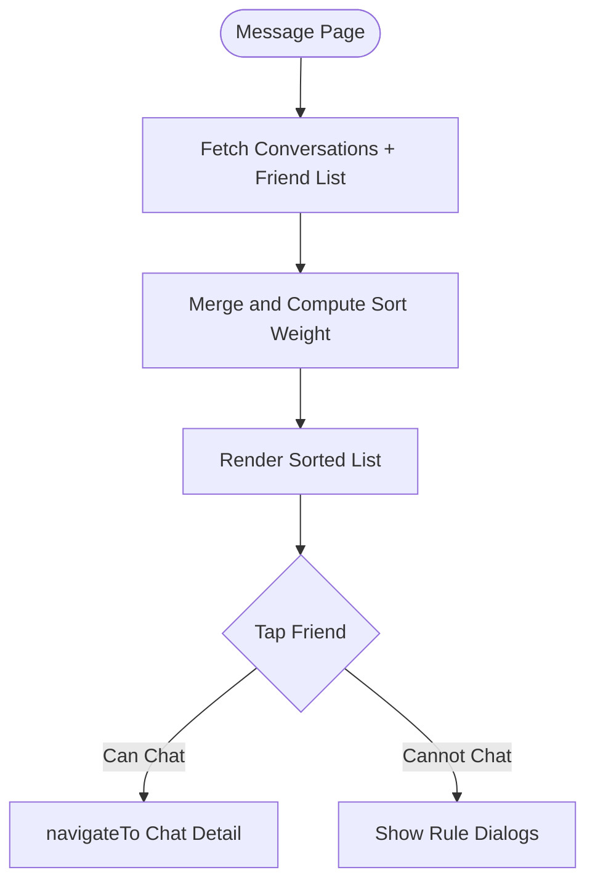
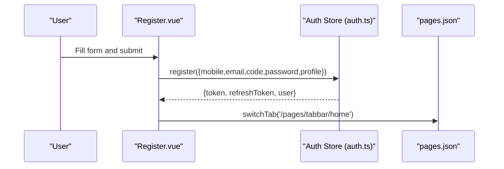
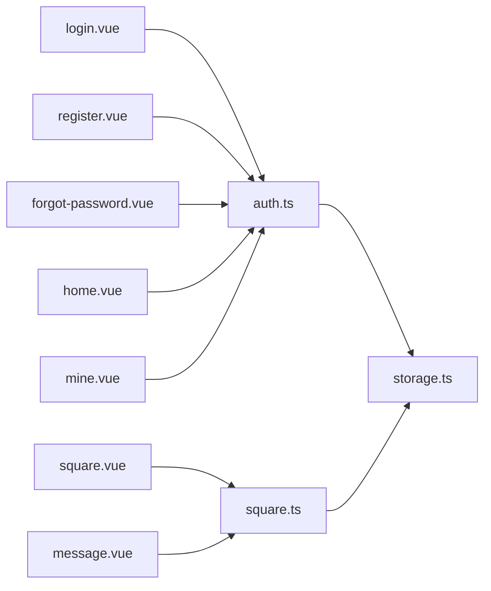

# Page Structure & Navigation

<cite>
**Referenced Files in This Document**
- [pages.json](file://src/pages.json)
- [manifest.json](file://src/manifest.json)
- [App.vue](file://src/App.vue)
- [main.ts](file://src/main.ts)
- [home.vue](file://src/pages/tabbar/home.vue)
- [square.vue](file://src/pages/tabbar/square.vue)
- [message.vue](file://src/pages/tabbar/message.vue)
- [mine.vue](file://src/pages/tabbar/mine.vue)
- [login.vue](file://src/pages/auth/login.vue)
- [register.vue](file://src/pages/auth/register.vue)
- [forgot-password.vue](file://src/pages/auth/forgot-password.vue)
- [auth.ts](file://src/stores/auth.ts)
- [square.ts](file://src/stores/square.ts)
- [storage.ts](file://src/utils/storage.ts)
</cite>

## Table of Contents
1. [Introduction](#introduction)
2. [Project Structure](#project-structure)
3. [Core Components](#core-components)
4. [Architecture Overview](#architecture-overview)
5. [Detailed Component Analysis](#detailed-component-analysis)
6. [Dependency Analysis](#dependency-analysis)
7. [Performance Considerations](#performance-considerations)
8. [Troubleshooting Guide](#troubleshooting-guide)
9. [Conclusion](#conclusion)

## Introduction
This document explains the page-based architecture and navigation system of the application. It covers the tabbar structure (Home, Square, Message, Mine), authentication pages (Login, Register, Forgot Password), main feature pages, nested page hierarchies, navigation patterns, route guards, page lifecycle management, state persistence, styling, component composition, and integration with the global state management system.

## Project Structure
The project follows a conventional Vue + Pinia + uni-app structure:
- Pages are declared in pages.json and mapped to Vue single-file components under src/pages.
- Tabbar pages are grouped under src/pages/tabbar.
- Authentication pages are under src/pages/auth.
- Global styles and app lifecycle are configured in App.vue and main.ts.
- State management is handled via Pinia stores with persisted state.

**Diagram sources**
- [pages.json:1-253](file://src/pages.json#L1-L253)
- [manifest.json:1-48](file://src/manifest.json#L1-L48)
- [App.vue:1-103](file://src/App.vue#L1-L103)
- [main.ts:1-18](file://src/main.ts#L1-L18)
- [home.vue:1-489](file://src/pages/tabbar/home.vue#L1-L489)
- [square.vue:1-393](file://src/pages/tabbar/square.vue#L1-L393)
- [message.vue:1-293](file://src/pages/tabbar/message.vue#L1-L293)
- [mine.vue:1-697](file://src/pages/tabbar/mine.vue#L1-L697)
- [login.vue:1-227](file://src/pages/auth/login.vue#L1-L227)
- [register.vue:1-501](file://src/pages/auth/register.vue#L1-L501)
- [forgot-password.vue:1-440](file://src/pages/auth/forgot-password.vue#L1-L440)
- [auth.ts:1-137](file://src/stores/auth.ts#L1-L137)
- [square.ts:1-152](file://src/stores/square.ts#L1-L152)

**Section sources**
- [pages.json:1-253](file://src/pages.json#L1-L253)
- [manifest.json:1-48](file://src/manifest.json#L1-L48)
- [App.vue:1-103](file://src/App.vue#L1-L103)
- [main.ts:1-18](file://src/main.ts#L1-L18)

## Core Components
- Tabbar pages:
  - Home: Top navigation, banners, quick actions, recommendation feed with infinite scroll and skeleton loaders.
  - Square: Tabbed feed (Latest/Hot), publish button, post cards with like/comment/share/delete actions.
  - Message: Friend list with unread indicators and conversation sorting.
  - Mine: Profile header, points card, menu items, and logout.
- Auth pages:
  - Login: Mobile/password form, password visibility toggle, navigation to register/forgot-password.
  - Register: Multi-step form with SMS code, gender selection, optional invite code.
  - Forgot Password: Reset password via SMS code.
- Stores:
  - Auth store: Token, refresh token, user info, login/register/logout, refresh access token, initialization from storage, profile updates.
  - Square store: Posts list, current post, comments, pagination flags, CRUD operations, like toggling, event emission.

**Section sources**
- [home.vue:1-489](file://src/pages/tabbar/home.vue#L1-L489)
- [square.vue:1-393](file://src/pages/tabbar/square.vue#L1-L393)
- [message.vue:1-293](file://src/pages/tabbar/message.vue#L1-L293)
- [mine.vue:1-697](file://src/pages/tabbar/mine.vue#L1-L697)
- [login.vue:1-227](file://src/pages/auth/login.vue#L1-L227)
- [register.vue:1-501](file://src/pages/auth/register.vue#L1-L501)
- [forgot-password.vue:1-440](file://src/pages/auth/forgot-password.vue#L1-L440)
- [auth.ts:1-137](file://src/stores/auth.ts#L1-L137)
- [square.ts:1-152](file://src/stores/square.ts#L1-L152)

## Architecture Overview
The navigation architecture is driven by:
- pages.json: Declares all pages and defines the tabbar with four tab entries pointing to tabbar pages.
- uni-app navigation APIs: switchTab, navigateTo, redirectTo, navigateBack are used for tab switching and intra-app navigation.
- Global state (Pinia): Auth and Square stores manage cross-page state and synchronization.
- Lifecycle hooks: onLaunch, onShow, onHide, onMounted, onShow are used to initialize state and refresh data.

**Diagram sources**
- [login.vue:68-103](file://src/pages/auth/login.vue#L68-L103)
- [auth.ts:18-29](file://src/stores/auth.ts#L18-L29)
- [App.vue:9-17](file://src/App.vue#L9-L17)
- [home.vue:152-153](file://src/pages/tabbar/home.vue#L152-L153)

## Detailed Component Analysis

### Tabbar: Home
- Responsibilities:
  - Top navigation (location, search, messages).
  - Banner carousel, quick actions, recommendation feed.
  - Infinite scroll, skeleton loaders, image lazy/preload strategies.
  - NPS modal trigger and city selector.
- Navigation:
  - Quick actions navigate to Square, MBTI, Friends, Nearby.
  - Card clicks navigate to user/topic detail pages.
  - Messages click navigates to Chat List.
- State and Stores:
  - Uses Auth store for user info and NPS integration.
  - Uses local composables for recommendation, infinite scroll, and image loading.
- Lifecycle:
  - onMounted: loads banners and recommendations, preloads images, triggers periodic NPS.
  - onUnmounted: clears cache cleanup timers.

**Diagram sources**
- [home.vue:239-284](file://src/pages/tabbar/home.vue#L239-L284)
- [home.vue:385-389](file://src/pages/tabbar/home.vue#L385-L389)
- [home.vue:400-430](file://src/pages/tabbar/home.vue#L400-L430)

**Section sources**
- [home.vue:1-489](file://src/pages/tabbar/home.vue#L1-L489)

### Tabbar: Square
- Responsibilities:
  - Tabbed feed (Latest/Hot).
  - Publish button navigates to publish page.
  - Post cards with like/comment/share/delete actions.
  - Optimistic UI updates for likes with rollback on failure.
- Navigation:
  - Publish -> Square Publish.
  - Post click -> Square Post Detail.
  - Share -> Platform-specific share flow.
- State and Stores:
  - Square store manages posts, comments, pagination, and like toggling.
  - Avatar and like sync composables keep UI consistent across pages.

**Diagram sources**
- [square.vue:162-185](file://src/pages/tabbar/square.vue#L162-L185)
- [square.ts:95-128](file://src/stores/square.ts#L95-L128)

**Section sources**
- [square.vue:1-393](file://src/pages/tabbar/square.vue#L1-L393)
- [square.ts:1-152](file://src/stores/square.ts#L1-L152)

### Tabbar: Message
- Responsibilities:
  - Merge friend list with conversation data.
  - Sort by unread count and last message time.
  - Enforce chat rules (follow, message threshold, points) before entering chat.
- Navigation:
  - Friend item -> Chat Detail with user context.
- Lifecycle:
  - onMounted and onShow: fetch conversations and friend list.

**Diagram sources**
- [message.vue:94-112](file://src/pages/tabbar/message.vue#L94-L112)
- [message.vue:114-171](file://src/pages/tabbar/message.vue#L114-L171)

**Section sources**
- [message.vue:1-293](file://src/pages/tabbar/message.vue#L1-L293)

### Tabbar: Mine
- Responsibilities:
  - User header with avatar display logic.
  - Points card with sign-in flow.
  - Menu items for profile, interests, photos, preferences, privacy, values, MBTI, points, friends, certification, settings.
  - Logout with re-launch to Login.
- Navigation:
  - All menu items navigate to relevant profile or feature pages.
  - Logout -> reLaunch to Login.

**Section sources**
- [mine.vue:1-697](file://src/pages/tabbar/mine.vue#L1-L697)

### Authentication Pages
- Login:
  - Validates inputs, encrypts password, calls Auth store login, then switchTab to Home.
- Register:
  - Multi-step form, sends SMS code, validates email, registers via Auth store, switchTab to Home.
- Forgot Password:
  - Sends reset code, validates inputs, resets password, redirects to Login.

**Diagram sources**
- [register.vue:235-302](file://src/pages/auth/register.vue#L235-L302)
- [auth.ts:31-42](file://src/stores/auth.ts#L31-L42)
- [pages.json:28-50](file://src/pages.json#L28-L50)

**Section sources**
- [login.vue:1-227](file://src/pages/auth/login.vue#L1-L227)
- [register.vue:1-501](file://src/pages/auth/register.vue#L1-L501)
- [forgot-password.vue:1-440](file://src/pages/auth/forgot-password.vue#L1-L440)
- [auth.ts:1-137](file://src/stores/auth.ts#L1-L137)

### Page Routing and Manifest
- pages.json:
  - Declares all pages with navigation bar titles.
  - Defines tabBar with four items: Home, Square, Message, Mine.
  - uniIdRouter is present but empty.
- manifest.json:
  - App metadata, platform configurations, and Vue version.

**Section sources**
- [pages.json:1-253](file://src/pages.json#L1-L253)
- [manifest.json:1-48](file://src/manifest.json#L1-L48)

## Dependency Analysis
- Navigation dependencies:
  - Tabbar pages depend on uni-app navigation APIs for internal navigation.
  - Auth pages depend on stores for authentication state and on navigation APIs for transitions.
- State dependencies:
  - Home depends on Auth store for user info and NPS.
  - Square depends on Square store for posts/comments and emits events for global sync.
  - Message depends on Chat/Friend stores via computed merges.
- Persistence:
  - Auth store persists token, refresh token, and user info to storage.
  - Square store maintains in-memory lists and pagination flags.

**Diagram sources**
- [login.vue:55-103](file://src/pages/auth/login.vue#L55-L103)
- [register.vue:149-302](file://src/pages/auth/register.vue#L149-L302)
- [forgot-password.vue:125-299](file://src/pages/auth/forgot-password.vue#L125-L299)
- [home.vue:131-153](file://src/pages/tabbar/home.vue#L131-L153)
- [square.vue:75-90](file://src/pages/tabbar/square.vue#L75-L90)
- [message.vue:47-53](file://src/pages/tabbar/message.vue#L47-L53)
- [mine.vue:156-162](file://src/pages/tabbar/mine.vue#L156-L162)
- [auth.ts:73-77](file://src/stores/auth.ts#L73-L77)
- [square.ts:20-35](file://src/stores/square.ts#L20-L35)
- [storage.ts:1-26](file://src/utils/storage.ts#L1-L26)

**Section sources**
- [auth.ts:1-137](file://src/stores/auth.ts#L1-L137)
- [square.ts:1-152](file://src/stores/square.ts#L1-L152)
- [storage.ts:1-26](file://src/utils/storage.ts#L1-L26)

## Performance Considerations
- Image optimization:
  - Lazy loading and preloading strategies reduce initial payload and improve perceived performance.
- Infinite scroll:
  - Debounced loading and skeleton screens prevent jank during data fetching.
- Caching:
  - Memory cache for banners and periodic cleanup of expired cache entries.
- State persistence:
  - Pinia persisted state avoids redundant network requests after app restart.
- Event-driven updates:
  - Event bus pattern reduces tight coupling and synchronizes UI efficiently.

[No sources needed since this section provides general guidance]

## Troubleshooting Guide
- Login/Register/Forgot Password:
  - Validate input fields and show toasts on errors.
  - Ensure encrypted passwords are sent to backend.
- Navigation:
  - Use switchTab for tabbar routes and navigateTo for internal pages.
  - Use redirectTo or navigateBack for returning to previous screens.
- State persistence:
  - Verify tokens and user info are stored and restored on launch.
  - Clear storage only on logout to avoid unexpected reloads.
- Square likes:
  - On API failure, revert optimistic UI updates and show error toast.

**Section sources**
- [login.vue:68-103](file://src/pages/auth/login.vue#L68-L103)
- [register.vue:235-302](file://src/pages/auth/register.vue#L235-L302)
- [forgot-password.vue:203-299](file://src/pages/auth/forgot-password.vue#L203-L299)
- [auth.ts:44-52](file://src/stores/auth.ts#L44-L52)
- [square.ts:95-128](file://src/stores/square.ts#L95-L128)

## Conclusion
The application employs a clear page-based architecture with a tabbar for primary navigation and dedicated auth pages for onboarding. Navigation is handled via uni-app APIs, while Pinia stores manage state and persistence. Component composition emphasizes reusable UI elements and lifecycle hooks ensure efficient data loading and refresh. The design supports scalable feature additions and robust user experiences across platforms.