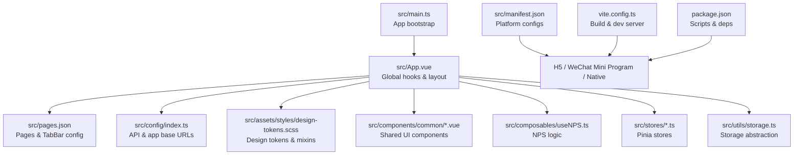
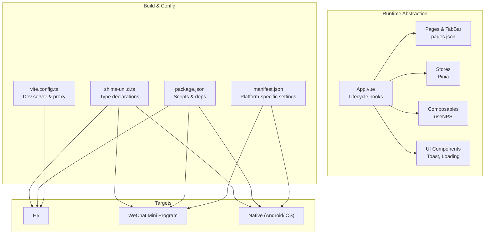
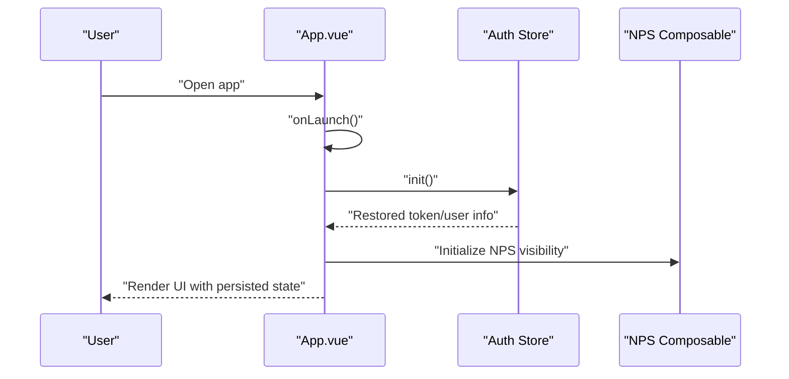
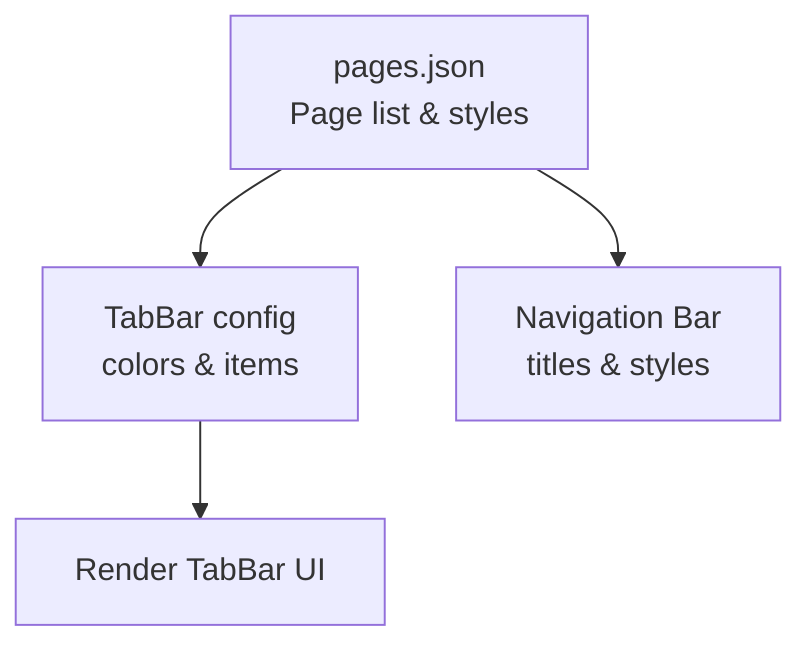
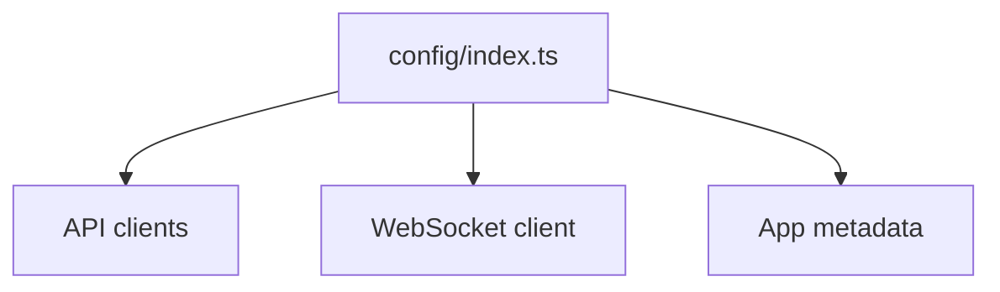
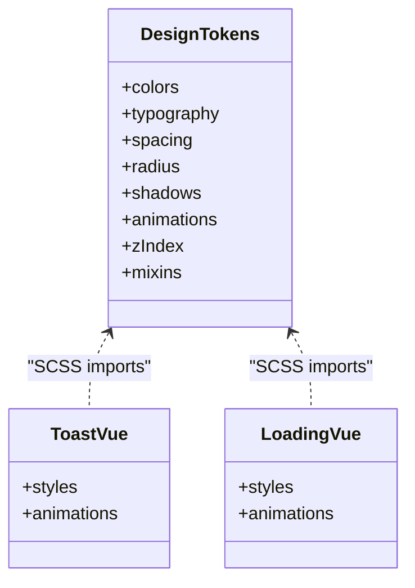
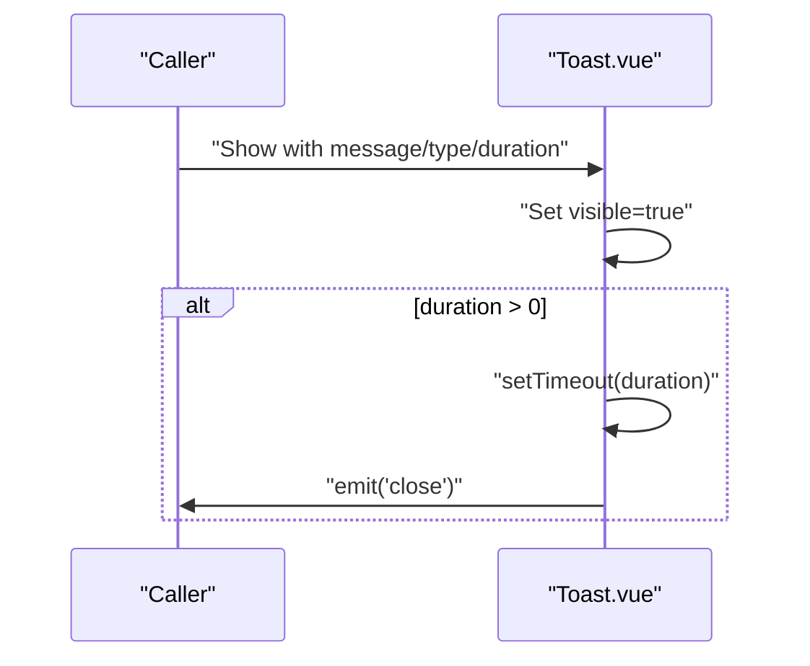
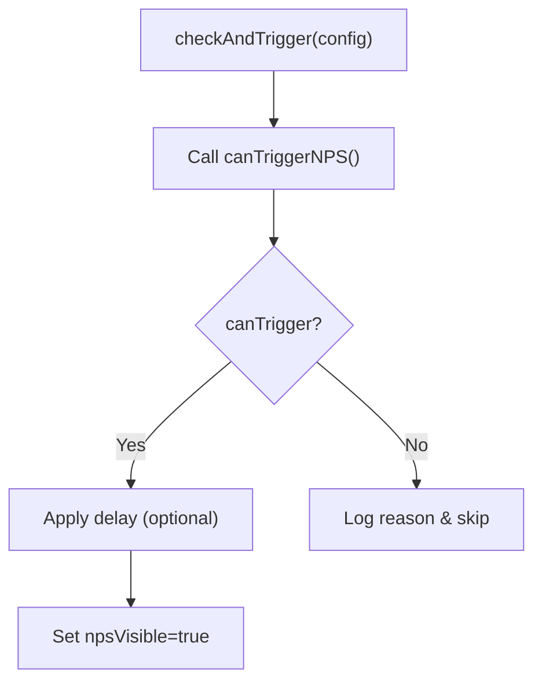
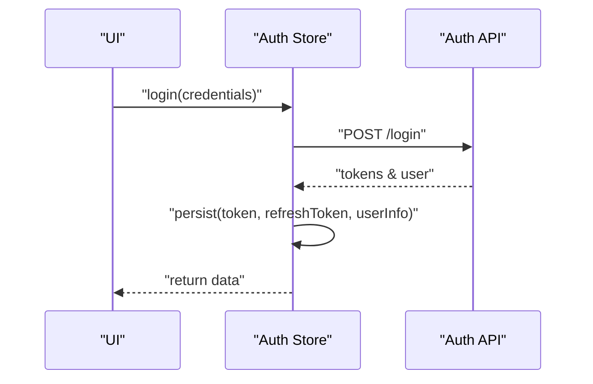
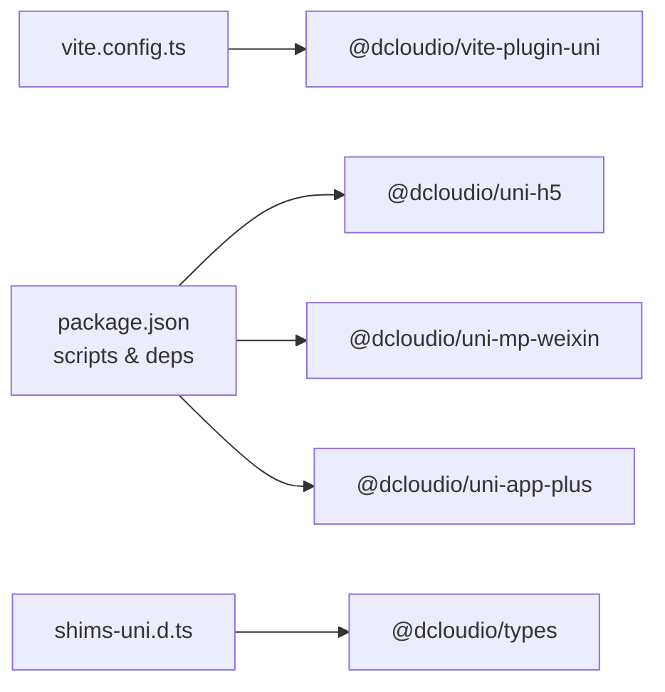

# Cross-Platform Design & Implementation

<cite>
**Referenced Files in This Document**
- [package.json](file://package.json)
- [vite.config.ts](file://vite.config.ts)
- [src/manifest.json](file://src/manifest.json)
- [src/pages.json](file://src/pages.json)
- [src/main.ts](file://src/main.ts)
- [src/App.vue](file://src/App.vue)
- [src/config/index.ts](file://src/config/index.ts)
- [shims-uni.d.ts](file://shims-uni.d.ts)
- [src/assets/styles/design-tokens.scss](file://src/assets/styles/design-tokens.scss)
- [src/components/common/Toast.vue](file://src/components/common/Toast.vue)
- [src/components/common/Loading.vue](file://src/components/common/Loading.vue)
- [src/composables/useNPS.ts](file://src/composables/useNPS.ts)
- [src/stores/auth.ts](file://src/stores/auth.ts)
- [src/utils/storage.ts](file://src/utils/storage.ts)
</cite>

## Table of Contents
1. [Introduction](#introduction)
2. [Project Structure](#project-structure)
3. [Core Components](#core-components)
4. [Architecture Overview](#architecture-overview)
5. [Detailed Component Analysis](#detailed-component-analysis)
6. [Dependency Analysis](#dependency-analysis)
7. [Performance Considerations](#performance-considerations)
8. [Troubleshooting Guide](#troubleshooting-guide)
9. [Conclusion](#conclusion)
10. [Appendices](#appendices)

## Introduction
This document provides comprehensive cross-platform design and implementation guidance for the WeTogether platform built with UniApp. It explains how the codebase targets H5, WeChat Mini Program, and native mobile platforms, documents platform-specific configurations, conditional rendering strategies, feature availability matrices, responsive design patterns, touch interaction handling, build and deployment differences, testing approaches, and performance optimizations tailored to each environment.

## Project Structure
The project follows a conventional UniApp structure with a focus on shared components, centralized configuration, and platform-agnostic UI logic. Key areas:
- Application bootstrap and global initialization
- Platform manifests and page routing
- Shared styles and design tokens
- Common UI components (toasts, loading)
- Composables for cross-cutting concerns (NPS)
- Global stores for state management
- Utilities for storage abstraction

**Diagram sources**
- [src/main.ts:1-18](file://src/main.ts#L1-L18)
- [src/App.vue:1-103](file://src/App.vue#L1-L103)
- [src/pages.json:1-253](file://src/pages.json#L1-L253)
- [src/config/index.ts:1-11](file://src/config/index.ts#L1-L11)
- [src/assets/styles/design-tokens.scss:1-240](file://src/assets/styles/design-tokens.scss#L1-L240)
- [src/components/common/Toast.vue:1-139](file://src/components/common/Toast.vue#L1-L139)
- [src/components/common/Loading.vue:1-46](file://src/components/common/Loading.vue#L1-L46)
- [src/composables/useNPS.ts:1-145](file://src/composables/useNPS.ts#L1-L145)
- [src/stores/auth.ts:1-137](file://src/stores/auth.ts#L1-L137)
- [src/utils/storage.ts:1-26](file://src/utils/storage.ts#L1-L26)
- [src/manifest.json:1-48](file://src/manifest.json#L1-L48)
- [vite.config.ts:1-49](file://vite.config.ts#L1-L49)
- [package.json:1-100](file://package.json#L1-L100)

**Section sources**
- [src/main.ts:1-18](file://src/main.ts#L1-L18)
- [src/App.vue:1-103](file://src/App.vue#L1-L103)
- [src/pages.json:1-253](file://src/pages.json#L1-L253)
- [src/config/index.ts:1-11](file://src/config/index.ts#L1-L11)
- [src/assets/styles/design-tokens.scss:1-240](file://src/assets/styles/design-tokens.scss#L1-L240)
- [src/components/common/Toast.vue:1-139](file://src/components/common/Toast.vue#L1-L139)
- [src/components/common/Loading.vue:1-46](file://src/components/common/Loading.vue#L1-L46)
- [src/composables/useNPS.ts:1-145](file://src/composables/useNPS.ts#L1-L145)
- [src/stores/auth.ts:1-137](file://src/stores/auth.ts#L1-L137)
- [src/utils/storage.ts:1-26](file://src/utils/storage.ts#L1-L26)
- [src/manifest.json:1-48](file://src/manifest.json#L1-L48)
- [vite.config.ts:1-49](file://vite.config.ts#L1-L49)
- [package.json:1-100](file://package.json#L1-L100)

## Core Components
- App bootstrap and Pinia setup: initializes the app instance and persistent state via Pinia.
- Global app lifecycle hooks: handles launch, show, hide events and initializes auth state.
- Pages and TabBar configuration: defines navigation, routes, and global UI styles.
- Configuration: centralizes API base URLs, WebSocket endpoint, and app metadata.
- Design tokens: provides a unified design system for colors, typography, spacing, shadows, animations, z-index, and component sizes.
- Common UI components: reusable toast and loading indicators with platform-aware styling.
- NPS composable: encapsulates NPS trigger logic, scenes, and success feedback.
- Auth store: manages authentication state, persistence, refresh token flow, and profile updates.
- Storage utility: abstracts platform storage APIs with safe JSON serialization.

**Section sources**
- [src/main.ts:1-18](file://src/main.ts#L1-L18)
- [src/App.vue:1-103](file://src/App.vue#L1-L103)
- [src/pages.json:1-253](file://src/pages.json#L1-L253)
- [src/config/index.ts:1-11](file://src/config/index.ts#L1-L11)
- [src/assets/styles/design-tokens.scss:1-240](file://src/assets/styles/design-tokens.scss#L1-L240)
- [src/components/common/Toast.vue:1-139](file://src/components/common/Toast.vue#L1-L139)
- [src/components/common/Loading.vue:1-46](file://src/components/common/Loading.vue#L1-L46)
- [src/composables/useNPS.ts:1-145](file://src/composables/useNPS.ts#L1-L145)
- [src/stores/auth.ts:1-137](file://src/stores/auth.ts#L1-L137)
- [src/utils/storage.ts:1-26](file://src/utils/storage.ts#L1-L26)

## Architecture Overview
The architecture leverages UniApp’s runtime abstraction to share logic across H5, WeChat Mini Program, and native targets. Build-time and runtime differences are handled via platform manifests, Vite configuration, and environment variables.

**Diagram sources**
- [src/App.vue:1-103](file://src/App.vue#L1-L103)
- [src/pages.json:1-253](file://src/pages.json#L1-L253)
- [src/stores/auth.ts:1-137](file://src/stores/auth.ts#L1-L137)
- [src/composables/useNPS.ts:1-145](file://src/composables/useNPS.ts#L1-L145)
- [src/components/common/Toast.vue:1-139](file://src/components/common/Toast.vue#L1-L139)
- [vite.config.ts:1-49](file://vite.config.ts#L1-L49)
- [src/manifest.json:1-48](file://src/manifest.json#L1-L48)
- [package.json:1-100](file://package.json#L1-L100)
- [shims-uni.d.ts:1-11](file://shims-uni.d.ts#L1-L11)

## Detailed Component Analysis

### App Bootstrap and Lifecycle
- Creates the SSR app instance, registers Pinia, and exports a factory for platform consumption.
- Initializes authentication state on launch and exposes global NPS modal integration.

**Diagram sources**
- [src/App.vue:9-25](file://src/App.vue#L9-L25)
- [src/stores/auth.ts:73-77](file://src/stores/auth.ts#L73-L77)
- [src/composables/useNPS.ts:9-13](file://src/composables/useNPS.ts#L9-L13)

**Section sources**
- [src/main.ts:1-18](file://src/main.ts#L1-L18)
- [src/App.vue:1-103](file://src/App.vue#L1-L103)
- [src/stores/auth.ts:73-77](file://src/stores/auth.ts#L73-L77)
- [src/composables/useNPS.ts:9-13](file://src/composables/useNPS.ts#L9-L13)

### Pages and TabBar Routing
- Defines page routes, navigation bar titles, and TabBar entries per platform.
- Global style settings apply to all pages (navigation bar text, background, tab bar colors).

**Diagram sources**
- [src/pages.json:1-253](file://src/pages.json#L1-L253)

**Section sources**
- [src/pages.json:1-253](file://src/pages.json#L1-L253)

### Configuration Management
- Centralizes API base URL, timeout, WebSocket URL, and app metadata.
- Consumed by API clients and services to ensure consistent endpoints across platforms.

**Diagram sources**
- [src/config/index.ts:1-11](file://src/config/index.ts#L1-L11)

**Section sources**
- [src/config/index.ts:1-11](file://src/config/index.ts#L1-L11)

### Design Tokens and Styles
- Provides a comprehensive design system: colors, typography, spacing, radius, shadows, animations, z-index, and component sizes.
- Includes SCSS mixins for common patterns (flex center, text ellipsis, transitions, cards).
- Used across components to maintain visual consistency.

**Diagram sources**
- [src/assets/styles/design-tokens.scss:1-240](file://src/assets/styles/design-tokens.scss#L1-L240)
- [src/components/common/Toast.vue:54-139](file://src/components/common/Toast.vue#L54-L139)
- [src/components/common/Loading.vue:14-46](file://src/components/common/Loading.vue#L14-L46)

**Section sources**
- [src/assets/styles/design-tokens.scss:1-240](file://src/assets/styles/design-tokens.scss#L1-L240)
- [src/components/common/Toast.vue:54-139](file://src/components/common/Toast.vue#L54-L139)
- [src/components/common/Loading.vue:14-46](file://src/components/common/Loading.vue#L14-L46)

### Common UI Components
- Toast: platform-aware toast with configurable positions, icons, and durations.
- Loading: spinner with optional text, used during async operations.

**Diagram sources**
- [src/components/common/Toast.vue:39-51](file://src/components/common/Toast.vue#L39-L51)

**Section sources**
- [src/components/common/Toast.vue:1-139](file://src/components/common/Toast.vue#L1-L139)
- [src/components/common/Loading.vue:1-46](file://src/components/common/Loading.vue#L1-L46)

### NPS Composable
- Encapsulates NPS trigger logic, scenes, and success feedback.
- Integrates with platform toast and emits success events.

**Diagram sources**
- [src/composables/useNPS.ts:18-38](file://src/composables/useNPS.ts#L18-L38)

**Section sources**
- [src/composables/useNPS.ts:1-145](file://src/composables/useNPS.ts#L1-L145)

### Authentication Store
- Manages token, refresh token, and user info with persistence.
- Implements login, register, logout, refresh token, and profile update flows.
- Emits global events for avatar updates.

**Diagram sources**
- [src/stores/auth.ts:18-29](file://src/stores/auth.ts#L18-L29)

**Section sources**
- [src/stores/auth.ts:1-137](file://src/stores/auth.ts#L1-L137)

### Storage Utility
- Provides a safe wrapper around platform storage with JSON serialization.
- Handles errors gracefully and supports get/set/remove/clear.

**Section sources**
- [src/utils/storage.ts:1-26](file://src/utils/storage.ts#L1-L26)

## Dependency Analysis
- Build toolchain: Vite with @dcloudio/vite-plugin-uni, environment variable-driven dev/proxy configuration.
- Platform packages: @dcloudio/uni-app plus platform-specific packages for H5, WeChat Mini Program, and native targets.
- Scripts: dedicated dev/build commands per platform target.
- Type safety: shims-uni.d.ts augments Vue with UniApp types.

**Diagram sources**
- [vite.config.ts:1-49](file://vite.config.ts#L1-L49)
- [package.json:45-78](file://package.json#L45-L78)
- [shims-uni.d.ts:1-11](file://shims-uni.d.ts#L1-L11)

**Section sources**
- [vite.config.ts:1-49](file://vite.config.ts#L1-L49)
- [package.json:45-78](file://package.json#L45-L78)
- [shims-uni.d.ts:1-11](file://shims-uni.d.ts#L1-L11)

## Performance Considerations
- Lazy-load heavy components and images to reduce initial bundle size.
- Use virtualized lists for long feeds to minimize DOM nodes.
- Debounce input handlers and throttle scroll events to avoid excessive reflows.
- Minimize deep reactive objects; prefer shallow refs for large arrays.
- Cache API responses with appropriate TTL and invalidate on user actions.
- Avoid frequent synchronous storage writes; batch updates where possible.
- Prefer CSS transforms and opacity for animations; avoid layout-affecting properties.
- Use platform-specific splash screens and preloads to improve perceived performance.

## Troubleshooting Guide
- Network requests fail:
  - Verify API base URL and WebSocket URL in configuration.
  - Confirm dev server proxy settings and CORS on backend.
- Authentication issues:
  - Check token persistence and refresh token flow.
  - Ensure storage operations succeed and handle exceptions.
- Platform-specific UI quirks:
  - Review manifest settings for each platform (e.g., splash screen, permissions).
  - Validate TabBar and navigation bar styles in pages.json.
- Build failures:
  - Ensure platform packages match the UniApp version.
  - Confirm scripts and environment variables are set correctly.

**Section sources**
- [src/config/index.ts:1-11](file://src/config/index.ts#L1-L11)
- [src/stores/auth.ts:54-71](file://src/stores/auth.ts#L54-L71)
- [src/utils/storage.ts:1-26](file://src/utils/storage.ts#L1-L26)
- [src/manifest.json:8-26](file://src/manifest.json#L8-L26)
- [src/pages.json:220-250](file://src/pages.json#L220-L250)
- [package.json:4-43](file://package.json#L4-L43)

## Conclusion
WeTogether’s UniApp implementation provides a robust, cross-platform foundation. By leveraging shared logic, centralized configuration, and a strong design system, the platform achieves consistency across H5, WeChat Mini Program, and native targets. Platform-specific manifests and build scripts enable targeted optimizations while maintaining a single codebase. Following the guidance in this document will help sustain quality, performance, and user experience across all supported environments.

## Appendices

### Platform-Specific Adaptations and Feature Availability Matrix
- H5
  - Web browser APIs: fetch, WebSocket, localStorage, sessionStorage.
  - Dev server with proxy for API and WebSocket traffic.
  - SSR mode available via CLI flags.
- WeChat Mini Program
  - Mini program SDKs and component model.
  - Manifest settings for appid, usingComponents, and security settings.
- Native Mobile (Android/iOS)
  - Native modules and splash screen configuration.
  - Permissions and distribution settings in manifest.

**Section sources**
- [vite.config.ts:27-47](file://vite.config.ts#L27-L47)
- [src/manifest.json:8-26](file://src/manifest.json#L8-L26)
- [package.json:14-42](file://package.json#L14-L42)

### Responsive Design Patterns and Touch Interactions
- Use rpx units and design tokens for scalable layouts.
- Implement gesture-friendly touch targets with adequate spacing.
- Apply platform-aware styles for input autofill and focus states.
- Utilize mixins for consistent animations and transitions.

**Section sources**
- [src/assets/styles/design-tokens.scss:1-240](file://src/assets/styles/design-tokens.scss#L1-L240)
- [src/App.vue:57-101](file://src/App.vue#L57-L101)

### Build Configuration Differences
- Vite plugin for UniApp enables platform builds.
- Environment variables drive API and WebSocket endpoints.
- Dev server proxy routes API and WebSocket traffic to backend.

**Section sources**
- [vite.config.ts:1-49](file://vite.config.ts#L1-L49)
- [src/config/index.ts:1-11](file://src/config/index.ts#L1-L11)

### Deployment Strategies
- H5: Build artifacts deployed to web server; configure HTTPS and caching.
- WeChat Mini Program: Use official developer tools to compile and upload.
- Native: Use HBuilderX or platform toolchains to package and distribute.

[No sources needed since this section provides general guidance]

### Testing Approaches
- Unit tests for composables and stores.
- Component tests for UI components with mocked storage and APIs.
- End-to-end tests across platforms using platform-specific automation frameworks.

[No sources needed since this section provides general guidance]