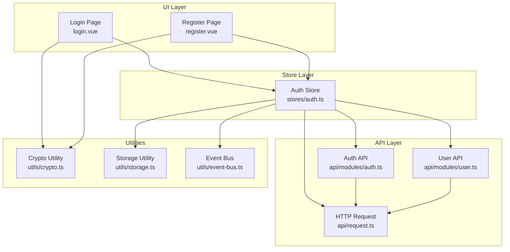
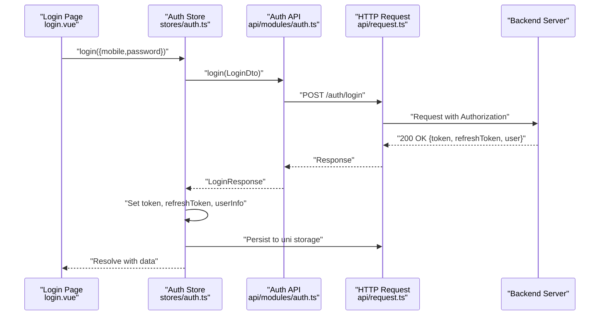
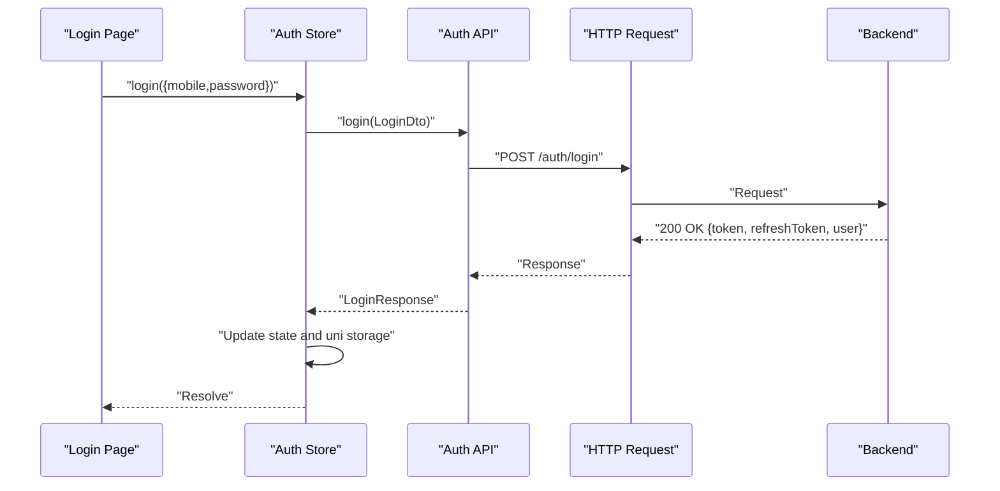
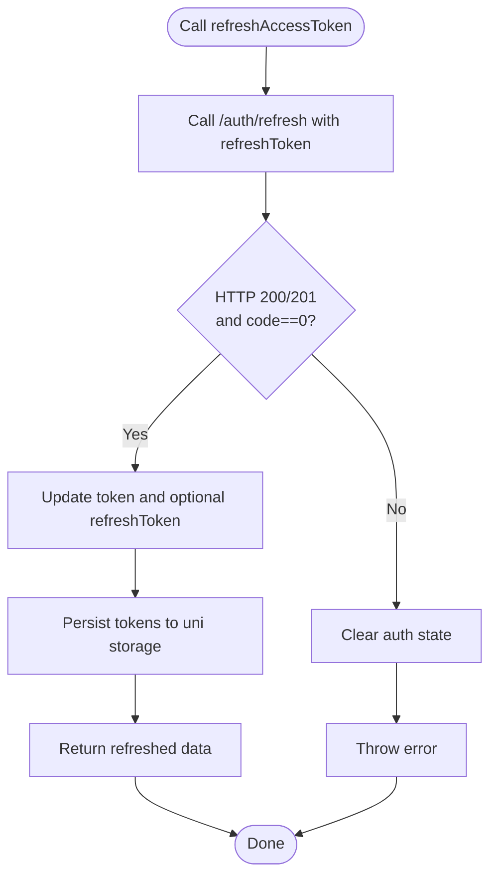
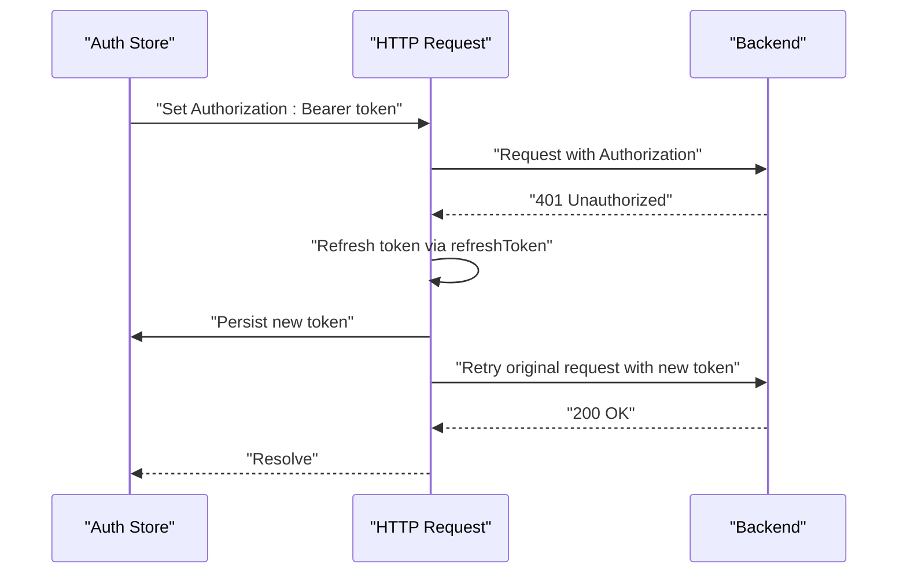
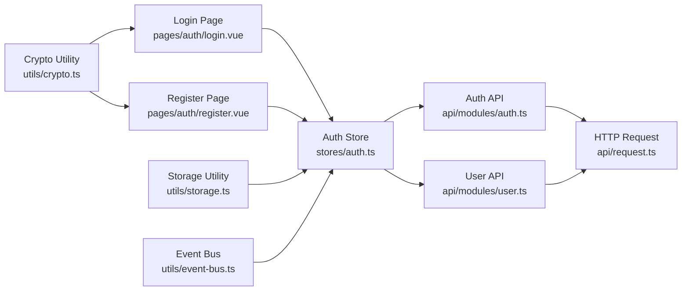

# Authentication Store

<cite>
**Referenced Files in This Document**
- [auth.ts](file://src/stores/auth.ts)
- [auth.ts](file://src/api/modules/auth.ts)
- [user.ts](file://src/api/modules/user.ts)
- [request.ts](file://src/api/request.ts)
- [login.vue](file://src/pages/auth/login.vue)
- [register.vue](file://src/pages/auth/register.vue)
- [storage.ts](file://src/utils/storage.ts)
- [main.ts](file://src/main.ts)
- [backend-types.ts](file://src/types/api/backend-types.ts)
- [crypto.ts](file://src/utils/crypto.ts)
- [event-bus.ts](file://src/utils/event-bus.ts)
</cite>

## Table of Contents
1. [Introduction](#introduction)
2. [Project Structure](#project-structure)
3. [Core Components](#core-components)
4. [Architecture Overview](#architecture-overview)
5. [Detailed Component Analysis](#detailed-component-analysis)
6. [Dependency Analysis](#dependency-analysis)
7. [Performance Considerations](#performance-considerations)
8. [Troubleshooting Guide](#troubleshooting-guide)
9. [Conclusion](#conclusion)
10. [Appendices](#appendices)

## Introduction
This document describes the authentication store implementation for the frontend application. It covers the authentication state model, actions for login, logout, registration, and token refresh, state getters for user profile access and session validation, JWT token handling, local storage persistence, automatic token refresh mechanisms, error handling strategies, and security considerations. It also provides examples of how to use the authentication state in components and route guards.

## Project Structure
The authentication system spans several modules:
- Pinia store for authentication state and actions
- API modules for authentication and user operations
- HTTP request layer with automatic token refresh
- Pages for login and registration
- Utilities for encryption, storage, and event bus
- Types for backend DTOs and responses

**Diagram sources**
- [auth.ts:1-137](file://src/stores/auth.ts#L1-L137)
- [auth.ts:1-57](file://src/api/modules/auth.ts#L1-L57)
- [user.ts:1-101](file://src/api/modules/user.ts#L1-L101)
- [request.ts:1-228](file://src/api/request.ts#L1-L228)
- [login.vue:1-227](file://src/pages/auth/login.vue#L1-L227)
- [register.vue:1-501](file://src/pages/auth/register.vue#L1-L501)
- [crypto.ts:1-18](file://src/utils/crypto.ts#L1-L18)
- [storage.ts:1-26](file://src/utils/storage.ts#L1-L26)
- [event-bus.ts:1-49](file://src/utils/event-bus.ts#L1-L49)

**Section sources**
- [auth.ts:1-137](file://src/stores/auth.ts#L1-L137)
- [auth.ts:1-57](file://src/api/modules/auth.ts#L1-L57)
- [user.ts:1-101](file://src/api/modules/user.ts#L1-L101)
- [request.ts:1-228](file://src/api/request.ts#L1-L228)
- [login.vue:1-227](file://src/pages/auth/login.vue#L1-L227)
- [register.vue:1-501](file://src/pages/auth/register.vue#L1-L501)
- [crypto.ts:1-18](file://src/utils/crypto.ts#L1-L18)
- [storage.ts:1-26](file://src/utils/storage.ts#L1-L26)
- [event-bus.ts:1-49](file://src/utils/event-bus.ts#L1-L49)

## Core Components
- Authentication Store (Pinia)
  - State: token, refreshToken, userInfo
  - Getters: isLoggedIn
  - Actions: login, register, logout, refreshAccessToken, init, updateUserInfo, updateProfile
  - Persistence: enabled via pinia-plugin-persistedstate
- Auth API Module
  - Methods: sendSms, register, login, refreshToken, updateUser
- User API Module
  - Methods: getCurrentUser, updateUser, updateProfile, getUserPoints, getUserProfile, uploadAvatar, changeMobile, reportUser, blockUser
- HTTP Request Layer
  - Automatic token refresh on 401 Unauthorized
  - Subscriber queue to avoid concurrent refreshes
  - Authorization header injection
- Encryption Utility
  - Password hashing using SHA256 before sending to backend
- Storage Utility
  - JSON-safe wrappers around uni storage
- Event Bus
  - Global events for avatar updates and user info updates

**Section sources**
- [auth.ts:1-137](file://src/stores/auth.ts#L1-L137)
- [auth.ts:1-57](file://src/api/modules/auth.ts#L1-L57)
- [user.ts:1-101](file://src/api/modules/user.ts#L1-L101)
- [request.ts:1-228](file://src/api/request.ts#L1-L228)
- [crypto.ts:1-18](file://src/utils/crypto.ts#L1-L18)
- [storage.ts:1-26](file://src/utils/storage.ts#L1-L26)
- [event-bus.ts:1-49](file://src/utils/event-bus.ts#L1-L49)

## Architecture Overview
The authentication flow integrates UI pages, the Pinia store, API modules, and the HTTP request layer. The request layer automatically handles token refresh on 401 responses and retries the original request after obtaining a new access token.

**Diagram sources**
- [login.vue:68-103](file://src/pages/auth/login.vue#L68-L103)
- [auth.ts:18-29](file://src/stores/auth.ts#L18-L29)
- [auth.ts:40-41](file://src/api/modules/auth.ts#L40-L41)
- [request.ts:75-208](file://src/api/request.ts#L75-L208)

## Detailed Component Analysis

### Authentication State Model
The store maintains three primary state fields:
- token: current access token
- refreshToken: refresh token for obtaining new access tokens
- userInfo: logged-in user profile

Computed getter:
- isLoggedIn: derived from token presence

Persistence:
- Enabled via Pinia plugin persisted state
- Store initializes from uni storage on startup

**Section sources**
- [auth.ts:12-16](file://src/stores/auth.ts#L12-L16)
- [auth.ts:73-77](file://src/stores/auth.ts#L73-L77)
- [main.ts](file://src/main.ts#L10)

### Authentication Actions

#### Login
- Encrypts password client-side using SHA256
- Calls authApi.login with LoginDto
- Updates token, refreshToken, and userInfo
- Persists all values to uni storage
- Returns login response data

**Diagram sources**
- [login.vue:78-84](file://src/pages/auth/login.vue#L78-L84)
- [auth.ts:18-29](file://src/stores/auth.ts#L18-L29)
- [auth.ts:40-41](file://src/api/modules/auth.ts#L40-L41)
- [request.ts:75-208](file://src/api/request.ts#L75-L208)
- [crypto.ts:14-16](file://src/utils/crypto.ts#L14-L16)

**Section sources**
- [login.vue:68-103](file://src/pages/auth/login.vue#L68-L103)
- [auth.ts:18-29](file://src/stores/auth.ts#L18-L29)
- [auth.ts:28-41](file://src/api/modules/auth.ts#L28-L41)
- [crypto.ts:14-16](file://src/utils/crypto.ts#L14-L16)

#### Registration
- Sends SMS verification via authApi.sendSms
- Encrypts password client-side
- Calls authApi.register with RegisterDto
- Updates token, refreshToken, and userInfo
- Persists all values to uni storage

**Section sources**
- [register.vue:181-302](file://src/pages/auth/register.vue#L181-L302)
- [auth.ts:31-42](file://src/stores/auth.ts#L31-L42)
- [auth.ts:34-39](file://src/api/modules/auth.ts#L34-L39)

#### Logout
- Clears token, refreshToken, and userInfo
- Removes persisted values from uni storage

**Section sources**
- [auth.ts:44-52](file://src/stores/auth.ts#L44-L52)

#### Refresh Access Token
- Calls authApi.refreshToken with stored refreshToken
- On success, updates token and optionally refreshToken
- Persists updated tokens to uni storage
- On failure, clears authentication state and rethrows error

**Diagram sources**
- [auth.ts:54-71](file://src/stores/auth.ts#L54-L71)
- [auth.ts:46-49](file://src/api/modules/auth.ts#L46-L49)

**Section sources**
- [auth.ts:54-71](file://src/stores/auth.ts#L54-L71)
- [auth.ts:46-49](file://src/api/modules/auth.ts#L46-L49)

#### Initialize Store
- Loads token, refreshToken, and userInfo from uni storage on app startup

**Section sources**
- [auth.ts:73-77](file://src/stores/auth.ts#L73-L77)

#### Update User Info and Profile
- updateUserInfo: updates local userInfo and emits avatar update event
- updateProfile: calls userApi.updateProfile and merges changes into local userInfo, persists to uni storage, emits avatar update event

**Section sources**
- [auth.ts:79-117](file://src/stores/auth.ts#L79-L117)
- [event-bus.ts:41-48](file://src/utils/event-bus.ts#L41-L48)

### State Getters and Session Validation
- isLoggedIn: computed boolean based on token presence
- Session validation: relies on HTTP layer’s Authorization header and automatic refresh; if token is invalid, requests are rejected and the user is redirected to login

**Section sources**
- [auth.ts](file://src/stores/auth.ts#L16)
- [request.ts:15-24](file://src/api/request.ts#L15-L24)
- [request.ts:100-147](file://src/api/request.ts#L100-L147)

### JWT Token Handling and Local Storage Persistence
- Access token is attached to Authorization header as Bearer token for all authenticated requests
- Tokens and user info are persisted to uni storage on login/register/logout and token refresh
- The store is configured to persist state across sessions via Pinia plugin

**Diagram sources**
- [request.ts:15-24](file://src/api/request.ts#L15-L24)
- [request.ts:100-174](file://src/api/request.ts#L100-L174)
- [auth.ts:54-71](file://src/stores/auth.ts#L54-L71)

**Section sources**
- [request.ts:15-24](file://src/api/request.ts#L15-L24)
- [request.ts:35-73](file://src/api/request.ts#L35-L73)
- [auth.ts:24-26](file://src/stores/auth.ts#L24-L26)
- [auth.ts:57-64](file://src/stores/auth.ts#L57-L64)
- [main.ts](file://src/main.ts#L10)

### Automatic Token Refresh Mechanism
- On 401 Unauthorized, the request layer attempts to refresh the token using refreshToken
- Prevents concurrent refreshes by maintaining a subscriber queue
- Retries the original request with the new token
- On refresh failure, clears storage and navigates to login

**Section sources**
- [request.ts:100-174](file://src/api/request.ts#L100-L174)
- [request.ts:35-73](file://src/api/request.ts#L35-L73)

### Error Handling Strategies
- UI pages show toast messages for login/register errors
- HTTP layer shows toasts for request failures and network errors
- On 401, the request layer displays a “login expired” message and navigates to login
- Errors thrown by store actions are propagated to callers for UI handling

**Section sources**
- [login.vue:94-102](file://src/pages/auth/login.vue#L94-L102)
- [register.vue:293-301](file://src/pages/auth/register.vue#L293-L301)
- [request.ts:94-147](file://src/api/request.ts#L94-L147)

### Security Considerations
- Passwords are hashed client-side using SHA256 before transmission; backend applies additional hashing
- Tokens are stored in uni storage; consider platform-specific security implications
- Authorization header is only added when a token exists
- Refresh token is used to obtain new access tokens without re-entering credentials

**Section sources**
- [crypto.ts:14-16](file://src/utils/crypto.ts#L14-L16)
- [request.ts:15-24](file://src/api/request.ts#L15-L24)
- [auth.ts:21-22](file://src/stores/auth.ts#L21-L22)

### Examples of Authentication State Usage

#### Using in Components
- Import the store and call actions:
  - Login: [login.vue:78-84](file://src/pages/auth/login.vue#L78-L84)
  - Register: [register.vue:255-272](file://src/pages/auth/register.vue#L255-L272)
  - Logout: [auth.ts:44-52](file://src/stores/auth.ts#L44-L52)
  - Refresh token: [auth.ts:54-71](file://src/stores/auth.ts#L54-L71)
- Access state and getters:
  - token, refreshToken, userInfo, isLoggedIn: [auth.ts:120-123](file://src/stores/auth.ts#L120-L123)

#### Route Guards
- Guard routes by checking isLoggedIn:
  - Example check: [auth.ts](file://src/stores/auth.ts#L16)
- Redirect unauthenticated users to login:
  - Navigation on 401: [request.ts:142-145](file://src/api/request.ts#L142-L145)

**Section sources**
- [login.vue:58-103](file://src/pages/auth/login.vue#L58-L103)
- [register.vue:153-302](file://src/pages/auth/register.vue#L153-L302)
- [auth.ts](file://src/stores/auth.ts#L16)
- [request.ts:142-145](file://src/api/request.ts#L142-L145)

## Dependency Analysis
The authentication store depends on API modules and the HTTP request layer. The request layer encapsulates token refresh logic and is reused by both auth and user APIs.

**Diagram sources**
- [auth.ts:1-137](file://src/stores/auth.ts#L1-L137)
- [auth.ts:1-57](file://src/api/modules/auth.ts#L1-L57)
- [user.ts:1-101](file://src/api/modules/user.ts#L1-L101)
- [request.ts:1-228](file://src/api/request.ts#L1-L228)
- [login.vue:1-227](file://src/pages/auth/login.vue#L1-L227)
- [register.vue:1-501](file://src/pages/auth/register.vue#L1-L501)
- [crypto.ts:1-18](file://src/utils/crypto.ts#L1-L18)
- [storage.ts:1-26](file://src/utils/storage.ts#L1-L26)
- [event-bus.ts:1-49](file://src/utils/event-bus.ts#L1-L49)

**Section sources**
- [auth.ts:1-137](file://src/stores/auth.ts#L1-L137)
- [auth.ts:1-57](file://src/api/modules/auth.ts#L1-L57)
- [user.ts:1-101](file://src/api/modules/user.ts#L1-L101)
- [request.ts:1-228](file://src/api/request.ts#L1-L228)

## Performance Considerations
- Minimize repeated network calls by leveraging cached state and computed getters
- Avoid concurrent token refresh by relying on the subscriber queue mechanism
- Persist only essential data to reduce storage overhead

## Troubleshooting Guide
- Login/Register fails silently
  - Check UI toast messages and console logs
  - Verify backend endpoints and network connectivity
  - Confirm password encryption is applied before sending
- 401 Unauthorized repeatedly
  - Ensure refreshToken is present and valid
  - Review automatic refresh logic and storage persistence
- Avatar not updating after profile change
  - Confirm updateProfile action emits avatar update event
  - Verify event listeners are registered

**Section sources**
- [login.vue:94-102](file://src/pages/auth/login.vue#L94-L102)
- [register.vue:293-301](file://src/pages/auth/register.vue#L293-L301)
- [request.ts:100-174](file://src/api/request.ts#L100-L174)
- [auth.ts:105-111](file://src/stores/auth.ts#L105-L111)
- [event-bus.ts:26-31](file://src/utils/event-bus.ts#L26-L31)

## Conclusion
The authentication store provides a robust foundation for managing user sessions, tokens, and user profiles. It integrates tightly with the HTTP request layer to handle token refresh transparently, persists state across sessions, and offers convenient actions for login, registration, logout, and profile updates. By following the usage examples and security considerations outlined above, developers can build secure and reliable authentication flows in the application.

## Appendices

### Data Types Used in Authentication
- LoginDto, RegisterDto, ResetPasswordDto, SmsDto: [auth.ts:18-31](file://src/api/modules/auth.ts#L18-L31)
- User, UpdateUserDto, UpdateProfileDto: [backend-types.ts:94-151](file://src/types/api/backend-types.ts#L94-L151)
- ApiResponse: [backend-types.ts:4-9](file://src/types/api/backend-types.ts#L4-L9)

**Section sources**
- [auth.ts:18-31](file://src/api/modules/auth.ts#L18-L31)
- [backend-types.ts:4-9](file://src/types/api/backend-types.ts#L4-L9)
- [backend-types.ts:94-151](file://src/types/api/backend-types.ts#L94-L151)