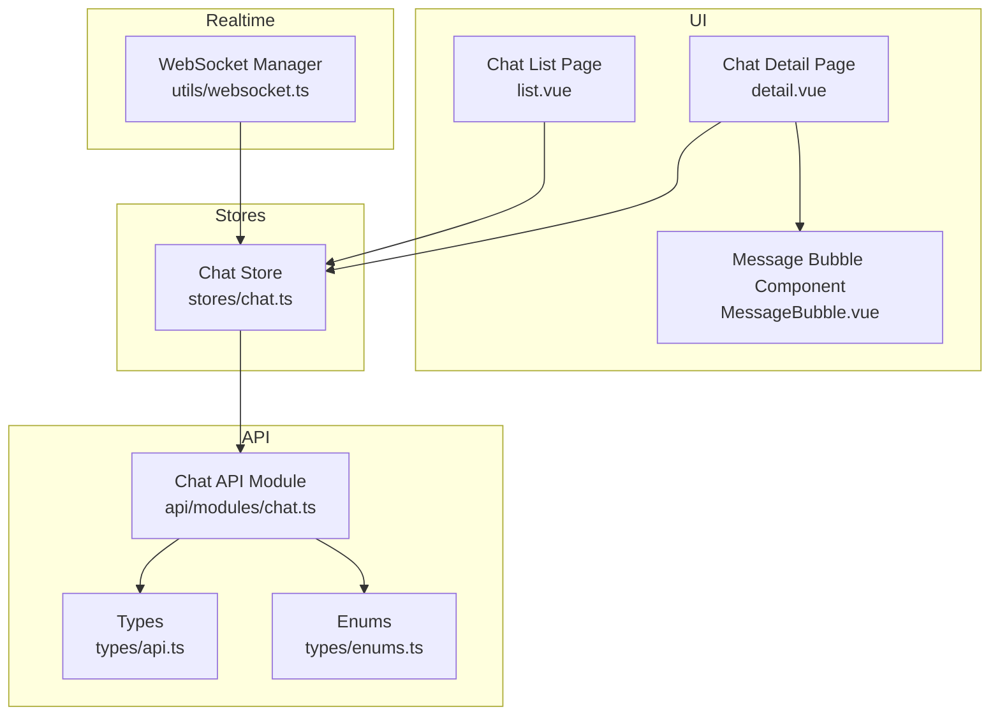
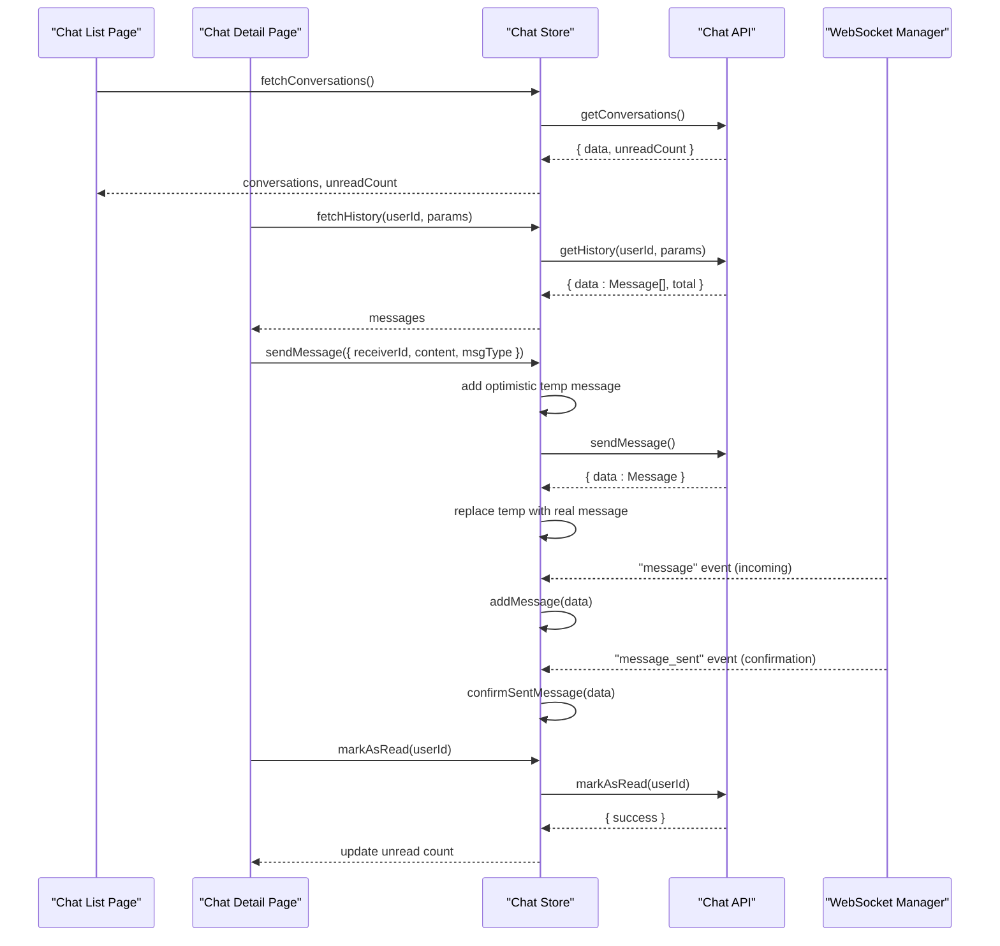
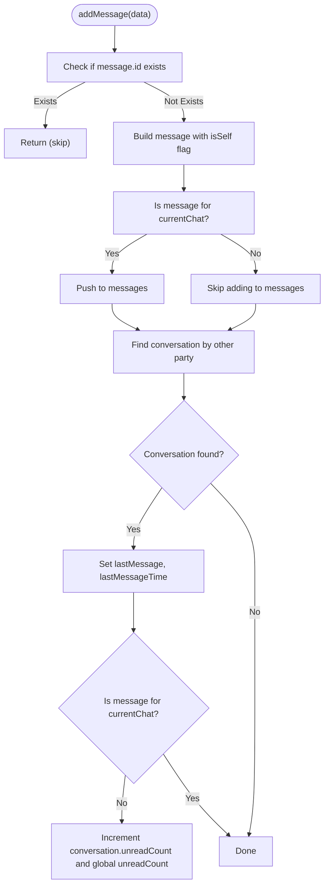
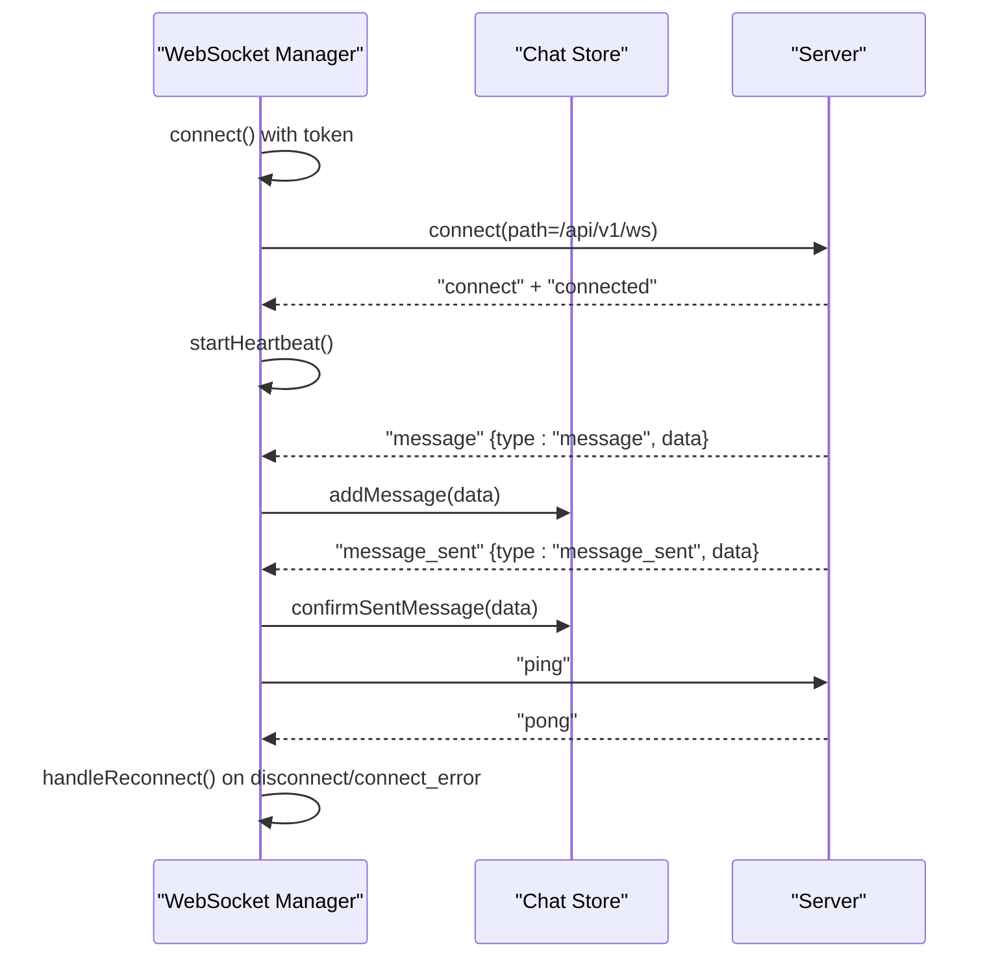
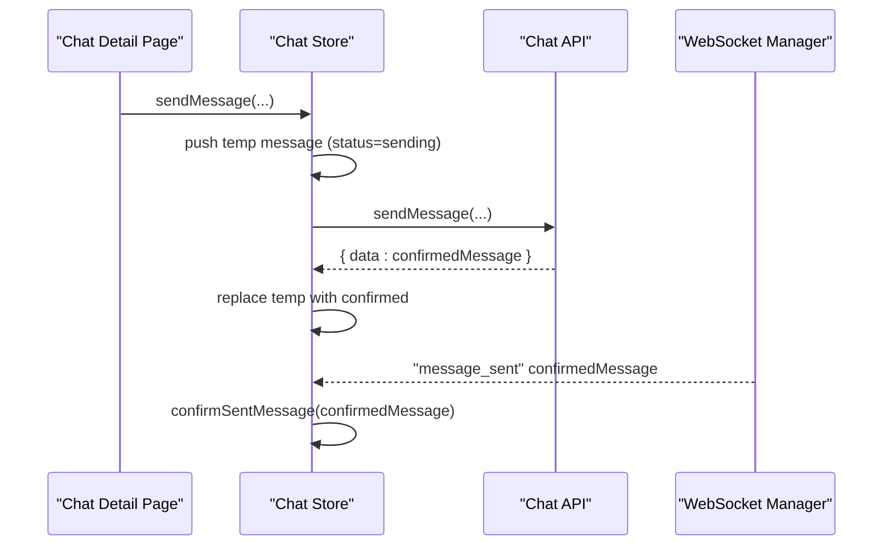
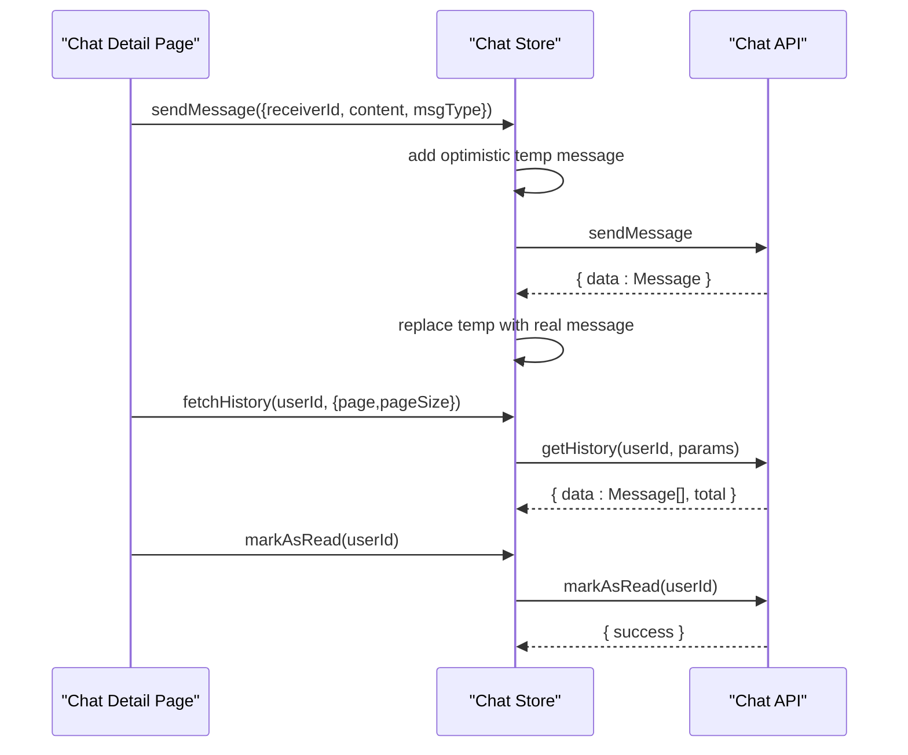
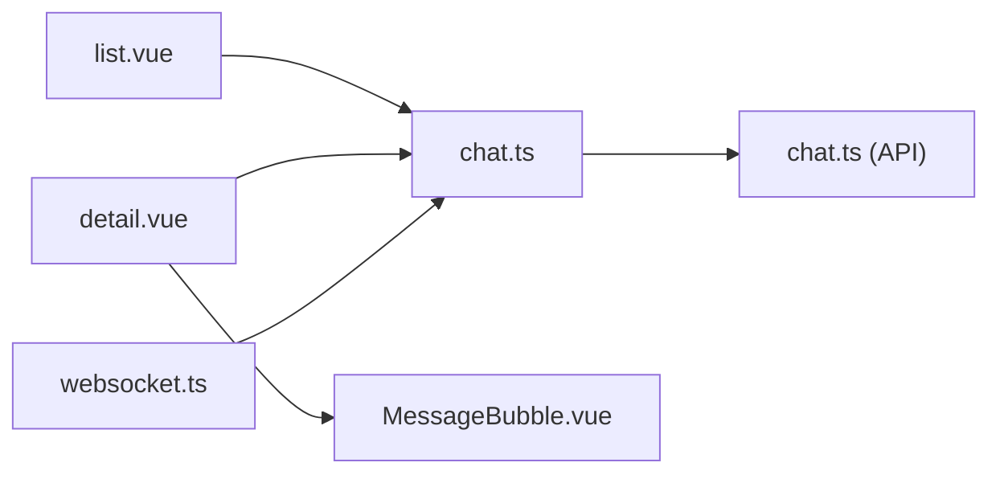
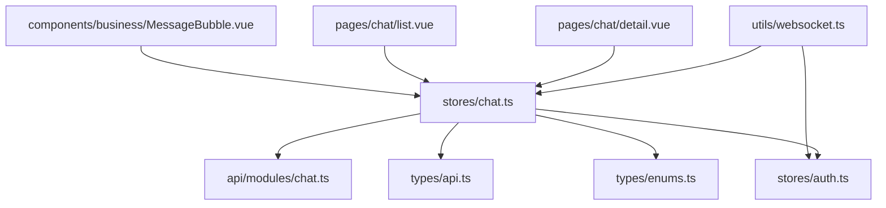

# Chat Store

<cite>
**Referenced Files in This Document**
- [chat.ts](file://src/stores/chat.ts)
- [chat.ts](file://src/api/modules/chat.ts)
- [websocket.ts](file://src/utils/websocket.ts)
- [backend-types.ts](file://src/types/api/backend-types.ts)
- [api.ts](file://src/types/api.ts)
- [enums.ts](file://src/types/enums.ts)
- [detail.vue](file://src/pages/chat/detail.vue)
- [list.vue](file://src/pages/chat/list.vue)
- [MessageBubble.vue](file://src/components/business/MessageBubble.vue)
</cite>

## Table of Contents
1. [Introduction](#introduction)
2. [Project Structure](#project-structure)
3. [Core Components](#core-components)
4. [Architecture Overview](#architecture-overview)
5. [Detailed Component Analysis](#detailed-component-analysis)
6. [Dependency Analysis](#dependency-analysis)
7. [Performance Considerations](#performance-considerations)
8. [Troubleshooting Guide](#troubleshooting-guide)
9. [Conclusion](#conclusion)

## Introduction
This document describes the chat store responsible for managing real-time messaging state in the application. It covers conversation state structure, message threading, and user presence tracking. It also documents chat actions for sending messages, creating conversations, and managing chat history, along with getters for active conversations, unread counts, and message filtering. WebSocket integration patterns, real-time message synchronization, and offline message handling are explained. Additionally, it covers chat room management, participant lists, typing indicators, and performance optimization strategies for large message histories and memory management.

## Project Structure
The chat functionality spans several layers:
- Stores: centralized reactive state for conversations, current chat, messages, and unread counts
- API module: typed chat endpoints for sending, fetching history, conversations, and marking as read
- WebSocket utility: connection lifecycle, event handling, reconnection, and heartbeat
- Pages: chat list and chat detail views that drive UI and trigger store actions
- Components: reusable message bubbles rendering messages and statuses
- Types: shared interfaces for messages, conversations, and enums

**Diagram sources**
- [list.vue:1-311](file://src/pages/chat/list.vue#L1-L311)
- [detail.vue:1-299](file://src/pages/chat/detail.vue#L1-L299)
- [MessageBubble.vue:1-309](file://src/components/business/MessageBubble.vue#L1-L309)
- [chat.ts:1-234](file://src/stores/chat.ts#L1-L234)
- [chat.ts:1-46](file://src/api/modules/chat.ts#L1-L46)
- [api.ts:26-43](file://src/types/api.ts#L26-L43)
- [enums.ts:7-11](file://src/types/enums.ts#L7-L11)
- [websocket.ts:1-171](file://src/utils/websocket.ts#L1-L171)

**Section sources**
- [chat.ts:1-234](file://src/stores/chat.ts#L1-L234)
- [chat.ts:1-46](file://src/api/modules/chat.ts#L1-L46)
- [websocket.ts:1-171](file://src/utils/websocket.ts#L1-L171)
- [api.ts:26-43](file://src/types/api.ts#L26-L43)
- [enums.ts:7-11](file://src/types/enums.ts#L7-L11)
- [list.vue:1-311](file://src/pages/chat/list.vue#L1-L311)
- [detail.vue:1-299](file://src/pages/chat/detail.vue#L1-L299)
- [MessageBubble.vue:1-309](file://src/components/business/MessageBubble.vue#L1-L309)

## Core Components
- Chat Store
  - Reactive state: conversations, currentChat, messages, unreadCount
  - Actions: fetchConversations, fetchHistory, sendMessage, markAsRead, addMessage, confirmSentMessage, setCurrentChat, clearMessages
  - Responsibilities: manage conversation list, message list, read/unread state, optimistic updates, and WebSocket-driven synchronization
- Chat API Module
  - Typed endpoints: sendMessage, getHistory, getConversations, getMessages, markAsRead
  - DTOs: SendMessageDto, GetMessagesParams
- WebSocket Manager
  - Connection lifecycle, authentication, reconnection, heartbeat, and event routing to store
- Pages and Components
  - Chat list page renders conversations and unread counts
  - Chat detail page renders messages, handles input, sends messages, and scrolls to bottom
  - Message bubble component renders message content, status, and avatar

**Section sources**
- [chat.ts:8-234](file://src/stores/chat.ts#L8-L234)
- [chat.ts:6-45](file://src/api/modules/chat.ts#L6-L45)
- [websocket.ts:6-171](file://src/utils/websocket.ts#L6-L171)
- [list.vue:59-98](file://src/pages/chat/list.vue#L59-L98)
- [detail.vue:50-172](file://src/pages/chat/detail.vue#L50-L172)
- [MessageBubble.vue:68-115](file://src/components/business/MessageBubble.vue#L68-L115)

## Architecture Overview
The chat store orchestrates state transitions triggered by user actions and WebSocket events. The UI pages call store actions to fetch data and send messages. The WebSocket manager emits events that the store consumes to update messages and conversation metadata in real time.

**Diagram sources**
- [chat.ts:14-98](file://src/stores/chat.ts#L14-L98)
- [chat.ts:18-45](file://src/api/modules/chat.ts#L18-L45)
- [websocket.ts:93-111](file://src/utils/websocket.ts#L93-L111)
- [detail.vue:116-148](file://src/pages/chat/detail.vue#L116-L148)
- [list.vue:78-91](file://src/pages/chat/list.vue#L78-L91)

## Detailed Component Analysis

### Chat Store State and Actions
The chat store encapsulates:
- conversations: array of conversation summaries with user identity, last message, last message time, and unread count
- currentChat: currently selected conversation (used to scope incoming messages)
- messages: ordered list of messages for the current chat
- unreadCount: global unread count across conversations

Key actions:
- fetchConversations: loads conversation list and maps backend fields for compatibility
- fetchHistory: loads paginated message history for a user and marks messages as self vs others
- sendMessage: optimistic UI update with temporary message, then replaces with server response
- markAsRead: marks a conversation’s unread count as zero
- addMessage: handles incoming WebSocket messages, deduplicates, updates current chat messages, and increments unread counts for other chats
- confirmSentMessage: replaces optimistic temporary messages with server-confirmed messages
- setCurrentChat/clearMessages: manage current chat context and reset message list

**Diagram sources**
- [chat.ts:100-158](file://src/stores/chat.ts#L100-L158)

**Section sources**
- [chat.ts:8-234](file://src/stores/chat.ts#L8-L234)

### WebSocket Integration Patterns
The WebSocket manager:
- Authenticates via token from auth store or local storage
- Connects to the configured wsURL with path /api/v1/ws
- Emits periodic ping heartbeats and handles pong
- Reconnects automatically up to a maximum number of attempts
- Routes incoming events to store actions:
  - "message": dispatches to addMessage
  - "message_sent": dispatches to confirmSentMessage
  - Direct message objects: dispatched to addMessage

**Diagram sources**
- [websocket.ts:15-141](file://src/utils/websocket.ts#L15-L141)
- [chat.ts:100-210](file://src/stores/chat.ts#L100-L210)

**Section sources**
- [websocket.ts:6-171](file://src/utils/websocket.ts#L6-L171)
- [chat.ts:92-210](file://src/stores/chat.ts#L92-L210)

### Real-Time Message Synchronization and Offline Handling
- Optimistic updates: sendMessage adds a temporary message immediately for instant feedback
- Confirmation replacement: confirmSentMessage swaps the temporary message with the server-confirmed message
- Deduplication: both addMessage and confirmSentMessage check for existing message IDs to avoid duplicates
- Offline handling: when disconnected, messages are still queued locally; upon reconnect, the server may resend confirmations or missed messages, which are safely merged via deduplication

**Diagram sources**
- [chat.ts:50-90](file://src/stores/chat.ts#L50-L90)
- [chat.ts:161-210](file://src/stores/chat.ts#L161-L210)
- [websocket.ts:93-111](file://src/utils/websocket.ts#L93-L111)

**Section sources**
- [chat.ts:50-90](file://src/stores/chat.ts#L50-L90)
- [chat.ts:161-210](file://src/stores/chat.ts#L161-L210)
- [websocket.ts:93-111](file://src/utils/websocket.ts#L93-L111)

### Chat Actions: Sending Messages, Creating Conversations, Managing History
- Sending messages
  - UI triggers sendMessage with receiverId, content, and optional msgType
  - Store performs optimistic update and awaits API response
- Creating conversations
  - The conversation list is populated by fetchConversations
  - Each conversation summary includes user identity and last message metadata
- Managing chat history
  - fetchHistory loads paginated messages for a given user
  - markAsRead updates unread counts for a conversation

**Diagram sources**
- [detail.vue:131-148](file://src/pages/chat/detail.vue#L131-L148)
- [chat.ts:50-98](file://src/stores/chat.ts#L50-L98)
- [chat.ts:18-45](file://src/api/modules/chat.ts#L18-L45)

**Section sources**
- [detail.vue:131-148](file://src/pages/chat/detail.vue#L131-L148)
- [chat.ts:50-98](file://src/stores/chat.ts#L50-L98)
- [chat.ts:18-45](file://src/api/modules/chat.ts#L18-L45)

### Getters and Filters: Active Conversations, Unread Counts, Message Filtering
- Active conversations
  - conversations array holds the list; mapped from backend with normalized fields
- Unread counts
  - unreadCount reflects total unread across conversations
  - Individual conversation.unreadCount is updated when receiving messages outside the current chat
- Message filtering
  - UI pages render messages filtered by currentChat context
  - The store maintains a single messages list per currentChat session

Note: There is no explicit getter method for unread counts; they are exposed as refs and updated reactively.

**Section sources**
- [chat.ts:14-25](file://src/stores/chat.ts#L14-L25)
- [chat.ts:146-158](file://src/stores/chat.ts#L146-L158)
- [list.vue:18-48](file://src/pages/chat/list.vue#L18-L48)

### Chat Room Management, Participant Lists, and Typing Indicators
- Chat rooms
  - Conversations represent chat rooms; each has a userId and associated metadata
- Participants
  - Participants are implicit via senderId/receiverId in messages; the store does not maintain a separate participant list
- Typing indicators
  - No typing indicator implementation is present in the current codebase

**Section sources**
- [api.ts:36-43](file://src/types/api.ts#L36-L43)
- [chat.ts:100-158](file://src/stores/chat.ts#L100-L158)

### UI Integration: Chat List and Chat Detail
- Chat list
  - Renders conversation items with avatar, nickname, last message, last time, and unread badges
  - Uses avatar sync composable to resolve avatar URLs
- Chat detail
  - Renders message bubbles, handles input, sends messages, retries failed sends, and scrolls to bottom
  - Sets currentChat context and clears messages on unmount

**Diagram sources**
- [list.vue:1-311](file://src/pages/chat/list.vue#L1-L311)
- [detail.vue:1-299](file://src/pages/chat/detail.vue#L1-L299)
- [MessageBubble.vue:1-309](file://src/components/business/MessageBubble.vue#L1-L309)
- [chat.ts:1-234](file://src/stores/chat.ts#L1-L234)
- [chat.ts:1-46](file://src/api/modules/chat.ts#L1-L46)
- [websocket.ts:1-171](file://src/utils/websocket.ts#L1-L171)

**Section sources**
- [list.vue:59-98](file://src/pages/chat/list.vue#L59-L98)
- [detail.vue:50-172](file://src/pages/chat/detail.vue#L50-L172)
- [MessageBubble.vue:68-115](file://src/components/business/MessageBubble.vue#L68-L115)

## Dependency Analysis
The chat store depends on:
- API module for network requests
- Auth store for user context and token
- WebSocket manager for real-time updates
- Types and enums for message and conversation structures

**Diagram sources**
- [chat.ts:1-8](file://src/stores/chat.ts#L1-L8)
- [chat.ts:1-6](file://src/api/modules/chat.ts#L1-L6)
- [api.ts:26-43](file://src/types/api.ts#L26-L43)
- [enums.ts:7-11](file://src/types/enums.ts#L7-L11)
- [websocket.ts:1-4](file://src/utils/websocket.ts#L1-L4)
- [detail.vue:50-57](file://src/pages/chat/detail.vue#L50-L57)
- [list.vue:59-64](file://src/pages/chat/list.vue#L59-L64)
- [MessageBubble.vue:68-72](file://src/components/business/MessageBubble.vue#L68-L72)

**Section sources**
- [chat.ts:1-8](file://src/stores/chat.ts#L1-L8)
- [chat.ts:1-6](file://src/api/modules/chat.ts#L1-L6)
- [websocket.ts:1-4](file://src/utils/websocket.ts#L1-L4)

## Performance Considerations
- Large message histories
  - Use pagination in getHistory to limit initial payload sizes
  - Virtualize long message lists in the UI to reduce DOM nodes
- Memory management
  - Clear messages when leaving chat detail to prevent accumulation
  - Avoid storing redundant copies of user objects inside messages
- Real-time updates
  - Deduplicate messages to prevent duplicate DOM nodes and re-renders
  - Debounce UI scrolling after large batches of messages
- Network resilience
  - Rely on WebSocket reconnection and heartbeat to maintain liveness
  - Use optimistic updates to minimize perceived latency while preserving correctness

[No sources needed since this section provides general guidance]

## Troubleshooting Guide
Common issues and remedies:
- Messages not appearing in current chat
  - Verify currentChat is set correctly and that addMessage checks match sender/receiver IDs
- Duplicate messages after reconnect
  - Confirm deduplication logic by message ID before pushing to messages
- Sending fails but optimistic temp remains
  - Ensure error branch sets message status to failed and surface retry UX
- Unread counts not updating
  - Confirm that non-current-chat messages increment conversation.unreadCount and global unreadCount
- WebSocket not connecting
  - Check token availability and wsURL configuration; verify reconnection attempts and heartbeat timers

**Section sources**
- [chat.ts:100-158](file://src/stores/chat.ts#L100-L158)
- [chat.ts:161-210](file://src/stores/chat.ts#L161-L210)
- [websocket.ts:15-53](file://src/utils/websocket.ts#L15-L53)

## Conclusion
The chat store provides a robust foundation for real-time messaging with optimistic updates, deduplication, and seamless WebSocket integration. It manages conversation lists, per-session message threads, and unread counts while supporting pagination and UI-driven actions. Extending support for typing indicators and participant lists would further enhance the chat experience. Adopting virtualized rendering and strict message deduplication ensures scalability and responsiveness for large histories.