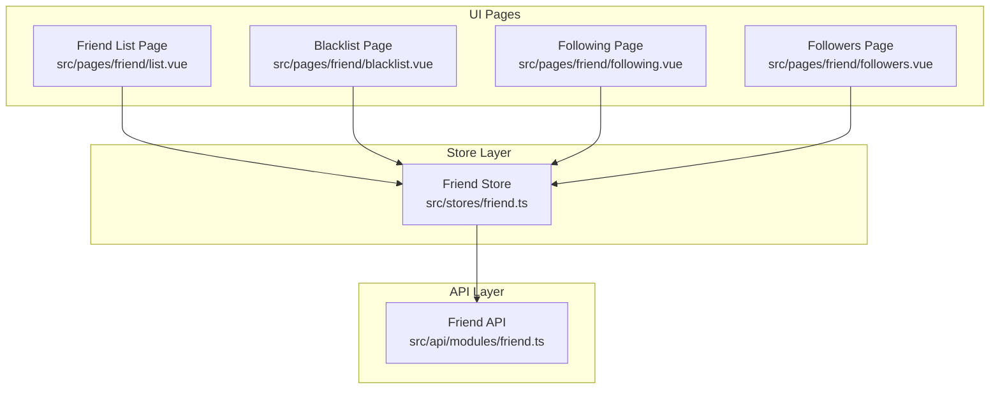
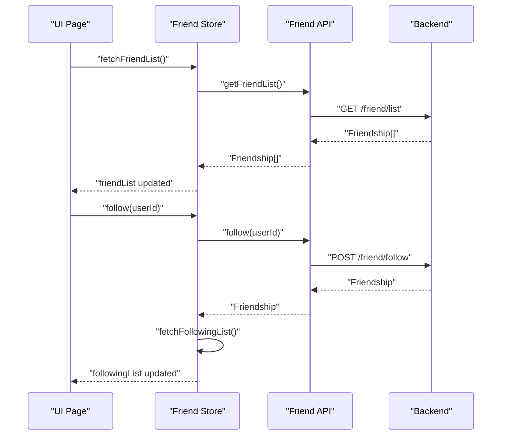
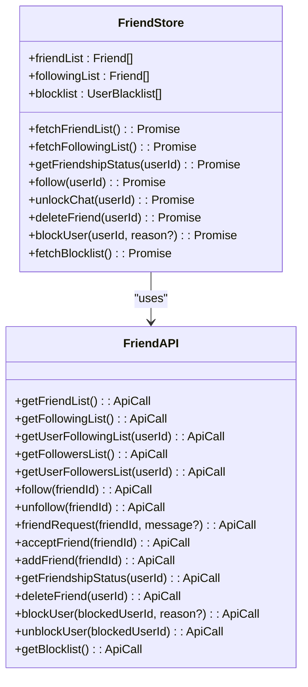
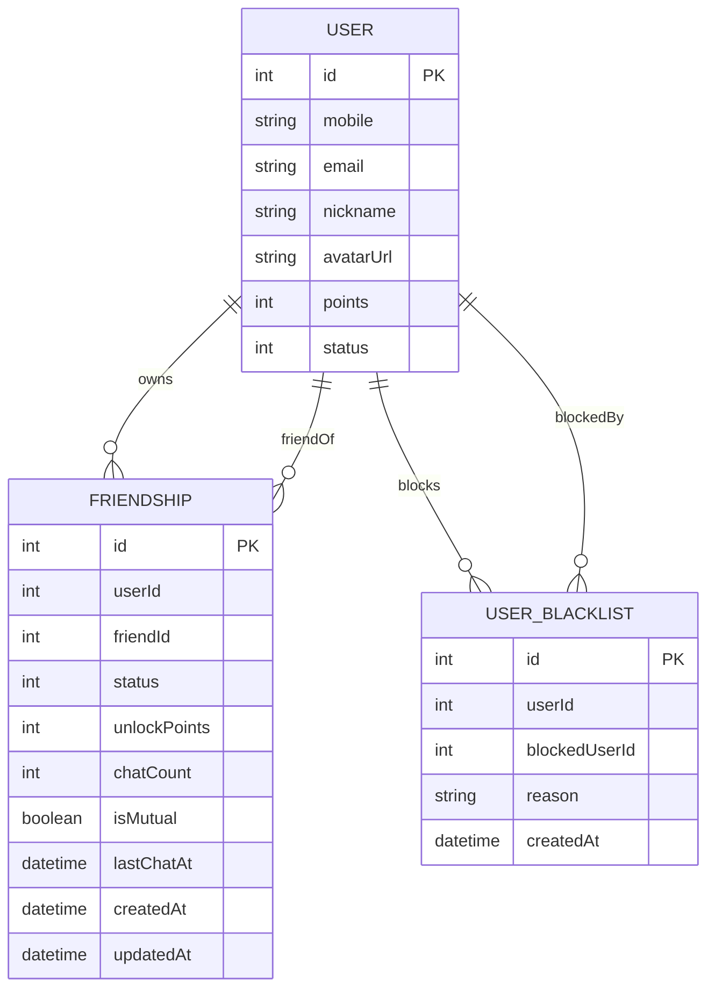
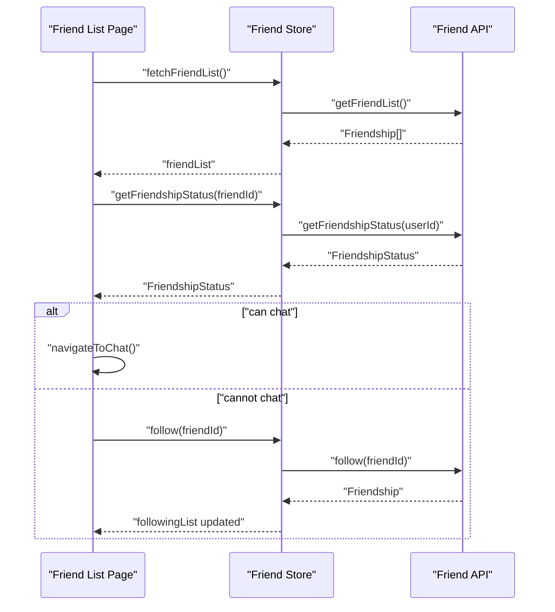
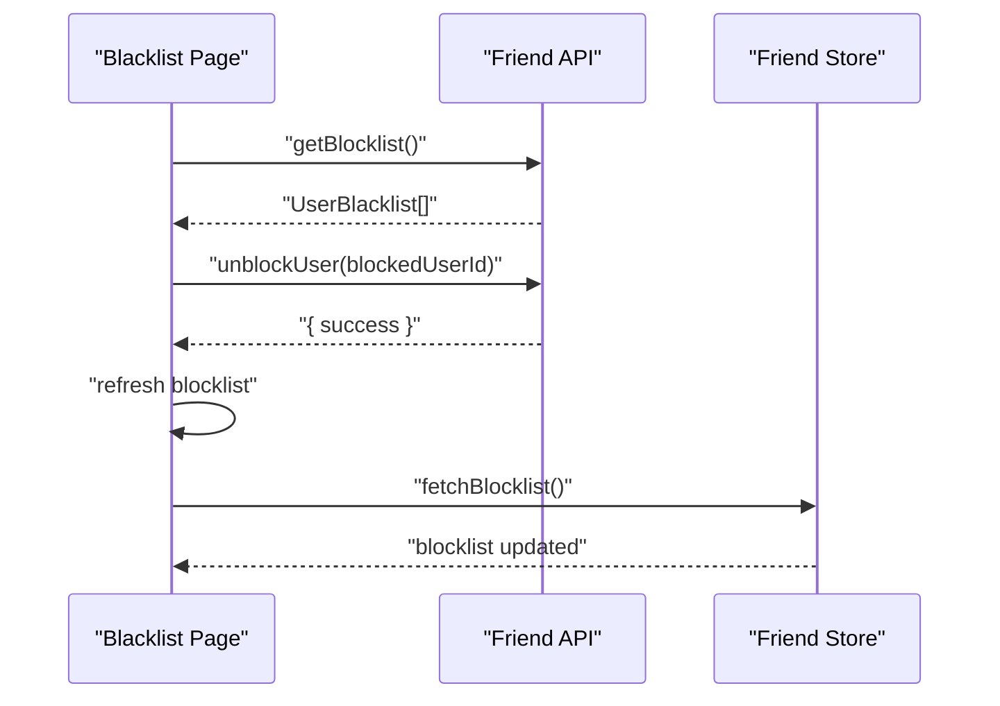
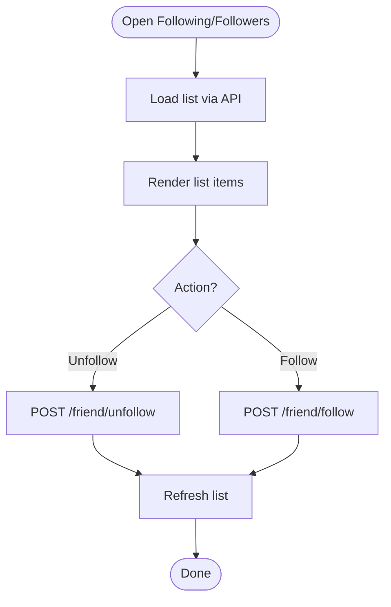
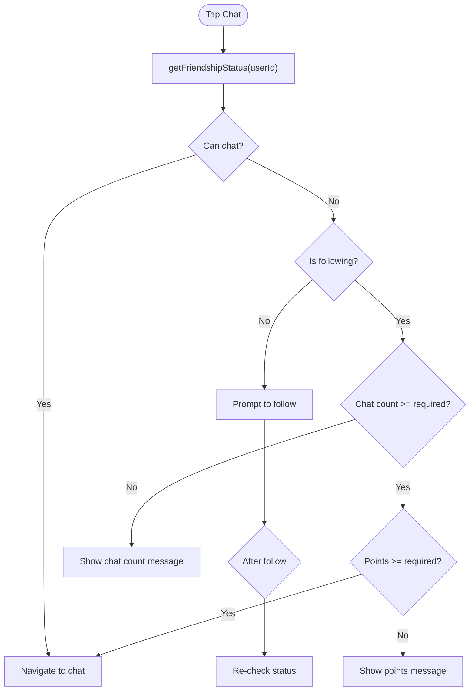
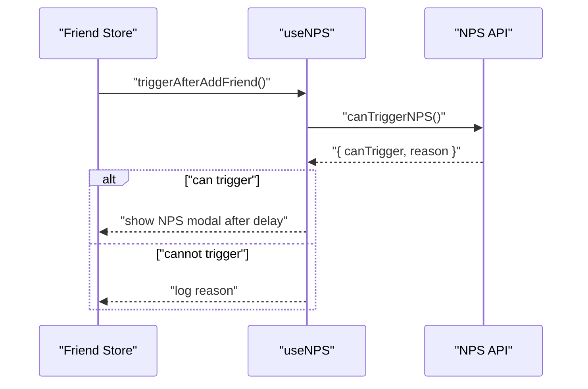
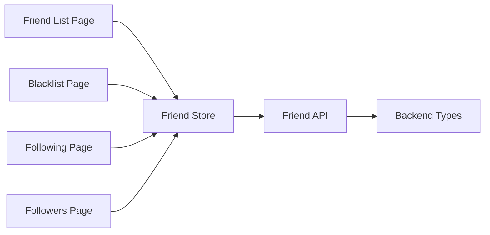

# Friend System Store

<cite>
**Referenced Files in This Document**
- [friend.ts](file://src/stores/friend.ts)
- [friend.ts](file://src/api/modules/friend.ts)
- [list.vue](file://src/pages/friend/list.vue)
- [blacklist.vue](file://src/pages/friend/blacklist.vue)
- [following.vue](file://src/pages/friend/following.vue)
- [followers.vue](file://src/pages/friend/followers.vue)
- [backend-types.ts](file://src/types/api/backend-types.ts)
- [useNPS.ts](file://src/composables/useNPS.ts)
- [privacy.vue](file://src/pages/profile/privacy.vue)
</cite>

## Table of Contents
1. [Introduction](#introduction)
2. [Project Structure](#project-structure)
3. [Core Components](#core-components)
4. [Architecture Overview](#architecture-overview)
5. [Detailed Component Analysis](#detailed-component-analysis)
6. [Dependency Analysis](#dependency-analysis)
7. [Performance Considerations](#performance-considerations)
8. [Troubleshooting Guide](#troubleshooting-guide)
9. [Conclusion](#conclusion)

## Introduction
This document describes the friend system store responsible for managing social connections, including friend lists, following/followers relationships, blocking, and related UI flows. It explains friend request state, connection status tracking, block list management, and how friend actions are executed. It also documents getters for friend lists, pending requests, and mutual connections, along with friend search functionality, recommendation algorithms, and social graph maintenance. Notifications, activity feeds, and privacy settings integration are covered, as well as data synchronization and conflict resolution strategies.

## Project Structure
The friend system spans three primary areas:
- Store layer: centralized reactive state and actions for friends, following, and blocklist
- API module: typed HTTP client for friend endpoints
- Pages: UI components for friend list, blacklist, following, and followers

**Diagram sources**
- [friend.ts:1-70](file://src/stores/friend.ts#L1-L70)
- [friend.ts:1-61](file://src/api/modules/friend.ts#L1-L61)
- [list.vue:1-184](file://src/pages/friend/list.vue#L1-L184)
- [blacklist.vue:1-261](file://src/pages/friend/blacklist.vue#L1-L261)
- [following.vue:1-160](file://src/pages/friend/following.vue#L1-L160)
- [followers.vue:1-178](file://src/pages/friend/followers.vue#L1-L178)

**Section sources**
- [friend.ts:1-70](file://src/stores/friend.ts#L1-L70)
- [friend.ts:1-61](file://src/api/modules/friend.ts#L1-L61)
- [list.vue:1-184](file://src/pages/friend/list.vue#L1-L184)
- [blacklist.vue:1-261](file://src/pages/friend/blacklist.vue#L1-L261)
- [following.vue:1-160](file://src/pages/friend/following.vue#L1-L160)
- [followers.vue:1-178](file://src/pages/friend/followers.vue#L1-L178)

## Core Components
- Friend Store: maintains friendList, followingList, and blocklist; exposes actions to fetch lists, get friendship status, follow/unfollow, delete friend, block/unblock, and unlock chat
- Friend API: typed HTTP client for friend endpoints including list, following, followers, requests, acceptance, deletion, blocking, and blocklist retrieval
- UI Pages: render lists and orchestrate actions (follow, unfollow, delete friend, block/unblock, navigate to chat)

Key capabilities:
- Fetch and maintain friend lists
- Track following/followers relationships
- Manage blocklist and unblocking
- Enforce chat unlock conditions via friendship status
- Trigger NPS after adding a friend

**Section sources**
- [friend.ts:7-69](file://src/stores/friend.ts#L7-L69)
- [friend.ts:16-61](file://src/api/modules/friend.ts#L16-L61)
- [list.vue:44-129](file://src/pages/friend/list.vue#L44-L129)
- [blacklist.vue:48-103](file://src/pages/friend/blacklist.vue#L48-L103)
- [following.vue:41-99](file://src/pages/friend/following.vue#L41-L99)
- [followers.vue:47-117](file://src/pages/friend/followers.vue#L47-L117)

## Architecture Overview
The friend system follows a layered architecture:
- UI pages call store actions or API methods
- Store actions delegate to the API module
- API module performs HTTP requests to backend endpoints
- Backend returns typed data models (Friendship, UserBlacklist)

**Diagram sources**
- [friend.ts:12-35](file://src/stores/friend.ts#L12-L35)
- [friend.ts:17-36](file://src/api/modules/friend.ts#L17-L36)

## Detailed Component Analysis

### Friend Store
The store encapsulates reactive friend state and actions:
- Reactive state: friendList, followingList, blocklist
- Actions:
  - fetchFriendList: retrieves friend list
  - fetchFollowingList: retrieves following list
  - getFriendshipStatus: checks relationship and unlock conditions
  - follow/unfollow: manage following
  - deleteFriend: remove friend
  - blockUser/unblockUser: manage blocklist
  - fetchBlocklist: refresh blocklist
  - unlockChat: unlock chat for a friend

**Diagram sources**
- [friend.ts:7-69](file://src/stores/friend.ts#L7-L69)
- [friend.ts:16-61](file://src/api/modules/friend.ts#L16-L61)

**Section sources**
- [friend.ts:7-69](file://src/stores/friend.ts#L7-L69)

### Friend API Module
The API module defines typed endpoints for friend operations:
- Lists: getFriendList, getFollowingList, getUserFollowingList, getFollowersList, getUserFollowersList
- Actions: follow, unfollow, friendRequest, acceptFriend, addFriend, deleteFriend
- Status and blocking: getFriendshipStatus, blockUser, unblockUser, getBlocklist

Data models:
- Friendship: relationship record with status, unlock points, chat count, mutual flag, timestamps, and associated users
- UserBlacklist: blocked user record with reason and timestamps

**Diagram sources**
- [backend-types.ts:294-339](file://src/types/api/backend-types.ts#L294-L339)

**Section sources**
- [friend.ts:16-61](file://src/api/modules/friend.ts#L16-L61)
- [backend-types.ts:294-339](file://src/types/api/backend-types.ts#L294-L339)

### Friend List Page
The friend list page displays the user’s friends and supports:
- Loading friend list via store
- Deleting a friend
- Unlocking chat based on friendship status (following, chat count, points)
- Navigation to chat after unlocking

**Diagram sources**
- [list.vue:44-109](file://src/pages/friend/list.vue#L44-L109)
- [friend.ts:12-27](file://src/stores/friend.ts#L12-L27)

**Section sources**
- [list.vue:44-129](file://src/pages/friend/list.vue#L44-L129)

### Blacklist Management
The blacklist page shows blocked users and supports:
- Loading blocklist via API
- Unblocking a user and refreshing both UI and store state

**Diagram sources**
- [blacklist.vue:48-103](file://src/pages/friend/blacklist.vue#L48-L103)
- [friend.ts:53-60](file://src/api/modules/friend.ts#L53-L60)

**Section sources**
- [blacklist.vue:48-103](file://src/pages/friend/blacklist.vue#L48-L103)

### Following/Followers Pages
- Following page: view own or another user’s following list; supports unfollow
- Followers page: view own or another user’s followers; supports follow/unfollow with optimistic UI updates

**Diagram sources**
- [following.vue:41-99](file://src/pages/friend/following.vue#L41-L99)
- [followers.vue:47-117](file://src/pages/friend/followers.vue#L47-L117)
- [friend.ts:32-36](file://src/api/modules/friend.ts#L32-L36)

**Section sources**
- [following.vue:41-99](file://src/pages/friend/following.vue#L41-L99)
- [followers.vue:47-117](file://src/pages/friend/followers.vue#L47-L117)

### Friend Request State and Acceptance
- friendRequest: submit a friend request
- acceptFriend: accept a received friend request
- addFriend: add a friend directly (may consume points)

These actions are exposed via the API module and can be invoked from UI or store actions.

**Section sources**
- [friend.ts:38-45](file://src/api/modules/friend.ts#L38-L45)

### Block List Management
- blockUser: add a user to the blocklist with optional reason
- unblockUser: remove a user from the blocklist
- getBlocklist: retrieve current blocklist

The store exposes fetchBlocklist to keep local state synchronized.

**Section sources**
- [friend.ts:53-60](file://src/api/modules/friend.ts#L53-L60)
- [friend.ts:46-54](file://src/stores/friend.ts#L46-L54)

### Chat Unlock Conditions and Privacy Integration
- getFriendshipStatus returns unlock criteria (chat count, required points, current points, and whether can chat)
- UI enforces conditions before allowing chat navigation
- Privacy settings integrate with friend/block features (e.g., allow strangers, only certified users)

**Diagram sources**
- [list.vue:59-109](file://src/pages/friend/list.vue#L59-L109)
- [friend.ts:47-48](file://src/api/modules/friend.ts#L47-L48)

**Section sources**
- [list.vue:59-109](file://src/pages/friend/list.vue#L59-L109)
- [privacy.vue:168-173](file://src/pages/profile/privacy.vue#L168-L173)

### Notifications and NPS Triggers
- After adding a friend, the store triggers an NPS check to display feedback prompts
- NPS composables provide configurable scenes and delays

**Diagram sources**
- [friend.ts:29-35](file://src/stores/friend.ts#L29-L35)
- [useNPS.ts:127-133](file://src/composables/useNPS.ts#L127-L133)

**Section sources**
- [friend.ts:29-35](file://src/stores/friend.ts#L29-L35)
- [useNPS.ts:127-133](file://src/composables/useNPS.ts#L127-L133)

### Social Graph Maintenance and Recommendations
- Social graph: maintained via Friendship records (status, mutual flag, timestamps)
- Recommendations: hybrid strategy combines personalized, hot, nearby, topic, and new user signals
- Collaborative filtering: computes user similarities and scores targets based on similar users’ behaviors

Note: Recommendation algorithms are located outside the friend store but rely on social graph signals.

**Section sources**
- [backend-types.ts:294-319](file://src/types/api/backend-types.ts#L294-L319)
- [mixStrategy.ts:363-387](file://src/pages/tabbar/home/algorithms/mixStrategy.ts#L363-L387)
- [collaborative.ts:121-155](file://src/pages/tabbar/home/algorithms/collaborative.ts#L121-L155)

## Dependency Analysis
- UI pages depend on the Friend Store for state and actions
- Friend Store depends on the Friend API module for HTTP operations
- Friend API module depends on shared request infrastructure and typed models
- Privacy settings influence friend/block behavior and discoverability

**Diagram sources**
- [list.vue:33-34](file://src/pages/friend/list.vue#L33-L34)
- [blacklist.vue:44-45](file://src/pages/friend/blacklist.vue#L44-L45)
- [following.vue:27-28](file://src/pages/friend/following.vue#L27-L28)
- [followers.vue:27-28](file://src/pages/friend/followers.vue#L27-L28)
- [friend.ts:1-6](file://src/stores/friend.ts#L1-L6)
- [friend.ts:1-3](file://src/api/modules/friend.ts#L1-L3)
- [backend-types.ts:1-9](file://src/types/api/backend-types.ts#L1-L9)

**Section sources**
- [list.vue:33-34](file://src/pages/friend/list.vue#L33-L34)
- [blacklist.vue:44-45](file://src/pages/friend/blacklist.vue#L44-L45)
- [following.vue:27-28](file://src/pages/friend/following.vue#L27-L28)
- [followers.vue:27-28](file://src/pages/friend/followers.vue#L27-L28)
- [friend.ts:1-6](file://src/stores/friend.ts#L1-L6)
- [friend.ts:1-3](file://src/api/modules/friend.ts#L1-L3)
- [backend-types.ts:1-9](file://src/types/api/backend-types.ts#L1-L9)

## Performance Considerations
- Prefer fetching lists only when needed (on mount or navigation) to minimize network calls
- Use optimistic UI updates for follow/unfollow actions to improve perceived responsiveness
- Debounce or batch frequent UI refreshes when updating multiple lists
- Cache frequently accessed friendship status to avoid redundant API calls

## Troubleshooting Guide
Common issues and resolutions:
- Cannot navigate to chat: verify following, chat count, and points thresholds via getFriendshipStatus
- Unfollow/follow fails: ensure proper error handling and rollback of optimistic updates
- Blocklist not updating: call fetchBlocklist after unblocking to synchronize store state
- NPS not triggering: check canTriggerNPS response and configured delay

**Section sources**
- [list.vue:59-109](file://src/pages/friend/list.vue#L59-L109)
- [followers.vue:90-117](file://src/pages/friend/followers.vue#L90-L117)
- [blacklist.vue:75-103](file://src/pages/friend/blacklist.vue#L75-L103)
- [useNPS.ts:18-38](file://src/composables/useNPS.ts#L18-L38)

## Conclusion
The friend system store provides a cohesive foundation for managing social connections, including friend lists, following/followers, and blocklists. It integrates with UI pages to enforce unlock conditions, trigger NPS feedback, and maintain a responsive user experience. Typed models and layered architecture support scalability and maintainability, while privacy settings and recommendation systems extend functionality across the platform.