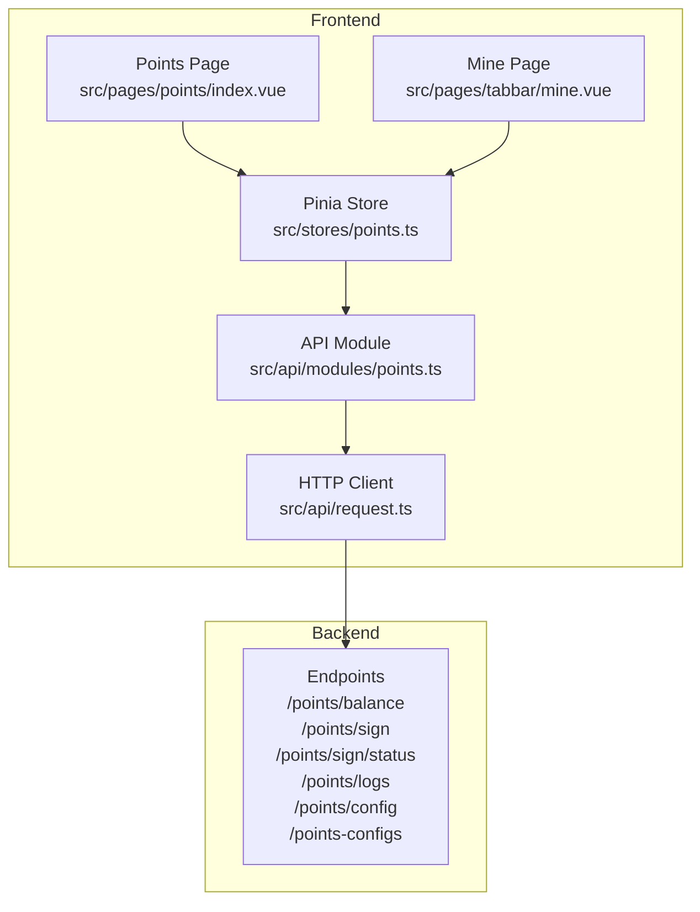
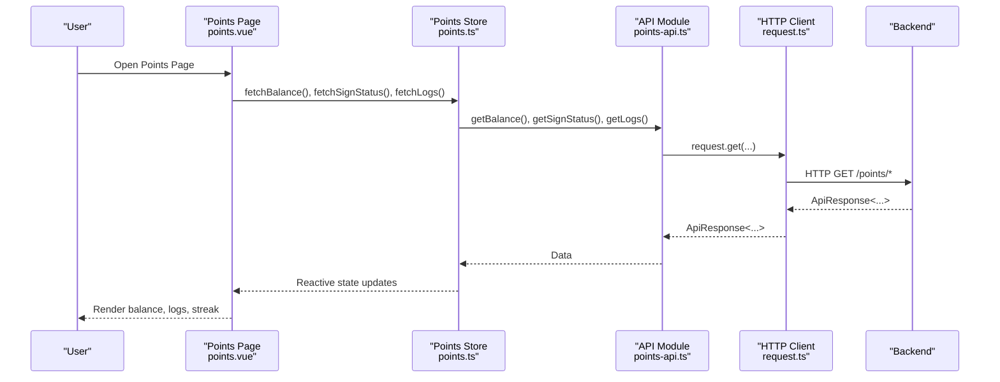
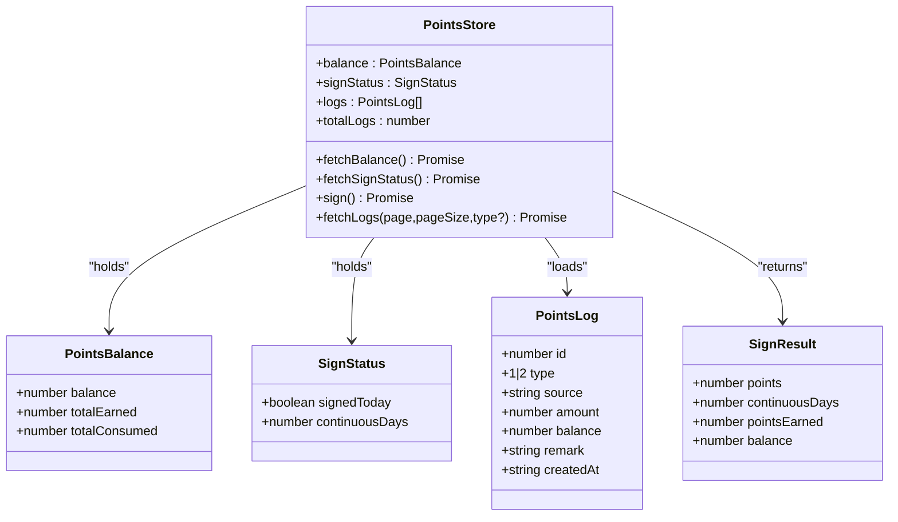
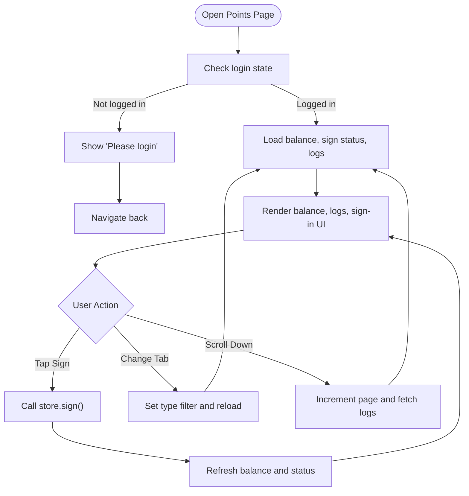
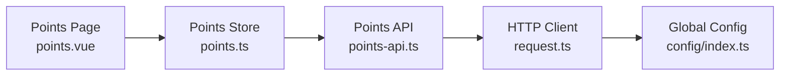

# Points & Rewards Store

<cite>
**Referenced Files in This Document**
- [points.ts](file://src/stores/points.ts)
- [points.vue](file://src/pages/points/index.vue)
- [points-api.ts](file://src/api/modules/points.ts)
- [backend-types.ts](file://src/types/api/backend-types.ts)
- [request.ts](file://src/api/request.ts)
- [mine.vue](file://src/pages/tabbar/mine.vue)
- [points-balance-fix.md](file://docs/points-balance-fix.md)
</cite>

## Table of Contents
1. [Introduction](#introduction)
2. [Project Structure](#project-structure)
3. [Core Components](#core-components)
4. [Architecture Overview](#architecture-overview)
5. [Detailed Component Analysis](#detailed-component-analysis)
6. [Dependency Analysis](#dependency-analysis)
7. [Performance Considerations](#performance-considerations)
8. [Troubleshooting Guide](#troubleshooting-guide)
9. [Conclusion](#conclusion)

## Introduction
This document describes the points and rewards gamification system, focusing on how points balances, transaction logs, and sign-in streaks are managed. It explains how users earn points, spend them via rewards/redemption, and how the frontend tracks balance, logs, and streaks. It also documents the available getters for balance calculations, reward availability, and achievement tracking, along with the points calculation algorithms, streak tracking, and milestone celebrations. Finally, it covers reward catalog management, inventory tracking, seasonal promotions, fraud prevention, transaction logging, and audit trail maintenance.

## Project Structure
The points system spans three primary areas:
- Frontend store: reactive state for balance, sign-in status, and logs
- Pages: UI for viewing balance, logs, and signing in
- API module: typed requests to backend endpoints for balance, logs, sign-in, and configuration



**Diagram sources**
- [points.ts:1-72](file://src/stores/points.ts#L1-L72)
- [points.vue:1-347](file://src/pages/points/index.vue#L1-L347)
- [mine.vue:29-71](file://src/pages/tabbar/mine.vue#L29-L71)
- [points-api.ts:1-55](file://src/api/modules/points.ts#L1-L55)
- [request.ts:1-228](file://src/api/request.ts#L1-L228)

**Section sources**
- [points.ts:1-72](file://src/stores/points.ts#L1-L72)
- [points.vue:1-347](file://src/pages/points/index.vue#L1-L347)
- [points-api.ts:1-55](file://src/api/modules/points.ts#L1-L55)
- [request.ts:1-228](file://src/api/request.ts#L1-L228)

## Core Components
- Points Store
  - State: balance, signStatus, logs, totalLogs
  - Actions: fetchBalance, fetchSignStatus, sign, fetchLogs
- Points Page
  - Displays current balance, lifetime totals, logs, and sign-in UI
- API Module
  - Typed endpoints for balance, sign-in, sign-in status, logs, and configuration
- Backend Types
  - Defines PointsConfig and related types used by the API module

Key getters and calculations:
- Balance getters
  - Current balance: balance.balance
  - Lifetime totals: balance.totalEarned, balance.totalConsumed
- Reward availability
  - Not implemented in the frontend; exposed via configuration endpoints
- Achievement tracking
  - Streak tracking via signStatus.continuousDays
  - Milestone celebrations via sign result pointsEarned (when returned)

**Section sources**
- [points.ts:8-11](file://src/stores/points.ts#L8-L11)
- [points.ts:13-41](file://src/stores/points.ts#L13-L41)
- [points.vue:4-15](file://src/pages/points/index.vue#L4-L15)
- [points.vue:18-27](file://src/pages/points/index.vue#L18-L27)
- [points-api.ts:4-30](file://src/api/modules/points.ts#L4-L30)
- [points-api.ts:32-54](file://src/api/modules/points.ts#L32-L54)
- [backend-types.ts:344-359](file://src/types/api/backend-types.ts#L344-L359)

## Architecture Overview
The frontend interacts with backend endpoints through a typed API module backed by a shared HTTP client. The store orchestrates data fetching and exposes reactive state to pages.



**Diagram sources**
- [points.vue:84-93](file://src/pages/points/index.vue#L84-L93)
- [points.ts:13-58](file://src/stores/points.ts#L13-L58)
- [points-api.ts:32-47](file://src/api/modules/points.ts#L32-L47)
- [request.ts:75-208](file://src/api/request.ts#L75-L208)

## Detailed Component Analysis

### Points Store
The store encapsulates:
- balance: current balance and lifetime totals
- signStatus: daily sign-in state and continuous streak
- logs: paginated transaction log entries
- totalLogs: total count for pagination

Actions:
- fetchBalance: retrieves balance from backend
- fetchSignStatus: retrieves sign-in status
- sign: performs sign-in and refreshes balance and status
- fetchLogs: loads logs with pagination and filtering



**Diagram sources**
- [points.ts:5-71](file://src/stores/points.ts#L5-L71)
- [points-api.ts:4-30](file://src/api/modules/points.ts#L4-L30)

**Section sources**
- [points.ts:1-72](file://src/stores/points.ts#L1-L72)

### Points Page
The points page renders:
- Current balance and lifetime totals
- Daily sign-in status and button
- Tabbed transaction logs (all/income/expenses)
- Infinite scroll with pagination

User actions:
- Tap sign-in button to trigger sign action
- Switch tabs to filter logs by type
- Scroll to load more logs



**Diagram sources**
- [points.vue:84-125](file://src/pages/points/index.vue#L84-L125)
- [points.ts:31-41](file://src/stores/points.ts#L31-L41)

**Section sources**
- [points.vue:1-347](file://src/pages/points/index.vue#L1-L347)

### API Module and Backend Types
The API module defines:
- Endpoints: getBalance, sign, getSignStatus, getLogs, getConfig, getConfigList
- Types: PointsBalance, SignStatus, SignResult, PointsLog, PointsConfig

Backend types include PointsConfig for reward configuration and inventory metadata.

```mermaid
classDiagram
class PointsApi {
+getBalance() ApiResponse~PointsBalance~
+sign() ApiResponse~SignResult~
+getSignStatus() ApiResponse~SignStatus~
+getLogs(page,pageSize,type?) ApiResponse~{list,total}~
+getConfig() ApiResponse~PointsConfig[]~
+getConfigList() ApiResponse~PointsConfig[]~
}
class BackendTypes {
<<module>>
}
PointsApi --> BackendTypes : "uses"
```

**Diagram sources**
- [points-api.ts:32-54](file://src/api/modules/points.ts#L32-L54)
- [backend-types.ts:344-359](file://src/types/api/backend-types.ts#L344-L359)

**Section sources**
- [points-api.ts:1-55](file://src/api/modules/points.ts#L1-L55)
- [backend-types.ts:344-359](file://src/types/api/backend-types.ts#L344-L359)

### Mine Page Integration
The mine page integrates sign-in and streak display, reusing the same store for quick access.

**Section sources**
- [mine.vue:29-56](file://src/pages/tabbar/mine.vue#L29-L56)

## Dependency Analysis
- The points page depends on the points store for reactive state.
- The points store depends on the points API module for network calls.
- The points API module depends on the HTTP client for transport.
- The HTTP client depends on global configuration and token storage.



**Diagram sources**
- [points.vue:74-77](file://src/pages/points/index.vue#L74-L77)
- [points.ts:1-3](file://src/stores/points.ts#L1-L3)
- [points-api.ts:1-2](file://src/api/modules/points.ts#L1-L2)
- [request.ts:1-13](file://src/api/request.ts#L1-L13)

**Section sources**
- [points.vue:74-77](file://src/pages/points/index.vue#L74-L77)
- [points.ts:1-3](file://src/stores/points.ts#L1-L3)
- [points-api.ts:1-2](file://src/api/modules/points.ts#L1-L2)
- [request.ts:1-13](file://src/api/request.ts#L1-L13)

## Performance Considerations
- Pagination: Logs are fetched in pages to avoid large payloads.
- Reactive updates: Store updates are minimal and targeted.
- Token refresh: The HTTP client handles token refresh automatically to reduce retries.
- Audit trail: Logs include timestamps and balances for traceability.

[No sources needed since this section provides general guidance]

## Troubleshooting Guide
Common issues and resolutions:
- Balance mismatch between current balance and lifetime totals
  - Root cause: Historical inconsistency between user points and log totals
  - Resolution: Recalculate balance from logs and keep totals aligned
- Streak not updating after sign-in
  - Verify sign endpoint returns updated continuous days and pointsEarned
- Logs not loading
  - Confirm pagination parameters and type filters are passed correctly
- Token expiration during fetch
  - The HTTP client refreshes tokens automatically; ensure refresh flow succeeds

**Section sources**
- [points-balance-fix.md:1-256](file://docs/points-balance-fix.md#L1-L256)
- [points.ts:31-41](file://src/stores/points.ts#L31-L41)
- [points.vue:95-121](file://src/pages/points/index.vue#L95-L121)
- [request.ts:100-147](file://src/api/request.ts#L100-L147)

## Conclusion
The points and rewards gamification system provides a clean separation between UI, state management, and API access. Users can track balances, review logs, and maintain streaks through sign-ins. While the current frontend focuses on balance, logs, and streaks, the backend exposes configuration endpoints for reward catalogs and inventory. Future enhancements can integrate reward redemption flows, inventory checks, and seasonal promotions while maintaining robust audit trails and fraud prevention through server-side validations and logging.