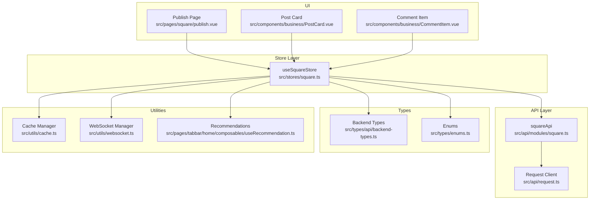
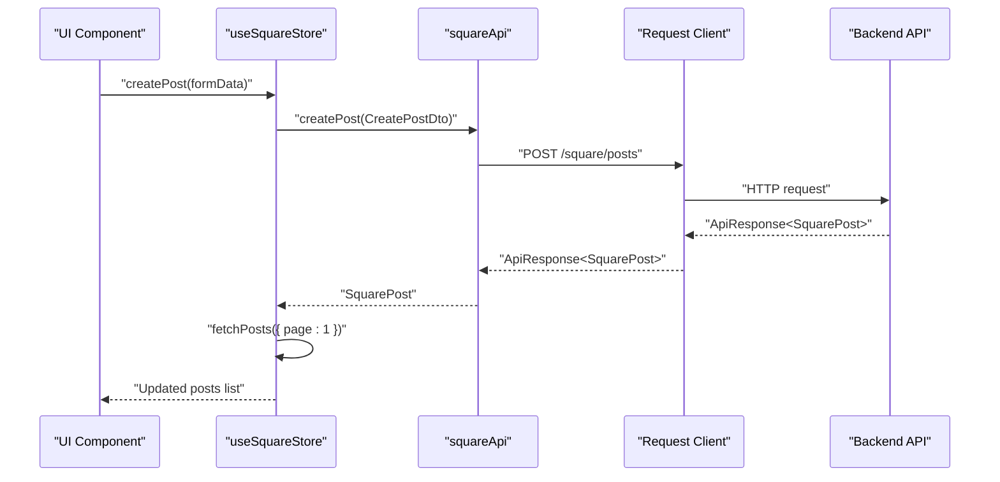
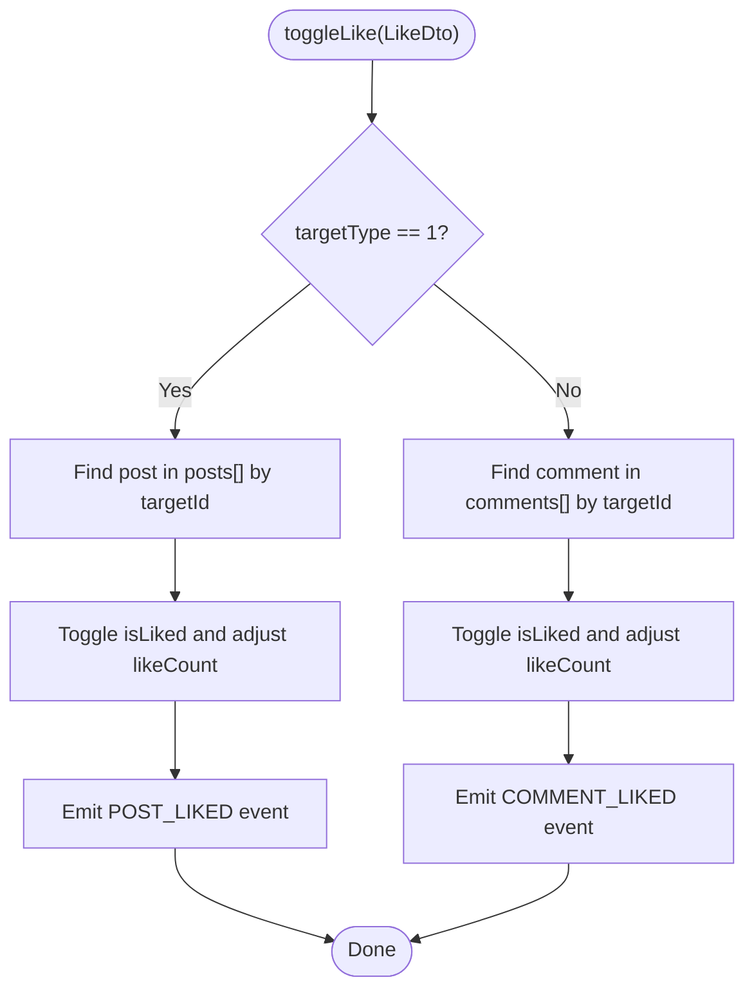
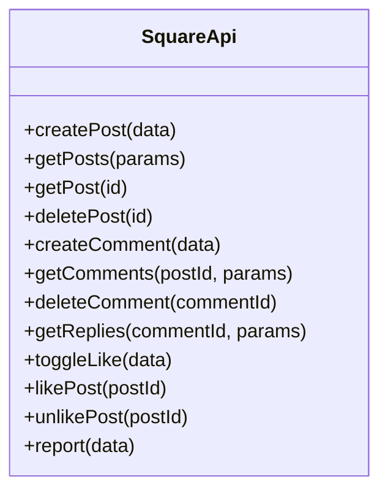
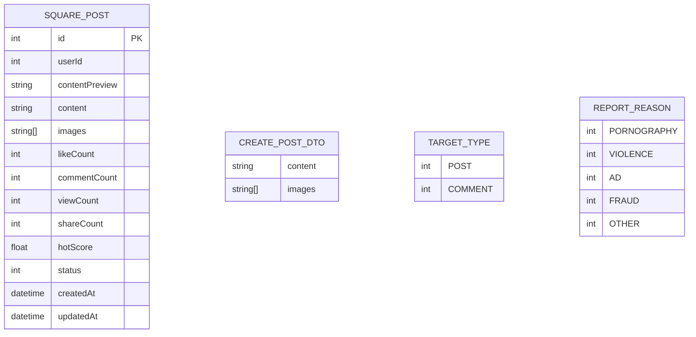
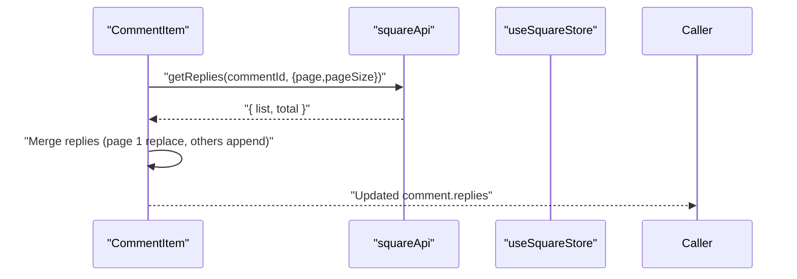
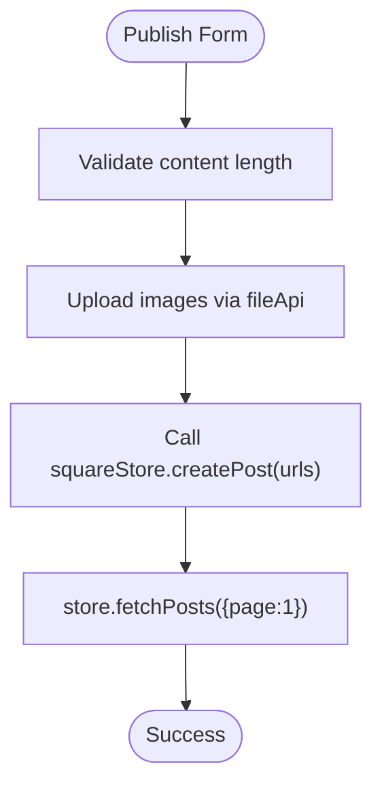
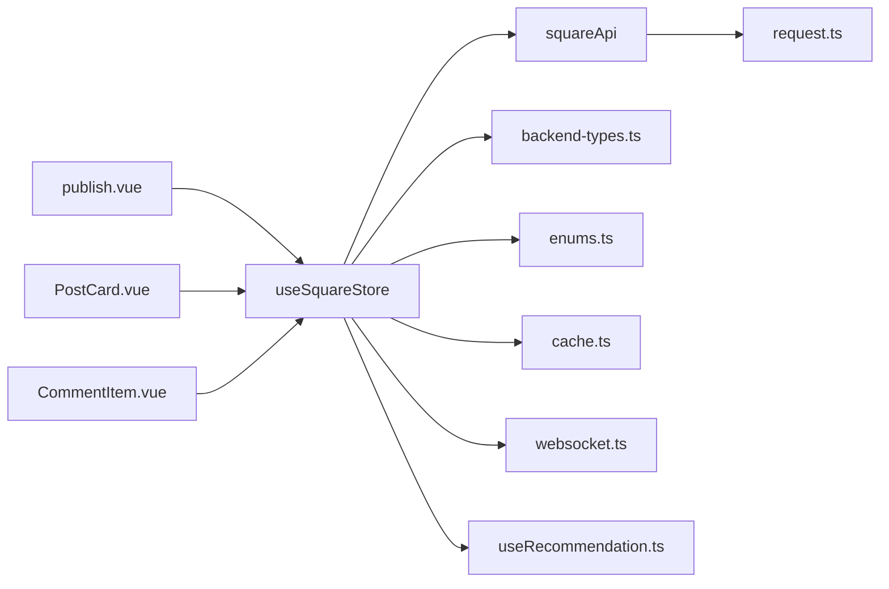

# Square Content Store

<cite>
**Referenced Files in This Document**
- [square.ts](file://src/stores/square.ts)
- [square.ts](file://src/api/modules/square.ts)
- [backend-types.ts](file://src/types/api/backend-types.ts)
- [enums.ts](file://src/types/enums.ts)
- [publish.vue](file://src/pages/square/publish.vue)
- [PostCard.vue](file://src/components/business/PostCard.vue)
- [CommentItem.vue](file://src/components/business/CommentItem.vue)
- [cache.ts](file://src/utils/cache.ts)
- [websocket.ts](file://src/utils/websocket.ts)
- [request.ts](file://src/api/request.ts)
- [useRecommendation.ts](file://src/pages/tabbar/home/composables/useRecommendation.ts)
</cite>

## Table of Contents
1. [Introduction](#introduction)
2. [Project Structure](#project-structure)
3. [Core Components](#core-components)
4. [Architecture Overview](#architecture-overview)
5. [Detailed Component Analysis](#detailed-component-analysis)
6. [Dependency Analysis](#dependency-analysis)
7. [Performance Considerations](#performance-considerations)
8. [Troubleshooting Guide](#troubleshooting-guide)
9. [Conclusion](#conclusion)

## Introduction
This document describes the Square Content Store that powers community posts and interactions in the application. It covers post state structure, comment threading, and like tracking. It also documents actions for creating posts, commenting, liking, and content moderation, along with getters for feed pagination, trending content, and user-generated content. Additional topics include content filtering, search functionality, recommendation integration, media attachment handling, content validation, spam prevention measures, content caching strategies, and real-time updates for community interactions.

## Project Structure
The Square Content Store is implemented as a Pinia store with API bindings and supporting types. UI components render and interact with the store, while utilities provide caching and real-time capabilities.

**Diagram sources**
- [square.ts:13-151](file://src/stores/square.ts#L13-L151)
- [square.ts:43-97](file://src/api/modules/square.ts#L43-L97)
- [backend-types.ts:427-535](file://src/types/api/backend-types.ts#L427-L535)
- [enums.ts:13-24](file://src/types/enums.ts#L13-L24)
- [publish.vue:40-134](file://src/pages/square/publish.vue#L40-L134)
- [PostCard.vue:96-290](file://src/components/business/PostCard.vue#L96-L290)
- [CommentItem.vue:47-111](file://src/components/business/CommentItem.vue#L47-L111)
- [cache.ts:273-338](file://src/utils/cache.ts#L273-L338)
- [websocket.ts:6-171](file://src/utils/websocket.ts#L6-L171)
- [useRecommendation.ts:14-201](file://src/pages/tabbar/home/composables/useRecommendation.ts#L14-L201)

**Section sources**
- [square.ts:13-151](file://src/stores/square.ts#L13-L151)
- [square.ts:43-97](file://src/api/modules/square.ts#L43-L97)
- [backend-types.ts:427-535](file://src/types/api/backend-types.ts#L427-L535)
- [enums.ts:13-24](file://src/types/enums.ts#L13-L24)
- [publish.vue:40-134](file://src/pages/square/publish.vue#L40-L134)
- [PostCard.vue:96-290](file://src/components/business/PostCard.vue#L96-L290)
- [CommentItem.vue:47-111](file://src/components/business/CommentItem.vue#L47-L111)
- [cache.ts:273-338](file://src/utils/cache.ts#L273-L338)
- [websocket.ts:6-171](file://src/utils/websocket.ts#L6-L171)
- [request.ts:1-228](file://src/api/request.ts#L1-L228)
- [useRecommendation.ts:14-201](file://src/pages/tabbar/home/composables/useRecommendation.ts#L14-L201)

## Core Components
- Square Store: Central state for posts, current post, comments, pagination flags, and loading state. Provides actions for fetching feeds, creating/deleting posts, fetching comments and replies, toggling likes, and reporting content.
- Square API Module: Thin wrapper around the request client exposing typed endpoints for posts, comments, likes, and reports.
- Types and Enums: Strongly typed models for posts, comments, DTOs, and enumerations for target types and report reasons.
- UI Components: Publish page handles media uploads and post creation; PostCard renders posts with like/comment/share/report actions; CommentItem renders threaded comments with nested replies.
- Utilities: Cache manager supports memory and persistent caches; WebSocket manager supports real-time messaging; Request client manages auth tokens and retries.

**Section sources**
- [square.ts:13-151](file://src/stores/square.ts#L13-L151)
- [square.ts:43-97](file://src/api/modules/square.ts#L43-L97)
- [backend-types.ts:427-535](file://src/types/api/backend-types.ts#L427-L535)
- [enums.ts:13-24](file://src/types/enums.ts#L13-L24)
- [publish.vue:40-134](file://src/pages/square/publish.vue#L40-L134)
- [PostCard.vue:96-290](file://src/components/business/PostCard.vue#L96-L290)
- [CommentItem.vue:47-111](file://src/components/business/CommentItem.vue#L47-L111)
- [cache.ts:273-338](file://src/utils/cache.ts#L273-L338)
- [websocket.ts:6-171](file://src/utils/websocket.ts#L6-L171)
- [request.ts:1-228](file://src/api/request.ts#L1-L228)

## Architecture Overview
The Square Content Store follows a layered architecture:
- UI triggers actions via components (publish, post card, comment).
- Actions call the Square API module.
- The API module delegates HTTP requests to the shared request client.
- Responses update local store state and optionally emit events for real-time synchronization.
- Recommendations and caching utilities integrate with the store for feed composition and performance.

**Diagram sources**
- [square.ts:42-45](file://src/stores/square.ts#L42-L45)
- [square.ts:44-45](file://src/api/modules/square.ts#L44-L45)
- [request.ts:214-224](file://src/api/request.ts#L214-L224)

**Section sources**
- [square.ts:42-45](file://src/stores/square.ts#L42-L45)
- [square.ts:44-45](file://src/api/modules/square.ts#L44-L45)
- [request.ts:214-224](file://src/api/request.ts#L214-L224)

## Detailed Component Analysis

### Square Store: State and Actions
- State
  - posts: array of posts for the feed
  - currentPost: single post detail
  - comments: flat list of comments for the current post
  - hasMore: indicates whether more pages are available
  - loading: prevents concurrent fetches
- Feed and Post Management
  - fetchPosts(params): paginated feed retrieval; merges first page replace vs subsequent pages append; sets hasMore based on pageSize
  - fetchPost(id): loads a single post detail
  - createPost(data): posts to backend and refreshes feed
  - deletePost(id): removes post locally after backend deletion
- Comments and Replies
  - fetchComments(postId, params): loads comments for a post
  - createComment(data): posts a comment and refreshes comments; increments comment counts on both current post and feed item
  - deleteComment(commentId, postId): decrements comment counts on both current post and feed item
  - getReplies(commentId, params): retrieves nested replies for a comment
- Engagement and Moderation
  - toggleLike(data): toggles like for post or comment; updates local counters and emits events for real-time sync
  - report(data): submits a report to backend
- Real-time and Events
  - Emits events for post/comment likes via an event bus for live UI updates

**Diagram sources**
- [square.ts:95-128](file://src/stores/square.ts#L95-L128)

**Section sources**
- [square.ts:13-151](file://src/stores/square.ts#L13-L151)

### Square API Module: Endpoints and DTOs
- Posts
  - createPost(data): POST /square/posts
  - getPosts(params): GET /square/posts with pagination and sort
  - getPost(id): GET /square/posts/{id}
  - deletePost(id): DELETE /square/posts/{id}
- Comments
  - createComment(data): POST /square/comment
  - getComments(postId, params): GET /square/posts/{postId}/comments
  - deleteComment(commentId): DELETE /square/comments/{commentId}
  - getReplies(commentId, params): GET /square/comments/{commentId}/replies
- Engagement
  - toggleLike(data): POST /square/like
  - likePost(postId): POST /square/posts/{postId}/like
  - unlikePost(postId): DELETE /square/posts/{postId}/like
- Moderation
  - report(data): POST /square/report

**Diagram sources**
- [square.ts:43-97](file://src/api/modules/square.ts#L43-L97)

**Section sources**
- [square.ts:13-97](file://src/api/modules/square.ts#L13-L97)

### Post State Structure and Models
- SquarePost: includes identifiers, content, media URLs, engagement metrics, status, timestamps, and author
- CreatePostDto: content and optional image URLs
- TargetType and ReportReason enums: used by like and report DTOs
- Backend types define pagination and API response wrappers

**Diagram sources**
- [backend-types.ts:427-459](file://src/types/api/backend-types.ts#L427-L459)
- [backend-types.ts:464-469](file://src/types/api/backend-types.ts#L464-L469)
- [enums.ts:13-24](file://src/types/enums.ts#L13-L24)

**Section sources**
- [backend-types.ts:427-469](file://src/types/api/backend-types.ts#L427-L469)
- [enums.ts:13-24](file://src/types/enums.ts#L13-L24)

### Comment Threading and Nested Replies
- CommentItem renders a comment with optional reply-to indicator and nested replies.
- Expanding replies triggers getReplies with pagination; replies are appended or replaced depending on page.
- Reply count drives visibility of load-more behavior.

**Diagram sources**
- [CommentItem.vue:77-101](file://src/components/business/CommentItem.vue#L77-L101)
- [square.ts:76-84](file://src/api/modules/square.ts#L76-L84)

**Section sources**
- [CommentItem.vue:47-111](file://src/components/business/CommentItem.vue#L47-L111)
- [square.ts:76-84](file://src/api/modules/square.ts#L76-L84)

### Media Attachment Handling
- Publish page collects content and local images, uploads them via file API, and passes resulting URLs to createPost.
- Image selection supports album and camera sources; H5 compatibility handled by tempFiles/base64 fallback.

**Diagram sources**
- [publish.vue:84-134](file://src/pages/square/publish.vue#L84-L134)
- [square.ts:42-45](file://src/stores/square.ts#L42-L45)

**Section sources**
- [publish.vue:40-134](file://src/pages/square/publish.vue#L40-L134)
- [square.ts:42-45](file://src/stores/square.ts#L42-L45)

### Content Validation and Spam Prevention
- Mobile/password/code/nickname validation utilities support basic input sanitization.
- UI enforces character limits and empty checks for content and report descriptions.
- Backend DTOs and enums define allowed values for report reasons and statuses.

**Section sources**
- [validate.ts:1-15](file://src/utils/validate.ts#L1-L15)
- [PostCard.vue:268-289](file://src/components/business/PostCard.vue#L268-L289)
- [backend-types.ts:48-51](file://src/types/api/backend-types.ts#L48-L51)

### Content Filtering, Search, and Recommendations
- Feed pagination: fetchPosts supports page/pageSize and sort parameters.
- Recommendations: useRecommendation composable provides mixed-type recommendation streams with configurable ratios and cursor-based pagination.
- Search: not present in the analyzed files; would require additional endpoints and UI.

**Section sources**
- [square.ts:37-41](file://src/api/modules/square.ts#L37-L41)
- [useRecommendation.ts:14-94](file://src/pages/tabbar/home/composables/useRecommendation.ts#L14-L94)

### Caching Strategies
- MemoryCache and StorageCache provide TTL-based caching for recommendation feeds, banners, topics, user info, and other data.
- Cache keys and expiration times are centralized for maintainability.

**Section sources**
- [cache.ts:20-139](file://src/utils/cache.ts#L20-L139)
- [cache.ts:144-318](file://src/utils/cache.ts#L144-L318)
- [cache.ts:323-358](file://src/utils/cache.ts#L323-L358)

### Real-time Updates
- Event Bus: The store emits POST_LIKED and COMMENT_LIKED events upon toggling likes, enabling live UI updates across components.
- WebSocket: A dedicated manager supports connection lifecycle, heartbeat, and message routing; primarily used for chat but demonstrates real-time patterns applicable to square interactions.

**Section sources**
- [square.ts:106-127](file://src/stores/square.ts#L106-L127)
- [websocket.ts:6-171](file://src/utils/websocket.ts#L6-L171)

## Dependency Analysis
The Square Content Store integrates with API, types, UI, caching, and real-time utilities. Coupling is moderate: store depends on API module and types; UI components depend on store; utilities are orthogonal and reusable.

**Diagram sources**
- [square.ts:13-151](file://src/stores/square.ts#L13-L151)
- [square.ts:43-97](file://src/api/modules/square.ts#L43-L97)
- [publish.vue:40-134](file://src/pages/square/publish.vue#L40-L134)
- [PostCard.vue:96-290](file://src/components/business/PostCard.vue#L96-L290)
- [CommentItem.vue:47-111](file://src/components/business/CommentItem.vue#L47-L111)
- [cache.ts:273-338](file://src/utils/cache.ts#L273-L338)
- [websocket.ts:6-171](file://src/utils/websocket.ts#L6-L171)
- [request.ts:1-228](file://src/api/request.ts#L1-L228)
- [useRecommendation.ts:14-201](file://src/pages/tabbar/home/composables/useRecommendation.ts#L14-L201)

**Section sources**
- [square.ts:13-151](file://src/stores/square.ts#L13-L151)
- [square.ts:43-97](file://src/api/modules/square.ts#L43-L97)
- [publish.vue:40-134](file://src/pages/square/publish.vue#L40-L134)
- [PostCard.vue:96-290](file://src/components/business/PostCard.vue#L96-L290)
- [CommentItem.vue:47-111](file://src/components/business/CommentItem.vue#L47-L111)
- [cache.ts:273-338](file://src/utils/cache.ts#L273-L338)
- [websocket.ts:6-171](file://src/utils/websocket.ts#L6-L171)
- [request.ts:1-228](file://src/api/request.ts#L1-L228)
- [useRecommendation.ts:14-201](file://src/pages/tabbar/home/composables/useRecommendation.ts#L14-L201)

## Performance Considerations
- Pagination: Use page/pageSize consistently; avoid loading oversized lists.
- Incremental updates: Append to posts on subsequent pages; replace on page 1.
- Local counters: Keep like/comment counts in sync to prevent extra network calls.
- Caching: Leverage MemoryCache for short-lived data and StorageCache for persisted items; tune maxSize and expireTime per use case.
- Debounce and throttling: Apply to search-like filters if added later.
- Lazy loading: UI components already use lazy-load and skeleton placeholders.

[No sources needed since this section provides general guidance]

## Troubleshooting Guide
- Authentication failures: The request client automatically refreshes tokens and redirects to login on 401; check token storage and refresh token validity.
- Network errors: The request client surfaces generic failures; verify baseURL and connectivity.
- Like toggling: Ensure event listeners are attached to receive POST_LIKED/COMMENT_LIKED updates.
- Comment replies: Confirm getReplies pagination and that replies are merged correctly per page.
- Publishing: Verify image upload completion before calling createPost; handle H5-specific tempFiles/base64 scenarios.

**Section sources**
- [request.ts:100-147](file://src/api/request.ts#L100-L147)
- [square.ts:95-128](file://src/stores/square.ts#L95-L128)
- [CommentItem.vue:77-101](file://src/components/business/CommentItem.vue#L77-L101)
- [publish.vue:96-107](file://src/pages/square/publish.vue#L96-L107)

## Conclusion
The Square Content Store provides a robust foundation for community posts and interactions. It offers strong typing, pagination, media handling, engagement tracking, moderation, caching, and real-time hooks. Extending it with search, advanced filtering, and recommendation integration is straightforward given the existing patterns and utilities.