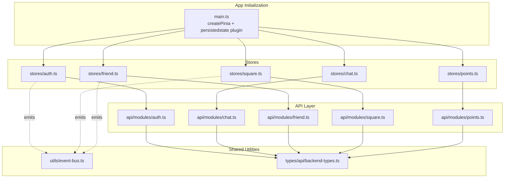
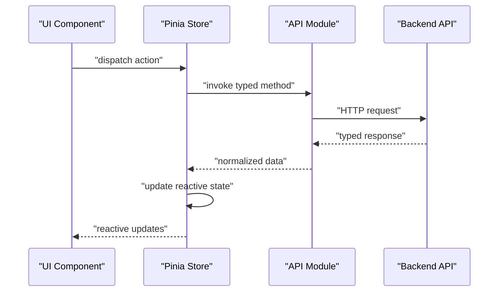
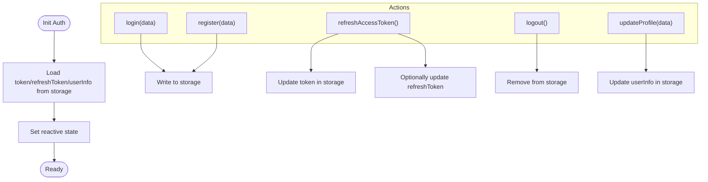
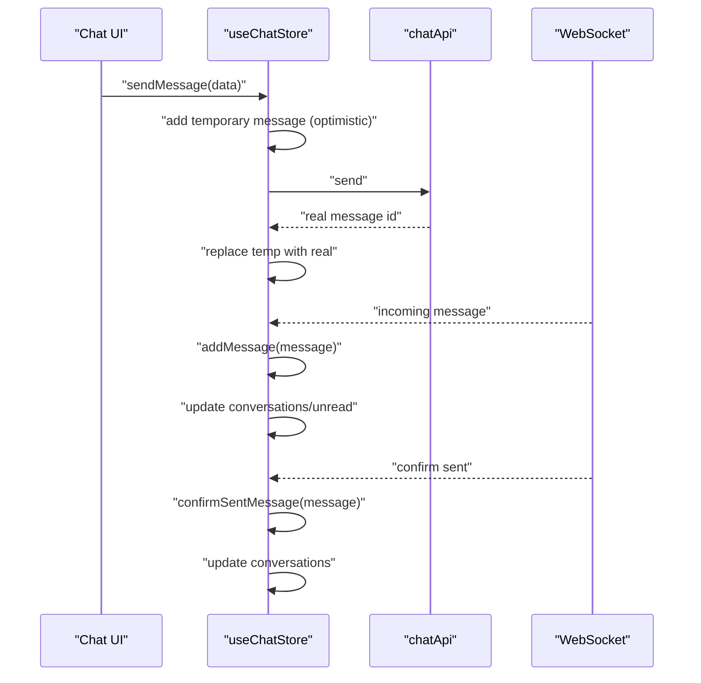
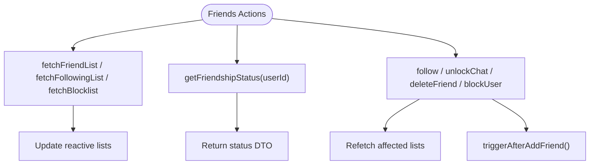
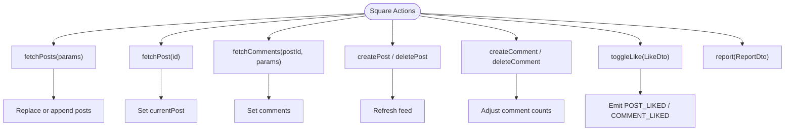
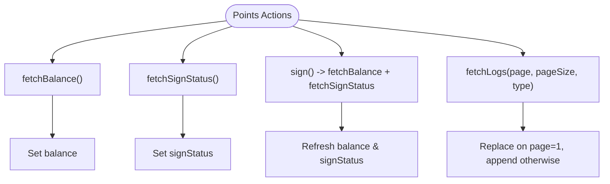
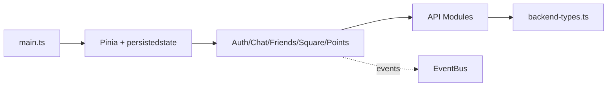

# State Management Architecture

<cite>
**Referenced Files in This Document**
- [src/main.ts](file://src/main.ts)
- [src/stores/index.ts](file://src/stores/index.ts)
- [src/stores/auth.ts](file://src/stores/auth.ts)
- [src/stores/chat.ts](file://src/stores/chat.ts)
- [src/stores/friend.ts](file://src/stores/friend.ts)
- [src/stores/square.ts](file://src/stores/square.ts)
- [src/stores/points.ts](file://src/stores/points.ts)
- [src/api/modules/auth.ts](file://src/api/modules/auth.ts)
- [src/api/modules/chat.ts](file://src/api/modules/chat.ts)
- [src/api/modules/friend.ts](file://src/api/modules/friend.ts)
- [src/api/modules/square.ts](file://src/api/modules/square.ts)
- [src/api/modules/points.ts](file://src/api/modules/points.ts)
- [src/utils/event-bus.ts](file://src/utils/event-bus.ts)
- [src/types/api/backend-types.ts](file://src/types/api/backend-types.ts)
</cite>

## Table of Contents
1. [Introduction](#introduction)
2. [Project Structure](#project-structure)
3. [Core Components](#core-components)
4. [Architecture Overview](#architecture-overview)
5. [Detailed Component Analysis](#detailed-component-analysis)
6. [Dependency Analysis](#dependency-analysis)
7. [Performance Considerations](#performance-considerations)
8. [Troubleshooting Guide](#troubleshooting-guide)
9. [Conclusion](#conclusion)

## Introduction
This document describes the centralized state management architecture of the WeTogether platform built with Pinia stores. It covers the design and implementation of five primary stores: authentication, chat, friends, square content, and points. The document explains store composition patterns, state mutations, actions, getters, persistence, reactivity, cross-store communication, initialization hydration, session management, and synchronization with backend APIs. It also provides guidance on debugging, performance optimization, and memory management.

## Project Structure
The state layer is organized around Pinia stores under the stores directory, each encapsulating a bounded domain. Stores are composed via Pinia’s plugin system and integrate with API modules and shared utilities.

**Diagram sources**
- [src/main.ts:1-18](file://src/main.ts#L1-L18)
- [src/stores/auth.ts:1-137](file://src/stores/auth.ts#L1-L137)
- [src/stores/chat.ts:1-234](file://src/stores/chat.ts#L1-L234)
- [src/stores/friend.ts:1-70](file://src/stores/friend.ts#L1-L70)
- [src/stores/square.ts:1-152](file://src/stores/square.ts#L1-L152)
- [src/stores/points.ts:1-72](file://src/stores/points.ts#L1-L72)
- [src/api/modules/auth.ts:1-57](file://src/api/modules/auth.ts#L1-L57)
- [src/api/modules/chat.ts:1-42](file://src/api/modules/chat.ts#L1-L42)
- [src/api/modules/friend.ts:1-61](file://src/api/modules/friend.ts#L1-L61)
- [src/api/modules/square.ts:1-98](file://src/api/modules/square.ts#L1-L98)
- [src/api/modules/points.ts:1-55](file://src/api/modules/points.ts#L1-L55)
- [src/utils/event-bus.ts:1-49](file://src/utils/event-bus.ts#L1-L49)
- [src/types/api/backend-types.ts:1-764](file://src/types/api/backend-types.ts#L1-L764)

**Section sources**
- [src/main.ts:1-18](file://src/main.ts#L1-L18)
- [src/stores/index.ts:1-5](file://src/stores/index.ts#L1-L5)

## Core Components
This section outlines the five core stores and their responsibilities.

- Authentication Store
  - Manages tokens, refresh tokens, and user info.
  - Provides login, registration, logout, and token refresh actions.
  - Hydration from persistent storage and updates to global avatar via event bus.
  - Persistence enabled via Pinia plugin.

- Chat Store
  - Maintains conversations, current chat, messages, and unread counts.
  - Fetches conversations and message history.
  - Implements optimistic send with temporary IDs and failure handling.
  - Handles WebSocket-driven incoming and confirmed messages with deduplication and per-chat filtering.
  - Updates conversation lists and unread counters.

- Friends Store
  - Manages friend list, following list, and block list.
  - Provides actions to follow, unfollow, unlock chat, delete friend, and manage block list.
  - Exposes friendship status queries and triggers NPS after adding a friend.

- Square Store
  - Manages posts feed, current post, comments, pagination flags, and loading state.
  - Implements infinite scroll-like pagination and optimistic updates for likes and comments.
  - Emits global events for post/comment likes to coordinate UI updates.

- Points Store
  - Tracks balance, sign-in status, logs, and total logs.
  - Fetches balance, sign status, and paginated logs.
  - Supports daily sign-in with subsequent balance and status refresh.

**Section sources**
- [src/stores/auth.ts:1-137](file://src/stores/auth.ts#L1-L137)
- [src/stores/chat.ts:1-234](file://src/stores/chat.ts#L1-L234)
- [src/stores/friend.ts:1-70](file://src/stores/friend.ts#L1-L70)
- [src/stores/square.ts:1-152](file://src/stores/square.ts#L1-L152)
- [src/stores/points.ts:1-72](file://src/stores/points.ts#L1-L72)

## Architecture Overview
The state architecture follows a layered pattern:
- UI components consume reactive state from Pinia stores.
- Stores orchestrate API calls via typed API modules.
- Cross-store communication occurs through the event bus.
- Persistence is achieved via the Pinia persistedstate plugin.

**Diagram sources**
- [src/stores/auth.ts:18-42](file://src/stores/auth.ts#L18-L42)
- [src/api/modules/auth.ts:33-49](file://src/api/modules/auth.ts#L33-L49)
- [src/stores/chat.ts:14-25](file://src/stores/chat.ts#L14-L25)
- [src/api/modules/chat.ts:18-31](file://src/api/modules/chat.ts#L18-L31)
- [src/stores/square.ts:20-35](file://src/stores/square.ts#L20-L35)
- [src/api/modules/square.ts:43-48](file://src/api/modules/square.ts#L43-L48)

## Detailed Component Analysis

### Authentication Store
- Composition
  - Uses Pinia defineStore with Vue refs for token, refreshToken, and userInfo.
  - Computed getter for isLoggedIn.
  - Actions for login, register, logout, refreshAccessToken, init, updateUserInfo, and updateProfile.
- Mutations and State Changes
  - Synchronous state updates for tokens and user info.
  - Persistent storage writes on login/register and refresh; removal on logout.
- Session Management
  - Token refresh via refresh endpoint; fallback to logout on failure.
- Hydration
  - init reads stored token, refreshToken, and userInfo on startup.
- Cross-store Communication
  - Emits avatar updated events to notify UI of profile changes.

**Diagram sources**
- [src/stores/auth.ts:73-77](file://src/stores/auth.ts#L73-L77)
- [src/stores/auth.ts:18-42](file://src/stores/auth.ts#L18-L42)
- [src/stores/auth.ts:54-71](file://src/stores/auth.ts#L54-L71)
- [src/stores/auth.ts:44-52](file://src/stores/auth.ts#L44-L52)
- [src/stores/auth.ts:95-117](file://src/stores/auth.ts#L95-L117)

**Section sources**
- [src/stores/auth.ts:1-137](file://src/stores/auth.ts#L1-L137)
- [src/api/modules/auth.ts:1-57](file://src/api/modules/auth.ts#L1-L57)
- [src/utils/event-bus.ts:40-48](file://src/utils/event-bus.ts#L40-L48)

### Chat Store
- Composition
  - Reactive collections for conversations, currentChat, messages, unreadCount.
  - Actions for fetching conversations, fetching message history, sending messages, marking as read, and managing WebSocket messages.
- Optimistic Updates
  - sendMessage creates a temporary message immediately, then replaces it upon server confirmation or marks as failed on error.
- WebSocket Handling
  - addMessage and confirmSentMessage handle incoming and confirmed messages with deduplication and per-chat filtering.
  - Updates conversation lastMessage and lastMessageTime; increments unreadCount when not in current chat.
- Backend Integration
  - Uses chatApi for send, history, conversations, read status.

**Diagram sources**
- [src/stores/chat.ts:50-90](file://src/stores/chat.ts#L50-L90)
- [src/stores/chat.ts:100-158](file://src/stores/chat.ts#L100-L158)
- [src/stores/chat.ts:161-210](file://src/stores/chat.ts#L161-L210)
- [src/api/modules/chat.ts:18-41](file://src/api/modules/chat.ts#L18-L41)

**Section sources**
- [src/stores/chat.ts:1-234](file://src/stores/chat.ts#L1-L234)
- [src/api/modules/chat.ts:1-42](file://src/api/modules/chat.ts#L1-L42)

### Friends Store
- Composition
  - Reactive lists for friendList, followingList, blocklist.
  - Actions to fetch lists, get friendship status, follow/unfollow, unlock chat, delete friend, block/unblock, and fetch blocklist.
- Cross-store Integration
  - Triggers NPS after successful follow action.

**Diagram sources**
- [src/stores/friend.ts:12-54](file://src/stores/friend.ts#L12-L54)
- [src/stores/friend.ts:29-35](file://src/stores/friend.ts#L29-L35)
- [src/api/modules/friend.ts:16-61](file://src/api/modules/friend.ts#L16-L61)

**Section sources**
- [src/stores/friend.ts:1-70](file://src/stores/friend.ts#L1-L70)
- [src/api/modules/friend.ts:1-61](file://src/api/modules/friend.ts#L1-L61)

### Square Store
- Composition
  - Reactive posts, currentPost, comments, pagination flags, and loading state.
  - Actions for fetching posts/feed, fetching single post, creating/deleting posts, fetching comments, creating/deleting comments, fetching replies, toggling likes, and reporting.
- Pagination and Infinite Scroll
  - fetchPosts supports page-based pagination; replaces on page=1, appends otherwise.
- Optimistic Updates
  - toggleLike flips local isLiked and adjusts likeCount; emits global like events.
  - Comment count adjustments on create/delete are applied to both currentPost and feed entries.

**Diagram sources**
- [src/stores/square.ts:20-35](file://src/stores/square.ts#L20-L35)
- [src/stores/square.ts:37-40](file://src/stores/square.ts#L37-L40)
- [src/stores/square.ts:52-59](file://src/stores/square.ts#L52-L59)
- [src/stores/square.ts:61-88](file://src/stores/square.ts#L61-L88)
- [src/stores/square.ts:95-128](file://src/stores/square.ts#L95-L128)
- [src/api/modules/square.ts:43-97](file://src/api/modules/square.ts#L43-L97)

**Section sources**
- [src/stores/square.ts:1-152](file://src/stores/square.ts#L1-L152)
- [src/api/modules/square.ts:1-98](file://src/api/modules/square.ts#L1-L98)
- [src/utils/event-bus.ts:40-48](file://src/utils/event-bus.ts#L40-L48)

### Points Store
- Composition
  - Reactive balance, signStatus, logs, and totalLogs.
  - Actions for fetching balance, fetching sign status, signing in, and paginated log retrieval.
- Behavior
  - sign triggers backend sign, then refreshes balance and sign status.

**Diagram sources**
- [src/stores/points.ts:13-58](file://src/stores/points.ts#L13-L58)
- [src/api/modules/points.ts:32-54](file://src/api/modules/points.ts#L32-L54)

**Section sources**
- [src/stores/points.ts:1-72](file://src/stores/points.ts#L1-L72)
- [src/api/modules/points.ts:1-55](file://src/api/modules/points.ts#L1-L55)

## Dependency Analysis
- Initialization and Persistence
  - main.ts initializes Pinia and registers the persistedstate plugin globally.
  - Each store exposes persist: true, enabling automatic persistence of state.
- Cross-store Communication
  - Authentication store emits avatar updates; Square store emits like events.
  - These events propagate to subscribers for coordinated UI updates.
- API Contracts
  - Each store action maps to a typed API module method with matching DTOs and response shapes.

**Diagram sources**
- [src/main.ts:1-18](file://src/main.ts#L1-L18)
- [src/stores/auth.ts:133-136](file://src/stores/auth.ts#L133-L136)
- [src/stores/square.ts:106-127](file://src/stores/square.ts#L106-L127)
- [src/utils/event-bus.ts:1-49](file://src/utils/event-bus.ts#L1-L49)
- [src/types/api/backend-types.ts:1-764](file://src/types/api/backend-types.ts#L1-L764)

**Section sources**
- [src/main.ts:1-18](file://src/main.ts#L1-L18)
- [src/stores/auth.ts:133-136](file://src/stores/auth.ts#L133-L136)
- [src/utils/event-bus.ts:40-48](file://src/utils/event-bus.ts#L40-L48)

## Performance Considerations
- Reactive Granularity
  - Prefer fine-grained reactive refs per collection/state segment to minimize unnecessary re-renders.
- Pagination and Infinite Lists
  - Square posts and points logs support page-based loading; avoid replacing entire arrays on subsequent pages to reduce churn.
- Optimistic UI Updates
  - Chat optimistic sends improve perceived latency; ensure robust rollback on failures.
- Deduplication and Filtering
  - Chat message deduplication prevents redundant renders and maintains accurate message lists.
- Storage I/O
  - Persistedstate reduces cold-start hydration costs; keep payload sizes reasonable to avoid slow initial loads.
- Memory Management
  - Periodically prune old chat histories and large lists; avoid retaining unused posts or logs.
- Event Bus Overuse
  - Limit global emits to essential UI sync signals to prevent excessive handler execution.

## Troubleshooting Guide
- State Not Persisting
  - Verify persistedstate plugin is registered in main.ts and stores enable persistence.
  - Confirm storage keys exist and are readable.
- Token Refresh Failures
  - On refreshAccessToken errors, logout clears invalid tokens; ensure refresh endpoint availability.
- Chat Messages Not Updating
  - Check WebSocket handlers for message deduplication and per-chat filtering logic.
  - Ensure sender/receiver ID normalization handles string vs number types.
- Like Counts Incorrect
  - Square toggleLike updates local counts; verify event emissions and subscribers update UI consistently.
- Friend Actions Not Reflecting
  - After follow/unfollow, refetch affected lists; confirm NPS triggers occur post-success.

**Section sources**
- [src/main.ts:10](file://src/main.ts#L10)
- [src/stores/auth.ts:67-71](file://src/stores/auth.ts#L67-L71)
- [src/stores/chat.ts:100-158](file://src/stores/chat.ts#L100-L158)
- [src/stores/square.ts:95-128](file://src/stores/square.ts#L95-L128)
- [src/stores/friend.ts:29-35](file://src/stores/friend.ts#L29-L35)

## Conclusion
The WeTogether state management leverages Pinia to provide a modular, reactive, and persistent architecture. Each store encapsulates a domain-specific concern, integrates with typed API modules, and coordinates via the event bus for cross-store updates. Initialization hydration, session management, optimistic UI updates, and pagination are implemented thoughtfully to balance responsiveness and correctness. Following the recommended practices ensures maintainable, debuggable, and performant state behavior across the platform.