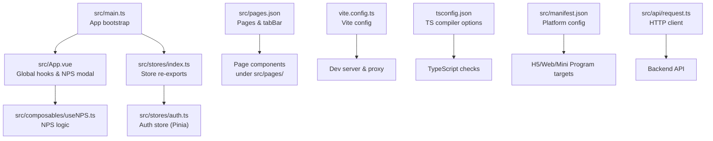
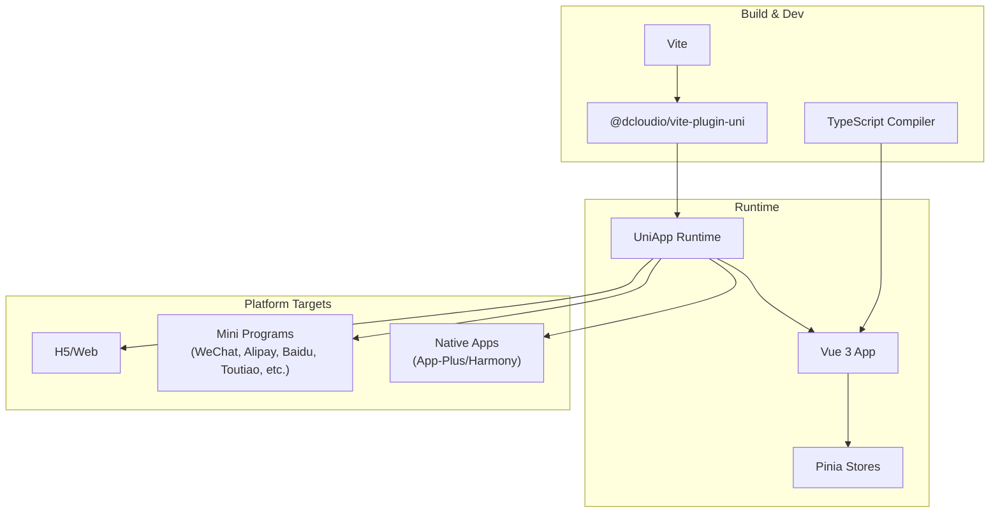
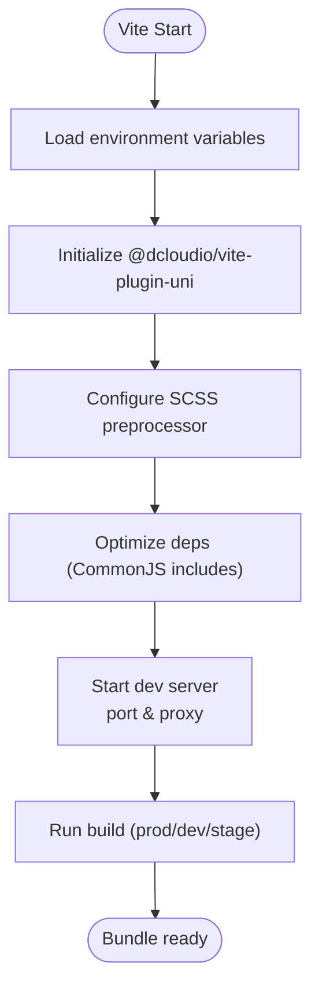
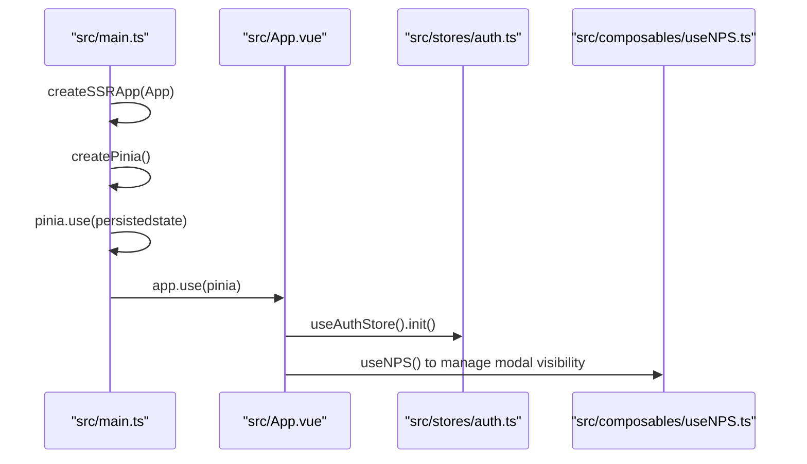
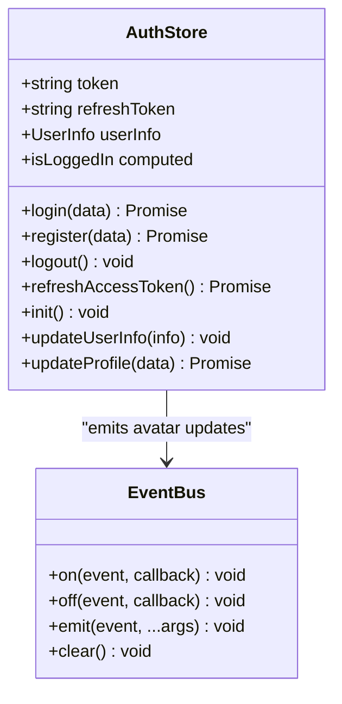
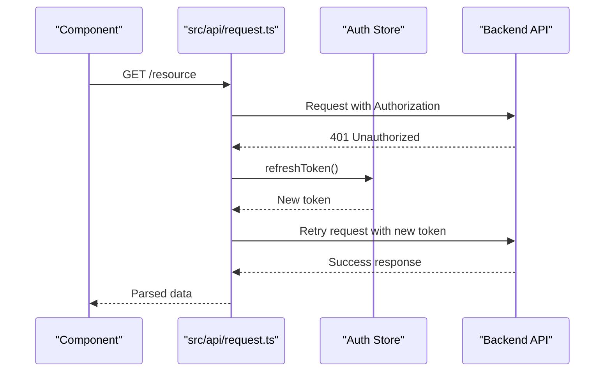
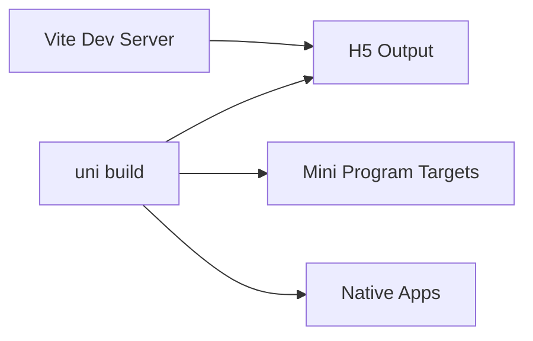
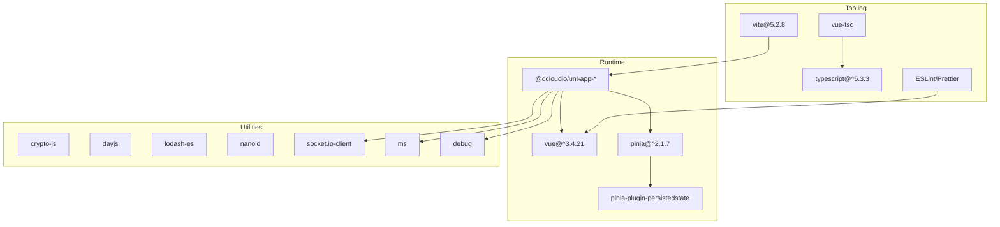

# Technology Stack & Dependencies

<cite>
**Referenced Files in This Document**
- [package.json](file://package.json)
- [vite.config.ts](file://vite.config.ts)
- [tsconfig.json](file://tsconfig.json)
- [src/main.ts](file://src/main.ts)
- [shims-uni.d.ts](file://shims-uni.d.ts)
- [src/App.vue](file://src/App.vue)
- [src/manifest.json](file://src/manifest.json)
- [src/pages.json](file://src/pages.json)
- [src/stores/index.ts](file://src/stores/index.ts)
- [src/stores/auth.ts](file://src/stores/auth.ts)
- [src/composables/useNPS.ts](file://src/composables/useNPS.ts)
- [src/api/request.ts](file://src/api/request.ts)
- [src/utils/event-bus.ts](file://src/utils/event-bus.ts)
- [index.html](file://index.html)
</cite>

## Table of Contents
1. [Introduction](#introduction)
2. [Project Structure](#project-structure)
3. [Core Components](#core-components)
4. [Architecture Overview](#architecture-overview)
5. [Detailed Component Analysis](#detailed-component-analysis)
6. [Dependency Analysis](#dependency-analysis)
7. [Performance Considerations](#performance-considerations)
8. [Troubleshooting Guide](#troubleshooting-guide)
9. [Conclusion](#conclusion)
10. [Appendices](#appendices)

## Introduction
This document provides comprehensive technology stack documentation for the WeTogether platform. It explains the cross-platform framework (UniApp), the Vue 3 + Composition API frontend architecture, TypeScript type safety, Pinia state management, and the Vite build system. It also covers development server configuration, TypeScript compilation settings, platform-specific targets (H5, WeChat Mini Program, and native mobile), and the rationale behind technology choices. The goal is to help developers understand how the pieces fit together, how to extend the system, and how to maintain consistency across platforms.

## Project Structure
The project follows a conventional Vue 3 + UniApp structure with a clear separation of concerns:
- Application bootstrap and global setup live under src/main.ts and src/App.vue.
- Pages and routing metadata are defined via src/pages.json and page components under src/pages/.
- State management is centralized using Pinia stores under src/stores/.
- API client and utilities are under src/api/ and src/utils/.
- Build tooling is configured via vite.config.ts and TypeScript via tsconfig.json.
- Platform configuration is defined in src/manifest.json.

**Diagram sources**
- [src/main.ts:1-18](file://src/main.ts#L1-L18)
- [src/App.vue:1-103](file://src/App.vue#L1-L103)
- [src/stores/index.ts:1-5](file://src/stores/index.ts#L1-L5)
- [src/stores/auth.ts:1-137](file://src/stores/auth.ts#L1-L137)
- [src/composables/useNPS.ts:1-145](file://src/composables/useNPS.ts#L1-L145)
- [src/pages.json:1-253](file://src/pages.json#L1-L253)
- [vite.config.ts:1-49](file://vite.config.ts#L1-L49)
- [tsconfig.json:1-14](file://tsconfig.json#L1-L14)
- [src/manifest.json:1-48](file://src/manifest.json#L1-L48)
- [src/api/request.ts:1-228](file://src/api/request.ts#L1-L228)

**Section sources**
- [src/main.ts:1-18](file://src/main.ts#L1-L18)
- [src/App.vue:1-103](file://src/App.vue#L1-L103)
- [src/pages.json:1-253](file://src/pages.json#L1-L253)
- [src/manifest.json:1-48](file://src/manifest.json#L1-L48)
- [vite.config.ts:1-49](file://vite.config.ts#L1-L49)
- [tsconfig.json:1-14](file://tsconfig.json#L1-L14)

## Core Components
- UniApp framework: Provides cross-platform runtime and build pipeline. Version alignment across @dcloudio packages indicates a specific engine release.
- Vue 3 with Composition API: Used throughout the app for reactive components and composable logic.
- TypeScript: Enforced via vue-tsc and tsconfig.json with strict path mapping and d.ts declarations.
- Pinia: Centralized state management with persisted state support.
- Vite: Fast build tool with built-in HMR and plugin ecosystem via @dcloudio/vite-plugin-uni.
- Development server: Configured with port, proxy, and CommonJS optimization for selected dependencies.

Key implementation references:
- App bootstrap and Pinia initialization: [src/main.ts:1-18](file://src/main.ts#L1-L18)
- Global app lifecycle and NPS modal: [src/App.vue:1-103](file://src/App.vue#L1-L103)
- Store exports and auth store: [src/stores/index.ts:1-5](file://src/stores/index.ts#L1-L5), [src/stores/auth.ts:1-137](file://src/stores/auth.ts#L1-L137)
- NPS composable: [src/composables/useNPS.ts:1-145](file://src/composables/useNPS.ts#L1-L145)
- HTTP client with token refresh: [src/api/request.ts:1-228](file://src/api/request.ts#L1-L228)
- Event bus: [src/utils/event-bus.ts:1-49](file://src/utils/event-bus.ts#L1-L49)
- Build and dev server config: [vite.config.ts:1-49](file://vite.config.ts#L1-L49)
- TypeScript config: [tsconfig.json:1-14](file://tsconfig.json#L1-L14)
- Platform manifest: [src/manifest.json:1-48](file://src/manifest.json#L1-L48)

**Section sources**
- [src/main.ts:1-18](file://src/main.ts#L1-L18)
- [src/App.vue:1-103](file://src/App.vue#L1-L103)
- [src/stores/index.ts:1-5](file://src/stores/index.ts#L1-L5)
- [src/stores/auth.ts:1-137](file://src/stores/auth.ts#L1-L137)
- [src/composables/useNPS.ts:1-145](file://src/composables/useNPS.ts#L1-L145)
- [src/api/request.ts:1-228](file://src/api/request.ts#L1-L228)
- [src/utils/event-bus.ts:1-49](file://src/utils/event-bus.ts#L1-L49)
- [vite.config.ts:1-49](file://vite.config.ts#L1-L49)
- [tsconfig.json:1-14](file://tsconfig.json#L1-L14)
- [src/manifest.json:1-48](file://src/manifest.json#L1-L48)

## Architecture Overview
The WeTogether front-end architecture centers on a single-codebase approach powered by UniApp. Vue 3 + Composition API drives UI logic, while Pinia manages application state. The HTTP client encapsulates authentication and token refresh flows. The build system leverages Vite with a UniApp plugin to target multiple platforms.

**Diagram sources**
- [package.json:45-98](file://package.json#L45-L98)
- [vite.config.ts:1-49](file://vite.config.ts#L1-L49)
- [src/manifest.json:1-48](file://src/manifest.json#L1-L48)

## Detailed Component Analysis

### Build System and Tooling
- Vite configuration:
  - Plugin: @dcloudio/vite-plugin-uni enables UniApp builds.
  - CSS preprocessor: SCSS modern-compiler API with deprecation silencing.
  - Dependency optimization: CommonJS inclusion for socket.io-client and related packages.
  - Dev server: Port from environment variable with fallback; API and WebSocket proxies configured.
- TypeScript configuration:
  - Extends @vue/tsconfig defaults.
  - Path aliases (@/* -> ./src/*).
  - Types include @dcloudio/types for UniApp.
  - Source maps enabled for debugging.

**Diagram sources**
- [vite.config.ts:1-49](file://vite.config.ts#L1-L49)
- [tsconfig.json:1-14](file://tsconfig.json#L1-L14)

**Section sources**
- [vite.config.ts:1-49](file://vite.config.ts#L1-L49)
- [tsconfig.json:1-14](file://tsconfig.json#L1-L14)

### Application Bootstrap and Global State
- App bootstrap:
  - Creates SSR app instance and installs Pinia.
  - Registers persisted state plugin globally.
- Global app lifecycle:
  - Initializes auth store on launch and logs lifecycle events.
- NPS modal:
  - Controlled by a composable that decides visibility and triggers based on scenes.

**Diagram sources**
- [src/main.ts:1-18](file://src/main.ts#L1-L18)
- [src/App.vue:1-26](file://src/App.vue#L1-L26)
- [src/stores/auth.ts:73-77](file://src/stores/auth.ts#L73-L77)
- [src/composables/useNPS.ts:13-77](file://src/composables/useNPS.ts#L13-L77)

**Section sources**
- [src/main.ts:1-18](file://src/main.ts#L1-L18)
- [src/App.vue:1-26](file://src/App.vue#L1-L26)
- [src/stores/auth.ts:73-77](file://src/stores/auth.ts#L73-L77)
- [src/composables/useNPS.ts:13-77](file://src/composables/useNPS.ts#L13-L77)

### State Management with Pinia
- Store pattern:
  - defineStore with Composition API (ref, computed).
  - Persisted state enabled via plugin.
  - Storage operations use uni.setStorageSync/uni.getStorageSync.
- Auth store responsibilities:
  - Login, register, logout, token refresh, profile updates.
  - Event emission for avatar updates.

**Diagram sources**
- [src/stores/auth.ts:1-137](file://src/stores/auth.ts#L1-L137)
- [src/utils/event-bus.ts:1-49](file://src/utils/event-bus.ts#L1-L49)

**Section sources**
- [src/stores/auth.ts:1-137](file://src/stores/auth.ts#L1-L137)
- [src/utils/event-bus.ts:1-49](file://src/utils/event-bus.ts#L1-L49)

### HTTP Client and Authentication Flow
- Request client:
  - Centralizes base URL, headers, timeouts.
  - Implements token refresh on 401 with subscriber queue to avoid concurrent refreshes.
  - Retries original request after successful refresh.
- Token persistence:
  - Uses uni.getStorageSync/uni.setStorageSync for token and user info.
- Navigation:
  - On unauthorized state, navigates to login page.

**Diagram sources**
- [src/api/request.ts:75-208](file://src/api/request.ts#L75-L208)
- [src/stores/auth.ts:54-71](file://src/stores/auth.ts#L54-L71)

**Section sources**
- [src/api/request.ts:1-228](file://src/api/request.ts#L1-L228)
- [src/stores/auth.ts:54-71](file://src/stores/auth.ts#L54-L71)

### Platform-Specific Considerations
- H5/Web:
  - Targeted via uni --mode dev/build commands and served by Vite dev server.
  - HTML template injects viewport and app entry script.
- WeChat Mini Program and others:
  - Multiple mini-program targets supported via uni build -p <target>.
  - Manifest enables per-target settings (e.g., mp-weixin).
- Native apps:
  - app-plus and Harmony configurations present in manifest for Android/iOS and Harmony distribution.

**Diagram sources**
- [package.json:4-42](file://package.json#L4-L42)
- [src/manifest.json:1-48](file://src/manifest.json#L1-L48)
- [index.html:1-21](file://index.html#L1-L21)

**Section sources**
- [package.json:4-42](file://package.json#L4-L42)
- [src/manifest.json:1-48](file://src/manifest.json#L1-L48)
- [index.html:1-21](file://index.html#L1-L21)

## Dependency Analysis
- Core runtime:
  - Vue 3 and @dcloudio/uni-app packages form the foundation.
  - Pinia and pinia-plugin-persistedstate for state management.
- Utilities:
  - crypto-js, dayjs, lodash-es, nanoid, socket.io-client, ms, debug for cryptography, date/time, collections, identifiers, real-time communication, and logging.
- Build and linting:
  - Vite, TypeScript 5.x, vue-tsc, ESLint/Prettier toolchain.
- Type safety:
  - @dcloudio/types and shims-uni.d.ts integrate UniApp types into Vue components.

**Diagram sources**
- [package.json:45-98](file://package.json#L45-L98)
- [shims-uni.d.ts:1-11](file://shims-uni.d.ts#L1-L11)

**Section sources**
- [package.json:45-98](file://package.json#L45-L98)
- [shims-uni.d.ts:1-11](file://shims-uni.d.ts#L1-L11)

## Performance Considerations
- Dependency optimization:
  - CommonJS inclusion for socket.io-client and related packages reduces bundle splitting overhead during dev.
- CSS preprocessor:
  - Modern SCSS compiler with deprecation silencing avoids noisy warnings and improves DX.
- Build configuration:
  - Source maps enabled for debugging; consider disabling in production builds for smaller bundles.
- Network reliability:
  - Token refresh queue prevents redundant refresh calls and ensures retries succeed seamlessly.

[No sources needed since this section provides general guidance]

## Troubleshooting Guide
- Proxy misconfiguration:
  - Verify Vite proxy target and rewrite rules for /api and /ws align with backend endpoints.
- Token expiration:
  - If requests fail with 401, ensure refresh token exists and the client retries automatically; otherwise, navigate to login.
- Mini program build errors:
  - Confirm target-specific settings in manifest.json and that the correct uni build command is used.
- Type errors:
  - Run type check via npm/yarn script to catch TS issues early.

**Section sources**
- [vite.config.ts:27-47](file://vite.config.ts#L27-L47)
- [src/api/request.ts:100-148](file://src/api/request.ts#L100-L148)
- [package.json:4-42](file://package.json#L4-L42)
- [tsconfig.json:1-14](file://tsconfig.json#L1-L14)

## Conclusion
WeTogether leverages a robust, unified tech stack: UniApp for cross-platform delivery, Vue 3 with Composition API for reactive UI, TypeScript for type safety, Pinia for scalable state, and Vite for fast builds. The configuration emphasizes developer productivity (HMR, proxy, type checking) while maintaining strong platform support for H5, WeChat Mini Program, and native targets. The HTTP client and auth store provide resilient session handling, and the event bus enables decoupled UI updates.

[No sources needed since this section summarizes without analyzing specific files]

## Appendices

### Technology Choices and Rationale
- UniApp:
  - Single codebase across H5, Mini Programs, and native apps.
  - Mature plugin ecosystem and consistent APIs.
- Vue 3 + Composition API:
  - Better ergonomics, tree-shaking, and reactivity compared to Options API.
- TypeScript:
  - Prevents runtime errors, improves IDE support, and enforces contracts.
- Pinia:
  - Lightweight, intuitive, and integrates well with Vue 3 and TypeScript.
- Vite:
  - Faster cold start, optimized HMR, and excellent DX for modern web dev.

[No sources needed since this section provides general guidance]

### Version Compatibility Notes
- Vue 3.4.x and @dcloudio/uni-app packages are aligned to a specific engine release, ensuring compatibility across H5, Mini Programs, and native targets.
- TypeScript 5.x is supported by vue-tsc and @vue/tsconfig defaults.

**Section sources**
- [package.json:45-77](file://package.json#L45-L77)
- [tsconfig.json:1-14](file://tsconfig.json#L1-L14)