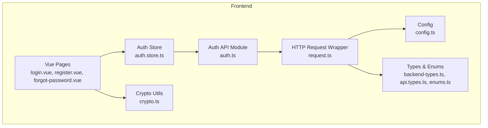
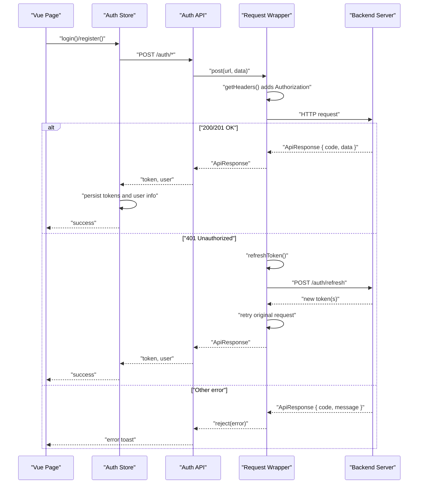
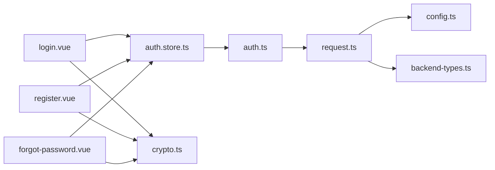

# Authentication API Endpoints

<cite>
**Referenced Files in This Document**
- [auth.ts](file://src/api/modules/auth.ts)
- [request.ts](file://src/api/request.ts)
- [auth.store.ts](file://src/stores/auth.ts)
- [login.vue](file://src/pages/auth/login.vue)
- [register.vue](file://src/pages/auth/register.vue)
- [forgot-password.vue](file://src/pages/auth/forgot-password.vue)
- [backend-types.ts](file://src/types/api/backend-types.ts)
- [api.types.ts](file://src/types/api.ts)
- [enums.ts](file://src/types/enums.ts)
- [config.ts](file://src/config/index.ts)
- [crypto.ts](file://src/utils/crypto.ts)
- [test-frontend-auth.sh](file://test-frontend-auth.sh)
</cite>

## Table of Contents
1. [Introduction](#introduction)
2. [Project Structure](#project-structure)
3. [Core Components](#core-components)
4. [Architecture Overview](#architecture-overview)
5. [Detailed Component Analysis](#detailed-component-analysis)
6. [Dependency Analysis](#dependency-analysis)
7. [Performance Considerations](#performance-considerations)
8. [Troubleshooting Guide](#troubleshooting-guide)
9. [Conclusion](#conclusion)
10. [Appendices](#appendices)

## Introduction
This document provides comprehensive API documentation for the authentication system endpoints. It covers:
- POST /auth/sms/send for SMS/email verification code delivery
- POST /auth/register for user registration
- POST /auth/login for user authentication
- POST /auth/reset-password for password reset
- POST /auth/refresh for JWT refresh

It details request/response schemas, parameter validation rules, error responses, authentication headers, JWT token handling, session management, practical examples (curl and JavaScript fetch), rate limiting considerations, security measures, and common error scenarios with solutions.

## Project Structure
The authentication system spans several modules:
- API module for typed HTTP requests to authentication endpoints
- Request wrapper for global token injection, automatic refresh, and error handling
- Pinia store for managing tokens, refresh tokens, and user info
- Vue pages implementing UI flows for login, registration, and password reset
- Types and enums defining DTOs and shared models
- Configuration and cryptography utilities

**Diagram sources**
- [auth.ts:1-56](file://src/api/modules/auth.ts#L1-L56)
- [request.ts:1-228](file://src/api/request.ts#L1-L228)
- [auth.store.ts:1-137](file://src/stores/auth.ts#L1-L137)
- [login.vue:1-227](file://src/pages/auth/login.vue#L1-L227)
- [register.vue:1-501](file://src/pages/auth/register.vue#L1-L501)
- [forgot-password.vue:1-440](file://src/pages/auth/forgot-password.vue#L1-L440)
- [backend-types.ts:1-764](file://src/types/api/backend-types.ts#L1-L764)
- [api.types.ts:1-83](file://src/types/api.ts#L1-L83)
- [enums.ts:1-41](file://src/types/enums.ts#L1-L41)
- [config.ts:1-11](file://src/config/index.ts#L1-L11)
- [crypto.ts:1-18](file://src/utils/crypto.ts#L1-L18)

**Section sources**
- [auth.ts:1-56](file://src/api/modules/auth.ts#L1-L56)
- [request.ts:1-228](file://src/api/request.ts#L1-L228)
- [auth.store.ts:1-137](file://src/stores/auth.ts#L1-L137)
- [login.vue:1-227](file://src/pages/auth/login.vue#L1-L227)
- [register.vue:1-501](file://src/pages/auth/register.vue#L1-L501)
- [forgot-password.vue:1-440](file://src/pages/auth/forgot-password.vue#L1-L440)
- [backend-types.ts:1-764](file://src/types/api/backend-types.ts#L1-L764)
- [api.types.ts:1-83](file://src/types/api.ts#L1-L83)
- [enums.ts:1-41](file://src/types/enums.ts#L1-L41)
- [config.ts:1-11](file://src/config/index.ts#L1-L11)
- [crypto.ts:1-18](file://src/utils/crypto.ts#L1-L18)

## Core Components
- Auth API module exposes typed functions for authentication endpoints and user updates.
- Request wrapper injects Authorization headers, handles 401 refresh flows, and retries failed requests.
- Auth store manages tokens, refresh tokens, user info, and persistence via uni-app storage.
- Pages implement UI flows with client-side validation and encryption of passwords before submission.
- Types define request/response DTOs and enums for gender/status values.
- Configuration defines base URLs and timeouts.
- Crypto utilities provide frontend SHA256 hashing of passwords.

**Section sources**
- [auth.ts:33-56](file://src/api/modules/auth.ts#L33-L56)
- [request.ts:15-24](file://src/api/request.ts#L15-L24)
- [auth.store.ts:9-136](file://src/stores/auth.ts#L9-L136)
- [login.vue:68-103](file://src/pages/auth/login.vue#L68-L103)
- [register.vue:181-302](file://src/pages/auth/register.vue#L181-L302)
- [forgot-password.vue:141-299](file://src/pages/auth/forgot-password.vue#L141-L299)
- [backend-types.ts:374-425](file://src/types/api/backend-types.ts#L374-L425)
- [api.types.ts:3-8](file://src/types/api.ts#L3-L8)
- [config.ts:1-5](file://src/config/index.ts#L1-L5)
- [crypto.ts:8-17](file://src/utils/crypto.ts#L8-L17)

## Architecture Overview
The authentication flow integrates UI pages, typed API calls, a request wrapper, and a persistent store. The request wrapper automatically attaches Authorization headers and refreshes tokens on 401 responses.

**Diagram sources**
- [auth.store.ts:18-71](file://src/stores/auth.ts#L18-L71)
- [auth.ts:33-49](file://src/api/modules/auth.ts#L33-L49)
- [request.ts:75-208](file://src/api/request.ts#L75-L208)

## Detailed Component Analysis

### Endpoint: POST /auth/sms/send
- Purpose: Send a verification code to the provided email for the given operation type.
- Request body schema:
  - mobile: string (required)
  - email: string (required)
  - type: "register" | "login" | "reset_password" (required)
- Response schema:
  - code: number
  - message: string
  - data: { message: string }
- Authentication: Not required.
- Validation rules:
  - mobile: presence
  - email: presence and format validation in UI
  - type: enum ["register","login","reset_password"]
- Typical success response: code 0 with a success message.
- Typical errors:
  - Missing fields: validation fails in UI before sending.
  - Invalid email format: UI prevents submission.
  - Rate limiting: server may reject rapid repeated sends.

Practical examples:
- curl
  - curl -X POST "$BASE_URL/auth/sms/send" -H "Content-Type: application/json" -d '{"mobile":"13800001111","email":"user@example.com","type":"register"}'
- JavaScript fetch
  - fetch(`${API_BASE_URL}/auth/sms/send`, { method: 'POST', headers: {'Content-Type': 'application/json'}, body: JSON.stringify({mobile, email, type}) })

Security considerations:
- Email verification ensures ownership before registration/login/reset actions.
- Consider rate limiting per IP/phone/email to prevent abuse.

**Section sources**
- [auth.ts:34-35](file://src/api/modules/auth.ts#L34-L35)
- [backend-types.ts:374-381](file://src/types/api/backend-types.ts#L374-L381)
- [register.vue:181-233](file://src/pages/auth/register.vue#L181-L233)
- [forgot-password.vue:141-201](file://src/pages/auth/forgot-password.vue#L141-L201)

### Endpoint: POST /auth/register
- Purpose: Register a new user with phone, email, code, nickname, optional gender and invite code.
- Request body schema:
  - mobile: string (required)
  - email: string (required)
  - code: string (required)
  - password: string (required; SHA256 hashed)
  - nickname: string (required)
  - gender: 0|1|2 (optional)
  - inviteCode: string (optional)
- Response schema:
  - code: number
  - message: string
  - data: { token: string; user: User }
- Authentication: Not required.
- Validation rules:
  - UI validates presence and format (email regex).
  - Password is hashed client-side before sending.
- Typical success response: code 0 with token and user info.
- Typical errors:
  - Invalid verification code
  - Duplicate mobile/email
  - Password length/format issues (handled by UI and backend)

Practical examples:
- curl
  - curl -X POST "$BASE_URL/auth/register" -H "Content-Type: application/json" -d '{"mobile":"13800001111","email":"user@example.com","code":"123456","password":"<sha256-hex>","nickname":"User Name","gender":1}'
- JavaScript fetch
  - const encrypted = CryptoUtil.encryptPassword(rawPassword); fetch(`${API_BASE_URL}/auth/register`, { method: 'POST', body: JSON.stringify({...registerData, password: encrypted}) })

Security considerations:
- Frontend SHA256 hashing protects plaintext passwords in transit.
- Backend applies PBKDF2 for secure storage.

**Section sources**
- [auth.ts:37-38](file://src/api/modules/auth.ts#L37-L38)
- [backend-types.ts:386-401](file://src/types/api/backend-types.ts#L386-L401)
- [register.vue:235-302](file://src/pages/auth/register.vue#L235-L302)
- [crypto.ts:14-16](file://src/utils/crypto.ts#L14-L16)

### Endpoint: POST /auth/login
- Purpose: Authenticate user and return JWT token plus user info.
- Request body schema:
  - mobile: string (required)
  - password: string (required; SHA256 hashed)
- Response schema:
  - code: number
  - message: string
  - data: { token: string; user: User }
- Authentication: Not required.
- Validation rules:
  - UI validates presence and optionally toggles password visibility.
  - Password is hashed client-side before sending.
- Typical success response: code 0 with token and user info.
- Typical errors:
  - Invalid credentials
  - Account disabled or deleted

Practical examples:
- curl
  - curl -X POST "$BASE_URL/auth/login" -H "Content-Type: application/json" -d '{"mobile":"13800001111","password":"<sha256-hex>"}'
- JavaScript fetch
  - const encrypted = CryptoUtil.encryptPassword(rawPassword); fetch(`${API_BASE_URL}/auth/login`, { method: 'POST', body: JSON.stringify({mobile, password: encrypted}) })

Security considerations:
- Frontend hashing reduces risk of plaintext exposure.
- Backend verifies hashed password against stored PBKDF2 hash.

**Section sources**
- [auth.ts:40-41](file://src/api/modules/auth.ts#L40-L41)
- [backend-types.ts:406-411](file://src/types/api/backend-types.ts#L406-L411)
- [login.vue:68-103](file://src/pages/auth/login.vue#L68-L103)
- [crypto.ts:14-16](file://src/utils/crypto.ts#L14-L16)

### Endpoint: POST /auth/reset-password
- Purpose: Reset user password using phone, email, code, and new password.
- Request body schema:
  - mobile: string (required)
  - email: string (required)
  - code: string (required)
  - newPassword: string (required; SHA256 hashed)
- Response schema:
  - code: number
  - message: string
  - data: { message: string }
- Authentication: Not required.
- Validation rules:
  - UI validates presence, email format, code presence, and password length/confirmation.
  - Password is hashed client-side before sending.
- Typical success response: code 0 with success message.
- Typical errors:
  - Invalid or expired code
  - Password mismatch or too short

Practical examples:
- curl
  - curl -X POST "$BASE_URL/auth/reset-password" -H "Content-Type: application/json" -d '{"mobile":"13800001111","email":"user@example.com","code":"123456","newPassword":"<sha256-hex>"}'
- JavaScript fetch
  - const encrypted = CryptoUtil.encryptPassword(rawPassword); fetch(`${API_BASE_URL}/auth/reset-password`, { method: 'POST', body: JSON.stringify({mobile, email, code, newPassword: encrypted}) })

Security considerations:
- Frontend hashing protects new password during transport.
- Backend enforces password policies and updates the hash securely.

**Section sources**
- [auth.ts:43-44](file://src/api/modules/auth.ts#L43-L44)
- [backend-types.ts:416-425](file://src/types/api/backend-types.ts#L416-L425)
- [forgot-password.vue:203-299](file://src/pages/auth/forgot-password.vue#L203-L299)
- [crypto.ts:14-16](file://src/utils/crypto.ts#L14-L16)

### Endpoint: POST /auth/refresh
- Purpose: Refresh access token using a valid refresh token.
- Request body schema:
  - refreshToken: string (required)
- Response schema:
  - code: number
  - message: string
  - data: { token: string; refreshToken?: string }
- Authentication: Not required.
- Behavior:
  - Request wrapper automatically triggers refresh on 401 responses.
  - Store persists refreshed tokens and retries the original request.

Practical examples:
- curl
  - curl -X POST "$BASE_URL/auth/refresh" -H "Content-Type: application/json" -d '{"refreshToken":"<refresh-token>"}'
- JavaScript fetch
  - fetch(`${API_BASE_URL}/auth/refresh`, { method: 'POST', body: JSON.stringify({refreshToken}) })

Security considerations:
- Refresh tokens should be stored securely and rotated when returned.
- Short-lived access tokens reduce exposure windows.

**Section sources**
- [auth.ts:46-49](file://src/api/modules/auth.ts#L46-L49)
- [request.ts:35-73](file://src/api/request.ts#L35-L73)
- [auth.store.ts:54-71](file://src/stores/auth.ts#L54-L71)

## Dependency Analysis
The authentication system exhibits layered dependencies:
- Pages depend on store and crypto utilities.
- Store depends on API module.
- API module depends on request wrapper.
- Request wrapper depends on configuration and types.
- Types and enums are shared across modules.

**Diagram sources**
- [login.vue:55-56](file://src/pages/auth/login.vue#L55-L56)
- [register.vue:148-151](file://src/pages/auth/register.vue#L148-L151)
- [forgot-password.vue:124-126](file://src/pages/auth/forgot-password.vue#L124-L126)
- [auth.store.ts:3-5](file://src/stores/auth.ts#L3-L5)
- [auth.ts:1-10](file://src/api/modules/auth.ts#L1-L10)
- [request.ts:1-4](file://src/api/request.ts#L1-L4)
- [config.ts:1-5](file://src/config/index.ts#L1-L5)
- [backend-types.ts:1-9](file://src/types/api/backend-types.ts#L1-L9)
- [crypto.ts:1-1](file://src/utils/crypto.ts#L1-L1)

**Section sources**
- [auth.store.ts:1-137](file://src/stores/auth.ts#L1-L137)
- [auth.ts:1-56](file://src/api/modules/auth.ts#L1-L56)
- [request.ts:1-228](file://src/api/request.ts#L1-L228)
- [login.vue:55-56](file://src/pages/auth/login.vue#L55-L56)
- [register.vue:148-151](file://src/pages/auth/register.vue#L148-L151)
- [forgot-password.vue:124-126](file://src/pages/auth/forgot-password.vue#L124-L126)
- [backend-types.ts:1-764](file://src/types/api/backend-types.ts#L1-L764)
- [config.ts:1-11](file://src/config/index.ts#L1-L11)
- [crypto.ts:1-18](file://src/utils/crypto.ts#L1-L18)

## Performance Considerations
- Token caching: Store tokens in persistent storage to avoid re-login on app restart.
- Retry strategy: Automatic retry after token refresh prevents user interruption.
- Minimize network calls: Batch UI validations to reduce unnecessary submissions.
- Timeout tuning: Adjust request timeout according to network conditions.

[No sources needed since this section provides general guidance]

## Troubleshooting Guide
Common issues and resolutions:
- 401 Unauthorized
  - Cause: Expired or invalid access token.
  - Resolution: Request wrapper automatically refreshes token; if refresh fails, clear local storage and redirect to login.
- Invalid credentials
  - Cause: Wrong mobile/password combination.
  - Resolution: Prompt user to re-enter credentials; ensure frontend password hashing is applied.
- Verification code errors
  - Cause: Incorrect or expired code.
  - Resolution: Re-send code and ensure UI cooldown timer is respected.
- Network failures
  - Cause: Timeout or connectivity issues.
  - Resolution: Show user-friendly messages and allow retry.

**Section sources**
- [request.ts:100-147](file://src/api/request.ts#L100-L147)
- [auth.store.ts:67-71](file://src/stores/auth.ts#L67-L71)
- [login.vue:94-102](file://src/pages/auth/login.vue#L94-L102)
- [register.vue:235-302](file://src/pages/auth/register.vue#L235-L302)
- [forgot-password.vue:203-299](file://src/pages/auth/forgot-password.vue#L203-L299)

## Conclusion
The authentication system provides a robust, secure, and user-friendly set of endpoints with strong client-side encryption, automatic token refresh, and comprehensive UI flows. Following the documented schemas, validation rules, and security practices ensures reliable integrations and a good user experience.

[No sources needed since this section summarizes without analyzing specific files]

## Appendices

### Authentication Headers and JWT Handling
- Authorization header: Bearer <access-token>
- Access token: short-lived JWT for protected resources
- Refresh token: long-lived JWT used to obtain new access tokens
- Storage: uni-app storage persists tokens and user info across sessions

**Section sources**
- [request.ts:15-24](file://src/api/request.ts#L15-L24)
- [auth.store.ts:12-26](file://src/stores/auth.ts#L12-L26)
- [auth.store.ts:54-71](file://src/stores/auth.ts#L54-L71)

### Session Management
- Login: store token and user info, persist to storage
- Logout: clear tokens and user info from storage
- Init: restore tokens and user info on app start
- Auto-refresh: intercept 401, refresh token, retry original request

**Section sources**
- [auth.store.ts:44-52](file://src/stores/auth.ts#L44-L52)
- [auth.store.ts:73-77](file://src/stores/auth.ts#L73-L77)
- [auth.store.ts:119-131](file://src/stores/auth.ts#L119-L131)
- [request.ts:100-174](file://src/api/request.ts#L100-L174)

### Practical Examples

#### curl Examples
- Send verification code
  - curl -X POST "$BASE_URL/auth/sms/send" -H "Content-Type: application/json" -d '{"mobile":"13800001111","email":"user@example.com","type":"register"}'
- Register
  - curl -X POST "$BASE_URL/auth/register" -H "Content-Type: application/json" -d '{"mobile":"13800001111","email":"user@example.com","code":"123456","password":"<sha256-hex>","nickname":"User Name"}'
- Login
  - curl -X POST "$BASE_URL/auth/login" -H "Content-Type: application/json" -d '{"mobile":"13800001111","password":"<sha256-hex>"}'
- Reset password
  - curl -X POST "$BASE_URL/auth/reset-password" -H "Content-Type: application/json" -d '{"mobile":"13800001111","email":"user@example.com","code":"123456","newPassword":"<sha256-hex>"}'
- Refresh token
  - curl -X POST "$BASE_URL/auth/refresh" -H "Content-Type: application/json" -d '{"refreshToken":"<refresh-token>"}'

#### JavaScript fetch Examples
- Send verification code
  - fetch(`${API_BASE_URL}/auth/sms/send`, { method: 'POST', headers: {'Content-Type': 'application/json'}, body: JSON.stringify({mobile, email, type}) })
- Register
  - const encrypted = CryptoUtil.encryptPassword(rawPassword); fetch(`${API_BASE_URL}/auth/register`, { method: 'POST', body: JSON.stringify({...registerData, password: encrypted}) })
- Login
  - const encrypted = CryptoUtil.encryptPassword(rawPassword); fetch(`${API_BASE_URL}/auth/login`, { method: 'POST', body: JSON.stringify({mobile, password: encrypted}) })
- Reset password
  - const encrypted = CryptoUtil.encryptPassword(rawPassword); fetch(`${API_BASE_URL}/auth/reset-password`, { method: 'POST', body: JSON.stringify({mobile, email, code, newPassword: encrypted}) })
- Refresh token
  - fetch(`${API_BASE_URL}/auth/refresh`, { method: 'POST', body: JSON.stringify({refreshToken}) })

**Section sources**
- [test-frontend-auth.sh:31-120](file://test-frontend-auth.sh#L31-L120)
- [crypto.ts:14-16](file://src/utils/crypto.ts#L14-L16)

### Security Considerations
- Password hashing: Frontend SHA256, backend PBKDF2
- Token scope: Separate access and refresh tokens
- Transport: HTTPS recommended in production
- Rate limiting: Enforce per-endpoint limits on server side
- Input validation: Client-side and server-side validation

**Section sources**
- [crypto.ts:8-17](file://src/utils/crypto.ts#L8-L17)
- [request.ts:35-73](file://src/api/request.ts#L35-L73)
- [config.ts:1-5](file://src/config/index.ts#L1-L5)

### Parameter Validation Rules
- Mobile: required, format validated in UI (registration and reset)
- Email: required, format validated in UI
- Code: required for registration and reset
- Password: required; minimum length enforced in UI for reset
- Gender: optional enum 0|1|2
- Invite code: optional

**Section sources**
- [register.vue:181-252](file://src/pages/auth/register.vue#L181-L252)
- [forgot-password.vue:141-268](file://src/pages/auth/forgot-password.vue#L141-L268)
- [backend-types.ts:12-21](file://src/types/api/backend-types.ts#L12-L21)