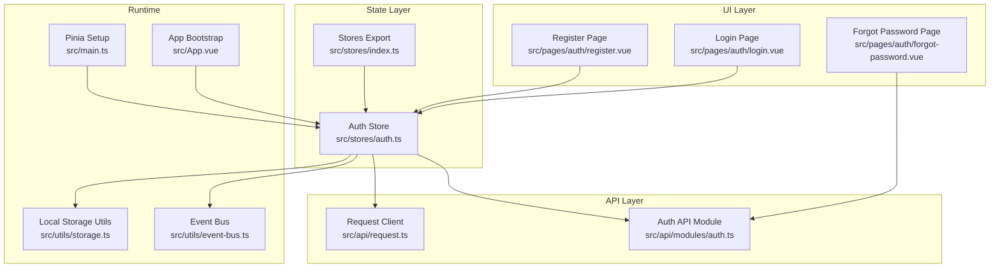
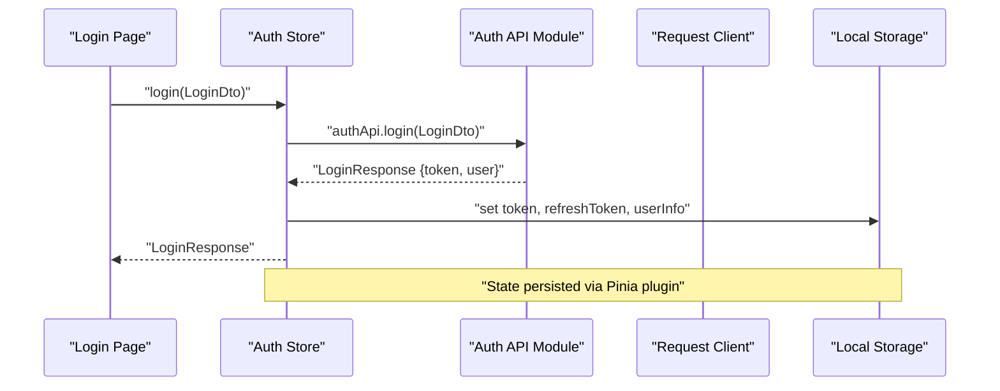
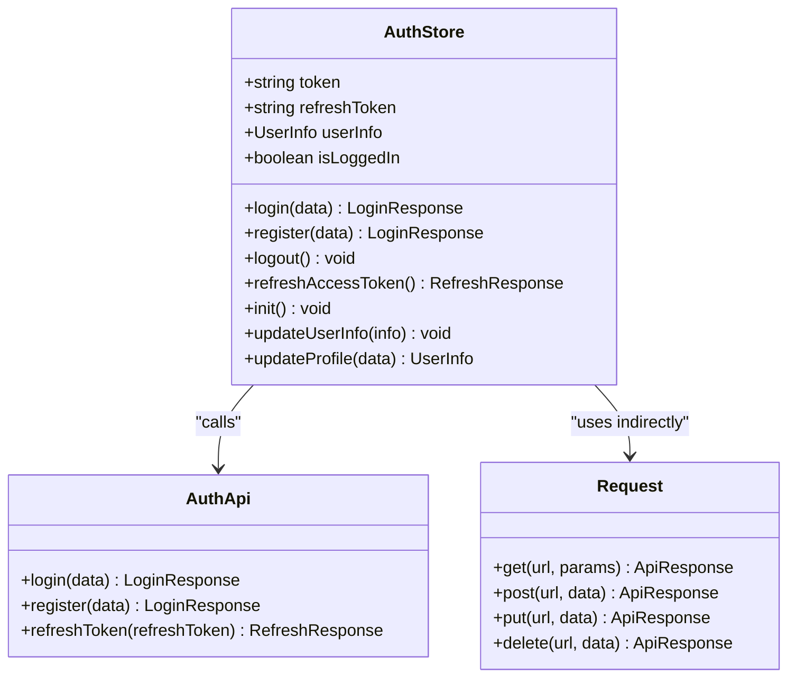
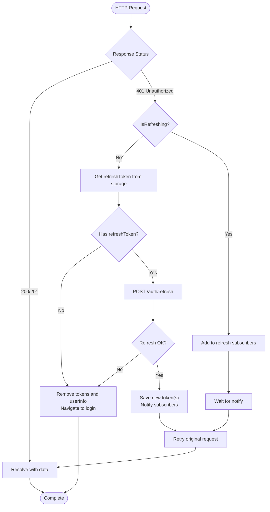
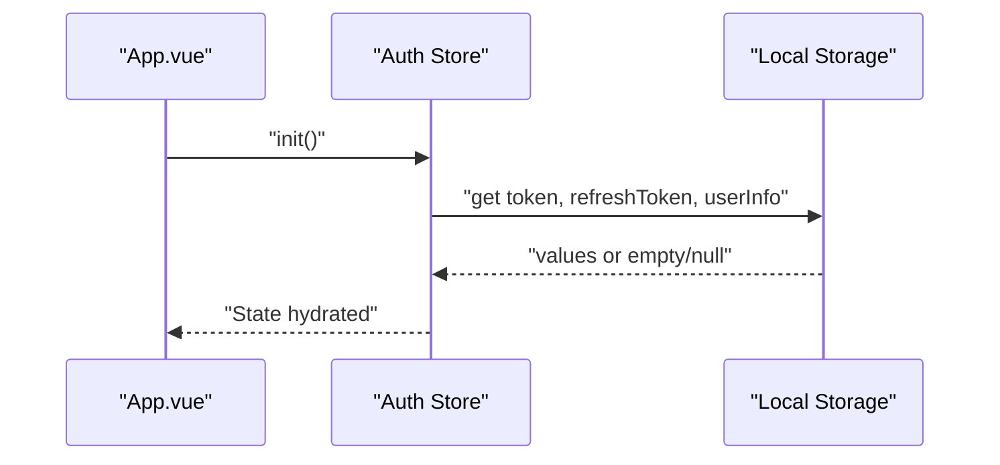
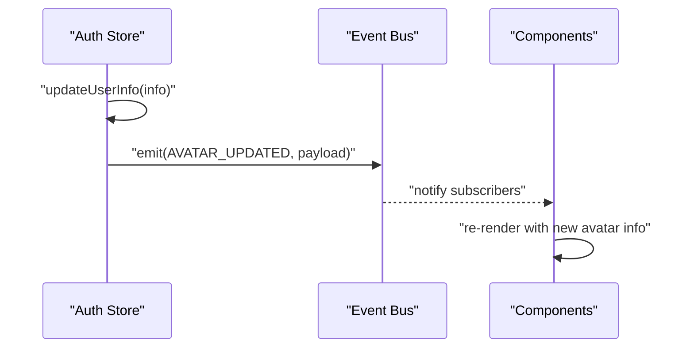
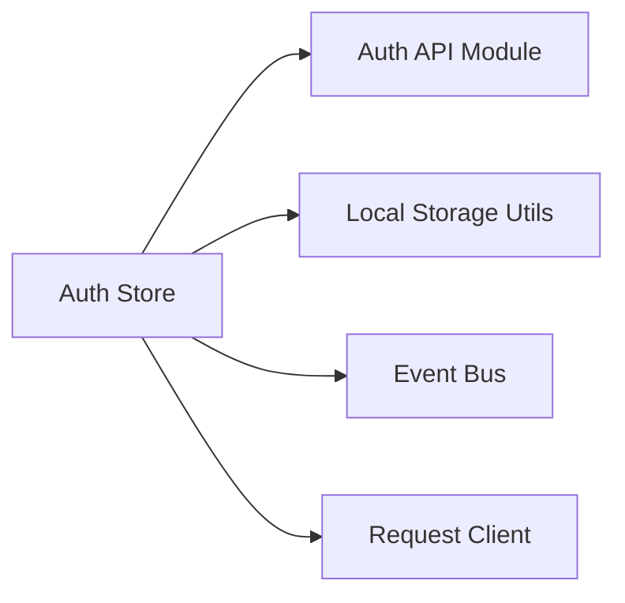

# Authentication State Management

<cite>
**Referenced Files in This Document**
- [auth.ts](file://src/stores/auth.ts)
- [index.ts](file://src/stores/index.ts)
- [storage.ts](file://src/utils/storage.ts)
- [auth.ts](file://src/api/modules/auth.ts)
- [request.ts](file://src/api/request.ts)
- [main.ts](file://src/main.ts)
- [login.vue](file://src/pages/auth/login.vue)
- [register.vue](file://src/pages/auth/register.vue)
- [forgot-password.vue](file://src/pages/auth/forgot-password.vue)
- [App.vue](file://src/App.vue)
- [event-bus.ts](file://src/utils/event-bus.ts)
- [api.ts](file://src/types/api.ts)
</cite>

## Table of Contents
1. [Introduction](#introduction)
2. [Project Structure](#project-structure)
3. [Core Components](#core-components)
4. [Architecture Overview](#architecture-overview)
5. [Detailed Component Analysis](#detailed-component-analysis)
6. [Dependency Analysis](#dependency-analysis)
7. [Performance Considerations](#performance-considerations)
8. [Troubleshooting Guide](#troubleshooting-guide)
9. [Conclusion](#conclusion)

## Introduction
This document explains the authentication state management implementation built with Pinia stores in a UniApp TypeScript project. It covers the auth store structure (user state, authentication status, token management), state mutations for login, logout, token refresh, and user updates, integration with local storage for persistent authentication state, automatic token refresh mechanisms, and how authentication-aware UI elements are implemented. It also documents state hydration on app startup and cross-tab synchronization via the global event bus.

## Project Structure
The authentication system centers around a Pinia store that manages tokens and user info, an API layer that handles requests and token refresh, and Vue pages that consume the store to render authentication-aware UI.

**Diagram sources**
- [login.vue](file://src/pages/auth/login.vue)
- [register.vue](file://src/pages/auth/register.vue)
- [forgot-password.vue](file://src/pages/auth/forgot-password.vue)
- [auth.ts](file://src/stores/auth.ts)
- [index.ts](file://src/stores/index.ts)
- [request.ts](file://src/api/request.ts)
- [auth.ts](file://src/api/modules/auth.ts)
- [App.vue](file://src/App.vue)
- [main.ts](file://src/main.ts)
- [storage.ts](file://src/utils/storage.ts)
- [event-bus.ts](file://src/utils/event-bus.ts)

**Section sources**
- [auth.ts](file://src/stores/auth.ts)
- [index.ts](file://src/stores/index.ts)
- [request.ts](file://src/api/request.ts)
- [auth.ts](file://src/api/modules/auth.ts)
- [main.ts](file://src/main.ts)
- [App.vue](file://src/App.vue)
- [storage.ts](file://src/utils/storage.ts)
- [event-bus.ts](file://src/utils/event-bus.ts)

## Core Components
- Auth Store: Manages token, refresh token, user info, computed isLoggedIn flag, and actions for login, register, logout, refreshAccessToken, init, updateUserInfo, and updateProfile. It persists state via pinia-plugin-persistedstate and synchronizes with local storage.
- Request Client: Centralizes HTTP requests, injects Authorization headers, and implements automatic token refresh on 401 responses. It coordinates subscribers while a refresh is in progress.
- Auth API Module: Defines typed DTOs and endpoints for SMS, registration, login, password reset, and token refresh.
- Pages: Login, register, and forgot-password pages consume the store and API to perform authentication flows.
- App Bootstrap: Initializes the auth store on app launch to hydrate state from local storage.
- Event Bus: Emits avatar/user info updates to keep UI synchronized across components.

Key capabilities:
- Persistent authentication state using local storage and Pinia persistence plugin.
- Automatic token refresh on 401 responses with subscriber queueing to avoid multiple concurrent refreshes.
- Cross-tab synchronization via event bus for avatar and user info updates.
- Composable isLoggedIn flag for UI decisions.

**Section sources**
- [auth.ts](file://src/stores/auth.ts)
- [request.ts](file://src/api/request.ts)
- [auth.ts](file://src/api/modules/auth.ts)
- [login.vue](file://src/pages/auth/login.vue)
- [register.vue](file://src/pages/auth/register.vue)
- [forgot-password.vue](file://src/pages/auth/forgot-password.vue)
- [App.vue](file://src/App.vue)
- [event-bus.ts](file://src/utils/event-bus.ts)

## Architecture Overview
The authentication flow integrates UI pages, the Pinia store, the request client, and the auth API module. On app launch, the store is hydrated from local storage. During network requests, the client attaches the current token and handles 401 by refreshing the token and retrying automatically.

**Diagram sources**
- [login.vue](file://src/pages/auth/login.vue)
- [auth.ts](file://src/stores/auth.ts)
- [auth.ts](file://src/api/modules/auth.ts)
- [request.ts](file://src/api/request.ts)

**Section sources**
- [auth.ts](file://src/stores/auth.ts)
- [auth.ts](file://src/api/modules/auth.ts)
- [request.ts](file://src/api/request.ts)

## Detailed Component Analysis

### Auth Store
The auth store encapsulates:
- Reactive state: token, refreshToken, userInfo.
- Computed: isLoggedIn derived from token presence.
- Actions:
  - login, register: call API, update state, persist to local storage.
  - logout: clear state and local storage.
  - refreshAccessToken: call authApi.refreshToken, update tokens, persist.
  - init: hydrate state from local storage on app launch.
  - updateUserInfo: update local user info and emit avatar update event.
  - updateProfile: call user API, merge partial updates, persist, emit avatar update event.

**Diagram sources**
- [auth.ts](file://src/stores/auth.ts)
- [auth.ts](file://src/api/modules/auth.ts)
- [request.ts](file://src/api/request.ts)

**Section sources**
- [auth.ts](file://src/stores/auth.ts)
- [api.ts](file://src/types/api.ts)

### Token Refresh Mechanism
The request client intercepts 401 responses and performs a token refresh:
- If no refresh token exists, it clears auth state and navigates to login.
- If a refresh is not already in progress, it calls the refresh endpoint, saves new tokens, notifies subscribers, and retries the original request.
- If a refresh is already in progress, it enqueues the caller to be retried after the refresh completes.

**Diagram sources**
- [request.ts](file://src/api/request.ts)

**Section sources**
- [request.ts](file://src/api/request.ts)

### State Hydration on App Startup
On app launch, the auth store initializes by reading persisted values from local storage. This ensures the app resumes with the correct authentication state across sessions.

**Diagram sources**
- [App.vue](file://src/App.vue)
- [auth.ts](file://src/stores/auth.ts)

**Section sources**
- [App.vue](file://src/App.vue)
- [auth.ts](file://src/stores/auth.ts)

### Cross-Tab Synchronization
The event bus emits avatar and user info updates so that components across tabs can reactively update their views. The auth store triggers avatar updates when user info changes, ensuring consistent UI state.

**Diagram sources**
- [auth.ts](file://src/stores/auth.ts)
- [event-bus.ts](file://src/utils/event-bus.ts)

**Section sources**
- [auth.ts](file://src/stores/auth.ts)
- [event-bus.ts](file://src/utils/event-bus.ts)

### Protected Route Guards
The repository does not include explicit route guards. Authentication-aware UI is achieved by:
- Using the isLoggedIn computed property to conditionally render login-required UI.
- Redirecting to login pages on 401 via the request client’s refresh logic.
- Implementing page-level checks in UI components to prevent unauthorized access.

[No sources needed since this section provides general guidance]

### Examples of Accessing Authentication State in Components
- Import and use the auth store in script setup blocks to access reactive state and actions.
- Conditionally render UI based on isLoggedIn.
- Call login/register actions from forms and redirect on success.

Examples (paths only):
- [login.vue](file://src/pages/auth/login.vue)
- [register.vue](file://src/pages/auth/register.vue)
- [forgot-password.vue](file://src/pages/auth/forgot-password.vue)

**Section sources**
- [login.vue](file://src/pages/auth/login.vue)
- [register.vue](file://src/pages/auth/register.vue)
- [forgot-password.vue](file://src/pages/auth/forgot-password.vue)

## Dependency Analysis
The auth store depends on:
- Auth API module for login/register/refresh operations.
- Local storage utilities for persistence.
- Event bus for cross-component updates.
- Request client for token injection and automatic refresh.

**Diagram sources**
- [auth.ts](file://src/stores/auth.ts)
- [auth.ts](file://src/api/modules/auth.ts)
- [storage.ts](file://src/utils/storage.ts)
- [event-bus.ts](file://src/utils/event-bus.ts)
- [request.ts](file://src/api/request.ts)

**Section sources**
- [auth.ts](file://src/stores/auth.ts)
- [auth.ts](file://src/api/modules/auth.ts)
- [storage.ts](file://src/utils/storage.ts)
- [event-bus.ts](file://src/utils/event-bus.ts)
- [request.ts](file://src/api/request.ts)

## Performance Considerations
- Minimize redundant writes to local storage by batching updates and using the store’s built-in persistence.
- Avoid frequent token refreshes by reusing the existing token until expiration; rely on the request client’s refresh logic.
- Debounce UI updates triggered by event bus emissions to reduce re-renders.

[No sources needed since this section provides general guidance]

## Troubleshooting Guide
Common issues and resolutions:
- Login/Register fails silently: Verify API responses and error handling in pages and ensure proper toast messages.
- 401 errors not auto-refreshing: Confirm refresh token exists and the request client is used consistently for API calls.
- Avatar not updating across tabs: Ensure updateUserInfo/updateProfile is called and the event bus emits avatar updates.
- State not persisting: Check Pinia plugin configuration and local storage availability.

**Section sources**
- [login.vue](file://src/pages/auth/login.vue)
- [register.vue](file://src/pages/auth/register.vue)
- [forgot-password.vue](file://src/pages/auth/forgot-password.vue)
- [request.ts](file://src/api/request.ts)
- [auth.ts](file://src/stores/auth.ts)
- [event-bus.ts](file://src/utils/event-bus.ts)

## Conclusion
The authentication system leverages a centralized Pinia store, a robust request client with automatic token refresh, and persistent local storage to deliver a seamless login experience. UI components access authentication state reactively, and cross-tab synchronization is handled via the event bus. While explicit route guards are not present, the combination of computed isLoggedIn flags and 401 handling provides strong protection for authenticated flows.