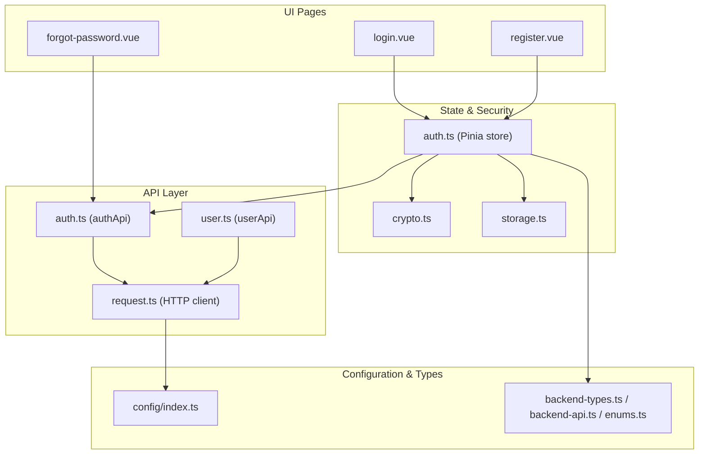
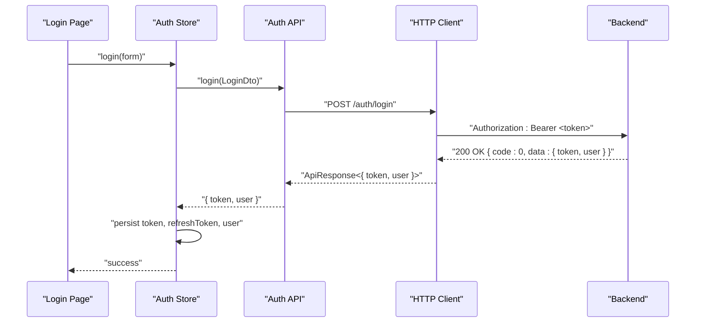
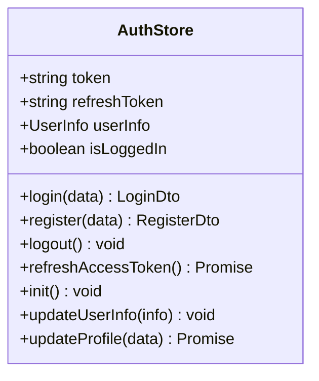
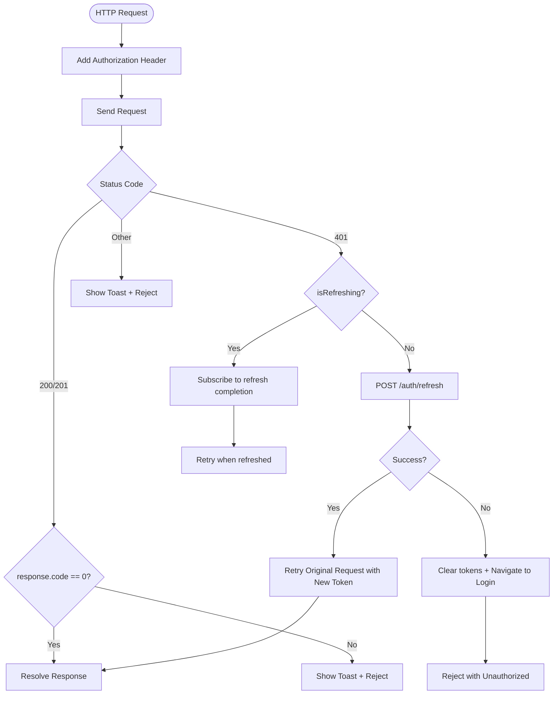
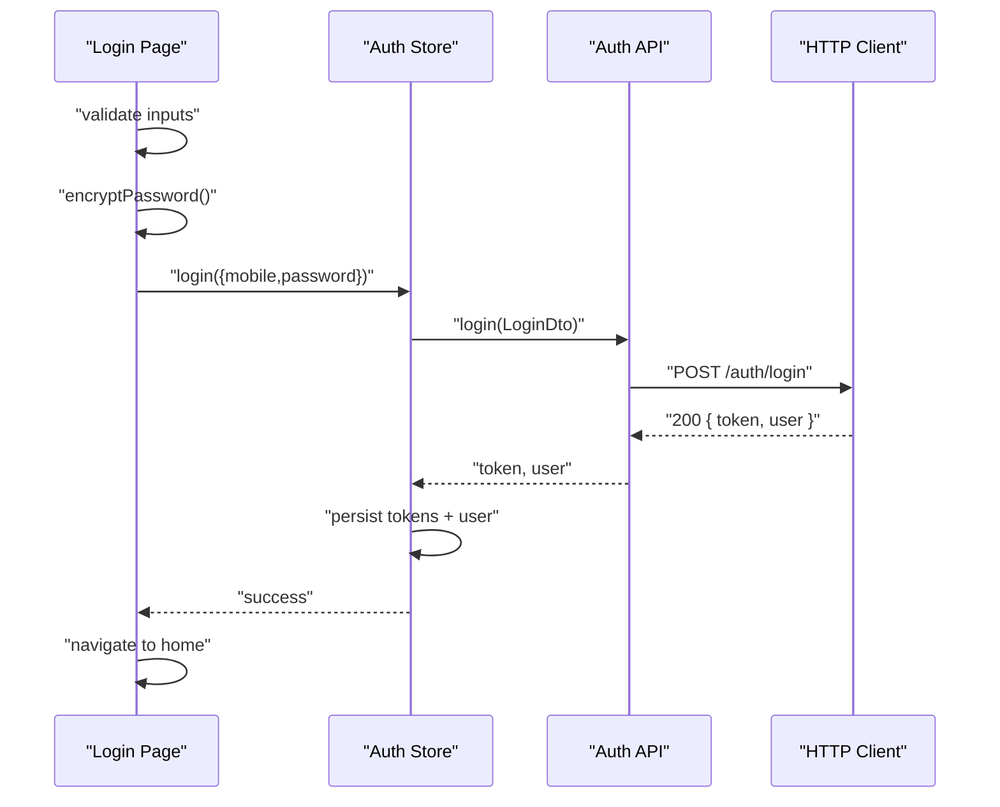
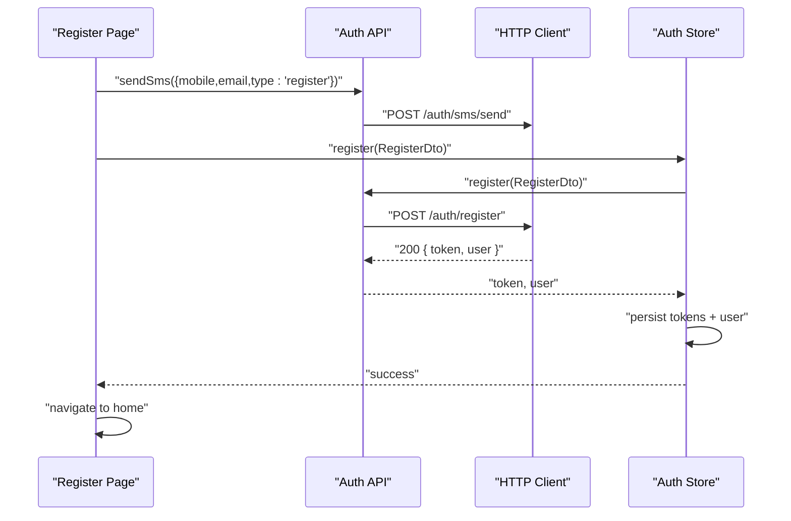
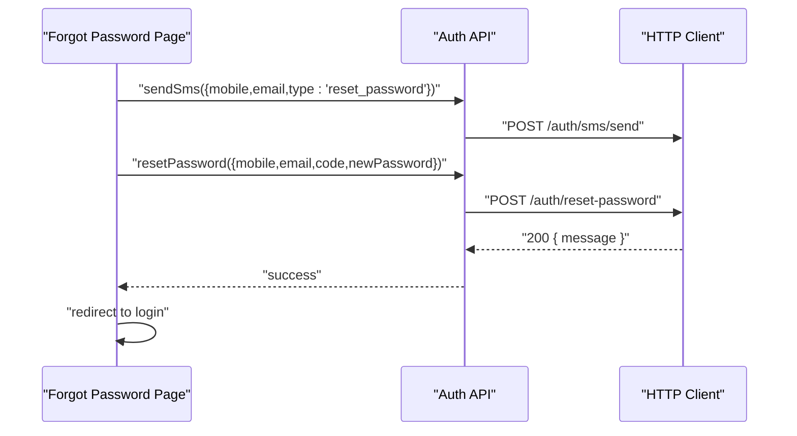
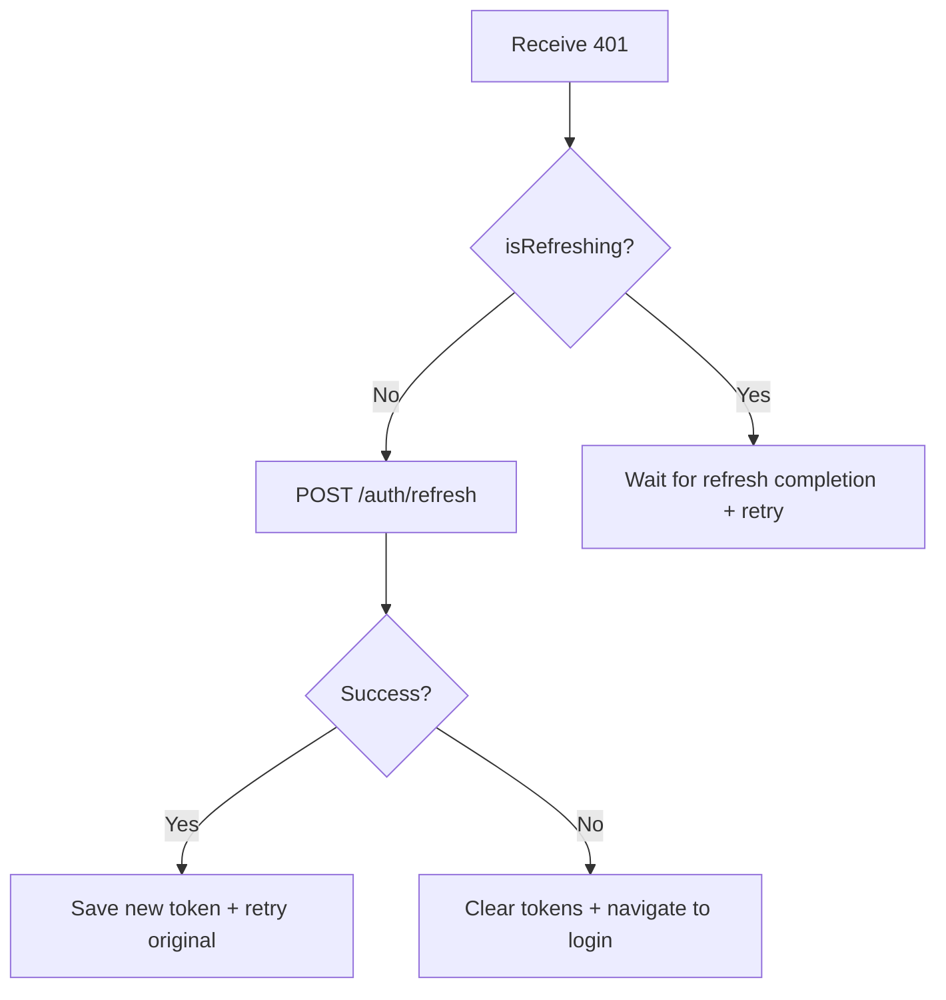
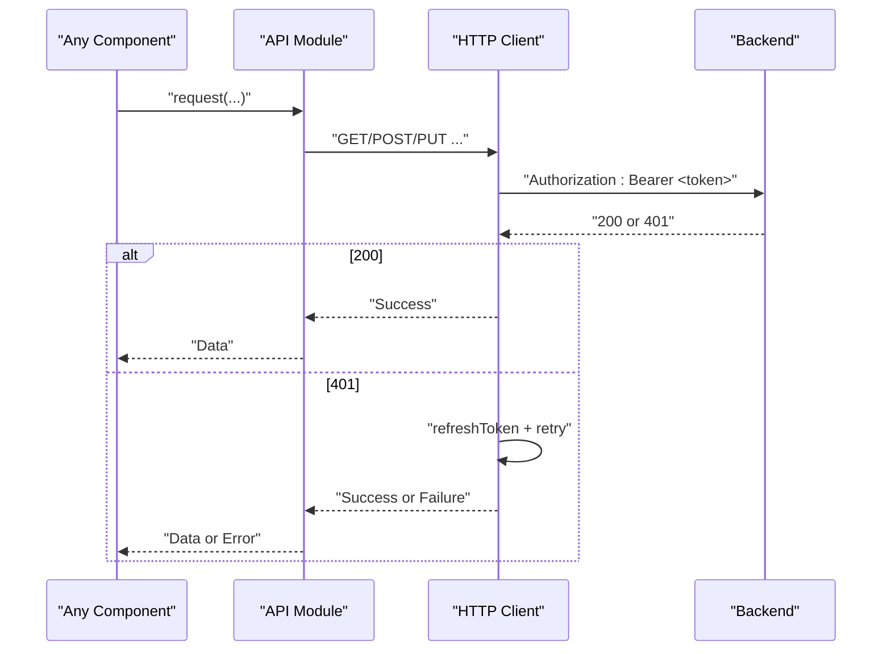
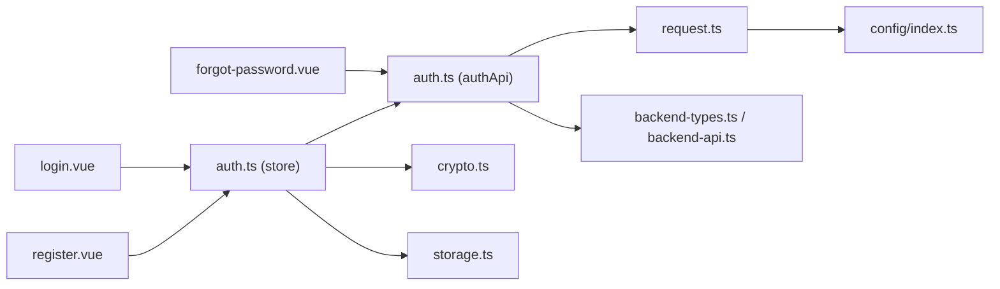

# Authentication System

<cite>
**Referenced Files in This Document**
- [auth.ts](file://src/stores/auth.ts)
- [auth.ts](file://src/api/modules/auth.ts)
- [login.vue](file://src/pages/auth/login.vue)
- [register.vue](file://src/pages/auth/register.vue)
- [forgot-password.vue](file://src/pages/auth/forgot-password.vue)
- [crypto.ts](file://src/utils/crypto.ts)
- [storage.ts](file://src/utils/storage.ts)
- [request.ts](file://src/api/request.ts)
- [index.ts](file://src/config/index.ts)
- [backend-types.ts](file://src/types/api/backend-types.ts)
- [backend-api.ts](file://src/types/api/backend-api.ts)
- [enums.ts](file://src/types/enums.ts)
- [user.ts](file://src/api/modules/user.ts)
- [main.ts](file://src/main.ts)
</cite>

## Table of Contents
1. [Introduction](#introduction)
2. [Project Structure](#project-structure)
3. [Core Components](#core-components)
4. [Architecture Overview](#architecture-overview)
5. [Detailed Component Analysis](#detailed-component-analysis)
6. [Dependency Analysis](#dependency-analysis)
7. [Performance Considerations](#performance-considerations)
8. [Troubleshooting Guide](#troubleshooting-guide)
9. [Conclusion](#conclusion)

## Introduction
This document describes the authentication system for the WeTogether platform. It covers the complete authentication flow including registration, login, password reset, and session management. It explains the JWT token-based authentication mechanism, refresh token handling, API endpoints, request/response schemas, state management for authentication status and protected routes, security considerations, password hashing, and token validation. Implementation examples for login forms, registration components, and authentication guards are included, along with common authentication scenarios and error handling patterns.

## Project Structure
The authentication system spans several layers:
- UI pages for login, registration, and password reset
- API modules for authentication and user operations
- Store for managing authentication state and tokens
- Request wrapper for HTTP communication and automatic token refresh
- Utilities for encryption and storage
- Type definitions for backend DTOs and API contracts



**Diagram sources**
- [login.vue:1-227](file://src/pages/auth/login.vue#L1-L227)
- [register.vue:1-501](file://src/pages/auth/register.vue#L1-L501)
- [forgot-password.vue:1-440](file://src/pages/auth/forgot-password.vue#L1-L440)
- [auth.ts:1-57](file://src/api/modules/auth.ts#L1-L57)
- [user.ts:1-97](file://src/api/modules/user.ts#L1-L97)
- [request.ts:1-228](file://src/api/request.ts#L1-L228)
- [auth.ts:1-137](file://src/stores/auth.ts#L1-L137)
- [crypto.ts:1-18](file://src/utils/crypto.ts#L1-L18)
- [storage.ts:1-26](file://src/utils/storage.ts#L1-L26)
- [index.ts:1-11](file://src/config/index.ts#L1-L11)
- [backend-types.ts:1-764](file://src/types/api/backend-types.ts#L1-L764)
- [backend-api.ts:1-641](file://src/types/api/backend-api.ts#L1-L641)
- [enums.ts:1-41](file://src/types/enums.ts#L1-L41)

**Section sources**
- [login.vue:1-227](file://src/pages/auth/login.vue#L1-L227)
- [register.vue:1-501](file://src/pages/auth/register.vue#L1-L501)
- [forgot-password.vue:1-440](file://src/pages/auth/forgot-password.vue#L1-L440)
- [auth.ts:1-57](file://src/api/modules/auth.ts#L1-L57)
- [user.ts:1-97](file://src/api/modules/user.ts#L1-L97)
- [request.ts:1-228](file://src/api/request.ts#L1-L228)
- [auth.ts:1-137](file://src/stores/auth.ts#L1-L137)
- [crypto.ts:1-18](file://src/utils/crypto.ts#L1-L18)
- [storage.ts:1-26](file://src/utils/storage.ts#L1-L26)
- [index.ts:1-11](file://src/config/index.ts#L1-L11)
- [backend-types.ts:1-764](file://src/types/api/backend-types.ts#L1-L764)
- [backend-api.ts:1-641](file://src/types/api/backend-api.ts#L1-L641)
- [enums.ts:1-41](file://src/types/enums.ts#L1-L41)

## Core Components
- Authentication store (Pinia): Manages token, refresh token, user info, login/logout, token refresh, initialization, and profile updates.
- Authentication API module: Exposes endpoints for SMS, registration, login, password reset, token refresh, and user updates.
- HTTP request wrapper: Adds Authorization headers, handles 401 refresh logic, and retries requests after refreshing tokens.
- Encryption utility: SHA256 hashes passwords before transmission.
- Storage utility: Provides JSON-safe wrappers around uni storage for tokens and user info.
- UI pages: Login form, registration form, and password reset form with validation and submission flows.

Key responsibilities:
- State management: Persisted authentication state via Pinia persisted state plugin.
- Session management: Tokens stored in uni storage; refresh token handling on 401.
- Protected routes: Authorization header injection for all authenticated requests.
- Password security: Frontend SHA256 hashing; backend PBKDF2 hashing is implied by backend types.

**Section sources**
- [auth.ts:1-137](file://src/stores/auth.ts#L1-L137)
- [auth.ts:1-57](file://src/api/modules/auth.ts#L1-L57)
- [request.ts:1-228](file://src/api/request.ts#L1-L228)
- [crypto.ts:1-18](file://src/utils/crypto.ts#L1-L18)
- [storage.ts:1-26](file://src/utils/storage.ts#L1-L26)
- [login.vue:1-227](file://src/pages/auth/login.vue#L1-L227)
- [register.vue:1-501](file://src/pages/auth/register.vue#L1-L501)
- [forgot-password.vue:1-440](file://src/pages/auth/forgot-password.vue#L1-L440)

## Architecture Overview
The authentication architecture integrates UI pages, API modules, state management, and HTTP request handling with automatic token refresh.



**Diagram sources**
- [login.vue:68-103](file://src/pages/auth/login.vue#L68-L103)
- [auth.ts:18-29](file://src/stores/auth.ts#L18-L29)
- [auth.ts:40-41](file://src/api/modules/auth.ts#L40-L41)
- [request.ts:100-148](file://src/api/request.ts#L100-L148)

**Section sources**
- [login.vue:68-103](file://src/pages/auth/login.vue#L68-L103)
- [auth.ts:18-29](file://src/stores/auth.ts#L18-L29)
- [auth.ts:40-41](file://src/api/modules/auth.ts#L40-L41)
- [request.ts:100-148](file://src/api/request.ts#L100-L148)

## Detailed Component Analysis

### Authentication Store (Pinia)
The store manages:
- Reactive state: token, refreshToken, userInfo
- Computed: isLoggedIn
- Actions: login, register, logout, refreshAccessToken, init, updateUserInfo, updateProfile
- Persistence: enabled via Pinia persisted state plugin



**Diagram sources**
- [auth.ts:9-136](file://src/stores/auth.ts#L9-L136)

**Section sources**
- [auth.ts:1-137](file://src/stores/auth.ts#L1-L137)
- [main.ts:1-18](file://src/main.ts#L1-L18)

### Authentication API Module
Exposes typed endpoints:
- POST /auth/sms/send (SMS DTO)
- POST /auth/register (Register DTO)
- POST /auth/login (Login DTO)
- POST /auth/reset-password (ResetPassword DTO)
- POST /auth/refresh (refreshToken body)
- PUT /user/me (Update user info)

```mermaid
classDiagram
class AuthAPI {
+sendSms(SmsDto) ApiResponse~object~
+register(RegisterDto) ApiResponse~{token,user}~
+login(LoginDto) ApiResponse~{token,user}~
+resetPassword(ResetPasswordDto) ApiResponse~{message}~
+refreshToken(refreshToken) ApiResponse~{token, refreshToken}~
+updateUser(data) ApiResponse~User~
}
```

**Diagram sources**
- [auth.ts:33-56](file://src/api/modules/auth.ts#L33-L56)

**Section sources**
- [auth.ts:1-57](file://src/api/modules/auth.ts#L1-L57)
- [backend-api.ts:326-373](file://src/types/api/backend-api.ts#L326-L373)
- [backend-types.ts:374-425](file://src/types/api/backend-types.ts#L374-L425)

### HTTP Request Wrapper
Automatically:
- Inject Authorization: Bearer <token> header
- On 401 Unauthorized:
  - Attempt refresh using refreshToken
  - Retry original request with new token
  - If refresh fails, clear tokens and redirect to login



**Diagram sources**
- [request.ts:15-148](file://src/api/request.ts#L15-L148)

**Section sources**
- [request.ts:1-228](file://src/api/request.ts#L1-L228)
- [index.ts:1-11](file://src/config/index.ts#L1-L11)

### Login Form
- Validates presence of mobile and password
- Encrypts password using SHA256 before sending
- Calls authStore.login and navigates to home on success
- Shows toast messages for errors



**Diagram sources**
- [login.vue:68-103](file://src/pages/auth/login.vue#L68-L103)
- [auth.ts:18-29](file://src/stores/auth.ts#L18-L29)
- [auth.ts:40-41](file://src/api/modules/auth.ts#L40-L41)
- [request.ts:100-148](file://src/api/request.ts#L100-L148)
- [crypto.ts:14-16](file://src/utils/crypto.ts#L14-L16)

**Section sources**
- [login.vue:1-227](file://src/pages/auth/login.vue#L1-L227)
- [crypto.ts:1-18](file://src/utils/crypto.ts#L1-L18)
- [auth.ts:18-29](file://src/stores/auth.ts#L18-L29)
- [auth.ts:28-41](file://src/api/modules/auth.ts#L28-L41)

### Registration Form
- Sends SMS for verification
- Validates email format and required fields
- Encrypts password before registering
- Persists tokens and navigates to home on success



**Diagram sources**
- [register.vue:181-302](file://src/pages/auth/register.vue#L181-L302)
- [auth.ts:34-39](file://src/api/modules/auth.ts#L34-L39)
- [auth.ts:31-42](file://src/stores/auth.ts#L31-L42)

**Section sources**
- [register.vue:1-501](file://src/pages/auth/register.vue#L1-L501)
- [auth.ts:12-41](file://src/api/modules/auth.ts#L12-L41)
- [auth.ts:31-42](file://src/stores/auth.ts#L31-L42)

### Password Reset
- Sends SMS for verification
- Validates mobile/email/format and password length
- Encrypts new password and submits reset request
- Redirects to login on success



**Diagram sources**
- [forgot-password.vue:141-299](file://src/pages/auth/forgot-password.vue#L141-L299)
- [auth.ts:43-44](file://src/api/modules/auth.ts#L43-L44)

**Section sources**
- [forgot-password.vue:1-440](file://src/pages/auth/forgot-password.vue#L1-L440)
- [auth.ts:12-44](file://src/api/modules/auth.ts#L12-L44)

### Token Refresh Mechanism
- On 401 Unauthorized, attempts to refresh token using stored refreshToken
- If successful, retries the original request with the new token
- If refresh fails, clears tokens and redirects to login



**Diagram sources**
- [request.ts:100-148](file://src/api/request.ts#L100-L148)

**Section sources**
- [request.ts:35-73](file://src/api/request.ts#L35-L73)
- [auth.ts:54-71](file://src/stores/auth.ts#L54-L71)

### Protected Route Access
- All authenticated requests include Authorization: Bearer <token>
- Token is read from uni storage and injected automatically
- On 401, automatic refresh and retry occur transparently



**Diagram sources**
- [request.ts:15-148](file://src/api/request.ts#L15-L148)
- [user.ts:28-37](file://src/api/modules/user.ts#L28-L37)

**Section sources**
- [request.ts:15-148](file://src/api/request.ts#L15-L148)
- [user.ts:1-97](file://src/api/modules/user.ts#L1-L97)

## Dependency Analysis
- UI pages depend on the authentication store and crypto utility
- Authentication store depends on auth API module and user API module
- Auth API module depends on the HTTP request wrapper
- HTTP request wrapper depends on configuration and uni storage
- Types define DTOs and API contracts used across modules



**Diagram sources**
- [login.vue:54-58](file://src/pages/auth/login.vue#L54-L58)
- [register.vue:147-153](file://src/pages/auth/register.vue#L147-L153)
- [forgot-password.vue:124-126](file://src/pages/auth/forgot-password.vue#L124-L126)
- [auth.ts:1-7](file://src/stores/auth.ts#L1-L7)
- [auth.ts:1-10](file://src/api/modules/auth.ts#L1-L10)
- [request.ts:1-13](file://src/api/request.ts#L1-L13)
- [crypto.ts:1-18](file://src/utils/crypto.ts#L1-L18)
- [storage.ts:1-26](file://src/utils/storage.ts#L1-L26)
- [index.ts:1-11](file://src/config/index.ts#L1-L11)
- [backend-types.ts:374-425](file://src/types/api/backend-types.ts#L374-L425)
- [backend-api.ts:326-373](file://src/types/api/backend-api.ts#L326-L373)

**Section sources**
- [login.vue:54-58](file://src/pages/auth/login.vue#L54-L58)
- [register.vue:147-153](file://src/pages/auth/register.vue#L147-L153)
- [forgot-password.vue:124-126](file://src/pages/auth/forgot-password.vue#L124-L126)
- [auth.ts:1-7](file://src/stores/auth.ts#L1-L7)
- [auth.ts:1-10](file://src/api/modules/auth.ts#L1-L10)
- [request.ts:1-13](file://src/api/request.ts#L1-L13)
- [crypto.ts:1-18](file://src/utils/crypto.ts#L1-L18)
- [storage.ts:1-26](file://src/utils/storage.ts#L1-L26)
- [index.ts:1-11](file://src/config/index.ts#L1-L11)
- [backend-types.ts:374-425](file://src/types/api/backend-types.ts#L374-L425)
- [backend-api.ts:326-373](file://src/types/api/backend-api.ts#L326-L373)

## Performance Considerations
- Token refresh is debounced using an internal flag to prevent concurrent refreshes.
- Requests queued during refresh are retried once the new token is available.
- Minimizing synchronous storage operations by batching writes on login/register/refresh.
- Using SHA256 for frontend encryption reduces backend load compared to stronger hashing at the edge.

[No sources needed since this section provides general guidance]

## Troubleshooting Guide
Common issues and resolutions:
- Login fails with invalid credentials:
  - Verify mobile/password format and encryption
  - Check backend response message and toast feedback
- 401 Unauthorized during requests:
  - Automatic refresh occurs; if it fails, tokens are cleared and user is redirected to login
- SMS sending failures:
  - Validate mobile/email format and ensure type matches endpoint expectations
- Password reset errors:
  - Confirm code validity, password length, and confirmation match
- Token persistence issues:
  - Ensure Pinia persisted state plugin is initialized in the app

**Section sources**
- [login.vue:94-102](file://src/pages/auth/login.vue#L94-L102)
- [register.vue:226-233](file://src/pages/auth/register.vue#L226-L233)
- [forgot-password.vue:194-201](file://src/pages/auth/forgot-password.vue#L194-L201)
- [request.ts:134-147](file://src/api/request.ts#L134-L147)
- [main.ts:1-18](file://src/main.ts#L1-L18)

## Conclusion
The WeTogether authentication system provides a robust, secure, and user-friendly flow for registration, login, password reset, and session management. It leverages JWT tokens with automatic refresh handling, persistent state management, and frontend encryption for password security. The modular design ensures maintainability and scalability, while the UI pages offer clear validation and feedback. Following the implementation examples and best practices outlined here will help ensure consistent authentication behavior across the platform.