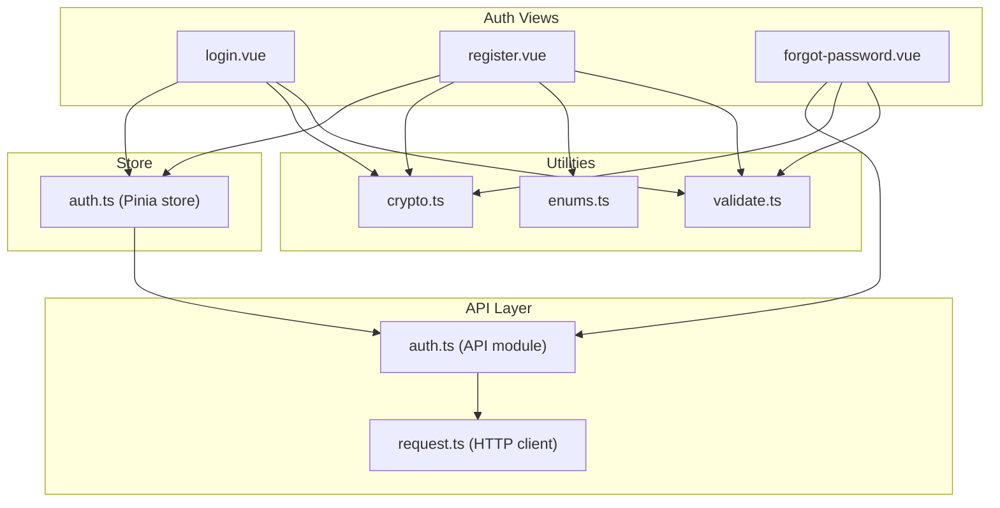
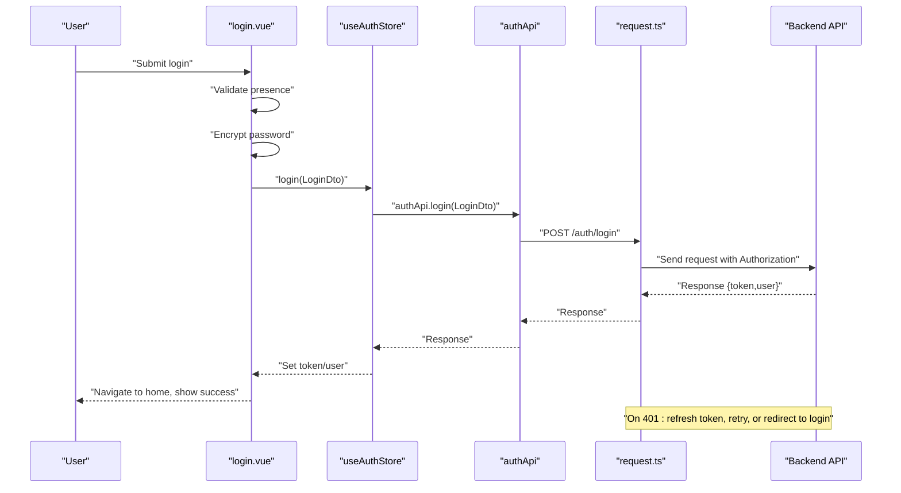
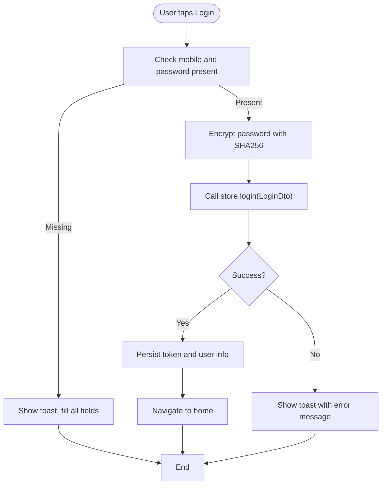
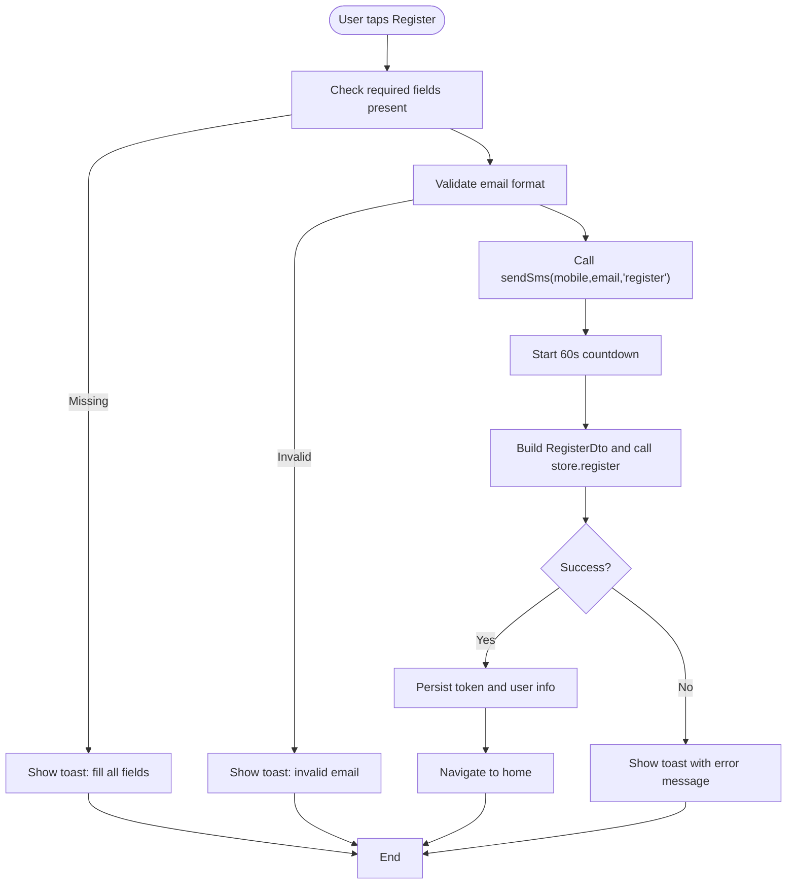
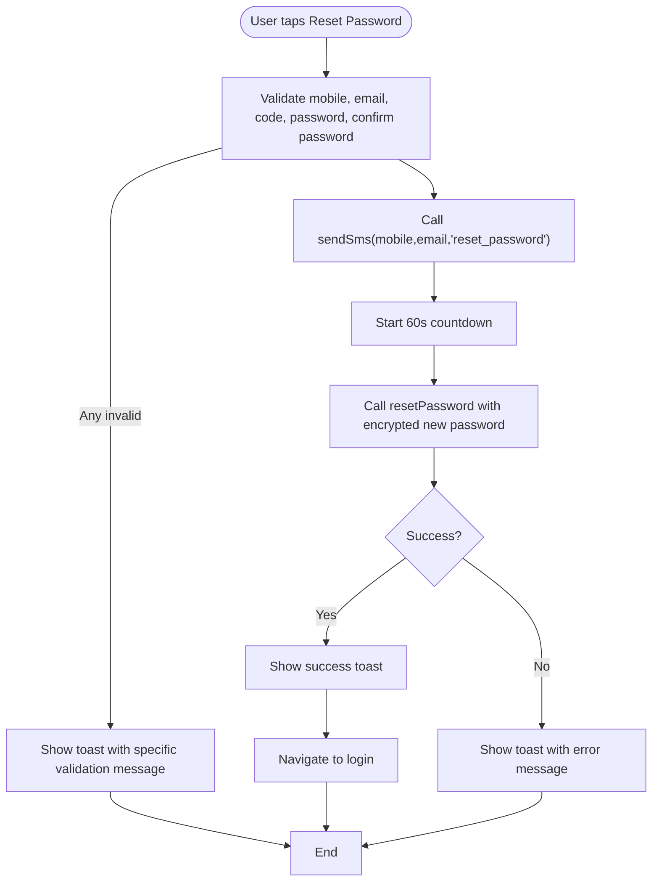
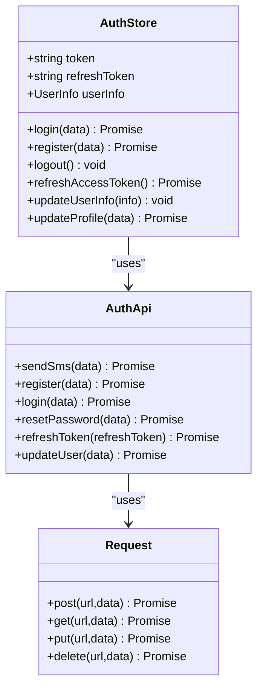
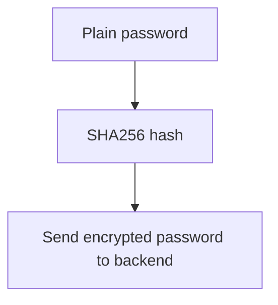
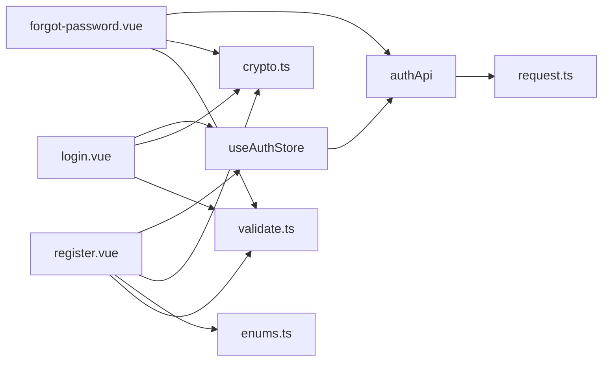

# Login and Registration Forms

<cite>
**Referenced Files in This Document**
- [login.vue](file://src/pages/auth/login.vue)
- [register.vue](file://src/pages/auth/register.vue)
- [forgot-password.vue](file://src/pages/auth/forgot-password.vue)
- [auth.ts](file://src/stores/auth.ts)
- [auth.ts](file://src/api/modules/auth.ts)
- [enums.ts](file://src/types/enums.ts)
- [validate.ts](file://src/utils/validate.ts)
- [crypto.ts](file://src/utils/crypto.ts)
- [request.ts](file://src/api/request.ts)
- [main.ts](file://src/main.ts)
</cite>

## Table of Contents
1. [Introduction](#introduction)
2. [Project Structure](#project-structure)
3. [Core Components](#core-components)
4. [Architecture Overview](#architecture-overview)
5. [Detailed Component Analysis](#detailed-component-analysis)
6. [Dependency Analysis](#dependency-analysis)
7. [Performance Considerations](#performance-considerations)
8. [Troubleshooting Guide](#troubleshooting-guide)
9. [Conclusion](#conclusion)
10. [Appendices](#appendices)

## Introduction
This document explains the login and registration form implementations in the frontend. It covers form validation logic, user input handling, error display mechanisms, and the integration with the authentication API. It documents the registration flow including mobile/email verification, password requirements, and optional profile fields such as nickname and gender selection. It also explains the login form implementation with credential validation and authentication error handling. Finally, it provides guidance on form component composition patterns, reactive validation rules, user feedback mechanisms, accessibility considerations, and responsive design patterns.

## Project Structure
The authentication-related UI and logic are organized as follows:
- Pages: login, register, and forgot-password views under src/pages/auth
- Store: authentication state management under src/stores
- API module: typed authentication endpoints under src/api/modules
- Utilities: cryptography and validation helpers under src/utils
- Global request wrapper: centralized HTTP client under src/api/request.ts
- Application bootstrap: Pinia setup under src/main.ts

**Diagram sources**
- [login.vue:1-227](file://src/pages/auth/login.vue#L1-L227)
- [register.vue:1-501](file://src/pages/auth/register.vue#L1-L501)
- [forgot-password.vue:1-440](file://src/pages/auth/forgot-password.vue#L1-L440)
- [auth.ts:1-137](file://src/stores/auth.ts#L1-L137)
- [auth.ts:1-57](file://src/api/modules/auth.ts#L1-L57)
- [request.ts:1-228](file://src/api/request.ts#L1-L228)
- [crypto.ts:1-18](file://src/utils/crypto.ts#L1-L18)
- [validate.ts:1-15](file://src/utils/validate.ts#L1-L15)
- [enums.ts:1-41](file://src/types/enums.ts#L1-L41)

**Section sources**
- [login.vue:1-227](file://src/pages/auth/login.vue#L1-L227)
- [register.vue:1-501](file://src/pages/auth/register.vue#L1-L501)
- [forgot-password.vue:1-440](file://src/pages/auth/forgot-password.vue#L1-L440)
- [auth.ts:1-137](file://src/stores/auth.ts#L1-L137)
- [auth.ts:1-57](file://src/api/modules/auth.ts#L1-L57)
- [request.ts:1-228](file://src/api/request.ts#L1-L228)
- [crypto.ts:1-18](file://src/utils/crypto.ts#L1-L18)
- [validate.ts:1-15](file://src/utils/validate.ts#L1-L15)
- [enums.ts:1-41](file://src/types/enums.ts#L1-L41)
- [main.ts:1-18](file://src/main.ts#L1-L18)

## Core Components
- Login page: collects mobile and password, validates presence, encrypts password, calls store login, navigates on success, shows toast on errors.
- Registration page: collects mobile, email, code, password, nickname, gender, optional invite code; validates presence and formats; sends SMS code; submits registration; navigates on success; shows toast on errors.
- Forgot password page: collects mobile, email, code, new password, confirm password; validates presence and formats; sends SMS code; resets password; navigates on success; shows toast on errors.
- Authentication store: manages tokens, user info, persistence, and exposes login/register/logout/refresh/update methods.
- API module: typed wrappers for auth endpoints (SMS, register, login, refresh, reset password).
- Cryptography utility: SHA256 encryption for passwords before transmission.
- Validation utilities: mobile, password, code, and nickname validators.
- Request wrapper: centralized HTTP client with token injection, 401 refresh logic, and unified error handling.

**Section sources**
- [login.vue:68-103](file://src/pages/auth/login.vue#L68-L103)
- [register.vue:181-302](file://src/pages/auth/register.vue#L181-L302)
- [forgot-password.vue:141-299](file://src/pages/auth/forgot-password.vue#L141-L299)
- [auth.ts:18-42](file://src/stores/auth.ts#L18-L42)
- [auth.ts:33-56](file://src/api/modules/auth.ts#L33-L56)
- [crypto.ts:8-17](file://src/utils/crypto.ts#L8-L17)
- [validate.ts:1-15](file://src/utils/validate.ts#L1-L15)
- [request.ts:15-228](file://src/api/request.ts#L15-L228)

## Architecture Overview
The forms integrate with the store and API layer as follows:
- Forms bind to reactive data and trigger actions on submit.
- Actions call the store, which invokes the API module.
- The API module uses the request wrapper to perform HTTP requests.
- The request wrapper injects Authorization headers, handles token refresh on 401, and centralizes error feedback.

**Diagram sources**
- [login.vue:68-103](file://src/pages/auth/login.vue#L68-L103)
- [auth.ts:18-29](file://src/stores/auth.ts#L18-L29)
- [auth.ts:40-41](file://src/api/modules/auth.ts#L40-L41)
- [request.ts:75-208](file://src/api/request.ts#L75-L208)

## Detailed Component Analysis

### Login Form Implementation
- Reactive data: mobile, password, loading, showPassword.
- Validation: presence check; displays toast if missing.
- Security: password is SHA256-encrypted before sending.
- Submission: calls store.login with encrypted credentials; on success, persists tokens and user info, shows success toast, navigates to home; on error, shows toast with error message.
- Navigation: links to register and forgot-password.

**Diagram sources**
- [login.vue:68-103](file://src/pages/auth/login.vue#L68-L103)
- [auth.ts:18-29](file://src/stores/auth.ts#L18-L29)
- [crypto.ts:14-16](file://src/utils/crypto.ts#L14-L16)

**Section sources**
- [login.vue:60-103](file://src/pages/auth/login.vue#L60-L103)
- [auth.ts:18-29](file://src/stores/auth.ts#L18-L29)
- [crypto.ts:8-17](file://src/utils/crypto.ts#L8-L17)

### Registration Form Implementation
- Reactive data: mobile, email, code, password, nickname, gender, inviteCode, loading, countdown, showPassword.
- Presence validation: checks all required fields; shows toast if missing.
- Email validation: regex-based format check.
- SMS code: triggers sendSms with mobile and email; sets countdown timer; disables button while counting down.
- Password submission: encrypts password, builds RegisterDto, calls store.register; on success, persists tokens and user info, shows success toast, navigates to home; on error, shows toast with error message.
- Optional fields: nickname and gender selection; inviteCode is passed when present.

**Diagram sources**
- [register.vue:181-302](file://src/pages/auth/register.vue#L181-L302)
- [auth.ts:31-42](file://src/stores/auth.ts#L31-L42)
- [auth.ts:34-39](file://src/api/modules/auth.ts#L34-L39)
- [enums.ts:1-5](file://src/types/enums.ts#L1-L5)

**Section sources**
- [register.vue:155-302](file://src/pages/auth/register.vue#L155-L302)
- [auth.ts:31-42](file://src/stores/auth.ts#L31-L42)
- [auth.ts:18-26](file://src/api/modules/auth.ts#L18-L26)
- [enums.ts:1-5](file://src/types/enums.ts#L1-L5)

### Forgot Password Form Implementation
- Reactive data: mobile, email, code, password, confirmPassword, loading, countdown, showPassword, showConfirmPassword.
- Presence and format validations: mobile regex, email regex, code presence, password length, and password confirmation match.
- SMS code: triggers sendSms with type reset_password; sets countdown timer; disables button while counting down.
- Password reset: encrypts new password, calls resetPassword endpoint; on success, shows success toast and navigates to login; on error, shows toast with error message.

**Diagram sources**
- [forgot-password.vue:141-299](file://src/pages/auth/forgot-password.vue#L141-L299)
- [auth.ts:43-49](file://src/api/modules/auth.ts#L43-L49)
- [crypto.ts:14-16](file://src/utils/crypto.ts#L14-L16)

**Section sources**
- [forgot-password.vue:128-299](file://src/pages/auth/forgot-password.vue#L128-L299)
- [auth.ts:43-49](file://src/api/modules/auth.ts#L43-L49)
- [crypto.ts:8-17](file://src/utils/crypto.ts#L8-L17)

### Authentication Store and API Integration
- Store methods:
  - login: calls authApi.login, updates token and user info, persists to storage, returns data.
  - register: calls authApi.register, updates token and user info, persists to storage, returns data.
  - logout: clears tokens and user info from storage.
  - refreshAccessToken: calls authApi.refreshToken, updates token and optional refreshToken, persists to storage.
  - updateUserInfo and updateProfile: update local state and emit avatar update events.
- API module:
  - Provides typed wrappers for auth endpoints: sendSms, register, login, resetPassword, refreshToken, updateUser.
- Request wrapper:
  - Injects Authorization header when token exists.
  - Handles 401 by refreshing token, queuing subscribers, retrying original request, or redirecting to login.

**Diagram sources**
- [auth.ts:1-137](file://src/stores/auth.ts#L1-L137)
- [auth.ts:1-57](file://src/api/modules/auth.ts#L1-L57)
- [request.ts:1-228](file://src/api/request.ts#L1-L228)

**Section sources**
- [auth.ts:18-117](file://src/stores/auth.ts#L18-L117)
- [auth.ts:33-56](file://src/api/modules/auth.ts#L33-L56)
- [request.ts:15-228](file://src/api/request.ts#L15-L228)

### Password Encryption and Validation Utilities
- Password encryption: SHA256 hashing performed before sending credentials to the backend.
- Validation helpers:
  - Mobile: Chinese mobile number regex.
  - Password: length between 6 and 20 characters.
  - Code: exactly 6 digits.
  - Nickname: length between 2 and 20 characters.

**Diagram sources**
- [crypto.ts:8-17](file://src/utils/crypto.ts#L8-L17)

**Section sources**
- [crypto.ts:8-17](file://src/utils/crypto.ts#L8-L17)
- [validate.ts:1-15](file://src/utils/validate.ts#L1-L15)

## Dependency Analysis
- Forms depend on:
  - Store for authentication actions.
  - API module for network calls.
  - Utilities for encryption and validation.
- Store depends on:
  - API module for backend communication.
  - Request wrapper for HTTP transport.
- API module depends on:
  - Request wrapper for HTTP calls.
- Request wrapper depends on:
  - Storage for token and refresh token.
  - Environment configuration for base URL and timeout.

**Diagram sources**
- [login.vue:54-58](file://src/pages/auth/login.vue#L54-L58)
- [register.vue:147-151](file://src/pages/auth/register.vue#L147-L151)
- [forgot-password.vue:124-126](file://src/pages/auth/forgot-password.vue#L124-L126)
- [auth.ts:1-137](file://src/stores/auth.ts#L1-L137)
- [auth.ts:1-57](file://src/api/modules/auth.ts#L1-L57)
- [request.ts:1-228](file://src/api/request.ts#L1-L228)
- [crypto.ts:1-18](file://src/utils/crypto.ts#L1-L18)
- [validate.ts:1-15](file://src/utils/validate.ts#L1-L15)
- [enums.ts:1-41](file://src/types/enums.ts#L1-L41)

**Section sources**
- [login.vue:54-58](file://src/pages/auth/login.vue#L54-L58)
- [register.vue:147-151](file://src/pages/auth/register.vue#L147-L151)
- [forgot-password.vue:124-126](file://src/pages/auth/forgot-password.vue#L124-L126)
- [auth.ts:1-137](file://src/stores/auth.ts#L1-L137)
- [auth.ts:1-57](file://src/api/modules/auth.ts#L1-L57)
- [request.ts:1-228](file://src/api/request.ts#L1-L228)
- [crypto.ts:1-18](file://src/utils/crypto.ts#L1-L18)
- [validate.ts:1-15](file://src/utils/validate.ts#L1-L15)
- [enums.ts:1-41](file://src/types/enums.ts#L1-L41)

## Performance Considerations
- Debounce user input for SMS code requests to avoid excessive API calls.
- Use throttled or debounced validation to reduce unnecessary re-renders during typing.
- Persist tokens and user info to minimize repeated login attempts.
- Cache frequently accessed UI state (e.g., gender selection) to improve responsiveness.
- Minimize DOM updates by batching reactive updates and avoiding deep watchers.

## Troubleshooting Guide
Common issues and resolutions:
- Missing required fields:
  - Login: ensure mobile and password are filled; show toast prompting to fill all fields.
  - Registration: ensure mobile, email, code, password, and nickname are filled; show toast prompting to fill all fields.
  - Forgot password: ensure mobile, email, code, password, and confirm password are filled; show toast prompting to fill all fields.
- Invalid email format:
  - Registration and forgot password validate email format; show toast with invalid email message.
- Invalid mobile number:
  - Forgot password validates mobile format; show toast with invalid mobile message.
- Password requirements:
  - Registration requires password length between 6 and 20; forgot password enforces the same.
  - Confirm password must match new password in forgot password.
- SMS code issues:
  - Verify countdown logic and button enable/disable state; ensure sendSms is called with correct type.
- Authentication errors:
  - On 401, the request wrapper refreshes token; if refresh fails, clears storage and redirects to login.
  - Show user-friendly messages for network failures and backend errors.

**Section sources**
- [login.vue:68-103](file://src/pages/auth/login.vue#L68-L103)
- [register.vue:181-302](file://src/pages/auth/register.vue#L181-L302)
- [forgot-password.vue:141-299](file://src/pages/auth/forgot-password.vue#L141-L299)
- [request.ts:100-147](file://src/api/request.ts#L100-L147)

## Conclusion
The login and registration forms implement robust validation, secure password handling, and seamless integration with the authentication store and API layer. They provide clear user feedback via toasts and navigation, support mobile/email verification, enforce password requirements, and offer optional profile fields. The request wrapper centralizes HTTP concerns, including token management and error handling, ensuring a consistent and resilient user experience.

## Appendices

### Accessibility Considerations
- Focus management: ensure inputs receive focus on page load and after validation errors.
- Keyboard navigation: allow tabbing between fields and submitting via Enter.
- Screen reader support: use semantic labels and aria attributes for inputs and buttons.
- Color contrast: maintain sufficient contrast for text and interactive elements.
- Touch targets: ensure buttons and inputs are appropriately sized for touch interaction.

### Responsive Design Patterns
- Flexible layouts: use percentage widths and flexible units for form containers.
- Adaptive spacing: adjust margins and paddings for smaller screens.
- Typography scaling: scale font sizes for readability across devices.
- Input sizing: ensure inputs are large enough for thumb interaction on mobile.

### Integration Examples
- Login integration:
  - Bind v-model to mobile and password.
  - Call store.login with encrypted credentials.
  - Handle success by navigating to home and storing tokens.
  - Handle errors by displaying a toast with the error message.
- Registration integration:
  - Bind v-model to all required fields.
  - Validate presence and format before calling sendSms and register.
  - Handle success by navigating to home and storing tokens.
  - Handle errors by displaying a toast with the error message.
- Forgot password integration:
  - Bind v-model to mobile, email, code, password, and confirm password.
  - Validate presence and format before calling sendSms and resetPassword.
  - Handle success by navigating to login and displaying a success toast.
  - Handle errors by displaying a toast with the error message.