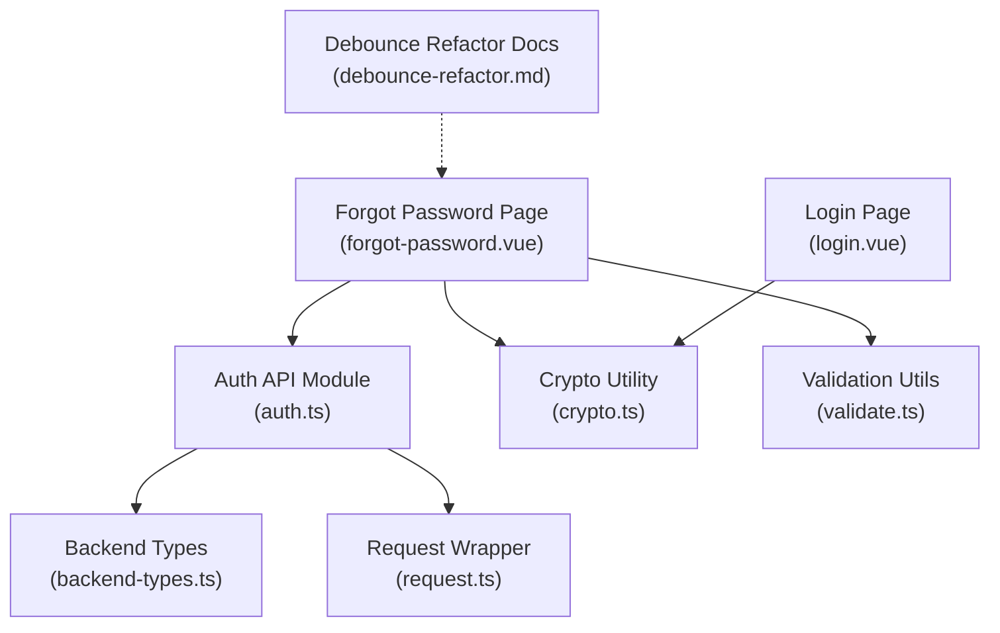
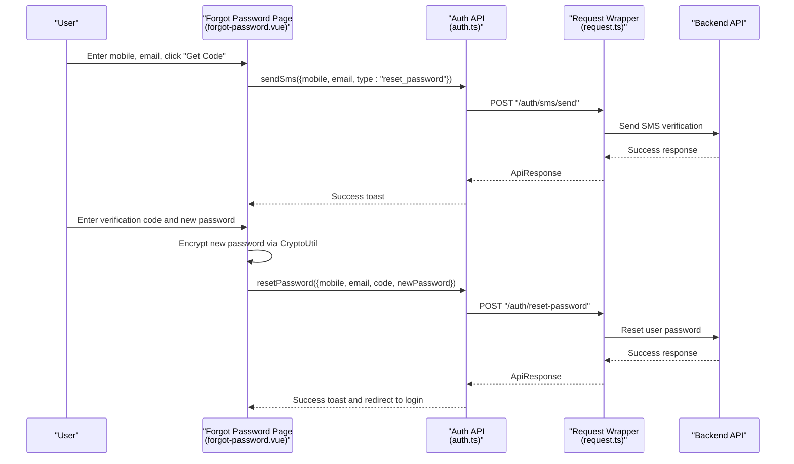
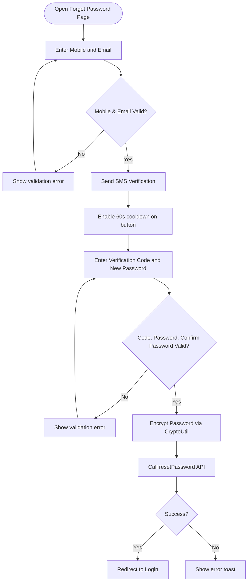
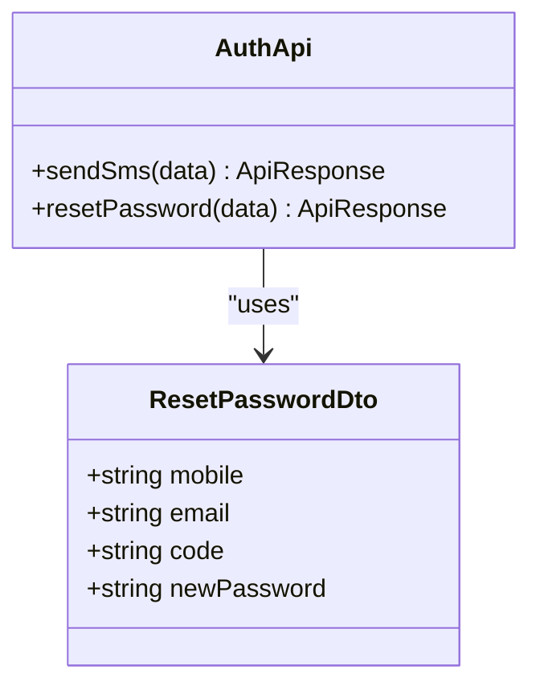
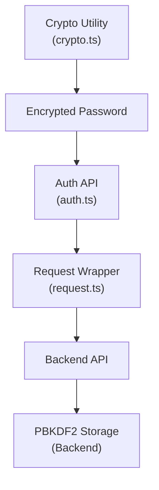
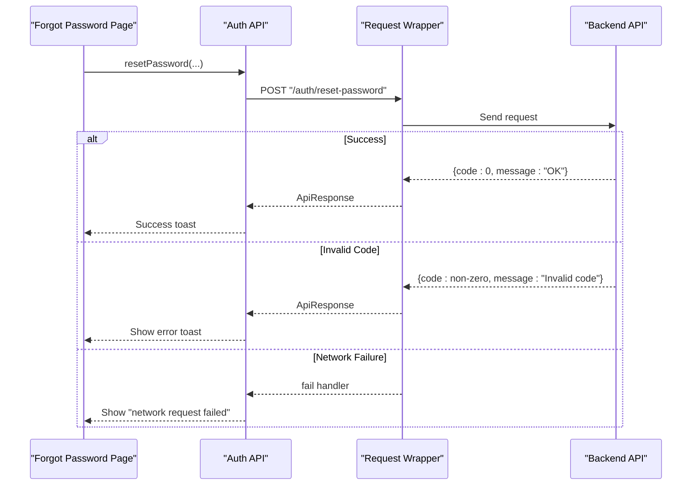
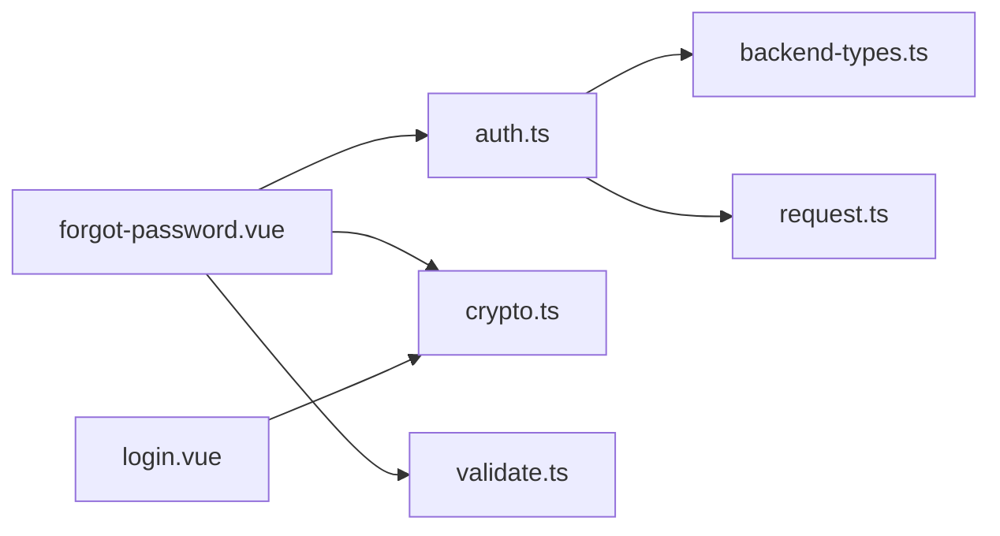

# Password Reset System

<cite>
**Referenced Files in This Document**
- [forgot-password.vue](file://src/pages/auth/forgot-password.vue)
- [auth.ts](file://src/api/modules/auth.ts)
- [backend-types.ts](file://src/types/api/backend-types.ts)
- [crypto.ts](file://src/utils/crypto.ts)
- [request.ts](file://src/api/request.ts)
- [login.vue](file://src/pages/auth/login.vue)
- [validate.ts](file://src/utils/validate.ts)
- [debounce-refactor.md](file://docs/debounce-refactor.md)
- [test-frontend-auth.sh](file://test-frontend-auth.sh)
</cite>

## Table of Contents
1. [Introduction](#introduction)
2. [Project Structure](#project-structure)
3. [Core Components](#core-components)
4. [Architecture Overview](#architecture-overview)
5. [Detailed Component Analysis](#detailed-component-analysis)
6. [Dependency Analysis](#dependency-analysis)
7. [Security Measures](#security-measures)
8. [Performance Considerations](#performance-considerations)
9. [Troubleshooting Guide](#troubleshooting-guide)
10. [Conclusion](#conclusion)

## Introduction
This document provides comprehensive documentation for the password reset functionality in the application. It explains the two-step password reset process: SMS/email verification code entry followed by new password setting. It covers the forgot-password page implementation, form validation, verification flow, backend integration for sending reset codes and updating user passwords, security measures such as code expiration, rate limiting, and secure password hashing, and practical examples of error handling for invalid codes, expired tokens, and network failures. It also addresses user experience considerations and security best practices for password reset workflows.

## Project Structure
The password reset feature spans several frontend components and utilities:
- Forgot-password page: collects user credentials, handles verification code sending and password reset submission
- Authentication API module: defines endpoints and DTOs for password reset
- Backend types: defines request/response structures for password reset
- Cryptographic utilities: encrypts passwords before transmission
- Request wrapper: manages authentication headers and token refresh
- Validation utilities: supports mobile and password validation
- Login page: demonstrates password encryption flow for comparison

**Diagram sources**
- [forgot-password.vue:123-304](file://src/pages/auth/forgot-password.vue#L123-L304)
- [auth.ts:33-44](file://src/api/modules/auth.ts#L33-L44)
- [backend-types.ts:414-425](file://src/types/api/backend-types.ts#L414-L425)
- [crypto.ts:8-16](file://src/utils/crypto.ts#L8-L16)
- [request.ts:4-24](file://src/api/request.ts#L4-L24)
- [validate.ts:1-15](file://src/utils/validate.ts#L1-L15)
- [login.vue:53-115](file://src/pages/auth/login.vue#L53-L115)
- [debounce-refactor.md:1-551](file://docs/debounce-refactor.md#L1-L551)

**Section sources**
- [forgot-password.vue:1-440](file://src/pages/auth/forgot-password.vue#L1-L440)
- [auth.ts:1-57](file://src/api/modules/auth.ts#L1-L57)
- [backend-types.ts:414-425](file://src/types/api/backend-types.ts#L414-L425)
- [crypto.ts:1-18](file://src/utils/crypto.ts#L1-L18)
- [request.ts:1-228](file://src/api/request.ts#L1-L228)
- [validate.ts:1-15](file://src/utils/validate.ts#L1-L15)
- [login.vue:1-227](file://src/pages/auth/login.vue#L1-L227)
- [debounce-refactor.md:1-551](file://docs/debounce-refactor.md#L1-L551)

## Core Components
- Forgot Password Page: Implements the two-step password reset flow with form validation, verification code sending, and password reset submission.
- Auth API Module: Exposes endpoints for sending SMS verification and resetting passwords, with strongly typed DTOs.
- Backend Types: Defines the ResetPasswordDto structure used by the reset endpoint.
- Crypto Utility: Provides SHA256-based password encryption before transmission.
- Request Wrapper: Manages Authorization headers and automatic token refresh for protected endpoints.
- Validation Utilities: Offers reusable validation helpers for mobile numbers and passwords.
- Login Page: Demonstrates the same encryption pattern used during password reset.

**Section sources**
- [forgot-password.vue:123-304](file://src/pages/auth/forgot-password.vue#L123-L304)
- [auth.ts:33-44](file://src/api/modules/auth.ts#L33-L44)
- [backend-types.ts:414-425](file://src/types/api/backend-types.ts#L414-L425)
- [crypto.ts:8-16](file://src/utils/crypto.ts#L8-L16)
- [request.ts:15-24](file://src/api/request.ts#L15-L24)
- [validate.ts:1-15](file://src/utils/validate.ts#L1-L15)
- [login.vue:53-115](file://src/pages/auth/login.vue#L53-L115)

## Architecture Overview
The password reset workflow integrates frontend UI, API abstraction, cryptographic preprocessing, and backend endpoints. The flow ensures secure transmission of credentials and robust error handling.

**Diagram sources**
- [forgot-password.vue:141-201](file://src/pages/auth/forgot-password.vue#L141-L201)
- [forgot-password.vue:203-299](file://src/pages/auth/forgot-password.vue#L203-L299)
- [auth.ts:33-44](file://src/api/modules/auth.ts#L33-L44)
- [request.ts:75-208](file://src/api/request.ts#L75-L208)
- [backend-types.ts:414-425](file://src/types/api/backend-types.ts#L414-L425)
- [crypto.ts:14-16](file://src/utils/crypto.ts#L14-L16)

## Detailed Component Analysis

### Forgot Password Page Implementation
The forgot-password page implements a two-step reset process:
- Step 1: Verification Code Entry
  - Validates mobile number format and email format
  - Sends SMS verification via the auth API
  - Enables a 60-second cooldown on the "Get Code" button
- Step 2: New Password Setting
  - Validates mobile and email again
  - Requires verification code presence
  - Enforces password length and confirmation match
  - Encrypts the new password using CryptoUtil before submission
  - Submits resetPassword to the backend and redirects to login upon success

**Diagram sources**
- [forgot-password.vue:141-201](file://src/pages/auth/forgot-password.vue#L141-L201)
- [forgot-password.vue:203-299](file://src/pages/auth/forgot-password.vue#L203-L299)
- [crypto.ts:14-16](file://src/utils/crypto.ts#L14-L16)

**Section sources**
- [forgot-password.vue:123-304](file://src/pages/auth/forgot-password.vue#L123-L304)
- [validate.ts:1-15](file://src/utils/validate.ts#L1-L15)

### Backend Integration for Reset Codes and Password Updates
The auth API module exposes:
- sendSms: Sends verification codes for reset_password type
- resetPassword: Resets user password using encrypted new password

The backend types define ResetPasswordDto with fields for mobile, email, code, and newPassword.

**Diagram sources**
- [auth.ts:33-44](file://src/api/modules/auth.ts#L33-L44)
- [backend-types.ts:414-425](file://src/types/api/backend-types.ts#L414-L425)

**Section sources**
- [auth.ts:33-44](file://src/api/modules/auth.ts#L33-L44)
- [backend-types.ts:414-425](file://src/types/api/backend-types.ts#L414-L425)

### Security Measures
- Password Encryption: Frontend encrypts passwords using SHA256 before transmission; backend applies PBKDF2 for secure storage.
- Token Management: The request wrapper automatically handles token refresh and attaches Authorization headers for protected endpoints.
- Input Validation: Mobile number and password length validation occur on the client side before submission.
- Rate Limiting: The frontend enforces a 60-second cooldown on the "Get Code" button to prevent spam requests.

**Diagram sources**
- [crypto.ts:8-16](file://src/utils/crypto.ts#L8-L16)
- [auth.ts:33-44](file://src/api/modules/auth.ts#L33-L44)
- [request.ts:15-24](file://src/api/request.ts#L15-L24)

**Section sources**
- [crypto.ts:8-16](file://src/utils/crypto.ts#L8-L16)
- [request.ts:35-73](file://src/api/request.ts#L35-L73)
- [test-frontend-auth.sh:1-141](file://test-frontend-auth.sh#L1-L141)

### Error Handling Examples
Common error scenarios and their handling:
- Invalid Code: The backend validates the verification code; errors are surfaced via toasts.
- Expired Token: The request wrapper detects 401 responses, refreshes tokens, and retries requests transparently.
- Network Failures: The request wrapper catches network errors and displays user-friendly messages.

**Diagram sources**
- [forgot-password.vue:270-299](file://src/pages/auth/forgot-password.vue#L270-L299)
- [request.ts:183-189](file://src/api/request.ts#L183-L189)

**Section sources**
- [forgot-password.vue:270-299](file://src/pages/auth/forgot-password.vue#L270-L299)
- [request.ts:100-147](file://src/api/request.ts#L100-L147)

### User Experience Considerations
- Clear Form Labels and Placeholders: The page provides explicit labels and placeholders for mobile, email, verification code, and password fields.
- Visual Feedback: Toast notifications inform users of success and error states.
- Password Visibility Toggle: Eye icons allow users to reveal or hide passwords for both new and confirm password fields.
- Navigation: Users can easily navigate back to the login page after successful reset.

**Section sources**
- [forgot-password.vue:306-438](file://src/pages/auth/forgot-password.vue#L306-L438)
- [login.vue:105-115](file://src/pages/auth/login.vue#L105-L115)

## Dependency Analysis
The password reset feature relies on the following dependencies:
- forgot-password.vue depends on auth.ts for API calls and crypto.ts for password encryption
- auth.ts depends on backend-types.ts for DTO definitions
- request.ts provides centralized request handling and token refresh
- validate.ts offers reusable validation utilities

**Diagram sources**
- [forgot-password.vue:123-126](file://src/pages/auth/forgot-password.vue#L123-L126)
- [auth.ts:1-10](file://src/api/modules/auth.ts#L1-L10)
- [backend-types.ts:1-10](file://src/types/api/backend-types.ts#L1-L10)
- [request.ts:1-24](file://src/api/request.ts#L1-L24)
- [validate.ts:1-15](file://src/utils/validate.ts#L1-L15)
- [login.vue:54-56](file://src/pages/auth/login.vue#L54-L56)

**Section sources**
- [forgot-password.vue:123-126](file://src/pages/auth/forgot-password.vue#L123-L126)
- [auth.ts:1-10](file://src/api/modules/auth.ts#L1-L10)
- [backend-types.ts:1-10](file://src/types/api/backend-types.ts#L1-L10)
- [request.ts:1-24](file://src/api/request.ts#L1-L24)
- [validate.ts:1-15](file://src/utils/validate.ts#L1-L15)
- [login.vue:54-56](file://src/pages/auth/login.vue#L54-L56)

## Security Measures
- Secure Password Transmission: Passwords are hashed with SHA256 on the frontend before being sent to the backend.
- Backend Hashing: The backend applies PBKDF2 to securely store passwords.
- Token Refresh: Automatic token refresh prevents session expiration during long operations.
- Input Validation: Client-side validation reduces server load and improves UX.
- Rate Limiting: Frontend cooldown prevents excessive SMS requests.

**Section sources**
- [crypto.ts:8-16](file://src/utils/crypto.ts#L8-L16)
- [request.ts:35-73](file://src/api/request.ts#L35-L73)
- [forgot-password.vue:187-193](file://src/pages/auth/forgot-password.vue#L187-L193)

## Performance Considerations
- Minimize Redundant Requests: The frontend sets a 60-second cooldown on the "Get Code" button to avoid unnecessary API calls.
- Efficient Validation: Reusable validation utilities reduce repeated checks and improve responsiveness.
- Centralized Request Handling: The request wrapper consolidates error handling and token management, reducing overhead.

**Section sources**
- [forgot-password.vue:187-193](file://src/pages/auth/forgot-password.vue#L187-L193)
- [validate.ts:1-15](file://src/utils/validate.ts#L1-L15)
- [request.ts:75-208](file://src/api/request.ts#L75-L208)

## Troubleshooting Guide
Common issues and resolutions:
- Invalid Verification Code: Ensure the code matches the one sent to the provided email. The backend validates the code and returns an error if invalid.
- Expired Token: The request wrapper automatically refreshes tokens on 401 responses. If refresh fails, users are prompted to log in again.
- Network Failures: Verify network connectivity and retry the operation. The request wrapper displays a generic network failure message.
- Password Length Issues: Ensure the new password meets the minimum length requirement and matches the confirmation field.

**Section sources**
- [forgot-password.vue:238-268](file://src/pages/auth/forgot-password.vue#L238-L268)
- [request.ts:100-147](file://src/api/request.ts#L100-L147)
- [test-frontend-auth.sh:83-111](file://test-frontend-auth.sh#L83-L111)

## Conclusion
The password reset system combines a user-friendly frontend interface with secure backend integration. It leverages client-side validation, encrypted password transmission, and robust error handling to deliver a reliable and secure experience. By implementing rate limiting, token refresh, and clear user feedback, the system balances usability with strong security practices.