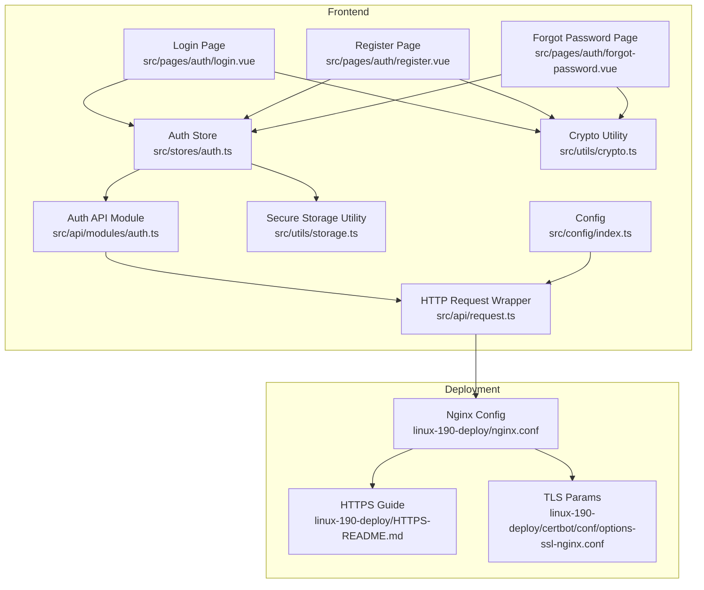
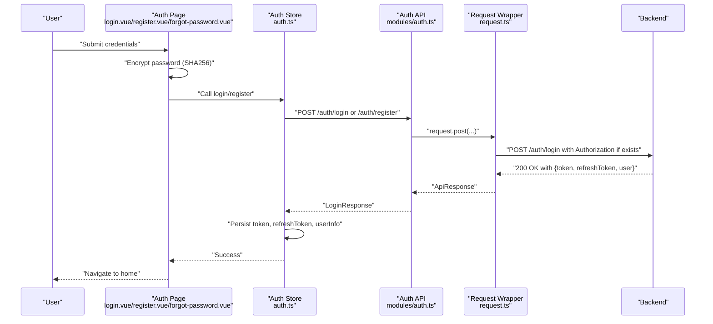
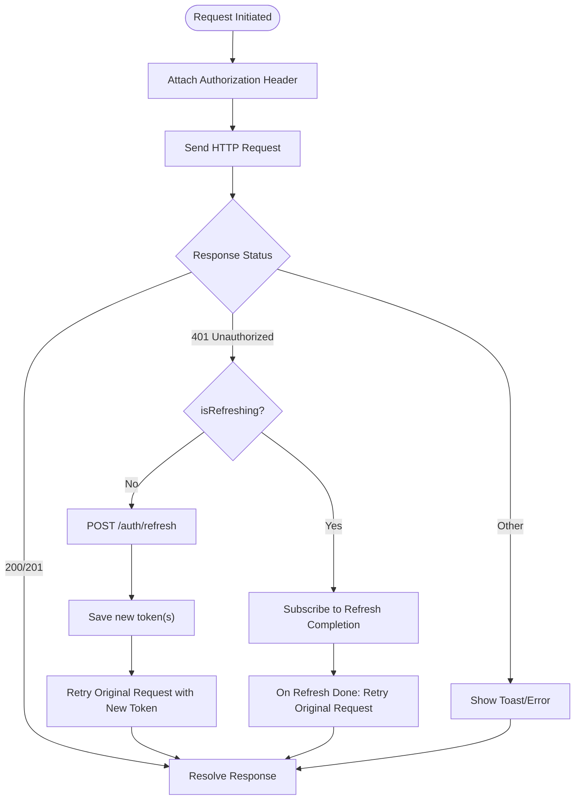
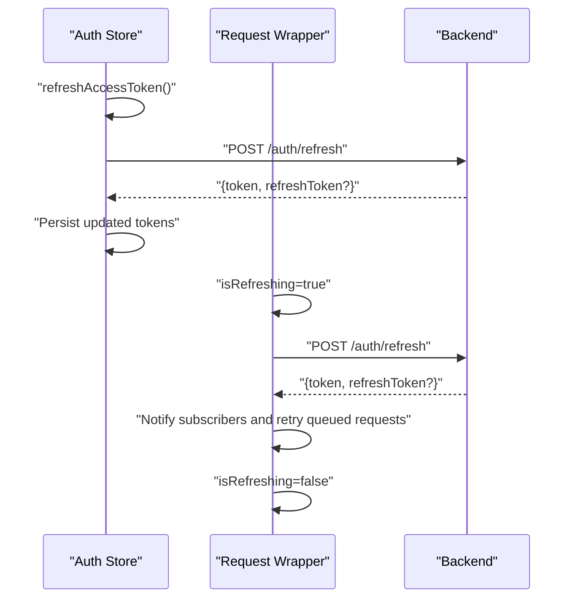
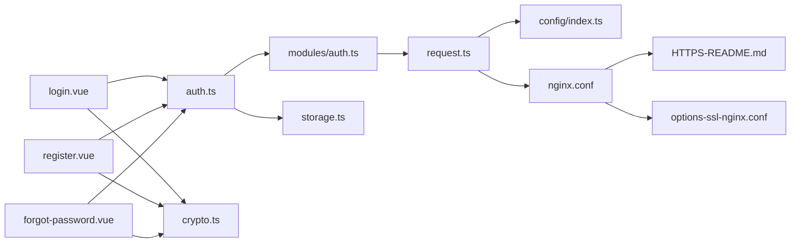

# Security and Token Management

<cite>
**Referenced Files in This Document**
- [src/stores/auth.ts](file://src/stores/auth.ts)
- [src/api/modules/auth.ts](file://src/api/modules/auth.ts)
- [src/api/request.ts](file://src/api/request.ts)
- [src/utils/crypto.ts](file://src/utils/crypto.ts)
- [src/utils/storage.ts](file://src/utils/storage.ts)
- [src/pages/auth/login.vue](file://src/pages/auth/login.vue)
- [src/pages/auth/register.vue](file://src/pages/auth/register.vue)
- [src/pages/auth/forgot-password.vue](file://src/pages/auth/forgot-password.vue)
- [src/types/api/backend-types.ts](file://src/types/api/backend-types.ts)
- [src/config/index.ts](file://src/config/index.ts)
- [linux-190-deploy/nginx.conf](file://linux-190-deploy/nginx.conf)
- [linux-190-deploy/HTTPS-README.md](file://linux-190-deploy/HTTPS-README.md)
- [linux-190-deploy/certbot/conf/options-ssl-nginx.conf](file://linux-190-deploy/certbot/conf/options-ssl-nginx.conf)
- [package.json](file://package.json)
</cite>

## Table of Contents
1. [Introduction](#introduction)
2. [Project Structure](#project-structure)
3. [Core Components](#core-components)
4. [Architecture Overview](#architecture-overview)
5. [Detailed Component Analysis](#detailed-component-analysis)
6. [Dependency Analysis](#dependency-analysis)
7. [Performance Considerations](#performance-considerations)
8. [Troubleshooting Guide](#troubleshooting-guide)
9. [Conclusion](#conclusion)
10. [Appendices](#appendices)

## Introduction
This document provides comprehensive security documentation for the authentication system. It covers JWT token structure, secure storage mechanisms, token refresh strategies, password hashing and credential handling, XSS and CSRF protections, secure HTTP headers, CORS configuration, session management best practices, token expiration handling, automatic logout, and security considerations for mobile environments. It also outlines secure development practices and common vulnerability mitigations.

## Project Structure
The authentication system spans the frontend store, API modules, request interceptor, cryptography utilities, and deployment-level HTTPS/CORS/security headers. The backend contract types define DTOs and response envelopes used by the frontend.

**Diagram sources**
- [src/stores/auth.ts:1-137](file://src/stores/auth.ts#L1-L137)
- [src/api/modules/auth.ts:1-57](file://src/api/modules/auth.ts#L1-L57)
- [src/api/request.ts:1-228](file://src/api/request.ts#L1-L228)
- [src/utils/crypto.ts:1-18](file://src/utils/crypto.ts#L1-L18)
- [src/utils/storage.ts:1-26](file://src/utils/storage.ts#L1-L26)
- [src/pages/auth/login.vue:1-227](file://src/pages/auth/login.vue#L1-L227)
- [src/pages/auth/register.vue:1-501](file://src/pages/auth/register.vue#L1-L501)
- [src/pages/auth/forgot-password.vue:1-440](file://src/pages/auth/forgot-password.vue#L1-L440)
- [src/config/index.ts:1-11](file://src/config/index.ts#L1-L11)
- [linux-190-deploy/nginx.conf:1-168](file://linux-190-deploy/nginx.conf#L1-L168)
- [linux-190-deploy/HTTPS-README.md:1-143](file://linux-190-deploy/HTTPS-README.md#L1-L143)
- [linux-190-deploy/certbot/conf/options-ssl-nginx.conf:1-14](file://linux-190-deploy/certbot/conf/options-ssl-nginx.conf#L1-L14)

**Section sources**
- [src/stores/auth.ts:1-137](file://src/stores/auth.ts#L1-L137)
- [src/api/modules/auth.ts:1-57](file://src/api/modules/auth.ts#L1-L57)
- [src/api/request.ts:1-228](file://src/api/request.ts#L1-L228)
- [src/utils/crypto.ts:1-18](file://src/utils/crypto.ts#L1-L18)
- [src/utils/storage.ts:1-26](file://src/utils/storage.ts#L1-L26)
- [src/pages/auth/login.vue:1-227](file://src/pages/auth/login.vue#L1-L227)
- [src/pages/auth/register.vue:1-501](file://src/pages/auth/register.vue#L1-L501)
- [src/pages/auth/forgot-password.vue:1-440](file://src/pages/auth/forgot-password.vue#L1-L440)
- [src/config/index.ts:1-11](file://src/config/index.ts#L1-L11)
- [linux-190-deploy/nginx.conf:1-168](file://linux-190-deploy/nginx.conf#L1-L168)
- [linux-190-deploy/HTTPS-README.md:1-143](file://linux-190-deploy/HTTPS-README.md#L1-L143)
- [linux-190-deploy/certbot/conf/options-ssl-nginx.conf:1-14](file://linux-190-deploy/certbot/conf/options-ssl-nginx.conf#L1-L14)

## Core Components
- Authentication Store: Manages tokens, refresh tokens, user info, login/register/logout, and token refresh lifecycle.
- Auth API Module: Defines typed DTOs and HTTP endpoints for authentication operations.
- HTTP Request Wrapper: Centralizes Authorization headers, token refresh on 401, and retry logic.
- Cryptography Utility: Provides client-side password hashing prior to transmission.
- Secure Storage Utility: JSON-safe wrapper around uni storage APIs.
- Pages: Login, Register, Forgot Password pages orchestrate credential collection, encryption, and submission.
- Types: Backend contract types define DTOs and response envelope used by the frontend.
- Config: API base URLs and timeouts.
- Deployment: Nginx HTTPS, HSTS, security headers, and CORS configuration.

**Section sources**
- [src/stores/auth.ts:1-137](file://src/stores/auth.ts#L1-L137)
- [src/api/modules/auth.ts:1-57](file://src/api/modules/auth.ts#L1-L57)
- [src/api/request.ts:1-228](file://src/api/request.ts#L1-L228)
- [src/utils/crypto.ts:1-18](file://src/utils/crypto.ts#L1-L18)
- [src/utils/storage.ts:1-26](file://src/utils/storage.ts#L1-L26)
- [src/pages/auth/login.vue:1-227](file://src/pages/auth/login.vue#L1-L227)
- [src/pages/auth/register.vue:1-501](file://src/pages/auth/register.vue#L1-L501)
- [src/pages/auth/forgot-password.vue:1-440](file://src/pages/auth/forgot-password.vue#L1-L440)
- [src/types/api/backend-types.ts:1-764](file://src/types/api/backend-types.ts#L1-L764)
- [src/config/index.ts:1-11](file://src/config/index.ts#L1-L11)

## Architecture Overview
The authentication flow integrates frontend pages, the store, API module, and request wrapper. On successful login/register, tokens are stored locally and Authorization headers are attached to requests. When a 401 Unauthorized occurs, the request wrapper refreshes the access token using the stored refresh token and retries the original request.

**Diagram sources**
- [src/pages/auth/login.vue:68-103](file://src/pages/auth/login.vue#L68-L103)
- [src/pages/auth/register.vue:235-302](file://src/pages/auth/register.vue#L235-L302)
- [src/pages/auth/forgot-password.vue:203-299](file://src/pages/auth/forgot-password.vue#L203-L299)
- [src/stores/auth.ts:18-42](file://src/stores/auth.ts#L18-L42)
- [src/api/modules/auth.ts:33-49](file://src/api/modules/auth.ts#L33-L49)
- [src/api/request.ts:75-208](file://src/api/request.ts#L75-L208)

## Detailed Component Analysis

### JWT Token Structure and Lifecycle
- Tokens are returned from login/register endpoints and stored in local storage via the store.
- The request wrapper attaches an Authorization header for subsequent requests.
- On 401 Unauthorized, the wrapper attempts to refresh the access token using the stored refresh token and retries the original request.

**Diagram sources**
- [src/api/request.ts:15-24](file://src/api/request.ts#L15-L24)
- [src/api/request.ts:100-174](file://src/api/request.ts#L100-L174)
- [src/stores/auth.ts:54-71](file://src/stores/auth.ts#L54-L71)

**Section sources**
- [src/stores/auth.ts:12-26](file://src/stores/auth.ts#L12-L26)
- [src/api/request.ts:15-24](file://src/api/request.ts#L15-L24)
- [src/api/request.ts:100-174](file://src/api/request.ts#L100-L174)
- [src/api/modules/auth.ts:46-49](file://src/api/modules/auth.ts#L46-L49)

### Secure Storage Mechanisms
- Tokens and user info are persisted using uni storage APIs within the store.
- A generic storage utility wraps uni storage with JSON serialization/deserialization and error handling.
- Considerations:
  - Local storage in hybrid/mobile contexts is less secure than secure cookies with SameSite and HttpOnly flags.
  - Prefer platform-specific secure storage (e.g., Keychain on iOS, Keystore on Android) for production mobile apps.

**Section sources**
- [src/stores/auth.ts:24-51](file://src/stores/auth.ts#L24-L51)
- [src/utils/storage.ts:1-26](file://src/utils/storage.ts#L1-L26)

### Token Refresh Strategies
- The store exposes a refreshAccessToken method that calls the refresh endpoint and updates tokens.
- The request wrapper implements a queue-based refresh mechanism to avoid concurrent refresh calls and ensures pending requests are retried after a successful refresh.
- Automatic logout is triggered if refresh fails.

**Diagram sources**
- [src/stores/auth.ts:54-71](file://src/stores/auth.ts#L54-L71)
- [src/api/request.ts:35-73](file://src/api/request.ts#L35-L73)
- [src/api/request.ts:26-33](file://src/api/request.ts#L26-L33)
- [src/api/request.ts:100-174](file://src/api/request.ts#L100-L174)

**Section sources**
- [src/stores/auth.ts:54-71](file://src/stores/auth.ts#L54-L71)
- [src/api/request.ts:35-73](file://src/api/request.ts#L35-L73)
- [src/api/request.ts:100-174](file://src/api/request.ts#L100-L174)

### Password Hashing and Credential Handling
- Frontend: Passwords are hashed using SHA256 before being sent to the backend.
- Backend: The backend receives the hashed password and applies PBKDF2 for secure storage.
- Best practices:
  - Consider adding per-user salt on the backend and sending only the hash to the server.
  - Avoid transmitting plaintext passwords under any circumstances.
  - Enforce strong password policies on the frontend and backend.

**Section sources**
- [src/utils/crypto.ts:8-16](file://src/utils/crypto.ts#L8-L16)
- [src/pages/auth/login.vue:79-84](file://src/pages/auth/login.vue#L79-L84)
- [src/pages/auth/register.vue:256-268](file://src/pages/auth/register.vue#L256-L268)
- [src/pages/auth/forgot-password.vue:272-280](file://src/pages/auth/forgot-password.vue#L272-L280)
- [src/types/api/backend-types.ts:384-425](file://src/types/api/backend-types.ts#L384-L425)

### XSS and CSRF Protection Measures
- XSS:
  - Nginx sets X-Frame-Options, X-Content-Type-Options, and X-XSS-Protection headers.
  - Avoid innerHTML and untrusted dynamic content rendering.
- CSRF:
  - The current Nginx configuration allows cross-origin requests with wildcard origins and Authorization headers.
  - For CSRF protection, implement anti-CSRF tokens at the backend and require matching tokens for state-changing operations.
  - Consider SameSite cookies and Origin checks for additional defense-in-depth.

**Section sources**
- [linux-190-deploy/nginx.conf:76-79](file://linux-190-deploy/nginx.conf#L76-L79)
- [linux-190-deploy/nginx.conf:37-46](file://linux-190-deploy/nginx.conf#L37-L46)

### Secure HTTP Headers and CORS Configuration
- HTTPS and HSTS:
  - HTTPS is enabled with TLS 1.2/1.3 and HSTS header configured in the HTTPS-enabled server block.
- Security headers:
  - X-Frame-Options, X-Content-Type-Options, X-XSS-Protection are applied.
- CORS:
  - Wildcard origin is allowed for development; restrict to trusted origins in production.
  - Ensure preflight handling is correct for complex requests.

**Section sources**
- [linux-190-deploy/HTTPS-README.md:1-143](file://linux-190-deploy/HTTPS-README.md#L1-L143)
- [linux-190-deploy/nginx.conf:76-79](file://linux-190-deploy/nginx.conf#L76-L79)
- [linux-190-deploy/nginx.conf:37-46](file://linux-190-deploy/nginx.conf#L37-L46)
- [linux-190-deploy/certbot/conf/options-ssl-nginx.conf:1-14](file://linux-190-deploy/certbot/conf/options-ssl-nginx.conf#L1-L14)

### Session Management Best Practices
- Token expiration handling:
  - Implement token expiration checks and proactive refresh before expiry.
  - Use short-lived access tokens with long-lived refresh tokens.
- Automatic logout:
  - Clear tokens and user info on 401 refresh failure.
  - Provide user feedback and redirect to login.

**Section sources**
- [src/api/request.ts:134-147](file://src/api/request.ts#L134-L147)
- [src/stores/auth.ts:44-52](file://src/stores/auth.ts#L44-L52)

### Mobile Application Security Considerations
- Biometric authentication integration:
  - Use native biometric APIs (Face ID/Touch ID on iOS; BiometricPrompt on Android) to unlock secure keychains.
- Secure keychain storage:
  - Store tokens and secrets in secure hardware-backed keystores.
  - Avoid storing sensitive data in plain text or shared preferences.
- Additional recommendations:
  - Enable app-level encryption for sensitive data at rest.
  - Use jailbreak/root detection and runtime protection where applicable.

[No sources needed since this section provides general guidance]

### Secure Development Practices and Mitigations
- Input validation and sanitization on both frontend and backend.
- Principle of least privilege for API endpoints.
- Regular security audits and dependency updates.
- Environment-specific configurations (dev vs prod) with strict CORS and header policies.

**Section sources**
- [package.json:45-100](file://package.json#L45-L100)

## Dependency Analysis
The authentication stack depends on the store, API module, request wrapper, and cryptography utility. The deployment layer provides HTTPS, HSTS, and CORS configuration.

**Diagram sources**
- [src/pages/auth/login.vue:56-84](file://src/pages/auth/login.vue#L56-L84)
- [src/pages/auth/register.vue:153-268](file://src/pages/auth/register.vue#L153-L268)
- [src/pages/auth/forgot-password.vue:125-280](file://src/pages/auth/forgot-password.vue#L125-L280)
- [src/stores/auth.ts:1-137](file://src/stores/auth.ts#L1-L137)
- [src/api/modules/auth.ts:1-57](file://src/api/modules/auth.ts#L1-L57)
- [src/api/request.ts:1-228](file://src/api/request.ts#L1-L228)
- [src/utils/crypto.ts:1-18](file://src/utils/crypto.ts#L1-L18)
- [src/utils/storage.ts:1-26](file://src/utils/storage.ts#L1-L26)
- [src/config/index.ts:1-11](file://src/config/index.ts#L1-L11)
- [linux-190-deploy/nginx.conf:1-168](file://linux-190-deploy/nginx.conf#L1-L168)
- [linux-190-deploy/HTTPS-README.md:1-143](file://linux-190-deploy/HTTPS-README.md#L1-L143)
- [linux-190-deploy/certbot/conf/options-ssl-nginx.conf:1-14](file://linux-190-deploy/certbot/conf/options-ssl-nginx.conf#L1-L14)

**Section sources**
- [src/stores/auth.ts:1-137](file://src/stores/auth.ts#L1-L137)
- [src/api/modules/auth.ts:1-57](file://src/api/modules/auth.ts#L1-L57)
- [src/api/request.ts:1-228](file://src/api/request.ts#L1-L228)
- [src/utils/crypto.ts:1-18](file://src/utils/crypto.ts#L1-L18)
- [src/utils/storage.ts:1-26](file://src/utils/storage.ts#L1-L26)
- [src/pages/auth/login.vue:56-84](file://src/pages/auth/login.vue#L56-L84)
- [src/pages/auth/register.vue:153-268](file://src/pages/auth/register.vue#L153-L268)
- [src/pages/auth/forgot-password.vue:125-280](file://src/pages/auth/forgot-password.vue#L125-L280)
- [src/config/index.ts:1-11](file://src/config/index.ts#L1-L11)
- [linux-190-deploy/nginx.conf:1-168](file://linux-190-deploy/nginx.conf#L1-L168)
- [linux-190-deploy/HTTPS-README.md:1-143](file://linux-190-deploy/HTTPS-README.md#L1-L143)
- [linux-190-deploy/certbot/conf/options-ssl-nginx.conf:1-14](file://linux-190-deploy/certbot/conf/options-ssl-nginx.conf#L1-L14)

## Performance Considerations
- Minimize token refresh frequency by proactively refreshing near expiry.
- Batch queued requests during refresh to reduce redundant network calls.
- Use efficient hashing algorithms and avoid heavy cryptographic operations on the UI thread.

[No sources needed since this section provides general guidance]

## Troubleshooting Guide
- 401 Unauthorized:
  - Verify refresh token availability and validity.
  - Confirm that refreshed tokens are persisted and reattempted requests succeed.
- Network failures:
  - Inspect request wrapper error handling and toast messages.
- CORS errors:
  - Review Nginx CORS headers and ensure preflight responses are handled.

**Section sources**
- [src/api/request.ts:100-174](file://src/api/request.ts#L100-L174)
- [src/api/request.ts:175-189](file://src/api/request.ts#L175-L189)
- [linux-190-deploy/nginx.conf:37-46](file://linux-190-deploy/nginx.conf#L37-L46)

## Conclusion
The authentication system integrates a robust token lifecycle with centralized request handling, secure storage, and deployment-level HTTPS/CORS/security headers. To further strengthen security, implement backend anti-CSRF tokens, restrict CORS to trusted origins, adopt platform-specific secure keychain storage for mobile, and enforce strict password policies and proactive token refresh strategies.

[No sources needed since this section summarizes without analyzing specific files]

## Appendices
- Backend DTOs and response envelope definitions for authentication operations and user profiles.

**Section sources**
- [src/types/api/backend-types.ts:384-425](file://src/types/api/backend-types.ts#L384-L425)
- [src/types/api/backend-types.ts:94-131](file://src/types/api/backend-types.ts#L94-L131)