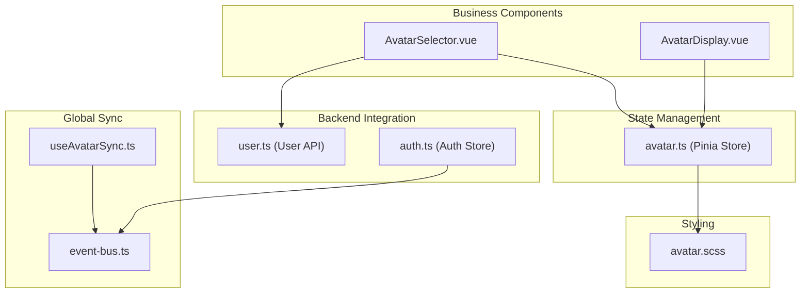
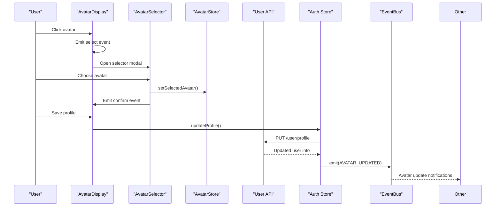
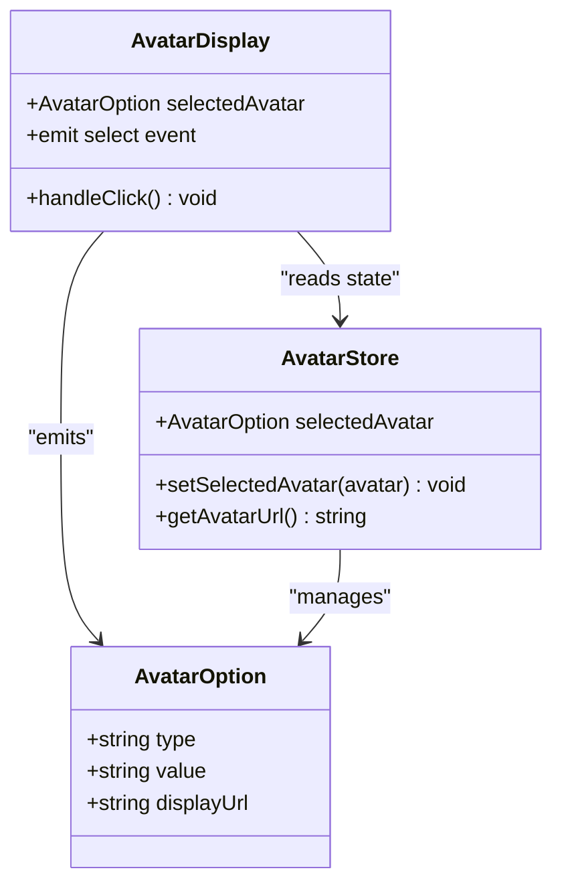
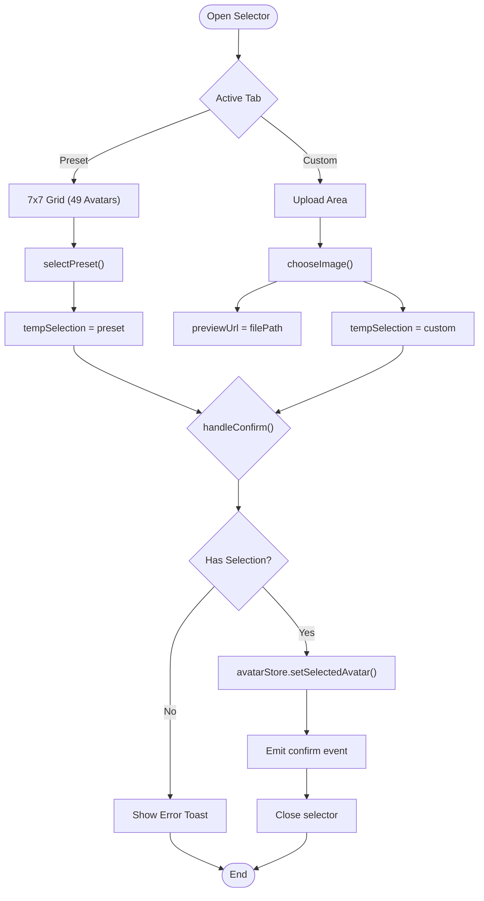
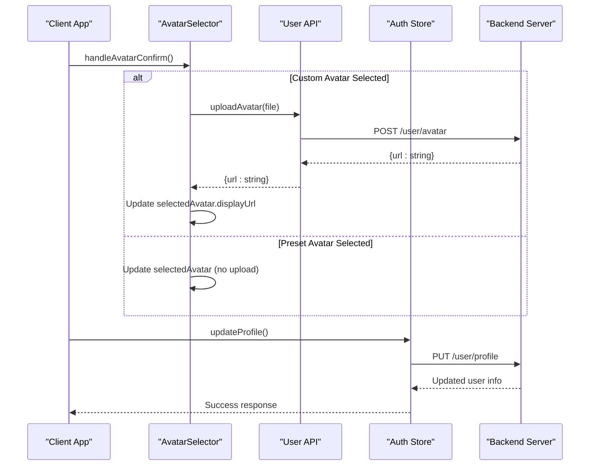
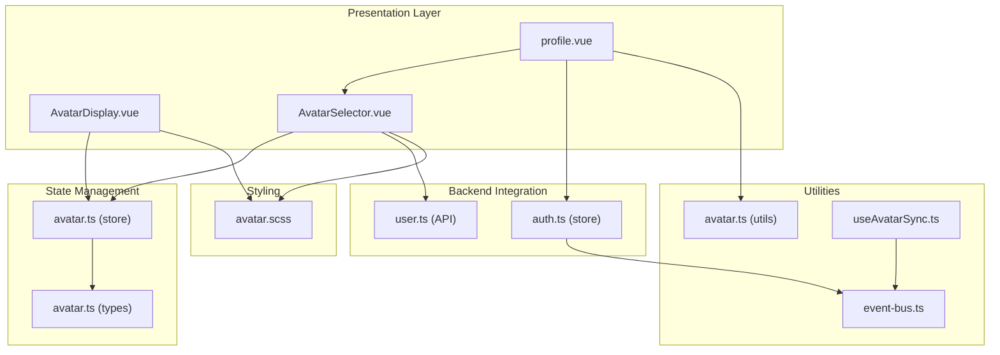

# Avatar Management Components

<cite>
**Referenced Files in This Document**
- [AvatarDisplay.vue](file://src/components/business/AvatarDisplay.vue)
- [AvatarSelector.vue](file://src/components/business/AvatarSelector.vue)
- [avatar.ts](file://src/stores/avatar.ts)
- [avatar.ts](file://src/types/avatar.ts)
- [avatar.scss](file://src/assets/styles/avatar.scss)
- [avatar.ts](file://src/utils/avatar.ts)
- [profile.vue](file://src/pages/user/profile.vue)
- [auth.ts](file://src/stores/auth.ts)
- [user.ts](file://src/api/modules/user.ts)
- [event-bus.ts](file://src/utils/event-bus.ts)
- [useAvatarSync.ts](file://src/composables/useAvatarSync.ts)
</cite>

## Table of Contents
1. [Introduction](#introduction)
2. [Project Structure](#project-structure)
3. [Core Components](#core-components)
4. [Architecture Overview](#architecture-overview)
5. [Detailed Component Analysis](#detailed-component-analysis)
6. [Dependency Analysis](#dependency-analysis)
7. [Performance Considerations](#performance-considerations)
8. [Troubleshooting Guide](#troubleshooting-guide)
9. [Conclusion](#conclusion)

## Introduction
This document provides comprehensive documentation for the avatar management components in the WeTogether platform. It covers two primary business components: AvatarDisplay for displaying user avatars with support for both preset sprite avatars and custom uploaded avatars, and AvatarSelector for avatar customization. The documentation details state management, event handling patterns, styling implementation, and user interaction flows. It also includes prop specifications, event contracts, and integration examples with the avatar store and backend APIs.

## Project Structure
The avatar management system is organized around three main areas:
- Business components: AvatarDisplay and AvatarSelector
- State management: Pinia store for avatar state
- Styling: SCSS mixins and sprite-based avatar rendering
- Backend integration: User API for avatar uploads and profile updates
- Global synchronization: Event bus for cross-component avatar updates



**Diagram sources**
- [AvatarDisplay.vue:1-87](file://src/components/business/AvatarDisplay.vue#L1-L87)
- [AvatarSelector.vue:1-286](file://src/components/business/AvatarSelector.vue#L1-L286)
- [avatar.ts:1-52](file://src/stores/avatar.ts#L1-L52)
- [avatar.scss:1-753](file://src/assets/styles/avatar.scss#L1-L753)
- [user.ts:1-101](file://src/api/modules/user.ts#L1-L101)
- [auth.ts:1-137](file://src/stores/auth.ts#L1-L137)
- [event-bus.ts:1-49](file://src/utils/event-bus.ts#L1-L49)
- [useAvatarSync.ts:1-72](file://src/composables/useAvatarSync.ts#L1-L72)

**Section sources**
- [AvatarDisplay.vue:1-87](file://src/components/business/AvatarDisplay.vue#L1-L87)
- [AvatarSelector.vue:1-286](file://src/components/business/AvatarSelector.vue#L1-L286)
- [avatar.ts:1-52](file://src/stores/avatar.ts#L1-L52)
- [avatar.scss:1-753](file://src/assets/styles/avatar.scss#L1-L753)

## Core Components
This section documents the two primary avatar management components and their roles in the system.

### AvatarDisplay Component
The AvatarDisplay component serves as a presentation layer for user avatars. It handles both preset sprite avatars and custom uploaded avatars, provides click interaction for opening the avatar selector, and displays an edit overlay indicator.

Key features:
- Conditional rendering for preset vs custom avatars
- Click-to-edit functionality triggering parent component actions
- Edit overlay with hover effects and animations
- Responsive sizing using rpx units

### AvatarSelector Component
The AvatarSelector component provides a comprehensive avatar customization interface with dual-tab navigation supporting both preset sprite avatars and custom image uploads.

Key features:
- Dual-tab interface (preset/custom)
- 7x7 grid layout for preset avatars (49 total options)
- Custom image upload with preview functionality
- Temporary selection state with confirmation/cancelation
- MBTI-themed preset avatars with icons and type labels

**Section sources**
- [AvatarDisplay.vue:1-87](file://src/components/business/AvatarDisplay.vue#L1-L87)
- [AvatarSelector.vue:1-286](file://src/components/business/AvatarSelector.vue#L1-L286)

## Architecture Overview
The avatar management system follows a unidirectional data flow pattern with centralized state management and event-driven synchronization.



**Diagram sources**
- [AvatarDisplay.vue:35-41](file://src/components/business/AvatarDisplay.vue#L35-L41)
- [AvatarSelector.vue:134-152](file://src/components/business/AvatarSelector.vue#L134-L152)
- [avatar.ts:26-28](file://src/stores/avatar.ts#L26-L28)
- [user.ts:45-46](file://src/api/modules/user.ts#L45-L46)
- [auth.ts:95-117](file://src/stores/auth.ts#L95-L117)
- [event-bus.ts:26-31](file://src/utils/event-bus.ts#L26-L31)

## Detailed Component Analysis

### AvatarDisplay Component Analysis
The AvatarDisplay component implements a clean, focused interface for avatar presentation with minimal state management.



**Diagram sources**
- [AvatarDisplay.vue:24-41](file://src/components/business/AvatarDisplay.vue#L24-L41)
- [avatar.ts:9-46](file://src/stores/avatar.ts#L9-L46)
- [avatar.ts:9-16](file://src/types/avatar.ts#L9-L16)

Component behavior:
- Uses Pinia store for centralized avatar state
- Renders preset avatars via CSS sprite classes
- Renders custom avatars via image tag with aspectFill mode
- Emits select event to notify parent components
- Implements hover and active states for interactive feedback

**Section sources**
- [AvatarDisplay.vue:1-87](file://src/components/business/AvatarDisplay.vue#L1-L87)
- [avatar.ts:1-52](file://src/stores/avatar.ts#L1-L52)
- [avatar.ts:1-34](file://src/types/avatar.ts#L1-L34)

### AvatarSelector Component Analysis
The AvatarSelector component provides a sophisticated avatar customization interface with comprehensive state management.



**Diagram sources**
- [AvatarSelector.vue:86-152](file://src/components/business/AvatarSelector.vue#L86-L152)

Key implementation patterns:
- Temporary selection state prevents immediate store mutations
- Dual upload modes (album/camera) with compressed/original quality
- Preview functionality for uploaded images
- MBTI-themed preset avatars with icon and type display
- Disabled confirm button until selection is made

**Section sources**
- [AvatarSelector.vue:1-286](file://src/components/business/AvatarSelector.vue#L1-L286)

### State Management and Type Definitions
The avatar state management system uses a centralized Pinia store with TypeScript type safety.

```mermaid
erDiagram
AVATAR_OPTION {
string type
string value
string displayUrl
}
AVATAR_STORE {
AvatarOption selectedAvatar
setSelectedAvatar(avatar) void
getAvatarUrl() string
}
PROFILE_PAGE {
AvatarOption selectedAvatar
formData
handleSave() void
}
AVATAR_STORE ||--|| AVATAR_OPTION : "contains"
PROFILE_PAGE --> AVATAR_STORE : "uses"
```

**Diagram sources**
- [avatar.ts:9-16](file://src/types/avatar.ts#L9-L16)
- [avatar.ts:16-46](file://src/stores/avatar.ts#L16-L46)

State management features:
- Centralized avatar state with persistence
- Type-safe avatar option interface
- Utility functions for avatar display logic
- Integration with authentication store updates

**Section sources**
- [avatar.ts:1-52](file://src/stores/avatar.ts#L1-L52)
- [avatar.ts:1-34](file://src/types/avatar.ts#L1-L34)
- [avatar.ts:1-93](file://src/utils/avatar.ts#L1-L93)

### Backend Integration and API Contracts
The avatar system integrates with backend APIs for avatar uploads and profile updates.



**Diagram sources**
- [AvatarSelector.vue:252-294](file://src/components/business/AvatarSelector.vue#L252-L294)
- [user.ts:68-72](file://src/api/modules/user.ts#L68-L72)
- [auth.ts:95-117](file://src/stores/auth.ts#L95-L117)

API contract specifications:
- Avatar upload endpoint accepts multipart/form-data
- Profile update endpoint supports both avatarId and avatarUrl fields
- Response includes complete avatar URL for display
- Error handling for upload failures and validation errors

**Section sources**
- [user.ts:1-101](file://src/api/modules/user.ts#L1-L101)
- [auth.ts:1-137](file://src/stores/auth.ts#L1-L137)

## Dependency Analysis
The avatar management system exhibits clear separation of concerns with well-defined dependencies.



**Diagram sources**
- [AvatarDisplay.vue:24-28](file://src/components/business/AvatarDisplay.vue#L24-L28)
- [AvatarSelector.vue:60-65](file://src/components/business/AvatarSelector.vue#L60-L65)
- [profile.vue:134-142](file://src/pages/user/profile.vue#L134-L142)
- [avatar.ts:1-52](file://src/stores/avatar.ts#L1-L52)
- [avatar.ts:1-34](file://src/types/avatar.ts#L1-L34)
- [avatar.scss:1-753](file://src/assets/styles/avatar.scss#L1-L753)
- [user.ts:1-101](file://src/api/modules/user.ts#L1-L101)
- [auth.ts:1-137](file://src/stores/auth.ts#L1-L137)
- [avatar.ts:1-93](file://src/utils/avatar.ts#L1-L93)
- [event-bus.ts:1-49](file://src/utils/event-bus.ts#L1-L49)
- [useAvatarSync.ts:1-72](file://src/composables/useAvatarSync.ts#L1-L72)

Key dependency characteristics:
- Low coupling between components through shared store
- Clear separation between presentation and business logic
- Event-driven communication for cross-component updates
- Type-safe interfaces for all data exchanges

**Section sources**
- [AvatarDisplay.vue:1-87](file://src/components/business/AvatarDisplay.vue#L1-L87)
- [AvatarSelector.vue:1-286](file://src/components/business/AvatarSelector.vue#L1-L286)
- [avatar.ts:1-52](file://src/stores/avatar.ts#L1-L52)

## Performance Considerations
The avatar management system implements several performance optimizations:

### Sprite-Based Rendering
- Single sprite image reduces HTTP requests
- CSS positioning eliminates individual image downloads
- Efficient memory usage for 49 preset avatars
- Scalable grid layout with responsive sizing

### Lazy Loading and Caching
- Avatar URLs cached in Pinia store
- Local storage persistence for user preferences
- Event-driven updates prevent unnecessary re-renders
- Conditional rendering based on avatar type

### Optimized Upload Handling
- Compressed image selection by default
- Preview caching to avoid redundant uploads
- Asynchronous upload processing
- Error boundary handling for failed uploads

## Troubleshooting Guide
Common issues and solutions for avatar management components:

### Avatar Display Issues
- **Preset avatar not showing**: Verify sprite image path and CSS class generation
- **Custom avatar not loading**: Check displayUrl format and network connectivity
- **Edit overlay not visible**: Inspect z-index stacking and positioning styles

### Avatar Selection Problems
- **Preset grid not rendering**: Confirm 7x7 grid template and item classes
- **Upload preview failing**: Validate file path resolution and base64 encoding
- **Selection state not updating**: Check temporary selection logic and store mutations

### State Management Issues
- **Avatar not persisting**: Verify Pinia persistence configuration
- **Event not firing**: Confirm event bus registration and cleanup
- **Type errors**: Ensure AvatarOption interface compliance

### Backend Integration Problems
- **Upload failures**: Check file size limits and MIME type validation
- **Profile update errors**: Validate API endpoint and request payload format
- **URL resolution issues**: Confirm CDN availability and CORS configuration

**Section sources**
- [AvatarDisplay.vue:1-87](file://src/components/business/AvatarDisplay.vue#L1-L87)
- [AvatarSelector.vue:1-286](file://src/components/business/AvatarSelector.vue#L1-L286)
- [avatar.ts:1-52](file://src/stores/avatar.ts#L1-L52)
- [user.ts:1-101](file://src/api/modules/user.ts#L1-L101)

## Conclusion
The avatar management system in WeTogether demonstrates robust architecture with clear separation of concerns, comprehensive state management, and seamless integration with backend services. The AvatarDisplay and AvatarSelector components provide intuitive user experiences while maintaining performance through sprite-based rendering and efficient state synchronization. The event-driven architecture ensures consistent avatar updates across the application, while TypeScript typing provides compile-time safety. The system successfully balances functionality, performance, and maintainability, providing a solid foundation for avatar-related features in the platform.