# Business Components

<cite>
**Referenced Files in This Document**
- [AvatarDisplay.vue](file://src/components/business/AvatarDisplay.vue)
- [AvatarSelector.vue](file://src/components/business/AvatarSelector.vue)
- [CommentInput.vue](file://src/components/business/CommentInput.vue)
- [CommentItem.vue](file://src/components/business/CommentItem.vue)
- [MessageBubble.vue](file://src/components/business/MessageBubble.vue)
- [PostCard.vue](file://src/components/business/PostCard.vue)
- [NPSModal.vue](file://src/components/business/NPSModal.vue)
- [BilibiliComment.vue](file://src/components/business/BilibiliComment.vue)
- [CitySelector.vue](file://src/components/business/CitySelector.vue)
- [avatar.ts](file://src/stores/avatar.ts)
- [cities.ts](file://src/constants/cities.ts)
- [avatar.ts](file://src/utils/avatar.ts)
- [nps.ts](file://src/api/nps.ts)
- [AVATAR_PLAN.md](file://docs/AVATAR_PLAN.md)
- [nps-frontend-guide.md](file://docs/nps-frontend-guide.md)
- [city-selector-development.md](file://docs/refactry/city-selector-development.md)
</cite>

## Table of Contents
1. [Introduction](#introduction)
2. [Project Structure](#project-structure)
3. [Core Components](#core-components)
4. [Architecture Overview](#architecture-overview)
5. [Detailed Component Analysis](#detailed-component-analysis)
6. [Dependency Analysis](#dependency-analysis)
7. [Performance Considerations](#performance-considerations)
8. [Troubleshooting Guide](#troubleshooting-guide)
9. [Conclusion](#conclusion)
10. [Appendices](#appendices)

## Introduction
This document provides comprehensive documentation for the business logic components in the WeTogether platform. It focuses on specialized components that power core platform functionality:
- AvatarDisplay and AvatarSelector for avatar management
- CommentInput and CommentItem for social interactions
- MessageBubble for chat interface
- PostCard for content display
- NPSModal for customer satisfaction surveys
- BilibiliComment for embedded video comments
- CitySelector for location-based features

For each component, we detail business logic, user interaction patterns, data binding, event handling, and integration with backend APIs. Prop specifications, event contracts, styling guidelines, and usage examples are included to help developers integrate and extend these components effectively.

## Project Structure
The business components are located under src/components/business/. They rely on shared stores, utilities, and constants for state management, avatar rendering, and city data. Integration examples and usage patterns are documented in the project’s docs folder.

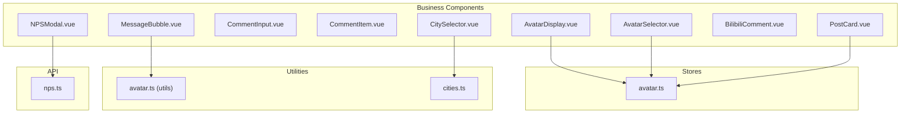

**Diagram sources**
- [AvatarDisplay.vue:1-87](file://src/components/business/AvatarDisplay.vue#L1-L87)
- [AvatarSelector.vue:1-286](file://src/components/business/AvatarSelector.vue#L1-L286)
- [MessageBubble.vue:1-309](file://src/components/business/MessageBubble.vue#L1-L309)
- [PostCard.vue:1-628](file://src/components/business/PostCard.vue#L1-L628)
- [NPSModal.vue:1-550](file://src/components/business/NPSModal.vue#L1-L550)
- [BilibiliComment.vue:1-741](file://src/components/business/BilibiliComment.vue#L1-L741)
- [CitySelector.vue:1-515](file://src/components/business/CitySelector.vue#L1-L515)
- [avatar.ts:1-52](file://src/stores/avatar.ts#L1-L52)
- [avatar.ts:1-93](file://src/utils/avatar.ts#L1-L93)
- [cities.ts:1-186](file://src/constants/cities.ts#L1-L186)
- [nps.ts:1-43](file://src/api/nps.ts#L1-L43)

**Section sources**
- [AvatarDisplay.vue:1-87](file://src/components/business/AvatarDisplay.vue#L1-L87)
- [AvatarSelector.vue:1-286](file://src/components/business/AvatarSelector.vue#L1-L286)
- [CommentInput.vue:1-123](file://src/components/business/CommentInput.vue#L1-L123)
- [CommentItem.vue:1-187](file://src/components/business/CommentItem.vue#L1-L187)
- [MessageBubble.vue:1-309](file://src/components/business/MessageBubble.vue#L1-L309)
- [PostCard.vue:1-628](file://src/components/business/PostCard.vue#L1-L628)
- [NPSModal.vue:1-550](file://src/components/business/NPSModal.vue#L1-L550)
- [BilibiliComment.vue:1-741](file://src/components/business/BilibiliComment.vue#L1-L741)
- [CitySelector.vue:1-515](file://src/components/business/CitySelector.vue#L1-L515)
- [avatar.ts:1-52](file://src/stores/avatar.ts#L1-L52)
- [avatar.ts:1-93](file://src/utils/avatar.ts#L1-L93)
- [cities.ts:1-186](file://src/constants/cities.ts#L1-L186)
- [nps.ts:1-43](file://src/api/nps.ts#L1-L43)

## Core Components
This section summarizes the primary business components and their roles:
- AvatarDisplay: Renders the current avatar and emits selection events.
- AvatarSelector: Provides preset and custom avatar selection with preview and confirmation.
- CommentInput: Handles comment creation with debounced submission and API integration.
- CommentItem: Displays nested comments with expandable replies and actions.
- MessageBubble: Renders chat messages with sender avatar logic and retry actions.
- PostCard: Displays posts with images, likes, comments, shares, and reporting flows.
- NPSModal: Collects Net Promoter Score feedback with dynamic steps and tags.
- BilibiliComment: Full-featured comment system with nested replies, likes, and moderation.
- CitySelector: Location picker with search, geolocation, and city list navigation.

**Section sources**
- [AvatarDisplay.vue:1-87](file://src/components/business/AvatarDisplay.vue#L1-L87)
- [AvatarSelector.vue:1-286](file://src/components/business/AvatarSelector.vue#L1-L286)
- [CommentInput.vue:1-123](file://src/components/business/CommentInput.vue#L1-L123)
- [CommentItem.vue:1-187](file://src/components/business/CommentItem.vue#L1-L187)
- [MessageBubble.vue:1-309](file://src/components/business/MessageBubble.vue#L1-L309)
- [PostCard.vue:1-628](file://src/components/business/PostCard.vue#L1-L628)
- [NPSModal.vue:1-550](file://src/components/business/NPSModal.vue#L1-L550)
- [BilibiliComment.vue:1-741](file://src/components/business/BilibiliComment.vue#L1-L741)
- [CitySelector.vue:1-515](file://src/components/business/CitySelector.vue#L1-L515)

## Architecture Overview
The business components follow a unidirectional data flow:
- Props carry immutable data from parent to child.
- Events propagate user actions upward to parents.
- Stores manage global state (e.g., avatar selection).
- Utilities encapsulate cross-cutting concerns (e.g., avatar display logic).
- APIs handle backend integrations.

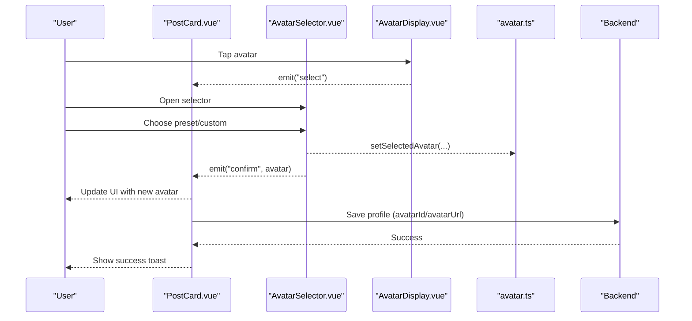

**Diagram sources**
- [AvatarDisplay.vue:30-41](file://src/components/business/AvatarDisplay.vue#L30-L41)
- [AvatarSelector.vue:134-152](file://src/components/business/AvatarSelector.vue#L134-L152)
- [avatar.ts:26-28](file://src/stores/avatar.ts#L26-L28)
- [PostCard.vue:162-178](file://src/components/business/PostCard.vue#L162-L178)

## Detailed Component Analysis

### AvatarDisplay
- Purpose: Render the currently selected avatar and notify parent to open the selector.
- Props: None.
- Emits: select (no payload).
- Data binding: Reads from useAvatarStore.selectedAvatar.
- Interaction: Click triggers select event.
- Styling: Uses SCSS with avatar-specific styles.

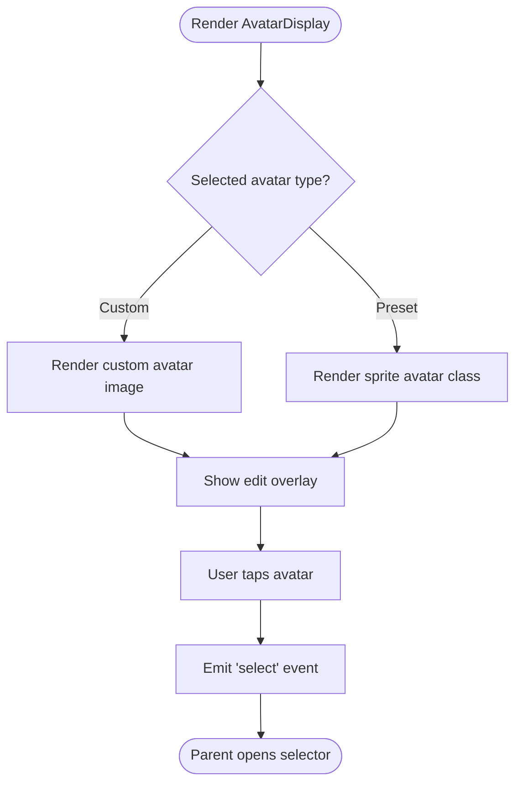

**Diagram sources**
- [AvatarDisplay.vue:1-42](file://src/components/business/AvatarDisplay.vue#L1-L42)

**Section sources**
- [AvatarDisplay.vue:1-87](file://src/components/business/AvatarDisplay.vue#L1-L87)
- [avatar.ts:16-20](file://src/stores/avatar.ts#L16-L20)

### AvatarSelector
- Purpose: Allow users to pick a preset avatar (49 choices) or upload a custom avatar.
- Props: None.
- Emits: confirm(AvatarOption), cancel().
- State: activeTab ('preset' | 'custom'), previewUrl, tempSelection.
- Interaction: Tabs switch, preset grid selection, image picker, confirm/cancel.
- Backend integration: On confirm, saves to avatar store and emits selection.

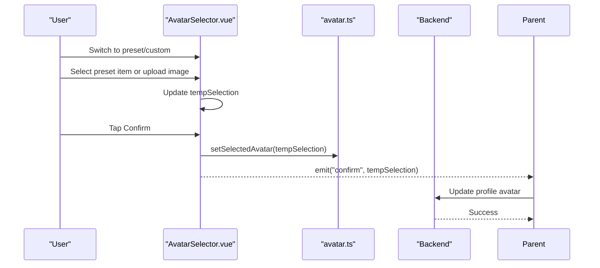

**Diagram sources**
- [AvatarSelector.vue:134-152](file://src/components/business/AvatarSelector.vue#L134-L152)
- [avatar.ts:26-28](file://src/stores/avatar.ts#L26-L28)

**Section sources**
- [AvatarSelector.vue:1-286](file://src/components/business/AvatarSelector.vue#L1-L286)
- [avatar.ts:1-52](file://src/stores/avatar.ts#L1-L52)
- [AVATAR_PLAN.md:256-354](file://docs/AVATAR_PLAN.md#L256-L354)

### CommentInput
- Purpose: Provide a text input for comments with debounced submission.
- Props: postId (number), replyToComment? (Comment).
- Emits: success (no payload).
- Behavior: Placeholder adapts to reply context; submit validates content length and loading state; integrates with square API.

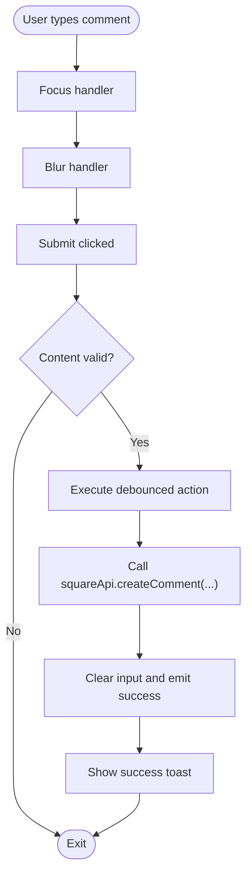

**Diagram sources**
- [CommentInput.vue:53-73](file://src/components/business/CommentInput.vue#L53-L73)

**Section sources**
- [CommentInput.vue:1-123](file://src/components/business/CommentInput.vue#L1-L123)

### CommentItem
- Purpose: Display a single comment with optional nested replies and actions.
- Props: comment (Comment).
- Emits: reply(comment).
- Behavior: Expand/collapse replies, lazy load replies on first expansion, pagination per page.

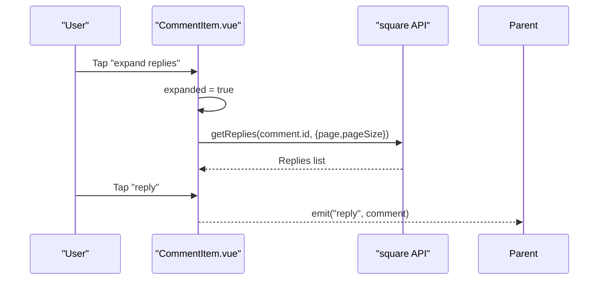

**Diagram sources**
- [CommentItem.vue:77-101](file://src/components/business/CommentItem.vue#L77-L101)

**Section sources**
- [CommentItem.vue:1-187](file://src/components/business/CommentItem.vue#L1-L187)

### MessageBubble
- Purpose: Render individual chat messages with sender avatar logic and status indicators.
- Props: message (any), showTime? (boolean).
- Emits: retry(messageId).
- Logic: Determines self vs other; computes avatar display via getAvatarDisplay; handles retry.

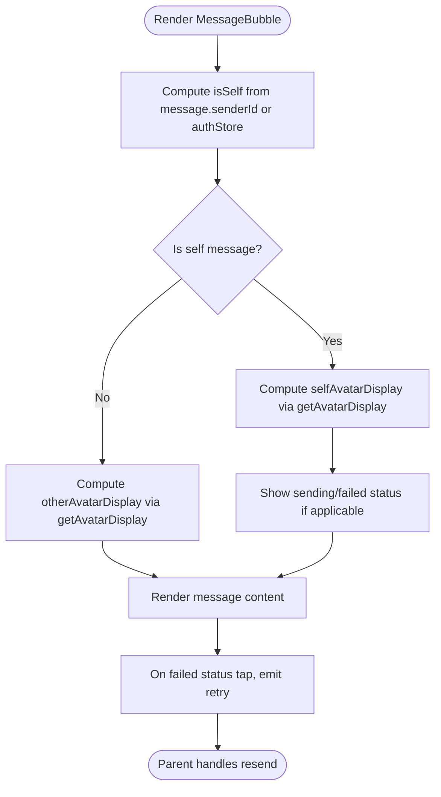

**Diagram sources**
- [MessageBubble.vue:86-114](file://src/components/business/MessageBubble.vue#L86-L114)
- [avatar.ts:53-92](file://src/utils/avatar.ts#L53-L92)

**Section sources**
- [MessageBubble.vue:1-309](file://src/components/business/MessageBubble.vue#L1-L309)
- [avatar.ts:1-93](file://src/utils/avatar.ts#L1-L93)

### PostCard
- Purpose: Display user-generated posts with images, actions (like/comment/share/report), and modals.
- Props: post (any).
- Emits: click, like, comment, share, report, delete.
- Features: Lazy-loaded images with placeholders, like animation and particles, action sheet for delete/report, modal for detailed reporting.

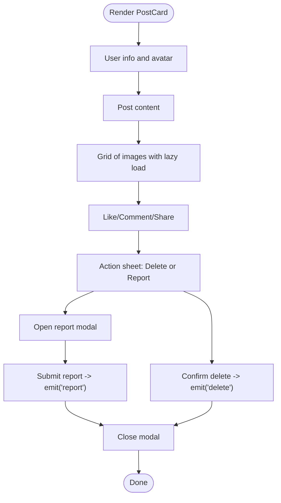

**Diagram sources**
- [PostCard.vue:128-290](file://src/components/business/PostCard.vue#L128-L290)

**Section sources**
- [PostCard.vue:1-628](file://src/components/business/PostCard.vue#L1-L628)

### NPSModal
- Purpose: Collect NPS scores and feedback with dynamic steps and tags.
- Props: visible (boolean), triggerType? ('auto' | 'manual'), triggerScene? (string).
- Emits: close, success(feedback).
- Steps: 1) Score (0–10), 2) Feedback and tags, 3) Thank you with points reward.
- Backend: submitNPSFeedback(dto) with scoring and tagging.

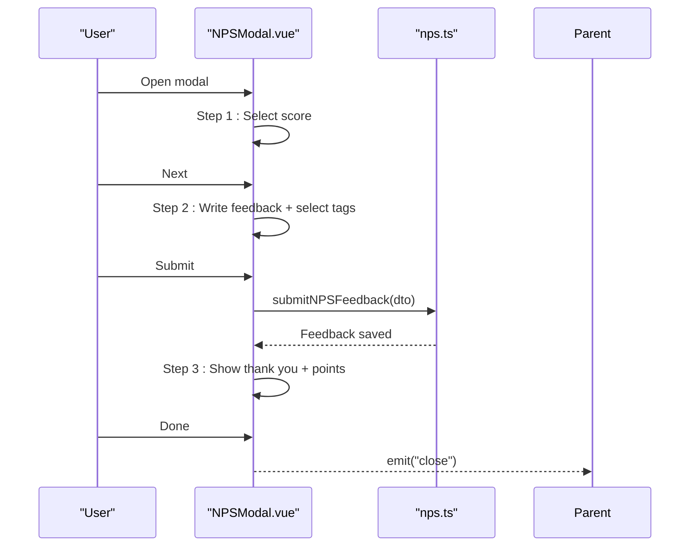

**Diagram sources**
- [NPSModal.vue:244-294](file://src/components/business/NPSModal.vue#L244-L294)
- [nps.ts:40-42](file://src/api/nps.ts#L40-L42)

**Section sources**
- [NPSModal.vue:1-550](file://src/components/business/NPSModal.vue#L1-L550)
- [nps.ts:1-43](file://src/api/nps.ts#L1-L43)
- [nps-frontend-guide.md:1-190](file://docs/nps-frontend-guide.md#L1-L190)

### BilibiliComment
- Purpose: Full-featured comment system with nested replies, likes, moderation, and infinite scrolling.
- Props: postId (number), postAuthorId? (number).
- Emits: success, delete.
- State: comments[], currentPage, hasMore, replyingComment, replyingRoot, expandedComments, isFocused.
- Network: Uses squareStore for fetching comments/replies and creating/deleting comments.

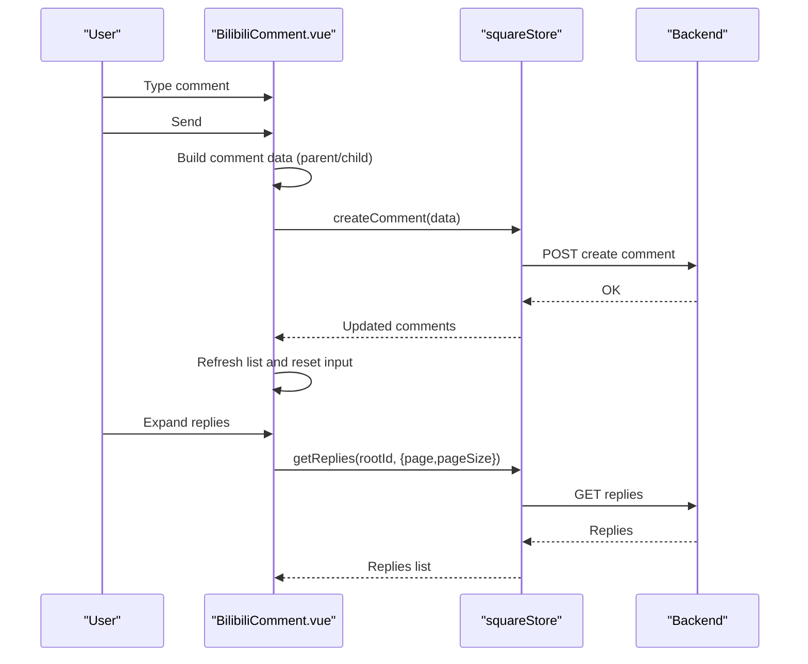

**Diagram sources**
- [BilibiliComment.vue:241-283](file://src/components/business/BilibiliComment.vue#L241-L283)
- [BilibiliComment.vue:302-338](file://src/components/business/BilibiliComment.vue#L302-L338)

**Section sources**
- [BilibiliComment.vue:1-741](file://src/components/business/BilibiliComment.vue#L1-L741)

### CitySelector
- Purpose: Allow users to search and select a city, with geolocation support and alphabetical indexing.
- Props: visible (boolean), currentCity? (string).
- Emits: close, select(city: string).
- Data: HOT_CITIES, ALL_CITIES, CITY_INITIALS; searchCities(keyword).
- Behavior: Search updates results; locate uses uni.getLocation and backend getCurrentLocation; saving via saveUserCity.

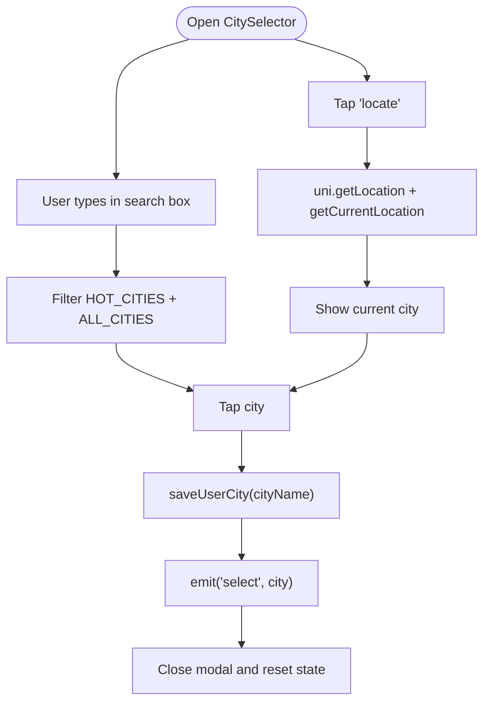

**Diagram sources**
- [CitySelector.vue:150-201](file://src/components/business/CitySelector.vue#L150-L201)
- [CitySelector.vue:204-223](file://src/components/business/CitySelector.vue#L204-L223)

**Section sources**
- [CitySelector.vue:1-515](file://src/components/business/CitySelector.vue#L1-L515)
- [cities.ts:1-186](file://src/constants/cities.ts#L1-L186)
- [city-selector-development.md:212-242](file://docs/refactry/city-selector-development.md#L212-L242)

## Dependency Analysis
- AvatarDisplay and AvatarSelector depend on avatar.ts store for state and avatar display logic.
- MessageBubble depends on avatar.ts store and avatar.ts utility for computing avatar displays.
- PostCard integrates with auth store for ownership checks and emits actions to parent.
- NPSModal depends on nps.ts API for submission and emits success to parent.
- BilibiliComment depends on squareStore for comments and replies, and on auth store for identity.
- CitySelector depends on cities.ts constants and location API for geolocation.

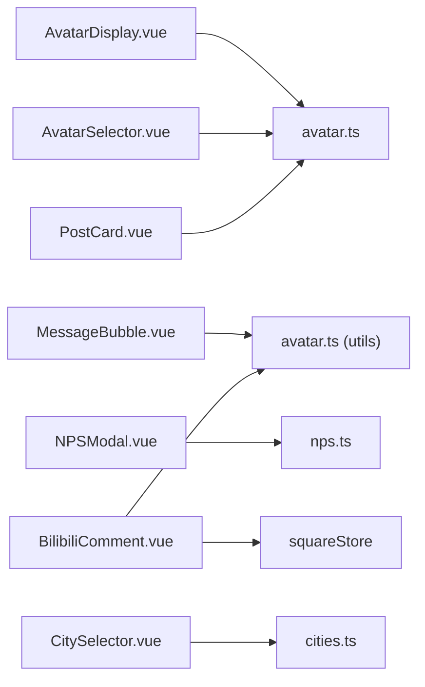

**Diagram sources**
- [AvatarDisplay.vue:24-28](file://src/components/business/AvatarDisplay.vue#L24-L28)
- [AvatarSelector.vue:61-65](file://src/components/business/AvatarSelector.vue#L61-L65)
- [MessageBubble.vue:71-72](file://src/components/business/MessageBubble.vue#L71-L72)
- [PostCard.vue:99-100](file://src/components/business/PostCard.vue#L99-L100)
- [NPSModal.vue:111-112](file://src/components/business/NPSModal.vue#L111-L112)
- [BilibiliComment.vue:160-164](file://src/components/business/BilibiliComment.vue#L160-L164)
- [CitySelector.vue:120-122](file://src/components/business/CitySelector.vue#L120-L122)

**Section sources**
- [avatar.ts:1-52](file://src/stores/avatar.ts#L1-L52)
- [avatar.ts:1-93](file://src/utils/avatar.ts#L1-L93)
- [nps.ts:1-43](file://src/api/nps.ts#L1-L43)
- [cities.ts:1-186](file://src/constants/cities.ts#L1-L186)

## Performance Considerations
- Virtualization and lazy loading: PostCard images use lazy-load and placeholders to reduce initial render cost.
- Debouncing: CommentInput and BilibiliComment use debounced submission to avoid redundant network calls.
- Optimistic UI: BilibiliComment toggles like state optimistically and rolls back on failure.
- Pagination: CommentItem and BilibiliComment implement pagination to limit DOM and API payloads.
- Animation thresholds: PostCard and MessageBubble use minimal animations to balance UX and performance.

[No sources needed since this section provides general guidance]

## Troubleshooting Guide
- Avatar upload failures: AvatarSelector shows an error toast when chooseImage fails; ensure device permissions and file constraints.
- Comment submission blocked: CommentInput disables submit when content is empty or during loading; verify debounce state and network connectivity.
- Reply expansion errors: CommentItem hides loading after failure; ensure API endpoints are reachable.
- NPS submission errors: NPSModal validates minimum length and score presence; logs and shows error messages on failure.
- City location denied: CitySelector handles permission denial and timeout errors; guide users to enable location services.
- Chat retry: MessageBubble emits retry with messageId; parent should re-send and update status accordingly.

**Section sources**
- [AvatarSelector.vue:112-118](file://src/components/business/AvatarSelector.vue#L112-L118)
- [CommentInput.vue:56-72](file://src/components/business/CommentInput.vue#L56-L72)
- [CommentItem.vue:96-100](file://src/components/business/CommentItem.vue#L96-L100)
- [NPSModal.vue:250-294](file://src/components/business/NPSModal.vue#L250-L294)
- [CitySelector.vue:182-200](file://src/components/business/CitySelector.vue#L182-L200)
- [MessageBubble.vue:112-114](file://src/components/business/MessageBubble.vue#L112-L114)

## Conclusion
These business components form the backbone of WeTogether’s social and personalization features. They emphasize clear separation of concerns, robust event-driven communication, and resilient integration with backend services. By following the documented patterns, developers can confidently extend functionality while maintaining consistency and performance.

[No sources needed since this section summarizes without analyzing specific files]

## Appendices

### Component Prop Specifications and Event Contracts

- AvatarDisplay
  - Props: None
  - Emits: select()

- AvatarSelector
  - Props: None
  - Emits: confirm(AvatarOption), cancel()

- CommentInput
  - Props: postId (number), replyToComment? (Comment)
  - Emits: success()

- CommentItem
  - Props: comment (Comment)
  - Emits: reply(comment)

- MessageBubble
  - Props: message (any), showTime? (boolean)
  - Emits: retry(messageId)

- PostCard
  - Props: post (any)
  - Emits: click(), like(), comment(), share(), report(), delete()

- NPSModal
  - Props: visible (boolean), triggerType? ('auto' | 'manual'), triggerScene? (string)
  - Emits: close(), success(feedback)

- BilibiliComment
  - Props: postId (number), postAuthorId? (number)
  - Emits: success(), delete()

- CitySelector
  - Props: visible (boolean), currentCity? (string)
  - Emits: close(), select(city: string)

**Section sources**
- [AvatarDisplay.vue:30-33](file://src/components/business/AvatarDisplay.vue#L30-L33)
- [AvatarSelector.vue:67-71](file://src/components/business/AvatarSelector.vue#L67-L71)
- [CommentInput.vue:25-33](file://src/components/business/CommentInput.vue#L25-L33)
- [CommentItem.vue:52-59](file://src/components/business/CommentItem.vue#L52-L59)
- [MessageBubble.vue:74-81](file://src/components/business/MessageBubble.vue#L74-L81)
- [PostCard.vue:102-113](file://src/components/business/PostCard.vue#L102-L113)
- [NPSModal.vue:114-128](file://src/components/business/NPSModal.vue#L114-L128)
- [BilibiliComment.vue:166-175](file://src/components/business/BilibiliComment.vue#L166-L175)
- [CitySelector.vue:124-137](file://src/components/business/CitySelector.vue#L124-L137)

### Styling Guidelines
- Use SCSS modules scoped to each component.
- Prefer design tokens for spacing, colors, and typography.
- Keep interactive states (active, hover) consistent across components.
- Ensure responsive units (rpx) for cross-device compatibility.

[No sources needed since this section provides general guidance]

### Usage Examples and Composition Patterns
- Avatar editing flow: AvatarDisplay emits select; parent opens AvatarSelector; on confirm, save to avatar store and update profile via API.
- NPS integration: Use useNPS composable to trigger NPSModal automatically or manually; handle success to update user stats.
- City-based recommendations: Open CitySelector; on select, refresh recommendation lists and update UI.

**Section sources**
- [AVATAR_PLAN.md:256-354](file://docs/AVATAR_PLAN.md#L256-L354)
- [nps-frontend-guide.md:63-106](file://docs/nps-frontend-guide.md#L63-L106)
- [city-selector-development.md:212-242](file://docs/refactry/city-selector-development.md#L212-L242)