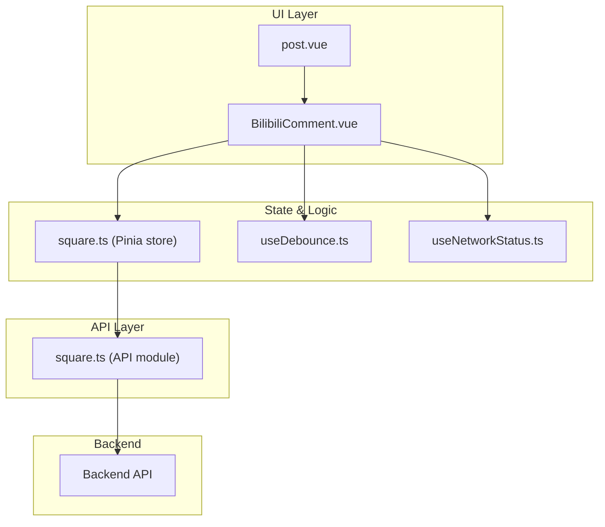
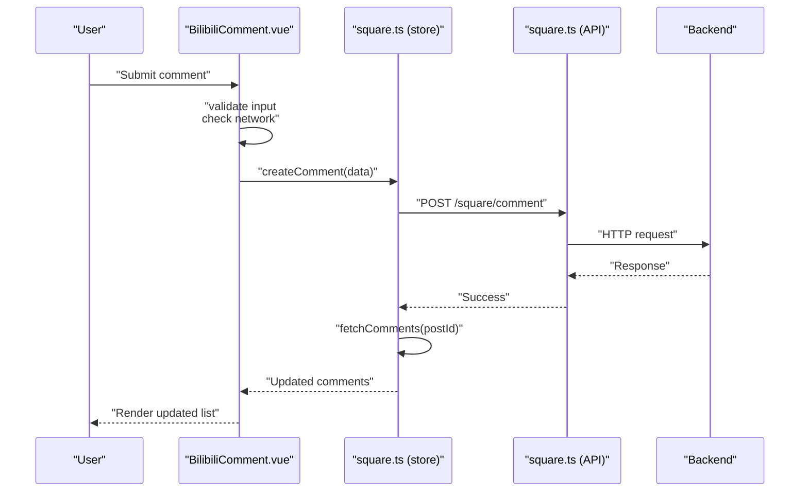
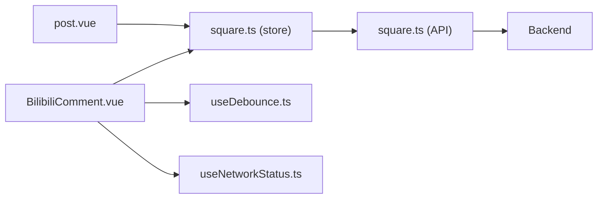

# Embedded Content Components

<cite>
**Referenced Files in This Document**
- [BilibiliComment.vue](file://src/components/business/BilibiliComment.vue)
- [square.ts](file://src/api/modules/square.ts)
- [square.ts](file://src/stores/square.ts)
- [useNetworkStatus.ts](file://src/composables/useNetworkStatus.ts)
- [useDebounce.ts](file://src/composables/useDebounce.ts)
- [post.vue](file://src/pages/square/post.vue)
- [index.html](file://index.html)
- [index.scss](file://src/assets/styles/index.scss)
</cite>

## Table of Contents
1. [Introduction](#introduction)
2. [Project Structure](#project-structure)
3. [Core Components](#core-components)
4. [Architecture Overview](#architecture-overview)
5. [Detailed Component Analysis](#detailed-component-analysis)
6. [Dependency Analysis](#dependency-analysis)
7. [Performance Considerations](#performance-considerations)
8. [Troubleshooting Guide](#troubleshooting-guide)
9. [Conclusion](#conclusion)
10. [Appendices](#appendices)

## Introduction
This document explains the embedded content ecosystem in the WeTogether platform with a focus on the BilibiliComment component. It covers how comments are loaded, synchronized, and rendered; how user interactions are handled; and how the system integrates with backend APIs and stores. It also provides guidance on customization, accessibility, moderation, filtering, and robustness against network failures.

Note: The BilibiliComment component in this codebase is a native comment widget that renders comments and replies locally and communicates with backend APIs. It does not embed external video platforms via iframes or cross-origin messaging. The documentation below therefore focuses on the comment rendering, synchronization, and interaction patterns present in the codebase.

## Project Structure
The embedded content feature is centered around a Vue component that manages comments and replies, backed by a Pinia store and API module. The component integrates with composables for network checks and debounced actions.

**Diagram sources**
- [BilibiliComment.vue:158-444](file://src/components/business/BilibiliComment.vue#L158-L444)
- [square.ts:13-151](file://src/stores/square.ts#L13-L151)
- [square.ts:43-97](file://src/api/modules/square.ts#L43-L97)
- [useDebounce.ts:18-73](file://src/composables/useDebounce.ts#L18-L73)
- [useNetworkStatus.ts:3-61](file://src/composables/useNetworkStatus.ts#L3-L61)
- [post.vue:44-99](file://src/pages/square/post.vue#L44-L99)

**Section sources**
- [BilibiliComment.vue:158-444](file://src/components/business/BilibiliComment.vue#L158-L444)
- [square.ts:13-151](file://src/stores/square.ts#L13-L151)
- [square.ts:43-97](file://src/api/modules/square.ts#L43-L97)
- [useDebounce.ts:18-73](file://src/composables/useDebounce.ts#L18-L73)
- [useNetworkStatus.ts:3-61](file://src/composables/useNetworkStatus.ts#L3-L61)
- [post.vue:44-99](file://src/pages/square/post.vue#L44-L99)

## Core Components
- BilibiliComment.vue: Renders the comment input area, comment list, replies, pagination, and actions (like, reply, delete). It orchestrates loading, submission, expansion/collapse of replies, and optimistic updates.
- square.ts (store): Centralizes fetching comments, creating/deleting comments, fetching replies, toggling likes, and updating counters.
- square.ts (API): Defines typed endpoints for comments, replies, and likes.
- useNetworkStatus.ts: Checks connectivity and prevents actions when offline.
- useDebounce.ts: Provides debounced button states and generic debouncing to prevent duplicate submissions.

Key responsibilities:
- Content loading: fetchComments with pagination and sorting.
- Synchronization: optimistic UI updates and server-side reconciliation.
- Interaction forwarding: like toggles, reply initiation, deletion with confirmation.
- Security: input validation and length limits; permission checks for deletion.

**Section sources**
- [BilibiliComment.vue:182-444](file://src/components/business/BilibiliComment.vue#L182-L444)
- [square.ts:52-93](file://src/stores/square.ts#L52-L93)
- [square.ts:62-97](file://src/api/modules/square.ts#L62-L97)
- [useNetworkStatus.ts:35-45](file://src/composables/useNetworkStatus.ts#L35-L45)
- [useDebounce.ts:18-73](file://src/composables/useDebounce.ts#L18-L73)

## Architecture Overview
The comment flow connects UI events to store actions, which call API endpoints and update local state. Replies are fetched lazily when expanding a comment thread.

**Diagram sources**
- [BilibiliComment.vue:241-283](file://src/components/business/BilibiliComment.vue#L241-L283)
- [square.ts:61-74](file://src/stores/square.ts#L61-L74)
- [square.ts:56-57](file://src/api/modules/square.ts#L56-L57)

## Detailed Component Analysis

### BilibiliComment.vue
Responsibilities:
- Render comment input with character counter and send button.
- Paginate and sort comments by time.
- Expand/collapse replies and lazy-load replies when needed.
- Handle like toggling with optimistic UI updates and rollback on failure.
- Support reply initiation and deletion with confirmation modals.
- Emit success and delete events to parent components.

Interaction flow highlights:
- Submit comment: builds payload (including parentId/replyTo fields when replying), calls store, clears input, refreshes list.
- Toggle like: optimistically flips like state, calls backend, rolls back on error.
- View replies: shows “expand/collapse” and loads replies if not present.

Accessibility and UX:
- Focus management when starting a reply.
- Toast notifications for success/error states.
- Disabled states during loading.

Customization hooks:
- Emits success and delete events for parent to react (e.g., update counters).

Responsive design:
- Uses relative units and flex layouts suitable for mobile.
- Scroll-to-top behavior when replying to improve usability.

Security considerations:
- Input length limit enforced client-side.
- Deletion permission checked against current user and post author.
- Network checks prevent offline operations.

**Section sources**
- [BilibiliComment.vue:182-444](file://src/components/business/BilibiliComment.vue#L182-L444)
- [BilibiliComment.vue:241-283](file://src/components/business/BilibiliComment.vue#L241-L283)
- [BilibiliComment.vue:360-385](file://src/components/business/BilibiliComment.vue#L360-L385)
- [BilibiliComment.vue:302-338](file://src/components/business/BilibiliComment.vue#L302-L338)

### Store: square.ts
Responsibilities:
- Fetch posts and comments.
- Create/delete comments and replies.
- Toggle likes and broadcast events for UI sync.
- Maintain pagination flags and loading states.

Comment lifecycle:
- createComment: posts to backend, refetches comments, increments counters.
- deleteComment: posts to backend, decrements counters.
- getReplies: fetches replies for a comment.
- toggleLike: updates local state and emits events.

**Section sources**
- [square.ts:52-93](file://src/stores/square.ts#L52-L93)
- [square.ts:95-128](file://src/stores/square.ts#L95-L128)

### API: square.ts
Endpoints used by the component:
- GET /square/posts/{id}/comments
- GET /square/comments/{id}/replies
- POST /square/comment
- DELETE /square/comments/{id}
- POST /square/like

These are consumed by the store and used directly by the component for replies.

**Section sources**
- [square.ts:62-97](file://src/api/modules/square.ts#L62-L97)

### Composables
- useNetworkStatus: centralizes online/offline checks and action gating.
- useDebounceButton: provides loading state and button text switching for submit actions.

**Section sources**
- [useNetworkStatus.ts:35-45](file://src/composables/useNetworkStatus.ts#L35-L45)
- [useDebounce.ts:63-73](file://src/composables/useDebounce.ts#L63-L73)

### Parent Integration: post.vue
- Subscribes to like sync for comments.
- Loads post and comments on mount.

**Section sources**
- [post.vue:44-99](file://src/pages/square/post.vue#L44-L99)

## Dependency Analysis

**Diagram sources**
- [BilibiliComment.vue:158-444](file://src/components/business/BilibiliComment.vue#L158-L444)
- [square.ts:13-151](file://src/stores/square.ts#L13-L151)
- [square.ts:43-97](file://src/api/modules/square.ts#L43-L97)
- [post.vue:44-99](file://src/pages/square/post.vue#L44-L99)

**Section sources**
- [BilibiliComment.vue:158-444](file://src/components/business/BilibiliComment.vue#L158-L444)
- [square.ts:13-151](file://src/stores/square.ts#L13-L151)
- [square.ts:43-97](file://src/api/modules/square.ts#L43-L97)
- [post.vue:44-99](file://src/pages/square/post.vue#L44-L99)

## Performance Considerations
- Pagination: Comments are fetched in pages of 20, reducing initial payload and render cost.
- Lazy replies: Replies are fetched only when a user expands a thread, minimizing network and DOM work.
- Optimistic updates: Like toggles update immediately, improving perceived responsiveness; errors roll back UI safely.
- Debouncing: Prevents duplicate submissions and reduces redundant network calls.
- Network gating: Prevents wasted requests when offline.

Recommendations:
- Virtualize long lists if comment counts grow very large.
- Cache recent replies per comment to avoid repeated fetches.
- Use background sync strategies for offline-first workflows.

[No sources needed since this section provides general guidance]

## Troubleshooting Guide
Common issues and mitigations:
- Offline operations: useNetworkStatus blocks actions and shows feedback; ensure network listeners are registered.
- Duplicate submissions: useDebounceButton prevents concurrent submissions; verify button state bindings.
- Like toggling failures: optimistic UI rolls back on error; show user-friendly toast messages.
- Reply loading failures: component hides loading and shows a toast; ensure error boundaries are in place.
- Deleting comments: confirmation modal prevents accidental deletions; verify permissions logic.

**Section sources**
- [useNetworkStatus.ts:35-45](file://src/composables/useNetworkStatus.ts#L35-L45)
- [useDebounce.ts:18-73](file://src/composables/useDebounce.ts#L18-L73)
- [BilibiliComment.vue:360-385](file://src/components/business/BilibiliComment.vue#L360-L385)
- [BilibiliComment.vue:302-338](file://src/components/business/BilibiliComment.vue#L302-L338)
- [BilibiliComment.vue:387-423](file://src/components/business/BilibiliComment.vue#L387-L423)

## Conclusion
The BilibiliComment component provides a robust, responsive comment experience with optimistic updates, lazy loading, and strong user interaction controls. Its integration with the Pinia store and API module ensures consistent state and reliable synchronization. While the component does not embed external video platforms via iframes, the patterns demonstrated here—pagination, optimistic updates, and error handling—are directly applicable to building embedded media widgets that require similar reliability and UX guarantees.

[No sources needed since this section summarizes without analyzing specific files]

## Appendices

### Accessibility Compliance Checklist
- Keyboard navigation: ensure focus moves to input after starting a reply.
- Screen reader labels: provide meaningful aria-labels for like and delete actions.
- Color contrast: verify sufficient contrast for like icons and counters.
- Focus styles: maintain visible focus indicators for interactive elements.
- Reduced motion: respect prefers-reduced-motion for animations.

[No sources needed since this section provides general guidance]

### Customization Options
- Event emissions: listen for success and delete events to update counters or trigger analytics.
- Styling: adjust SCSS variables and component styles to match brand guidelines.
- Permissions: customize deletion logic to support moderators or roles.

**Section sources**
- [BilibiliComment.vue:172-175](file://src/components/business/BilibiliComment.vue#L172-L175)
- [BilibiliComment.vue:204-209](file://src/components/business/BilibiliComment.vue#L204-L209)

### Moderation and Filtering Integration
- Content filtering: apply content filters before submitting comments (e.g., profanity checks).
- Reporting: integrate report actions via the existing report endpoint.
- Manual moderation: surface flagged comments in admin panels and support workflows.

[No sources needed since this section provides general guidance]

### Fallback Handling for Network Failures
- Offline mode: disable actions and show contextual messages.
- Retry logic: implement retry prompts for failed operations.
- Local persistence: cache pending actions and sync when connectivity resumes.

**Section sources**
- [useNetworkStatus.ts:35-45](file://src/composables/useNetworkStatus.ts#L35-L45)

### Responsive Design Notes
- Mobile-first layout: component uses flexible units and flexbox for small screens.
- Viewport meta: global viewport configuration supports safe insets and scaling.

**Section sources**
- [index.html:1-20](file://index.html#L1-L20)
- [index.scss:1-39](file://src/assets/styles/index.scss#L1-L39)