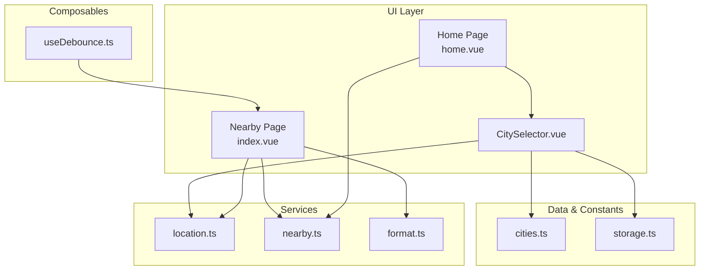
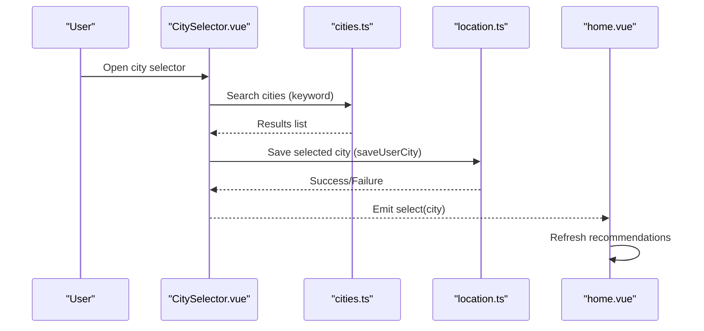
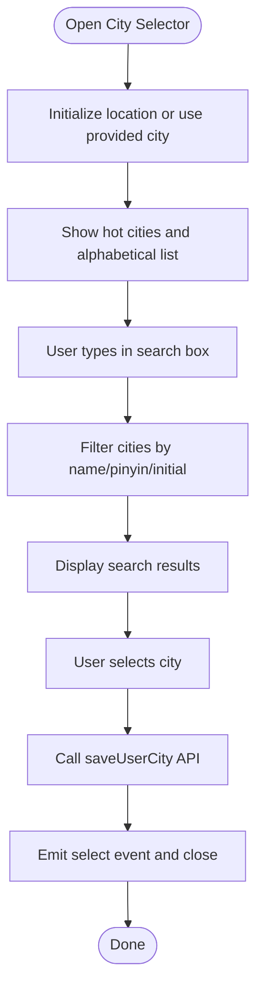
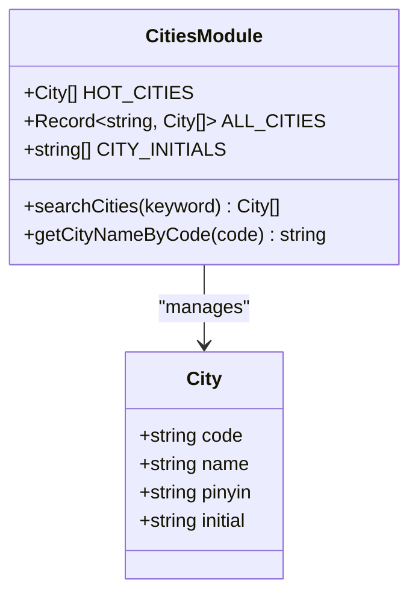
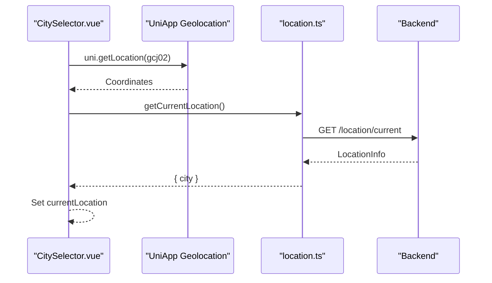
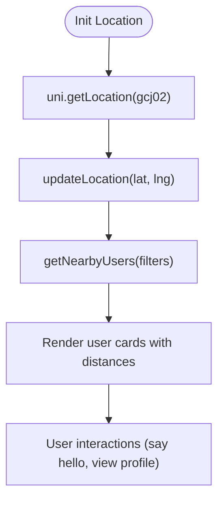
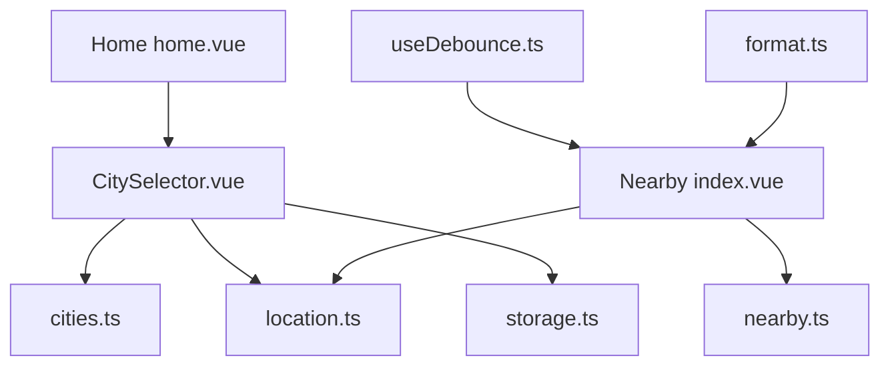

# Location & Geographic Components

<cite>
**Referenced Files in This Document**
- [CitySelector.vue](file://src/components/business/CitySelector.vue)
- [cities.ts](file://src/constants/cities.ts)
- [location.ts](file://src/api/modules/location.ts)
- [nearby.ts](file://src/api/modules/nearby.ts)
- [index.vue](file://src/pages/nearby/index.vue)
- [home.vue](file://src/pages/tabbar/home.vue)
- [storage.ts](file://src/utils/storage.ts)
- [useDebounce.ts](file://src/composables/useDebounce.ts)
- [format.ts](file://src/utils/format.ts)
- [city-selector-development.md](file://docs/refactry/city-selector-development.md)
- [nearby-people-development.md](file://docs/refactry/nearby-people-development.md)
</cite>

## Table of Contents
1. [Introduction](#introduction)
2. [Project Structure](#project-structure)
3. [Core Components](#core-components)
4. [Architecture Overview](#architecture-overview)
5. [Detailed Component Analysis](#detailed-component-analysis)
6. [Dependency Analysis](#dependency-analysis)
7. [Performance Considerations](#performance-considerations)
8. [Troubleshooting Guide](#troubleshooting-guide)
9. [Conclusion](#conclusion)
10. [Appendices](#appendices)

## Introduction
This document provides comprehensive documentation for the location and geographic components in the WeTogether platform. It focuses on the CitySelector component for location-based feature implementation, covering city selection interface, search functionality, and geographic data handling. It also details the integration with location services, user preference storage, geographic filtering, distance calculations, and location-aware feature activation. Guidance on customization options, internationalization support, and performance optimization for large city datasets is included.

## Project Structure
The location and geographic features are implemented across several modules:
- CitySelector component for city selection and user preference storage
- City data constants and search utilities
- Location service APIs for geocoding and user city persistence
- Nearby users page leveraging location services for proximity-based discovery
- Home page integration for city switching and recommendation refresh
- Utility modules for debouncing, formatting, and storage

**Diagram sources**
- [CitySelector.vue:1-521](file://src/components/business/CitySelector.vue#L1-L521)
- [cities.ts:1-186](file://src/constants/cities.ts#L1-L186)
- [location.ts:1-79](file://src/api/modules/location.ts#L1-L79)
- [nearby.ts:1-82](file://src/api/modules/nearby.ts#L1-L82)
- [index.vue:1-712](file://src/pages/nearby/index.vue#L1-L712)
- [home.vue:1-489](file://src/pages/tabbar/home.vue#L1-L489)
- [storage.ts:1-26](file://src/utils/storage.ts#L1-L26)
- [useDebounce.ts:1-153](file://src/composables/useDebounce.ts#L1-L153)
- [format.ts:1-38](file://src/utils/format.ts#L1-L38)

**Section sources**
- [CitySelector.vue:1-521](file://src/components/business/CitySelector.vue#L1-L521)
- [cities.ts:1-186](file://src/constants/cities.ts#L1-L186)
- [location.ts:1-79](file://src/api/modules/location.ts#L1-L79)
- [nearby.ts:1-82](file://src/api/modules/nearby.ts#L1-L82)
- [index.vue:1-712](file://src/pages/nearby/index.vue#L1-L712)
- [home.vue:1-489](file://src/pages/tabbar/home.vue#L1-L489)
- [storage.ts:1-26](file://src/utils/storage.ts#L1-L26)
- [useDebounce.ts:1-153](file://src/composables/useDebounce.ts#L1-L153)
- [format.ts:1-38](file://src/utils/format.ts#L1-L38)

## Core Components
- CitySelector: A modal-based city picker with location detection, search, hot cities, and alphabetical indexing.
- City Data Constants: Static city lists grouped by initial letter, with search and lookup utilities.
- Location Services: APIs for updating user location, retrieving current location, saving user-selected city, and visibility controls.
- Nearby Users: Location-aware discovery with distance filtering, gender filtering, and user interaction features.
- Home Integration: City switching triggers recommendation refresh and updates UI state.
- Utilities: Debounce composables, storage helpers, and time formatting utilities.

**Section sources**
- [CitySelector.vue:1-521](file://src/components/business/CitySelector.vue#L1-L521)
- [cities.ts:1-186](file://src/constants/cities.ts#L1-L186)
- [location.ts:1-79](file://src/api/modules/location.ts#L1-L79)
- [nearby.ts:1-82](file://src/api/modules/nearby.ts#L1-L82)
- [index.vue:1-712](file://src/pages/nearby/index.vue#L1-L712)
- [home.vue:1-489](file://src/pages/tabbar/home.vue#L1-L489)
- [storage.ts:1-26](file://src/utils/storage.ts#L1-L26)
- [useDebounce.ts:1-153](file://src/composables/useDebounce.ts#L1-L153)
- [format.ts:1-38](file://src/utils/format.ts#L1-L38)

## Architecture Overview
The geographic architecture integrates UI components with data and service layers:
- CitySelector interacts with city constants and location services to manage user preferences.
- Nearby page initializes location, applies filters, and displays proximity-based user results.
- Home page coordinates city selection and recommendation refresh.
- Storage utilities persist user preferences locally.
- Debounce and formatting utilities improve UX and maintain consistent time formatting.

**Diagram sources**
- [CitySelector.vue:149-229](file://src/components/business/CitySelector.vue#L149-L229)
- [cities.ts:138-170](file://src/constants/cities.ts#L138-L170)
- [location.ts:60-62](file://src/api/modules/location.ts#L60-L62)
- [home.vue:303-311](file://src/pages/tabbar/home.vue#L303-L311)

**Section sources**
- [CitySelector.vue:149-229](file://src/components/business/CitySelector.vue#L149-L229)
- [cities.ts:138-170](file://src/constants/cities.ts#L138-L170)
- [location.ts:60-62](file://src/api/modules/location.ts#L60-L62)
- [home.vue:303-311](file://src/pages/tabbar/home.vue#L303-L311)

## Detailed Component Analysis

### CitySelector Component
The CitySelector component provides a modal interface for city selection with:
- Current location section with automatic detection and re-detection
- Search box supporting Chinese, Pinyin, and initial-letter matching
- Hot cities grid for quick selection
- Alphabetical grouping and index bar for large city lists
- City selection persistence via user city API

Key behaviors:
- Search: Real-time filtering using city constants
- Location: Uses UniApp geolocation API with GCJ-02 coordinate system and fallbacks
- Selection: Saves city to backend and emits selection event
- UI: Slide-up modal animation, responsive layout, and clear feedback

**Diagram sources**
- [CitySelector.vue:149-229](file://src/components/business/CitySelector.vue#L149-L229)
- [cities.ts:138-170](file://src/constants/cities.ts#L138-L170)
- [location.ts:60-62](file://src/api/modules/location.ts#L60-L62)

**Section sources**
- [CitySelector.vue:1-521](file://src/components/business/CitySelector.vue#L1-L521)
- [cities.ts:1-186](file://src/constants/cities.ts#L1-L186)
- [location.ts:1-79](file://src/api/modules/location.ts#L1-L79)
- [city-selector-development.md:1-497](file://docs/refactry/city-selector-development.md#L1-L497)

### City Data Management
City data is organized in constants with:
- Hot cities for quick access
- Alphabetically grouped cities by initial letter
- Search function supporting multiple match criteria
- Lookup by code utility

Implementation highlights:
- City interface includes code, name, Pinyin, and initial
- Grouped records by initial letter for efficient rendering
- Search algorithm checks name, Pinyin, and initial matches

**Diagram sources**
- [cities.ts:8-186](file://src/constants/cities.ts#L8-L186)

**Section sources**
- [cities.ts:1-186](file://src/constants/cities.ts#L1-L186)

### Location Services Integration
Location services provide:
- Current location retrieval via backend geocoding
- User city saving and retrieval
- Visibility control for location sharing
- Coordinate-based geocoding for reverse lookup

Integration points:
- CitySelector uses current location API after successful device geolocation
- Nearby page initializes location and updates server-side location before fetching users
- Both components handle permission errors and timeouts gracefully

**Diagram sources**
- [CitySelector.vue:165-201](file://src/components/business/CitySelector.vue#L165-L201)
- [location.ts:40-42](file://src/api/modules/location.ts#L40-L42)

**Section sources**
- [location.ts:1-79](file://src/api/modules/location.ts#L1-L79)
- [CitySelector.vue:165-201](file://src/components/business/CitySelector.vue#L165-L201)
- [index.vue:214-244](file://src/pages/nearby/index.vue#L214-L244)

### Geographic Filtering and Distance Calculations
The Nearby page demonstrates geographic filtering:
- Distance filters: 1km, 3km, 5km, 10km, 20km, unlimited
- Gender filters: male, female, unspecified
- Proximity-based user list with distance and activity metadata
- Automatic location initialization with fallback to default coordinates

**Diagram sources**
- [index.vue:214-298](file://src/pages/nearby/index.vue#L214-L298)
- [nearby.ts:41-49](file://src/api/modules/nearby.ts#L41-L49)

**Section sources**
- [index.vue:1-712](file://src/pages/nearby/index.vue#L1-L712)
- [nearby.ts:1-82](file://src/api/modules/nearby.ts#L1-L82)

### User Preference Storage
City selection and other preferences are persisted using:
- Local storage wrapper for simple key-value persistence
- Backend APIs for cross-device synchronization

Usage patterns:
- City selection saves to backend via saveUserCity
- Storage utilities provide get/set/remove/clear operations

**Section sources**
- [location.ts:60-70](file://src/api/modules/location.ts#L60-L70)
- [storage.ts:1-26](file://src/utils/storage.ts#L1-L26)

### Home Page Integration
The Home page integrates CitySelector to:
- Allow city switching from the top navigation
- Trigger recommendation refresh upon city change
- Maintain current city state across the app

**Section sources**
- [home.vue:119-125](file://src/pages/tabbar/home.vue#L119-L125)
- [home.vue:303-311](file://src/pages/tabbar/home.vue#L303-L311)

### Internationalization Support
While the current implementation focuses on Chinese city names and Pinyin, the architecture supports internationalization:
- Search algorithm can be extended to support additional languages
- City data structure accommodates localized names
- UI strings can be externalized for localization

**Section sources**
- [city-selector-development.md:465-467](file://docs/refactry/city-selector-development.md#L465-L467)

## Dependency Analysis
The geographic components exhibit clear separation of concerns:
- UI components depend on constants and services
- Services encapsulate network requests
- Utilities provide shared functionality
- Pages orchestrate component interactions

**Diagram sources**
- [CitySelector.vue:118-123](file://src/components/business/CitySelector.vue#L118-L123)
- [cities.ts:1-186](file://src/constants/cities.ts#L1-L186)
- [location.ts:1-79](file://src/api/modules/location.ts#L1-L79)
- [nearby.ts:1-82](file://src/api/modules/nearby.ts#L1-L82)
- [index.vue:140-144](file://src/pages/nearby/index.vue#L140-L144)
- [home.vue:120-125](file://src/pages/tabbar/home.vue#L120-L125)
- [useDebounce.ts:1-153](file://src/composables/useDebounce.ts#L1-L153)
- [format.ts:1-38](file://src/utils/format.ts#L1-L38)

**Section sources**
- [CitySelector.vue:118-123](file://src/components/business/CitySelector.vue#L118-L123)
- [index.vue:140-144](file://src/pages/nearby/index.vue#L140-L144)
- [home.vue:120-125](file://src/pages/tabbar/home.vue#L120-L125)

## Performance Considerations
- Debounce and prevent duplicate requests to reduce network overhead
- Use virtualized scrolling for large city lists and user feeds
- Cache frequently accessed data (e.g., city groups, user stats)
- Minimize re-renders by using computed properties and reactive refs
- Optimize search algorithm for large datasets (e.g., precompute indices)
- Lazy-load images and defer non-critical computations

**Section sources**
- [useDebounce.ts:1-153](file://src/composables/useDebounce.ts#L1-L153)
- [index.vue:257-298](file://src/pages/nearby/index.vue#L257-L298)
- [CitySelector.vue:62-101](file://src/components/business/CitySelector.vue#L62-L101)

## Troubleshooting Guide
Common issues and resolutions:
- Location permissions denied: Prompt user to enable location services and provide a fallback city
- Timeout during geolocation: Retry mechanism with user feedback
- Network failures: Graceful degradation with cached or default data
- Empty search results: Clear search input or suggest popular cities
- City selection not persisting: Verify backend save endpoint and error handling

**Section sources**
- [CitySelector.vue:182-201](file://src/components/business/CitySelector.vue#L182-L201)
- [index.vue:225-244](file://src/pages/nearby/index.vue#L225-L244)
- [nearby-people-development.md:564-587](file://docs/refactry/nearby-people-development.md#L564-L587)

## Conclusion
The WeTogether platform’s location and geographic components provide a robust foundation for location-based features. The CitySelector component offers a comprehensive city selection experience, while the Nearby page enables proximity-based social discovery. With clear separation of concerns, modular APIs, and extensible architecture, the system supports future enhancements such as internationalization, advanced filtering, and improved performance optimizations.

## Appendices

### API Definitions
- Location APIs: updateLocation, getCurrentLocation, getCityByCoordinates, saveUserCity, getUserCity, setLocationVisibility
- Nearby APIs: getNearbyUsers, sayHello, recordVisit, getNearbyStats

**Section sources**
- [location.ts:1-79](file://src/api/modules/location.ts#L1-L79)
- [nearby.ts:1-82](file://src/api/modules/nearby.ts#L1-L82)

### UI Interaction Examples
- City selection flow: Open selector → search or browse → select → save → refresh recommendations
- Nearby filtering: Open filters → choose distance/gender → apply → reload users

**Section sources**
- [CitySelector.vue:149-229](file://src/components/business/CitySelector.vue#L149-L229)
- [index.vue:322-349](file://src/pages/nearby/index.vue#L322-L349)