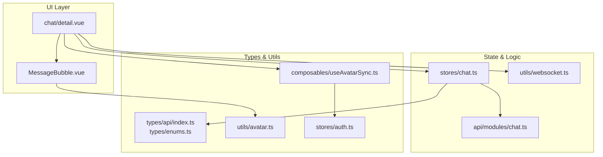
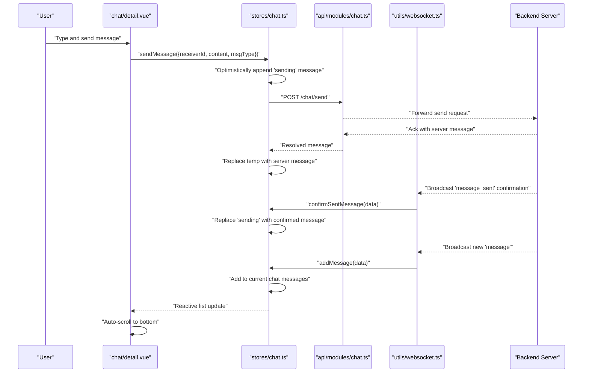
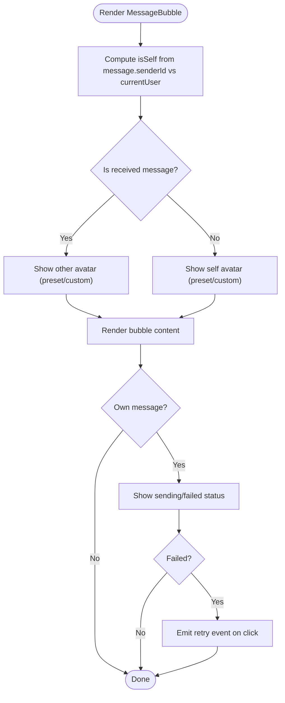
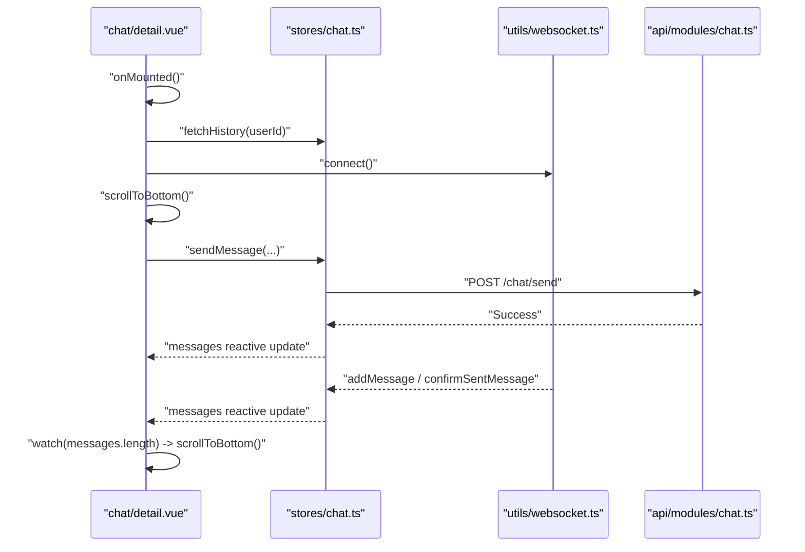
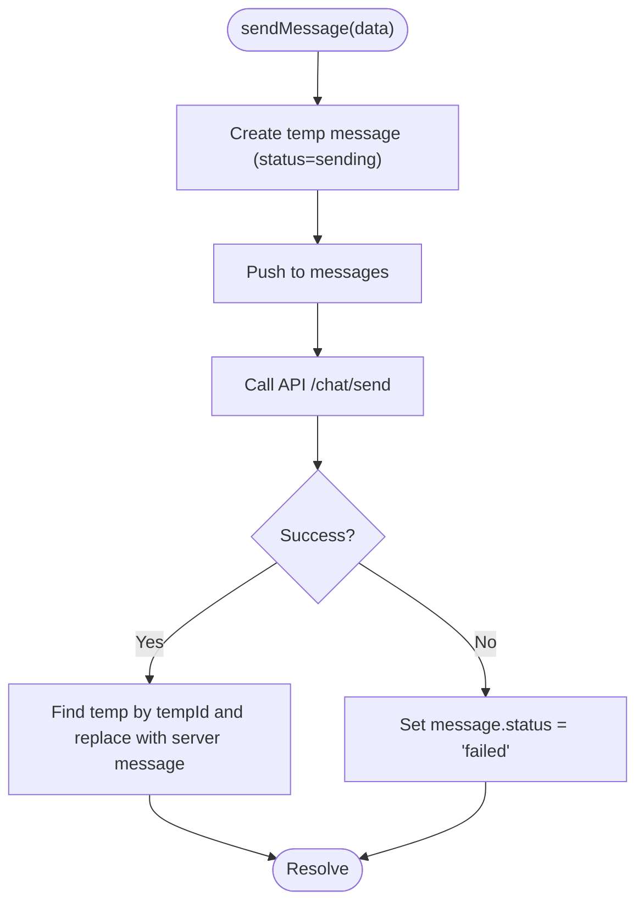
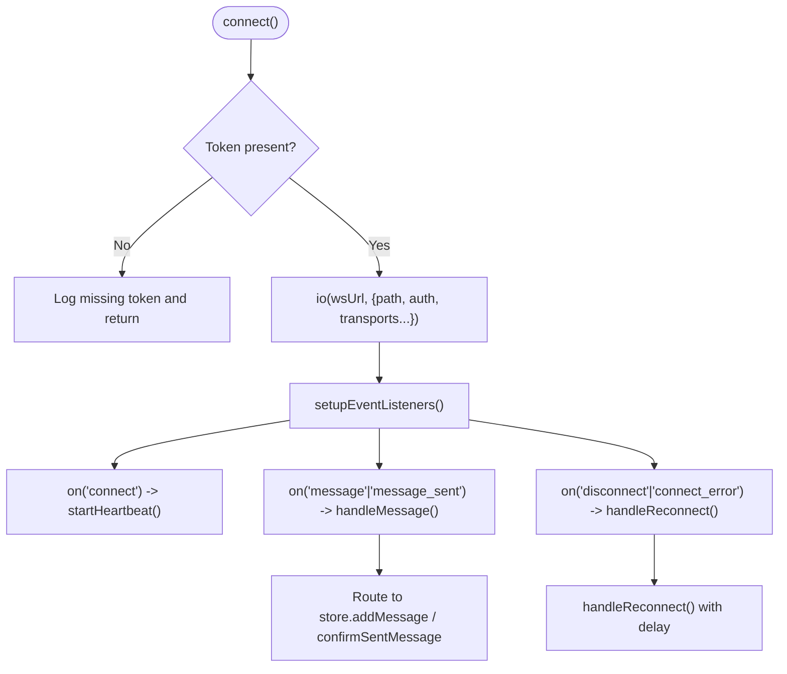
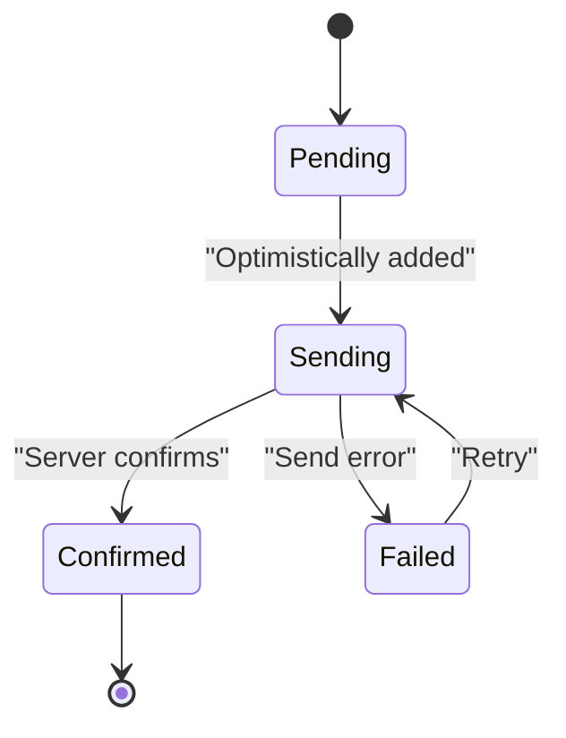
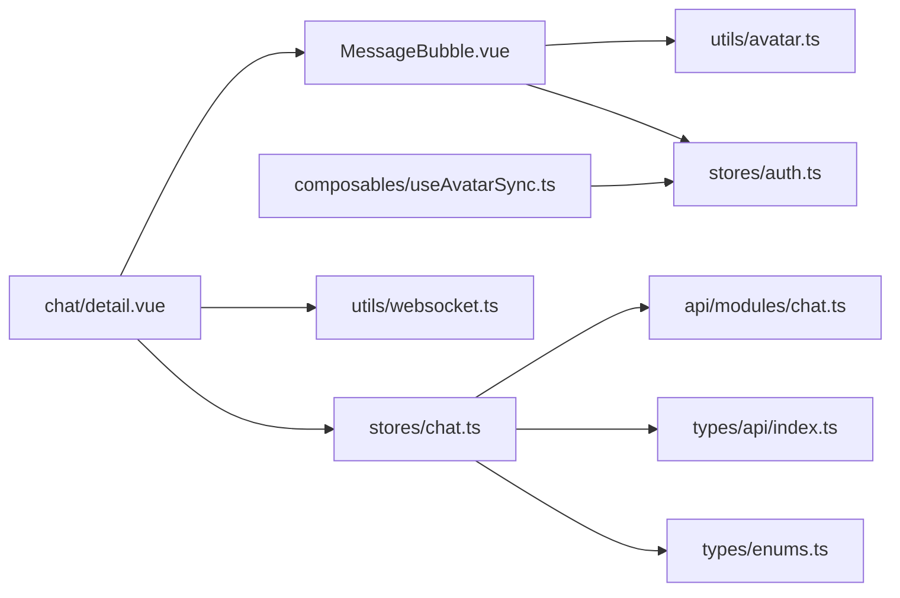

# Messaging & Communication Components

<cite>
**Referenced Files in This Document**
- [MessageBubble.vue](file://src/components/business/MessageBubble.vue)
- [detail.vue](file://src/pages/chat/detail.vue)
- [chat.ts](file://src/stores/chat.ts)
- [websocket.ts](file://src/utils/websocket.ts)
- [chat.ts](file://src/api/modules/chat.ts)
- [enums.ts](file://src/types/enums.ts)
- [index.ts](file://src/types/api/index.ts)
- [backend-types.ts](file://src/types/api/backend-types.ts)
- [useAvatarSync.ts](file://src/composables/useAvatarSync.ts)
- [avatar.ts](file://src/utils/avatar.ts)
- [auth.ts](file://src/stores/auth.ts)
</cite>

## Table of Contents
1. [Introduction](#introduction)
2. [Project Structure](#project-structure)
3. [Core Components](#core-components)
4. [Architecture Overview](#architecture-overview)
5. [Detailed Component Analysis](#detailed-component-analysis)
6. [Dependency Analysis](#dependency-analysis)
7. [Performance Considerations](#performance-considerations)
8. [Troubleshooting Guide](#troubleshooting-guide)
9. [Conclusion](#conclusion)

## Introduction
This document explains the messaging and real-time communication components in the WeTogether platform. It focuses on the MessageBubble component for rendering individual chat messages, the surrounding infrastructure for WebSocket-driven real-time updates, message queuing and optimistic updates, delivery status tracking, and integration patterns with the chat store and API.

## Project Structure
The messaging system spans several layers:
- UI component: MessageBubble renders a single message bubble with styling for sent/received, optional sender avatar, status indicators, and optional time display.
- Page container: Chat detail page orchestrates message list rendering, input handling, sending, retry logic, and scrolling behavior.
- Store: Pinia chat store manages conversations, current chat context, message history, optimistic sends, and WebSocket-driven updates.
- WebSocket manager: Centralized connection handling, reconnection, heartbeat, and event routing.
- API module: Chat API endpoints for sending, fetching history, conversations, and marking as read.
- Types: Strongly typed message and conversation models, plus enums for message types.
- Utilities: Avatar resolution helpers and headless avatar sync hook for dynamic avatar updates.

**Diagram sources**
- [MessageBubble.vue:1-309](file://src/components/business/MessageBubble.vue#L1-L309)
- [detail.vue:1-299](file://src/pages/chat/detail.vue#L1-L299)
- [chat.ts:1-234](file://src/stores/chat.ts#L1-L234)
- [websocket.ts:1-171](file://src/utils/websocket.ts#L1-L171)
- [chat.ts:1-46](file://src/api/modules/chat.ts#L1-L46)
- [index.ts:25-34](file://src/types/api/index.ts#L25-L34)
- [enums.ts:7-11](file://src/types/enums.ts#L7-L11)
- [avatar.ts:53-92](file://src/utils/avatar.ts#L53-L92)
- [useAvatarSync.ts:1-72](file://src/composables/useAvatarSync.ts#L1-L72)
- [auth.ts:79-117](file://src/stores/auth.ts#L79-L117)

**Section sources**
- [MessageBubble.vue:1-309](file://src/components/business/MessageBubble.vue#L1-L309)
- [detail.vue:1-299](file://src/pages/chat/detail.vue#L1-L299)
- [chat.ts:1-234](file://src/stores/chat.ts#L1-L234)
- [websocket.ts:1-171](file://src/utils/websocket.ts#L1-L171)
- [chat.ts:1-46](file://src/api/modules/chat.ts#L1-L46)
- [index.ts:25-34](file://src/types/api/index.ts#L25-L34)
- [enums.ts:7-11](file://src/types/enums.ts#L7-L11)
- [avatar.ts:53-92](file://src/utils/avatar.ts#L53-L92)
- [useAvatarSync.ts:1-72](file://src/composables/useAvatarSync.ts#L1-L72)
- [auth.ts:79-117](file://src/stores/auth.ts#L79-L117)

## Core Components
- MessageBubble: Renders a single message with:
  - Timestamp display option
  - Sender avatar (pre-set MBTI or custom image)
  - Content area with text
  - Status indicator for own messages (sending, failed)
  - Retry action for failed sends
  - Self vs other styling (left/right alignment, colors)
- Chat detail page: Renders the message list, handles input, sends messages, scrolls to bottom, and wires retry events.
- Chat store: Manages message list, optimistic updates, WebSocket-driven adds and confirmations, conversation metadata, and read status.
- WebSocket manager: Connects via Socket.IO, handles ping/pong heartbeats, routes incoming message and confirmation events, and reconnects on failure.
- API module: Provides endpoints for sending, fetching history, conversations, and marking as read.
- Types and enums: Define message shape, conversation model, and message type values.

**Section sources**
- [MessageBubble.vue:1-309](file://src/components/business/MessageBubble.vue#L1-L309)
- [detail.vue:1-299](file://src/pages/chat/detail.vue#L1-L299)
- [chat.ts:1-234](file://src/stores/chat.ts#L1-L234)
- [websocket.ts:1-171](file://src/utils/websocket.ts#L1-L171)
- [chat.ts:1-46](file://src/api/modules/chat.ts#L1-L46)
- [index.ts:25-34](file://src/types/api/index.ts#L25-L34)
- [enums.ts:7-11](file://src/types/enums.ts#L7-L11)

## Architecture Overview
The real-time messaging pipeline integrates UI, store, WebSocket, and API layers:

**Diagram sources**
- [detail.vue:131-148](file://src/pages/chat/detail.vue#L131-L148)
- [chat.ts:50-90](file://src/stores/chat.ts#L50-L90)
- [chat.ts:161-210](file://src/stores/chat.ts#L161-L210)
- [websocket.ts:93-111](file://src/utils/websocket.ts#L93-L111)
- [chat.ts:18-48](file://src/stores/chat.ts#L18-L48)

## Detailed Component Analysis

### MessageBubble Component
MessageBubble encapsulates the visual and interactive rendering of a single chat message. Key behaviors:
- Determines whether the message belongs to the current user and applies appropriate styles.
- Displays sender avatar for received messages and self avatar for sent messages.
- Shows status indicators for own messages:
  - Sending: animated dots
  - Failed: clickable error badge to retry
- Supports optional timestamp display centered above the bubble.
- Applies entrance animation on mount for a smooth reveal.

Rendering logic highlights:
- Conditional rendering of avatar wrappers for left (received) and right (sent) positions.
- Bubble content area with text wrapping and sizing.
- Status area positioned adjacent to content for visual clarity.
- SCSS-based styling differentiates sent vs received bubbles and includes animations.

Integration patterns:
- Emits retry event to parent for failed messages.
- Uses avatar resolution utilities to choose between preset MBTI icons and custom images.
- Relies on auth store to identify the current user.

**Diagram sources**
- [MessageBubble.vue:68-115](file://src/components/business/MessageBubble.vue#L68-L115)
- [MessageBubble.vue:86-104](file://src/components/business/MessageBubble.vue#L86-L104)
- [avatar.ts:53-92](file://src/utils/avatar.ts#L53-L92)

**Section sources**
- [MessageBubble.vue:1-309](file://src/components/business/MessageBubble.vue#L1-L309)
- [avatar.ts:53-92](file://src/utils/avatar.ts#L53-L92)

### Chat Detail Page
The chat detail page composes the message list and input bar:
- Renders MessageBubble instances for each message in the store.
- Handles input text, debounced send button, and network checks before sending.
- Loads historical messages, marks as read, and scrolls to bottom after render.
- Listens to reactive message count to auto-scroll when new messages arrive.
- Integrates avatar sync for dynamic sender avatar updates.

Real-time integration:
- Initializes WebSocket connection on mount.
- Wires retry handler to resend failed messages using the same API.

**Diagram sources**
- [detail.vue:77-102](file://src/pages/chat/detail.vue#L77-L102)
- [detail.vue:116-129](file://src/pages/chat/detail.vue#L116-L129)
- [detail.vue:131-148](file://src/pages/chat/detail.vue#L131-L148)
- [detail.vue:150-163](file://src/pages/chat/detail.vue#L150-L163)
- [chat.ts:27-48](file://src/stores/chat.ts#L27-L48)
- [websocket.ts:93-111](file://src/utils/websocket.ts#L93-L111)

**Section sources**
- [detail.vue:1-299](file://src/pages/chat/detail.vue#L1-L299)
- [chat.ts:27-48](file://src/stores/chat.ts#L27-L48)
- [websocket.ts:93-111](file://src/utils/websocket.ts#L93-L111)

### Chat Store (Pinia)
Responsibilities:
- Maintain conversations, current chat context, and message list.
- Optimistic message sending:
  - Append a temporary message with status "sending".
  - On success, replace with server-provided message.
  - On failure, set status to "failed".
- WebSocket-driven updates:
  - addMessage: deduplicate, compute isSelf, add to current chat if applicable, update conversation metadata.
  - confirmSentMessage: replace temporary "sending" messages with confirmed server messages, handle multi-device scenarios.
- History loading and read marking.

Message identity and deduplication:
- Converts backend numeric IDs to numbers for comparison.
- Checks existing message IDs to avoid duplicates.

**Diagram sources**
- [chat.ts:50-90](file://src/stores/chat.ts#L50-L90)

**Section sources**
- [chat.ts:1-234](file://src/stores/chat.ts#L1-L234)

### WebSocket Manager
Connection lifecycle:
- Establishes Socket.IO connection with auth token and path "/api/v1/ws".
- Starts periodic heartbeat ("ping") while connected.
- Handles reconnection with exponential-like delays up to a maximum attempt count.
- Routes incoming events:
  - "message": pass to store.addMessage
  - "message_sent": pass to store.confirmSentMessage
  - Direct message objects: pass to store.addMessage

**Diagram sources**
- [websocket.ts:15-53](file://src/utils/websocket.ts#L15-L53)
- [websocket.ts:55-91](file://src/utils/websocket.ts#L55-L91)
- [websocket.ts:93-111](file://src/utils/websocket.ts#L93-L111)
- [websocket.ts:128-141](file://src/utils/websocket.ts#L128-L141)

**Section sources**
- [websocket.ts:1-171](file://src/utils/websocket.ts#L1-171)

### Message Rendering Logic and Styling
- Sent vs received:
  - Received: left-aligned with sender avatar on the left, light bubble background.
  - Sent: right-aligned with self avatar on the right, distinct green background.
- Status indicators:
  - Sending: animated three-dot loader.
  - Failed: small red circular error badge; clicking triggers retry.
- Time display:
  - Optional centered timestamp above the bubble when enabled.
- Animation:
  - Entrance animation on mount for a subtle slide-in effect.

Media and rich content:
- Current message model supports text and numeric message types.
- The component renders message content as text; media attachments would require extending the model and adding specialized renderers in the future.

**Section sources**
- [MessageBubble.vue:86-115](file://src/components/business/MessageBubble.vue#L86-L115)
- [MessageBubble.vue:138-284](file://src/components/business/MessageBubble.vue#L138-L284)
- [enums.ts:7-11](file://src/types/enums.ts#L7-L11)

### Real-Time Updates and Delivery Status Tracking
- Optimistic UI: immediately shows "sending" while the request is in flight.
- Confirmation: server confirms successful send; the store replaces the temporary message with the server-provided one.
- Failure: server errors or transport failures set status to "failed"; user can retry.
- Live updates: new messages are appended reactively; unread counts are managed per conversation.

**Diagram sources**
- [chat.ts:50-90](file://src/stores/chat.ts#L50-L90)
- [chat.ts:161-210](file://src/stores/chat.ts#L161-L210)

**Section sources**
- [chat.ts:50-90](file://src/stores/chat.ts#L50-L90)
- [chat.ts:161-210](file://src/stores/chat.ts#L161-L210)

### Integration Patterns with WebSocket, Message Queuing, and Delivery Status
- WebSocket connection is established on page mount and automatically reconnects on disconnect.
- Incoming "message_sent" events confirm optimistic sends; "message" events add new messages to the current chat.
- Message queuing:
  - Temporary messages are queued locally until confirmed by the server.
  - Deduplication prevents duplicate messages from appearing.
- Delivery status:
  - UI reflects "sending", "failed", and "confirmed" states.
  - Retry action resends the failed message via the same API path.

**Section sources**
- [detail.vue:97-101](file://src/pages/chat/detail.vue#L97-L101)
- [websocket.ts:93-111](file://src/utils/websocket.ts#L93-L111)
- [chat.ts:100-158](file://src/stores/chat.ts#L100-L158)
- [chat.ts:161-210](file://src/stores/chat.ts#L161-L210)

### Examples of Message Formatting and Rich Content Display
- Text messages: rendered as plain text with word wrapping and pre-wrap behavior.
- Future extensions:
  - Extend the message model to include media URLs and metadata.
  - Add specialized renderers for images, audio, or rich HTML content.
  - Integrate with the existing avatar resolution utilities for sender avatars.

Note: The current implementation focuses on text content and does not include media rendering logic.

**Section sources**
- [MessageBubble.vue:42-44](file://src/components/business/MessageBubble.vue#L42-L44)
- [index.ts:26-34](file://src/types/api/index.ts#L26-L34)

### User Interaction Patterns Within Chat Interfaces
- Compose and send:
  - Input field with placeholder and keyboard confirm handler.
  - Debounced send button with disabled states during sending.
- Retry failed messages:
  - Clickable error badge triggers a retry via the same send flow.
- Auto-scroll:
  - Scroll to bottom after initial load and after each new message.
- Avatar updates:
  - Dynamic avatar changes propagate across the list via global event bus and a dedicated sync hook.

**Section sources**
- [detail.vue:30-46](file://src/pages/chat/detail.vue#L30-L46)
- [detail.vue:150-163](file://src/pages/chat/detail.vue#L150-L163)
- [detail.vue:165-171](file://src/pages/chat/detail.vue#L165-L171)
- [useAvatarSync.ts:1-72](file://src/composables/useAvatarSync.ts#L1-L72)
- [auth.ts:79-117](file://src/stores/auth.ts#L79-L117)

## Dependency Analysis
High-level dependencies among messaging components:

**Diagram sources**
- [MessageBubble.vue:68-115](file://src/components/business/MessageBubble.vue#L68-L115)
- [avatar.ts:53-92](file://src/utils/avatar.ts#L53-L92)
- [auth.ts:79-117](file://src/stores/auth.ts#L79-L117)
- [detail.vue:50-57](file://src/pages/chat/detail.vue#L50-L57)
- [chat.ts:1-234](file://src/stores/chat.ts#L1-234)
- [websocket.ts:1-171](file://src/utils/websocket.ts#L1-L171)
- [chat.ts:1-46](file://src/api/modules/chat.ts#L1-L46)
- [index.ts:25-34](file://src/types/api/index.ts#L25-L34)
- [enums.ts:7-11](file://src/types/enums.ts#L7-L11)
- [useAvatarSync.ts:1-72](file://src/composables/useAvatarSync.ts#L1-L72)

**Section sources**
- [MessageBubble.vue:68-115](file://src/components/business/MessageBubble.vue#L68-L115)
- [detail.vue:50-57](file://src/pages/chat/detail.vue#L50-L57)
- [chat.ts:1-234](file://src/stores/chat.ts#L1-L234)
- [websocket.ts:1-171](file://src/utils/websocket.ts#L1-L171)
- [chat.ts:1-46](file://src/api/modules/chat.ts#L1-L46)
- [index.ts:25-34](file://src/types/api/index.ts#L25-L34)
- [enums.ts:7-11](file://src/types/enums.ts#L7-L11)
- [avatar.ts:53-92](file://src/utils/avatar.ts#L53-L92)
- [useAvatarSync.ts:1-72](file://src/composables/useAvatarSync.ts#L1-L72)
- [auth.ts:79-117](file://src/stores/auth.ts#L79-L117)

## Performance Considerations
- Virtual scrolling: Consider implementing virtualized lists for long message histories to reduce DOM nodes and improve scroll performance.
- Debouncing: The send button is already debounced; keep thresholds reasonable to balance responsiveness and network usage.
- Reconnection backoff: The WebSocket manager uses incremental reconnection attempts; ensure limits match expected network conditions.
- Rendering: Keep message content lightweight; defer heavy computations off the render thread.
- Deduplication: The store already deduplicates messages; maintain this pattern to prevent redundant renders.

## Troubleshooting Guide
Common issues and resolutions:
- Messages not appearing:
  - Verify WebSocket connection and that "message" events are routed to the store.
  - Confirm current chat context so new messages are added to the active conversation.
- Retry not working:
  - Ensure the retry handler calls the same send method with the original content.
  - Check that the store replaces "failed" messages with a new send attempt.
- Avatar not updating:
  - Confirm avatar sync hook is attached to the message list.
  - Ensure global avatar update events are emitted when user profiles change.
- Sending stuck on "sending":
  - Inspect API response; if the server fails to acknowledge, the store sets status to "failed".
  - Verify token presence for WebSocket and API requests.

**Section sources**
- [websocket.ts:93-111](file://src/utils/websocket.ts#L93-L111)
- [chat.ts:100-158](file://src/stores/chat.ts#L100-L158)
- [chat.ts:161-210](file://src/stores/chat.ts#L161-L210)
- [useAvatarSync.ts:60-66](file://src/composables/useAvatarSync.ts#L60-L66)
- [auth.ts:79-117](file://src/stores/auth.ts#L79-L117)

## Conclusion
The messaging system combines a reusable MessageBubble component with a robust store and WebSocket-driven real-time updates. It supports optimistic sends, delivery status tracking, and dynamic avatar updates. Extending the system to support rich content and media attachments requires augmenting the message model and adding specialized renderers while preserving the existing architecture and patterns.