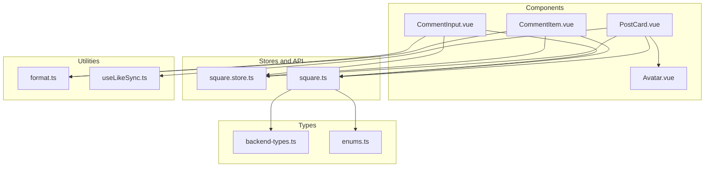
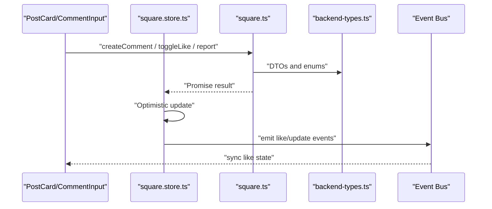
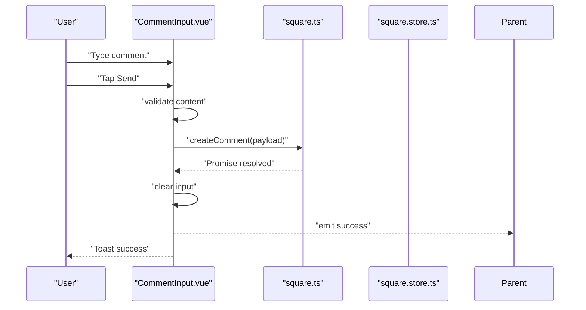
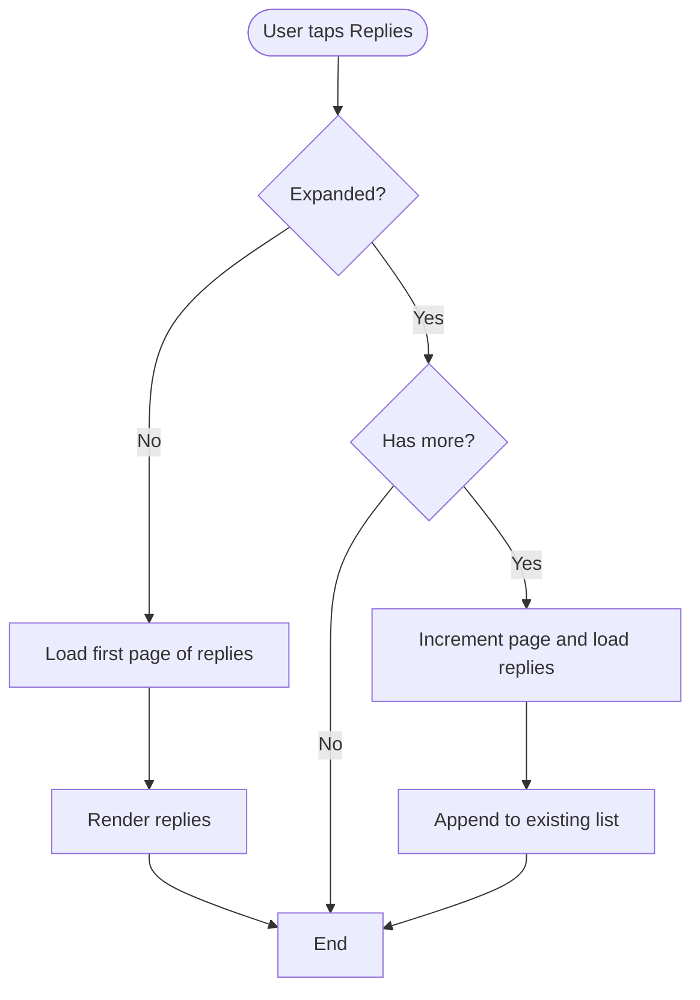
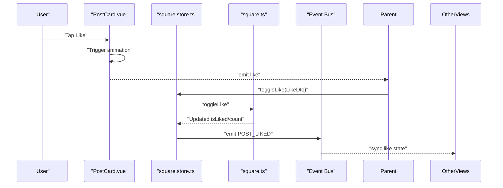
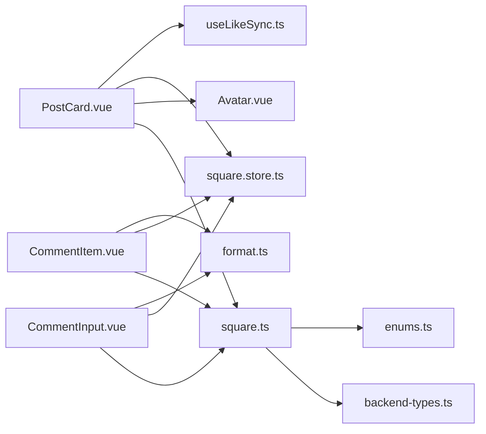

# Social Interaction Components

<cite>
**Referenced Files in This Document**
- [CommentInput.vue](file://src/components/business/CommentInput.vue)
- [CommentItem.vue](file://src/components/business/CommentItem.vue)
- [PostCard.vue](file://src/components/business/PostCard.vue)
- [Avatar.vue](file://src/components/common/Avatar.vue)
- [square.ts](file://src/api/modules/square.ts)
- [square.store.ts](file://src/stores/square.ts)
- [useLikeSync.ts](file://src/composables/useLikeSync.ts)
- [format.ts](file://src/utils/format.ts)
- [backend-types.ts](file://src/types/api/backend-types.ts)
- [enums.ts](file://src/types/enums.ts)
</cite>

## Table of Contents
1. [Introduction](#introduction)
2. [Project Structure](#project-structure)
3. [Core Components](#core-components)
4. [Architecture Overview](#architecture-overview)
5. [Detailed Component Analysis](#detailed-component-analysis)
6. [Dependency Analysis](#dependency-analysis)
7. [Performance Considerations](#performance-considerations)
8. [Troubleshooting Guide](#troubleshooting-guide)
9. [Conclusion](#conclusion)
10. [Appendices](#appendices)

## Introduction
This document explains the social interaction components that power community engagement in the WeTogether platform. It focuses on three primary building blocks:
- CommentInput: captures user comments, supports threading, and integrates with the social API.
- CommentItem: renders individual comments with avatars, timestamps, nested replies, and actions.
- PostCard: displays posts with metadata, engagement metrics, and action controls (likes, comments, shares), including reporting and deletion flows.

The documentation covers data binding patterns, event handling, API integration, and responsive design considerations. It also includes usage examples for comment threading, post filtering, and real-time-like updates via event bus synchronization.

## Project Structure
The social interaction features are implemented as Vue Single File Components (SFCs) under the business components folder, integrated with a shared API module, Pinia store, and utility helpers.

**Diagram sources**
- [CommentInput.vue:1-123](file://src/components/business/CommentInput.vue#L1-L123)
- [CommentItem.vue:1-187](file://src/components/business/CommentItem.vue#L1-L187)
- [PostCard.vue:1-628](file://src/components/business/PostCard.vue#L1-L628)
- [Avatar.vue:1-95](file://src/components/common/Avatar.vue#L1-L95)
- [square.ts:1-98](file://src/api/modules/square.ts#L1-L98)
- [square.store.ts:1-152](file://src/stores/square.ts#L1-L152)
- [useLikeSync.ts:1-49](file://src/composables/useLikeSync.ts#L1-L49)
- [format.ts:1-38](file://src/utils/format.ts#L1-L38)
- [backend-types.ts:427-535](file://src/types/api/backend-types.ts#L427-L535)
- [enums.ts:13-24](file://src/types/enums.ts#L13-L24)

**Section sources**
- [CommentInput.vue:1-123](file://src/components/business/CommentInput.vue#L1-L123)
- [CommentItem.vue:1-187](file://src/components/business/CommentItem.vue#L1-L187)
- [PostCard.vue:1-628](file://src/components/business/PostCard.vue#L1-L628)
- [Avatar.vue:1-95](file://src/components/common/Avatar.vue#L1-L95)
- [square.ts:1-98](file://src/api/modules/square.ts#L1-L98)
- [square.store.ts:1-152](file://src/stores/square.ts#L1-L152)
- [useLikeSync.ts:1-49](file://src/composables/useLikeSync.ts#L1-L49)
- [format.ts:1-38](file://src/utils/format.ts#L1-L38)
- [backend-types.ts:427-535](file://src/types/api/backend-types.ts#L427-L535)
- [enums.ts:13-24](file://src/types/enums.ts#L13-L24)

## Core Components
- CommentInput: A lightweight input component that validates content length, handles debounced submission, and emits success events for parent components to refresh lists.
- CommentItem: Renders a single comment with avatar, user info, timestamp, optional reply indicator, and actions (expand replies, reply). Supports pagination of nested replies.
- PostCard: Displays post content, images, engagement metrics, and action buttons (like, comment, share). Includes reporting and deletion flows, plus animated like feedback.

These components rely on:
- square API module for network requests.
- Pinia store for centralized state and optimistic updates.
- Utility functions for time formatting.
- Event bus for cross-component like synchronization.

**Section sources**
- [CommentInput.vue:20-74](file://src/components/business/CommentInput.vue#L20-L74)
- [CommentItem.vue:47-111](file://src/components/business/CommentItem.vue#L47-L111)
- [PostCard.vue:96-290](file://src/components/business/PostCard.vue#L96-L290)
- [square.ts:43-97](file://src/api/modules/square.ts#L43-L97)
- [square.store.ts:13-151](file://src/stores/square.ts#L13-L151)
- [format.ts:8-23](file://src/utils/format.ts#L8-L23)

## Architecture Overview
The components follow a unidirectional data flow:
- UI triggers actions via events.
- Components call the square API module.
- The store executes API calls and updates local state.
- Event bus propagates like updates to keep UI consistent across pages.
- Utilities provide formatting and display helpers.

**Diagram sources**
- [PostCard.vue:162-186](file://src/components/business/PostCard.vue#L162-L186)
- [CommentInput.vue:53-73](file://src/components/business/CommentInput.vue#L53-L73)
- [square.ts:43-97](file://src/api/modules/square.ts#L43-L97)
- [square.store.ts:95-128](file://src/stores/square.ts#L95-L128)
- [backend-types.ts:474-495](file://src/types/api/backend-types.ts#L474-L495)
- [enums.ts:13-24](file://src/types/enums.ts#L13-L24)

## Detailed Component Analysis

### CommentInput Component
Responsibilities:
- Capture user input with reactive binding.
- Compute dynamic placeholder based on reply context.
- Debounce submission to prevent rapid double-clicks.
- Submit comment via square API with proper threading fields.
- Emit success event to notify parent for refresh.
- Provide visual feedback and disablement during loading.

Validation and limits:
- Submission is disabled when input is empty or while loading.
- Parent components can enforce content length constraints if needed.

Integration points:
- Uses square API for creating comments.
- Emits success to trigger list refresh.

**Diagram sources**
- [CommentInput.vue:35-73](file://src/components/business/CommentInput.vue#L35-L73)
- [square.ts:56-57](file://src/api/modules/square.ts#L56-L57)
- [square.store.ts:61-74](file://src/stores/square.ts#L61-L74)

**Section sources**
- [CommentInput.vue:20-74](file://src/components/business/CommentInput.vue#L20-L74)
- [square.ts:18-24](file://src/api/modules/square.ts#L18-L24)
- [square.store.ts:61-74](file://src/stores/square.ts#L61-L74)

### CommentItem Component
Responsibilities:
- Render comment header with avatar, nickname, and formatted timestamp.
- Display reply indicator when applicable.
- Provide actions: expand/collapse replies and reply.
- Lazy-load replies with pagination (page size constant inside component).
- Compute “load more” visibility based on reply count vs loaded replies.

Threading and pagination:
- Expands replies on first click if none are loaded.
- Subsequent pages append to existing list.
- Uses component-local state for expansion and pagination.

**Diagram sources**
- [CommentItem.vue:70-106](file://src/components/business/CommentItem.vue#L70-L106)

**Section sources**
- [CommentItem.vue:47-111](file://src/components/business/CommentItem.vue#L47-L111)
- [format.ts:8-23](file://src/utils/format.ts#L8-L23)

### PostCard Component
Responsibilities:
- Display post author avatar, nickname, and relative timestamp.
- Render content and optional image grid with lazy loading and shimmer placeholders.
- Provide action buttons: like, comment, share.
- Handle like animations and particle effects.
- Support reporting flow with predefined reasons and free-text input.
- Offer delete action for own posts and report action for others.

Event handling:
- Emits click, like, comment, share, report, delete events for parent orchestration.
- Uses uni-app APIs for navigation, previews, modals, and action sheets.

**Diagram sources**
- [PostCard.vue:162-186](file://src/components/business/PostCard.vue#L162-L186)
- [square.store.ts:95-128](file://src/stores/square.ts#L95-L128)
- [square.ts:86-93](file://src/api/modules/square.ts#L86-L93)
- [useLikeSync.ts:16-48](file://src/composables/useLikeSync.ts#L16-L48)

**Section sources**
- [PostCard.vue:96-290](file://src/components/business/PostCard.vue#L96-L290)
- [Avatar.vue:1-95](file://src/components/common/Avatar.vue#L1-L95)
- [square.store.ts:95-128](file://src/stores/square.ts#L95-L128)
- [square.ts:86-93](file://src/api/modules/square.ts#L86-L93)
- [useLikeSync.ts:16-48](file://src/composables/useLikeSync.ts#L16-L48)

## Dependency Analysis
- Components depend on:
  - square API module for CRUD operations on posts and comments.
  - Pinia store for state and optimistic updates.
  - Event bus for cross-page like synchronization.
  - Utility functions for time formatting.
  - Shared types for DTOs and enums.

**Diagram sources**
- [CommentInput.vue:20-23](file://src/components/business/CommentInput.vue#L20-L23)
- [CommentItem.vue:48-49](file://src/components/business/CommentItem.vue#L48-L49)
- [PostCard.vue:98-100](file://src/components/business/PostCard.vue#L98-L100)
- [Avatar.vue:1-95](file://src/components/common/Avatar.vue#L1-L95)
- [square.ts:1-11](file://src/api/modules/square.ts#L1-L11)
- [square.store.ts:1-11](file://src/stores/square.ts#L1-L11)
- [useLikeSync.ts:1-4](file://src/composables/useLikeSync.ts#L1-L4)
- [format.ts:1-6](file://src/utils/format.ts#L1-L6)
- [backend-types.ts:427-535](file://src/types/api/backend-types.ts#L427-L535)
- [enums.ts:13-24](file://src/types/enums.ts#L13-L24)

**Section sources**
- [CommentInput.vue:20-23](file://src/components/business/CommentInput.vue#L20-L23)
- [CommentItem.vue:48-49](file://src/components/business/CommentItem.vue#L48-L49)
- [PostCard.vue:98-100](file://src/components/business/PostCard.vue#L98-L100)
- [square.ts:1-11](file://src/api/modules/square.ts#L1-L11)
- [square.store.ts:1-11](file://src/stores/square.ts#L1-L11)
- [useLikeSync.ts:1-4](file://src/composables/useLikeSync.ts#L1-L4)
- [format.ts:1-6](file://src/utils/format.ts#L1-L6)
- [backend-types.ts:427-535](file://src/types/api/backend-types.ts#L427-L535)
- [enums.ts:13-24](file://src/types/enums.ts#L13-L24)

## Performance Considerations
- Lazy loading and shimmer placeholders for images reduce initial render cost and improve perceived performance.
- Pagination for replies prevents loading large nested trees at once.
- Optimistic updates in the store reduce perceived latency; event bus ensures eventual consistency across views.
- Debounced submission reduces redundant API calls during rapid user input.

[No sources needed since this section provides general guidance]

## Troubleshooting Guide
Common issues and resolutions:
- Comments not appearing after submission:
  - Ensure success event is emitted and parent refreshes comments.
  - Verify store’s createComment updated both currentPost and posts arrays.
- Reply expansion not working:
  - Confirm component sets expanded flag and triggers loadReplies on first expansion.
  - Check pagination logic increments page and appends results.
- Like counts not updating across screens:
  - Confirm event bus emits POST_LIKED with correct targetId/targetType.
  - Ensure useLikeSync hook listens to the correct event and updates matching items.

**Section sources**
- [CommentInput.vue:66-73](file://src/components/business/CommentInput.vue#L66-L73)
- [CommentItem.vue:70-106](file://src/components/business/CommentItem.vue#L70-L106)
- [square.store.ts:95-128](file://src/stores/square.ts#L95-L128)
- [useLikeSync.ts:25-47](file://src/composables/useLikeSync.ts#L25-L47)

## Conclusion
The CommentInput, CommentItem, and PostCard components form a cohesive social interaction layer. They integrate tightly with the square API and store, support threading and pagination, and provide responsive, animated feedback. Event-driven synchronization keeps the UI consistent across views, enabling smooth community engagement experiences.

[No sources needed since this section summarizes without analyzing specific files]

## Appendices

### Usage Examples

- Comment threading:
  - Initialize CommentInput with replyToComment prop to enable threaded submissions.
  - Parent passes the clicked comment to the input; input computes placeholder and payload accordingly.

- Post filtering:
  - Use square store’s fetchPosts with sort options (e.g., hot, latest) to filter and paginate posts.

- Real-time-like updates:
  - After a like, the store emits POST_LIKED; useLikeSync synchronizes like state across components.

**Section sources**
- [CommentInput.vue:25-43](file://src/components/business/CommentInput.vue#L25-L43)
- [square.store.ts:20-35](file://src/stores/square.ts#L20-L35)
- [useLikeSync.ts:16-48](file://src/composables/useLikeSync.ts#L16-L48)

### Data Binding Patterns
- Reactive inputs bound via v-model for immediate feedback.
- Computed placeholders and disabled states derived from props and internal refs.
- Local pagination state per comment item to manage reply loading.

**Section sources**
- [CommentInput.vue:35-43](file://src/components/business/CommentInput.vue#L35-L43)
- [CommentItem.vue:61-68](file://src/components/business/CommentItem.vue#L61-L68)

### API Definitions (Selected)
- Create comment:
  - Endpoint: POST /square/comment
  - Payload: CreateCommentDto with postId, parentId, replyToId, replyToUserId, content
- Toggle like:
  - Endpoint: POST /square/like (and POST/DELETE for post-specific like)
  - Payload: LikeDto with targetId and targetType
- Report:
  - Endpoint: POST /square/report
  - Payload: ReportDto with postId, reason, description

**Section sources**
- [square.ts:56-96](file://src/api/modules/square.ts#L56-L96)
- [backend-types.ts:474-495](file://src/types/api/backend-types.ts#L474-L495)
- [enums.ts:13-24](file://src/types/enums.ts#L13-L24)