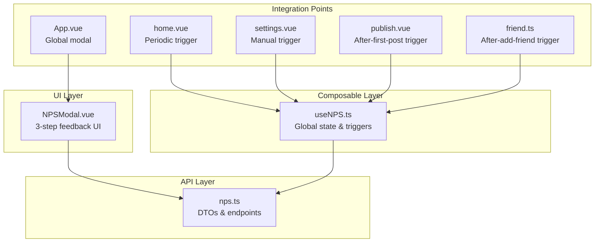
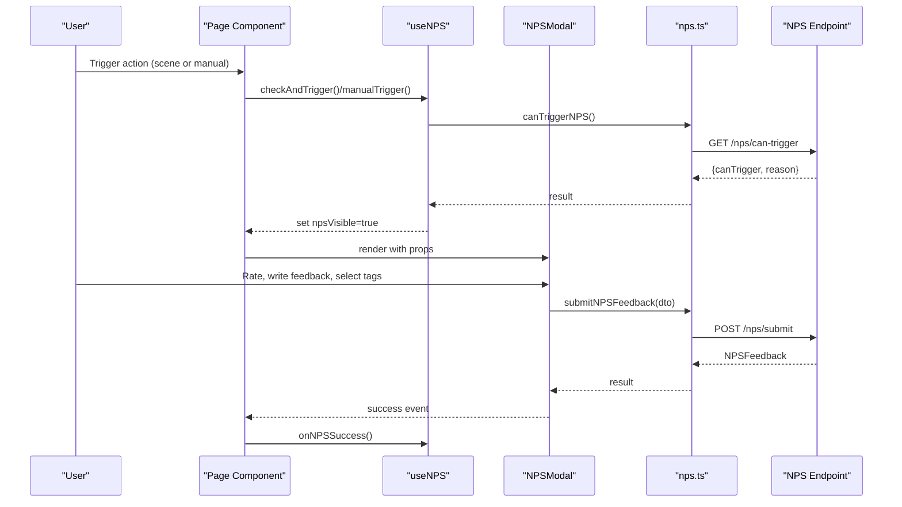
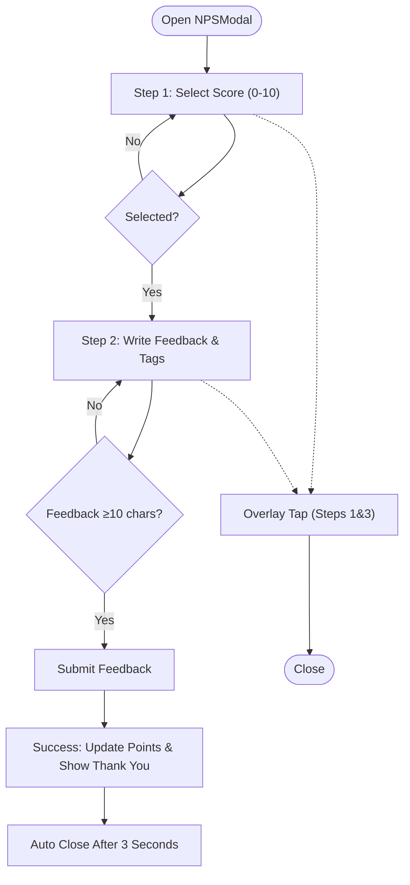
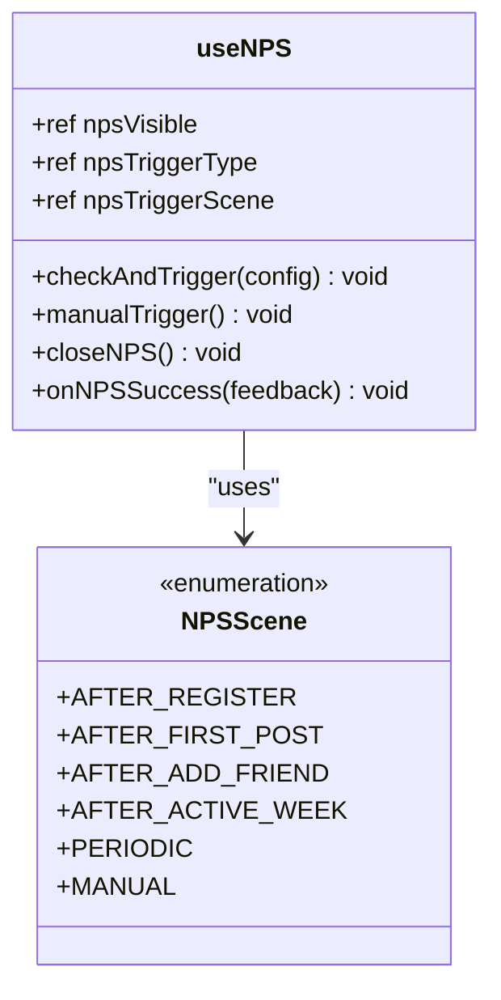
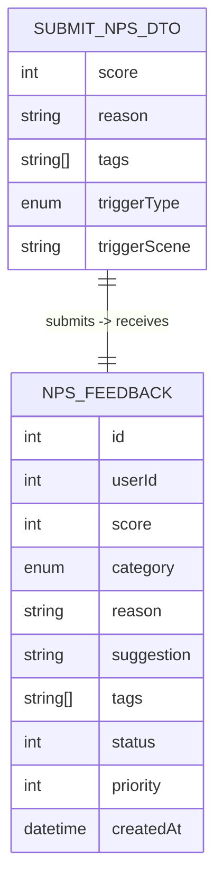
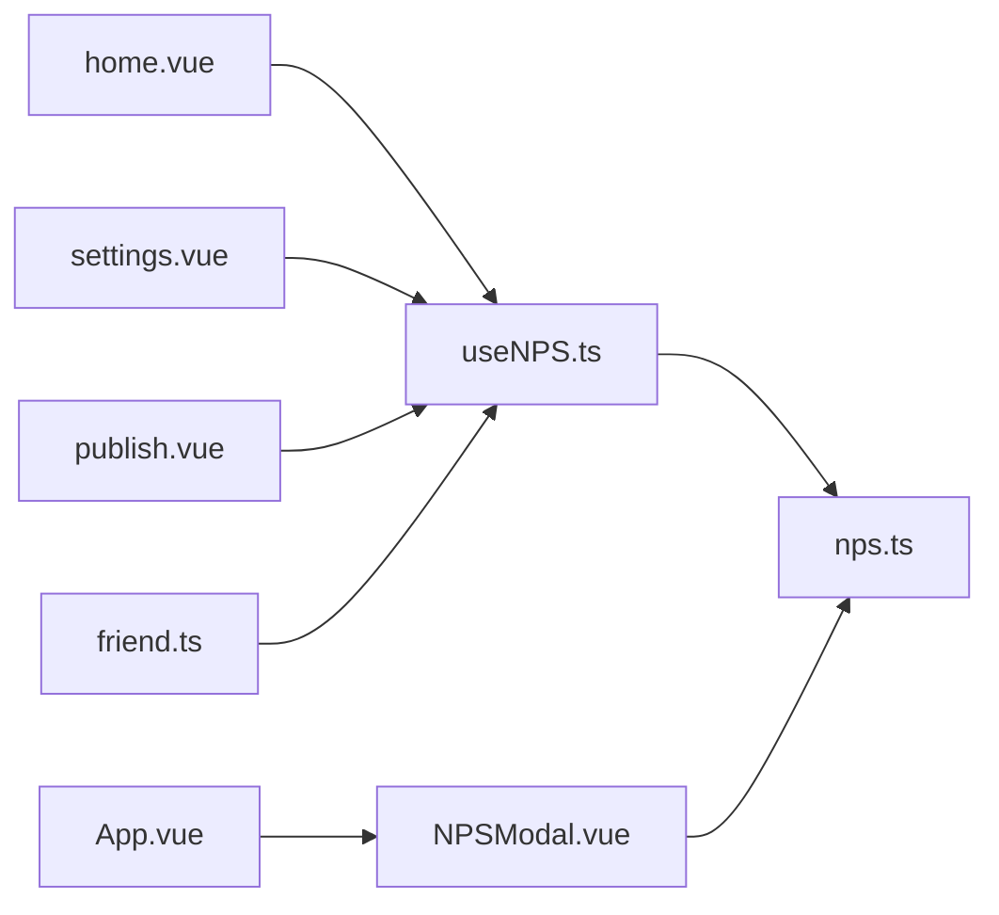

# Survey & Feedback Components

<cite>
**Referenced Files in This Document**
- [NPSModal.vue](file://src/components/business/NPSModal.vue)
- [useNPS.ts](file://src/composables/useNPS.ts)
- [nps.ts](file://src/api/nps.ts)
- [nps-frontend-guide.md](file://docs/nps-frontend-guide.md)
- [nps-implementation.md](file://docs/nps-implementation.md)
- [App.vue](file://src/App.vue)
- [home.vue](file://src/pages/tabbar/home.vue)
- [settings.vue](file://src/pages/user/settings.vue)
- [publish.vue](file://src/pages/square/publish.vue)
- [friend.ts](file://src/stores/friend.ts)
- [index.scss](file://src/assets/styles/index.scss)
</cite>

## Table of Contents
1. [Introduction](#introduction)
2. [Project Structure](#project-structure)
3. [Core Components](#core-components)
4. [Architecture Overview](#architecture-overview)
5. [Detailed Component Analysis](#detailed-component-analysis)
6. [Dependency Analysis](#dependency-analysis)
7. [Performance Considerations](#performance-considerations)
8. [Troubleshooting Guide](#troubleshooting-guide)
9. [Conclusion](#conclusion)
10. [Appendices](#appendices)

## Introduction
This document provides comprehensive documentation for the survey and feedback components in the WeTogether platform, focusing on the NPSModal component for Net Promoter Score collection. It covers the rating scale implementation, feedback form handling, submission workflow, modal presentation logic, rating selection animation, form validation, and integration with NPS API endpoints. It also includes user experience considerations for survey timing, frequency management, response tracking, customization options, styling modifications, and integration with analytics systems for feedback collection.

## Project Structure
The NPS feature is implemented across three primary layers:
- UI Component Layer: NPSModal.vue provides the interactive 3-step feedback flow.
- Composable Layer: useNPS.ts manages global NPS state and triggers across scenes.
- API Layer: nps.ts defines DTOs and integrates with backend endpoints.

**Diagram sources**
- [NPSModal.vue:1-550](file://src/components/business/NPSModal.vue#L1-L550)
- [useNPS.ts:1-145](file://src/composables/useNPS.ts#L1-L145)
- [nps.ts:1-43](file://src/api/nps.ts#L1-L43)
- [App.vue:1-103](file://src/App.vue#L1-L103)
- [home.vue:1-489](file://src/pages/tabbar/home.vue#L1-L489)
- [settings.vue:1-151](file://src/pages/user/settings.vue#L1-L151)
- [publish.vue:1-239](file://src/pages/square/publish.vue#L1-L239)
- [friend.ts:1-70](file://src/stores/friend.ts#L1-L70)

**Section sources**
- [NPSModal.vue:1-550](file://src/components/business/NPSModal.vue#L1-L550)
- [useNPS.ts:1-145](file://src/composables/useNPS.ts#L1-L145)
- [nps.ts:1-43](file://src/api/nps.ts#L1-L43)
- [nps-frontend-guide.md:1-334](file://docs/nps-frontend-guide.md#L1-L334)
- [nps-implementation.md:1-187](file://docs/nps-implementation.md#L1-L187)

## Core Components
- NPSModal.vue: Implements a 3-step feedback flow:
  - Step 1: 0–10 rating selection with dynamic active state styling.
  - Step 2: Text feedback with character count and up to 3 selectable tags.
  - Step 3: Thank-you screen with points reward and auto-close.
- useNPS.ts: Provides composable hooks for:
  - Global visibility and trigger metadata.
  - Scene-based triggers: periodic, after registration, after first post, after adding friends, after active week.
  - Manual trigger and success callbacks.
- nps.ts: Defines DTOs and API functions:
  - SubmitNPSDto for submission payload.
  - NPSFeedback for response model.
  - canTriggerNPS() and submitNPSFeedback() endpoints.

Key UX behaviors:
- Dynamic copy and tag sets based on score.
- Validation requiring at least 10 characters for feedback.
- Automatic points calculation (20–30 based on feedback length).
- Auto-close after success.

**Section sources**
- [NPSModal.vue:1-550](file://src/components/business/NPSModal.vue#L1-L550)
- [useNPS.ts:1-145](file://src/composables/useNPS.ts#L1-L145)
- [nps.ts:1-43](file://src/api/nps.ts#L1-L43)
- [nps-frontend-guide.md:1-334](file://docs/nps-frontend-guide.md#L1-L334)

## Architecture Overview
The NPS feature follows a layered architecture with clear separation of concerns:
- UI: NPSModal.vue renders the feedback steps and handles user interactions.
- State/Triggers: useNPS.ts centralizes trigger logic and global visibility.
- API: nps.ts encapsulates DTOs and HTTP requests.
- Integration: App.vue, home.vue, settings.vue, publish.vue, and friend.ts integrate triggers at strategic moments.

**Diagram sources**
- [useNPS.ts:18-76](file://src/composables/useNPS.ts#L18-L76)
- [NPSModal.vue:244-294](file://src/components/business/NPSModal.vue#L244-L294)
- [nps.ts:33-42](file://src/api/nps.ts#L33-L42)
- [home.vue:420-424](file://src/pages/tabbar/home.vue#L420-L424)
- [settings.vue:79-81](file://src/pages/user/settings.vue#L79-L81)
- [publish.vue:118-119](file://src/pages/square/publish.vue#L118-L119)
- [friend.ts:29-35](file://src/stores/friend.ts#L29-L35)

## Detailed Component Analysis

### NPSModal Component
NPSModal.vue implements a 3-step feedback flow with dynamic content and validation:
- Step 1: Rating selection with 11 buttons (0–10). Active button styling uses gradients and transitions.
- Step 2: Feedback textarea with character counter and warning state when below 10 characters. Up to 3 tags selectable with a limit toast.
- Step 3: Thank-you screen with animated emoji, personalized message, and points reward. Auto-closes after 3 seconds.

**Diagram sources**
- [NPSModal.vue:1-550](file://src/components/business/NPSModal.vue#L1-L550)

Key implementation highlights:
- Dynamic content: Titles, subtitles, placeholders, and tag lists change based on selected score.
- Validation: Feedback length enforced before enabling submit.
- Submission: Payload includes score, reason, tags, trigger type, and scene.
- Success handling: Emits success event and calculates points based on feedback length.

**Section sources**
- [NPSModal.vue:1-550](file://src/components/business/NPSModal.vue#L1-L550)

### useNPS Composable
useNPS.ts manages global NPS state and provides scene-based triggers:
- Global state: npsVisible, npsTriggerType, npsTriggerScene.
- Triggers:
  - checkAndTrigger(config): Calls canTriggerNPS(), delays display, and sets visibility.
  - manualTrigger(): Sets manual trigger type and scene, then shows modal.
  - closeNPS(): Resets visibility.
  - onNPSSuccess(feedback): Handles success callback with toast and potential downstream actions.
- Scenes: AFTER_REGISTER, AFTER_FIRST_POST, AFTER_ADD_FRIEND, AFTER_ACTIVE_WEEK, PERIODIC, MANUAL.

**Diagram sources**
- [useNPS.ts:1-145](file://src/composables/useNPS.ts#L1-L145)

**Section sources**
- [useNPS.ts:1-145](file://src/composables/useNPS.ts#L1-L145)

### API Integration (nps.ts)
nps.ts defines the contract for NPS operations:
- SubmitNPSDto: score, reason, tags, triggerType, triggerScene.
- NPSFeedback: server response model with category and timestamps.
- canTriggerNPS(): GET /nps/can-trigger.
- submitNPSFeedback(data): POST /nps/submit.

**Diagram sources**
- [nps.ts:3-23](file://src/api/nps.ts#L3-L23)

**Section sources**
- [nps.ts:1-43](file://src/api/nps.ts#L1-L43)

### Integration Scenarios
- Global integration: App.vue mounts NPSModal globally for consistent access.
- Periodic trigger: home.vue checks canTriggerNPS() with a 3-second delay on mount.
- Manual trigger: settings.vue exposes a “Feedback” entry that calls manualTrigger().
- After-first-post: publish.vue triggers NPS after successful post creation.
- After-add-friend: friend.ts triggers NPS after a follow action succeeds.

**Diagram sources**
- [App.vue:28-36](file://src/App.vue#L28-L36)
- [home.vue:420-424](file://src/pages/tabbar/home.vue#L420-L424)
- [settings.vue:79-81](file://src/pages/user/settings.vue#L79-L81)
- [publish.vue:118-119](file://src/pages/square/publish.vue#L118-L119)
- [friend.ts:29-35](file://src/stores/friend.ts#L29-L35)
- [useNPS.ts:18-76](file://src/composables/useNPS.ts#L18-L76)
- [nps.ts:33-42](file://src/api/nps.ts#L33-L42)

**Section sources**
- [App.vue:1-103](file://src/App.vue#L1-L103)
- [home.vue:1-489](file://src/pages/tabbar/home.vue#L1-L489)
- [settings.vue:1-151](file://src/pages/user/settings.vue#L1-L151)
- [publish.vue:1-239](file://src/pages/square/publish.vue#L1-L239)
- [friend.ts:1-70](file://src/stores/friend.ts#L1-L70)

## Dependency Analysis
- NPSModal depends on:
  - nps.ts for submitNPSFeedback and DTOs.
  - Vue reactivity (ref, computed) for state and derived UI.
- useNPS depends on:
  - nps.ts for canTriggerNPS and submitNPSFeedback.
  - Pages and stores to trigger NPS at appropriate moments.
- Global integration:
  - App.vue integrates NPSModal globally.
  - Pages integrate triggers via useNPS.

Potential circular dependencies:
- None observed between NPSModal, useNPS, and nps.ts.
- Integration points are unidirectional: pages/stores -> useNPS -> API.

External dependencies:
- uni-app APIs for toasts and navigation.
- SCSS for styling.

**Section sources**
- [NPSModal.vue:1-550](file://src/components/business/NPSModal.vue#L1-L550)
- [useNPS.ts:1-145](file://src/composables/useNPS.ts#L1-L145)
- [nps.ts:1-43](file://src/api/nps.ts#L1-L43)

## Performance Considerations
- Rendering cost: NPSModal uses a small DOM footprint with 11 buttons and a textarea; minimal layout thrashing expected.
- Network cost: Two lightweight API calls (GET and POST) with small payloads.
- Memory cost: Reactive refs for score, tags, and submission state; reset on close.
- UX delays: Delays (1–3 seconds) prevent interrupting user tasks and reduce perceived latency spikes.

Recommendations:
- Debounce frequent triggers to avoid overlapping modals.
- Cache canTriggerNPS decisions briefly to reduce redundant network calls.
- Lazy-load heavy assets only if added later.

[No sources needed since this section provides general guidance]

## Troubleshooting Guide
Common issues and resolutions:
- Modal does not appear:
  - Verify canTriggerNPS() returns canTrigger=true and delay is configured.
  - Confirm global integration in App.vue and page-level integration.
- Submit fails:
  - Ensure feedback length ≥10 and score is selected.
  - Check network errors and toast messages.
- Tag selection limit:
  - Limit is enforced client-side; ensure users are aware of the 3-tag cap.
- Auto-close timing:
  - Success screen auto-closes after 3 seconds; verify success event emission.

Validation and error handling:
- NPSModal validates input and shows toasts for invalid states.
- useNPS.onNPSSuccess provides a hook for downstream actions.

**Section sources**
- [NPSModal.vue:244-294](file://src/components/business/NPSModal.vue#L244-L294)
- [useNPS.ts:59-66](file://src/composables/useNPS.ts#L59-L66)

## Conclusion
The NPS feature in WeTogether is a well-structured, user-centric feedback system. NPSModal provides a smooth 3-step experience with dynamic content and validation, while useNPS centralizes trigger logic across scenes. The integration with nps.ts ensures clean DTOs and reliable API communication. Together with global integration in App.vue and targeted triggers in key pages, the system balances user experience with actionable insights.

[No sources needed since this section summarizes without analyzing specific files]

## Appendices

### User Experience Considerations
- Timing: Avoid immediate triggers; use 1–3 second delays to prevent interruption.
- Frequency: Enforce backend rules (45-day interval, quarterly caps, new user protection).
- Response tracking: Emit success events and update local state for analytics hooks.
- Accessibility: Ensure focus states and keyboard navigation for rating buttons and textarea.

**Section sources**
- [nps-frontend-guide.md:271-292](file://docs/nps-frontend-guide.md#L271-L292)

### Customization Options
- Styling:
  - Modify SCSS variables and component styles for colors, fonts, and spacing.
  - Adjust button sizes, borders, and transitions for rating buttons and tags.
- Content:
  - Customize titles, subtitles, placeholders, and tag lists per brand guidelines.
- Triggers:
  - Add new scenes by extending NPSScene and creating dedicated trigger functions.
- Analytics:
  - Integrate analytics events on step transitions, submit attempts, and success.

**Section sources**
- [NPSModal.vue:316-549](file://src/components/business/NPSModal.vue#L316-L549)
- [useNPS.ts:82-89](file://src/composables/useNPS.ts#L82-L89)
- [nps-frontend-guide.md:1-334](file://docs/nps-frontend-guide.md#L1-L334)

### Integration Examples
- Global modal: Mount NPSModal in App.vue for universal access.
- Periodic trigger: Call checkAndTrigger() with PERIODIC scene on home page mount.
- Manual trigger: Bind manualTrigger() to a settings menu item.
- Scene-specific triggers:
  - After-first-post: Call triggerAfterFirstPost() after successful post creation.
  - After-add-friend: Call triggerAfterAddFriend() after follow action.

**Section sources**
- [App.vue:28-36](file://src/App.vue#L28-L36)
- [home.vue:420-424](file://src/pages/tabbar/home.vue#L420-L424)
- [settings.vue:79-81](file://src/pages/user/settings.vue#L79-L81)
- [publish.vue:118-119](file://src/pages/square/publish.vue#L118-L119)
- [friend.ts:29-35](file://src/stores/friend.ts#L29-L35)

### API Definitions
- canTriggerNPS():
  - Method: GET
  - Path: /nps/can-trigger
  - Response: { canTrigger: boolean, reason?: string }
- submitNPSFeedback(dto):
  - Method: POST
  - Path: /nps/submit
  - Request: SubmitNPSDto
  - Response: NPSFeedback

**Section sources**
- [nps.ts:33-42](file://src/api/nps.ts#L33-L42)