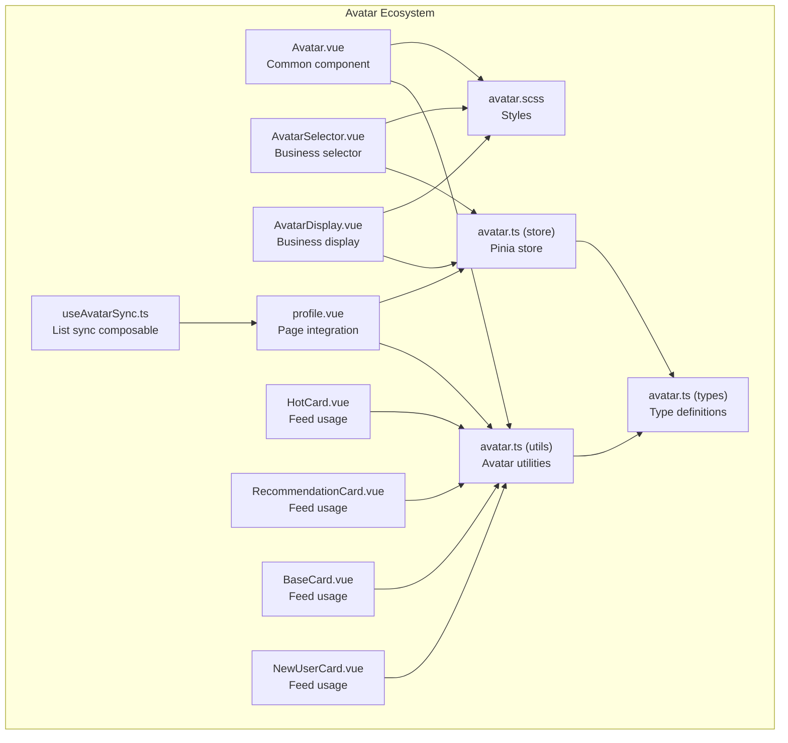
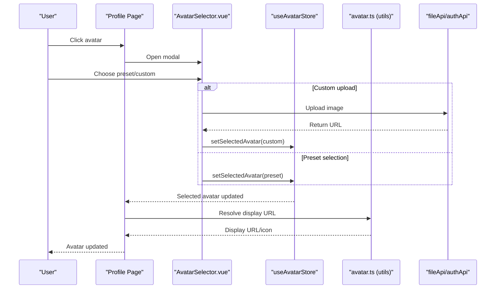
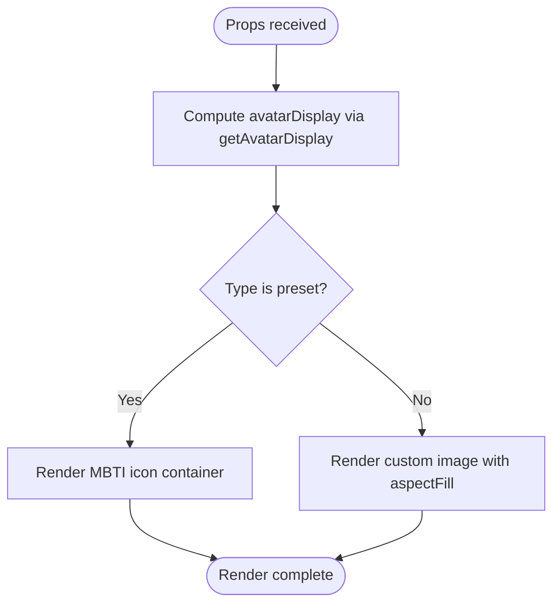
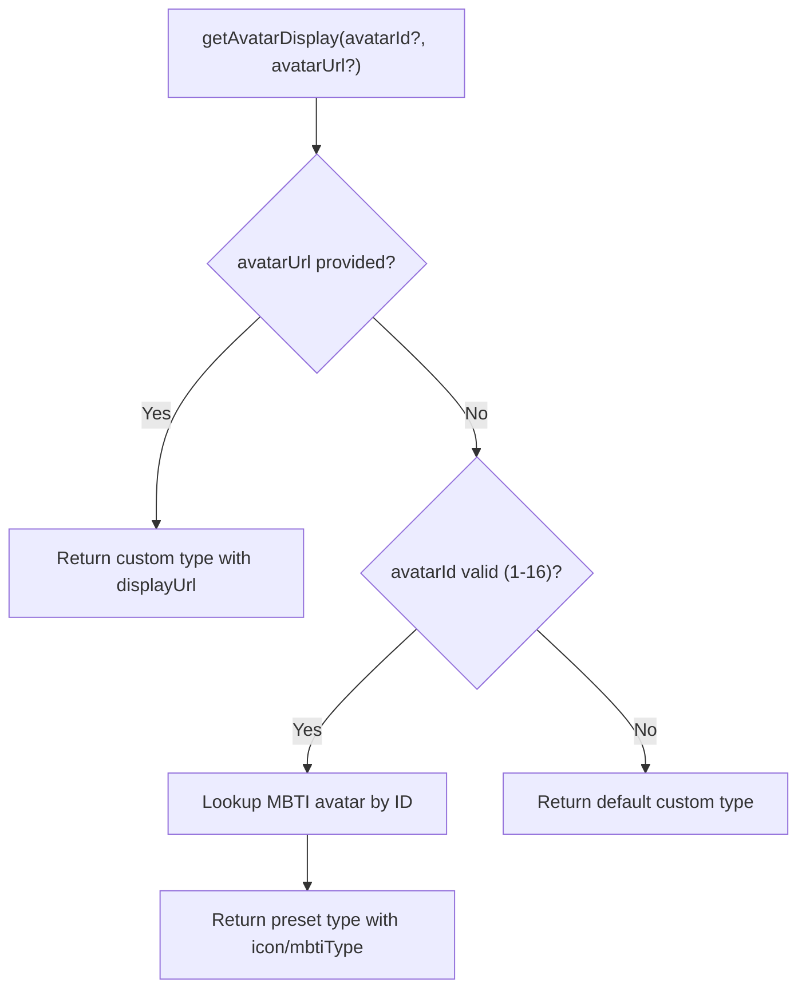
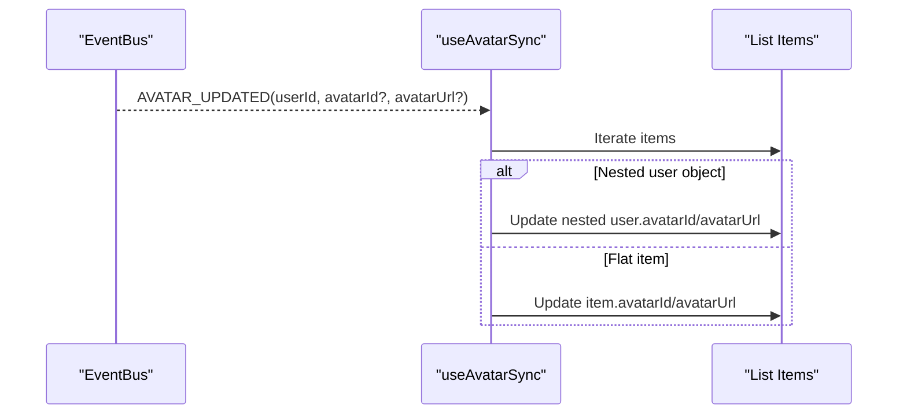
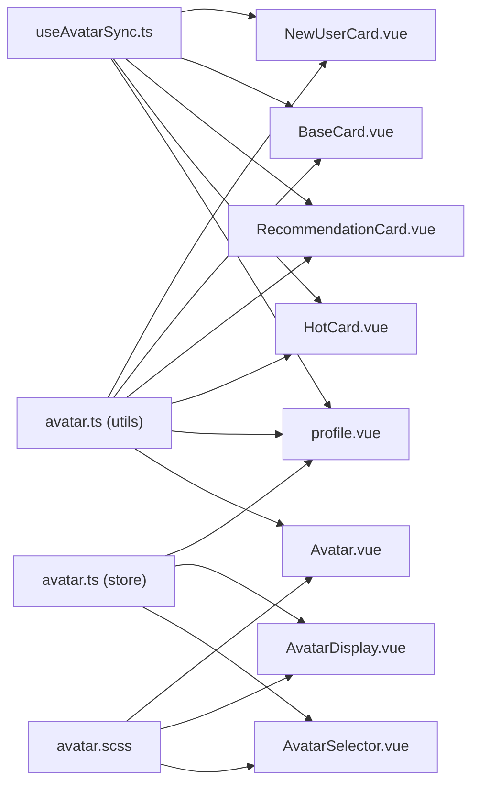

# Avatar Component

<cite>
**Referenced Files in This Document**
- [Avatar.vue](file://src/components/common/Avatar.vue)
- [avatar.ts](file://src/utils/avatar.ts)
- [avatar.ts](file://src/types/avatar.ts)
- [avatar.ts](file://src/stores/avatar.ts)
- [useAvatarSync.ts](file://src/composables/useAvatarSync.ts)
- [avatar.scss](file://src/assets/styles/avatar.scss)
- [AvatarSelector.vue](file://src/components/business/AvatarSelector.vue)
- [AvatarDisplay.vue](file://src/components/business/AvatarDisplay.vue)
- [profile.vue](file://src/pages/user/profile.vue)
- [HotCard.vue](file://src/pages/tabbar/home/components/HotCard.vue)
- [RecommendationCard.vue](file://src/pages/tabbar/home/components/RecommendationCard.vue)
- [BaseCard.vue](file://src/pages/tabbar/home/components/BaseCard.vue)
- [NewUserCard.vue](file://src/pages/tabbar/home/components/NewUserCard.vue)
- [AVATAR_PLAN.md](file://docs/AVATAR_PLAN.md)
</cite>

## Table of Contents
1. [Introduction](#introduction)
2. [Project Structure](#project-structure)
3. [Core Components](#core-components)
4. [Architecture Overview](#architecture-overview)
5. [Detailed Component Analysis](#detailed-component-analysis)
6. [Dependency Analysis](#dependency-analysis)
7. [Performance Considerations](#performance-considerations)
8. [Troubleshooting Guide](#troubleshooting-guide)
9. [Conclusion](#conclusion)
10. [Appendices](#appendices)

## Introduction
The Avatar component is a reusable UI element used across the WeTogether platform to display user profile images. It supports multiple avatar sources (predefined MBTI icons, custom uploaded images), responsive sizing, and integrates with avatar management utilities and stores. The component is designed to be flexible, accessible, and performant across H5, WeChat Mini Program, and native mobile environments.

## Project Structure
The Avatar ecosystem consists of:
- A lightweight Avatar component for rendering user avatars with size variants
- Utility functions for resolving avatar display URLs and MBTI avatar configurations
- Type definitions for avatar options and user profiles
- A Pinia store for managing selected avatar state
- A composable for synchronizing avatar updates across lists
- Styles for sprite-based avatar grids and selection UI
- Business components for avatar display and selection modals
- Page integrations demonstrating avatar usage in profile and feed contexts

**Diagram sources**
- [Avatar.vue:1-95](file://src/components/common/Avatar.vue#L1-L95)
- [AvatarSelector.vue:1-286](file://src/components/business/AvatarSelector.vue#L1-L286)
- [AvatarDisplay.vue:1-87](file://src/components/business/AvatarDisplay.vue#L1-L87)
- [avatar.ts:1-93](file://src/utils/avatar.ts#L1-L93)
- [avatar.ts:1-34](file://src/types/avatar.ts#L1-L34)
- [avatar.ts:1-52](file://src/stores/avatar.ts#L1-L52)
- [useAvatarSync.ts:1-72](file://src/composables/useAvatarSync.ts#L1-L72)
- [avatar.scss:1-753](file://src/assets/styles/avatar.scss#L1-L753)
- [profile.vue:1-717](file://src/pages/user/profile.vue#L1-L717)
- [HotCard.vue:1-213](file://src/pages/tabbar/home/components/HotCard.vue#L1-L213)
- [RecommendationCard.vue:1-35](file://src/pages/tabbar/home/components/RecommendationCard.vue#L1-L35)
- [BaseCard.vue:169-238](file://src/pages/tabbar/home/components/BaseCard.vue#L169-L238)
- [NewUserCard.vue:1-39](file://src/pages/tabbar/home/components/NewUserCard.vue#L1-L39)

**Section sources**
- [Avatar.vue:1-95](file://src/components/common/Avatar.vue#L1-L95)
- [avatar.ts:1-93](file://src/utils/avatar.ts#L1-L93)
- [avatar.ts:1-34](file://src/types/avatar.ts#L1-L34)
- [avatar.ts:1-52](file://src/stores/avatar.ts#L1-L52)
- [useAvatarSync.ts:1-72](file://src/composables/useAvatarSync.ts#L1-L72)
- [avatar.scss:1-753](file://src/assets/styles/avatar.scss#L1-L753)
- [AvatarSelector.vue:1-286](file://src/components/business/AvatarSelector.vue#L1-L286)
- [AvatarDisplay.vue:1-87](file://src/components/business/AvatarDisplay.vue#L1-L87)
- [profile.vue:1-717](file://src/pages/user/profile.vue#L1-L717)
- [HotCard.vue:1-213](file://src/pages/tabbar/home/components/HotCard.vue#L1-L213)
- [RecommendationCard.vue:1-35](file://src/pages/tabbar/home/components/RecommendationCard.vue#L1-L35)
- [BaseCard.vue:169-238](file://src/pages/tabbar/home/components/BaseCard.vue#L169-L238)
- [NewUserCard.vue:1-39](file://src/pages/tabbar/home/components/NewUserCard.vue#L1-L39)

## Core Components
- Avatar.vue: Lightweight component that renders either an MBTI icon avatar or a custom image, with size variants and click handling.
- AvatarSelector.vue: Modal-based selector for choosing predefined MBTI avatars or uploading custom images.
- AvatarDisplay.vue: Read-only display component with overlay edit affordance, integrated with the avatar store.
- avatar.ts (utils): Provides MBTI avatar configuration, lookup helpers, and avatar display resolution logic.
- avatar.ts (types): Defines AvatarOption and UserProfile interfaces for type safety.
- avatar.ts (store): Pinia store for managing selected avatar state and persistence.
- useAvatarSync.ts: Composable to synchronize avatar updates across lists via event bus.
- avatar.scss: Styles for sprite-based avatar grids, selection UI, and display containers.

Key capabilities:
- Sizing: small, medium, large via size prop
- Fallback: default avatar when no custom URL is provided
- Lazy loading: supported in feed/list contexts via native lazy-load attributes
- Accessibility: click handlers and semantic markup for interactive elements
- Cross-platform: compatible with H5, WeChat Mini Program, and native mobile via UniApp

**Section sources**
- [Avatar.vue:17-42](file://src/components/common/Avatar.vue#L17-L42)
- [AvatarSelector.vue:59-153](file://src/components/business/AvatarSelector.vue#L59-L153)
- [AvatarDisplay.vue:24-42](file://src/components/business/AvatarDisplay.vue#L24-L42)
- [avatar.ts:53-92](file://src/utils/avatar.ts#L53-L92)
- [avatar.ts:9-33](file://src/types/avatar.ts#L9-L33)
- [avatar.ts:9-51](file://src/stores/avatar.ts#L9-L51)
- [useAvatarSync.ts:9-71](file://src/composables/useAvatarSync.ts#L9-L71)
- [avatar.scss:1-753](file://src/assets/styles/avatar.scss#L1-L753)

## Architecture Overview
The Avatar system follows a modular architecture:
- Presentation layer: Avatar.vue for rendering, AvatarSelector.vue and AvatarDisplay.vue for selection and display
- Utilities: avatar.ts resolves avatar display URLs and MBTI configurations
- State management: Pinia store persists selected avatar and exposes getters for display
- List synchronization: useAvatarSync listens to global events to update avatar fields in lists
- Styles: avatar.scss defines sprite grids and modal UI

**Diagram sources**
- [profile.vue:182-294](file://src/pages/user/profile.vue#L182-L294)
- [AvatarSelector.vue:134-152](file://src/components/business/AvatarSelector.vue#L134-L152)
- [avatar.ts:53-92](file://src/utils/avatar.ts#L53-L92)
- [avatar.ts:26-46](file://src/stores/avatar.ts#L26-L46)

## Detailed Component Analysis

### Avatar.vue
Purpose: Render user avatars with size variants and fallback behavior.
- Props:
  - avatarId: number (optional) – MBTI avatar identifier
  - avatarUrl: string (optional) – custom avatar URL
  - size: 'small' | 'medium' | 'large' (default: 'medium')
- Behavior:
  - Uses getAvatarDisplay to resolve display URL and type
  - Renders MBTI icon when type is preset; otherwise renders custom image
  - Emits click event for parent handling
- Styles:
  - Container with rounded corners and background
  - Size classes for small/medium/large with proportional icon sizing

**Diagram sources**
- [Avatar.vue:31-41](file://src/components/common/Avatar.vue#L31-L41)
- [avatar.ts:53-92](file://src/utils/avatar.ts#L53-L92)

**Section sources**
- [Avatar.vue:17-42](file://src/components/common/Avatar.vue#L17-L42)
- [avatar.ts:53-92](file://src/utils/avatar.ts#L53-L92)

### avatar.ts (utilities)
Responsibilities:
- MBTI avatar configuration with 16 types and associated icons
- Lookup functions by ID or type
- getAvatarDisplay:
  - Prefers custom avatar URL if provided
  - Falls back to MBTI preset if avatarId is valid
  - Defaults to a static default avatar URL otherwise

**Diagram sources**
- [avatar.ts:53-92](file://src/utils/avatar.ts#L53-L92)

**Section sources**
- [avatar.ts:12-92](file://src/utils/avatar.ts#L12-L92)

### avatar.ts (types)
Defines:
- AvatarOption: type, value, displayUrl
- UserProfile: avatarType, avatarValue, avatarUrl, plus basic user info

These types ensure consistent handling of avatar data across components and stores.

**Section sources**
- [avatar.ts:9-33](file://src/types/avatar.ts#L9-L33)

### avatar.ts (store)
Manages:
- selectedAvatar: reactive AvatarOption
- setSelectedAvatar: mutation
- getAvatarUrl: returns sprite class for presets or display URL for custom

Persistence: store is persisted across sessions.

**Section sources**
- [avatar.ts:9-51](file://src/stores/avatar.ts#L9-L51)

### useAvatarSync.ts
Purpose: Keep avatar fields in lists synchronized when global avatar updates occur.
- Observes AVATAR_UPDATED events
- Supports nested user objects and flat items
- Updates avatarId and avatarUrl fields in-place

**Diagram sources**
- [useAvatarSync.ts:27-58](file://src/composables/useAvatarSync.ts#L27-L58)

**Section sources**
- [useAvatarSync.ts:9-71](file://src/composables/useAvatarSync.ts#L9-L71)

### avatar.scss
Highlights:
- Sprite-based avatar grid with 49 positions (7x7)
- Avatar selector modal styles with tabs and grid layout
- Display container styles with edit overlay
- Responsive sizing and hover/active states

**Section sources**
- [avatar.scss:1-753](file://src/assets/styles/avatar.scss#L1-L753)

### AvatarSelector.vue
Features:
- Tabs: Preset (MBTI) and Custom upload
- Preset grid: 7x7 sprite grid with selection feedback
- Custom upload: chooseImage API integration, preview, and confirmation
- Emits confirm/cancel events for parent handling

**Section sources**
- [AvatarSelector.vue:1-286](file://src/components/business/AvatarSelector.vue#L1-L286)

### AvatarDisplay.vue
Features:
- Displays selected avatar from store
- Edit overlay triggers select event
- Integrates with avatar store for seamless editing flow

**Section sources**
- [AvatarDisplay.vue:1-87](file://src/components/business/AvatarDisplay.vue#L1-L87)

### Page Integration: profile.vue
Demonstrates:
- Avatar display with MBTI fallback
- Modal-based avatar selection with preset and custom tabs
- Upload flow for custom avatars
- Save action sends avatarId or avatarUrl depending on selection

**Section sources**
- [profile.vue:1-717](file://src/pages/user/profile.vue#L1-L717)

### Feed Usage Examples
- HotCard.vue, RecommendationCard.vue, BaseCard.vue, NewUserCard.vue: Use image components with lazy-load enabled and consistent avatar sizing in user info rows.

**Section sources**
- [HotCard.vue:10-33](file://src/pages/tabbar/home/components/HotCard.vue#L10-L33)
- [RecommendationCard.vue:5-34](file://src/pages/tabbar/home/components/RecommendationCard.vue#L5-L34)
- [BaseCard.vue:180-186](file://src/pages/tabbar/home/components/BaseCard.vue#L180-L186)
- [NewUserCard.vue:10-33](file://src/pages/tabbar/home/components/NewUserCard.vue#L10-L33)

## Dependency Analysis
- Avatar.vue depends on avatar utilities for display resolution
- AvatarSelector.vue and AvatarDisplay.vue depend on the avatar store
- Profile page integrates both utilities and store for full avatar lifecycle
- useAvatarSync depends on event bus and auth store to target list updates
- Styles are shared across components via avatar.scss

**Diagram sources**
- [Avatar.vue:19-32](file://src/components/common/Avatar.vue#L19-L32)
- [avatar.ts:53-92](file://src/utils/avatar.ts#L53-L92)
- [avatar.ts:26-46](file://src/stores/avatar.ts#L26-L46)
- [useAvatarSync.ts:25-58](file://src/composables/useAvatarSync.ts#L25-L58)
- [avatar.scss:1-753](file://src/assets/styles/avatar.scss#L1-L753)
- [profile.vue:138-177](file://src/pages/user/profile.vue#L138-L177)
- [HotCard.vue:10-33](file://src/pages/tabbar/home/components/HotCard.vue#L10-L33)
- [RecommendationCard.vue:5-34](file://src/pages/tabbar/home/components/RecommendationCard.vue#L5-L34)
- [BaseCard.vue:180-186](file://src/pages/tabbar/home/components/BaseCard.vue#L180-L186)
- [NewUserCard.vue:10-33](file://src/pages/tabbar/home/components/NewUserCard.vue#L10-L33)

**Section sources**
- [Avatar.vue:17-42](file://src/components/common/Avatar.vue#L17-L42)
- [avatar.ts:53-92](file://src/utils/avatar.ts#L53-L92)
- [avatar.ts:9-51](file://src/stores/avatar.ts#L9-L51)
- [useAvatarSync.ts:9-71](file://src/composables/useAvatarSync.ts#L9-L71)
- [avatar.scss:1-753](file://src/assets/styles/avatar.scss#L1-L753)
- [profile.vue:138-177](file://src/pages/user/profile.vue#L138-L177)
- [HotCard.vue:10-33](file://src/pages/tabbar/home/components/HotCard.vue#L10-L33)
- [RecommendationCard.vue:5-34](file://src/pages/tabbar/home/components/RecommendationCard.vue#L5-L34)
- [BaseCard.vue:180-186](file://src/pages/tabbar/home/components/BaseCard.vue#L180-L186)
- [NewUserCard.vue:10-33](file://src/pages/tabbar/home/components/NewUserCard.vue#L10-L33)

## Performance Considerations
- Lazy loading: Feed components use native lazy-load attributes on image tags to defer loading until needed.
- Sprite-based avatars: 7x7 grid reduces HTTP requests and improves perceived performance.
- Minimal reactivity: Avatar.vue computes display once per render; utilities avoid repeated lookups.
- Event-driven updates: useAvatarSync minimizes redundant computations by updating only affected list items.

Best practices:
- Prefer sprite avatars for static grids to reduce bandwidth.
- Use lazy-load for avatar images in long lists.
- Cache resolved display URLs when possible.
- Avoid unnecessary re-renders by passing stable props.

**Section sources**
- [HotCard.vue:32-33](file://src/pages/tabbar/home/components/HotCard.vue#L32-L33)
- [RecommendationCard.vue:32-33](file://src/pages/tabbar/home/components/RecommendationCard.vue#L32-L33)
- [BaseCard.vue:181-182](file://src/pages/tabbar/home/components/BaseCard.vue#L181-L182)
- [NewUserCard.vue:31-32](file://src/pages/tabbar/home/components/NewUserCard.vue#L31-L32)
- [avatar.scss:1-25](file://src/assets/styles/avatar.scss#L1-L25)

## Troubleshooting Guide
Common issues and resolutions:
- Missing avatar URL: getAvatarDisplay falls back to a default avatar URL; verify avatarUrl prop or avatarId.
- Incorrect MBTI avatar: ensure avatarId is within 1-16; otherwise defaults to custom.
- Selection not reflected: ensure setSelectedAvatar is called and store is persisted.
- List avatar not updating: dispatch AVATAR_UPDATED event with userId and avatar fields; useAvatarSync will update matching items.
- Upload failures: check fileApi.uploadAvatar response and error handling in profile page.

**Section sources**
- [avatar.ts:86-92](file://src/utils/avatar.ts#L86-L92)
- [avatar.ts:26-46](file://src/stores/avatar.ts#L26-L46)
- [useAvatarSync.ts:27-58](file://src/composables/useAvatarSync.ts#L27-L58)
- [profile.vue:283-294](file://src/pages/user/profile.vue#L283-L294)

## Conclusion
The Avatar component provides a robust, scalable solution for displaying user avatars across WeTogether. It balances flexibility (MBTI presets and custom uploads), performance (sprite grids and lazy loading), and maintainability (clear utilities, types, and store). The ecosystem integrates seamlessly with page components and list synchronization, ensuring consistent user experiences across H5, WeChat Mini Program, and native mobile platforms.

## Appendices

### Prop Configuration Reference
- Avatar.vue props:
  - avatarId: number (optional)
  - avatarUrl: string (optional)
  - size: 'small' | 'medium' | 'large'

- AvatarSelector.vue emits:
  - confirm: AvatarOption
  - cancel: []

- AvatarDisplay.vue emits:
  - select: []

- useAvatarSync options:
  - userIdField: string (default: 'userId')
  - avatarIdField: string (default: 'avatarId')
  - avatarUrlField: string (default: 'avatarUrl')
  - nestedUserField: string (default: 'user')

**Section sources**
- [Avatar.vue:21-29](file://src/components/common/Avatar.vue#L21-L29)
- [AvatarSelector.vue:68-71](file://src/components/business/AvatarSelector.vue#L68-L71)
- [AvatarDisplay.vue:31-33](file://src/components/business/AvatarDisplay.vue#L31-L33)
- [useAvatarSync.ts:11-23](file://src/composables/useAvatarSync.ts#L11-L23)

### Usage Examples Index
- Small avatar in feed cards: HotCard.vue, RecommendationCard.vue, BaseCard.vue, NewUserCard.vue
- Large avatar in profile header: profile.vue
- Avatar selection modal: AvatarSelector.vue
- Avatar display with edit overlay: AvatarDisplay.vue
- Avatar utility usage: profile.vue, feed components

**Section sources**
- [HotCard.vue:10-33](file://src/pages/tabbar/home/components/HotCard.vue#L10-L33)
- [RecommendationCard.vue:5-34](file://src/pages/tabbar/home/components/RecommendationCard.vue#L5-L34)
- [BaseCard.vue:180-186](file://src/pages/tabbar/home/components/BaseCard.vue#L180-L186)
- [NewUserCard.vue:10-33](file://src/pages/tabbar/home/components/NewUserCard.vue#L10-L33)
- [profile.vue:13-22](file://src/pages/user/profile.vue#L13-L22)
- [AvatarSelector.vue:1-286](file://src/components/business/AvatarSelector.vue#L1-L286)
- [AvatarDisplay.vue:1-87](file://src/components/business/AvatarDisplay.vue#L1-L87)